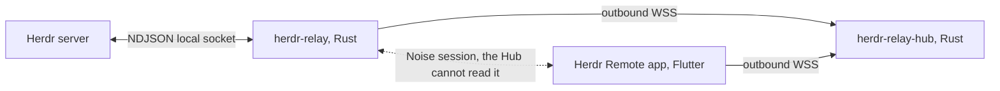

# Repository Guidelines

Instructions for every coding agent that works in this repository.

This file is the **single source** of agent guidance. It is self-contained on purpose: it uses no
`@` imports, because OpenAI Codex reads this file as plain text and does not expand them. Read
["Agent compatibility"](#agent-compatibility) before you add or move any instruction file.

## Project Overview

`herdr-mobile` is the **specification and planning repository** for Herdr Remote, a phone app that
gives a developer remote access to a running Herdr session. Herdr is a terminal workspace manager for
AI coding agents.

**Phase 0 has landed.** The native Rust workspace (`crates/`), the Flutter app skeleton (`app/`) and
the CI workflow (`.github/`) now exist and build, lint and test clean. Only Phase 0's scaffold is
real; no later phase's code exists yet. Every further code change MUST follow the phase, wave and
work-package ownership rules in `docs/90-implementation-plan.md` (R-90-016, R-90-017, R-90-023): a
package writes only the paths its `Owns.`/`Paths.` line names, and a shared path routes through the
`§5.3` registry. The following still do **not** exist here, and no document may claim they do:

| Absent | Where it is instead |
| --- | --- |
| `plugins/`, `herdr-plugin.toml` | Specified in `docs/10-herdr-integration.md`, built in a later phase |
| `hub/`, `go.mod` | Retired. The relay is Rust. See `docs/decisions/ADR-003-rust-host-and-relay.md` |
| `justfile`, any `just` recipe | Retired. See [Development Commands](#development-commands) for the commands that exist |
| `.herdr-api-schema.json` | Obtained at runtime with `herdr api schema --json` |
| `.omp/RULES.md` | Deleted. Its rules live in the "Hard rules" subsections below |

**Scope rule.** A code change MUST land only through the phase, wave and work-package process in
`docs/90-implementation-plan.md`. A docs-only change may still touch `docs/**`, the root guidance
files and `assets/**` freely. `docs/40-repo-tooling.md` §3.1 tracks the real tree as of each phase.

## Architecture & Data Flow

Three components and three role names. **Host** is the workstation, **Hub** is the relay, **Device**
is the phone.

| Component | Crate or package | Language | Runs on |
| --- | --- | --- | --- |
| Host plugin | `herdr-relay` | Rust, edition 2024 | Windows, Linux, macOS |
| Relay service | `herdr-relay-hub` | Rust, edition 2024 | Linux container |
| Shared protocol library | `herdr-relay-proto` | Rust, edition 2024 | Both of the above |
| App | Flutter project | Dart | Android, iOS |

Two languages, not three. The Host and the relay share one protocol crate, so the frame envelope, the
close-code enum, the error taxonomy and the test vectors exist once and the compiler enforces
agreement.



**One measured fact shaped the whole design: the Herdr socket API has no raw terminal byte stream.**
Output is observable only as a snapshot. So the data path is a snapshot path:

1. The plugin holds one long-lived connection subscribed to `pane.updated`.
2. Each event carries the whole pane object, including `revision`. When the revision of the watched
   pane moves, the plugin reads.
3. The read uses a **new** connection, `format: "ansi"`, `strip_ansi: false`. Debounce 120 ms, at most
   8 reads per second. `docs/10-herdr-integration.md` `R-10-029` and `R-10-030` set these limits.
4. The plugin encrypts the ANSI payload with Noise and sends it through the relay.
5. The app feeds it to a real terminal emulator, which paints the grid.

`docs/02-herdr-probe-results.md` holds the measurements. `docs/01-architecture.md` holds the
component boundaries and the data flows.

## Key Directories

`docs/` holds the specification and `assets/` holds brand art. One document owns one numeric rule
prefix, so the ownership map doubles as the directory index. `docs/01-architecture.md` section 8
carries the canonical version of this map; this table repeats it for agents.

| Prefix | Document | Owns |
| --- | --- | --- |
| `R-01` | `docs/01-architecture.md` | component boundaries, data flow, cross-document ownership index |
| `R-02` | `docs/02-herdr-probe-results.md` | measured Herdr socket facts |
| `R-03` | `docs/03-product-decisions.md` | user-set product policy |
| `R-10` | `docs/10-herdr-integration.md` | Herdr socket use, plugin manifest, watch loop |
| `R-11` | `docs/11-relay-protocol.md` | wire protocol, envelope, messages, close codes, error taxonomy, `agent_status` payload |
| `R-12` | `docs/12-relay-hosting.md` | relay architecture and hosting requirements |
| `R-13` | `docs/13-security-pairing.md` | cryptography, pairing, identity, revocation, secret storage |
| `R-14` | `docs/14-relay-deployment.md` | the supported public deployment profile |
| `R-15` | `docs/15-nvidia-brev-relay-experiment.md` | the internal Brev experiment and its gate |
| `R-20` | `docs/20-mobile-framework.md` | framework, dependency versions, project layout |
| `R-21` | `docs/21-terminal-rendering.md` | emulator, render strategy, font, input mapping |
| `R-22` | `docs/22-platform-integration.md` | keystore, biometrics, local notifications, deep links, background behaviour |
| `R-23` | `docs/23-public-release.md` | app-store metadata, release tracks, signing, versioning |
| `R-30` | `docs/30-ux-spec.md` | screens, flows, interaction model, states, accessibility behaviour |
| `R-31-<nn>` | `docs/31-mockups/<nn>-*.md` | one mockup per file, rules numbered `R-31-<nn>-<nn>` |
| `R-32` | `docs/32-design-language.md` | every visual value: colour, type, spacing, icons, components, motion |
| `R-33` | `docs/33-platform-chrome.md` | per-platform chrome, plain Cupertino on iOS, Material You on Android, native control map, terminal isolation |
| `R-40` | `docs/40-repo-tooling.md` | repository layout, documentation validation, future implementation tree |
| `R-41` | `docs/41-code-standards.md` | coding rules, formatters, linters, anti-patterns |
| `R-90` | `docs/90-implementation-plan.md` | the ordered plan and its gates |

**Never define a rule outside your own prefix.** Cite another document's rule by id, for example
`R-11-035`, instead of restating it. One fact lives in one place. `README.md`, `AGENTS.md`,
`CLAUDE.md`, `CONTRIBUTING.md` and `SECURITY.md` define no rules. They cite.

Other top-level items:

| Path | Purpose |
| --- | --- |
| `docs/31-mockups/` | One mockup per screen. |
| `docs/decisions/` | Architecture Decision Records, cited by file name. `CONTRIBUTING.md` holds the ADR process. |
| `assets/icon/src/` | The app-icon masters. `R-32-410` onward in `docs/32-design-language.md` specifies them. |
| `assets/icon/export/` | Generated exports: `android/`, `ios/`, `store/`. `docs/22-platform-integration.md` section 6A says where each file is copied. |
| Root config files | `.markdownlint-cli2.jsonc`, `.editorconfig`, `.gitignore`, `.gitattributes`. |

Brand art is not documentation, so it sits at the root rather than under `docs/`.

## Development Commands

There is no task runner, no package manifest and no committed script. Run these commands directly,
with these exact pinned versions. The Markdown command reads the committed
`.markdownlint-cli2.jsonc` at the root.

```bash
# Markdown structure
npx markdownlint-cli2@0.23.2 "**/*.md"

# Relative links, offline. Then an online pass for public URLs.
lychee --offline --no-progress "**/*.md"      # lychee 0.24.2
lychee --no-progress "**/*.md"

# Every Mermaid block parses, with no headless browser (R-40-057). Run the pinned command in
# docs/40-repo-tooling.md §8.3; it is one script, not restated here.
```

Useful read-only Herdr commands while working. `HERDR_ENV=1` means you are inside a Herdr pane.

```bash
herdr status                     # server state and the socket path
herdr api schema --json          # the full socket API schema
herdr api snapshot               # the live workspace, tab, pane and agent tree
herdr pane read <id> --source visible --format ansi
```

The rule audit and the completion checklist live in the `Testing & QA` section.

## Code Conventions & Common Patterns

**Simplified Technical English**, ASD-STE100. Short sentences. Active voice. One meaning per word.
Code, identifiers, paths and commands stay exact.

- One `H1` per document, outside a code fence. Numeric file prefixes order the documents; keep them.
- Every rule is numbered `R-<prefix>-<nnn>` and uses `MUST`, `MUST NOT`, `SHOULD` or `MAY`.
- Mermaid for every diagram. `- [ ]` for every implementation step.
- **A document decides.** It never leaves a choice to the reader. A genuine external dependency goes
  in `## Open questions` **with a recommended default**, and the body still states that default as
  the rule.
- A fact that can change over time carries a source in `## Sources`, with the URL and what it proved.
- Never leave `TODO`, `TBD`, an `R-xx-xxx` placeholder, "language undecided", "stale", or an
  `[UNVERIFIED]` marker without a named owner and a stated fallback.
- Decisions are already made. Read the document; do not re-decide it. If a document is wrong, say so
  and cite it. **Never diverge silently from the owning document.**

Prose wraps at **100 columns**. `.markdownlint-cli2.jsonc` sets that, and every rule it relaxes
carries a comment naming the reason. Never relax a rule without adding that comment, and never
silence a rule that catches a real defect. Do not run a formatter across the whole repository as a
side effect of an unrelated change.

### Hard rules

These are the rules that get broken most often here. They are short on purpose.

#### Never stop the Herdr server

Never stop, restart, kill or signal the Herdr server or `herdr.exe`. Never close a pane or mutate a
layout you did not create. Never kill processes by a name pattern such as `herdr`. Your own session
and other people's sessions run inside Herdr, so killing it kills them. Commands that do not breach
these prohibitions remain allowed, including the read-only commands in
[Development Commands](#development-commands), `herdr plugin link`,
`herdr plugin action invoke`, and panes you create yourself.

#### Herdr socket

- **One request per connection.** Never reuse one. `EPIPE` on a spent connection is the normal end of
  life, not an error.
- **Never send a request on the subscription connection.** It answers none.
- **Always send `params`**, even as `{}`. Omitting it is an `invalid_request`.
- **Read a result through its wrapped key**, `result.read` or `result.snapshot`, never `result`
  directly. `result.type` is the discriminator.
- **Take `revision` from an event or from `session.snapshot` only.** In a `pane.read` result it is
  always `0` and unpopulated.
- **Never read a pane just to detect change.** The event already carries `revision`.
- **Validate before forwarding to Herdr.** A malformed request closes the connection and returns an
  error with an empty `id`, which cannot be correlated.
- **Rows from `scroll.viewport_rows`, columns from `pane.layout` `rect.width`.** Never derive rows
  from `rect.height`; tab chrome adds 2 cells only in a split tab.
- **Never use `source: "detection"` for rendering.** It ignores `strip_ansi: false`.
- **Locate a plugin path through `HERDR_PLUGIN_ROOT`, never relatively.** On Windows, Herdr resolves
  a relative program against its own install directory, and the variable can carry a `\\?\` prefix
  that must be stripped.

#### Never log

Terminal content. Key material. A pairing phrase. A routing handle. A device id. A user path. This
product moves terminal content for a living, so one careless log line is a data leak. Log connection
metadata and counts.

Examples in documents use only the sample values in the owning document. Never write a real key, a
real handle or a real phrase, even as an illustration.

#### Never build

A cell-level diff, a local database, or an HTTP client. Each is already covered: the app persists
no terminal content by design, and one WebSocket carries everything. `R-01-010` in
`docs/01-architecture.md` covers the first two; `R-01-013` covers the WebSocket. A change that
adds one MUST cite a measurement showing the existing mechanism failed. Compression is not on
this list: it is a required, already-specified part of the wire protocol.
`docs/11-relay-protocol.md` §3.4 and §3.5 (`R-11-231` onward) specify the exact compress-then-
fragment design; read it before touching a compression call site.

#### Never hand-roll cryptography

Use the pinned Noise implementation per platform. `docs/13-security-pairing.md` defines the
Host/Device split, including where no ready-made library exists, and
`docs/20-mobile-framework.md` pins the versions.

#### Never spawn a console-visible child process

A console-subsystem binary, spawned as a child process from a console-less parent, gets a new,
visible, focus-stealing console window, as a side effect of the child's subsystem type. The
parent may be a background service or a scheduled task, not only an interactive terminal. A
Windows process-creation flag (`CREATE_NO_WINDOW`) applied to the direct child correctly and
completely suppresses this for a simple, non-forking binary. It can fail only for a multi-process
application that forks its own additional children inside its own compiled code, a path no
caller-supplied flag can reach. `R-40-057` in `docs/40-repo-tooling.md` names that multi-process
case: Puppeteer correctly hides `chrome-headless-shell.exe` itself, but Chrome's own internally
forked GPU, network and renderer children still pop a window, so Mermaid validation dropped the
browser rather than chase the flag. The `default_fetch` wordlist download in
`crates/herdr-relay/src/pairing/wordlist.rs` is the simple case: it shells out to a non-forking
`curl.exe`/`wget.exe`, while `herdr-relay` runs as a console-less Windows scheduled task
(`crates/herdr-relay/windows/ensure-service.ps1`), so the flag alone is the complete fix. The
hazard reaches shipped Host-plugin code this way, not only dev tooling. Try the creation flag
first; it is usually sufficient, and verify its actual effect from the real console-less parent,
not from an interactive-terminal test alone, before the code ships. Reserve full elimination of
the subprocess for a multi-process case like Chrome's, or for a case where the flag's effect
genuinely cannot be verified. This preference does not override [Never build](#never-build): when
elimination would need the HTTP client, database, or other item that section forbids, the
creation-flag fix above is the correct default, not a new dependency that section already rules
out. Amend [Never build](#never-build) explicitly first if a case genuinely cannot be solved
either way.

#### Never re-trigger a live-side-effect bug to verify its fix

Reproducing an ordinary bug to prove a fix catches it is normal, safe practice. A bug whose
failure mode is a live, externally-visible, disruptive effect on the real machine or the real
user's environment is different: reproducing it always causes that exact harm, even once, even
for a before/after comparison. [Never spawn a console-visible child
process](#never-spawn-a-console-visible-child-process) names one instance; a sent notification,
an external message send, and a changed system setting are others. Verify a fix for this class
structurally instead: inspect that the guard, flag, or code path is present and correctly
applied. If a live functional test is genuinely needed, build it so the unsafe path cannot
execute even in a failure or rollback branch, never by observing the harm actually occur.

#### Reuse ladder

Climb it and stop at the first rung that holds. Does it need to exist at all; does the platform do it
natively; does the standard library do it; does a dependency we already picked do it; only then new
code. A new dependency needs a one-line justification in the commit message that names the rung which
failed.

#### Path ownership, when you implement in parallel

The implementation phase is built to run many agents at once. `docs/90-implementation-plan.md` §5
splits the 26 phases into 47 work packages with ids of the form `WP-18-a`, gives every phase an
`**Owns.**` line, and holds a registry for every path that more than one phase touches. The peak
concurrency is 10 packages, against 3 at phase granularity.

- **Start only when every package on your `Needs.` line has reported.** `R-90-023`. A dependency is
  a real file or a real verdict, never a preference. `R-90-002`.
- **Write only the paths your package owns.** `R-90-016`. If you need a change in a path you do not
  own, the registry names the one owner and the one mechanism. `R-90-017`.
- **Do not run the full gate while siblings are in flight.** It fails on their half-finished work.
  `R-90-019` names who runs it and when.
- **Declare a contract before the wave starts, not during it.** `R-90-020`.
- **Report the exact paths you wrote**, so a reviewer can confirm ownership held. `R-90-021`.
- **A new path needs an owner in the same change that adds it** to the tree in
  `docs/40-repo-tooling.md` section 3.2. `R-90-018` gives the rule that picks the owner.

## Important Files

| File | Why it matters |
| --- | --- |
| `docs/90-implementation-plan.md` | **Start here.** The ordered checklist, gated by a documentation-readiness phase. |
| `docs/00-overview.md` | Purpose, hard requirements, non-goals, glossary, document map. |
| `docs/01-architecture.md` | Component boundaries, data flows, cross-document ownership index. |
| `docs/03-product-decisions.md` | The product owner's policy. Every other document defers to it. |
| `docs/02-herdr-probe-results.md` | Measured facts from a live Herdr server. Ground truth. |
| `docs/11-relay-protocol.md` | The exact wire messages. Build any one component from this alone. |
| `docs/33-platform-chrome.md` | Per-platform chrome, plain Cupertino on iOS, Material You on Android, native controls. |
| `docs/41-code-standards.md` | Formatters, linters, anti-patterns, review checklist. |
| `docs/40-repo-tooling.md` | Repository layout and the documentation checks. |
| `CONTRIBUTING.md` | The contributor process, the ADR process, the validation recipe. |
| `SECURITY.md` | What is sensitive here, and how to report a vulnerability. |

The single most useful external file, a working Rust Herdr socket client for all three platforms:

```text
C:/Development/Repositories/other/herdr-standalone/plugins/herdr-sidebar/plugins/herdr-sidebar/src/ipc.rs
```

It already solves the named pipe versus `AF_UNIX` split, the one-request-per-connection lifecycle, the
response size cap, and the fact that a Windows named-pipe handle has no read timeout in the Rust
standard library. Read it before writing a socket client.

## Runtime/Tooling Preferences

The documentation checks need `node` and `npx` and the `lychee` binary. Nothing is installed into
the repository: `npx` fetches the pinned versions on demand, and `package.json` does not exist. The
pinned versions appear in [Development Commands](#development-commands), in
`docs/40-repo-tooling.md` and in `CONTRIBUTING.md`.
The per-OS install commands and the reference editor are in `docs/40-repo-tooling.md` §7.1. The
future build prerequisites are in §7.2.

Internal NVIDIA URLs appear only in the internal appendix of
`docs/15-nvidia-brev-relay-experiment.md`. Check them only from the NVIDIA network.

### Agent compatibility

This repository is omp-centric and also works with OpenAI Codex and Claude Code. **Guidance text
exists in exactly one file.**

| File | Read by | Content |
| --- | --- | --- |
| `AGENTS.md` | omp, Codex, Cursor, Gemini CLI, Aider, Jules, Zed, goose, opencode, Warp, Copilot coding agent, and many more | This file. The single source of standing agent guidance. |
| `CLAUDE.md` | Claude Code only | A pointer. It holds the line `@AGENTS.md` and no guidance of its own. |

Rules for anyone who edits the guidance surface:

1. `AGENTS.md` is the only place standing agent guidance is written. Every other agent file points at
   it.
2. `AGENTS.md` MUST stay self-contained. It MUST NOT use an `@` import to deliver a rule, because
   Codex does not expand one.
3. `AGENTS.md` MUST stay under 32 KiB, because Codex truncates a project document at
   `project_doc_max_bytes`, which defaults to 32 KiB. Target under 400 lines.
4. `CLAUDE.md` MUST stay a pointer. A Claude-only instruction goes below the `@AGENTS.md` line and
   nowhere else.
5. To support one more agent that cannot read `AGENTS.md`, add a **pointer** file for it. **Never add
   a copy**, and record the addition in this section.
6. `README.md` is for humans, `AGENTS.md` is for agents, and `CONTRIBUTING.md` is for a contributor's
   process. Overlap is limited to the one-paragraph product summary.

`docs/decisions/ADR-006-agent-instruction-files.md` records this decision, the evidence and the
rejected alternatives, including why a `CLAUDE.md` symlink is not used.

## Testing & QA

Phase 0 has landed, so `crates/` and `app/` exist and carry their own test suites. Three things guard
quality: the component gates in `docs/40-repo-tooling.md` §7.2.3, the rules for tests against a real
Herdr server, and the documentation gate.

### Tests against a real Herdr server

Apply [Never stop the Herdr server](#never-stop-the-herdr-server). A test MUST NOT close a pane or
mutate layout it did not create. Read-only calls and panes the test created itself are fine. The
`Development Commands` section lists the read-only commands to use while working.

### Documentation gate

The gate is the rule audit plus every command in the `Development Commands` section. The audit must
produce observable output:

- Every cited `R-xx-nnn` is defined exactly once.
- Every document defines rules only inside its own numeric prefix.
- No placeholder `R-xx-xxx`, no `TODO`, no `TBD`, no unowned `[UNVERIFIED]` marker remains in
  normative text.

Before you finish, confirm: every relative link resolves, every Mermaid block parses, one `H1` per
document outside a fence, code fences balance, a final newline exists, `## Sources` lists every
mutable fact, and each `## Open questions` item is either a genuine external dependency with a stated
default or removed.
