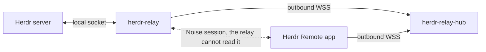

# herdr-mobile

Design and planning for **Herdr Remote**, a phone app that gives you remote access to a running
[Herdr](https://herdr.dev) session.

Herdr is a terminal workspace manager for AI coding agents. Herdr Remote lets you leave your desk,
then from an Android or iOS phone see which agents finished, read the terminal exactly as it looks on
your workstation, and type a reply.

The terminal is rendered natively on the phone. There is no screen sharing, no VNC and no video
streaming. Only structured commands and ANSI data cross the network, and they are end-to-end
encrypted, so the relay in the middle carries ciphertext it cannot read.

## Status

**The documentation-readiness gate is complete, and Phase 0 has landed.** The Rust workspace
(`crates/`) and the Flutter project (`app/`) are real, and the CI pipeline
(`.github/workflows/ci.yml`) builds, lints and tests them on every push.

Every design decision is made and written down, down to package versions, hex colours, font sizes
and timeouts. Every further change — Phase 1 onward — still follows the phase, wave and
work-package process in [`docs/90-implementation-plan.md`](docs/90-implementation-plan.md).

## Development requirements

Every version pin and every install command lives in one place:
[`docs/40-repo-tooling.md` §7](docs/40-repo-tooling.md#7-developer-environment). This section names
only what each kind of work needs. Read §7 for the exact versions.

| Work | What you need |
| --- | --- |
| Documentation | Git, Node.js with `npx`, and the `lychee` link checker |
| Native Host plugin | A running Herdr install and the Rust toolchain that `rust-toolchain.toml` selects |
| Flutter app | The Flutter SDK, which bundles Dart |
| Android app | A JDK, the Android SDK platform, build-tools and platform-tools at the pinned levels |
| Relay | A Docker client and Docker Engine only. No Linux build package, no host Rust |
| iOS app | A macOS machine with Xcode, the iOS SDK and CocoaPods |

Choose one Android setup. Both build the same app, and you do not need both:

1. **Android Studio.** Install Flutter separately. [Android Studio](https://developer.android.com/studio)
   supplies a JDK and the SDK Manager, which installs the pinned platform, build-tools and
   platform-tools. Add the Flutter plugin if you will edit or run the app in Android Studio. Use
   Device Manager if you want an emulator.
2. **Command-line tools.** Install a JDK and Google's
   [Command line tools only](https://developer.android.com/studio) package, then install the same
   pinned packages with `sdkmanager`. This route installs no emulator. Use a physical device, or add
   the emulator and a system image separately.

Android Studio is an IDE and an SDK manager. It is not a separate product dependency.

## Quick start

### Validate this repository today

The documentation-readiness gate is complete and Phase 0 has landed: `crates/` and `app/` are real.
Documentation still gates every later phase. After you clone it:

```bash
cd herdr-mobile
git --version
node --version
npx --version
lychee --version
npx markdownlint-cli2@0.23.2 "**/*.md"
lychee --offline --no-progress "**/*.md"
lychee --no-progress "**/*.md"
```

The documentation-readiness gate in
[`docs/90-implementation-plan.md`](docs/90-implementation-plan.md) is complete. Phase 0 has created
the Rust workspace, the relay Dockerfile and the Flutter project. Every later phase still follows
that plan's phase, wave and work-package process.

### Check the implementation toolchains

```bash
(cd crates && rustc --version)   # rust-toolchain.toml selects the pinned toolchain
flutter --version
flutter doctor -v
```

On Windows, verify the Docker Engine that runs inside WSL:

```powershell
wsl.exe -- docker version
```

### Launch the app

`app/` exists now that Phase 0 has landed:

```bash
flutter devices
cd app
flutter pub get
flutter run -d <device-id>
```

For a physical Android phone, enable Developer options and USB debugging. Confirm that `adb devices`
shows the phone, then use its serial number as `<device-id>`.

For an Android Studio emulator, start it in **Device Manager** before `flutter devices`. To launch
from Android Studio, open `app/`, select the device and run `lib/main.dart`.

An iOS launch uses the same `flutter run` command, but it must run on macOS with Xcode and CocoaPods.

### Launch the full product after its phases exist

1. Build and deploy the relay with Docker by following
   [`docs/14-relay-deployment.md`](docs/14-relay-deployment.md).
2. Link the Host plugin:

   ```bash
   herdr plugin link crates/herdr-relay
   ```

3. Open the pairing pane:

   ```bash
   herdr plugin action invoke herdr-relay pair
   ```

4. Launch the app with `flutter run`, then scan the pairing QR code.

The component build commands and device instructions live in
[`docs/40-repo-tooling.md` §7.2](docs/40-repo-tooling.md#72-for-the-future-implementation-phase).

## The three components

| Component | Crate or package | Language | Platform | Purpose |
| --- | --- | --- | --- | --- |
| Host plugin | `herdr-relay` | Rust | Windows, Linux, macOS | A Herdr plugin. Bridges the local Herdr socket to the relay, shows the pairing QR code, and manages paired phones. |
| Relay service | `herdr-relay-hub` | Rust | Linux container | Joins two streams and forwards opaque frames. Stores nothing, reads nothing. |
| Shared protocol | `herdr-relay-proto` | Rust | Both of the above | The frame envelope, message types, close codes and test vectors, defined once. |
| App | Flutter project | Dart | Android, iOS | Renders the terminal, sends input, raises a local notification when an agent finishes. |



**Host** is the workstation, **Hub** is the relay, **Device** is the phone. Those three names are used
throughout the documentation.

Two languages, not three. The Host and the relay share one protocol crate, so the wire format exists
once and the compiler enforces agreement between the two sides.

## What you supply

There is **no built-in relay**. You run your own, or you use one a person you trust runs. The pairing
link carries its address, so the app ships with no default server and phones home to nobody.
[`docs/14-relay-deployment.md`](docs/14-relay-deployment.md) is a copy-ready profile: one public Linux
VM, Docker and Caddy.

Pairing uses a QR code on the workstation. The fallback is six words you can read out loud. One phone
connects to a Host at a time, and a paired phone has full control of the terminal.

Notifications are **local notifications while the app is running**. There is no push service, so if
the operating system suspends the app you see the finished agent when you next open it. That is a
deliberate trade: a push pipeline would hand a third party the one thing this design refuses to leak.
See [`docs/decisions/ADR-005-local-notifications-only.md`](docs/decisions/ADR-005-local-notifications-only.md).

## Documentation

Read in order. Numeric prefixes order the files.

| Document | Contents |
| --- | --- |
| [`00-overview.md`](docs/00-overview.md) | Purpose, hard requirements, non-goals, glossary. |
| [`01-architecture.md`](docs/01-architecture.md) | Components, data flows, and the ownership index. |
| [`02-herdr-probe-results.md`](docs/02-herdr-probe-results.md) | Measured facts from a live Herdr server. Ground truth. |
| [`03-product-decisions.md`](docs/03-product-decisions.md) | The product owner's policy. Every document defers to it. |
| [`10-herdr-integration.md`](docs/10-herdr-integration.md) | How the plugin talks to Herdr, per platform. |
| [`11-relay-protocol.md`](docs/11-relay-protocol.md) | The exact wire protocol between Host, Hub and Device. |
| [`12-relay-hosting.md`](docs/12-relay-hosting.md) | Relay architecture and hosting requirements. |
| [`13-security-pairing.md`](docs/13-security-pairing.md) | Cryptography, pairing, device identity, revocation. |
| [`14-relay-deployment.md`](docs/14-relay-deployment.md) | The supported public deployment profile. |
| [`15-nvidia-brev-relay-experiment.md`](docs/15-nvidia-brev-relay-experiment.md) | An internal deployment experiment. Not a product dependency. |
| [`20-mobile-framework.md`](docs/20-mobile-framework.md) | The framework decision, the app stack, the pinned versions. |
| [`21-terminal-rendering.md`](docs/21-terminal-rendering.md) | Terminal emulator, render strategy, font, input. |
| [`22-platform-integration.md`](docs/22-platform-integration.md) | Keystore, biometrics, local notifications, deep links. |
| [`23-public-release.md`](docs/23-public-release.md) | App-store metadata, release tracks, signing, versioning. |
| [`30-ux-spec.md`](docs/30-ux-spec.md) | Screens, flows, interaction model, states, accessibility. |
| [`31-mockups/`](docs/31-mockups/) | One ASCII wireframe per screen, 18 files. |
| [`32-design-language.md`](docs/32-design-language.md) | Every visual value: colour, type, spacing, icons, components, motion. |
| [`33-platform-chrome.md`](docs/33-platform-chrome.md) | Per-platform chrome, plain Cupertino on iOS, Material You on Android, native control map, and terminal isolation. |
| [`40-repo-tooling.md`](docs/40-repo-tooling.md) | Repository layout and the documentation checks. |
| [`41-code-standards.md`](docs/41-code-standards.md) | Coding rules, formatters, linters, anti-patterns. |
| [`90-implementation-plan.md`](docs/90-implementation-plan.md) | The ordered checklist that builds the product. |

Each document states its own numbered rules, cited as `R-<prefix>-<nnn>`. One fact lives in one place,
and a document cites a rule instead of restating it.

Brand art lives at [`assets/icon/`](assets/icon/): authored masters in `src/`, and the generated
per-platform launcher, notification and store icons in `export/`. It sits at the root rather than
under `docs/` because it is a product asset, not documentation.
[`docs/32-design-language.md`](docs/32-design-language.md) specifies it and
[`docs/22-platform-integration.md`](docs/22-platform-integration.md) says where each exported file is
copied in the future app project.

## Why the design looks like this

One measured fact shaped everything: **the Herdr socket API has no raw terminal byte stream.** Output
is observable only as a snapshot, so the data path is a snapshot path. The plugin watches a `revision`
counter, reads the viewport as ANSI only when that counter moves, and ships it.

Three measurements made that affordable:

- A 50-row pane is about 8 KB of ANSI.
- It compresses to about 1.5 KB, and the platform WebSocket already negotiates the compression.
- When the revision has not moved, the text is byte-identical, so the read is skipped entirely.

A fourth measurement removed a whole class of work: across all 14 live panes, 3972 escape sequences
were 100 percent SGR colour and style, with zero cursor motion. Herdr already runs the VT state
machine, so `pane.read` returns a pre-flattened grid.

All of it is recorded, with the raw numbers, in
[`docs/02-herdr-probe-results.md`](docs/02-herdr-probe-results.md).

## Contributing

Read [`CONTRIBUTING.md`](CONTRIBUTING.md). A documentation contribution changes `docs/**` and the
root guidance files. A code contribution follows the phase, wave and work-package process in
`docs/90-implementation-plan.md`.

Check your work with the commands in the `Validate the documentation` section of `CONTRIBUTING.md`.
There is no task runner.

If you use an AI coding agent, it reads [`AGENTS.md`](AGENTS.md). That is the single source of agent
guidance; [`CLAUDE.md`](CLAUDE.md) is a one-line pointer to it, because Claude Code reads a different
filename. Never copy guidance between the two. See
[`docs/decisions/ADR-006-agent-instruction-files.md`](docs/decisions/ADR-006-agent-instruction-files.md).

## Licence

Apache License 2.0. See [`LICENSE`](LICENSE).

To report a vulnerability, read [`SECURITY.md`](SECURITY.md) first. Never put real terminal content,
a
real pairing phrase or a real key in a report.
