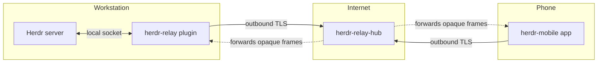

# Overview

## What this product does

`herdr-mobile` gives a developer remote access to a running Herdr session from a phone. Herdr is a
terminal workspace manager for AI coding agents. It organises terminals into workspaces, tabs and
panes, and it recognises coding agents running inside those panes.

A developer starts agents on a workstation, leaves the desk, and then wants three things from a
phone:

1. See which agents finished, which are still working, and which are blocked and waiting for an
   answer.
2. Read the terminal exactly as it looks on the workstation.
3. Type a reply or a command, and send it.

This repository holds the specification, the contributor and agent guidance, and — as of Phase 0 —
the implementation itself: the Rust workspace (`crates/`) and the Flutter project (`app/`) exist
and build, lint and test clean. Every further change still follows `docs/90-implementation-plan.md`
and its phase, wave and work-package process. The product display name is `Herdr Remote`
(`docs/03-product-decisions.md`). The project licence is Apache-2.0 (root `LICENSE`).

## The four deliverables

| Deliverable | Language | Runs on | Purpose |
| --- | --- | --- | --- |
| `herdr-relay` | Rust, edition 2024 | Windows, Linux, macOS | A Herdr plugin. It bridges the local Herdr socket API to the relay, renders the pairing QR code with the six-word phrase, and manages paired Devices. |
| `herdr-relay-hub` | Rust, edition 2024 | A Linux container | A relay. It joins a Host stream to a Device stream and forwards opaque frames. It stores nothing and reads nothing. |
| `herdr-relay-proto` | Rust, edition 2024 | Shared library | The frame envelope, close-code enum, error taxonomy, handle codec, phrase codec and protocol test vectors. Compiled into both of the above. |
| `herdr-mobile` | Dart (Flutter) | Android and iOS | The app. It renders a terminal, sends input, and raises a local notification when an agent finishes, while the app process is alive. |

Three role names appear in every document and every diagram:

- **Host** — the machine that runs Herdr and the `herdr-relay` plugin.
- **Hub** — the hosted relay.
- **Device** — the phone.

## Hard requirements

These come from the product owner. They are not negotiable, and every design decision defers to
them.

1. **Native terminal rendering.** The app MUST paint the terminal itself. Terminal video streaming,
   VNC, RDP and screen sharing of any kind are forbidden. Only structured commands and terminal data
   cross the network.
2. **1-to-1 fidelity.** The terminal on the phone MUST match the terminal on the workstation. A real
   VT emulator on the Device parses real ANSI from the Host. Fidelity comes from correct parsing,
   never from pixels.
3. **The relay never sees plaintext.** The relay behaves like a plain SSH tunnel. It forwards bytes
   and
   copies nothing. Terminal content and keystrokes are end-to-end encrypted between Host and Device.
4. **Cross-platform plugin.** The plugin MUST work on Windows, Linux and macOS installs.

5. **Operator-supplied relay, public reachability.** The relay MUST be reachable from the public
   internet over TLS on port 443, with no VPN, no enterprise MDM profile and no pre-installed
   certificate. The operator supplies the relay origin; pairing carries it to the app
   (`docs/03-product-decisions.md`, `docs/12-relay-hosting.md`).
6. **QR-first pairing with a six-word fallback.** The Host displays a QR code carrying the relay
   origin, a six-word EFF Diceware phrase, and a routing handle. Manual entry of the origin plus six
   words is the fallback. There is no numeric short code (`docs/03-product-decisions.md`,
   `docs/13-security-pairing.md`).
7. **Visible and revocable clients.** The Host MUST show which Devices are connected. It MUST be able
   to revoke one Device, revoke all Devices, and stop the relay connection entirely.
8. **Platform-native security and local notifications.** Secrets live in the Android Keystore and the
   iOS Keychain. Biometrics unlock the app. A native local notification arrives when an agent
   finishes, **only while the app process is alive**. There is no push notification infrastructure and
   no background-delivery guarantee (`docs/03-product-decisions.md`,
   `docs/decisions/ADR-005-local-notifications-only.md`).
9. **Reuse over reinvention.** Every component maps to an existing maintained library or service.
   Writing a terminal emulator, a crypto handshake, a tunnel or a notification pipeline is forbidden.

## Non-goals

Naming what this product does not do prevents scope creep later.

- No tablet-specific or desktop build of the app. Android and iOS phones only.
- No web client.
- No editing files on the Host from the phone. The terminal is the whole interface.
- No replacement for Herdr's own remote attach. `herdr --remote <ssh-target>` already serves a
  developer who has a terminal and an SSH path. This product serves a phone that has neither.
- No multi-user sharing. A Host pairs with the Devices of one person.
- No agent orchestration features that Herdr does not already expose.

- No background push delivery in version 1. Local notifications only while the app is running
  (`docs/decisions/ADR-005-local-notifications-only.md`).
- No read-only pairing. Every paired phone receives full control
  (`docs/03-product-decisions.md`).
- No more than one connected phone at a time. The relay rejects a second Device with
  `host_in_use` (`docs/03-product-decisions.md`, `docs/11-relay-protocol.md`).
- No built-in relay origin. The app ships with no default relay. Pairing supplies the first
  origin (`docs/03-product-decisions.md`).
- No connection to more than one computer at a time. The app saves many computers and connects to
  one. A switch disconnects the current computer first
  (`docs/03-product-decisions.md`, `docs/01-architecture.md`).

## Why the design looks the way it does

One measured fact shaped everything. **The Herdr socket API has no raw terminal byte stream.** Output
is observable only as a snapshot: `pane.read` returns the current viewport, and a `pane.updated`
event says when to read again.

So the data path is a snapshot path, not a stream path:

1. The plugin subscribes to `pane.updated` and watches the `revision` counter that each event carries.
2. When the revision of a watched pane moves, the plugin calls `pane.read` with `format: "ansi"` and
   `strip_ansi: false`.
3. The plugin encrypts that ANSI payload and sends it through the relay.
4. The app decrypts it and feeds it to a real VT emulator, which paints the grid.

Three measurements made this affordable. A 50-row pane costs about 8 KB of ANSI. That compresses to
about 1.5 KB. And when the revision has not moved, the text is byte-identical, so the read can be
skipped entirely. `docs/02-herdr-probe-results.md` records all of it.

## Document map

Read in this order. Each document states its own numbered rules, cited as `R-<prefix>-<nnn>`.

| Document | Contents |
| --- | --- |
| `00-overview.md` | This file. Purpose, requirements, non-goals. |
| `01-architecture.md` | Components, data flow, cross-cutting rules, cross-document ownership index. |
| `02-herdr-probe-results.md` | Measured facts from a live Herdr server. Ground truth for the transport. |
| `03-product-decisions.md` | User-set product policy. Public, vendor neutral, pairing, notifications, full control. |
| `10-herdr-integration.md` | How the plugin talks to Herdr, per platform. The plugin manifest. |
| `11-relay-protocol.md` | The wire protocol between Host, relay and Device. |
| `12-relay-hosting.md` | Relay architecture and hosting requirements. |
| `13-security-pairing.md` | Cryptography, pairing, Device identity and revocation. |
| `14-relay-deployment.md` | The relay-only Docker Compose profile with external operator TLS ingress. |
| `15-nvidia-brev-relay-experiment.md` | Internal NVIDIA Brev deployment experiment. Not a product dependency. |
| `20-mobile-framework.md` | The framework decision, the app stack, and the project layout. |
| `21-terminal-rendering.md` | The terminal emulator library, render strategy, font and input mapping. |
| `22-platform-integration.md` | Keystore, biometrics, local notifications, deep links, background behaviour. |
| `23-public-release.md` | App-store metadata, release tracks, signing, versioning. |
| `30-ux-spec.md` | Screens, flows, interaction model, states and accessibility behaviour. |
| `31-mockups/` | One ASCII wireframe file per screen. |
| `32-design-language.md` | Every visual value: colour, type, spacing, icons, components, motion. |
| `33-platform-chrome.md` | Per-platform chrome: plain Cupertino on iOS, Material You on Android, the native control map, and terminal isolation. |
| `40-repo-tooling.md` | Repository layout, documentation validation, future implementation tree. |
| `41-code-standards.md` | Coding rules, formatters, linters and anti-patterns. |
| `90-implementation-plan.md` | The ordered checklist that builds the product. Starts with the Documentation readiness gate. |
| `decisions/` | Architecture Decision Records. One ADR per settled architectural choice. |
| `CONTRIBUTING.md` | Contributor process: ownership map, rule-id convention, source citation, ADR format. |
| `SECURITY.md` | Vulnerability reporting, supported versions, sensitive-data disclosure requirements. |

## Glossary

| Term            | Meaning                                                                                        |
| --------------- | ---------------------------------------------------------------------------------------------- |
| Agent           | A coding agent running inside a Herdr pane, for example `omp`, `codex` or `claude`.              |
| Pane            | One terminal inside a Herdr tab. Identified as `w1:p1`.                                          |
| Tab             | A group of panes. Identified as `w1:t1`.                                                        |
| Workspace       | A group of tabs. Identified as `w1`.                                                            |
| `revision`      | A counter on a pane that increases when its content changes. The change token for the read loop. |
| Snapshot        | The result of `pane.read`: the current viewport as text or ANSI.                                |
| Pairing | The one-time exchange that links a Device to a Host, started by a QR code carrying a six-word Diceware phrase and a routing handle, or by manual entry of the same. |
| Pairing phrase | Six words selected from the EFF long Diceware list (7776 entries), joined by hyphens. The pre-shared key for the Noise handshake. Approximately 77.5 bits of entropy. |
| Routing handle | A 128-bit opaque identifier, encoded as 22 unpadded base64url characters. The relay reads it only to route streams. |
| relay origin | An HTTPS origin (scheme, host, optional port) stored by the app. Pairing supplies the first origin. The app has no compiled default. |
| Herdr Remote | The public display name of the app. `dev.herdr.remote` on both stores. |
| Agent state | One of `idle`, `working`, `blocked`, `done`, `unknown`. |
| `done` | The idle state reached after unseen background work finished. Drives a notification. |
| `blocked` | The agent waits for a person. Drives a notification. |
| Connected | The computer the app is currently linked to through the relay. One at a time. |
| Offline | The phone has no network connection. Not the same as a saved but not connected computer. |
| Saved | A computer whose pairing, keys and metadata the app stores. It is not connected. It shows its last-seen state with the time it was seen. This is a normal state, not an error. |
