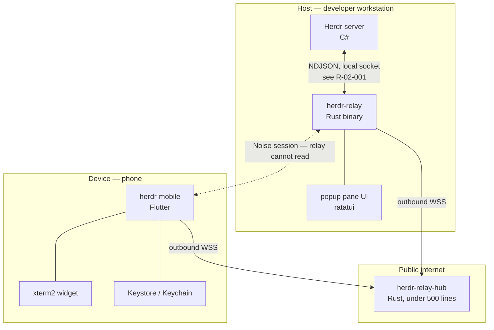
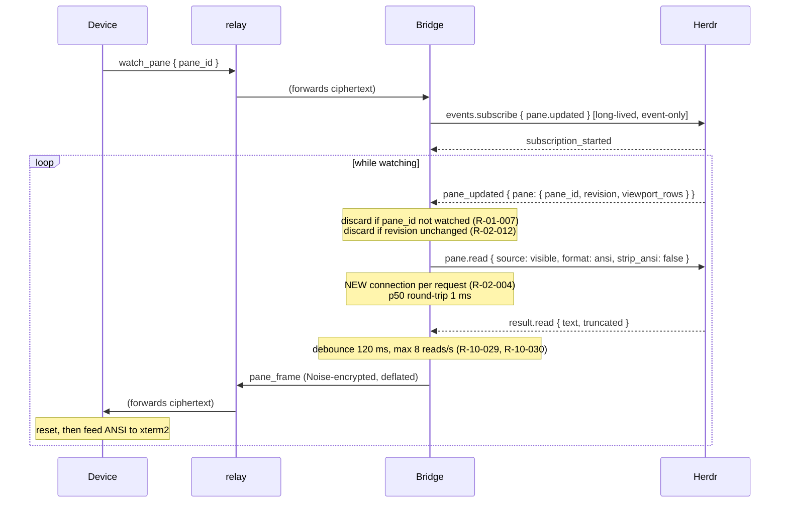
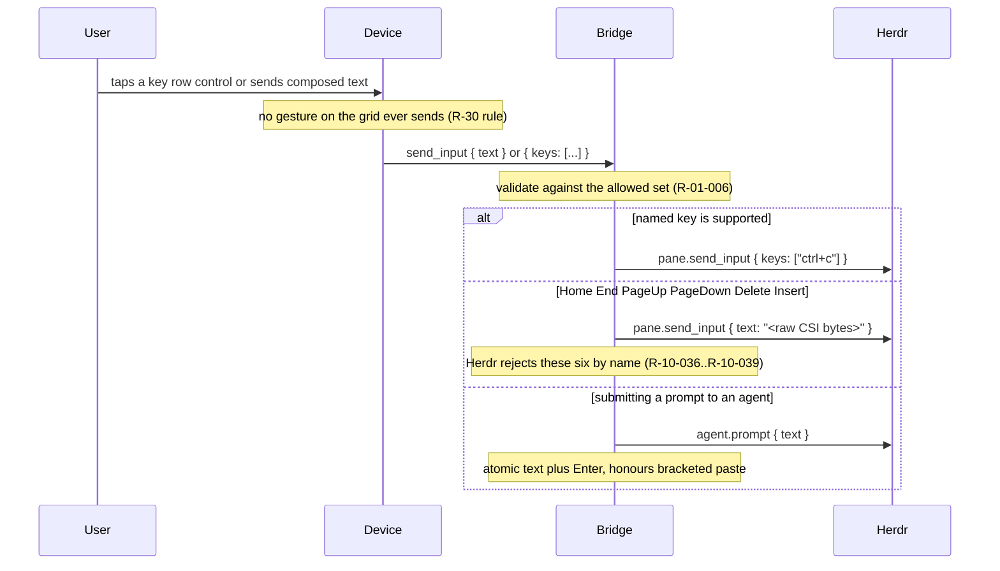
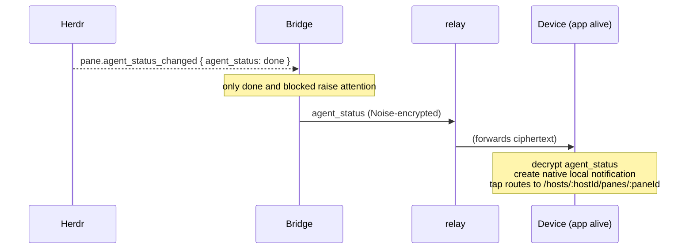
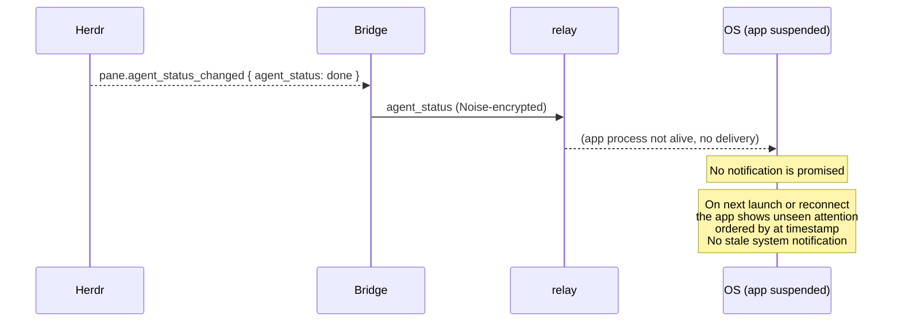
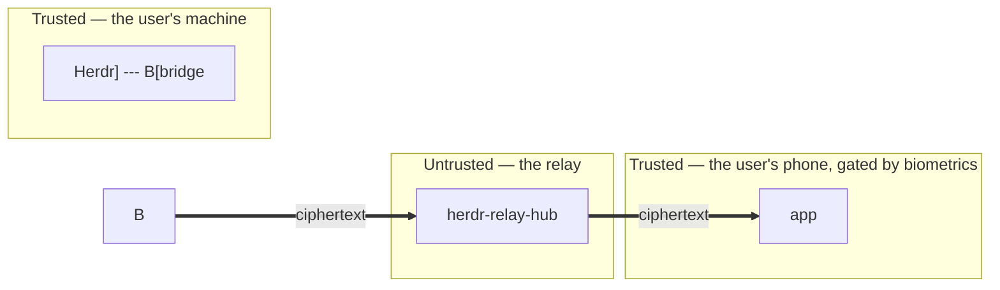

# Architecture and Data Flow

This document is a concise index of cross-document ownership plus the current data flows. Each fact
lives in one owning document, cited by rule id. This document states only the cross-cutting
architectural rules that no single document owns. It no longer claims to win over other documents.

Read `docs/00-overview.md` first for purpose and requirements.

## 1. Components

| Component | Language | Runs on | Lifetime |
| --- | --- | --- | --- |
| Herdr server | C# (.NET), not ours | Host | Owned by the user |
| `herdr-relay` | Rust, edition 2024 | Windows, Linux, macOS | Long-lived, supervised |
| `herdr-relay-hub` | Rust, edition 2024 | Linux container | Long-lived service |
| `herdr-relay-proto` | Rust, edition 2024 | Shared library | Compiled into both of the above |
| `herdr-mobile` | Dart (Flutter) | Android, iOS | Foreground only, no background wake |

Two languages, three deliverables, plus a shared protocol crate. The Host plugin (`herdr-relay`) and
the relay (`herdr-relay-hub`) share `herdr-relay-proto` by compilation, so the frame envelope, the
close-code enum, the error taxonomy, the handle codec, the phrase codec and the protocol test vectors
exist once instead of twice. This is the reason two languages beat three. See
`docs/decisions/ADR-003-rust-host-and-relay.md`.

The dotted line is the point of the whole design. The relay joins two byte streams. The Noise session
runs end to end between the Rust bridge and the Flutter app, so the relay carries ciphertext only.

The implementation layout is owned by `docs/40-repo-tooling.md`. As of Phase 0, `crates/` (the Rust
workspace) and `app/` (the Flutter project) exist and build, lint and test clean; there is still no
`plugins/`. Every further change follows the phase, wave and work-package process in
`docs/90-implementation-plan.md` (`docs/00-overview.md`).

## 2. Cross-cutting rules

These rules bind component boundaries or data flows that no single document owns. Every other
decision lives in an owning document; the rule index in section 8 points to it.

### R-01-005 Copy `herdr-sidebar/src/ipc.rs` rather than writing a socket client

The reference is at
<!-- markdownlint-disable-next-line MD013 -->
`C:/Development/Repositories/other/herdr-standalone/plugins/herdr-sidebar/plugins/herdr-sidebar/src/ipc.rs`.
It already solves every problem this bridge has: the named pipe on Windows versus `AF_UNIX` on POSIX,
one request per connection, a 5-second timeout, a 4 MiB response cap, and the fact that a Windows
named-pipe `File` has no `set_read_timeout` in the Rust standard library, so the read must be bounded
with a background thread.

**R-01-005**: The implementer MUST read that file before writing `src/ipc.rs`.

`herdr-sidebar` also supplies the popup pane pattern: `ratatui` 0.30 and `crossterm` 0.29. So the Host
popup pane in `docs/31-mockups/16-host-popup.md` is a `ratatui` screen.

### R-01-006 The Device never talks to Herdr

Only the bridge holds a Herdr connection. The Device speaks the protocol in
`docs/11-relay-protocol.md` and nothing else.

**R-01-006**: The Device MUST NOT be given a Herdr method name, a `pane_id` it did not receive from
the bridge, or any ability to construct a raw Herdr request. The bridge validates every request
before forwarding, because a malformed request costs the Herdr connection and returns an error with
an
empty `id` that cannot be correlated (`R-02-009`).

This keeps the trust boundary honest: a compromised Device reaches only the message set the protocol
defines.

### R-01-007 One watched pane at a time

There is no server-side pane filter, and idle `herdr-sidebar` panes emit about 9.8 events per second
on an otherwise idle machine (`R-02-013`).

**R-01-007**: The bridge MUST watch exactly one pane per Device. A request to watch a second pane
replaces the first. The bridge MUST discard an event for any pane it is not watching, before any
read.

Consequence, already reflected in the UX: no screen shows a text preview of a pane it is not watching.

### R-01-008 The Device needs an SGR parser, not a VT state machine

Measured across all 14 live panes: 3972 escape sequences, 100 percent SGR `CSI m`, with zero cursor
motion, erase, scroll region, `OSC` or mode switches, even for full-screen TUI applications on the
alternate screen (`R-02-018`). Herdr already ran the VT state machine and returns a flattened grid.

`xterm2` 5.2.0 is still the choice, and the reason is now precise. We depend on it for the **widget**:
text selection, scrollback gestures, pinch-to-zoom and input handling. We do **not** depend on it for
VT correctness (`R-21-001a`). Rebuilding a terminal widget to save one dependency would trade a small
risk for a large one.

**R-01-008**: The app MUST count unrecognised SGR codes and surface that count on the diagnostics
screen, expected value zero. The measured vocabulary is `0`, `1`, `2`, `3`, `4`, `38;2`, `48;2`,
`38;5`, `48;5`. A non-zero count means Herdr changed upstream and rendering is about to break
silently. This is the cheapest possible guard against the worst failure mode.

### R-01-009 Grid size comes from two different calls

**R-01-009**: Rows MUST come from `scroll.viewport_rows` on the pane object. Columns MUST come from
`pane.layout` `rect.width`, which is measured in character cells. Rows MUST NOT be derived from
`rect.height`, because tab chrome adds 2 cells in a split tab and 0 in a single-pane tab, so the
offset is not subtractable (`R-02-017`, `R-10-024`).

### R-01-010 No cell diff, no local database

Two things this product deliberately does not build, because an existing mechanism already covers
each:

| Tempting to build | Why we do not |
| --- | --- |
| Cell-level diff | Compression plus revision-gating already cuts 8 KB to about 1.5 KB (`R-02-016`, `R-20-012`). |
| A local database | The app persists no terminal content by design, so a store would create the very data the privacy posture denies (`R-22-035`). |

**R-01-010**: A change that adds either of the two MUST cite a measurement showing the existing
mechanism failed. Compression is not on this list: it is application-layer, pre-Noise-encrypt
zlib, already a required part of the wire protocol (`docs/11-relay-protocol.md` R-11-229 to
R-11-239), not a WebSocket-level feature this product opts out of.

### R-01-011 The notification carries no human-readable word outside the Noise session

The notification model is: Herdr emits `done` or `blocked`, the Host plugin sends an encrypted
`agent_status` application message through the relay, and the app creates a native local notification
if its process is alive. The `agent_status` payload and the tap route are owned by
`docs/11-relay-protocol.md`. The product policy is owned by `docs/03-product-decisions.md`. The
decision to omit push infrastructure is recorded in
`docs/decisions/ADR-005-local-notifications-only.md`.

**R-01-011**: Every human-readable word in the notification MUST arrive inside the Noise session. The
notification mechanism MUST NOT transmit terminal content, an agent name, a repository name, a path,
a pairing phrase or a routing handle through any channel that the Noise session does not protect.

If the operating system suspended or terminated the app, no notification is promised. On the next
launch or reconnect the app shows unseen attention state in-app. The app MUST NOT synthesise a stale
system notification.

### R-01-012 The relay performs no application-layer payload decryption

The relay forwards opaque binary frames. It holds no Noise keys.

**R-01-012**: The relay MUST NOT import a cryptography library beyond the TLS stack its HTTP and
WebSocket libraries link. It MUST NOT decrypt, inspect, log or persist any frame payload. The correct
claim is: **the relay performs no application-layer payload decryption and holds no Noise keys.**
The former claim "the Hub binary has zero crypto dependencies" is retired (`R-11-122`).

### R-01-013 One active Host connection

The app saves many Hosts and connects to one at a time, per `R-03-043`. The transport is one
WebSocket, per `R-22-025` and `R-20-009`. The relay maps one routing handle to one Host connection
and one Device connection, per `R-11-123`. A second Host needs a second handle and therefore a
second socket. A second socket is forbidden.

Consequence for notifications: an `agent_status` event can only arrive from the connected Host. The
UX states where this limit is visible, per `R-30-517`. The product policy is `R-03-045`.

Consequence for pairing: pairing a new Host requires a socket to that Host, which means the current
Host MUST disconnect before the pairing handshake starts, per `R-30-945`. If pairing then fails, the
person is left connected to nothing; the UX owns that landing state.

**R-01-013**: The app MUST reject a request to connect to a second Host while one is connected. A
switch disconnects the current Host first, per `R-03-044`, then connects to the chosen one.

## 3. Data flow: render

The steady-state loop. Numbers are the decided defaults and are tunable.

Two connections to Herdr exist at once, and they are not interchangeable:

1. **One long-lived subscription connection.** It receives events and answers no request (`R-02-006`).
2. **One short-lived connection per request.** It answers one request and half-closes (`R-02-004`).

Bytes on the wire, per frame, measured:

| Stage | Size |
| --- | --- |
| Herdr ANSI, 50-row pane | ~8 KB |
| After compression | ~1.2 to 1.9 KB |
| Frames per second, cap | 8 |
| Worst-case per pane | ~15 KB/s |

## 4. Data flow: input

A paired phone has full control over every pane action the Herdr socket API exposes, including
split, zoom, close, rename, resize, text input and agent prompt. There is no read-only pairing, no
read-only grant UI and no per-action Host approval flow. See `docs/03-product-decisions.md`
(R-03-050, R-03-051). A destructive action uses the phone-side confirmation that
`docs/30-ux-spec.md` owns (R-03-052).

Arrows MUST use the named path, because only Herdr knows the DECCKM state.

## 5. Data flow: notification

The trigger is on the Host. The notification is local only, while the app process is alive. There is
no push infrastructure, no APNs, no FCM and no background-delivery guarantee. See
`docs/decisions/ADR-005-local-notifications-only.md`.

**Suspended-app branch.** If the operating system suspended or terminated the app when the
`agent_status` message arrives:

The `agent_status` payload fields (`host_id`, `pane_id`, `workspace_id`, `tab_id`, `tab_title`,
`pane_title`, `agent_kind`, `status`, `at`) and the notification tap route
(`/hosts/:hostId/panes/:paneId`) are owned by `docs/11-relay-protocol.md`. The degenerate cases
(Host disconnected, pane closed, app locked, handle unknown) are owned by
`docs/30-ux-spec.md`.

## 6. Trust boundaries

| Boundary | What crosses | What the far side learns |
| --- | --- | --- |
| Bridge to relay | Noise ciphertext | Frame sizes, timing, source IP, the 22-character routing handle from the URL path. No content. |
| relay to Device | The same ciphertext | The same metadata. |

The relay learns the routing handle because it is in the URL path, and nothing else. `R-01-012` above
states the prohibition that keeps it that way.

## 7. What must be true for this to work

The honest list of load-bearing assumptions, each with the check that proves it and what to do if the
check fails. These are the risk spikes that `docs/90-implementation-plan.md` front-loads.

| Assumption | Check | If it fails |
| --- | --- | --- |
| The bridge can hold a subscription and read panes on all three platforms | Run the bridge on Windows, Linux and macOS; print a pane snapshot | The named pipe or `AF_UNIX` path handling is wrong. Re-read `ipc.rs`. |
| `pane.read` output stays SGR-only | Count unrecognised SGR codes; expect zero (`R-01-008`) | The Device needs a real VT emulator after all. `xterm2` already provides one, so the widget stands and only the reset strategy changes. |
| Noise completes through a real relay | Handshake between the bridge and a test client through the deployed relay | The relay is altering frames. It MUST be a pure byte forwarder. |
| A phone on cellular data completes a raw WSS upgrade through the deployed relay, with no browser authentication, no portal interception and no certificate error | Run the gate in `docs/15-nvidia-brev-relay-experiment.md` or the WSS verification in `docs/14-relay-deployment.md` R-14-040 | The relay deployment is unreachable from a mobile network. The operator must check DNS, the TLS ingress and its route to the relay (`R-14-031`), and the relay container health. |

## 8. Rule index

Where to look, by document. Every document owns one numeric rule prefix. No rule is defined
outside its owning prefix. Cite another document's rule by id.

| Document | Prefix | Owns |
| --- | --- | --- |
| `02-herdr-probe-results.md` | `R-02` | Measured Herdr socket facts |
| `03-product-decisions.md` | `R-03` | User-set product policy |
| `10-herdr-integration.md` | `R-10` | Herdr socket use, plugin manifest, watch loop |
| `11-relay-protocol.md` | `R-11` | Wire protocol, envelope, messages, close codes, error taxonomy, `agent_status` payload |
| `12-relay-hosting.md` | `R-12` | Relay architecture and hosting requirements |
| `13-security-pairing.md` | `R-13` | Cryptography, pairing, identity, revocation, secret storage |
| `14-relay-deployment.md` | `R-14` | The supported public deployment profile |
| `15-nvidia-brev-relay-experiment.md` | `R-15` | The internal Brev experiment and its gate |
| `20-mobile-framework.md` | `R-20` | Framework, dependency versions, project layout |
| `21-terminal-rendering.md` | `R-21` | Emulator, render strategy, font, input mapping |
| `22-platform-integration.md` | `R-22` | Keystore, biometrics, local notifications, deep links, background behaviour |
| `23-public-release.md` | `R-23` | App-store metadata, release tracks, signing, versioning |
| `30-ux-spec.md` | `R-30` | Screens, flows, interaction model, states, accessibility behaviour |
| `31-mockups/<nn>-*.md` | `R-31-<nn>` | One mockup per file |
| `32-design-language.md` | `R-32` | Every visual value: colour, type, spacing, icons, components, motion |
| `33-platform-chrome.md` | `R-33` | Per-platform chrome, plain Cupertino on iOS, Material You on Android, native control map, terminal isolation |
| `40-repo-tooling.md` | `R-40` | Repository layout, documentation validation, future implementation tree |
| `41-code-standards.md` | `R-41` | Coding rules, formatters, linters, anti-patterns |
| `90-implementation-plan.md` | `R-90` | The ordered plan and its gates |

Architecture decisions with permanent effect are recorded as ADRs in `docs/decisions/`. They carry no
rule prefix and are cited by file name:

| ADR | Decides |
| --- | --- |
| `ADR-001-plugin-stays-in-monorepo.md` | The `herdr-relay` plugin stays in one workspace with the relay and the shared proto crate |
| `ADR-002-bridge-is-rust.md` | The bridge is a Rust binary, not a pair of shell scripts |
| `ADR-003-rust-host-and-relay.md` | Both Host plugin and relay are Rust; Go is retired; the shared proto crate |
| `ADR-004-pairing-phrase-and-routing.md` | Six-word EFF Diceware phrase; 128-bit opaque routing handle; QR on the Host |
| `ADR-005-local-notifications-only.md` | Version 1 has native local notifications only, no push infrastructure |
| `ADR-006-agent-instruction-files.md` | Single `AGENTS.md` with pointer files, no duplicated guidance |

`docs/01-architecture.md` (this file) owns `R-01`: component boundaries, data flow, and the
cross-cutting rules that no single document owns. It also provides this index.

`docs/00-overview.md`, `README.md`, `AGENTS.md`, `CLAUDE.md`, `CONTRIBUTING.md` and `SECURITY.md`
define no rules. They cite.

### By question

| Question | Look in |
| --- | --- |
| Connection model (one Host at a time) | `R-01-013`, `R-03-043`, `R-03-044`, `R-03-045`, `R-03-046`, `R-30-517`, `R-30-945`, `R-30-946`, `R-22-025`, `R-20-009`, `R-11-123` |
| About screen | `docs/31-mockups/19-about.md`, `R-23` (public release) |

## Retired rules

These `R-01` rules from the earlier architecture document are retired. Each row states what replaced
it.

| Rule | Disposition |
| --- | --- |
| `R-01-001` (plugin is Rust) | Settled. `docs/decisions/ADR-002-bridge-is-rust.md`, `docs/decisions/ADR-003-rust-host-and-relay.md` and `docs/10-herdr-integration.md` R-10-006. |
| `R-01-002` (shell/PowerShell shim, five lines max) | Settled. `docs/decisions/ADR-002-bridge-is-rust.md` and `docs/41-code-standards.md` own the future shim rules. |
| `R-01-003` (`justfile` and CI matrix stale, must gain `cargo` path) | Retired. The `justfile` was deleted in the documentation-only remediation. This repository has no build step. Future implementation commands are in `docs/40-repo-tooling.md`. |
| `R-01-004` (POSIX/PowerShell twin rule applies only to shims) | Settled. `docs/decisions/ADR-002-bridge-is-rust.md` and `docs/41-code-standards.md`. |
| `R-01-011` old (push payload must not contain terminal content) | Retired, and the id is reused. Push is removed from the product. `R-01-011` above now carries a different rule: every human-readable notification word arrives inside the Noise session, and the app creates local notifications only while its process is alive. |

## Open questions

1. **Which async runtime and WebSocket client does the Rust bridge use?**
Settled. `docs/41-code-standards.md` pins `tokio` 1.53.1 and `tokio-tungstenite`
0.30.0 for the bridge, and `axum` 0.8.9 for the relay.

2. **Does the bridge supervise itself or does the operating system supervise it?**
   Owned by `docs/10-herdr-integration.md` section 7, which decides per platform. The bridge re-execs
   itself on a crash and a platform service definition owns cold start.

3. **Is `xterm2` a durable dependency?**
   It is a single-maintainer fork. Recommended default: keep it, and note that `R-01-008` bounds the
   exposure, because we only exercise its SGR parser. `R-20-008` gates the render path before any
   screen beyond the first terminal view is built.

## Sources

- `docs/00-overview.md` — purpose, requirements, non-goals.
- `docs/02-herdr-probe-results.md` — measured Herdr socket facts.
- `docs/03-product-decisions.md` — user-set product policy.
- `docs/10-herdr-integration.md` — Herdr socket use, plugin manifest, watch loop.
- `docs/11-relay-protocol.md` — wire protocol, envelope, messages, close codes, `agent_status`.
- `docs/12-relay-hosting.md` — relay architecture and hosting requirements.
- `docs/13-security-pairing.md` — cryptography, pairing, identity, revocation.
- `docs/14-relay-deployment.md` — the supported public deployment profile.
- `docs/15-nvidia-brev-relay-experiment.md` — the internal Brev experiment and its gate.
- `docs/20-mobile-framework.md` — framework, dependency versions, project layout.
- `docs/21-terminal-rendering.md` — emulator, render strategy, font, input mapping.
- `docs/22-platform-integration.md` — keystore, biometrics, local notifications, deep links.
- `docs/23-public-release.md` — app-store metadata, release tracks, signing, versioning.
- `docs/33-platform-chrome.md` — per-platform chrome, plain Cupertino on iOS, Material You on
  Android, native control map, terminal isolation.
- `docs/30-ux-spec.md` — screens, flows, interaction model.
- `docs/31-mockups/` — one ASCII wireframe file per screen.
- `docs/40-repo-tooling.md` — repository layout, documentation validation, future implementation tree.
- `docs/41-code-standards.md` — coding rules, formatters, linters, anti-patterns.
- `docs/90-implementation-plan.md` — the ordered plan and its gates.
- `docs/decisions/ADR-001-plugin-stays-in-monorepo.md` — plugin monorepo decision.
- `docs/decisions/ADR-002-bridge-is-rust.md` — Rust bridge decision.
- `docs/decisions/ADR-003-rust-host-and-relay.md` — Rust relay decision.
- `docs/decisions/ADR-004-pairing-phrase-and-routing.md` — pairing phrase and routing handle decision.
- `docs/decisions/ADR-005-local-notifications-only.md` — local notifications decision.
- `docs/decisions/ADR-006-agent-instruction-files.md` — agent instruction files decision.
<!-- markdownlint-disable-next-line MD013 -->
- `C:/Development/Repositories/other/herdr-standalone/plugins/herdr-sidebar/plugins/herdr-sidebar/src/ipc.rs`
  — the Rust plugin precedent.
- Live Herdr server, protocol 21, probed directly (re-measured 2026-09-02). See
  `docs/02-herdr-probe-results.md`.
