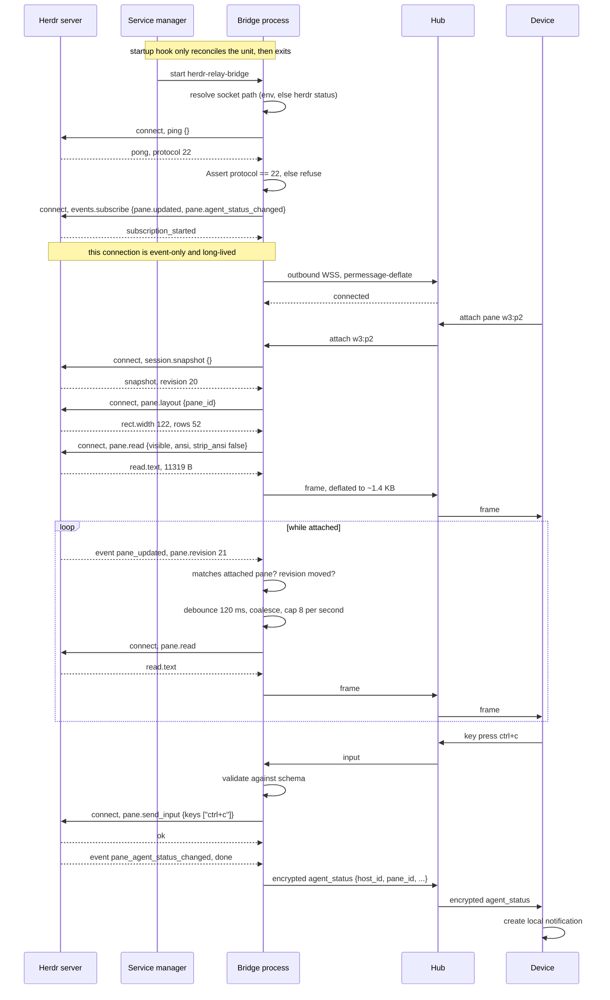

# Herdr Integration

How the `herdr-relay` plugin talks to Herdr on Windows, Linux, and macOS, and what Herdr gives the
Device to paint a terminal.

Scope: the Host side only. The Hub wire format is `docs/11-relay-protocol.md`. The Device renderer is
`docs/21-terminal-rendering.md`.

Ground truth for this document:

- `docs/02-herdr-probe-results.md`, rules `R-02-xxx`. That file wins on any conflict.
- Measurements taken for this document on 2026-08-24, re-measured 2026-09-02 against Herdr
  `0.8.2-preview.2026-08-31-b1ff4582e968`, protocol `21`, on Windows 11 `10.0.26200`, superseding
  the 2026-08-27 measurement at protocol `20` and the original 2026-08-04 one at protocol `19`.
  The probe client was Node `net.connect({ path })`. Every table marked **measured** is a real
  capture.

Rules here are numbered `R-10-xxx`.

## 1. Transport

### 1.1 One path, two channel kinds

Herdr reports exactly one socket path. `herdr status` prints it:

```text
server:
  status: running
  version: 0.8.2-preview.2026-08-31-b1ff4582e968
  protocol: 21
  compatible: yes
  socket: C:\Users\<user>\AppData\Roaming\herdr\herdr.sock
```

The Herdr server is a Rust program that uses the `interprocess` crate's namespaced local sockets. The
`herdr-sidebar` plugin states the consequence in its client source:

> On Windows the socket is a named pipe at `\\.\pipe\<HERDR_SOCKET_PATH>` (herdr feeds the whole path
> through interprocess' namespaced naming), which a plain `File` can speak. On unix it is an ordinary
> unix domain socket.
>
> — `herdr-standalone/plugins/herdr-sidebar/plugins/herdr-sidebar/src/ipc.rs:10-12`

The same source picks the channel per platform:

```rust
#[cfg(windows)]
fn roundtrip(path: &std::path::Path, request: &str) -> std::io::Result<String> {
    let pipe = format!(r"\\.\pipe\{}", path.display());
    let stream = std::fs::OpenOptions::new().read(true).write(true).open(pipe)?;
    exchange_with_thread_timeout(stream, request, IPC_TIMEOUT)
}

#[cfg(unix)]
fn roundtrip(path: &std::path::Path, request: &str) -> std::io::Result<String> {
    let stream = std::os::unix::net::UnixStream::connect(path)?;
    stream.set_read_timeout(Some(IPC_TIMEOUT))?;
    stream.set_write_timeout(Some(IPC_TIMEOUT))?;
    exchange(stream, request)
}
```

— `ipc.rs:96-112`

On Windows the pipe name is the **whole path**, drive letter and backslashes included. Enumerating
live pipes confirms it (**measured**):

```text
C:\Users\<user>\AppData\Roaming\herdr\herdr.sock
C:\Users\<user>\AppData\Roaming\herdr\herdr-client.sock
C:\Users\<user>\AppData\Local\Temp\hpaste-e2e-work\herdr.sock
C:\Users\<user>\AppData\Local\Temp\hpaste-e2e-work\herdr-client.sock
```

### 1.2 The `.sock` file on Windows is not a socket

**Measured.** The file at the reported path is 25 bytes of text:

```text
54888:1787194020218079000
```

The format is `<pid>:<starttime_ns>`. `54888` is the server process ID. It is an identity and liveness
marker. It is not an address.

### 1.3 The second pipe

**Measured.** `herdr-client.sock` accepts a connection, then half-closes without answering `ping`,
while `herdr.sock` answers normally:

| Pipe                | Response to `ping`                        |
| ------------------- | ----------------------------------------- |
| `herdr.sock`        | `{"id":"p","result":{"type":"pong",...}}` |
| `herdr-client.sock` | half-close, no data                       |

`herdr-client.sock` does not speak the request protocol. It is the server-to-client channel for the
attached terminal UI. The relay has no use for it.

**R-10-001**: The bridge MUST connect only to `herdr.sock`. The bridge MUST NOT connect to
`herdr-client.sock`.

### 1.4 Platform table

| Platform | Channel kind        | Exact address                              | Discovery                                              | Authentication                             | Unprivileged same-user connect |
| -------- | ------------------- | ------------------------------------------ | ------------------------------------------------------ | ------------------------------------------ | ------------------------------ |
| Windows  | Named pipe          | `\\.\pipe\` + reported path                | `HERDR_SOCKET_PATH`, else `herdr status`, else `%APPDATA%\herdr\herdr.sock` | Default pipe ACL: creating user has full access | Yes                            |
| Linux    | `AF_UNIX` stream    | the reported path, used directly            | `HERDR_SOCKET_PATH`, else `herdr status`               | Filesystem permissions on the socket inode | Yes                            |
| macOS    | `AF_UNIX` stream    | the reported path, used directly            | `HERDR_SOCKET_PATH`, else `herdr status`               | Filesystem permissions on the socket inode | Yes                            |

There is **no token, no handshake, and no peer credential check** in the protocol. The first byte a
client sends is a request. Reachability of the pipe or the socket inode is the whole access control.
The plugin runs as the same user as the Herdr server, so it connects with no privilege step.

**R-10-002**: The bridge MUST treat local socket access as equivalent to full control of the user's
Herdr session. Everything the Hub and the Device are allowed to do MUST be enforced by the bridge,
because Herdr enforces nothing. See `docs/13-security-pairing.md`.

The Windows fallback exists in source; the POSIX fallback does not:

```rust
pub fn socket_path() -> Option<PathBuf> {
    if let Some(path) = std::env::var_os("HERDR_SOCKET_PATH") { return Some(path.into()); }
    #[cfg(windows)]
    { std::env::var_os("APPDATA").map(|a| PathBuf::from(a).join("herdr").join("herdr.sock")) }
    #[cfg(not(windows))]
    { None }
}
```

— `ipc.rs:30-43`

**R-10-003**: On Linux and macOS the bridge MUST NOT guess a default socket path. It MUST read
`HERDR_SOCKET_PATH`, and when that is absent it MUST parse the `socket:` line of `herdr status`.

### 1.5 Connect sequence

Windows:

1. Read `HERDR_SOCKET_PATH`. If empty, run `herdr status` and take the value after `socket:`. If that
   fails, use `%APPDATA%\herdr\herdr.sock`.
2. Build the pipe name: the literal `\\.\pipe\` followed by the path from step 1, unchanged. Keep the
   drive letter and every backslash.
3. Open that name for read and write. In .NET use `NamedPipeClientStream`. In Node or Bun use
   `net.connect({ path })`.
4. Write one request line: the JSON object, then `\n`.
5. Read bytes until the first `\n`. Buffer across reads: one read can return a partial line.
6. Parse that line. Close the connection.

Linux and macOS:

1. Read `HERDR_SOCKET_PATH`. If empty, run `herdr status` and take the value after `socket:`.
2. Connect a `SOCK_STREAM` `AF_UNIX` socket to that path, unchanged. No prefix.
3. Set a 5000 ms read timeout and a 5000 ms write timeout.
4. Write one request line: the JSON object, then `\n`.
5. Read bytes until the first `\n`. Buffer across reads.
6. Parse that line. Close the connection.

The 5000 ms timeout matches `IPC_TIMEOUT` in `ipc.rs:22`. The response cap matches
`MAX_RESPONSE_BYTES = 4 * 1024 * 1024` in `ipc.rs:26`.

**R-10-004**: A client MUST bound every read with a 5000 ms timeout and MUST refuse a response line
longer than 4 MiB.

**R-10-005**: A reader MUST accumulate bytes into a buffer and split on `\n`. It MUST NOT assume one
read returns one whole line. This was observed live: a single chunk split a JSON object in half, and
a
naive per-chunk parser silently dropped every event.

### 1.6 Runtime choice

`socket.AF_UNIX` does not exist in CPython on Windows, so a Python bridge cannot use the POSIX form
(R-02-003). Node, Bun, and .NET each handle both forms.

**R-10-006**: The bridge process MUST be written in Rust. `herdr-sidebar` already implements this exact
client in Rust for all three platforms, and it ships as a compiled plugin binary today, so the pattern
and the build path are proven. The bridge MUST NOT be written in Python. The Rust-only decision for
the
Host plugin and relay is recorded in `docs/decisions/ADR-003-rust-host-and-relay.md`.

Rejected: Node and Bun, which work but add a runtime to every install; .NET, which fits Windows well
but is a heavier dependency on Linux. Go was previously considered and is retired.

## 2. Wire protocol

### 2.1 Framing

Newline-delimited JSON. One JSON object per line, UTF-8, terminated by `\n`. No length prefix and no
content-type. Source: `ipc.rs:1-2` and `ipc.rs:120-124`.

### 2.2 Envelopes

Request:

```json
{"id":"<string>","method":"<string>","params":{}}
```

Success:

```json
{"id":"<string>","result":{"type":"<discriminator>", "<payload_key>":{}}}
```

Error:

```json
{"id":"<string>","error":{"code":"<string>","message":"<string>"}}
```

Push, no `id`:

```json
{"event":"<kind>","data":{"type":"<kind>", "...":{}}}
```

`params` is required on every request, even as `{}` (R-02-007). Omitting it returns
`invalid_request` with an empty `id`.

Results are wrapped. `result.type` is the discriminator and the payload sits under a second key:

| Method             | `result.type`          | Payload key |
| ------------------ | ---------------------- | ----------- |
| `ping`             | `pong`                 | inline      |
| `pane.read`        | `pane_read`            | `read`      |
| `session.snapshot` | `session_snapshot`     | `snapshot`  |
| `pane.layout`      | `pane_layout`          | `layout`    |
| `plugin.list`      | —                      | `plugins`   |
| `plugin.action.list` | `plugin_action_list` | `actions`   |
| `plugin.action.invoke` | —                   | `invoke`    |
| `events.subscribe` | `subscription_started` | inline      |

**R-10-007**: A client MUST read a payload through `result.<payload_key>`. It MUST NOT read `result`
directly.

### 2.3 Identifiers and ordering

`id` is a client-chosen string echoed verbatim. Because exactly one request travels per connection
(section 2.4), correlation is trivial and uniqueness is not enforced by the server. Responses cannot
arrive out of order, because there is never more than one outstanding response on a connection.

**R-10-008**: The bridge MUST still generate a unique `id` per request, formatted
`herdr-relay:<method>:<counter>`. The value is what appears in `herdr plugin log list`, so a
collision costs debuggability even though it cannot corrupt correlation.

### 2.4 One request per connection

The server reads one request line, writes one response, then half-closes. Extra pipelined requests are
discarded, and any later write returns `EPIPE` (R-02-004). The client source agrees: "one
request/response per connection" (`ipc.rs:1-2`).

**R-10-009**: A client MUST open a new connection for every request. A client MUST NOT pipeline and
MUST NOT reuse a connection after reading its response.

**R-10-010**: A client MUST treat `EPIPE` on write as the ordinary end of a spent connection, not as
a
fault to report.

### 2.5 Subscriptions are event-only

`events.subscribe` answers `subscription_started`, then streams pushes on that connection forever. It
never answers another request on that connection (R-02-006). Confirmed here (**measured**): the
subscribe reply arrived, then 99 `pane_updated` pushes over 10 s on the same socket.

**R-10-011**: The bridge MUST hold exactly one long-lived subscription connection, and MUST issue every
request on its own separate short-lived connection.

Requests and pushes therefore never share a connection. There is no interleaving problem to solve.

### 2.6 Protocol version

`ping` returns the server version, the protocol integer, and a capability map (**measured**):

```json
{"id":"omp-2","result":{"type":"pong","version":"0.8.2-preview.2026-08-31-b1ff4582e968","protocol":21,"capabilities":{"live_handoff":false,"detached_server_daemon":false}}}
```

`protocol` is one integer. This build targets `22`; it does not accept a version range.

**R-10-012**: On connect, the bridge MUST call `ping` first and compare `result.protocol` with `22`.
The exact check is:

- `result.protocol == 22`: proceed.
- `result.protocol != 22`: refuse to serve any Device, log
  `herdr-relay: protocol <n>, expected 22`, and show the mismatch in the plugin popup pane.

Protocol `22` is a compatible increment for every call this repository makes. `R-02-028` records
the schema comparison and the live probes: one optional request field and three capability fields
were added, and no client call needs a shape change. The bridge MUST NOT serve a partial session
against an unknown protocol.

The server never volunteers a mismatch. It answers a request it understands and returns
`invalid_request` for one it does not, so `ping` is the only reliable probe.

### 2.7 Malformed requests

An invalid enum value returns an error with an **empty** `id` and then closes the connection
(R-02-009):

```json
{"id":"","error":{"code":"invalid_request","message":"invalid request: unknown variant `Visible`, expected one of `visible`, `recent`, `recent_unwrapped`, `detection` at line 1 column 96"}}
```

Enum values are `lowercase_with_underscores`.

**R-10-013**: The bridge MUST validate every Device-originated request against the schema before it
forwards it. A malformed request costs the connection and returns an error that cannot be correlated
by `id`, so a Device could never be told which of its requests failed.

Observed error codes: `invalid_request`, `invalid_key`, `pane_not_found`, `agent_not_found`,
`timeout`, `agent_prompt_stalled`.

### 2.8 Reconnect and backoff

The subscription connection is the only long-lived one, so this rule governs it.

**R-10-014**: On losing the subscription connection the bridge MUST reconnect on this schedule.
Every number is tunable through the config file named in section 7.5.

1. Wait 250 ms, then attempt to reconnect.
2. On each further failure, multiply the wait by 2: 250, 500, 1000, 2000, 4000, 8000 ms.
3. Cap the wait at 8000 ms. Retry at 8000 ms indefinitely.
4. Add jitter of ±20 % to every wait, so several bridges do not resynchronise on a Herdr restart.
5. Reset the wait to 250 ms after a subscription survives 30 s.
6. Before each attempt, run the section 1.5 discovery again from step 1. A Herdr restart can change
   the path, and the stale `.sock` file will name a dead process ID.
7. After each successful reconnect, run the section 5.5 resynchronisation.

**R-10-015**: The bridge MUST NOT back off request connections. A failed request connection is retried
once immediately, then reported to the Device as a failure. Request connections are cheap and a
retry storm cannot form, because a Device request is user-driven.

## 3. API surface for a mobile client

Params and result fields below were captured from `herdr api schema --json` at runtime. The schema
is never a committed file. Fields marked `?` are optional.

### 3.1 Read a pane

`pane.read` — params `{pane_id, source, format?, lines?, strip_ansi?}`.

- `source`: `visible` | `recent` | `recent_unwrapped` | `detection`. Required.
- `format`: `text` | `ansi`. Default `text`.
- `strip_ansi`: boolean. **Default `true`.**
- `lines`: uint32 or null.

Result `read`: `{pane_id, workspace_id, tab_id, source, format, text, revision, truncated}`.

`agent.read` — params `{target, source?, format?, lines?}`. The same read addressed by agent instead
of
pane.

### 3.2 Send input

`pane.send_input` — params `{pane_id, text?, keys?}`. Both optional; send either or both. When both
are
present the text is delivered first, then the keys.

`pane.send_text` — params `{pane_id, text}`. Literal text only.

`pane.send_keys` — params `{pane_id, keys}`. Named keys only.

`agent.prompt` — params `{target, text, wait?}` where `wait` is `{until?: [AgentStatus], timeout_ms?}`.

`agent.send_keys` — params `{target, keys}`.

### 3.3 Observe change

`events.subscribe` — params `{subscriptions: [{type}]}`. The 27 accepted `type` values:

```text
workspace.created  workspace.updated  workspace.metadata_updated  workspace.renamed
workspace.moved    workspace.reordered  workspace.closed  workspace.focused
worktree.created   worktree.opened    worktree.removed
tab.created        tab.closed         tab.focused       tab.renamed      tab.moved
pane.created       pane.closed        pane.updated      pane.focused     pane.moved
pane.exited        pane.agent_detected  pane.output_matched
pane.agent_status_changed  pane.scroll_changed  layout.updated
```

Push for `pane.updated` carries the whole pane object under `data.pane`, including `revision` and
`scroll.viewport_rows` (R-02-011).

Push for `pane.agent_status_changed` is flat (**schema-measured** 2026-09-08 with
`herdr api schema`, protocol `21`, EventData variant `pane_agent_status_changed`): `data` carries
`type`, `pane_id`, `workspace_id`, `agent_status` (required) and the optional `agent`,
`display_agent`, `title`, `state_labels`. It carries no `pane` or `tab` object, so a consumer
needing tab routing reads a fresh `session.snapshot`.

`pane.wait_for_output` — params `{pane_id, match, source?, lines?, strip_ansi?, timeout_ms?}` where
`match` is `{type:"substring"|"regex", value}`.

`events.wait`, `agent.wait` — params `{target, until?: [AgentStatus], timeout_ms?}`.

### 3.4 Enumerate the tree

`session.snapshot` — params `{}`. Result `snapshot` is **flat**, not nested (**measured**):

```text
version  protocol  focused_workspace_id  focused_tab_id  focused_pane_id
workspaces[]  tabs[]  panes[]  layouts[]  agents[]
```

Children are joined by id: a pane carries `workspace_id` and `tab_id`. On this machine one call
returned 6 workspaces, 7 tabs, 14 panes, 7 agents, 7 layouts.

Each `workspaces[]` entry carries `label`, `focused`, `pane_count`, `tab_count` and an optional
`worktree` object `{repo_name, is_linked_worktree, checkout_path, repo_key, repo_root}` (**measured**
2026-09-04 with `herdr api snapshot`). There is no separate worktrees array. A plain-directory
workspace has no `worktree`. The Host reads the `worktree` object and forwards only `repo_name` and
`is_linked_worktree` to the Device (`R-11-044`). `checkout_path`, `repo_key` and `repo_root` are user
paths and never cross the wire. The one in-process exception is `repo_key`: the Host reads it only to
derive the wire `space_id` group (`R-11-044`), exactly the desktop sidebar's grouping — two or more
workspaces sharing one key, with at least one non-linked member, group under the first non-linked
member in Herdr's own order (Herdr `src/ui/sidebar.rs` `workspace_list_entries_inner`, lines 344-441,
and the snapshot source `src/app/creation.rs` `workspace_info`, lines 498-523, both at commit
`b1ff4582e968`). The key itself is never serialized or logged.

The desktop's child-row display name — custom name when set, else the branch with one leading
`worktree/` prefix stripped, else the workspace label (`grouped_child_display_label`,
`src/ui/sidebar.rs:290-305`) — is **not** reproducible over the API: whether a workspace has a custom
name is desktop-internal state, and `worktree.list` exposes `branch` but its `label` is the repo name,
not the row label. The wire `name` therefore stays the snapshot `label` verbatim for parent and child
rows alike; an exact child alias needs a Herdr API addition first (an upstream gap, not a relay
feature).

`PaneInfo` fields: `pane_id, terminal_id, workspace_id, tab_id, focused, cwd, foreground_cwd, label,
title, agent, display_agent, agent_status, agent_session, state_labels, tokens, scroll, revision,
terminal_title, terminal_title_stripped`.

`pane.list`, `pane.get`, `tab.list`, `workspace.list`, `pane.layout` are the narrower reads.

### 3.5 Drive an agent

`agent.list` — params `{}`. `agent.get`, `agent.focus`, `agent.explain` — params `{target}`.

`agent.start` — params `{name, kind, pane_id, args?, timeout_ms?}`. `timeout_ms` must exceed 3000 and
must not exceed 300000.

`AgentStatus`: `idle` | `working` | `blocked` | `done` | `unknown`.

### 3.6 Raise a notification

`notification.show` — params `{title, body?, sound?, position?}`.

- `sound`: `none` | `done` | `request`.
- `position`: `top-left` | `top-right` | `bottom-left` | `bottom-right`.

This raises a toast on the **Host**. The bridge sends encrypted `agent_status` messages to the
Device. The app creates a native local notification on receipt. A separate content-free push
can alert the person when no Device is joined. See `docs/11-relay-protocol.md` for message
fields and `docs/30-ux-spec.md` for notification tap routing.

**R-10-074**: The Host MUST send the outer `push_wake` control (R-11-246) alongside each
`agent_status` whose status is `blocked` or `done`. It MUST keep all status details inside Noise.
While no Device is present, the Host MUST observe these statuses through an idle Herdr
subscription for each relay registration. It MUST stop that subscription when the Device session
starts and restart it after the session ends. Both subscriptions MUST share
`agent_status_observed` stamps to prevent duplicate notifications when observation changes
between them. The Host MUST send `push_wake` for each new `blocked` or `done` status during
idle observation, even though no Device can receive the encrypted message.

### 3.7 The remaining methods

Not needed by the Device, listed for completeness:

`ping`, `server.stop`, `server.reload_config`, `server.live_handoff`, `server.agent_manifests`,
`server.reload_agent_manifests`, `popup.close`, `client.window_title.set`, `client.window_title.clear`,
`integration.install`, `integration.uninstall`, `layout.apply`, `layout.export`,
`layout.set_split_ratio`, `pane.current`, `pane.edges`, `pane.neighbor`, `pane.process_info`,
`pane.focus`, `pane.focus_direction`, `pane.move`, `pane.swap`, `pane.release_agent`, `pane.report_agent`,
`pane.report_agent_session`, `pane.report_metadata`, `pane.clear_agent_authority`, `pane.graphics.set`,
`pane.graphics.get`, `pane.graphics.info`, `pane.graphics.clear`, `agent.rename`, `agent.view.set`,
`agent.view.clear`, `tab.close`, `tab.focus`, `tab.rename`, `tab.move`, `tab.get`,
`workspace.close`, `workspace.focus`, `workspace.rename`, `workspace.move`,
`workspace.move_block`, `workspace.get`, `workspace.report_metadata`, `worktree.create`,
`worktree.list`, `worktree.open`, `worktree.remove`, `plugin.list`, `plugin.link`, `plugin.unlink`,
`plugin.enable`, `plugin.disable`, `plugin.action.list`, `plugin.action.invoke`, `plugin.pane.open`,
`plugin.pane.close`, `plugin.pane.focus`, `plugin.log.list`.

`workspace.create`, `tab.create`, `pane.split`, `pane.zoom`, `pane.close`, `pane.rename`,
`pane.resize`, `plugin.action.list`, and `plugin.action.invoke` are no longer in this list.
They are Device-reachable through the relay protocol. `docs/11-relay-protocol.md` `R-11-202` maps
each one to its `host_action` action. See sections 3.8 and 3.9.
`server.stop`, `workspace.close`, `tab.close`, `plugin.disable`, `plugin.enable`, `plugin.link`,
and `plugin.unlink` MUST NOT be reachable from the Device
(`docs/11-relay-protocol.md` R-11-204).

### 3.8 Create actions from the Device

The Device creates workspaces, tabs and panes through the `host_action` relay message
(`docs/11-relay-protocol.md` section 4.16). The bridge issues the corresponding Herdr call on a
fresh connection. Every parameter is optional except `pane.split` `direction`.

**R-10-054**: The bridge MUST issue each create call on its own fresh connection (R-10-009). It
MUST send `params` even when empty (R-02-007). It MUST read the result through
`result.<payload_key>` (R-10-007). It MUST send `focus: false` on every create, because a phone
MUST NOT steal focus on the workstation (`docs/11-relay-protocol.md` R-11-203).

| Device action | Herdr method | Required params | Optional params |
|---|---|---|---|
| `workspace.create` | `workspace.create` | none | `cwd` (nullable), `env` (map), `focus` (must be `false`), `label` (nullable) |
| `tab.create` | `tab.create` | none | same as workspace.create, plus `workspace_id` (nullable) |
| `pane.split` | `pane.split` | `direction` (`"right"` or `"down"`) | `cwd`, `env`, `focus` (must be `false`), `ratio`, `target_pane_id`, `workspace_id` |

**R-10-055**: The bridge MUST subscribe to `workspace.created`, `tab.created` and `pane.created`
events on the long-lived subscription connection (R-10-011). These events confirm creation and
deliver the new entity to the Device through `tree_update` messages
(`docs/11-relay-protocol.md` R-11-046). The `host_action_ack` `result_id` gives the Device
immediate navigation; the `tree_update` confirms the entity is in the tree.

**Corrective note (INT-25-host, 2026-09-08)**: the Host bridge
(`crates/herdr-relay/src/bridge.rs`) opens this subscription when the Device session starts,
not on the first `watch_pane`. The entry list is the 13 unfiltered tree events plus one
`pane.agent_status_changed` filter per pane in a fresh `session.snapshot` (R-02-013a), so
`tree_update` and `agent_status` flow before the first watch. `watch_pane` and `unwatch_pane`
open and close nothing on this connection; a `pane.created` push re-issues it with the grown
pane list.

### 3.9 Plugin actions from the Device

The Device lists and invokes the Host's plugin actions through the relay protocol
(`docs/11-relay-protocol.md` sections 4.24, 4.25, and the `plugin.invoke` action in section 4.16).
The bridge calls two Herdr methods: `plugin.action.list` to enumerate actions, and
`plugin.action.invoke` to run one.

**R-10-056**: The bridge MUST call `plugin.action.list` with no `plugin_id` to get every action
from every loaded plugin. It MUST issue the call on a fresh connection (R-10-009), MUST send
`params: {}` (R-02-007), and MUST read the result through `result.actions` (R-10-007). The
result envelope is `plugin_action_list` and the payload key is `actions`.

**R-10-057**: Before forwarding the result to the Device, the bridge MUST project every action
to `plugin_id`, `action_id`, `title`, `description`, and `contexts` only. The bridge MUST strip
`command`, `manifest_path`, `plugin_root`, and every host path. The bridge MUST filter actions
by the Host's own platform: an action whose `platforms` does not include the current OS MUST be
excluded. The bridge MUST treat an absent `contexts` as `["global"]`. Rationale: the `command`
array holds real shell commands and some embed absolute host paths (R-11-209); five title pairs
are platform variants, so an unfiltered list shows five duplicate buttons (R-11-210); Herdr
actions without a declared context are valid everywhere (R-11-211).

**R-10-058**: The bridge MUST call `plugin.action.invoke` on a fresh connection (R-10-009), MUST
send `params` even when empty (R-02-007), and MUST read the result through `result.invoke`
(R-10-007). The params are `action_id` (required), `plugin_id` (optional, defaults to the action
list's owning plugin), and `context` (optional `PluginInvocationContext`).

**R-10-059**: The bridge MUST build `PluginInvocationContext` from its own Herdr calls, not from
the Device. The Device sends at most one surface id — `workspace_id`, `tab_id`, or `pane_id`.
The bridge resolves `focused_workspace_id`, `focused_tab_id`, and `focused_pane_id` from a fresh
`session.snapshot` (R-10-009). It MUST NOT accept `selected_text`, `focused_pane_cwd`,
`workspace_cwd`, `clicked_url`, or `link_handler_id` from the Device (R-11-216). The bridge
MUST set `invocation_source` to `"herdr-remote"`.

## 4. Rendering contract

This section is measured. Every number is a real capture from the live server.

### 4.1 The payload is a flattened grid, not a PTY stream

The single most important finding. Across **all 14 live panes**, `pane.read` with `format:"ansi"` and
`strip_ansi:false` returned **2854 escape sequences, of which 100 % were `ESC[...m` SGR**:

```text
UNION of escape families across ALL panes: {"ESC[Nm": 2854}
```

Zero cursor positioning. Zero erase. Zero scroll region. Zero OSC. Zero mode switches. Every pane, plain
shells and full-screen TUIs alike, produced only colour and style.

Herdr renders the terminal grid on the Host and hands over the finished result: one text line per
screen row, with SGR runs inside. The Device therefore does **not** need a cursor-addressing VT state
machine. It needs a row array plus an SGR parser.

**R-10-016**: The Device MUST treat a `pane_frame` payload (`docs/11-relay-protocol.md` R-11-051)
as a complete grid of rows. It MUST NOT implement cursor motion, erase, or scroll-region handling
for this payload, because the server never emits those.

### 4.2 The exact SGR vocabulary

**Measured** across all 14 panes. This is the complete set a Device parser must support:

| SGR parameter | Meaning              | Occurrences |
| ------------- | -------------------- | ----------- |
| `0`           | reset                | 1629        |
| `38;2;r;g;b`  | foreground truecolour| 545         |
| `2`           | dim                  | 282         |
| `48;2;r;g;b`  | background truecolour| 268         |
| `1`           | bold                 | 78          |
| `3`           | italic               | 35          |
| `38;5;n`      | foreground 256-index | 15          |
| `48;5;n`      | background 256-index | 2           |
| `4`           | underline            | 1           |

**R-10-017**: The Device renderer MUST support SGR `0`, `1`, `2`, `3`, `4`, `38;2`, `48;2`, `38;5`,
and
`48;5`. It SHOULD ignore any other SGR parameter rather than fail, because the set above is what this
server actually emits and an unknown code is more likely a future addition than a bug.

### 4.3 A real captured sample

From pane `w3:pX`, `source:"visible"`, `format:"ansi"`, `strip_ansi:false`. `ESC` is shown as `\e`,
trimmed to 300 characters:

```text
\e[0m\e[38;2;107;114;128m\e[48;2;15;18;22m│\e[0m\e[48;2;15;18;22m \e[0m\e[38;2;156;163;176m\e[48;2;15;18;22mcomfy!47   REMIX-5977: Export Rework to Support Standard Save\e[0m\e[48;2;15;18;22m                                                                               \e[0m\e[38;2;107;114;128m\e[48;2;15;18;22m│
```

`\e[38;2;107;114;128m` is a 24-bit foreground. `\e[48;2;15;18;22m` is a 24-bit background. Colour
fidelity is real, and the row is padded with styled spaces out to the pane width.

### 4.4 `visible` is a full viewport repaint

**Measured.** `source:"visible"` returned exactly `viewport_rows` lines with `truncated:false` on every
pane tested, including a pane with 66844 lines of scrollback.

| Pane     | `source`  | `lines`   | Lines returned | `truncated` | Bytes  |
| -------- | --------- | --------- | -------------- | ----------- | ------ |
| `w5:p1`  | `visible` | omitted   | 50             | `false`     | 8601   |
| `w5:p1`  | `recent`  | omitted   | 80             | `true`      | 13666  |
| `w5:p1`  | `recent`  | 1000      | 1000           | `true`      | 190001 |
| `w5:p1`  | `recent`  | 1001      | **1000**       | `true`      | 190001 |
| `w3:pS`  | `visible` | omitted   | 50             | `false`     | 2512   |
| `w3:pS`  | `recent`  | omitted   | 50             | `false`     | 2512   |

It is a repaint, never a fragment. There is no partial update and no delta anywhere in this API.

**R-10-018**: The Device MUST replace the whole grid on every frame. It MUST NOT try to append or patch.

### 4.5 What `truncated` means

`truncated` is `true` when the returned window does not cover the pane's full scrollback. It is not
a
hard-cap flag alone.

- `visible`: always `false`, because the viewport is by definition complete.
- `recent` on a pane with no scrollback (`max_offset_from_bottom == 0`): `false`.
- `recent` on a pane with scrollback: `true`, even at `lines: 1000`.

**Measured hard cap: 1000 lines.** Requests for 5000 and for 100000 both returned exactly 1000 lines
and 190001 bytes.

**R-10-019**: The bridge MUST NOT request more than 1000 lines. The server silently clamps, so a larger
number wastes nothing but misleads the reader. Source audit on 2026-09-17 confirms the same cap
in upstream `read_terminal_snapshot`; `PaneReadParams` still has no history offset. The read-only
selection API accepts ranges but returns plain text, so it cannot page the ANSI grid unchanged.

### 4.6 `revision` in a read result is always zero

**Measured, and this contradicts the obvious reading of the schema.** `PaneReadResult.revision` is
declared `uint64`, but the server returns `0` for every source:

| `source`           | `revision` | `truncated` | Bytes |
| ------------------ | ---------- | ----------- | ----- |
| `visible`          | 0          | `false`     | 2512  |
| `recent`           | 0          | `false`     | 2512  |
| `recent_unwrapped` | 0          | `false`     | 2512  |
| `detection`        | 0          | `false`     | 1162  |

Meanwhile `session.snapshot` reported `revision: 82606` for the same pane at the same moment, and the
event stream reported the same counter. This sharpens the open note in R-02-012: the two values are
not
merely different counters, the read result's field is simply not populated.

**R-10-020**: The bridge MUST take `revision` from the `pane.updated` event or from
`session.snapshot`. It MUST NOT read `revision` from a `pane.read` result, which is always `0`.

Revision is monotonic per pane and increments by exactly 1 per change. **Measured** over 10 s: seven
panes each advanced by 12 to 14 across 13 to 15 events, one increment per event, never repeating and
never going backwards.

### 4.7 `detection` silently discards styling

**Measured.** `source:"detection"` ignores `format:"ansi"` and `strip_ansi:false`. It echoes
`format:"ansi"` in the result while returning text with no `ESC` byte at all:

```text
detection contains ESC? false   format echoed: ansi
visible   contains ESC? true    format echoed: ansi
```

**R-10-021**: The bridge MUST use `source:"visible"` for rendering. It MUST NOT use `source:"detection"`
for rendering, because that source returns stripped text while claiming `format:"ansi"`.

### 4.8 Payload sizes

**Measured**, `source:"visible"`, `format:"ansi"`, `strip_ansi:false`. "Cols" is the longest rendered
line, which is the column lower bound.

| Pane      | Rows | Cols | Kind             | ANSI bytes | Text bytes | Ratio | deflateRaw | brotli |
| --------- | ---- | ---- | ---------------- | ---------- | ---------- | ----- | ---------- | ------ |
| `w3:p11`  | 50   | 57   | quiet, narrow    | **288**    | 186        | 1.55x | 165        | 164    |
| `w5:p45`  | 50   | 18   | quiet, narrow    | **972**    | 320        | 3.04x | 301        | 269    |
| `w3:pS`   | 50   | 18   | plugin TUI       | **2512**   | 1162       | 2.16x | 579        | 499    |
| `w3:p2`   | 50   | 58   | agent, narrow    | **4594**   | 1876       | 2.45x | 1395       | 1134   |
| `w1V:p1`  | 50   | 119  | agent, wide      | **7035**   | 3390       | 2.08x | 2043       | 1666   |
| `w5:p1`   | 50   | 119  | agent, wide      | **8601**   | 4640       | 1.85x | 1792       | 1466   |
| `w3:pX`   | 52   | 143  | agent, busy wide | **11319**  | 6535       | 1.73x | 1679       | 1359   |

Summary:

- Quiet narrow pane: **288 B to 972 B**.
- Busy wide pane: **8.6 KB to 11.3 KB**.
- ANSI costs 1.55x to 3.04x the stripped text.
- Compression cuts every frame to **13 % to 24 %**: an 11.3 KB frame becomes 1.36 KB with brotli.

**R-10-022**: The Host-to-Device transport MUST compress frames. WebSocket `permessage-deflate` is
sufficient and needs no application code. A cell-level diff MUST NOT be built for version one:
compression plus revision-gating already removes the cost.

### 4.9 Wide and CJK characters

**Measured.** Payloads carry non-ASCII freely: box drawing (`│ ╰ ┬ ┼`), arrows (`↑ ↓ → ⏎`), symbols
(`⚙ ✅ ※`), emoji (`📁 📄 🐴 ⚡`), and private-use Nerd Font glyphs. Distinct non-ASCII code points per
pane ranged from 15 to 34.

No CJK appeared in this sample, so CJK width handling is `[UNVERIFIED]` against this server. The
mechanism is the same for emoji, which are present and are double-width, so the requirement stands.

**R-10-023**: The Device MUST measure character width with a Unicode East Asian Width table and MUST
render a double-width code point across two cells. Getting this wrong shifts every following character
on the row, because the Host has already padded rows assuming its own width model.

### 4.10 The grid size problem

`scroll.viewport_rows` gives the row count, confirmed on every pane. **No field is named for the column
count.** Searched: `PaneInfo`, `PaneScrollInfo`, `PaneReadResult`, `PaneLayoutSnapshot`.

`pane.layout` does however return a `PaneLayoutRect` per pane, and it is measured in **character cells,
not pixels**. Proof: in every tab the pane widths sum exactly to the area width.

**Measured** across all 7 tabs and 14 panes:

```text
tab w3:t2: area 144x52  panes=3  sumW=144
   w3:pS    rect  22x52 @36,1   viewport_rows=50  heightDelta=2
   w3:p11   rect  61x52 @58,1   viewport_rows=50  heightDelta=2
   w3:p2    rect  61x52 @119,1  viewport_rows=50  heightDelta=2
tab w3:t7: area 144x52  panes=1  sumW=144
   w3:pX    rect 144x52 @36,1   viewport_rows=52  heightDelta=0
tab w1X:t1: area 144x52  panes=2  sumW=144
   w1X:p9   rect  22x52 @36,1   viewport_rows=50  heightDelta=2
   w1X:p1   rect 122x52 @58,1   viewport_rows=50  heightDelta=2
```

Two facts follow, and the second is the trap:

1. `rect` is in cells. `22 + 61 + 61 = 144` and `22 + 122 = 144`, both equal to `area.width`.
2. `rect` includes tab chrome, but **only when the tab is split**. `rect.height - viewport_rows` was
   `2` for every pane in a split tab and `0` for the sole pane of the single-pane tab `w3:t7`. The
   offset is conditional, not constant.

So `rect.width` is an **upper bound** on the column count, not the count itself. The longest rendered
line is a **lower bound**. Measured gap between them, per pane: 22 against 18, 61 against 57, 61
against 58, 144 against 143, 122 against 119. The true width sits inside that range, and nothing in
the API reports it exactly.

**R-10-024**: The Device MUST take rows from `scroll.viewport_rows`, never from `rect.height`, because
`rect.height` carries a conditional chrome offset. The Device MUST treat `rect.width` from
`pane.layout` as the column upper bound and the longest rendered line as the lower bound. When the two
differ the Device MUST render at `rect.width` and MUST NOT reflow, because the Host has already padded
every row with styled spaces to its own width, so reflowing at the shorter value would wrap rows that
the Host considers complete.

**R-10-025**: The bridge MUST call `pane.layout` once when a Device attaches to a pane, and again on
any `layout.updated` or `pane.updated` event whose pane reports a changed `viewport_rows`. It MUST NOT
call `pane.layout` on every frame.

### 4.11 Alternate screen and scrollback

Herdr resolves the alternate screen on the Host. A full-screen TUI in alternate-screen mode (the
`Explorer` sidebar panes here) flattens to the same plain rows plus SGR as a shell pane, with no
`?1049h` and no mode switch in the payload. The Device never learns which mode the pane is in.

The consequence for scrollback:

- In normal mode a pane has scrollback. `max_offset_from_bottom` reported up to 66844 lines.
- In alternate-screen mode a pane has none. Every `Explorer` pane reported
  `max_offset_from_bottom: 0`.

**R-10-026**: The Device MUST show a scrollback affordance only when `scroll.max_offset_from_bottom`
is greater than 0. That field is the only signal that distinguishes the two modes.

**R-10-027**: The Device MUST fetch scrollback with `source:"recent"` and an explicit `lines` value
no
greater than 1000. It MUST NOT assume scrollback is continuous with the `visible` frame: the two are
separate reads and the pane can change between them.

## 5. Change-detection loop

Every default below is tunable through the config file in section 7.5.

### 5.1 Measured cadence

**Measured** over 10 s with one `pane.updated` subscription:

```text
events in 10s: 99  (9.9/s)

pane        n  distinctRev  revDelta  medGapMs
w3:pS      15           15        14       705
w1X:p9     15           15        14       706
w3:pY      14           14        13       706
w5:p45     14           14        13       706
w28:p2     13           13        12       706
w1V:pE     14           14        13       706
w1W:p7     14           14        13       706

mean event frame = 439 B  ->  noise floor ~= 4.2 KiB/s if forwarded unfiltered
```

Every event came from a `herdr-sidebar` `Explorer` pane repainting at **1.42 Hz**, median gap
**706 ms**. All seven real agent panes were idle and produced **zero** events over the same window,
confirmed by a separate 10 s snapshot comparison where every agent revision delta was 0.

Round-trip cost of a full ANSI `pane.read`, 20 sequential calls: **min 0 ms, p50 1 ms, p95 104 ms,
max 105 ms**. Most calls are effectively free; the ~100 ms outliers align with a server tick.

### 5.2 The loop

**R-10-028**: The bridge MUST run this loop per attached Device.

1. On attach, record the `pane_id` the Device is viewing. Call `session.snapshot` and `pane.layout`,
   send one full frame, and store `lastRevision` from the snapshot.
2. On each `pane.updated` push, discard it unless `data.pane.pane_id` matches an attached pane.
3. If `data.pane.revision == lastRevision` and the geometry is unchanged, discard. Do not read.
4. Otherwise set `lastRevision`. If no read is in flight and no window is open, issue the read at
   once and open the 120 ms window (R-10-029). If a window is open, store the revision; the window's
   end issues one read for the newest stored revision (R-10-031).
5. Each read is one `pane.read` with `source:"visible"`, `format:"ansi"`, `strip_ansi:false`, on a
   fresh connection. Send the frame.
6. Independently of any event, read the watched pane every 125 ms (R-10-070), because an agent
   pane's revision can freeze while it repaints and a typed character moves no revision at all
   (R-02-026). Send a frame only when the text or the geometry differs from the last frame sent.

### 5.3 Numbers

| Rule       | Setting                      | Default   | Tunable | Reason                                                                 |
| ---------- | ---------------------------- | --------- | ------- | ---------------------------------------------------------------------- |
| R-10-029   | Coalescing window            | **120 ms**| yes     | Leading edge: the first event reads at once; the window coalesces the rest. |
| R-10-030   | Maximum read rate per pane   | **16 /s** | yes     | One read costs 1 ms at p50, so 16/s is 2 % of a core; room for R-10-071 (was 8, amended 2026-09-11). |
| R-10-031   | Coalescing                   | keep last | yes     | Frames are full repaints, so an older frame has no value.               |
| R-10-032   | Skip when revision unchanged | mandatory | no      | Byte-identical text, proven in R-02-012. Event path only; see R-10-070.   |
| R-10-033   | Attached panes per Device    | **1**     | yes     | The Device shows one terminal at a time.                                |
| R-10-034   | Read timeout                 | **5000 ms**| yes    | Matches `IPC_TIMEOUT` in `ipc.rs:22`.                                   |
| R-10-070   | Poll period per watched pane | **125 ms**| yes     | 8 reads/s, the R-10-030 cap; the revision can freeze and a keystroke moves none (R-02-026). |
| R-10-071   | Input-triggered reads        | **60, 130, 250 ms** | yes | A keystroke moves no revision (R-02-029); reads timed from the write catch its echo. |

**R-10-029**: The bridge MUST read on the leading edge. On a qualifying event with no read in flight
and no open window, it MUST issue the `pane.read` at once and open a 120 ms window. Further events
for the same pane inside the window update the stored revision and MUST NOT start a second window;
when the window closes, the bridge reads once more only if the stored revision moved during it.

**Amendment to R-10-029, 2026-09-11.** Until this date the rule read *after* the window: the first
event started the 120 ms timer and the read waited for it, so every single keystroke's echo waited
120 ms with nothing to coalesce. The product owner measured the delay as noticeable and asked for
none. The window now coalesces only the events that follow a read, which is what it was for; a
lone event costs nothing. The burst bound is unchanged: at most one read per window plus the
R-10-030 cap.

**Amendment to R-10-029, 2026-09-08.** The window was suspected of reading a pane mid-redraw.
`R-02-027` measured the bridge's exact schedule and observed no blank and no partial frame in 766
reads. On that evidence this window MUST NOT gain a maximum wait or a blank-frame guard; a later
measurement that observes a blank frame reopens the question. A failed read sends no frame
(R-10-034), never a blank one. The flicker the suspicion came from was the Device's follow anchor;
R-21-021's amendment of the same date holds that change.

**R-10-030**: The bridge MUST NOT exceed 16 reads per second for one pane. On exceeding it, the
bridge drops the excess and keeps only the newest pending revision. (Amended 2026-09-11: the cap
was 8. One read costs 1 ms at p50 (R-10-022) and an unchanged read sends nothing (R-10-070), so 16
reads per second is about 2 % of one core and no wire bytes on a quiet pane; the room is for the
input-triggered reads of R-10-071, which the 125 ms poll alone could not fit under 8.)

**R-10-071**: After the bridge forwards a `send_input` to a pane, it MUST read that pane at
**60 ms**, **130 ms** and **250 ms** after the write, each read subject to R-10-030 and each frame
subject to the R-10-070 hash compare, so an unchanged pane sends nothing. Measured cause
(`R-02-029`): a typed character moves no `revision` and emits no `pane.updated`, so only a timed
read can carry its echo, and the shell's own echo lands at about 130 ms. A read scheduled from the
keystroke itself catches that echo within tens of milliseconds, where the free-running 125 ms
poll catches it at a random phase. The Device's predictive echo (`docs/21-terminal-rendering.md`
`R-21-043`) draws the character at once either way; these reads shorten the time its underline
stays and the time a wrong prediction stays. A new `send_input` inside the sequence restarts it.
Added 2026-09-11.

**R-10-072**: On a `mark_seen` from the Device (`docs/11-relay-protocol.md` R-11-240), the bridge
MUST call `agent.focus` with `{"target": <pane_id>}` on a fresh connection, and nothing else.
Measured cause (`R-02-031`): Herdr's seen state is what separates `done` from `idle`, an explicit
focus is the one call that sets it, and `pane.focus` does not accept a pane id of a live agent
pane. The bridge MUST NOT read the pane, MUST NOT send a synthetic status, and MUST NOT set seen
by any other route: the `pane.focused` event Herdr emits for the focus already triggers the
snapshot-follow of R-11-046, which carries `idle` to every Device. An `agent.focus` error
(`agent_not_found` or the like) MUST be answered with the `error` of R-11-240 and MUST NOT be
retried. The bridge MUST log the call as a count, never the pane id (`AGENTS.md`). Added
2026-09-11.

**R-10-031**: When several events for one pane arrive inside the window, the bridge MUST read once and
send one frame. Because every frame is a full repaint (R-10-018), only the newest matters.

**R-10-032**: The bridge MUST NOT call `pane.read` when the revision has not moved. This rule gates
the event path only. A watched pane is also read on the R-10-070 poll timer, because the revision
can freeze while the pane repaints (R-02-026).

**R-10-033**: The bridge MUST filter events to attached panes. Forwarding the raw stream would burn
4.2 KiB/s on panes nobody is watching, as measured.

**R-10-034**: The bridge MUST abandon a `pane.read` that has not answered within 5000 ms, close that
connection, and keep the stored revision unchanged so the next event retries the read. It MUST NOT
send a partial frame.

**R-10-070**: While a pane is watched, the bridge MUST also read it on a **125 ms** timer (8 reads
per second, the R-10-030 cap, which the poll shares with the event trigger), even when no
`pane.updated` revision movement has arrived. Measured cause: an agent pane can repaint without its
`revision` moving and without emitting any event (R-02-026). A poll read MUST be sent as a frame
only when the ANSI text or the geometry differs from the last frame sent (hash compare), so an
unchanged pane costs no wire bytes. The frame's `revision` field keeps the last Host revision,
which may not have moved; R-11-052 is unchanged. A revision-triggered read still always sends its
frame (R-11-073).

**Amendment to R-10-070, 2026-09-11.** The period was 250 ms. A live measurement on a PowerShell
pane found that a typed character moves no `revision` and emits no `pane.updated` at all, so the
poll is the only path that carries a keystroke echo, and its phase set the whole echo delay: 138 to
436 ms from `send_input` to the frame on the phone, with the phone's own receipt-to-paint at 0 to
5 ms. At 125 ms the worst case halves. The cost is bounded by facts already measured here: one
read is 1 ms at p50 (R-10-022), so 8 reads/s is about 1 % of one core, and an unchanged poll sends
nothing. A shorter period would exceed R-10-030 and MUST NOT be set without a new measurement
against the server tick.

### 5.4 Worst case

At the 8 /s ceiling on the largest measured pane (11319 B, brotli 1359 B), one Device costs
**10.9 KiB/s compressed**. A quiet pane at the same rate costs 1.3 KiB/s. This is the budget
`docs/12-relay-hosting.md` should size against.

### 5.5 Resynchronisation after a dropped connection

**R-10-035**: After the subscription reconnects the bridge MUST resynchronise, because events that
occurred while disconnected are lost and never replayed.

1. Re-issue `events.subscribe` with the same subscription set.
2. Call `session.snapshot` on a fresh connection.
3. For each attached pane, compare `revision` in the snapshot with the stored `lastRevision`.
4. If it differs, or if either is unknown, call `pane.layout` and `pane.read` and send a full frame.
5. If it matches, send nothing. The Device is already correct.
6. If an attached `pane_id` is absent from the snapshot, the pane is gone. Tell the Device and detach.

The bridge MUST NOT assume the pane survived the gap. A Herdr restart renumbers nothing, but panes do
close while a Device is away.

### 5.6 Host theme

**R-10-073**: The Host MUST read `[theme]` from Herdr's own `config.toml` at the applicable path:

| Platform | Path |
| --- | --- |
| Windows | `%APPDATA%/herdr/config.toml` |
| Linux | `$XDG_CONFIG_HOME/herdr/config.toml`, or `~/.config/herdr/config.toml` when `XDG_CONFIG_HOME` is unset |
| macOS | `~/Library/Application Support/herdr/config.toml` |

The Host MUST resolve `name`, `dark_name`, `light_name`, and `auto_switch`
with the desktop app's theme selection rules.
It MUST use the same eighteen-theme catalogue as
`C:/Development/Repositories/other/herdr-standalone/src/HerdrStandalone/ThemePalette.cs`, lines 82–204.
It MUST check the file modification time every 2 seconds and debounce a change for 500 ms before a read.
It MUST send the resolved palette through `host_info` and `host_theme` as specified by R-11-242.
It MUST NOT log the theme name.

## 6. Input

### 6.1 The key vocabulary is not in the schema

`PaneSendKeysParams.keys` and `PaneSendInputParams.keys` are both declared as a bare array of string
with no enum. The vocabulary is validated at runtime by the server, so the only way to establish it
is
to probe. Neither reference plugin calls `pane.send_keys`.

Every name below was **probed against live Herdr 0.8.0**. A rejected name returns
`{"code":"invalid_key","message":"unsupported key <name>"}`.

### 6.2 Accepted

| Category         | Accepted names                                                    |
| ---------------- | ----------------------------------------------------------------- |
| Arrows           | `Up` `Down` `Left` `Right`                                        |
| Submit           | `Enter` `Return`                                                  |
| Tab              | `Tab`                                                             |
| Escape           | `Esc` `escape` `Escape`. `esc` is the canonical form per CLI help. |
| Editing          | `Backspace`                                                       |
| Space            | `Space`                                                           |
| Function keys    | `F1` through `F99`, and `F0`                                      |
| Printable        | any single character: `a` `Z` `1` `!`                             |
| Modifier chords  | `ctrl+c` `Ctrl+C` `CTRL+C` `ctrl+shift+c` `ctrl+alt+a` `alt+b` `shift+tab` `super+a` `cmd+a` `meta+a` |

Names are case-insensitive. The modifier separator is `+`.

### 6.3 Rejected

| Rejected                                            | Reason                     |
| --------------------------------------------------- | -------------------------- |
| `Home` `End` `PageUp` `PageDown` `Delete` `Insert`  | no logical name exists     |
| `Del` `Ins` `Newline` `BackTab` `ShiftTab`          | not aliases                |
| `M-x` `A-x` `S-Tab`                                 | emacs style not supported  |
| `ctrl-c`                                            | hyphen separator rejected  |
| `ctrl+c`                                             | caret notation rejected    |
| `win+a`                                             | `win` is not a modifier    |

### 6.4 The six keys with no name

`Home`, `End`, `PageUp`, `PageDown`, `Delete`, and `Insert` cannot be sent by name. They MUST be sent
as raw bytes in `text`. Verified live: a raw CSI in the `text` field returns exit code 0; the probe
used `pane.send_text`. `R-10-041` and `R-10-044` preserve this raw text transport.

**R-10-036**: For these six keys the Device MUST send the raw sequence in the `text` field:

| Key        | Sequence  | JSON escape |
| ---------- | --------- | ----------- |
| `Home`     | `ESC [ H` | `\u001b[H`  |
| `End`      | `ESC [ F` | `\u001b[F`  |
| `PageUp`   | `ESC [ 5 ~` | `\u001b[5~` |
| `PageDown` | `ESC [ 6 ~` | `\u001b[6~` |
| `Delete`   | `ESC [ 3 ~` | `\u001b[3~` |
| `Insert`   | `ESC [ 2 ~` | `\u001b[2~` |

### 6.5 Named path versus raw path

**R-10-037**: The Device MUST use the named path for every key that has a name, especially the arrows.
Herdr owns the pane's terminal state, so only Herdr knows whether the application has set DECCKM
(application cursor mode), which changes the arrow sequence from `ESC [ A` to `ESC O A`. Sending a raw
arrow sequence would be wrong whenever a full-screen application has DECCKM set.

**Measured** (`docs/decisions/ADR-008-named-arrow-keys.md`, 2026-08-27, against Herdr
`0.8.2-preview.2026-08-19-b5c4a0176e91`): a live `vim` pane, driven through the production
`send_input` path, showed the named `Up` key move the cursor to the correct line. The
`[UNVERIFIED]` marker this paragraph carried is retired; see the ADR for the exact spike,
the Windows-specific observability limit it ran into, and the recommended follow-up on a
POSIX host.

### 6.6 Control characters

`ctrl+c` is accepted as a name and MUST be used. A raw `U+0003` in `text` is unnecessary.

**R-10-038**: The Device MUST send control chords by name, formatted `ctrl+<char>` in lower case.

### 6.7 Modifiers

**R-10-039**: The Device MUST join modifiers with `+` in the order `ctrl`, `alt`, `shift`, then the
key:
`ctrl+alt+a`. `super`, `cmd`, and `meta` are accepted but MUST NOT be sent, because no terminal
application consumes them and their encoding is unverified.

### 6.8 Bracketed paste and when to use `agent.prompt`

`pane.run` delivers text by bracketed paste, and for Codex it needs a separate `Enter` to submit
(`herdr-sidebar/CLAUDE.md:599-601`). Raw input therefore has a real race: text may land in the
composer without being submitted.

`agent.prompt` submits text and Enter atomically and honours bracketed paste. Its documented behaviour
from CLI help:

> When submission starts from a non-working state, `--wait` first requires an observed state change
> within 5000ms; otherwise it returns `agent_prompt_stalled`.

**R-10-040**: When the target pane has a registered agent (`PaneInfo.agent` is non-null), the Device
MUST submit multi-line or multi-character text through the relay protocol
(`docs/11-relay-protocol.md`); the bridge translates to `agent.prompt`. It MUST NOT use
`pane.send_text` followed by an `Enter` key, which is not atomic and races the agent's composer.

**R-10-041**: The Device sends `pane_input` messages for interactive input on panes with or
without an agent.
The bridge MUST send composer text through raw `pane.send_text` (R-10-075, R-10-077).
It MUST send tails that contain a newline through `pane.send_input` text for bracketed paste.
Named keys use `pane.send_input` keys. See R-11-248, R-11-249, R-11-251, and R-11-252.

**R-10-042**: The Device sends `pane_input` relay messages for all input when `PaneInfo.agent` is
null (`docs/11-relay-protocol.md`). The bridge MUST use the mapping in R-10-041. `agent.prompt`
requires a registered agent and returns `agent_not_found` otherwise.

**R-10-043**: The bridge MUST NOT pass `wait` in `agent.prompt` on behalf of a Device. A wait holds
the
request connection open for up to the timeout, and the Device already learns the outcome from
`pane.agent_status_changed`.

### 6.9 Mapping a Device key press

**R-10-044**: The Device MUST resolve a key press in this order and stop at the first match.

1. Printable character, no modifier other than shift: send `{pane_id, text: "<char>"}` through raw `pane.send_text`.
2. One of the six unnamed keys: send `{pane_id, text: "<raw sequence>"}` from R-10-036.
3. Named key, with or without modifiers: send `{pane_id, keys: ["<name>"]}`.
4. A committed multi-character string on an agent pane: send through the relay protocol
   (`docs/11-relay-protocol.md`); the bridge translates to `agent.prompt`.
The bridge MUST use raw `pane.send_text` for composer text.
A tail that contains a newline MUST use `pane.send_input` text for bracketed paste.

### 6.10 Composer line shadow

**R-10-075**: The Host MUST reconcile each received composer line with its line shadow.
It MUST find the longest common prefix at extended grapheme boundaries.
It MUST remove the old tail with one Backspace per grapheme, in chunks within the key limit.
It MUST then send the new tail through raw `pane.send_text`.
If the new tail contains a newline, it MUST use `pane.send_input` text for bracketed paste instead.
After each successful Backspace chunk, it MUST remove the corresponding graphemes from the shadow.
After successful tail transmission, it MUST set the shadow to the received line.
On failure, it MUST return `accepted: false` and retain the shadow from the last successful step.
This state lets the next line retry the remaining changes safely.
See R-11-248, R-11-249, and R-11-251.

**R-10-076**: After successful forwarding, Enter or `ctrl+c` keys MUST clear the line shadow.
Backspace MUST remove its last extended grapheme, if present.
Text from the key row MUST append to the shadow.
Other keys MUST leave the shadow unchanged. See R-11-252.

**R-10-077**: The Host MUST send typed text through raw `pane.send_text`, not per-character
`pane.send_input` text.
The newline-tail exception in R-10-075 applies. See R-11-248 and R-11-251.

### 6.11 Held submit

**R-10-078**: The Host MUST handle held submits as specified in R-11-253.
For `until_idle`, it MUST hold Enter keys only while the pane agent status is `working`.
It MUST use the existing agent status stream, not a second subscription.
Other statuses, an unknown status, or no agent MUST cause immediate forwarding.
The Host MUST retain at most one held submit per pane in the Device session.
Replacement MUST reject the previous submit before it acknowledges the new held submit.

When the agent leaves `working`, the Host MUST forward the held keys through the normal input path.
It MUST apply R-10-076 and return the final result with the original correlation.
Cancellation MUST remove the held submit and reject its original correlation.
The Host MUST acknowledge the cancel request separately.
A plain Enter or `ctrl+c` MUST supersede a held submit for the same pane.
The Host MUST forward the plain keys immediately and reject the held correlation.
Unwatch, a watch switch, pane closure, and session end MUST discard held submits.
If the session remains connected, the Host MUST send a final rejection for each discarded submit.

## 7. Packaging, install, and supervision

**This section and section 8 are a specification for future implementation. No
`herdr-plugin.toml`, shim script, or supervisor unit exists in this repository
today. The bridge binary is a Rust crate built with `cargo build --release`.
Its future path is `crates/herdr-relay/` and its manifest lives at
`crates/herdr-relay/herdr-plugin.toml`.**

### 7.1 Manifest contract

One `herdr-plugin.toml` at the plugin root. Top-level keys `id`, `name`, `version`,
`min_herdr_version`, `description`, `platforms`. Array-of-table sections `[[startup]]`, `[[events]]`,
`[[actions]]`, `[[panes]]`. Every section takes `platforms` and `command` as an argv array.

Herdr injects `HERDR_PLUGIN_ROOT`, `HERDR_BIN_PATH`, `HERDR_PLUGIN_EVENT_JSON`, `HERDR_WORKSPACE_ID`,
`HERDR_TAB_ID`, `HERDR_PANE_ID`, and `HERDR_SOCKET_PATH`.

### 7.2 Where a plugin lives

**Measured** with `herdr plugin list --json` on this machine:

| Kind                    | Path                                                                      |
| ----------------------- | ------------------------------------------------------------------------- |
| Linked local            | `\\?\D:\Repositories\other\herdr-scheduled`                               |
| Installed from GitHub   | `C:\Users\<user>\AppData\Roaming\herdr\plugins\github\tab-smart-rename-c4dbca297d1d` |
| Bundled by the installer| `<app>\plugins\<plugin-id>`                                               |
| Config directory        | `C:\Users\<user>\AppData\Roaming\herdr\plugins\config\herdr-scheduled` |

`herdr plugin config-dir <id>` prints the config directory. Per platform the Herdr data root is:

| Platform | Data root                              | Plugin install root      | Config root                      |
| -------- | -------------------------------------- | ------------------------ | -------------------------------- |
| Windows  | `%APPDATA%\herdr`                      | `<root>\plugins\github`  | `<root>\plugins\config\<id>`     |
| Linux    | `$XDG_DATA_HOME/herdr`, else `~/.local/share/herdr` | `<root>/plugins/github` | `<root>/plugins/config/<id>` |
| macOS    | `~/Library/Application Support/herdr`  | `<root>/plugins/github`  | `<root>/plugins/config/<id>`     |

`[UNVERIFIED]` for the Linux and macOS rows: only the Windows paths were observable on this machine.
The recommended default is to never hardcode them and always call `herdr plugin config-dir <id>`.

**R-10-045**: The plugin MUST locate its own files through `HERDR_PLUGIN_ROOT` and its writable state
through `herdr plugin config-dir herdr-relay`. It MUST NOT hardcode any of the paths above.

### 7.3 The two Windows quirks

Both reference plugins work around the same pair, and both are confirmed live here.

`HERDR_PLUGIN_ROOT` can carry a `\\?\` verbatim prefix. The measured `plugin_root` above shows it. The
installer normalises it the same way:

```powershell
function ConvertTo-NormalizedPath([string] $Path) {
    $p = $Path.Trim()
    if ($p.StartsWith('\\?\')) { $p = $p.Substring(4) }
    return $p.TrimEnd('\')
}
```

— `herdr-standalone/installer/herdr-plugins.ps1:68-72`

Herdr resolves a relative program against its own install directory on Windows (upstream GH #58), so
every command must use an absolute path built from the plugin root.

**R-10-046**: Every Windows command in the manifest MUST resolve `HERDR_PLUGIN_ROOT`, MUST strip a
leading `\\?\`, and MUST join an absolute path to the target script. It MUST NOT invoke a relative
program.

**R-10-047**: Every action, pane, and event id that has both a POSIX and a Windows variant MUST suffix
the Windows one with `-windows`, because ids must be unique within a manifest.

### 7.4 Registration

`herdr plugin link <path>` registers a local plugin; `plugin.link` params are `{path, enabled?, source?}`
with `enabled` defaulting to `true`. `herdr plugin unlink <id>` removes it. `herdr plugin enable` and
`disable` toggle without unregistering.

The Windows installer reconciles registrations on every run with `installer/herdr-plugins.ps1`. Its
rules, from the file header:

```text
selected,   not registered:        link from this app's path, --enabled
selected,   registered at our path: keep (idempotent)
selected,   registered elsewhere:   skip, report the foreign path
unselected, registered at our path: unlink (the path proves ownership)
unselected, registered elsewhere:   leave, report the foreign path
unselected, not registered:         nothing
```

It gates on version before linking: it compares `herdr --version` numerically against the highest
`min_herdr_version` any managed manifest declares, and a pre-release suffix on the same numbers
satisfies the requirement, so `0.8.0-preview...` satisfies `0.8.0`.

**R-10-048**: `herdr-relay` MUST declare `min_herdr_version = "0.8.0"`. It MUST be added to the
installer's `-Managed` list so the reconcile above governs it.

### 7.5 Keeping the bridge alive

`[[startup]]` hooks are one-shot. They cannot host a long-lived process. `herdr-scheduled` faces the
identical problem and solves it by delegating to the OS scheduler; its manifest header says so:

> The OS scheduler owns the clock because herdr exposes lifecycle events only and has no timer or cron
> event. Plugin startup hooks are one-shot, so the scheduled tasks, not the hooks, fire the jobs.

Our need differs in one way: `herdr-scheduled` wants periodic wakeups, we want one always-running
process. A cron entry or a Task Scheduler trigger is the wrong shape for that; we need a supervisor
that restarts on exit.

**R-10-049**: The bridge MUST be supervised by the platform's own user-level service manager. One
mechanism per platform, no alternatives:

| Platform | Mechanism             | Unit or job                                             | Restart policy                          |
| -------- | --------------------- | ------------------------------------------------------- | --------------------------------------- |
| Linux    | systemd user unit     | `~/.config/systemd/user/herdr-relay.service`            | `Restart=on-failure`, `RestartSec=5`    |
| macOS    | launchd user agent    | `~/Library/LaunchAgents/dev.herdr.relay.plist`          | `KeepAlive.SuccessfulExit=false`        |
| Windows  | Task Scheduler        | `\Herdr\herdr-relay`, trigger at logon, no execution time limit | restart every 1 minute, up to 999 times |

Windows Task Scheduler is chosen over a Windows Service because a service needs administrator rights
to
install, and the bridge must run as the logged-in user to reach that user's pipe. `herdr-scheduled`
already uses Task Scheduler on Windows, so the install path is proven.

The Windows job MUST set `ExecutionTimeLimit` to zero: Task Scheduler's default stops any task
after 72 hours, and the restart policy fires only on a failure exit, so a bridge older than three
days stayed down until the next logon (measured live 2026-09-17). The job runs a hidden PowerShell
host that executes the binary inline, never the console binary itself, so no window ever appears.

The bridge MUST exit with status zero once `ping` has failed for five minutes without a break
(one probe every 30 seconds). The supervisor restarts only a failure exit, so a Herdr that is quit
for the day leaves no bridge behind, and the next Herdr start reconciles and starts the unit again
through the `[[startup]]` hook (R-10-050). A Herdr restart shorter than the window is invisible: the
socket returns and the count resets. Herdr's plugin host has no supervised-daemon entry (its
startup hooks are one-shot by documentation), which is why the OS supervisor still owns the
process; if Herdr gains one, this rule moves the lifetime there and the units go away.

**R-10-050**: The `[[startup]]` hook MUST NOT start the bridge directly. It MUST do exactly two
things, then exit: ensure the unit, agent, or task exists and is enabled, and ensure the default key
binding of R-10-060. Both steps are idempotent, so the hook stays one-shot, exactly as
`herdr-scheduled` uses its startup hook to reconcile schedules.

**R-10-051**: The bridge MUST write its state to `herdr plugin config-dir herdr-relay`, using
`state.json` for pairing state and `relay.log` for diagnostics. Configuration lives in `config.toml`
in the same directory, and every tunable named in this document MUST be a key there.

**R-10-061**: `relay_origin` in `config.toml` MUST be an absolute `http://` or `https://` origin
(`docs/22-platform-integration.md` R-22-037), MUST NOT be a WebSocket URL, and MUST be validated by
the Host on load with the one shared validator in `herdr-relay-proto`
(`herdr_relay_proto::handle::is_absolute_http_origin`). An invalid value MUST stop the bridge from
starting and MUST show this exact message in the pairing pane, instead of encoding a QR:
`relay_origin must be an http:// or https:// origin, for example http://192.168.1.20:8080 - set it
in config.toml`. `http://` is for a LAN or local relay only, and the app shows an
insecure-development warning for it (R-22-039). `localhost` is never a valid value for a phone,
because on the phone it names the phone itself. A second optional key, `host_connect_origin`, with
the same shape and the same validator, names the origin this Host process dials when it differs
from the one the phone is shown; empty means "the same as `relay_origin`", which is every public
deployment (R-01-013). It exists for a relay on the developer's own machine: a mirrored-mode WSL
relay is reachable from the phone at the host's LAN address and from the host only at
`http://127.0.0.1:<port>` (Windows does not mirror the IPv6 loopback, so `localhost` costs a 21 s
connect timeout before it falls back). The environment variable `HERDR_RELAY_HOST_CONNECT_ORIGIN`
overrides the key for a one-off run; the supervised bridge has no environment, so the key is the
supported form.

**R-10-052**: The bridge MUST exit 0 when Herdr is not running, and the supervisor MUST restart it on
the schedule above. Polling for a Herdr that may never start is the supervisor's job, not the bridge's.

### 7.6 The default key binding

A Herdr manifest carries no key. The live action schema holds only `command`, `description`, `id`,
`platforms` and `title`, so a plugin cannot ship a binding inside `herdr-plugin.toml`. The reference
plugins print a snippet and leave the paste to the user, and the result is a plugin with no key. The
pairing pane is the one surface a person needs at once, so this plugin installs its binding itself.

**R-10-060**: The startup hook MUST ensure this `[[keys.command]]` entry exists in the Herdr
`config.toml`, with `herdr-relay.pair-windows` as the command on Windows:

```toml
# herdr-relay: default pairing binding. Change the key here; the plugin never rewrites this block.
[[keys.command]]
key = "prefix+shift+m"
type = "plugin_action"
command = "herdr-relay.pair"
description = "pair a phone"
```

`description` is what `prefix+?` shows, so the shipped chord is discoverable. The hook MUST resolve
the file from the `Config:` line that `herdr --help` prints, never from a hardcoded path (R-10-045),
and MUST run `herdr` through the injected `HERDR_BIN_PATH` when it is set. It MUST decide once: a
marker file `keybind.installed` in the plugin state directory (R-10-051) records that one of cases
2 to 5 below was reached, and while it exists the hook writes nothing. So a binding the user deletes,
or removes with `herdr config reset-keys`, is never re-added; deleting the marker asks for the
default again. Case 1 is not a decision: it writes no marker, so the hook retries on the next Herdr
start, when an upgraded `herdr` may print the line. Without the marker the hook MUST apply these
cases in order:

1. The `Config:` line is absent: write nothing, write no marker, and write one line to `relay.log`
   that says the path could not be resolved and prints the block above.
2. The resolved file does not exist, which is a clean Herdr install that runs on defaults: create
   the parent directory and the file, holding only the block above.
3. A `[[keys.command]]` entry whose `command` is `herdr-relay.pair` or `herdr-relay.pair-windows`
   already exists, under any key: write nothing. The user's choice of key wins. A binding for
   another `herdr-relay` action does not count; a person who bound `clients` still needs the
   pairing key.
4. `prefix+shift+m` is already bound to another command: write nothing, and write one line to
   `relay.log` that says the key is taken and prints the block above. The line MUST NOT echo the
   occupying command, which can itself be a user path.
5. Otherwise: append the block above, verbatim, after the last line of the file, preceded by one
   blank line. The hook MUST NOT reorder, reformat or remove any existing line or comment, and MUST
   NOT touch a `[keys]` table value.

A create or an append MUST be transactional. The hook MUST keep the original bytes of an existing
file, write the candidate to a sibling temporary file, swap it into place, and run
`herdr config check`; the check's exit status is the verdict, not its output text. On a failed check
the hook MUST restore the exact original bytes, or delete a file it created in case 2, log one line
to `relay.log`, write no marker, and MUST NOT reload. On a passed check it MUST run
`herdr server reload-config`; a failed reload keeps the valid file and logs one line, because the
binding then applies on the next reload. The hook MUST NOT stop, restart or signal the server. Every
line it writes anywhere MUST name no user path.

The logic above lives in one place: the `herdr-relay install-keybind --action <id>` subcommand of
the Rust binary (`crates/herdr-relay/src/keybind.rs`), where `<id>` is `pair` or `pair-windows`.
Each `ensure-service` shim only invokes it with its platform's id, captures its output, and forwards
the exit code (`docs/41-code-standards.md` R-41-139). Every child process the subcommand spawns MUST
carry the console-window suppression of `crates/herdr-relay/src/process.rs`, because the startup
hook runs from a console-less parent on Windows (`AGENTS.md`, never spawn a console-visible child).
**Rationale:** `prefix+shift+m` collides with no Herdr default (`herdr --default-config`: `prefix+p`
is `previous_tab`, `prefix+shift+p` is `rename_pane`) and with no reference plugin binding.
Append-only with a marker comment is the smallest edit that a user can find, change and keep; case
3 and the marker file mean the plugin never fights a rebinding or a removal; and the restore means a
failed write leaves the user's configuration exactly as it was.

### 7.7 The control transport

The bridge is the one process that holds relay connections, the paired-device store and the open
pairing. The pairing pane (`popup.rs`) and the `relayctl` shims are clients of it. They never mint a
credential and never open a relay connection of their own. This section is the contract between
them.

**R-10-062**: The bridge MUST listen for control requests on a loopback TCP socket bound to
`127.0.0.1` with an ephemeral port, and MUST write the endpoint into `state.json` (R-10-051) under
one key:

```json
{"control":{"pid":12345,"port":49321,"token":"<32 random bytes, unpadded base64url>"}}
```

The token MUST come from the cryptographic random source of R-11-112, MUST be new on every bridge
start, and MUST be written with the paired-device list's permissions of `docs/13-security-pairing.md`
R-13-060, through the same restricted-file writer. The bridge MUST remove the `control` key on a
clean exit. `pid` is informational, for a person who reads the file; a client MUST NOT test it,
because a reused pid proves nothing. A client MUST treat a missing `state.json`, a missing or
malformed `control` key, a refused connection, or an `unauthorized` reply as "the bridge is not
running"; a stale endpoint after a crash always ends in one of the last two. A loopback
listener is not the inbound port that `docs/12-relay-hosting.md` R-12-002 forbids; that rule governs
the public network, and nothing here is reachable from another machine. **Rationale:** one code
path serves Windows, Linux and macOS with the `tokio` dependency the crate already has. A named pipe
needs a hand-built security descriptor, and a Unix socket does not exist on Windows. The same-user
boundary is the file permission on the token, which is the boundary the Herdr socket itself uses
(R-10-002).

**R-10-063**: One connection carries exactly one request. The client sends one JSON object followed
by `\n`, at most 4096 bytes. The bridge replies with one JSON object followed by `\n`, at most
65536 bytes, then closes. The bridge MUST close without a reply when the request exceeds 4096
bytes, is not one JSON object, or when 2 seconds pass with no complete line. The client MUST stop
reading at 65536 bytes and MUST give up after 2 seconds without a complete reply. Every command
MUST answer from the bridge's own state, with no relay round trip inside the request, so every reply
fits that window; the bounded read is the R-41-131 rule of `docs/41-code-standards.md`.
**Rationale:** the Herdr socket already taught this crate the one-request-per-connection shape
(R-10-009), and a bounded line needs no framing code.

**R-10-064**: Every request carries `token` and `command`. The commands and their results:

| Command | Extra fields | Result on `ok` |
|---|---|---|
| `status` | none | the status object below |
| `open_pairing` | none | the status object; a pairing is minted and open on return, and its relay registration proceeds in the background |
| `close_pairing` | none | `{}`; the phrase, the handle and the pairing registration are destroyed |
| `revoke` | `device_id` | `{}`; R-13-053 steps 1 to 3 have run |
| `revoke_all` | none | `{}`; R-13-056 has run |
| `stop` | none | `{}`; every relay connection is closed and the bridge is `stopped` |

The reply is `{"ok":true,"result":<result>}` or `{"ok":false,"error":"<code>"}`. The codes are
`unauthorized` (bad or missing token), `bad_request` (missing or malformed field), `unknown_command`
and `not_found` (no such `device_id`). `open_pairing` is idempotent: while a pairing is open it
returns the open one and mints nothing. It returns as soon as the phrase and the handle exist; the
`/host/<handle>` registration runs in the background on the R-10-014 ladder until it succeeds or the
pairing expires (R-13-022), and `pairing.registered` reports it. `open_pairing` also leaves the
`stopped` state. `stop` MUST NOT clear a pairing and MUST NOT exit the process; the supervisor of
R-10-049 would restart it, so `stopped` is a state, exactly as `docs/31-mockups/16-host-popup.md`
R-31-16-24 describes `s`.

The status object:

```json
{
  "relay_origin": "https://relay.example.com",
  "link": {"state": "connected", "attempt": 0, "error": null},
  "pairing": {"uri": "herdr-remote://pair?v=1&r=...&h=...&p=...",
              "phrase": "word word word word word word", "handle": "...",
              "expires_in_s": 87, "registered": true},
  "devices": [{"device_id": "...", "device_name": "Pixel", "platform": "android",
               "os_version": "15", "fingerprint": "xxxx-xxxx-xxxx-xxxx",
               "paired_at": "...", "last_seen": "...", "connected": true}]
}
```

`link.state` is one of `connected` (one Noise session is live), `idle` (registered, no session),
`offline` (no relay connection; `attempt` and `error` are set, `error` is the fixed
`docs/22-platform-integration.md` R-22-028 class text, never a raw message), and `stopped`.
`pairing` is `null` when none is open. `registered` is `false` until the relay accepted the pairing
registration; while it is `false`, `uri`, `phrase` and `handle` are `null`, because R-13-035 step 3
registers before the QR is shown and a phone that arrives first is refused with `handle_unknown`
(`docs/11-relay-protocol.md` R-11-117). The pane shows a `registering...` line in that state and no
credential. A device row carries the fingerprint of R-13-040, never the raw key (R-13-070) and never
its handle.

**R-10-065**: The phrase, the pairing URI and the handle travel only in the `status` and
`open_pairing` results, to a loopback client that holds the token, for the lifetime of
`docs/13-security-pairing.md` R-13-022. The bridge MUST NOT write any of them to `relay.log`, to
stdout, to stderr or to `state.json`. The pane MUST NOT log them. `herdr-relay ctl status` MUST print
only whether a pairing is open and the seconds left. **Rationale:** `AGENTS.md`, never log; the
supervisor captures stdout and stderr into places a person does not audit.

**R-10-066**: The pane MUST take its pairing session, its link state and its device list from
`status`, and MUST NOT mint a handle, a phrase or a QR of its own. It renders the QR from the
`uri` field (R-31-16-01, R-31-16-02). Its keys map to commands: `p` to `open_pairing`, `d` to
`revoke`, `r` to `revoke_all`, `s` to `stop`, `f` to `status`; `q` sends `close_pairing` when a
pairing is open, then quits. When the bridge is not running per R-10-062, the pane MUST show the
notice `bridge not running - start herdr-relay first (the service starts it at login)` and no
pairing surface. The `--once` mode of R-31-16-06 MUST render through an injected status source, so
a test needs no bridge.

**R-10-067**: `herdr-relay ctl <status|clients|refresh|stop|revoke <device_id>>` is the command-line
client of the same transport, and the `relayctl` shims MUST route to it and forward its exit code
(`docs/41-code-standards.md` R-41-139). `clients` prints one line per device: name, platform and
fingerprint (R-13-040, R-13-070). `refresh` sends `revoke_all`. Exit code `0` on `ok`, `1` on an
error reply, `2` when the bridge is not running.

### 7.8 What the bridge serves

**R-10-068**: The bridge MUST hold one relay registration on `/host/<handle>` for every entry of
the paired-device list, as the `Noise_KK` responder with that entry's pinned key
(`docs/13-security-pairing.md` R-13-037), reconnecting each on the R-10-014 ladder, plus one
registration for the open pairing as the `Noise_XXpsk0` responder (R-13-035) while one is open.
Each entry carries its own `handle` and its own `host_id` (R-13-049), minted at pairing time. After
every completed handshake the bridge MUST send `host_info` first (`docs/11-relay-protocol.md`
R-11-130) with that entry's `host_id`, the machine hostname as `host_name`, and `paired: true` for a
`Noise_KK` session, and MUST update `last_seen` on that handshake and on every transport message
(R-13-049). A successful pairing handshake MUST write the entry, destroy the phrase, keep serving
the session, and add the entry's `Noise_KK` registration for later reconnects (R-13-035 steps 9
and 10). Expiry (R-13-022) and `close_pairing` MUST destroy the phrase, the handle and the pairing
registration.

**R-10-069**: The bridge MUST hold one active-session guard across every registration, the
`Noise_KK` ones and the pairing one together, because `docs/13-security-pairing.md` R-13-052 allows
one active Device per Host and `docs/11-relay-protocol.md` R-11-123 only limits one handle. When a
handshake completes while another session is live, the bridge MUST close that later WebSocket with
`4006` `host_in_use` and MUST leave the first session untouched. A revoked entry's registration is
dropped and its live session, if any, is closed per R-13-053 step 3.

## 8. The manifest

Copy-ready `herdr-plugin.toml` for `herdr-relay`.

```toml
# herdr-relay: bridges the local Herdr socket API to a hosted relay so a phone
# can watch and drive a pane.
#
# The bridge is a long-lived process, but plugin startup hooks are one-shot, so
# the OS service manager owns its lifetime: a systemd user unit on Linux, a
# launchd user agent on macOS, and a Task Scheduler job on Windows. The startup
# hook only reconciles that unit and exits.
#
# A popup pane is the only UI surface a plugin can open, so the pairing QR code
# and the client list live in one.
#
# Every command locates its script through HERDR_PLUGIN_ROOT, which herdr
# injects. On Windows the value may carry a \\?\ verbatim prefix, which the
# Windows payloads strip before use. This indirection is required because herdr
# resolves a relative program against its own install directory on Windows
# (GH #58) and the working directory of an action is unreliable there.
# Action ids must be unique per manifest, so the Windows pairs carry a -windows
# suffix.

id = "herdr-relay"
name = "Relay"
version = "0.1.0"
min_herdr_version = "0.8.0"
description = "Pairs a phone with this Herdr session and relays pane output and input through a hosted relay."
platforms = ["linux", "macos", "windows"]

# Reconcile the supervisor unit after every herdr restart. One-shot by design:
# it ensures the unit exists and is enabled, then exits. It never runs the
# bridge in the foreground.

[[startup]]
platforms = ["linux", "macos"]
command = ["/bin/sh", "-c", '''
r=${HERDR_PLUGIN_ROOT:?herdr-relay: HERDR_PLUGIN_ROOT not set}; exec sh "$r/posix/ensure-service.sh"
''']

[[startup]]
platforms = ["windows"]
command = ["powershell", "-NoProfile", "-ExecutionPolicy", "Bypass", "-Command", '''
$r=$env:HERDR_PLUGIN_ROOT; if(-not $r){$b=$env:HERDR_BIN_PATH; if(-not $b){$b='herdr'}; $r=((& $b plugin list --json|ConvertFrom-Json).result.plugins|Where-Object {$_.plugin_id -eq 'herdr-relay'}).plugin_root}; if($r -and $r.StartsWith('\\?\')){$r=$r.Substring(4)}; & (Join-Path $r 'windows\ensure-service.ps1')
''']

# Pair: opens the popup pane showing the QR code and the six-word pairing phrase.

[[actions]]
id = "pair"
title = "Pair a phone"
description = "Shows the pairing QR code and the six-word pairing phrase (macOS, Linux)."
platforms = ["linux", "macos"]
command = ["/bin/sh", "-c", '''
b=${HERDR_BIN_PATH:-herdr}; exec "$b" plugin pane open --plugin herdr-relay --entrypoint relay
''']

[[actions]]
id = "pair-windows"
title = "Pair a phone"
description = "Shows the pairing QR code and the six-word pairing phrase on Windows."
platforms = ["windows"]
command = ["powershell", "-NoProfile", "-ExecutionPolicy", "Bypass", "-Command", '''
$b=$env:HERDR_BIN_PATH; if(-not $b){$b='herdr'}; & $b plugin pane open --plugin herdr-relay --entrypoint relay-windows
''']

# Clients: prints the paired devices to the plugin log without opening a pane.

[[actions]]
id = "clients"
title = "List paired phones"
description = "Reports every paired device and its last-seen time (macOS, Linux)."
platforms = ["linux", "macos"]
command = ["/bin/sh", "-c", '''
r=${HERDR_PLUGIN_ROOT:?herdr-relay: HERDR_PLUGIN_ROOT not set}; exec sh "$r/posix/relayctl.sh" clients
''']

[[actions]]
id = "clients-windows"
title = "List paired phones"
description = "Reports every paired device and its last-seen time on Windows."
platforms = ["windows"]
command = ["powershell", "-NoProfile", "-ExecutionPolicy", "Bypass", "-Command", '''
$r=$env:HERDR_PLUGIN_ROOT; if(-not $r){$b=$env:HERDR_BIN_PATH; if(-not $b){$b='herdr'}; $r=((& $b plugin list --json|ConvertFrom-Json).result.plugins|Where-Object {$_.plugin_id -eq 'herdr-relay'}).plugin_root}; if($r -and $r.StartsWith('\\?\')){$r=$r.Substring(4)}; & (Join-Path $r 'windows\relayctl.ps1') clients
''']

# Refresh: revokes every paired device and issues a new pairing secret.

[[actions]]
id = "refresh"
title = "Revoke all phones"
description = "Revokes every paired device and issues a new pairing phrase (macOS, Linux)."
platforms = ["linux", "macos"]
command = ["/bin/sh", "-c", '''
r=${HERDR_PLUGIN_ROOT:?herdr-relay: HERDR_PLUGIN_ROOT not set}; exec sh "$r/posix/relayctl.sh" refresh
''']

[[actions]]
id = "refresh-windows"
title = "Revoke all phones"
description = "Revokes every paired device and issues a new pairing phrase on Windows."
platforms = ["windows"]
command = ["powershell", "-NoProfile", "-ExecutionPolicy", "Bypass", "-Command", '''
$r=$env:HERDR_PLUGIN_ROOT; if(-not $r){$b=$env:HERDR_BIN_PATH; if(-not $b){$b='herdr'}; $r=((& $b plugin list --json|ConvertFrom-Json).result.plugins|Where-Object {$_.plugin_id -eq 'herdr-relay'}).plugin_root}; if($r -and $r.StartsWith('\\?\')){$r=$r.Substring(4)}; & (Join-Path $r 'windows\relayctl.ps1') refresh
''']

# Stop: disconnects from the hub and stops the supervised bridge.

[[actions]]
id = "stop"
title = "Stop the relay"
description = "Disconnects from the hub and stops the bridge (macOS, Linux)."
platforms = ["linux", "macos"]
command = ["/bin/sh", "-c", '''
r=${HERDR_PLUGIN_ROOT:?herdr-relay: HERDR_PLUGIN_ROOT not set}; exec sh "$r/posix/relayctl.sh" stop
''']

[[actions]]
id = "stop-windows"
title = "Stop the relay"
description = "Disconnects from the hub and stops the bridge on Windows."
platforms = ["windows"]
command = ["powershell", "-NoProfile", "-ExecutionPolicy", "Bypass", "-Command", '''
$r=$env:HERDR_PLUGIN_ROOT; if(-not $r){$b=$env:HERDR_BIN_PATH; if(-not $b){$b='herdr'}; $r=((& $b plugin list --json|ConvertFrom-Json).result.plugins|Where-Object {$_.plugin_id -eq 'herdr-relay'}).plugin_root}; if($r -and $r.StartsWith('\\?\')){$r=$r.Substring(4)}; & (Join-Path $r 'windows\relayctl.ps1') stop
''']

# The only UI surface a plugin can open. Shows the QR code, the six-word
# pairing phrase, and the live client list.

[[panes]]
id = "relay"
title = "Relay"
placement = "popup"
width = "70%"
height = "70%"
platforms = ["linux", "macos"]
command = ["/bin/sh", "-c", '''
r=${HERDR_PLUGIN_ROOT:?herdr-relay: HERDR_PLUGIN_ROOT not set}; exec sh "$r/posix/ui.sh"
''']

[[panes]]
id = "relay-windows"
title = "Relay"
placement = "popup"
width = "70%"
height = "70%"
platforms = ["windows"]
command = ["powershell", "-NoProfile", "-ExecutionPolicy", "Bypass", "-Command", '''
$r=$env:HERDR_PLUGIN_ROOT; if(-not $r){$b=$env:HERDR_BIN_PATH; if(-not $b){$b='herdr'}; $r=((& $b plugin list --json|ConvertFrom-Json).result.plugins|Where-Object {$_.plugin_id -eq 'herdr-relay'}).plugin_root}; if($r -and $r.StartsWith('\\?\')){$r=$r.Substring(4)}; & (Join-Path $r 'windows\ui.ps1')
''']
```

**R-10-053**: The manifest MUST NOT declare an `[[events]]` hook for `pane.updated`. Herdr accepts that
name at link time but never dispatches it to plugin hooks, which is why the bridge holds its own socket
connection and calls `events.subscribe`.

## 9. Host sequence



## Open questions

1. **Does Herdr resolve DECCKM for named arrow keys?** **Resolved**, `docs/decisions/ADR-008-named-arrow-keys.md`
   (2026-08-27): a live `vim` pane, driven through the production `send_input` path, showed the
   named `Up` key move the cursor to the correct line. The ADR records the exact spike and a
   Windows-specific observability limit (ConPTY normalises the two raw escape forms before any
   console client, including `vim`, can see which one arrived), with a recommended POSIX
   byte-level follow-up if this result is ever contested.
2. **Are the Linux and macOS plugin roots as stated in section 7.2?** Only Windows was observable.
   Recommended default, already the rule in R-10-045: never hardcode, always call
   `herdr plugin config-dir`. Resolve on first Linux install.
3. **Is the `pane.read` `revision` of `0` a bug or intended?** Measured as always zero. Recommended
   default, already the rule in R-10-020: take revision from the event or the snapshot. Resolve by
   asking upstream; if it is fixed later, R-10-020 still holds and costs nothing.
4. **Does CJK render at the correct width?** No CJK appeared in any captured pane. Recommended default,
   already the rule in R-10-023: implement a full East Asian Width table, which emoji require anyway.
   Resolve with a test pane containing CJK text.
5. **What is the real ceiling on `pane.updated` for a pane under heavy output?** Every agent pane was
   idle during measurement, so only the 1.42 Hz plugin cadence was observed. Recommended default,
   already the rule in R-10-030: cap reads at 8 per second. Resolve by measuring a pane running a
   verbose build.
6. **What is the exact column count, between the `rect.width` upper bound and the longest-line lower
   bound?** Measured gaps were 2 to 4 cells. The chrome offset is conditional on whether the tab is
   split, so it cannot be subtracted blindly. Recommended default, already the rule in R-10-024:
   render at `rect.width` and never reflow. Resolve by running `printf '%*s' 200 '' | tr ' ' x` in a
   pane and measuring where the Host truncates the row.

## Implementation TODO

- [ ] Create the plugin repository skeleton with `herdr-plugin.toml` from section 8, `posix/`, and `windows/`.
- [ ] Implement socket path discovery: `HERDR_SOCKET_PATH`, else parse `socket:` from `herdr status`
  (R-10-003).
- [ ] Implement the Windows named-pipe client: prefix `\\.\pipe\`, open read and write (R-10-001).
- [ ] Implement the POSIX `AF_UNIX` client with 5000 ms read and write timeouts (R-10-004).
- [ ] Implement the line reader that buffers across chunk boundaries and splits on `\n` (R-10-005).
- [ ] Implement one-request-per-connection request dispatch, treating `EPIPE` as normal (R-10-009, R-10-010).
- [ ] Implement `ping` on connect with exact `protocol == 22` check and refusal path (R-10-012).
- [ ] Implement the typed result unwrapper reading `result.<payload_key>` (R-10-007).
- [ ] Implement schema validation of every Device-originated request before forwarding (R-10-013).
- [ ] Implement the long-lived subscription connection for `pane.updated` and
  `pane.agent_status_changed` (R-10-011).
- [ ] Implement `host_action` handling: map create actions to `workspace.create`, `tab.create`,
  `pane.split` on fresh connections with `focus: false` (R-10-054).
- [ ] Implement `plugin.action.list` bridge: call on a fresh connection (R-10-009), send `params: {}`
  (R-02-007), read through `result.actions` (R-10-007). Project to `plugin_id`, `action_id`,
  `title`, `description`, `contexts` only; strip `command` and host paths. Filter by the Host's
  platform. Default absent `contexts` to `global` (R-10-057).
- [ ] Implement `plugin.action.invoke` bridge: call on a fresh connection (R-10-009), send `params`
  (R-02-007), read through `result.invoke` (R-10-007). Build `PluginInvocationContext` from a
  fresh `session.snapshot` (R-10-059). Never accept sensitive context fields from the Device
  (R-11-216). Set `invocation_source` to `"herdr-remote"`.
- [ ] Subscribe to `workspace.created`, `tab.created` and `pane.created` events on the long-lived
  subscription connection (R-10-055).
- [ ] Implement `host_action_ack` with `result_id` for create actions.
- [ ] Implement reconnect with the 250 ms to 8000 ms backoff ladder, ±20 % jitter, and 30 s reset (R-10-014).
- [ ] Implement per-Device pane attachment and client-side event filtering (R-10-033).
- [ ] Implement revision gating: skip the read when revision has not moved, sourcing revision from
  the event (R-10-020, R-10-032).
- [ ] Implement the 120 ms debounce, last-wins coalescing, and the 8 reads per second cap (R-10-029,
  R-10-030, R-10-031).
- [ ] Implement the 250 ms poll of the watched pane, sending a frame only when the text or geometry
  changed (R-10-070, R-02-026).
- [ ] Implement the frame read: `source:"visible"`, `format:"ansi"`, `strip_ansi:false` (R-10-021).
- [ ] Implement `pane.layout` lookup for the column count, with the longest-line sanity floor
  (R-10-024, R-10-025).
- [ ] Implement resynchronisation after reconnect, including the detached-pane case (R-10-035).
- [ ] Implement the input mapper with the four-step resolution order (R-10-044).
- [ ] Implement the six raw sequences for `Home`, `End`, `PageUp`, `PageDown`, `Delete`, `Insert` (R-10-036).
- [ ] Implement the `agent.prompt` path for committed text on agent panes, without `wait` (R-10-040,
  R-10-043).
- [ ] Implement scrollback reads with `source:"recent"` and `lines` capped at 1000 (R-10-019, R-10-027).
- [ ] Write `posix/ensure-service.sh`: install and enable
  `~/.config/systemd/user/herdr-relay.service` on Linux and
  `~/Library/LaunchAgents/dev.herdr.relay.plist` on macOS (R-10-049).
- [ ] Write `windows/ensure-service.ps1`: register the `\Herdr\herdr-relay` logon task with restart
  every 1 minute (R-10-049).
- [ ] Write `posix/relayctl.sh` and `windows/relayctl.ps1` implementing `clients`, `refresh`, and `stop`.
- [ ] Write `posix/ui.sh` and `windows/ui.ps1` for the popup pane showing the QR code, the six-word
  pairing phrase, and the client list.
- [ ] Implement config loading from `herdr plugin config-dir herdr-relay`, exposing every tunable in
  this document (R-10-051).
- [ ] Add `herdr-relay` to the installer `-Managed` list in `installer/herdr-plugins.ps1` (R-10-048).
- [ ] Verify the `\\?\` prefix strip on Windows against a real linked install (R-10-046).
- [ ] Measure `pane.updated` cadence on a pane running a verbose build, and retune R-10-030 if needed.
- [ ] Test named arrow keys against a `vim` pane in application cursor mode to close open question 1.

## Sources

Probe on 2026-09-18: the Rust `HerdrClient` used live Herdr `0.9.0-preview` with OMP `18.2.5`.
Per-character `pane.send_input` text produced `world .` and `a /b`.
Raw `pane.send_text` preserved the exact text. The probe reached 1,500 requests/s without data loss.

Local files read:

- `herdr api schema --json` (runtime, schema is never a committed file)
- `C:/Development/Repositories/other/herdr-mobile/docs/02-herdr-probe-results.md`
- `C:/Development/Repositories/other/herdr-standalone/plugins/herdr-sidebar/plugins/herdr-sidebar/src/ipc.rs`
- `C:/Development/Repositories/other/herdr-standalone/plugins/herdr-sidebar/CLAUDE.md`
- `C:/Development/Repositories/other/herdr-standalone/installer/herdr-plugins.ps1`
- `C:/Development/Repositories/other/herdr-standalone/src/HerdrStandalone/AgentSessions.cs`
- `C:/Development/Repositories/other/herdr-scheduled/herdr-plugin.toml`
- `C:/Development/Repositories/other/herdr-scheduled/posix/run.sh`
- `C:/Development/Repositories/other/herdr-scheduled/windows/run.ps1`
- `C:/Development/Repositories/other/herdr-scheduled/README.md`
- `C:/Development/Repositories/other/herdr-default-layout/herdr-plugin.toml`
- `C:/Development/Repositories/other/herdr-mobile/docs/11-relay-protocol.md`

Live commands run against Herdr `0.8.2-preview.2026-08-31-b1ff4582e968`, protocol `21` (re-measured
2026-09-02, superseding the 2026-08-27 run against Herdr `0.8.2-preview.2026-08-19-b5c4a0176e91`,
protocol `20`; originally run 2026-08-24 against Herdr `0.8.0-preview.2026-08-04-d78e3d3b5126`,
protocol `19`):

- `herdr status`
- `herdr pane list`
- `herdr agent list`
- `herdr api snapshot`
- `herdr pane layout --pane w3:p2`
- `herdr pane read <id> --source visible|recent|recent-unwrapped --format ansi|text [--lines N]`
- `herdr pane send-keys <id> <key>` for 60 candidate key names
- `herdr pane send-text <id> <raw CSI>`
- `herdr pane send-keys --help`, `herdr pane send-text --help`, `herdr pane run --help`,
  `herdr agent prompt --help`, `herdr plugin --help`
- `herdr plugin list --json`, `herdr plugin config-dir herdr-scheduled`
- `herdr api schema --json` — confirmed `workspace.create`, `tab.create`, `pane.split` methods
  present (protocol 21)

Direct socket probes over `\\.\pipe\C:\Users\<user>\AppData\Roaming\herdr\herdr.sock` using Bun
`net.connect({ path })`:

- `ping`, `session.snapshot`, `pane.read`, `pane.layout`, `events.subscribe`
- Named pipe enumeration with `[System.IO.Directory]::GetFiles('\\.\pipe\')`
- Byte-size, compression, SGR-inventory, and event-cadence measurements reported in sections 4 and 5

Upstream reference:

- Herdr home: https://herdr.dev

- Herdr upstream source, audited 2026-09-17 at `da6bcd5969779bfe0396bcf89a8025d4375d611e`:
  [ANSI read cap](https://github.com/herdrdev/herdr/blob/da6bcd5969779bfe0396bcf89a8025d4375d611e/src/app/api_helpers.rs)
  and [read parameters](https://github.com/herdrdev/herdr/blob/da6bcd5969779bfe0396bcf89a8025d4375d611e/src/api/schema/panes.rs).
