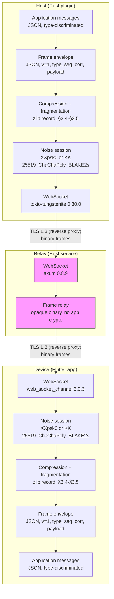
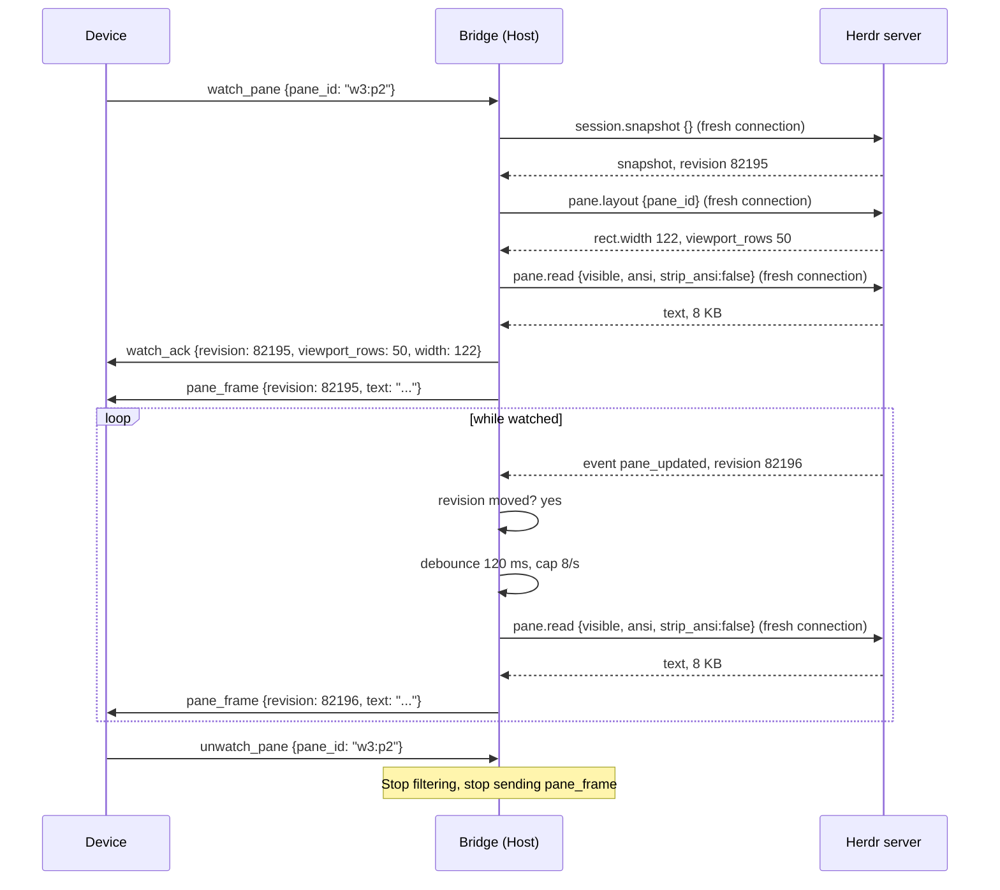

# 11 — Relay Wire Protocol

This document is normative. It decides. Every rule is numbered `R-11-XXX`. Other documents cite
these rules. Implementers follow them in order.

This document owns the wire protocol across all three legs: Host to relay, Device to relay, and the
end-to-end encrypted tunnel between Host and Device that the relay only forwards. It is the keystone
document that lets the Rust Host plugin, the Rust relay and the Flutter app be built independently
and still interoperate.

Roles in every diagram: **Host** (machine running Herdr and the plugin), **Relay** (hosted relay
service), **Device** (the phone). The relay service and the role name "Hub" refer to the same
component. This document uses "relay."

Related documents:

- `docs/02-herdr-probe-results.md` — measured Herdr socket facts, rules `R-02-xxx`.
- `docs/03-product-decisions.md` — user-set product policy, rules `R-03-xxx`.
- `docs/10-herdr-integration.md` — bridge to Herdr, rules `R-10-xxx`.
- `docs/12-relay-hosting.md` — relay architecture and hosting requirements, rules `R-12-xxx`.
- `docs/13-security-pairing.md` — Noise pairing, cryptography, identity, rules `R-13-xxx`.
- `docs/14-relay-deployment.md` — the supported public deployment profile, rules `R-14-xxx`.
- `docs/20-mobile-framework.md` — app stack, rules `R-20-xxx`.
- `docs/21-terminal-rendering.md` — terminal rendering, rules `R-21-xxx`.
- `docs/22-platform-integration.md` — platform integration, rules `R-22-xxx`.
- `docs/30-ux-spec.md` — UX specification, rules `R-30-xxx`.

## 1. Layer cake

Five layers sit on top of each other. Each layer has a name, a technology, a version, and a boundary
that says who can read it.

| Layer | Technology | Version | Relay can read | Relay cannot read |
|-------|-----------|---------|---------------|-----------------|
| 6. Physical WebSocket | `tokio-tungstenite` (Host), `axum` (relay), `web_socket_channel` (Device) | 0.30.0 / 0.8.9 / 3.0.3 | Frame boundaries, binary or text opcode | Frame content inside Noise |
| 5. TLS | TLS 1.3 terminated by the reverse proxy | — | Nothing (reverse proxy terminates) | Nothing |
| 4. Noise session | `Noise_XXpsk0_25519_ChaChaPoly_BLAKE2s` (pair), `Noise_KK_25519_ChaChaPoly_BLAKE2s` (reconnect) | snow 0.10.0 / cryptography 2.9.0 + cryptography_flutter 2.3.4 | Nothing | Everything inside Noise |
| 3. Compression and fragmentation | zlib (RFC 1950) record and fragment headers, §3.4-§3.5 | `flate2` 1.1.9 (Host) / `dart:io` `ZLibCodec` (Device) | Nothing (inside Noise) | — |
| 2. Frame envelope | JSON, protocol version 1 | — | Nothing (inside Noise) | — |
| 1. Application messages | JSON discriminated by `type` | — | Nothing (inside Noise) | — |

**R-11-001**: The relay MUST see only the outer WebSocket frame (binary opcode, length) and the
routing handle in the URL path. The relay MUST NOT see any frame content inside the Noise session.
Rationale: the relay is untrusted infrastructure (R-13-002).

**R-11-002**: RETIRED. Cloudflare-specific deployment language. See R-11-122 for the corrected TLS
claim.

**R-11-003**: The Host and Device MUST establish a Noise session inside the WebSocket. The relay
forwards opaque binary frames and performs no application-layer cryptographic operation (R-13-012).
Rationale: end-to-end encryption between Host and Device, with the relay as a wire only.



The relay (magenta) sees only the WebSocket layer. Everything above it is Noise ciphertext.

## 2. Relay-facing protocol

The relay-facing protocol is the outer WebSocket layer. It carries registration frames (plaintext
JSON) before the Noise tunnel starts, then opaque binary frames (Noise ciphertext) after.

### 2.1 WebSocket URL shape

**R-11-110**: The Host MUST connect to the relay at this URL shape:

```text
wss://<origin-host>/host/<handle>
```

The Device MUST connect at:

```text
wss://<origin-host>/device/<handle>
```

Where `<handle>` is the opaque routing handle (R-11-112).

Example Host URL:
`wss://relay.example.com/host/n6Loxf94CfyIO6hOxlaHvA`

Example Device URL:
`wss://relay.example.com/device/n6Loxf94CfyIO6hOxlaHvA`

**R-11-111**: The app MUST build these URLs from the stored relay origin by mapping `https://` to
`wss://` and `http://` to `ws://`. The origin is stored and validated as specified in
`docs/22-platform-integration.md`. The app has no compiled default origin
(R-03-030). `http://` is permitted only for the local-development addresses listed in
`docs/22-platform-integration.md` R-22-040 and carries a persistent insecure-development warning.

**R-11-112**: The Host MUST generate the handle from a cryptographic random source (`rand` 0.10.2).
The handle is 128 bits (16 bytes), encoded as unpadded base64url per RFC 4648 section 5. The
alphabet is `A-Z a-z 0-9 - _`. The result is exactly 22 characters. The handle carries no
structure, no checksum and no embedded time. Rationale: the handle is opaque. Noise authenticates
both peers (R-13-014, R-13-015), so knowing a handle lets an attacker reach the relay's routing
table and
nothing else.

The relay MAY read the handle only to route streams. It MUST NOT interpret the handle content.

### 2.2 Subprotocol

**R-11-013**: The Host and Device MUST request the WebSocket subprotocol `herdr-relay.v1` in the
`Sec-WebSocket-Protocol` header. The relay MUST accept this subprotocol. Rationale: the subprotocol
name lets a future version negotiate `herdr-relay.v2` without breaking v1 peers.

### 2.3 Registration frames

The first WebSocket message on every connection is a registration frame. It is plaintext JSON. The
relay reads it to learn the role and validate the handle.

**R-11-113**: The Host MUST send this registration frame when it opens a connection:

```json
{"type":"host_register","protocol":1}
```

A registration that waits for a first pairing (`docs/13-security-pairing.md` R-13-035 step 3) MUST
carry one more field, `"pairing": true`:

```json
{"type":"host_register","protocol":1,"pairing":true}
```

A registration for an already paired phone (`Noise_KK`, R-13-037) MUST omit it or send `false`. The
relay applies the pairing window of `R-11-120` only when the field is `true`; a paired registration
waits for as long as the Host holds the socket. The field reveals nothing about the phrase: whether
a handle is in its first pairing is already visible to the relay from the traffic that follows.

**R-11-114**: The Device MUST send this registration frame when it opens a connection:

```json
{"type":"device_register","protocol":1}
```

The role and the handle are already carried in the URL path. The registration frame confirms the
protocol version and the peer's intent. It carries nothing that reveals the pairing phrase.
`SHA256(pairing_code)` is retired; it MUST NOT appear anywhere.

**R-11-115**: On a successful registration, the relay MUST respond:

```json
{"type":"session_joined","role":"host"}
```

or

```json
{"type":"session_joined","role":"device"}
```

After both sides are joined, the relay starts forwarding opaque binary frames bidirectionally. The
relay sends no further text messages.

### 2.4 Relay error responses

The relay sends error frames in plaintext JSON before the Noise tunnel starts. Each error is an
unrecoverable registration failure. The relay MUST close the WebSocket immediately after the error
frame.

**R-11-116**: Every relay error MUST use this exact shape:

```json
{"type":"error","code":"<code>","message":"<message>"}
```

**R-11-117**: On an unknown handle (no Host is registered), the relay MUST respond:

```json
{"type":"error","code":"handle_unknown","message":"No Host is registered under this handle"}
```

Then close with code `4001`.

**R-11-118**: On a handle that already has a Host (a second Host registers), the relay MUST respond:

```json
{"type":"error","code":"handle_taken","message":"A Host is already registered under this handle"}
```

Then close with code `4002`. The first Host is untouched.

**R-11-119**: On a handle whose Device slot is occupied (a second Device joins), the relay MUST
respond:

```json
{"type":"error","code":"host_in_use","message":"A Device is already active on this Host"}
```

Then close with code `4006`. The first Device is untouched and receives nothing.

**R-11-120**: On a handle whose Host registered with `"pairing": true` (R-11-113) and whose pairing
window expired (the phrase lifetime of `docs/13-security-pairing.md` R-13-022 elapsed since that
registration before a Device joined), the relay MUST respond:

```json
{"type":"error","code":"pairing_expired","message":"The pairing window has expired"}
```

Then close with code `4000`. The relay MUST NOT apply this window to a registration without the
field: a paired phone may reconnect hours after the Host re-registered, and a relay restart MUST
NOT break that reconnect. The Host destroys its own pairing registration at expiry (R-13-022), so
this check is a second bound, not the first.

### 2.5 Ping and pong keepalive

**R-11-022**: The relay MUST send a WebSocket ping to each connected peer every 30 seconds.
Rationale: detect a stale connection without application-level traffic.

**R-11-023**: Each peer MUST respond with a WebSocket pong within 10 seconds. If no pong arrives,
the relay MUST close the WebSocket with close code `1001` (going away).

**R-11-024**: The Host and Device MUST respond to WebSocket pings from the relay. They MUST NOT send
their own pings; the relay owns the keepalive. Rationale: one side owns the heartbeat, so two
independent timers cannot desynchronise.

### 2.6 Close codes

**R-11-121**: The relay MUST use these close codes. The application-layer error taxonomy in section
7 addresses peer-to-peer errors inside the Noise session. This table covers relay-to-peer close
events only.

| Code | Name | Meaning |
|------|------|---------|
| `1000` | normal | Clean shutdown or deliberate disconnect after a `disconnect` frame (R-11-206). The relay still closes the other peer with `1001` (R-11-125). |
| `1001` | going away | Ping timeout or relay shutdown. Reconnect with backoff. |
| `1006` | abnormal | Network drop, no close frame. Reconnect with backoff. |
| `1011` | internal error | Relay fault. Reconnect with backoff. |
| `4000` | `pairing_expired` | The 120-second phrase lifetime elapsed before the Device joined. |
| `4001` | `handle_unknown` | No Host is registered under this handle. |
| `4002` | `handle_taken` | A Host is already registered under this handle. |
| `4003` | `protocol_error` | Bad subprotocol, bad path, bad handle syntax, or bad first frame. |
| `4004` | `revoked` | The Host revoked this Device. |
| `4005` | `handshake_failed` | The Noise handshake failed. |
| `4006` | `host_in_use` | A Device is already active on this Host handle. |
| `4007` | `frame_too_large` | A frame exceeded the size limit. |
| `4008` | `rate_limited` | A connection-rate or frame-rate limit was exceeded. |

`4002` means a second Host tried to register an already-taken handle. It does not mean a second
Device. The `device_already_joined` error is retired; that case is `4006` `host_in_use`.

### 2.7 Relay frame forwarding

**R-11-026**: After both sides send registration frames and receive `session_joined`, the relay MUST
forward every binary WebSocket frame from one side to the other, verbatim. Rationale: the relay is a
wire, not a warehouse (R-12-003).

**R-11-027**: The relay MUST NOT inspect, decrypt, modify, log, or persist any frame payload
(R-12-003). The relay logs connection metadata only: timestamp, handle, connection event, frame
count, frame byte total (R-12-014).

### 2.8 TLS wording

**R-11-122**: The ingress in front of the relay terminates the public TLS hop; in the supported
profile that is Cloudflare's edge, reached through a tunnel (`docs/14-relay-deployment.md` §
"Cloudflare Tunnel", R-14-013). The relay binary still links the platform TLS stack through its
HTTP and WebSocket
library dependencies. The relay performs **no application-layer payload decryption and holds no
Noise keys.** The statement "the Hub binary has zero crypto dependencies" is retired. Rationale: the
relay's `axum` and `tokio-tungstenite` dependencies link `rustls` or the platform native TLS stack,
and the relay's test harness may connect outward over TLS. The relay is not crypto-free; it is
payload-decryption-free.

### 2.9 One active Device per Host

**R-11-123**: The relay MUST map one handle to at most one Host connection and at most one Device
connection. Two Hosts under the same handle are rejected (`R-11-118`). Two Devices under the same
handle are rejected (`R-11-119`). The first Device is untouched and stays connected.

**R-11-124**: The app MUST show the banner text of `R-30-940` for the `host_in_use` error. A
Device that is already paired MUST return to the Host list. A Device that is still pairing MUST
stay on the pairing screen, per `docs/31-mockups/02-pair-scan.md` `R-31-02-08`. Paired identities
stay listed on the Host and stay revocable. This is the full-control model: one phone at a time,
per `R-03-040`.

**R-11-222**: The Device MUST NOT hold two open relay WebSocket connections at once. This is the
wire-level form of R-03-043. The Device MUST close the current socket before opening a new one on a
different handle. Rationale: one phone, one active computer, one socket.

### 2.10 Peer loss

**R-11-125**: When either peer's WebSocket ends, the relay MUST close the other peer at once with
close code `1001` (going away) and a reason that names the peer that is gone (`the Host is gone` or
`the Device is gone`), and MUST discard the handle registration at once. There is no grace window.
Each side reconnects on its own schedule: the Host re-registers on the R-10-014 ladder, and the
Device reconnects per R-11-200 with `Noise_KK` and the R-22-028 ladder. A Device that arrives
before the Host has re-registered receives `handle_unknown` (R-11-117) and retries. Re-pairing is
never needed for a reconnect (R-13-037, R-13-038). Rationale: a Noise transport state lives in the
peer process, so no relay-side grace window can resume a session across a peer restart. The
30-second hold-open this rule replaces could not do that either: after a Host restart it let a new
Host registration inherit a Device that held a dead Noise session and never sent its `Noise_KK`
first message, and the reconnect deadlocked.

## 3. Frame envelope

The frame envelope travels inside the Noise session. The relay never sees it.

### 3.1 Encoding choice

**R-11-030**: The frame envelope and every application message MUST use JSON encoding, UTF-8.
Verdict: JSON.

Justification against the reuse rule: the Device already has `freezed` 4.0.0 with
`json_serializable` 6.14.1 (R-20-006), and the Host already has `serde_json` via `serde`/`serde_json`
(R-10-006). JSON needs no new dependency on either side. A binary encoding (Protocol Buffers, CBOR,
MessagePack) would add a new dependency to both sides for no fidelity gain. The measured payload is
approximately 8 KB per pane frame (R-02-015). §3.4 compresses it before Noise encryption, typically
to 13 to 24 percent of that (R-02-016), so the encoding overhead is negligible after compression.

### 3.2 Envelope fields

**R-11-031**: Every frame inside the Noise session MUST carry this envelope:

```json
{
  "v": 1,
  "type": "<message_type>",
  "seq": 1,
  "corr": "<correlation_id>",
  "payload": { }
}
```

| Field | Type | Required | Description |
|-------|------|----------|-------------|
| `v` | integer | Yes | Protocol version. Currently `1`. |
| `type` | string | Yes | Message type discriminator. See section 4. |
| `seq` | integer | Yes | Monotonic sequence number per sender. Starts at `1`. |
| `corr` | string | No | Correlation ID for request-reply pairs. The requester generates it; the replier echoes it. Absent on unsolicited messages. |
| `payload` | object | Yes | Message-specific fields. May be `{}` when the message carries no data. |

**R-11-032**: The `v` field MUST be `1` for this version of the protocol. See section 10 for
versioning.

**R-11-033**: The `seq` field MUST increment by `1` on every frame a sender sends. It MUST NOT
reset within a Noise session. It MUST reset to `1` on a new Noise session (reconnect).

**R-11-034**: The `corr` field MUST be present on every request message and every reply message. It
MUST be absent on unsolicited messages (for example `pane_frame`, `tree_update`, `agent_status`).

### 3.3 Maximum frame size

**R-11-035**: The uncompressed JSON envelope MUST NOT exceed 1 MiB (1048576 bytes). **This is the
single value for the whole repository.** Every document that names a frame-size limit MUST state 1
MiB. The 256 KiB number in `docs/41-code-standards.md` was retired. Rationale: a 50-row pane frame
is approximately 8 KB (R-02-015), and a 1000-line scrollback read is approximately 190 KB
(R-10-019). 1 MiB gives 5× headroom over the largest measured payload.

**R-11-036**: If a frame would exceed 1 MiB, the sender MUST NOT send it. The sender MUST send an
`error` frame with code `frame_too_large` instead. Rationale: a frame that large indicates a bug or
an abuse, not normal operation.

### 3.4 Compression

Compression sits between the frame envelope and the Noise session: the Host and Device compress or
leave raw the envelope's serialized bytes before Noise encryption on send, and decompress after
Noise decryption on receive. The relay never compresses, decompresses, or sees this layer; it
forwards opaque Noise ciphertext only.

**R-11-229**: Sending one logical frame envelope follows this exact order: (1) serialize the JSON
envelope to UTF-8 bytes; (2) compress those bytes with zlib, or leave them raw, per the codec
decision in R-11-232, producing one R-11-231 compression record; (3) split that record into
fragments per R-11-235; (4) Noise-encrypt each fragment separately, one `Transport::encrypt` call
per fragment; (5) send each encrypted fragment as its own physical WebSocket binary frame.
Receiving reverses it exactly: read each physical WebSocket binary frame, Noise-decrypt it,
reassemble the fragments per R-11-235 through R-11-239, then decompress per R-11-234, then parse
the JSON envelope.

**R-11-230**: WebSocket-level compression (`permessage-deflate`) MUST NOT be used. Neither pinned
WebSocket library implements it: `tokio-tungstenite` 0.30.0 never implemented the extension in any
release, verified against the crate's own source and issue tracker. Even a library that did would
compress already-Noise-encrypted ciphertext, which is high-entropy and does not compress (R-13-012).
Compression happens at step 2 of R-11-229, on the plaintext frame envelope, before Noise encryption
on send, and its inverse happens after Noise decryption, before JSON parsing, on receive.

**R-11-231**: Every frame envelope's serialized UTF-8 bytes MUST be wrapped in this record before
Noise encryption:

```text
[codec: u8][uncompressed_len: u32, big-endian][body: bytes]
```

`codec` `0` means `body` is the envelope's raw UTF-8 bytes, unchanged. `codec` `1` means `body` is
the envelope's bytes compressed with zlib (RFC 1950). `uncompressed_len` is the envelope's exact
byte length before compression in both cases (redundant for codec `0`, where it MUST equal `body`'s
length). No other codec value is defined; a receiver MUST close the connection (WebSocket close
code `4003`, `protocol_error`, R-11-121) on an unrecognised codec byte.

**R-11-232**: The sender SHOULD use codec `1` (zlib) whenever compression makes `body` smaller than
the raw bytes, and MUST fall back to codec `0` otherwise (for example, an already-compact or
already-random payload). Rust: `flate2` 1.1.9 with its default `miniz_oxide` backend, added to
`crates/herdr-relay/Cargo.toml` at that exact version (R-41-043). Dart: `dart:io`'s built-in
`ZLibCodec`/`ZLibEncoder`, no new pub.dev dependency (R-20-011).

**R-11-233**: `uncompressed_len` MUST NOT exceed 1 MiB (R-11-035). The sender MUST check the
envelope's raw length against R-11-035's cap before this record is built, exactly as today;
compression happens after that check, never instead of it, and MUST NOT be used to smuggle a
logically larger envelope past the cap.

**R-11-234**: A receiver MUST reject a record whose `uncompressed_len` field already exceeds 1 MiB
before attempting decompression. A receiver MUST decompress codec `1` with a bounded or streaming
decompressor that aborts the instant its actual output exceeds 1 MiB, and MUST NOT trust
`uncompressed_len` as the sole bound: a sender that lies about `uncompressed_len` while shipping a
larger compressed payload (a decompression bomb) is stopped by this independent output-size check,
not by the declared field. On either rejection, the receiver MUST close the connection (WebSocket
close code `4003`, `protocol_error`, R-11-121).

### 3.5 Fragmentation across Noise transport messages

R-11-231's record can exceed one Noise transport message's capacity: R-10-019 measures an
approximately 190 KB scrollback read, and R-11-035's 1 MiB cap allows five times more. One
compression record MUST therefore be able to span more than one physical Noise transport message.

**R-11-235**: A Noise transport message's usable plaintext is 65519 bytes: `snow`'s 65535-byte
message ceiling (`crates/herdr-relay/src/noise.rs` `MAX_MESSAGE_LEN`) less the 16-byte ChaChaPoly
AEAD authentication tag `write_message` always appends. The 16-byte figure is confirmed, not
assumed: `snow` 0.10.0's own `CipherChaChaPoly` source defines ciphertext length as
`plaintext.len() + TAGLEN`, and its test vectors show a 0-byte plaintext producing a 16-byte
ciphertext and a 117-byte plaintext producing a 133-byte ciphertext — `TAGLEN` is 16 bytes,
matching the standard ChaCha20-Poly1305 tag length. Every physical Noise transport message's
plaintext MUST carry this 2-byte header before its share of the compression record's bytes:

```text
[frag_index: u8][frag_count: u8][chunk: bytes]
```

Two header bytes leave 65517 usable `chunk` bytes per fragment (65519 less the header). `frag_count`
is the total number of physical Noise messages the compression record is split across, the same
value on every one of them. `frag_index` runs `0`, `1`, ..., `frag_count - 1`, exactly once each, in
that order. A record that fits in one Noise message is `frag_index 0` of `frag_count 1`. The sender
MUST split R-11-231's record into consecutive `chunk`s of at most 65517 bytes each.

**R-11-236**: R-11-233's 1 MiB uncompressed cap bounds the compression record's own maximum size:
1048576 bytes raw (codec `0`), or up to about 1049641 bytes compressed (codec `1`'s zlib worst-case
expansion on already-compact data, `source_len + source_len / 1000 + 12`, plus the record's own
5-byte header). At 65517 usable bytes per fragment (R-11-235), the largest legal record needs at
most 17 fragments (`ceil(1049641 / 65517)`). A receiver MUST reject a `frag_count` above `40` on the
first fragment of a record (`frag_index 0`), before allocating any reassembly buffer or accepting
any `chunk` bytes: `40` is more than double the 17 fragments a legal record ever needs, and
rejecting on the declared count alone, before any bytes are accepted, stops a peer from making the
receiver buffer unboundedly by claiming an enormous fragment count and then sending nothing.
Independently of `frag_count`, the receiver MUST track the running total of `chunk` bytes accepted
for the current record and reject the moment that total exceeds 1049641 bytes, checked after every
fragment while reassembly is in progress, not only once it finishes: a `frag_count` that lies while
shipping oversized `chunk`s is stopped by this running check, the same declared-value-is-not-trusted
defence R-11-234 uses for decompression.

**R-11-237**: A sender MUST finish sending every fragment of one logical frame envelope, in order,
before starting any fragment of the next, in the same direction. A receiver expects `frag_index` to
arrive as `0`, `1`, `2`, ... with no gap, no repeat, and no new record's `frag_index 0` before the
previous record's last fragment (`frag_index == frag_count - 1`) has arrived. WebSocket's own
reliable, ordered, in-sequence delivery is what makes a correctly-behaving sender's fragments
arrive in that exact order; this rule is what the receiver enforces regardless, since a buggy or
adversarial sender is not bound by WebSocket's guarantees about its own message content. On any
violation of this rule, or of R-11-231's codec check, or of R-11-236's count and size bounds, the
receiver MUST discard the partial reassembly buffer and close its own WebSocket connection with
code `4003` (`protocol_error`, R-11-121). This reuses R-11-121's existing meaning for a
peer-detected case; unlike the rest of that table, which lists relay-initiated closes, this one is
the receiving peer's own decision, because no complete envelope exists yet to correlate an `error`
frame reply against (section 7 owns that separate, envelope-level taxonomy).

**R-11-238**: If a record's next fragment does not arrive within 10 seconds of the previous one —
matching R-11-023's existing pong-response bound, so no new timing constant is introduced — the
receiver MUST discard the partial reassembly buffer and close its own WebSocket connection with
code `4003`. A connection loss discards the buffer immediately, with no timeout needed: reconnect
runs a fresh `Noise_KK` handshake (R-13-037), producing a new `Transport` with no memory of the old
session, so a partial reassembly can never survive from one Noise session into the next.

**R-11-239**: Once every fragment of a record arrives without triggering R-11-237 or R-11-238, the
receiver reassembles `chunk`s in `frag_index` order into R-11-231's compression record, then
applies R-11-234's decompression and bound checks, then parses the JSON envelope. `seq` (R-11-033)
is unaffected: it increments once per logical frame envelope, never once per physical Noise message
or per fragment.

## 4. Application messages

Every message has a `type`, a sender, and a reply policy. The table below lists all messages.
Sections 4.1 through 4.27 specify each one.

| # | `type` | Sender | Reply | Correlation | Description |
|---|--------|--------|-------|-------------|-------------|
| 1 | `host_info` | Host | Device sends `device_info` | No | Protocol version, host id, host name, Herdr version, socket protocol, paired flag |
| 2 | `device_info` | Device | No | No | Device protocol version, device id, device name, platform, OS version, app version |
| 3 | `tree_request` | Device | Host sends `tree_snapshot` | Yes | Request the full workspace, tab, pane, agent tree |
| 4 | `tree_snapshot` | Host | No (reply) | Yes | Full tree from `session.snapshot` |
| 5 | `tree_update` | Host | No | No | Incremental tree change from a Herdr event |
| 6 | `watch_pane` | Device | Host sends `watch_ack` | Yes | Ask to watch one pane |
| 7 | `watch_ack` | Host | No (reply) | Yes | Confirm watch, carry initial pane metadata |
| 8 | `unwatch_pane` | Device | No | No | Stop watching a pane |
| 9 | `pane_frame` | Host | No | No | ANSI pane content with revision, viewport rows, width |
| 10 | `scroll_request` | Device | Host sends `scroll_response` | Yes | Request scrollback content |
| 11 | `scroll_response` | Host | No (reply) | Yes | Scrollback content from `source:"recent"` |
| 12 | `send_input` | Device | Host sends `send_input_ack` | Yes | Send text and/or named keys to a pane |
| 12a | `send_input_ack` | Host | No (reply) | Yes | Confirm the bridge accepted the input; carry no pane content |
| 13 | `agent_status` | Host | No | No | Agent status change, the local-notification trigger |
| 14 | `agent_prompt` | Device | Host sends `agent_prompt_ack` | Yes | Send a prompt to an agent |
| 15 | `agent_prompt_ack` | Host | No (reply) | Yes | Confirm the prompt was accepted |
| 16 | `host_action` | Device | Host sends `host_action_ack` | Yes | Workspace, tab, pane, and plugin operations: create, split, zoom, close, rename, resize, invoke |
| 17 | `host_action_ack` | Host | No (reply) | Yes | Confirm the action; carry the new id on create, the target pane id for pane-scoped actions, and optionally the resulting pane id for plugin.invoke |
| 18 | `device_list_request` | Device | Host sends `device_list` | Yes | Request the paired-device list |
| 19 | `device_list` | Host | No (reply) | Yes | Paired-device list from the Host |
| 20 | `revoke_device` | Device | Host sends `revoke_result` | Yes | Revoke one device or all devices |
| 21 | `revoke_result` | Host | No (reply) | Yes | Confirm revocation |
| 22 | `error` | Either | No | Optional | Error message with code, message, fatal flag |
| 23 | `disconnect` | Device | No | No | Deliberate disconnect; keeps the pairing and the key |
| 24 | `action_list_request` | Device | Host sends `action_list` | Yes | Request the Host's plugin action list |
| 25 | `action_list` | Host | No (reply) | Yes | Projected action list: id, title, description, contexts only |
| 27 | `host_theme` | Host | No | No | Resolved palette change for the terminal grid |

`pane_action` and `pane_action_ack` are retired. They are replaced by `host_action` and
`host_action_ack`.
`hello` and `hello_ack` are retired. They are replaced by `host_info` and `device_info`. The
`capabilities` bitmask field is retired; there is no read-only mode and no capability negotiation
for control (R-03-050).

### 4.1 host_info

Sender: Host. Reply: `device_info`. Correlation: no.

The Host sends `host_info` immediately after the Noise handshake completes. It carries the relay
protocol version, a stable Host identifier, the host name, the Herdr version and socket protocol,
and whether this is a reconnect.

| Field | Type | Required | Description |
|-------|------|----------|-------------|
| `protocol` | integer | Yes | Relay protocol version. `1`. |
| `host_id` | string | Yes | UUIDv4. Stable for the life of the Host install. |
| `host_name` | string | Yes | Host machine name for display. At most 64 UTF-8 bytes. |
| `herdr_version` | string | Yes | Herdr server version from `ping` (R-02-008). |
| `herdr_protocol` | integer | Yes | Herdr socket protocol integer from `ping`. MUST be `22` (R-10-012). |
| `paired` | boolean | Yes | `true` when this Device static key was already in the Host paired list before this session (a reconnect). `false` on first pairing. |
| `theme` | object | No | Current resolved palette, as specified in section 4.27. Absent when unavailable. |

**R-11-130**: The Host MUST send `host_info` as the first application frame after the Noise
transport reaches transport mode. No other message may precede it.

### 4.2 device_info

Sender: Device. Reply: no. Correlation: no.

The Device sends `device_info` immediately after it receives `host_info`. It carries the protocol
version, a stable device identifier, the device name, and platform information.

| Field | Type | Required | Description |
|-------|------|----------|-------------|
| `protocol` | integer | Yes | Relay protocol version. `1`. |
| `device_id` | string | Yes | UUIDv4 generated on first launch. Stable across reconnects. Destroyed on revoke or unpair. |
| `device_name` | string | Yes | Human-readable name. At most 32 UTF-8 bytes (R-11-226). |
| `platform` | string | Yes | `ios` or `android`. |
| `os_version` | string | Yes | Operating-system version string. |
| `app_version` | string | Yes | Semantic version of the app build. |

**R-11-131**: The Device MUST send `device_info` as the first application frame it sends, immediately
on receiving `host_info`. No other message may precede it.

**R-11-132**: The exchange order is positional and happens exactly once per session: `host_info`
first from the Host, `device_info` first from the Device. A peer that receives a different first
frame MUST send an `error` with code `protocol_mismatch`, `fatal: true`, and close the Noise session.

**R-11-133**: If `host_info.protocol` does not match `device_info.protocol`, the side with the
higher version MUST send an `error` with code `protocol_mismatch` and close the Noise session. See
section 10.

**R-11-226**: `device_name` MUST NOT exceed 32 UTF-8 bytes. The Device MUST enforce this before
sending `device_info`. The Host MUST reject a longer name on receipt. Rationale: the limit is a
wire constraint. The stored record in R-13-049 carries the same limit; this rule is the protocol
owner.

**R-11-223**: No `rename_device` message exists and none will be added. The Device name reaches the
Host only in `device_info` at handshake (R-11-131). A name change takes effect on the next session.
No phone may rename another phone. A phone MAY set its own `device_name`, which travels in
`device_info` at the next handshake.

### 4.3 tree_request

Sender: Device. Reply: `tree_snapshot`. Correlation: yes.

The Device requests the full workspace, tab, pane, and agent tree. This is how the agent list
(mockup 06) and its Workspace axis populate.

| Field | Type | Required | Description |
|-------|------|----------|-------------|
| (none) | | | The payload is `{}`. |

**R-11-043**: The Device MUST send `tree_request` on connect, on reconnect, and on a pull-to-refresh
gesture (docs/31-mockups/06-agent-list.md, Navigation section). Rationale: the tree comes from one
`session.snapshot` call, not polling (R-31-06-04).

### 4.4 tree_snapshot

Sender: Host. Reply: no (reply to `tree_request`; also sent unsolicited after every workspace
event, R-11-046). Correlation: yes as a reply, absent when unsolicited.

The Host calls `session.snapshot` on Herdr and sends the result. The snapshot is flat, not nested
(R-10-018).

| Field | Type | Required | Description |
|-------|------|----------|-------------|
| `workspaces` | array of objects | Yes | Each: `workspace_id`, `name`, `focused` (boolean), `repo_name` (string or null), `is_linked_worktree` (boolean), `space_id` (string or null). |
| `tabs` | array of objects | Yes | Each: `tab_id`, `workspace_id`, `title`, `focused` (boolean). |
| `panes` | array of objects | Yes | Each: `pane_id`, `workspace_id`, `tab_id`, `terminal_id`, `label`, `title`, `cwd`, `focused` (boolean), `agent` (string or null), `agent_status` (string), `revision` (integer), `scroll` (object with `offset_from_bottom`, `max_offset_from_bottom`, `viewport_rows`). |
| `agents` | array of objects | Yes | Each: `agent_kind`, `pane_id`, `status`, `status_at` (string or null, RFC 3339 UTC), `session` (string or null). |

**R-11-044**: The Host MUST map the `session.snapshot` result to this flat structure. Children are
joined by ID: a pane carries `workspace_id` and `tab_id` (R-10-018). Rationale: the Device builds
the tree by joining, not by nesting. Each workspace carries `repo_name` and `is_linked_worktree`
from Herdr's `worktree` object. `repo_name` is `null` and `is_linked_worktree` is `false` when the
workspace has no `worktree`. Each workspace also carries `space_id`, the worktree group it belongs
to: when two or more workspaces share Herdr's private `worktree.repo_key` and at least one of them
is not a linked worktree — the desktop sidebar's exact grouping (`workspace_list_entries_inner`,
Herdr `src/ui/sidebar.rs:344-441`, commit `b1ff4582e968`) — every member carries the same
`space_id`, namely the `workspace_id` of the group's parent (the first non-linked member in Herdr's
own workspace order), the parent included. Otherwise `space_id` is `null`: a lone workspace, a
linked-only group and a plain directory are never grouped. The Host reads `repo_key` only to
derive `space_id` in-process and MUST NOT forward `checkout_path`, `repo_root` or `repo_key`: they
are user-local values (2026-09-04: the Device draws Space > Worktree > Tab > Pane from `space_id`,
`repo_name` and `is_linked_worktree`; a Space is one `space_id` group, or the workspace itself when
`space_id` is `null`). `repo_name` is display metadata and MUST NOT be used to group: two repos
can share one name. `space_id` is authoritative in `tree_snapshot` only; a `tree_update.workspace`
carries `null` (R-11-046 keeps every Device's groups fresh).

**R-11-045**: The `revision` in each pane MUST come from the snapshot, not from a `pane.read`
result, which is always `0` (R-10-020, R-02-012a).

**R-11-224**: `status_at` in each `agents[]` object is an RFC 3339 UTC timestamp. It is present
when the Host observed the status change through a `pane.agent_status_changed` event. It is absent
when the Host did not observe the change — for example when the status predates the bridge start.
The Host MUST NOT invent a timestamp and MUST NOT substitute the snapshot time. Rationale: a
fabricated age is worse than no age. A person uses the age to decide what to look at first. The app
MUST handle the absent case and draw no age.

**R-11-225**: `title` in each `panes[]` object is Herdr's own `PaneInfo.title`. `terminal_title`
and `terminal_title_stripped` MUST NOT cross the wire. Rationale: a terminal title is set by the
running program through an OSC escape. It is attacker-controllable and often contains a filesystem
path. `title` is Herdr's own value and `agent_status` already carries `pane_title`, so the value is
already deemed safe to transmit. Withholding it from the snapshot was the inconsistency.

### 4.5 tree_update

Sender: Host. Reply: no. Correlation: no.

The Host sends an incremental tree change when a Herdr event fires. The Device updates its local
tree without a full `tree_request`.

| Field | Type | Required | Description |
|-------|------|----------|-------------|
| `event` | string | Yes | Herdr event type: `workspace.created`, `workspace.updated`, `workspace.renamed`, `workspace.closed`, `tab.created`, `tab.closed`, `tab.renamed`, `tab.focused`, `pane.created`, `pane.closed`, `pane.updated`, `pane.focused`, `pane.agent_status_changed`, `layout.updated`. |
| `pane` | object | No | The pane object, present when the event carries one (for example `pane.updated`). Same shape as a pane in `tree_snapshot`. |
| `workspace` | object | No | The workspace object, present for workspace events. |
| `tab` | object | No | The tab object, present for tab events. |

**R-11-046**: The Host MUST send `tree_update` for every subscribed event that changes the tree.
Rationale: the tree follows events, not polling (R-31-06-04). The Host MUST also follow every
`workspace.created`, `workspace.updated`, `workspace.renamed` and `workspace.closed`
`tree_update` with a fresh full `tree_snapshot` (no `corr`): group membership (`space_id`) is
whole-list state that one incremental workspace object cannot carry, so only a full snapshot
resynchronises it; the Device adopts any `tree_snapshot` as its new base wholesale, whether or
not it asked for one. The Host MUST do the same after `tab.closed`, `pane.closed` and
`pane.agent_status_changed` of every status (amended 2026-09-11): Herdr sends these three with a
**flat** payload, measured live as `{"tab_id","workspace_id"}` for `tab_closed` and the flat
`pane_agent_status_changed` variant of R-11-057, so the `tree_update` they produce carries no
`pane`, `tab` or `workspace` object and the Device cannot apply it; and Herdr sends **no**
`pane.closed` for the panes of a closed tab, so only a snapshot removes them. Until this
amendment the Device kept a closed tab's panes and never saw `done` return to `working`. The Host
MUST also do the same after `pane.focused` (amended 2026-09-11, second): a focus is how Herdr
marks an agent seen, which moves `done` to `idle` with **no** status event and a flat
`pane_focused` payload (`R-02-031`), so only a snapshot carries the new status to the Device. A
failed snapshot fetch is not fatal: the next event or a reconnect resynchronises.

**R-11-047**: The Host MUST subscribe to these Herdr events on the long-lived subscription
connection: `workspace.created`, `workspace.updated`, `workspace.renamed`, `workspace.closed`,
`tab.created`, `tab.closed`, `tab.renamed`, `tab.focused`, `pane.created`, `pane.closed`,
`pane.updated`, `pane.focused`, `pane.agent_status_changed`, `layout.updated` (R-10-011).

### 4.6 watch_pane

Sender: Device. Reply: `watch_ack`. Correlation: yes.

The Device asks to watch one pane. This is how the bridge learns what to filter to, per R-02-013.

| Field | Type | Required | Description |
|-------|------|----------|-------------|
| `pane_id` | string | Yes | The pane to watch, for example `w3:p2`. |

**R-11-048**: The Device MUST watch at most one pane at a time (R-10-033). If the Device sends
`watch_pane` while another pane is already watched, the bridge MUST unwatch the previous pane and
watch the new one. The bridge sends `watch_ack` for the new pane. Rationale: the Device shows one
terminal at a time (R-10-033); automatic unwatch is simpler and more robust than requiring the
Device to unwatch first.

### 4.7 watch_ack

Sender: Host. Reply: no (reply to `watch_pane`). Correlation: yes.

The bridge confirms the watch and carries the initial pane metadata: the current revision, the
viewport row count, the column width, and the scroll state.

| Field | Type | Required | Description |
|-------|------|----------|-------------|
| `pane_id` | string | Yes | The pane being watched. |
| `revision` | integer | Yes | Current revision from `session.snapshot` (R-10-020). |
| `viewport_rows` | integer | Yes | From `scroll.viewport_rows` (R-10-024). |
| `width` | integer | Yes | From `pane.layout` `rect.width`, in character cells (R-10-024). |
| `scroll` | object | Yes | `offset_from_bottom` (integer), `max_offset_from_bottom` (integer). |

**R-11-049**: The bridge MUST call `session.snapshot` and `pane.layout` before sending `watch_ack`,
to populate `revision`, `viewport_rows`, `width`, and `scroll` (R-10-028, R-10-025). Rationale: the
Device needs the grid size before the first `pane_frame` arrives.

### 4.8 unwatch_pane

Sender: Device. Reply: no. Correlation: no.

The Device stops watching a pane. This happens when the terminal route closes
(docs/31-mockups/08-terminal.md).

| Field | Type | Required | Description |
|-------|------|----------|-------------|
| `pane_id` | string | Yes | The pane to stop watching. |

**R-11-050**: The bridge MUST stop forwarding `pane_frame` messages for the unwatched pane.
Rationale: the Device is no longer viewing the pane; forwarding would waste bandwidth (R-02-013).

### 4.9 pane_frame

Sender: Host. Reply: no. Correlation: no.

The Host sends the ANSI pane content. This is the payload the terminal emulator renders.

| Field | Type | Required | Description |
|-------|------|----------|-------------|
| `pane_id` | string | Yes | The pane this frame belongs to. |
| `revision` | integer | Yes | Revision from the `pane.updated` event that triggered this read (R-10-020, R-02-012a). |
| `viewport_rows` | integer | Yes | Row count from `scroll.viewport_rows` (R-10-024). |
| `width` | integer | Yes | Column count from `pane.layout` `rect.width` (R-10-024). |
| `text` | string | Yes | Full ANSI text from `pane.read` with `format:"ansi"`, `strip_ansi:false`, `source:"visible"` (R-02-014, R-10-021). |

**R-11-051**: The `text` field MUST carry the full visible viewport, not a delta or a fragment
(R-10-018). Rationale: `source:"visible"` is a full-viewport repaint, always (R-10-018).

**R-11-052**: The `revision` field MUST be the latest value the Host holds for the pane from a
`pane.updated` event or from `session.snapshot`, never from the `pane.read` result, which is always
`0` (R-10-020, R-02-012a). A frame the R-10-070 poll produces carries that same latest value
unchanged, so two frames MAY share a revision when the text moved and the revision did not
(R-02-026; corrected 2026-09-03).

### 4.10 scroll_request

Sender: Device. Reply: `scroll_response`. Correlation: yes.

The Device requests scrollback content above the visible viewport. This is how the terminal view
shows older lines when the user scrolls up (mockup 08, callout 10).

| Field | Type | Required | Description |
|-------|------|----------|-------------|
| `pane_id` | string | Yes | The pane to read scrollback from. |
| `lines` | integer | Yes | Number of lines to request. Must not exceed 1000 (R-10-019). |

**R-11-053**: The bridge MUST issue `pane.read` with `source:"recent"`, `format:"ansi"`,
`strip_ansi:false`, and `lines` capped at 1000 (R-10-027, R-10-019). Rationale: `source:"recent"`
returns scrollback; `source:"visible"` returns only the viewport.

### 4.11 scroll_response

Sender: Host. Reply: no (reply to `scroll_request`). Correlation: yes.

| Field | Type | Required | Description |
|-------|------|----------|-------------|
| `pane_id` | string | Yes | The pane this scrollback belongs to. |
| `text` | string | Yes | ANSI text from `pane.read` with `source:"recent"`. |
| `lines` | integer | Yes | Number of lines returned. May be less than requested if the pane has fewer lines. |
| `truncated` | boolean | Yes | `true` when the returned window does not cover the full scrollback (R-10-019). |

### 4.12 send_input

Sender: Device. Reply: no. Correlation: no.

The Device sends input to a pane. This carries text and/or named keys. The bridge maps this to the
correct Herdr method (R-10-044).

| Field | Type | Required | Description |
|-------|------|----------|-------------|
| `pane_id` | string | Yes | The target pane. |
| `text` | string | No | Literal text to send. Used for printable characters and for the six unnamed keys as raw sequences (R-10-036). |
| `keys` | array of strings | No | Named keys, for example `["Enter"]` or `["ctrl+c"]` (R-10-036 to R-10-039). |

**R-11-054**: The Device MUST resolve a key press in this order and stop at the first match
(R-10-044):

1. Printable character, no modifier other than shift: send `text`.
2. One of the six unnamed keys (`Home`, `End`, `PageUp`, `PageDown`, `Delete`, `Insert`): send the
   raw sequence in `text` (R-10-036).
3. Named key, with or without modifiers: send `keys`.
4. A committed multi-character string on an agent pane: use `agent_prompt` (section 4.14).

**R-11-055**: The bridge MUST validate every `send_input` request against the schema before
forwarding it to Herdr (R-10-013, R-02-009). A malformed request costs the Herdr connection and
returns an error with an empty `id` that cannot be correlated.

**R-11-056**: The bridge MUST map `send_input` to the correct Herdr method:

- If `PaneInfo.agent` is non-null and the input is a committed multi-character string: use
  `agent.prompt` (R-10-040).
- If `PaneInfo.agent` is non-null and the input is a single key press or control chord: use
  `pane.send_input` (R-10-041).
- If `PaneInfo.agent` is null: use `pane.send_input` for all input (R-10-042).
- The bridge MUST NOT pass `wait` in `agent.prompt` (R-10-043).

### 4.12a send_input_ack

Sender: Host. Reply: no (reply to `send_input`). Correlation: yes.

The Host confirms that the bridge accepted the input and passed it to Herdr. The acknowledgement
carries no pane content. The Device drives its send-state transitions only from this reply.

| Field | Type | Required | Description |
|-------|------|----------|-------------|
| `pane_id` | string | Yes | The pane the input was sent to. |
| `accepted` | boolean | Yes | `true` when the bridge accepted the input and forwarded it to Herdr. |

**R-11-227**: The Host MUST reply with `send_input_ack` for every `send_input` it receives. The
`corr` field MUST echo the correlation id of the `send_input` request (R-11-034). The reply proves
the bridge passed the input to Herdr. It cannot prove the program in the pane acted on it. A control
key can produce no visible change, and a later snapshot cannot distinguish a no-op from an
undelivered send. The acknowledgement is the only signal the Device has.

**R-11-228**: The Device MUST NOT automatically retry an unacknowledged `send_input`. A person MAY
retype; the app MAY NOT re-send. After a lost acknowledgement the Device enters the outcome-unknown
state of R-30-518. The one-tap-retry prohibition of R-30-518 applies: the Device MUST NOT offer
`Try again` and MUST NOT re-send the same input until it reconciles the outcome. Rationale: a retry
on an unacknowledged send can repeat a command in a live shell, which is worse than dropping one
keystroke.

### 4.13 agent_status

Sender: Host. Reply: no. Correlation: no.

The Host sends an agent status change. This is the trigger for a local notification
(R-30-502, R-22-022).

| Field | Type | Required | Description |
|-------|------|----------|-------------|
| `host_id` | string | Yes | The `host_id` from `host_info`. Routes the notification tap. |
| `pane_id` | string | Yes | The pane holding the agent. |
| `workspace_id` | string | Yes | The workspace id. |
| `tab_id` | string | Yes | The tab id. |
| `tab_title` | string | Yes | Tab title for the notification body. |
| `pane_title` | string | Yes | Pane title for the notification body. |
| `agent_kind` | string | Yes | For example `claude` or `codex`. |
| `status` | string | Yes | One of `idle`, `working`, `blocked`, `done`, `unknown`. |
| `at` | string | Yes | RFC 3339 UTC timestamp of the status change. Orders unseen attention. |

**R-11-057**: The Host MUST send `agent_status` when a `pane.agent_status_changed` event fires and
the new status is `blocked` or `done` (R-30-502). The Host MAY send it for other statuses.
Rationale: `blocked` and `done` drive attention and notifications; the others do not. The push's
`data` is flat and carries no pane or tab object (`docs/10-herdr-integration.md` §3.3), so the
Host fills `workspace_id`, `tab_id`, `tab_title` and `pane_title` from a fresh
`session.snapshot`, and skips the send when that snapshot no longer holds the pane.

**R-11-058**: The Host MUST NOT send pane text in `agent_status`. The readable fields the
notification carries are `agent_kind`, `tab_title`, and `pane_title` (R-30-510). `workspace_id`
routes the tap but is not displayed. Pane text on a lock screen was never agreed to.

**R-11-059**: The Host MUST apply a 30-second settle window per agent. An agent that goes `blocked`,
then `working`, then `blocked` again inside 30 seconds notifies once (R-30-507).

**R-11-134**: The app MUST route a notification tap to `/hosts/:hostId/panes/:paneId`, where
`hostId` is `host_id` and `paneId` is `pane_id`. Degenerate cases:

- Host disconnected: route to the Host screen, show the disconnected state, offer reconnect
  (R-30-512).
- Pane closed: route to the Host tree, show `That pane has closed` (R-30-513).
- App locked: hold the route, present the biometric lock, then continue to the held route
  (R-22-025).
- Handle unknown or Host unpaired: route to the Host list and show the pairing entry point.

There is no push notification path, no contentless wake-up, and no background delivery. The
notification model is **local notifications while the app is running** (R-03-060,
`docs/22-platform-integration.md` R-22-022). APNs, FCM, Firebase, push tokens and every
related dependency are retired.

### 4.14 agent_prompt

Sender: Device. Reply: `agent_prompt_ack`. Correlation: yes.

The Device sends a prompt to an agent. This is the prompt composer path (mockup 11).

| Field | Type | Required | Description |
|-------|------|----------|-------------|
| `target` | string | Yes | The agent target: a pane ID or agent identifier. |
| `text` | string | Yes | The prompt text. Multi-line is permitted. |

**R-11-060**: The bridge MUST map `agent_prompt` to the Herdr `agent.prompt` method without `wait`
(R-10-040, R-10-043). Rationale: `wait` holds the request connection open, and the Device already
learns the outcome from `agent_status`.

### 4.15 agent_prompt_ack

Sender: Host. Reply: no (reply to `agent_prompt`). Correlation: yes.

| Field | Type | Required | Description |
|-------|------|----------|-------------|
| `target` | string | Yes | The agent target. |
| `accepted` | boolean | Yes | `true` if the prompt was accepted by Herdr. |

### 4.16 host_action

Sender: Device. Reply: `host_action_ack`. Correlation: yes.

The Device requests a workspace, tab, or pane action: create, split, zoom, close, rename, resize, or
invoke a plugin action. A paired phone has full control; there is no read-only mode and no capability
negotiation (R-03-050).

| Field | Type | Required | Description |
|-------|------|----------|-------------|
| `action` | string | Yes | One of `workspace.create`, `tab.create`, `pane.split` (create), `split`, `zoom`, `close`, `rename`, `resize` (pane operations), or `plugin.invoke` (invoke a plugin action). |
| `pane_id` | string | Conditional | The target pane. Required for `split`, `zoom`, `close`, `rename`, `resize`, and `pane.split` (as `target_pane_id`). Absent for `workspace.create`, `tab.create`, and `plugin.invoke` (unless the Device is viewing a pane). |
| `workspace_id` | string | Conditional | The target workspace. Required for `workspace.create` (as the workspace to act in). Optional for `tab.create`, `pane.split`, and `plugin.invoke`; the Host resolves the default when absent. |
| `tab_id` | string | Conditional | The target tab. Optional for `plugin.invoke`; sent when the Device is viewing a tab. |
| `plugin_id` | string | Conditional | The plugin id. Required when `action` is `plugin.invoke`; absent otherwise. |
| `action_id` | string | Conditional | The action id to invoke within that plugin. Required when `action` is `plugin.invoke`; absent otherwise. |
| `params` | object | No | Action-specific parameters. Create: every field is optional except `pane.split` `direction`. `workspace.create` and `tab.create` take `cwd` (nullable), `env` (map), `focus` (boolean, default `false`, MUST be sent as `false` per R-11-203), and `label` (nullable). `pane.split` takes `cwd` (nullable), `env` (map), `focus` (boolean, MUST be `false` per R-11-203), `direction` (required, `"right"` or `"down"`), `ratio` (nullable float), `target_pane_id` (nullable, overridden by the top-level `pane_id` when present), and `workspace_id` (nullable). `pane.split` has no `label`; the Herdr schema (PaneSplitParams) carries `label` for workspaces and tabs only. Pane operations: `split` takes `{"direction":"right"\|"down","focus":false}`; `focus` MUST be `false` per R-11-203. `rename` takes `{"label":<string>\|null}`; `label` is nullable, so a rename can also clear a label. `resize` takes `{"direction":"left"\|"right"\|"up"\|"down","amount":<float>}`; `direction` is required per the Herdr schema (PaneResizeParams, `docs/21-terminal-rendering.md` R-21-008). `zoom` takes `{"mode":"toggle"\|"on"\|"off"}`; defaults to `"toggle"`. `"on"` and `"off"` are idempotent under R-30-518; `"toggle"` is not. `close`: no params; `pane.close` takes only `pane_id` at the top level. `plugin.invoke`: no params; the Host builds `PluginInvocationContext` locally from a fresh `session.snapshot` (R-11-215). |

Creating is not destructive, so `workspace.create`, `tab.create` and `pane.split` need no
confirmation (R-30-005). `plugin.invoke` is not classified as destructive because the protocol
cannot determine destructiveness (R-11-220), so it needs no confirmation modal, but it uses an
explicit tap on a labelled row that shows its own `description` rather than an accidental swipe
target.

**R-11-201**: The bridge MUST validate every `host_action` request against the schema before
forwarding it to Herdr (R-10-013, R-02-009, R-11-090). A malformed request costs the Herdr
connection and returns an error with an empty `id` that cannot be correlated.

**R-11-202**: The bridge MUST map `host_action` to the corresponding Herdr method:

- `workspace.create` → `workspace.create`
- `tab.create` → `tab.create`
- `pane.split` → `pane.split`
- `split` → `pane.split`
- `zoom` → `pane.zoom`
- `close` → `pane.close`
- `rename` → `pane.rename`
- `resize` → `pane.resize`
- `plugin.invoke` → `plugin.action.invoke`

`resize` is a documented protocol capability. No mockup screen currently sends it; the pane-action
sheet (`docs/31-mockups/10-pane-actions.md`) removed the resize entry because reshaping the
workstation layout from a phone is hostile to the person at that desk. The mapping stays so a
future screen can use it without a protocol change.

Rationale: these are direct Herdr API calls (R-10-018). See `docs/10-herdr-integration.md` R-10-054
for the bridge-side create sequence.

**R-11-203**: The Device MUST send `focus` as `false` in every create action. Rationale: a phone
MUST NOT steal focus on the workstation; a person may be sitting at that desk. The phone navigates
to the new entity itself.

**R-11-204**: `server.stop`, `workspace.close`, `tab.close`, `plugin.disable`, `plugin.enable`,
`plugin.link`, and `plugin.unlink` MUST NOT be reachable from the Device. The `host_action` envelope
MUST NOT accept an action value for `server.stop`, `workspace.close`, or `tab.close`. The bridge
MUST NOT forward any relay request that names `plugin.disable`, `plugin.enable`, `plugin.link`, or
`plugin.unlink`. Rationale: a phone that can stop a workstation server or close a workspace is a
hazard; a phone that can change which plugins a workstation loads is equally hazardous. `pane.close`
stays permitted because the pane-actions mockup (10) already carries it and a pane-close confirmation.

### 4.17 host_action_ack

Sender: Host. Reply: no (reply to `host_action`). Correlation: yes.

| Field | Type | Required | Description |
|-------|------|----------|-------------|
| `action` | string | Yes | The action that was performed. |
| `success` | boolean | Yes | `true` if the action succeeded. |
| `pane_id` | string | Conditional | The pane that was acted on. Present for pane-scoped actions (`split`, `zoom`, `close`, `rename`, `resize`, `pane.split`). For `pane.split`, this is the target (original) pane; the new pane id is in `result_id`. For `plugin.invoke`, present when the Host can attribute a resulting pane to the invocation (R-11-217). Absent for `workspace.create` and `tab.create`. |
| `result_id` | string | Conditional | The id of the newly created entity. Present on success for `workspace.create` (carries `workspace_id`), `tab.create` (carries `tab_id`), and `pane.split` (carries the new `pane_id`). For `plugin.invoke`, present when the Host can attribute a newly created pane to the invocation (R-11-217). Absent for non-create actions. |

**R-11-205**: The `host_action_ack` for a create action MUST carry the id of the newly created
workspace, tab or pane in `result_id`. Rationale: the Device must navigate to the new entity without
issuing a full `tree_request`. The new entity also arrives in a `tree_update` event (R-10-054), but
the `result_id` gives immediate navigation.

**R-11-215**: When `action` is `plugin.invoke`, the Host MUST build the `PluginInvocationContext`
from its own current state. The Device sends at most one surface id — `workspace_id`, `tab_id`, or
`pane_id` — naming what the Device is viewing. The Host resolves `focused_workspace_id`,
`focused_tab_id`, and `focused_pane_id` from a fresh `session.snapshot` and sets them as the
context defaults. When the Device sends a surface id, the Host uses it to override the
corresponding focused id. Rationale: the Device knows which surface it is viewing, but the Host
owns the current state and resolves the ids the Device did not name.

**R-11-216**: The Device MUST NOT be able to set `selected_text`, `focused_pane_cwd`,
`workspace_cwd`, `clicked_url`, or `link_handler_id` in the invocation context. The Host MUST set
every context field from its own Herdr calls and MUST ignore any such field the Device sends.
Rationale: a phone that could set `selected_text` could exfiltrate pane content through a plugin
action; a phone that could set `clicked_url` or `link_handler_id` could redirect a link handler.
The invocation context fields are Host-side state, not Device-controlled input.

**R-11-217**: When `plugin.invoke` succeeds, the `host_action_ack` MUST carry `success: true` and
`action: "plugin.invoke"`. The Host MAY carry `pane_id` and `result_id` when it can attribute a
pane to the invocation with confidence. Both fields are optional and independent. When Herdr returns
an error, the Host MUST reply with an `error` frame (section 4.22) carrying the mapped error code.
The Herdr validation error MUST NOT close the Noise session (R-11-091). Rationale: the Herdr
connection is one-request-per-connection (R-02-004), so only that connection is lost; the Noise
session is separate.

**R-11-217a — Attribution**: The Host learns the resulting pane id by tree diff. Before the
`plugin.action.invoke` call, the Host snapshots the pane set from `session.snapshot`. After the
call, it waits a settle window of 200 ms, snapshots again, and diffs the two sets. If exactly one
new pane appeared, the Host sets `pane_id` to that new id and `result_id` to the same id. If zero
or more than one appeared, the Host sends neither field. The Host MUST NOT attribute a pane from
event timing alone; a `pane.created` event may arrive from another source. A wrong pane id would
navigate a person into someone else's pane, which is worse than sending none.

**R-11-217b — Toggle actions**: An action such as `herdr-sidebar/open-git` can create or destroy a
pane. When the action creates a pane, the Host sets `pane_id` and `result_id` per R-11-217a. When
the action closes or focuses an existing pane, the Host sends `success: true` with no `pane_id` and
no `result_id`. The Device MUST NOT assume a missing `pane_id` means failure; it means the Host
could not attribute a resulting pane to that invocation.

**R-11-218**: When the `plugin_id` in a `plugin.invoke` request names a plugin that has been
disabled since the `action_list` was fetched, the Host MUST reply with an `error` frame of code
`plugin_disabled`. The error is not fatal to the session.

**R-11-219**: When the `action_id` in a `plugin.invoke` request is unknown to the named plugin,
the Host MUST reply with an `error` frame of code `action_unknown`. The error is not fatal to the
session.

**R-11-220**: The protocol cannot classify an action as destructive or non-destructive.
`PluginActionInfo` carries no destructive flag. The Device MUST NOT pretend to classify
destructiveness and MUST NOT gate invocation on a classification. All actions use an explicit tap
on a labelled row that shows its own `description`. Record this as an upstream gap in
`## Open questions` with the recommended default: treat every action as potentially destructive
until Herdr exposes a destructive flag.

### 4.18 device_list_request

Sender: Device. Reply: `device_list`. Correlation: yes.

The Device requests the paired-device list from the Host (mockup 14).

| Field | Type | Required | Description |
|-------|------|----------|-------------|
| (none) | | | The payload is `{}`. |

### 4.19 device_list

Sender: Host. Reply: no (reply to `device_list_request`). Correlation: yes.

| Field | Type | Required | Description |
|-------|------|----------|-------------|
| `devices` | array of objects | Yes | Each: `id` (UUIDv4 string), `name` (string), `paired_at` (ISO 8601 string), `last_seen` (ISO 8601 string), `connected` (boolean), `platform` (string, `ios` or `android`), `fingerprint` (string, display fingerprint per R-13-040). |

**R-11-062**: The `device_list` MUST match the paired-device list the Host stores (R-13-049), with
`connected` set from the current Noise session state. The Host MUST compute `fingerprint` from the
stored `static_public_key` per R-13-040. The raw `static_public_key` MUST NOT appear in any
message.

### 4.20 revoke_device

Sender: Device. Reply: `revoke_result`. Correlation: yes.

The Device requests revocation of one device or all devices (mockup 14).

| Field | Type | Required | Description |
|-------|------|----------|-------------|
| `device_id` | string | No | The UUIDv4 of the device to revoke. Absent when `all` is `true`. |
| `all` | boolean | No | When `true`, revoke every paired device (R-13-056). |

**R-11-063**: Exactly one of `device_id` or `all` MUST be present. Rationale: the Host needs to
know whether to revoke one or all.

### 4.21 revoke_result

Sender: Host. Reply: no (reply to `revoke_device`). Correlation: yes.

| Field | Type | Required | Description |
|-------|------|----------|-------------|
| `revoked` | array of strings | Yes | UUIDv4 strings of every device that was revoked. |
| `all` | boolean | Yes | `true` if all devices were revoked (R-13-056). |

**R-11-064**: When `all` is `true`, the Host MUST also generate a new Host static keypair
(R-13-056). The current Device's session is closed; the Device MUST clear its stored Host key and
return to the pairing screen.

### 4.22 error

Sender: Either. Reply: no. Correlation: optional (present when the error replies to a request).

| Field | Type | Required | Description |
|-------|------|----------|-------------|
| `code` | string | Yes | Error code from the taxonomy in section 7. |
| `message` | string | Yes | Human-readable error text. Shown raw in the app (R-30-803). |
| `fatal` | boolean | Yes | `true` when the session must close after this error. |

**R-11-065**: An error with `fatal: true` MUST be the last frame before the Noise session closes.
The sender MUST close the WebSocket after sending it. Rationale: a fatal error is not recoverable
within the session.

### 4.23 disconnect

Sender: Device. Reply: no. Correlation: no.

The Device deliberately closes its link to the relay while keeping the pairing and the Device key.
`Disconnect` is not destructive; it is distinct from `Forget` and `Remove`, which are both destructive.

| Action | What it does | Destructive | Document |
| --- | --- | --- | --- |
| `Disconnect` | closes this phone's link to the relay, keeps the pairing and the key | no | this section |
| `Forget` | drops the paired computer on this phone and destroys the Device key for it | yes | `docs/13-security-pairing.md` R-13-052 |
| `Remove` | revokes this phone on the computer, from the Host paired-device list | yes | `docs/31-mockups/14-devices.md` |

| Field | Type | Required | Description |
|-------|------|----------|-------------|
| (none) | | | The payload is `{}`. |

**R-11-206**: The Device MUST send `disconnect` as the last application frame before closing the
WebSocket with code `1000` (normal closure). Rationale: an application frame lets the Host
distinguish a deliberate disconnect from a dropped link (code `1006`) or a ping timeout (code
`1001`). A deliberate disconnect MUST NOT look like a failure to the Host and MUST NOT trigger a
reconnect storm.

**R-11-207**: When the Host receives `disconnect`, it MUST stop forwarding frames to the Device and
record the disconnect as a deliberate action — not a failure, not a loss. The Host MUST NOT trigger
a reconnect storm. R-11-125 applies the moment the Device's socket closes, deliberate or not: the
relay closes the Host's socket with `1001` and discards the room. The Host re-registers on the
R-10-014 ladder at once, so a Device that reconnects with `Noise_KK` (R-11-200) finds the handle
live again; a Device that arrives first receives `handle_unknown` (R-11-117) and retries.
Rationale: no relay-side window can resume a Noise session across a peer restart, so the reconnect
path is the same for a deliberate disconnect and for a dropped link. The `disconnect` frame is what
tells the Host which one happened.

**R-11-221**: A host switch — changing the connected computer per R-03-044 — is exactly the
`disconnect` sequence and nothing new. The Device sends `disconnect` (R-11-206), closes the socket,
then opens a new socket on the chosen computer's handle. The protocol needs no switch message, no
multiplexing and no second concurrent session, because one handle carries one Device connection
(R-11-123).

### 4.24 action_list_request

Sender: Device. Reply: `action_list`. Correlation: yes.

The Device requests the Host's plugin action list. The Host calls `plugin.action.list` on Herdr,
projects the result to remove host paths, filters by the Host's own platform, and sends
`action_list`.

| Field | Type | Required | Description |
|-------|------|----------|-------------|
| (none) | | | The payload is `{}`. |

**R-11-208**: The Device MAY send `action_list_request` after the `host_info` / `device_info`
exchange is complete. The Device SHOULD request the list once per session and cache the reply. The
Device MUST re-request on reconnect. When an `action_list` item returns `plugin_disabled` on
invocation, the Device SHOULD re-request the list to drop stale actions. Rationale: plugins are
enabled or disabled at run time, but rarely mid-session; a per-session cache plus the error-driven
refresh covers the real case without polling.

### 4.25 action_list

Sender: Host. Reply: no (reply to `action_list_request`). Correlation: yes.

The Host calls `plugin.action.list` on Herdr (see `docs/10-herdr-integration.md` R-10-056 for the
bridge-side call), projects the result, filters by platform, and sends the list.

| Field | Type | Required | Description |
|-------|------|----------|-------------|
| `actions` | array of objects | Yes | Each: `plugin_id` (string), `action_id` (string), `title` (string), `description` (string or null), `contexts` (array of strings or null). |

**R-11-209**: The `action_list` MUST carry only these fields per action: `plugin_id`, `action_id`,
`title`, `description`, `contexts`. It MUST NOT carry `command`, `manifest_path`, `plugin_root`,
`*_cwd`, or any host path. Rationale: the `command` array holds real shell commands and some embed
absolute host paths; forwarding them to the phone would leak the workstation's directory structure.
This repository already prohibits transmitting a user path (R-12-042 prohibits logging one, and
R-01-011 prohibits transmitting one through a notification channel). The Device must never see the
Host's file system layout.

**R-11-210**: The Host MUST filter the `plugin.action.list` result by its own platform before
sending `action_list`. Actions whose `platforms` do not include the Host's current OS MUST be
excluded. Rationale: five title pairs in the measured plugin set are platform variants (for example
`pair` / `pair-windows`). An unfiltered list would show five duplicate buttons to the Device, and
actions for the wrong OS would fail on invocation.

**R-11-211**: An absent `contexts` in a Herdr `plugin.action.list` result item MUST be treated as
`["global"]`. Rationale: Herdr actions without a declared context are valid everywhere; the default
lets the Device show every action rather than hiding contextless ones.

### 4.26 mark_seen

Sender: Device. Reply: no (`error` on failure). Correlation: no.

The Device tells the Host that the person has seen an agent pane: they opened it, or they used
`Mark as seen` on its row (`docs/30-ux-spec.md` R-30-503, R-30-504). The Host calls `agent.focus`
on Herdr (`docs/10-herdr-integration.md` R-10-072), which is Herdr's own seen mechanism
(`R-02-031`). The status change comes back through the normal path: Herdr emits `pane.focused`,
and R-11-046 follows it with a fresh `tree_snapshot` in which the pane reads `idle`.

| Field | Type | Required | Description |
|-------|------|----------|-------------|
| `pane_id` | string | Yes | The Herdr pane id of the agent pane, as in `tree_snapshot`. |

**R-11-240**: The Device MUST send `mark_seen` when a person opens an agent pane and when they
use `Mark as seen`, for every agent pane regardless of its current status. The Host MUST answer a
`mark_seen` for a pane that Herdr does not know as an agent with `error`, code `pane_not_found`,
`fatal: false`, and MUST NOT retry. Rationale (`R-03-125`): seen state lives on the server, so a
phone that clears a marker locally and tells no one leaves the computer showing `done` and the
next phone session showing it again. The Device sends it for every status because the server
decides what seen means for that status; the Device does not pre-judge.

**R-11-241**: The Device MUST NOT wait for a reply to `mark_seen` before clearing its own marker
(R-30-503), and MUST NOT resend it on its own. A `mark_seen` lost to a dropped connection is
repaired by the next `tree_snapshot`: the Device shows what the server says, and the next open
sends it again. Rationale: one message per human action, no queue, no timer.

### 4.27 host_theme

Sender: Host. Reply: no. Correlation: no.

| Field | Type | Required | Description |
| --- | --- | --- | --- |
| `theme` | object | Yes | Resolved palette with all fields below. |

The same palette object is used by `host_info.theme`.

| Palette field | Type | Required | Description |
| --- | --- | --- | --- |
| `name` | string | Yes | Resolved theme name. Empty when no theme is available. |
| `accent` | string | Yes | Accent colour. |
| `panel_bg` | string | Yes | Panel background. |
| `surface0` | string | Yes | First surface colour. |
| `surface1` | string | Yes | Second surface colour. |
| `surface_dim` | string | Yes | Terminal grid background. |
| `overlay0` | string | Yes | First overlay colour. |
| `overlay1` | string | Yes | Second overlay colour. |
| `text` | string | Yes | Terminal grid default foreground. |
| `subtext0` | string | Yes | Secondary text colour. |
| `mauve` | string | Yes | Mauve colour. |
| `green` | string | Yes | Green colour. |
| `yellow` | string | Yes | Yellow colour. |
| `red` | string | Yes | Red colour. |
| `blue` | string | Yes | Blue colour. |
| `teal` | string | Yes | Teal colour. |
| `peach` | string | Yes | Peach colour. |

**R-11-242**: The Host MUST include the current resolved palette in `host_info.theme` when available.
After `host_info`, it MUST send `host_theme` for every resolved palette change.
When a previously available theme becomes unavailable, it MUST send one palette
with `name: ""` and every colour set to `reset`.
The Device MUST apply the palette to the terminal grid only, as specified by R-03-131 and `docs/21-terminal-rendering.md`.
It MUST NOT apply the palette to the app chrome or composer.

**R-11-243**: Each palette colour MUST be a `#RRGGBB` string or the literal `reset`.
The Device MUST interpret `reset` as no Host override for that colour.
It MUST use the app's own grid colour instead.

## 5. Pane watch and render loop

This section specifies the end-to-end loop from the Device asking to watch a pane to the Device
receiving a `pane_frame`. Every number is measured and cited.

### 5.1 Numbered sequence

1. The Device sends `watch_pane` with `pane_id` (section 4.6).
2. The bridge subscribes once to `pane.updated` on the long-lived subscription connection, if not
   already subscribed (R-10-011, R-02-006).
3. The bridge calls `session.snapshot` on a fresh connection to get the current `revision` for the
   pane (R-10-028).
4. The bridge calls `pane.layout` on a fresh connection to get `rect.width` (R-10-025).
5. The bridge calls `pane.read` with `format:"ansi"`, `strip_ansi:false`, `source:"visible"` on a
   fresh connection (R-02-014, R-10-021).
6. The bridge sends `watch_ack` with `revision`, `viewport_rows`, `width`, `scroll` (section 4.7).
7. The bridge sends `pane_frame` with the ANSI text, `revision`, `viewport_rows`, `width` (section
   4.9).
8. On each `pane.updated` event, the bridge discards it unless `data.pane.pane_id` matches the
   watched pane (R-02-013, R-10-033).
9. If `data.pane.revision == lastRevision`, the bridge discards the event (R-02-012, R-10-032). The
   text is byte-identical.
10. Otherwise, the bridge updates `lastRevision` and starts a 120 ms debounce timer (R-10-029).
11. Further events for the same pane during the 120 ms window update the stored revision but MUST
    NOT start a second timer (R-10-031).
12. On the timer, the bridge checks the 8 reads per second cap (R-10-030). If the cap is exceeded,
    the bridge drops the excess and keeps only the newest pending revision.
13. The bridge issues `pane.read` with `format:"ansi"`, `strip_ansi:false`, `source:"visible"` on a
    fresh connection (R-10-009).
14. The bridge sends `pane_frame` with the result.
15. The bridge takes `revision` from the `pane.updated` event, never from the `pane.read` result,
    which is always `0` (R-10-020, R-02-012a).

### 5.2 Edge cases

**R-11-070**: When the Device is slow (backpressure), the bridge MUST drop intermediate frames and
keep only the newest. Rationale: every frame is a full repaint (R-10-018), so an older frame has no
value once a newer one exists.

**R-11-071**: When the watched pane closes (the `pane_id` is absent from a `session.snapshot` or a
`pane.closed` event fires), the bridge MUST send a `tree_update` with `event: "pane.closed"` and
stop watching. The Device shows "This pane closed." (mockup 08, empty state). Rationale: the bridge
MUST NOT assume the pane survived (R-10-035).

**R-11-072**: When the Device switches panes, it sends `watch_pane` for the new pane. The bridge
MUST unwatch the previous pane and watch the new one (R-11-048). The Device does not need to send
`unwatch_pane` first.

**R-11-073**: When the revision jumps far because the Device was away, the bridge MUST send one
full-viewport `pane_frame`. A fresh full-viewport read is approximately 8 KB (R-02-015) and
supersedes every earlier frame. The bridge MUST NOT replay buffered frames. See section 6.

**R-11-074**: Only one pane is watched at a time (R-10-033). The bridge MUST filter events to the
watched pane only. Forwarding the raw event stream would waste approximately 9.8 events per second
on panes nobody is watching (R-02-013).



## 6. Sequence numbers, resume, and reconnect

### 6.1 Sequence numbers

**R-11-080**: Each side MUST maintain a monotonic sequence number (`seq`) starting at `1`. It
increments by `1` on every frame the sender sends. Rationale: the sequence number lets the receiver
detect gaps and log them, though it MUST NOT buffer frames for replay.

**R-11-081**: The sequence number MUST reset to `1` on a new Noise session (reconnect). Rationale:
a new Noise session has new keys, so old sequence numbers have no meaning.

### 6.2 Resume with the handle model

**R-11-082**: RETIRED. Reconnect bearer-token routing. Replaced by R-11-200.

**R-11-083**: RETIRED. Session hold-open wording tied to the old session-ID model.
Replaced by R-11-125, which now forbids any relay-side hold-open.

**R-11-200**: A Device that lost the network MUST resume by reconnecting on the same
`/device/<handle>` URL. The relay routes by the handle (R-12-004). The Device performs
`Noise_KK_25519_ChaChaPoly_BLAKE2s` with its pinned Host static key (R-13-014). The Host validates
the Device by the pinned static key during the Noise handshake itself; the relay only routes the
handle. No pairing code, no reconnect bearer token as a plaintext relay input, and no reconnect
broadcast are needed. Rationale: the handle survives reconnect (R-03-040), and Noise KK with pinned
static keys authenticates both peers without any relay assistance.

**R-11-084**: After the Noise handshake on reconnect, the Device MUST send `tree_request` to
resynchronise. The Host responds with `host_info` (the first frame after transport), then
`device_info`, then `tree_snapshot`. The Device then sends `watch_pane` for the pane it was
viewing. Rationale: the Device needs current state, not replayed old state.

### 6.3 No replay buffer

**R-11-085**: The protocol MUST NOT buffer frames while the Device is away. A fresh full-viewport
read is approximately 8 KB (R-02-015) and supersedes every earlier frame, so replaying buffered
frames would waste bandwidth and arrive out of order. The Device MUST resynchronise by reading
current state, not by replaying history. Rationale: this is the reuse ladder applied to the resume
problem. A full-viewport read is one Herdr call at 1 ms p50 (R-10-022), and it is always correct.
A replay buffer is complexity that buys nothing.

### 6.4 Stale Device detection

**R-11-086**: The Host MUST detect a stale Device connection by the absence of WebSocket pongs. The
relay pings every 30 seconds with a 10-second timeout (R-11-022, R-11-023). If the Device does not
respond, the relay closes the Device's WebSocket with code `1001`. That close is a peer loss
(R-11-125): the relay closes the Host's socket with `1001` in turn and discards the room. The Host
re-registers at once (R-10-014) and the Device reconnects with `Noise_KK` (R-11-200).

**R-11-087**: RETIRED. Queueing agent_status during disconnect assumed a push wake-up path. The
notification model is local-only and app-alive-only (R-11-134). An `agent_status` message that
could not reach the Device is simply absent; the Device resynchronises on reconnect and the
"unseen attention" indicator shows the agent state from the fresh `tree_snapshot`.

### 6.5 Reconnect backoff

**R-11-088**: The Device MUST use the reconnect backoff schedule from
`docs/22-platform-integration.md` R-22-028:

| Attempt | Delay |
|---------|-------|
| 1 | 0.5 s |
| 2 | 1 s |
| 3 | 2 s |
| 4 | 5 s |
| 5 | 10 s |
| 6+ | 30 s (cap, repeat indefinitely) |

The backoff resets to attempt 1 after any successful connection that lasts at least 30 seconds.
Rationale: align with the existing schedule rather than inventing a new one.

## 7. Error handling and error taxonomy

### 7.1 Error taxonomy

| Code | Meaning | Raised by | Fatal to session | Peer action |
|------|---------|-----------|-------------------|-------------|
| `protocol_mismatch` | Relay protocol version mismatch | Both | Yes | Close session, show error, return to pairing |
| `herdr_protocol_mismatch` | Herdr socket protocol not 22 | Host | Yes | Host refuses to serve; Device shows "different Herdr version" (R-10-012) |
| `unknown_message` | Unknown message `type` | Both | No | Log, ignore the frame |
| `frame_too_large` | Frame exceeds 1 MiB | Both | No | Sender did not send it; receiver logs if it arrives |
| `pane_not_found` | Pane does not exist | Host | No | Reply with error to the Device |
| `agent_not_found` | Agent does not exist | Host | No | Reply with error to the Device |
| `invalid_request` | Malformed request rejected by Herdr | Host | No | Reply with error to the Device (R-02-009) |
| `invalid_key` | Unsupported key name | Host | No | Reply with error to the Device |
| `timeout` | Herdr request timed out | Host | No | Reply with error to the Device |
| `agent_prompt_stalled` | Agent did not respond within 5000 ms | Host | No | Reply with error to the Device |
| `not_watching` | Pane is not being watched | Host | No | Reply with error to the Device |
| `revoked` | Device has been revoked | Host | Yes | Device clears keys, shows "revoked", returns to pairing (R-13-040) |
| `handle_unknown` | No Host registered under this handle | Relay | Yes | Re-pair |
| `host_in_use` | A Device is already active on this Host | Relay | Yes | See R-11-124 |
| `pairing_expired` | The 120-second phrase lifetime elapsed | Relay | Yes | Return to pairing screen |
| `rate_limited` | Connection-rate or frame-rate limit exceeded | Relay | Yes | Back off and retry |
| `handshake_failed` | Noise handshake failed | Both | Yes | Retry or return to pairing |
| `plugin_disabled` | Named plugin has been disabled since the action list was fetched | Host | No | Reply with error to the Device; the Device SHOULD re-request `action_list` (R-11-208) |
| `action_unknown` | Action id is unknown to the named plugin | Host | No | Reply with error to the Device |
| `internal_error` | Unexpected error | Both | No | Log, retry if applicable |

`session_expired` and `device_already_joined` are retired. The relay-level equivalents are
`pairing_expired` and `host_in_use`, which carry distinct close codes (R-11-121).

### 7.2 The R-02-009 case

**R-11-090**: Herdr returns an error with an empty `id` and closes the connection when a request is
malformed (R-02-009). The bridge MUST validate every Device-originated request against the schema
before forwarding it, so this cannot happen. Rationale: a malformed request costs the Herdr
connection and returns an error that cannot be correlated by `id`, so the Device could never be
told which of its requests failed (R-10-013).

**R-11-091**: If Herdr does return an error with an empty `id`, the bridge MUST map it to an
`error` frame with code `invalid_request` and the Herdr error message, and send it to the Device.
The bridge MUST NOT close the Noise session over a Herdr-side validation error. Rationale: the
Herdr connection is one-request-per-connection (R-02-004), so only that connection is lost; the
Noise session is separate.

### 7.3 Error display

**R-11-092**: The Device MUST show the raw error `message` in `type.mono.code` (R-30-803). The app
MUST NOT replace it with a friendly sentence, and MAY add a friendly sentence under it. Rationale:
a person filing a bug needs the raw text.

## 8. Worked example

This section is the one an implementer reads most. Every frame is real JSON. The ANSI payload is
abbreviated and marked as abbreviated. Every value comes from the canonical contract.

Sample values:

- Relay origin: `https://relay.example.com`
- Routing handle: `n6Loxf94CfyIO6hOxlaHvA` (22 characters, unpadded base64url)
- Pairing phrase: `remedy-tapestry-hubcap-oversleep-jailbird-kinetic`

### 8.1 Pairing URI

The Host generates the handle and the phrase, builds the pairing URI, and renders the QR code.

```bash
herdr-remote://pair?v=1&r=https%3A%2F%2Frelay.example.com&h=n6Loxf94CfyIO6hOxlaHvA&p=remedy-tapestry-hubcap-oversleep-jailbird-kinetic
```

The Device scans the QR (or the user types the handle and the six words manually). Manual entry and
QR entry converge on one identical pairing input record: origin `https://relay.example.com`, handle
`n6Loxf94CfyIO6hOxlaHvA`, phrase `remedy-tapestry-hubcap-oversleep-jailbird-kinetic`.

### 8.2 Registration (relay-facing, plaintext)

The Host builds its WebSocket URL from the origin and handle:

**Host WebSocket URL:** `wss://relay.example.com/host/n6Loxf94CfyIO6hOxlaHvA`

**Host registration frame:**

```json
{"type":"host_register","protocol":1}
```

**Relay response:**

```json
{"type":"session_joined","role":"host"}
```

The Device connects:

**Device WebSocket URL:** `wss://relay.example.com/device/n6Loxf94CfyIO6hOxlaHvA`

**Device registration frame:**

```json
{"type":"device_register","protocol":1}
```

**Relay response:**

```json
{"type":"session_joined","role":"device"}
```

The relay now forwards binary frames bidirectionally.

### 8.3 Noise handshake (binary frames, abbreviated)

The Host and Device execute `Noise_XXpsk0_25519_ChaChaPoly_BLAKE2s` (R-13-013) with the PSK derived
from the canonical hyphenated phrase `remedy-tapestry-hubcap-oversleep-jailbird-kinetic` by
`docs/13-security-pairing.md` R-13-024, Device as initiator and Host as responder (R-13-071).
The relay forwards opaque binary frames. After the handshake, both sides are in transport mode.

### 8.4 Identity exchange (inside Noise)

**Host to Device (host_info):**

```json
{
  "v": 1,
  "type": "host_info",
  "seq": 1,
  "payload": {
    "protocol": 1,
    "host_id": "a1b2c3d4-e5f6-7890-abcd-ef1234567890",
    "host_name": "patrick-desk",
    "herdr_version": "0.8.2-preview.2026-08-31-b1ff4582e968",
    "herdr_protocol": 22,
    "paired": false
  }
}
```

`paired` is `false` because this is the first pairing. The Device static key is not yet in the Host
paired list.

**Device to Host (device_info):**

```json
{
  "v": 1,
  "type": "device_info",
  "seq": 1,
  "payload": {
    "protocol": 1,
    "device_id": "f9e8d7c6-b5a4-3210-fedc-ba9876543210",
    "device_name": "Pixel 9 Pro",
    "platform": "android",
    "os_version": "15",
    "app_version": "1.0.0"
  }
}
```

### 8.5 Tree snapshot

**Device to Host:**

```json
{
  "v": 1,
  "type": "tree_request",
  "seq": 2,
  "corr": "req-001",
  "payload": {}
}
```

**Host to Device:**

```json
{
  "v": 1,
  "type": "tree_snapshot",
  "seq": 2,
  "corr": "req-001",
  "payload": {
    "workspaces": [
      {
        "workspace_id": "w3", "name": "herdr-relay", "focused": true,
        "repo_name": "herdr-relay", "is_linked_worktree": false, "space_id": null
      },
      {
        "workspace_id": "w5", "name": "scratch", "focused": false,
        "repo_name": null, "is_linked_worktree": false, "space_id": null
      }
    ],
    "tabs": [
      {"tab_id": "w3:t2", "workspace_id": "w3", "title": "impl", "focused": true},
      {"tab_id": "w5:t1", "workspace_id": "w5", "title": "notes", "focused": true}
    ],
    "panes": [
      {
        "pane_id": "w3:p2",
        "workspace_id": "w3",
        "tab_id": "w3:t2",
        "terminal_id": "term_abc123",
        "label": "claude",
        "cwd": "D:\\Repositories\\herdr-mobile",
        "focused": true,
        "agent": "claude",
        "agent_status": "working",
        "revision": 82195,
        "scroll": {"offset_from_bottom": 0, "max_offset_from_bottom": 0, "viewport_rows": 50}
      },
      {
        "pane_id": "w5:p1",
        "workspace_id": "w5",
        "tab_id": "w5:t1",
        "terminal_id": "term_def456",
        "label": "shell",
        "cwd": "/home/user",
        "focused": true,
        "agent": null,
        "agent_status": "unknown",
        "revision": 100,
        "scroll": {"offset_from_bottom": 0, "max_offset_from_bottom": 240, "viewport_rows": 50}
      }
    ],
    "agents": [
      {"agent_kind": "claude", "pane_id": "w3:p2", "status": "working", "session": "sess_001"}
    ]
  }
}
```

### 8.6 Watch a pane

**Device to Host:**

```json
{
  "v": 1,
  "type": "watch_pane",
  "seq": 3,
  "corr": "req-002",
  "payload": {
    "pane_id": "w3:p2"
  }
}
```

**Host to Device (watch_ack):**

```json
{
  "v": 1,
  "type": "watch_ack",
  "seq": 3,
  "corr": "req-002",
  "payload": {
    "pane_id": "w3:p2",
    "revision": 82195,
    "viewport_rows": 50,
    "width": 122,
    "scroll": {"offset_from_bottom": 0, "max_offset_from_bottom": 0}
  }
}
```

### 8.7 One pane frame

**Host to Device:**

```json
{
  "v": 1,
  "type": "pane_frame",
  "seq": 4,
  "payload": {
    "pane_id": "w3:p2",
    "revision": 82196,
    "viewport_rows": 50,
    "width": 122,
    "text": "\u001b[0m\u001b[38;2;0;255;136m implementation: \u001b[0m ... [ABBREVIATED, ~8 KB full]"
  }
}
```

The `text` field carries the full 8 KB ANSI viewport. It is abbreviated here for readability. The
real text is `viewport_rows` lines of SGR-styled content (R-02-014, R-10-016).

### 8.8 One keystroke

The Device sends a Control-C.

**Device to Host:**

```json
{
  "v": 1,
  "type": "send_input",
  "seq": 4,
  "payload": {
    "pane_id": "w3:p2",
    "keys": ["ctrl+c"]
  }
}
```

The bridge validates the request, opens a fresh Herdr connection, and calls `pane.send_input` with
`keys: ["ctrl+c"]` (R-10-038, R-10-041). No reply is sent to the Device.

### 8.9 Agent reaches done

A `pane.agent_status_changed` event fires on the Host's subscription connection.

**Host to Device:**

```json
{
  "v": 1,
  "type": "agent_status",
  "seq": 5,
  "payload": {
    "host_id": "a1b2c3d4-e5f6-7890-abcd-ef1234567890",
    "pane_id": "w3:p2",
    "workspace_id": "w3",
    "tab_id": "w3:t2",
    "tab_title": "impl",
    "pane_title": "claude",
    "agent_kind": "claude",
    "status": "done",
    "at": "2026-08-24T14:32:05Z"
  }
}
```

The Device creates a native local notification. A tap routes to
`/hosts/a1b2c3d4-e5f6-7890-abcd-ef1234567890/panes/w3:p2`. If the app was not running, no
notification fires. On the next launch, the unseen-attention indicator shows the agent status from
the fresh `tree_snapshot`.

### 8.10 Rejected second Device

A second phone tries to join the same Host.

**Second Device WebSocket URL:** `wss://relay.example.com/device/n6Loxf94CfyIO6hOxlaHvA`

**Second Device registration frame:**

```json
{"type":"device_register","protocol":1}
```

**Relay response:**

```json
{"type":"error","code":"host_in_use","message":"A Device is already active on this Host"}
```

The relay closes with code `4006`. The first Device is untouched and receives nothing.

### 8.11 Deliberate disconnect

The Device sends the `disconnect` frame, then closes.

**Device to Host:**

```json
{
  "v": 1,
  "type": "disconnect",
  "seq": 5,
  "payload": {}
}
```

**The Device then closes the WebSocket with code `1000`.**

The Host receives `disconnect` and knows the close is deliberate (R-11-206). The Host stops
forwarding frames and records the disconnect as an intentional action, not a failure (R-11-207).
The Device's close ends the room (R-11-125): the relay closes the Host's socket with `1001`
(`the Device is gone`) and discards the handle registration at once. The Host re-registers on its
ladder (R-10-014), so a later reconnect by this Device finds the handle live again.

### 8.12 Clean close (without disconnect)

The Device unwatches and closes without sending `disconnect`. This path is older and stays valid.

**Device to Host:**

```json
{
  "v": 1,
  "type": "unwatch_pane",
  "seq": 5,
  "payload": {
    "pane_id": "w3:p2"
  }
}
```

The bridge stops filtering events for `w3:p2` and stops sending `pane_frame`.

The Device closes the WebSocket with close code `1000` (normal closure). The relay closes the
Host's socket with `1001` (`the Device is gone`) and discards the handle registration at once
(R-11-125). The Host re-registers on its ladder (R-10-014); a reconnecting Device finds the handle
live again, or receives `handle_unknown` (R-11-117) and retries.

## 9. Pairing URI

The Host generates the pairing URI and renders it as a QR code. The Device scans it. The relay has
no QR endpoint; it generates nothing and owns no QR path.

### 9.1 URI form

**R-11-140**: The pairing URI MUST have exactly this form:

```text
herdr-remote://pair?v=1&r=<percent-encoded-origin>&h=<handle>&p=<canonical-hyphenated-phrase>
```

A generator MUST emit fields in the order `v`, `r`, `h`, `p`. A parser MUST accept any order.

Worked example:

```text
herdr-remote://pair?v=1&r=https%3A%2F%2Frelay.example.com&h=n6Loxf94CfyIO6hOxlaHvA&p=remedy-tapestry-hubcap-oversleep-jailbird-kinetic
```

### 9.2 Field table

| Field | Meaning | Encoding |
|-------|---------|----------|
| `v` | URI format version. `1`. | decimal integer |
| `r` | Relay origin, canonical form (scheme, host, optional port, no path, no query, no fragment). Example: `https://relay.example.com`. | Percent-encoded. `:` becomes `%3A`, `/` becomes `%2F`. |
| `h` | Routing handle. 128 bits, 22 unpadded base64url characters. | No percent-encoding is needed. |
| `p` | Pairing phrase, canonical hyphenated text. Six lowercase ASCII words joined by hyphens. | ASCII lowercase letters and hyphens. No percent-encoding is needed. |

### 9.3 Size and QR parameters

**R-11-141**: The total URI length MUST NOT exceed 512 bytes.

**R-11-142**: The Host MUST encode the QR in byte mode, error correction level `M`, quiet zone of 4
modules, and the smallest version that fits the payload, chosen by the encoder. The Host renders
the QR with the `qrcode` crate (0.14.1) to ANSI escape sequences for display in the Herdr popup
pane (R-13-019). Two terminal rows per QR row produce square modules.

### 9.4 Phrase semantics

The phrase semantics — the word list, the count, the entropy, the lifetime, the attempt limit, the
normalisation rules and the role as `Noise_XXpsk0` PSK — are owned by
`docs/13-security-pairing.md` (R-13-017 to R-13-027). This document does not restate them.

### 9.5 Parsing and validation error codes

Every failure maps to exactly one of these codes. Documents that show a user-facing message MUST
cite the code.

| Code | Condition |
|------|-----------|
| `pair_uri_scheme` | The scheme is not `herdr-remote`. |
| `pair_uri_path` | The path is not `pair`. |
| `pair_uri_version` | `v` is absent, or is not `1`. |
| `pair_uri_field_missing` | `r`, `h` or `p` is absent. |
| `pair_uri_field_repeated` | A field appears more than once. |
| `pair_uri_too_long` | The URI exceeds 512 bytes. |
| `relay_origin_invalid` | `r` is not an absolute origin, or carries a path, query or fragment. |
| `relay_origin_insecure` | `r` uses `http://` for a host outside the local-development allow list (R-22-040). |
| `handle_malformed` | `h` is not 22 unpadded base64url characters decoding to 16 bytes. |
| `phrase_word_count` | The phrase does not hold exactly 6 words. |
| `phrase_word_unknown` | A word is not in the EFF long list. |
| `phrase_separator` | An empty word, a repeated hyphen, a leading or trailing hyphen, or whitespace inside the phrase. |
| `phrase_case` | A character is not lowercase ASCII after normalisation. |
| `phrase_expired` | More than 600 seconds elapsed since the Host generated the phrase (R-13-022). |
| `phrase_attempts` | More than 3 failed handshake attempts used this phrase. |

Manual entry produces the same four inputs as the QR: `v` is implicit (`1`), the user supplies the
origin, the handle (displayed by the Host), and the six words. Manual entry and QR entry MUST
converge on one identical pairing input record.

## 10. Versioning and compatibility

**R-11-100**: The relay protocol version is the integer `v` in the frame envelope. It is currently
`1`. It increments on any breaking change to the frame envelope or to an existing message's field
names or types.

**R-11-101**: The `host_info` message carries `protocol: 1`. The `device_info` message carries
`protocol: 1`. If the versions differ, the side with the higher version MUST send an `error` with
code `protocol_mismatch` and close the Noise session (R-11-133). Rationale: a version mismatch is
caught at connect, not at first use.

**R-11-102**: Adding a field to a `payload` object MUST NOT break an older peer. An older peer MUST
ignore unknown fields. A newer peer MUST treat absent fields as their default value. Rationale:
this is the forward-compatibility rule. A new field can be added without incrementing `v`.

**R-11-103**: Removing a field or changing its type or meaning is a breaking change. The sender MUST
increment `v` and the peer MUST reject a mismatched version per R-11-101. Rationale: a silent field
change is exactly the failure the version check exists to catch.

**R-11-104**: Adding a new message `type` is not a breaking change. An older peer that receives an
unknown `type` MUST reply with an `error` of code `unknown_message` and `fatal: false`. Rationale:
new messages extend the protocol; they do not alter existing messages.

## Implementation TODO

### Host plugin (Rust)

Crate: `herdr-relay`. Depends on `herdr-relay-proto`.

- [ ] Implement the relay WebSocket client with `tokio-tungstenite` 0.30.0 on the `tokio` 1.53.1
  runtime.
- [ ] Implement the Host registration frame `host_register` (R-11-113).
- [ ] Implement the routing handle generator with `rand` 0.10.2: 16 bytes, base64url with `base64`
  0.23.1 (R-11-112).
- [ ] Implement pairing phrase generation from the EFF wordlist with `rand` 0.10.2 (R-13-017, R-13-018).
- [ ] Implement the pairing URI builder and QR renderer with `qrcode` 0.14.1 (R-11-140, R-11-142).
- [ ] Implement `Noise_XXpsk0` and `Noise_KK` handshakes with `snow` 0.10.0 (R-13-013, R-13-014).
- [ ] Implement the JSON frame envelope with `serde_json` 1.0.151: `v`, `type`, `seq`, `corr`,
  `payload` (R-11-031).
- [ ] Implement `host_info` as the first application frame after Noise transport (R-11-130).
- [ ] Implement `device_info` validation: protocol match, `paired` flag logic (R-11-133).
- [ ] Implement `tree_request` handling: call `session.snapshot`, map to flat `tree_snapshot`
  (R-11-043, R-11-044).
- [ ] Implement `tree_update` forwarding for subscribed Herdr events (R-11-046, R-11-047).
- [ ] Implement `watch_pane` handling: subscribe, filter, snapshot, layout, read, send `watch_ack`
  and `pane_frame` (section 5).
- [ ] Implement the 120 ms debounce, last-wins coalescing, and 8 reads per second cap (R-10-029,
  R-10-030, R-10-031).
- [ ] Implement revision gating: skip read when revision did not move, take revision from event only
  (R-10-020, R-10-032).
- [ ] Implement `pane_frame` with `format:"ansi"`, `strip_ansi:false`, `source:"visible"`
  (R-02-014, R-10-021).
- [ ] Implement `unwatch_pane` handling: stop filtering, stop sending frames (R-11-050).
- [ ] Implement `scroll_request` handling: `pane.read` with `source:"recent"`, `lines` capped at
  1000 (R-10-027, R-10-019).
- [ ] Implement `send_input` handling: validate, map to `pane.send_input` or `agent.prompt` per
  R-10-044 (R-11-054, R-11-055, R-11-056).
- [ ] Implement `agent_prompt` handling: call `agent.prompt` without `wait` (R-10-040, R-10-043).
- [ ] Implement `host_action` handling: map to `workspace.create`, `tab.create`, `pane.split`,
  `pane.zoom`, `pane.close`, `pane.rename` and `pane.resize` (R-11-202). Validate every
  Device-originated `host_action` before forwarding (R-11-201, R-10-013, R-02-009). Send
  `focus: false` on every create (R-11-203). Reject `server.stop`, `workspace.close` and
  `tab.close` (R-11-204).
- [ ] Implement `host_action_ack` with `result_id` for a create action (R-11-205).
- [ ] Implement `disconnect` handling: stop forwarding, record it as deliberate, and do not start a
  reconnect storm (R-11-206, R-11-207).
- [ ] Implement `action_list_request` handling: call `plugin.action.list` on Herdr with no
  `plugin_id` to get every action; project the result to `plugin_id`, `action_id`, `title`,
  `description`, `contexts` only (R-11-209); filter by the Host's own platform before replying
  (R-11-210); treat an absent `contexts` as `global` (R-11-211).
- [ ] Implement `plugin.invoke` in `host_action`: extract `plugin_id`, `action_id`, and the
  surface id; build `PluginInvocationContext` from a fresh `session.snapshot` (R-11-215); never
  accept `selected_text`, `*_cwd`, `clicked_url` or `link_handler_id` from the Device (R-11-216).
- [ ] Implement `plugin_disabled` and `action_unknown` error mapping: when Herdr returns an
  error on `plugin.action.invoke`, map it to the matching error code; never close the Noise
  session over a Herdr validation error (R-11-091, R-11-218, R-11-219).
- [ ] Reject `plugin.disable`, `plugin.enable`, `plugin.link` and `plugin.unlink` from the
  Device (R-11-204).
- [ ] Implement `device_list_request` and `revoke_device` handling against the paired-device list
  (R-13-049, R-13-053, R-13-056).
- [ ] Implement `agent_status` forwarding with the 30-second settle window, `host_id` and `at`
  fields (R-11-057, R-11-059, R-11-134).
- [ ] Implement schema validation of every Device-originated request before forwarding (R-10-013,
  R-02-009, R-11-055).
- [ ] Implement the error mapper: map Herdr errors to `error` frames, never close the Noise session
  over a Herdr validation error (R-11-091).
- [ ] Implement resynchronisation after reconnect: `host_info`, `device_info`, `session.snapshot`,
  compare revisions, read changed panes (R-10-035).
- [ ] Implement stale Device detection via WebSocket pong timeout (R-11-086).
- [ ] Implement the 1 MiB max frame size check (R-11-035, R-11-036).
- [ ] Implement Host static keypair storage with `keyring` 4.1.6.
- [ ] Implement the Herdr socket client: one-request-per-connection, Windows named-pipe path
  resolution (R-10-002 to R-10-008).

### Relay (Rust)

Crate: `herdr-relay-hub`. Depends on `herdr-relay-proto`.

- [ ] Implement the WebSocket server with `axum` 0.8.9 on the `tokio` 1.53.1 runtime.
- [ ] Implement the `/host/<handle>` endpoint: accept Host WebSocket, validate handle syntax,
  register the Host (R-11-110, R-11-112, R-11-117, R-11-118).
- [ ] Implement the `/device/<handle>` endpoint: accept Device WebSocket, match handle to
  registered Host, enforce one-Device rule (R-11-110, R-11-119, R-11-123).
- [ ] Implement registration frame parsing: `host_register`, `device_register` (R-11-113,
  R-11-114).
- [ ] Implement relay responses: `session_joined`, `handle_unknown`, `handle_taken`, `host_in_use`,
  `pairing_expired` (R-11-115 to R-11-120).
- [ ] Implement the subprotocol negotiation: accept `herdr-relay.v1` (R-11-013).
- [ ] Implement binary frame forwarding: copy verbatim, no inspection (R-11-026, R-11-027).
- [ ] Implement WebSocket ping every 30 s with 10 s pong timeout (R-11-022, R-11-023).
- [ ] Close the other peer with 1001 and discard the room when a peer's WebSocket ends (R-11-125).
- [ ] Implement the pairing timeout of R-13-022 (600 seconds) on `"pairing": true` registrations
  only: expire the Device slot if no Device joined (R-11-120).
- [ ] Implement the close code table (R-11-121): `4000` through `4008`.
- [ ] Implement structured JSON logging with permitted fields only: timestamp, handle, connection
  event, frame count, frame byte total (R-12-014).
- [ ] Implement Prometheus metrics on `/metrics` (R-12-015).
- [ ] Implement the `/healthz` endpoint: return HTTP `200` with body `ok` (R-12-010).
- [ ] The relay MUST NOT depend on `snow`, `rand`, or `blake2`. It performs no application-layer
  cryptography (R-11-122).

### App (Dart/Flutter)

- [ ] Implement the relay WebSocket client with `web_socket_channel` 3.0.3, backed by `dart:io`
  `WebSocket.connect` with default compression (R-20-011).
- [ ] Implement the `device_register` registration frame (R-11-114).
- [ ] Implement `Noise_XXpsk0` and `Noise_KK` handshakes over `X25519`, `Chacha20.poly1305Aead`,
  and `Blake2s` from `cryptography` 2.9.0 and `cryptography_flutter` 2.3.4 (R-13-013, R-13-014,
  R-20-032). The app builds the Noise state machine from primitives; no ready-made Noise library is
  used.
- [ ] Implement the JSON frame envelope with `freezed` 4.0.0 and `json_serializable` 6.14.1
  (R-11-030, R-20-010).
- [ ] Implement `host_info` parsing: extract `protocol`, `host_id`, `host_name`, `herdr_version`,
  `herdr_protocol`, `paired` (R-11-130).
- [ ] Implement `device_info` sending immediately on receiving `host_info` (R-11-131, R-11-132).
- [ ] Implement protocol version check on `host_info` and `device_info` (R-11-133, R-11-101).
- [ ] Implement pairing URI parsing: scan QR or accept manual entry, validate all fields against
  the error table (R-11-140, section 9.5).
- [ ] Implement origin storage and WebSocket URL construction: `origin` → `wss://origin-host/path`
  with local-development `ws://` allow list (R-11-111, R-22-040).
- [ ] Implement `tree_request` on connect, reconnect, and pull-to-refresh (R-11-043).
- [ ] Implement `tree_snapshot` parsing and local tree building (R-11-044).
- [ ] Implement `tree_update` handling for incremental tree changes (R-11-046).
- [ ] Implement `watch_pane` and `unwatch_pane` (R-11-048, R-11-050).
- [ ] Implement `pane_frame` rendering: clear-and-home reset, feed to `xterm2` 5.2.0 (R-21-001,
  R-21-002).
- [ ] Implement `scroll_request` for scrollback (R-11-053).
- [ ] Implement `send_input` with the four-step resolution order (R-11-054, R-10-044).
- [ ] Implement `agent_prompt` for the prompt composer (R-11-060).
- [ ] Implement `host_action` for `workspace.create`, `tab.create`, `pane.split`, split, zoom,
  close, rename and resize (R-11-202). Send `focus: false` on every create (R-11-203).
- [ ] Implement `host_action_ack` parsing: extract `result_id` on a create action for immediate
  navigation (R-11-205).
- [ ] Implement `host_action` for `plugin.invoke`: send `plugin_id`, `action_id`, and the
  surface id the Device is viewing; never send `selected_text`, `*_cwd`, `clicked_url` or
  `link_handler_id` (R-11-216).
- [ ] Implement `action_list_request` on connect, reconnect, and on receiving `plugin_disabled`
  after an invoke (R-11-208).
- [ ] Implement `action_list` parsing: build the local action list from `plugin_id`, `action_id`,
  `title`, `description`, `contexts`; treat absent `contexts` as `global` (R-11-211).
- [ ] Implement `plugin_disabled` and `action_unknown` error display (R-11-218, R-11-219).
- [ ] Implement `disconnect`: send the `disconnect` frame, then close WebSocket with code `1000` (R-11-206).
- [ ] Implement `device_list_request` and `revoke_device` (R-11-062, R-11-063).
- [ ] Implement `agent_status` handling: local notification with the 30-second settle window, route
  tap to `/hosts/:hostId/panes/:paneId` (R-11-057, R-11-059, R-11-134, R-30-502).
- [ ] Implement `error` handling: show raw error text in `type.mono.code` (R-11-092, R-30-803).
- [ ] Implement the reconnect backoff schedule from R-22-028 (R-11-088).
- [ ] Implement resume: `device_register` on `/device/<handle>`, `Noise_KK`, `host_info`,
  `device_info`, `tree_request`, then `watch_pane` (R-11-200, R-11-084).
- [ ] Implement the 1 MiB max frame size check (R-11-035).
- [ ] Implement `handle_unknown`, `host_in_use`, `pairing_expired` and `handle_taken` relay error
  display (R-11-117 to R-11-120).
- [ ] Implement `revoked` handling: clear keys, show "revoked", return to pairing screen
  (R-13-040).
- [ ] Implement the origin change destructive confirmation and handle regeneration (R-22-042).

## Retired rules

| Rule | Replaced by |
|------|-------------|
| `pane_action` message type | `host_action` (R-11-201, R-11-202) |
| `pane_action_ack` message type | `host_action_ack` (R-11-205) |
| `R-11-061` (bridge maps `pane_action` to Herdr methods) | `R-11-202` (bridge maps `host_action` to Herdr methods) |

## Open questions

1. **`PluginActionInfo` carries no destructive flag.** Measured on a live server: the
   `plugin.action.list` result includes `command`, `title`, `description`, `contexts`, and
   `platforms`, but nothing that says whether an action mutates state. Actions such as
   `Sync scheduled jobs` and `Redeploy sidebar panes` clearly do, but the protocol cannot
   classify them. Recommended default, already the rule in R-11-220: treat every action as
   potentially destructive. The app MUST NOT gate invocation on a destructive classification.
   Resolve by asking upstream to add a `destructive` boolean to `PluginActionInfo`.

The former Open question 1 (`tokio-tungstenite` WebSocket compression) is resolved: neither pinned
WebSocket library implements `permessage-deflate`, so it MUST NOT be used at all. §3.4 and §3.5
specify the real compression and fragmentation design (R-11-229 to R-11-239).

## Sources

- `docs/02-herdr-probe-results.md` — rules R-02-001 to R-02-019 (measured Herdr socket facts).
- `docs/03-product-decisions.md` — rules R-03-001 to R-03-012 (product policy, no-default-origin,
  full control, one active Device).
- `docs/10-herdr-integration.md` — rules R-10-001 to R-10-053 (bridge to Herdr).
- `docs/12-relay-hosting.md` — rules R-12-001 to R-12-016 (relay architecture and hosting).
- `docs/13-security-pairing.md` — rules R-13-001 to R-13-066 (cryptography, pairing, identity,
  revocation, phrase semantics).
- `docs/14-relay-deployment.md` — rules R-14-001 to R-14-071 (the supported public deployment
  profile, Cloudflare Tunnel).
- `docs/20-mobile-framework.md` — rules R-20-001 to R-20-040 (app stack, compression, dependency
  versions, the swipe-action package).
- `docs/21-terminal-rendering.md` — rules R-21-001 to R-21-020 (terminal rendering).
- `docs/22-platform-integration.md` — rules R-22-001 to R-22-074 (origin storage, keystore,
  local notifications and the first-run permission, deep links, reconnect backoff, local-development
  allow list).
- `docs/30-ux-spec.md` — rules R-30-001 to R-30-808 (UX, notifications, agent status, host-in-use
  display, degenerate notification-tap cases).
- `docs/31-mockups/06-agent-list.md` — R-31-06-01 to R-31-06-07 and R-31-06-12 to R-31-06-26.
- `docs/31-mockups/07-notifications.md` — R-31-07-01 to R-31-07-09.
- `docs/31-mockups/08-terminal.md` — R-31-08-01 to R-31-08-23.
- `docs/31-mockups/10-pane-actions.md` — R-31-10-01 to R-31-10-11.
- `docs/31-mockups/11-prompt-composer.md` — R-31-11-01 to R-31-11-14.
- `docs/31-mockups/13-connection.md` — R-31-13-01 to R-31-13-22.
- `docs/31-mockups/14-devices.md` — R-31-14-01 to R-31-14-11.

External library references:

- `tokio-tungstenite` 0.30.0 (MIT): https://github.com/snapview/tokio-tungstenite
- `axum` 0.8.9 (MIT): https://github.com/tokio-rs/axum
- `web_socket_channel` 3.0.3 (BSD-3): https://pub.dev/packages/web_socket_channel
- `snow` 0.10.0 (MIT OR Apache-2.0): https://github.com/mcginty/snow
- `freezed` 4.0.0 (MIT): https://pub.dev/packages/freezed
- `cryptography` 2.9.0 (Apache-2.0): https://pub.dev/packages/cryptography
- `cryptography_flutter` 2.3.4 (Apache-2.0): https://pub.dev/packages/cryptography_flutter
- `serde_json` 1.0.151 (MIT OR Apache-2.0): https://crates.io/crates/serde_json
- `base64` 0.23.1 (MIT OR Apache-2.0): https://crates.io/crates/base64
- `rand` 0.10.2 (MIT OR Apache-2.0): https://github.com/rust-random/rand
- `qrcode` 0.14.1 (MIT OR Apache-2.0): https://crates.io/crates/qrcode
- `uuid` 1.25.0 (MIT OR Apache-2.0): https://crates.io/crates/uuid
