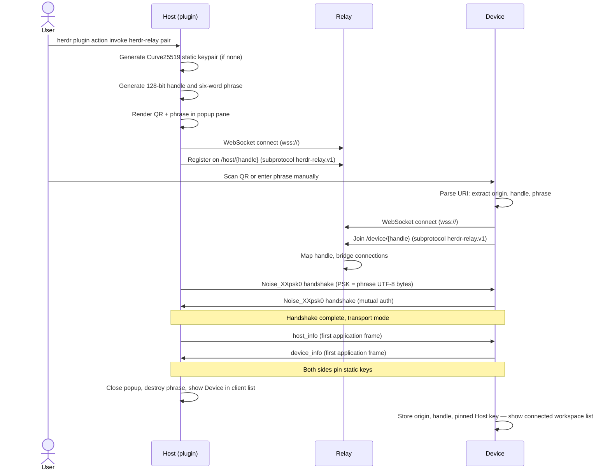
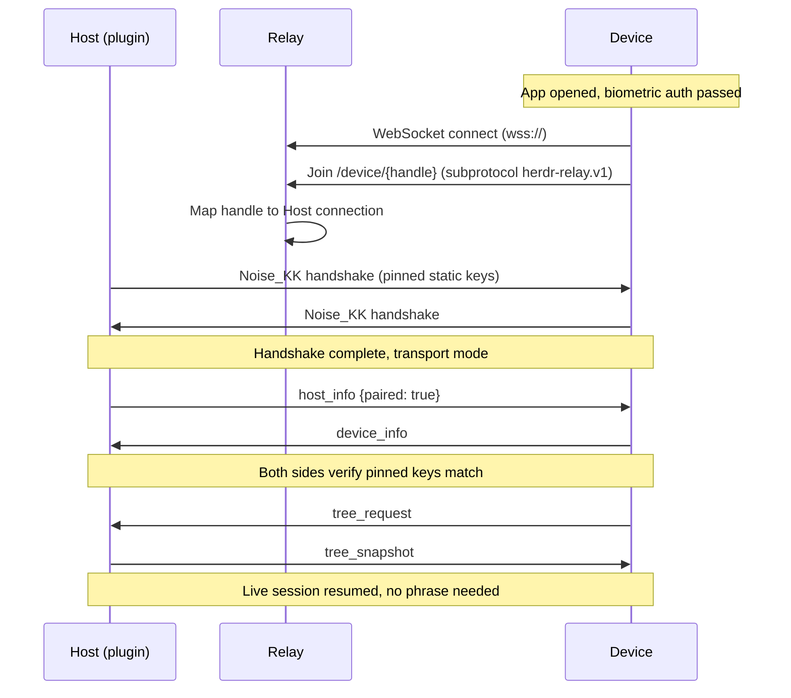

# Security and Pairing

R-13-001: This document is normative. Every rule is numbered `R-13-XXX`. Other documents cite these
rules. Implementers follow them in order.

## Threat model

R-13-002: The relay is untrusted infrastructure. It forwards opaque ciphertext. It MUST learn
nothing about terminal content, keystrokes or the pairing phrase. The channel between Host and
Device is end-to-end encrypted and authenticated. The relay sees only connection metadata: IP
addresses, connection timing and ciphertext sizes.

| Threat | Mitigation | Rule |
|---|---|---|
| Hostile relay operator reads terminal content | Noise end-to-end encryption. The relay sees only ciphertext. | R-13-012 |
| Hostile relay operator impersonates Host or Device | Noise mutual authentication with pinned static keys. The relay cannot produce a valid handshake without the private keys. | R-13-014, R-13-015 |
| Network attacker between Host and relay, or relay and Device | Noise encrypts every frame. TLS on the WebSocket hop adds a second layer. | R-13-012 |
| Lost or stolen phone | With App Lock on, biometric-gated keystore storage (R-22-013, R-22-007) blocks a reader with no biometric or passcode match. With App Lock off, the key sits in the keystore or keychain with no operating-system authentication challenge (R-22-082), and the phone's own lock screen, if any, is the only gate before the app opens. Revoke the Device from the Host either way. See `docs/decisions/ADR-009-optional-app-lock.md`. | R-13-053, R-13-054, R-13-073 |
| Malicious phone attempts to pair without the phrase | `Noise_XXpsk0` handshake fails without the correct six-word PSK. Three failed attempts force a new phrase. | R-13-024, R-13-023 |
| Attacker replays a captured pairing link | The phrase expires after 600 seconds (R-13-022). After expiry the Host rejects any handshake using that PSK and destroys the handle. | R-13-022 |
| Second Device hijacks a live session | The relay enforces one active Device per handle (R-11-123, R-11-124). A second Device receives error `host_in_use` and close code `4006`. The first Device stays connected. | R-13-052 |
| Compromised Host | The Host holds the long-term keypair. An attacker who owns the Host can read terminal content directly from Herdr, bypassing the plugin entirely. The plugin adds no new attack surface beyond what Herdr already exposes. | R-13-002 |
| Stolen or shared pairing link | The 600-second phrase lifetime and the 3-attempt limit bound the exposure window. The phrase authorises exactly one enrolment. After enrolment the Host destroys the phrase and the handle, so the same link cannot enrol a second Device. | R-13-022, R-13-023 |

## End-to-end channel

R-13-012: The channel between Host and Device MUST use the Noise Protocol Framework. The relay
forwards opaque ciphertext frames and performs no cryptographic operations.

### Comparison of options

| Criterion | Noise (XX/KK) | TLS 1.3 + raw public keys | libsodium crypto_kx + secretstream | libsignal double ratchet |
|---|---|---|---|---|
| Forward secrecy | Yes (ephemeral keys per handshake) | Yes (ephemeral DH in handshake) | Yes (crypto_kx uses ephemeral DH) | Yes (double ratchet) |
| Mutual authentication | Yes (static key pinning) | Yes (mutual TLS with raw keys) | Requires extra step (signatures) | Yes (prekey bundle) |
| Android library | `cryptography` 2.9.0 + `cryptography_flutter` 2.3.4 (Dart, Apache-2.0), app builds Noise from primitives | BoringSSL via Dart FFI or platform TLS | `cryptography` package (Dart) or `libsodium` via FFI | `libsignal` via FFI, complex build |
| iOS library | `cryptography` 2.9.0 + `cryptography_flutter` 2.3.4 (Dart, Apache-2.0), app builds Noise from primitives | Security.framework (native) | `libsodium` via FFI | `libsignal` via FFI, complex build |
| Windows library | `snow` 0.10.0 (Rust, MIT/Apache-2.0) | `rustls` 0.23 (Rust) | `dryoc` 1.0.0 (Rust, MIT) | No maintained Rust implementation |
| Linux library | `snow` 0.10.0 (Rust) | `rustls` 0.23 (Rust) | `dryoc` 1.0.0 (Rust, MIT) | No maintained Rust implementation |
| macOS library | `snow` 0.10.0 (Rust) | `rustls` 0.23 (Rust) or Security.framework | `dryoc` 1.0.0 (Rust, MIT) | No maintained Rust implementation |
| AI-agent-friendly | Pure Rust + pure Dart, no native deps | Certificate management, trust store, ASN.1 | FFI builds per platform | Complex prekey server, session state |
| Audited pattern | Noise_KK is well-studied, Noise Explorer verified | TLS 1.3 is heavily audited | libsodium is audited | Audited but overkill for this use case |
| PSK/pairing-phrase support | Native PSK modifier (`psk0`) | TLS-PSK extension (RFC 4279) | Must build PAKE on top | Not designed for PSK pairing |

**Verdict**: Noise Protocol Framework with `Noise_XXpsk0` for first pair and `Noise_KK` for
reconnect. It is the only option with pure-language implementations on every target platform, native
PSK support for the pairing phrase, and no certificate infrastructure.

### Chosen protocol

R-13-013: The cipher suite is `25519_ChaChaPoly_BLAKE2s`.

- **DH**: Curve25519. Fast, constant-time, available everywhere.
- **Cipher**: ChaCha20-Poly1305. Fast on mobile ARM without AES hardware.
- **Hash**: BLAKE2s. Fast on 32-bit and 64-bit ARM.

R-13-014: First pairing uses `Noise_XXpsk0_25519_ChaChaPoly_BLAKE2s`. The pre-shared key is derived
from the canonical hyphenated six-word phrase (R-13-019) by the transform in R-13-024, never the
raw UTF-8 bytes of the phrase. The `psk0` modifier mixes the PSK at position 0 in the handshake, so
a wrong phrase produces a different session key and the handshake fails at the first transport
message.

R-13-015: Reconnect uses `Noise_KK_25519_ChaChaPoly_BLAKE2s`. Both sides know each other's static
public key from the first pairing. No phrase is needed. The handshake provides forward secrecy and
mutual authentication. The Device reconnects to `/device/<handle>` with its pinned static key; the
Host authenticates it by that key alone. There is no reconnect token and no reconnect broadcast.

### Libraries

| Platform | Library | Version | Licence | Repository |
|---|---|---|---|---|
| Host (Rust) | `snow` | 0.10.0 | MIT OR Apache-2.0 | https://github.com/mcginty/snow |
| Device (Dart/Flutter) | `cryptography` + `cryptography_flutter` | 2.9.0 / 2.3.4 | Apache-2.0 | https://pub.dev/packages/cryptography |
| Host CSPRNG (Rust) | `rand` | 0.10.2 | MIT OR Apache-2.0 | https://github.com/rust-random/rand |
| Device CSPRNG (Dart) | `dart:math` `Random.secure()` | SDK | BSD-3 | https://api.dart.dev/stable/dart-math/Random/Random.secure.html |
| Host key storage (Rust) | `keyring` | 4.1.6 | MIT OR Apache-2.0 | https://github.com/open-source-cooperative/keyring-rs |
| Host QR code (Rust) | `qrcode` | 0.14.1 | MIT OR Apache-2.0 | https://github.com/kennytm/qrcode-rust |
| Host fingerprint + PSK hash (Rust) | `blake2` | 0.10.6 | MIT OR Apache-2.0 | https://github.com/RustCrypto/hashes |

The Host uses `snow` 0.10.0, which provides a ready-made Noise implementation. The Device side does
NOT use a ready-made Noise library. The `noise_protocol_framework` 1.2.0 package was evaluated and
rejected (R-20-032). The app builds the Noise state machine from primitives: `X25519` for the
Diffie-Hellman, `Chacha20.poly1305Aead` for the AEAD, and `Blake2s` for the display fingerprint and
the PSK derivation (R-13-024). This is a real implementation cost: the app MUST implement the
`Noise_XXpsk0` and `Noise_KK` handshake transitions itself, because no maintained Dart package
provides them. See `docs/20-mobile-framework.md`
R-20-032 for the decision and the evidence.

R-13-072: The Dart `cryptography` 2.9.0 package's `Blake2s.blockLengthInBytes` returns 32. RFC
7693 sets the BLAKE2s block length at 64, matching `snow` 0.10.0's own `HashBLAKE2s::block_len()`
on the Host and `blake2` 0.10.6's `BlockSize` type parameter. `Hmac.blake2s()` from `cryptography`
therefore pads to the wrong width and computes a `snow`-incompatible MAC. It MUST NOT be used
anywhere in the Noise state machine. This is not a new instance of hand-rolled cryptography under
`AGENTS.md`'s "Never hand-roll cryptography" rule, which itself defers the specifics to this
document: the paragraph above and R-20-032 already establish and justify the Device-side
Noise-from-primitives exception, and the construction below assembles the public RFC 2104 HMAC
specification from the already-pinned `Blake2s()`, not an invented primitive.

The app MUST implement HMAC-BLAKE2s itself, in `app/lib/services/hmac_blake2s.dart`, exporting
`Future<List<int>> hmacBlake2s(List<int> key, List<int> data)`. The construction mirrors `snow`'s
own `HashBLAKE2s::hmac()`: `key.length` MUST be at most 64 (Noise's own `HKDF` never passes a
`chaining_key` longer than 32 bytes, so the RFC 2104 over-length-key branch is never exercised and
is not implemented). `ipad` is 64 bytes of `0x36`; `opad` is 64 bytes of `0x5c`; each is XORed with
`key` at its first `key.length` bytes. The result is `Blake2s().hash(opad + Blake2s().hash(ipad +
data).bytes)`, using the plain (non-HMAC) `Blake2s()` from `cryptography` 2.9.0 for both the inner
and the outer hash. Every `HKDF`, `MixKey` and `MixKeyAndHash` call inside
`app/lib/services/noise.dart` MUST route through `hmacBlake2s`, never through `Hmac.blake2s()`.

`crates/herdr-relay/tests/hmac_blake2s_vectors.json` holds fixed key, data and expected-MAC
triples. `crates/herdr-relay/tests/hmac_blake2s_vectors.rs` and
`app/test/services/hmac_blake2s_vectors_test.dart` (R-40-034, R-40-037) both assert their own
HMAC-BLAKE2s construction reproduces every vector byte for byte, so this defect cannot silently
regress. `pub.dev`'s latest `cryptography` release (2.9.0, checked 2026-08-27) still has it, with no
open tracked issue; B15 in `## 8. Blocked work` tracks a future upstream fix.

R-13-016: The Device CSPRNG MUST use `Random.secure()` from `dart:math`, which delegates to the
platform cryptographic random source (`/dev/urandom` on Android and iOS, `SecRandomCopyBytes` on
iOS/macOS).

## Pairing phrase

### Word list and selection

R-13-017: The pairing secret is a six-word Diceware phrase. The word list is the EFF long wordlist
of 7776 entries, available at `https://www.eff.org/files/2016/07/18/eff_large_wordlist.txt`.

R-13-018: The Host MUST select six words uniformly, independently, and from a cryptographic random
source (`rand` 0.10.2 `OsRng`). Word order is significant and preserved.

R-13-019: The canonical text is lowercase ASCII words joined by single hyphens. Example: `remedy-tapestry-hubcap-oversleep-jailbird-kinetic`.

R-13-020: The display text is the same six words separated by single spaces.

R-13-021: The entropy is exactly `log2(7776^6)`, approximately 77.5 bits.

R-13-022: The phrase lifetime is 600 seconds from generation. After expiry the Host MUST destroy the
phrase, destroy the handle, and stop accepting handshakes with that PSK. The Host MUST NOT generate
a replacement on its own: a new phrase and handle exist only when the person asks for one (`p` in
the pairing pane, `docs/31-mockups/16-host-popup.md`) or after a successful pairing consumed the old
one (R-13-035 step 10). Rationale: the product owner measured that a credential which changes under
a person's eyes while they type six words on a phone fails the pairing; 600 seconds bounds an
online guess through the rate-limited relay (`docs/12-relay-hosting.md`) against 77.5 bits of
entropy (R-13-021) while a person reads, scans and types.

R-13-023: Three failed Noise handshake attempts per phrase are permitted. On the third failure the
Host MUST destroy the phrase and destroy the handle, and MUST NOT mint a replacement itself; the
pairing pane shows that the phrase is spent and waits for `p`.

### Use as PSK

R-13-024: The `Noise_XXpsk0` pre-shared key is `BLAKE2s-256(canonical_phrase_utf8)`: the full
32-byte BLAKE2s digest, no truncation, of the UTF-8 bytes of the canonical hyphenated six-word
phrase (R-13-019). `Noise_XXpsk0` requires a PSK of exactly 32 bytes (Noise Protocol Framework
specification §9, §12; `snow` 0.10.0's `Builder::psk` takes `&[u8; 32]`); the canonical phrase
itself is variable-length UTF-8 text and MUST NOT be passed to the Noise library directly. BLAKE2s
was chosen for the same reason as R-13-042: it is already in the `25519_ChaChaPoly_BLAKE2s` cipher
suite, so no new primitive is added. This is a length transform of an already-high-entropy secret
(~77.5 bits, R-13-018, R-13-021), not a password KDF for a low-entropy secret, so a fast hash is
sufficient and Argon2id or scrypt are unneeded overhead. The Host computes it with `blake2` 0.10.6,
already pinned for the display fingerprint (R-13-042); the Device computes it with `Blake2s()`
(`hashLengthInBytes: 32`, the default) from `cryptography` 2.9.0. Both MUST produce the identical
32-byte value from the identical UTF-8 input. The `psk0` modifier mixes this PSK at position 0 in
the handshake, so a wrong phrase produces a different session key and the handshake fails at the
first transport message.

### Word list redistribution

R-13-025: The word list is never copied into this repository. An implementation that needs a local
copy MUST download it from the canonical URL, verify it against a recorded checksum, and normalise
it: lowercase ASCII, one word per line, no blank lines, no leading or trailing whitespace. The
checksum value is recorded by the implementer in `crates/herdr-relay/src/pairing/wordlist.rs` after
verification and is never invented in advance.

### Manual entry

R-13-026: Manual entry normalises before validation: trim leading and trailing whitespace, lowercase
all characters, collapse a run of spaces or hyphens to one separator. Validation then rejects any
input that still fails the canonical form.

R-13-027: Validation failures map to the error codes that `docs/11-relay-protocol.md` owns:

| Failure | Error code |
|---|---|
| Not exactly six words | `phrase_word_count` |
| A word is not in the EFF long list | `phrase_word_unknown` |
| Repeated or misplaced separators | `phrase_separator` |
| Non-lowercase ASCII after normalisation | `phrase_case` |
| More than 600 seconds elapsed | `phrase_expired` |
| More than 3 handshake attempts | `phrase_attempts` |

Manual entry supplies the same four inputs as QR scanning: an implicit `v=1`, a relay origin, a
handle and a phrase. Manual entry and QR entry MUST converge on one identical pairing input record
(R-11-140).

## QR code

R-13-028: The Host MUST render the pairing URI as a QR code in the plugin popup pane. The URI form,
encoding, maximum length and QR parameters are owned by `docs/11-relay-protocol.md` (R-11-140,
R-11-141, R-11-142). This document states only the security properties.

R-13-029: The QR code carries the six-word phrase in clear text. Its security properties are:

- The phrase is short-lived: 600 seconds from generation (R-13-022).
- The QR is rendered on the Host screen only. It is never logged, never stored on disk and never
  sent to the relay.
- The Host destroys the phrase, the QR buffer and the handle after successful enrolment, after
  expiry or after three failed handshake attempts (R-13-022, R-13-023).
- The phrase authorises exactly one enrolment. The handle is also destroyed, so the same URI cannot
  enrol a second Device even within the time window.

R-13-030: The Host MUST generate the QR code with the `qrcode` crate 0.14.1, rendering to ANSI
escape sequences for display in the Herdr popup pane. The popup pane is a terminal, so the QR code
is rendered as Unicode block characters (two terminal rows per QR row for square modules).

## Routing handle

R-13-031: The routing handle is owned by `docs/11-relay-protocol.md`. This section states its
security properties.

R-13-032: The handle is 128 random bits generated by the Host from a cryptographic random source. It
is encoded as 22 unpadded base64url characters (R-11-112). It carries no structure, no checksum and
no embedded time.

R-13-033: The handle is opaque and is used for routing only. It is not a bearer token: Noise
authenticates both peers and protects all content. An attacker who learns a handle can:

- Reach the relay routing table and attempt to connect to the Host's endpoints.
- Attempt a Noise handshake, which fails without the Host or Device static private key.

An attacker who learns a handle cannot:

- Decrypt any frame content.
- Impersonate the Host or the Device.
- Learn terminal content, keystrokes or the pairing phrase.

R-13-034: The handle survives reconnect within the same pairing. It is destroyed when the Device is
revoked, when the Host is unpaired, or when the operator changes the relay origin (R-03-032).

## Pairing handshake

R-13-035: The pairing handshake proceeds as follows:

1. Host generates a Curve25519 static keypair if no existing keypair exists.
2. Host generates a 128-bit routing handle and a six-word phrase (R-13-018, R-13-032).
3. Host registers on `/host/<handle>` (WebSocket, subprotocol `herdr-relay.v1`) and renders the QR
   code in the popup pane.
4. Device scans the QR or accepts manual entry. Device parses the URI: stores the relay origin,
   extracts the handle and the phrase.
5. Device connects to `/device/<handle>` (WebSocket, subprotocol `herdr-relay.v1`).
6. Host and Device execute `Noise_XXpsk0_25519_ChaChaPoly_BLAKE2s`, Device as initiator and Host as
   responder (R-13-071), with the PSK derived from the canonical phrase (R-13-024).
7. After the handshake reaches transport mode, the Host sends `host_info` as the first application
   frame (R-11-130, R-11-132).
8. The Device sends `device_info` as its first application frame on receipt of `host_info`
   (R-11-131, R-11-132).
9. Both sides pin the other's static public key (obtained from the Noise handshake). The Device
   stores the pinned Host static key, the relay origin and the handle (R-13-048). The Host stores
   the Device's static public key, name, and enrolment timestamp (R-13-049).
10. Host closes the popup pane, destroys the phrase and the handle's QR buffer, and shows the Device
    in the connected-client list.

R-13-071: The Device is the Noise initiator and the Host is the Noise responder, for both
`Noise_XXpsk0` (R-13-035 step 6) and `Noise_KK` (R-13-037 step 2). Neither pattern's first message
needs the other party's keys in advance in this deployment: `XX` needs no pre-known keys at all,
and both sides already hold each other's static key by reconnect time for `KK` (R-13-038,
R-13-048). So the Noise message pattern itself does not force the choice; the transport does. The
Host registers on `/host/<handle>` and waits (R-13-035 step 3; R-13-037 uses the same path). The
Device connects afterward (R-13-035 step 5; R-13-037 step 1) and sends the first Noise handshake
message once its WebSocket opens. `snow` builds the Host with `build_responder()` and the Device
with `build_initiator()`; the Dart handshake state machine follows the same roles.

R-13-036: `host_info` and `device_info` are owned by `docs/11-relay-protocol.md` (R-11-130,
R-11-131, R-11-132). This document does not restate their field tables.

## Reconnect

R-13-037: Reconnect uses `Noise_KK_25519_ChaChaPoly_BLAKE2s` (R-13-015). The flow is:

1. Device connects to `/device/<handle>` (WebSocket, subprotocol `herdr-relay.v1`).
2. Host and Device execute `Noise_KK`, Device as initiator and Host as responder (R-13-071), with
   their pinned static keys from the first pairing.
3. After the handshake reaches transport mode, the Host sends `host_info` (with `paired: true`), and
   the Device sends `device_info`. Both verify the other's static public key matches the pinned key.
4. The session is resumed. No phrase, no reconnect token and no relay-side reconnect broadcast is needed.

R-13-038: The Device MUST store, for each paired computer, the pinned Host static public key and the
routing handle from that pairing. The relay origin is app-wide and serves every saved computer
(R-30-922). These values, together with its own static keypair, are sufficient to reconnect to that
computer (R-13-048).

R-13-039: There is no reconnect token. The 32-byte reconnect token and every reconnect-broadcast
statement are retired. The relay never receives a reconnect bearer token in plaintext and never
broadcasts a reconnect attempt.

## Display fingerprint

R-13-040: Both Host and Device MUST display a short fingerprint of the other's static public key for
user verification. The fingerprint is:

`BLAKE2s-256(static_public_key_raw_32_bytes)`, first 8 bytes, lowercase hex, rendered as four
hyphen-separated groups of four digits. Example: `3f9a-1c04-be77-20d5`.

R-13-041: The Host displays the Device fingerprint next to the Device name in the paired-device
list. The Device displays the Host fingerprint on the pairing confirmation screen.

R-13-042: BLAKE2s was chosen because it is already in the Noise cipher suite
(`25519_ChaChaPoly_BLAKE2s`). No new primitive is added.

R-13-070: The fingerprint crosses the wire as data; the raw key does not. The Host MUST compute the
Device fingerprint from the stored `static_public_key` (R-13-040) and send it in the `device_list`
payload (R-11-062). The raw `static_public_key` MUST NOT appear in any message (R-11-062, R-13-047);
only the fingerprint does.

## Device identity and lifecycle

### Key generation

R-13-043: On first launch, the Device MUST generate a Curve25519 static keypair, whether or not
the phone has a screen lock of any kind. Key generation and pairing MUST NOT depend on a PIN, a
pattern, a password or a biometric enrolment being present. The private key MUST always be
stored as keychain or keystore data, per `docs/22-platform-integration.md` R-22-001 and R-22-006.
Whether reading that data additionally requires an operating-system biometric or passcode
challenge depends on the App Lock setting (`docs/03-product-decisions.md` R-03-090), per
R-13-073. This reverses the former mandatory precondition; see
`docs/decisions/ADR-009-optional-app-lock.md`.

- **App Lock on**: **Android**: Android Keystore with `setUserAuthenticationRequired(true)`,
  backed by StrongBox where available (R-22-006, R-22-007). **iOS**: iOS Keychain with
  `kSecAttrAccessibleWhenUnlockedThisDeviceOnly` (R-22-001), gated by a `SecAccessControl` with
  `.biometryCurrentSet` (R-22-013).
- **App Lock off**: The same storage, with no operating-system authentication requirement, per
  R-22-082.

R-13-044: iOS Secure Enclave does not offer Curve25519. It supports only the secp256r1 (NIST P-256)
curve (R-22-003). The Device Curve25519 private key is therefore not generated in, and does not stay
inside, the Secure Enclave. It is keychain data, not a Secure Enclave key. No document may claim
that it is.

R-13-045: A future upgrade to a hardware-backed P-256 key stored in the Secure Enclave is recorded
as a future ADR task in `docs/90-implementation-plan.md`. It is not an open implementation choice
for version 1.

R-13-046: The Device MUST NOT generate a new keypair on reinstall unless the old one was lost. Key
backup and restore behaviour is specified in `docs/22-platform-integration.md` (R-22-001, R-22-002,
R-22-009, R-22-011).

R-13-047: The Device public key is a 32-byte Curve25519 value. The Noise library transmits it during
the handshake. Application messages MUST NOT repeat it.

R-13-073: The App Lock setting (`docs/03-product-decisions.md` R-03-090) selects the protection
level of the storage R-13-063 fixes, not a different storage location and not a different key.
App Lock on uses the operating-system biometric or passcode gate of R-22-013. App Lock off
stores the identical values with no authentication requirement, per
`docs/22-platform-integration.md` R-22-082. Turning the setting on or off re-stores the private
key under the new protection level, and moves any Host record a build before 2026-09-16 wrote
gated into the ungated store (R-13-063). It MUST NOT generate a new keypair, MUST NOT revoke any
pairing, and MUST NOT require re-pairing. The toggle lives on
`docs/31-mockups/15-appearance.md` R-31-15-18.

### Enrolment

R-13-048: Enrolment is the first successful pairing handshake (R-13-035). After enrolment:

- The Host stores the Device's static public key, name, a `paired_at` timestamp, and a pairing
  identifier (UUIDv4).
- The Device stores the Host's static public key, the relay origin, and the routing handle.
- The Host and Device both store the pairing identifier (UUIDv4) for display and revocation.
- The pairing identifier is the `host_id` the Host sends in `host_info` (R-11-130), paired with the
  `device_id` the Device sends in `device_info` (R-11-131).

### Paired-Device list on Host

R-13-049: The Host MUST maintain a paired-device list. Each entry holds:

| Field | Type | Description |
|---|---|---|
| `host_id` | UUIDv4 | Host pairing identifier from `host_info` |
| `handle` | string (22 chars) | The routing handle of this pairing (R-11-112). The Host registers on `/host/<handle>` for `Noise_KK` reconnect (R-13-037) and destroys it on revocation (R-13-053) |
| `device_id` | UUIDv4 | Device pairing identifier from `device_info` |
| `device_name` | string (≤32 bytes) | Human-readable device name |
| `platform` | string (`ios` or `android`) | Device platform from `device_info` (R-11-131) |
| `os_version` | string | Device operating-system version from `device_info` (R-11-131) |
| `static_public_key` | 32 bytes | Device Curve25519 static public key |
| `paired_at` | ISO 8601 | When the device was first paired |
| `last_seen` | ISO 8601 | Last successful Noise handshake or transport message |

The Host MUST store `platform` and `os_version` rather than read them live. `device_info` arrives
only during a Noise session (R-11-131). The paired-device list shows the platform of a phone that is
not currently connected, so the value must come from storage.

R-13-050: There is no `reconnect_token` field. Reconnect uses the pinned static keys and the handle
only (R-13-037).

R-13-051: The list is stored as a JSON file. See R-13-060 for the path and permissions.

### Revocation

R-13-052: One active Device is a connection limit, not an enrolment limit. The Host MAY store
several paired Device entries. At most one may connect at a time (R-11-123). All paired entries stay
revocable.

R-13-053: The Host MAY revoke a single Device. The user selects a Device from the list and triggers
"Revoke". The Host MUST:

1. Remove the entry from the paired-device list. The entry is gone; no list may show a `revoked` row
   state.
2. Destroy the routing handle for that pairing.
3. If the Device has an active Noise session, close the WebSocket to the relay for that session.
4. Show a confirmation that the Device is revoked.

R-13-054: A revoked Device that attempts to reconnect MUST receive close code `4004` (`revoked`)
from the relay or Host. The Device MUST clear that computer's stored Host key and handle, and MUST
remove it from the saved list. It MUST NOT clear the relay origin and MUST NOT touch another saved
computer. If no saved computer remains, the app shows `/welcome`, per
`docs/31-mockups/01-welcome.md` R-31-01-01.

R-13-055: A revoked Device with an active session loses the connection immediately. The Device MUST
show "Connection lost — this device has been revoked" and clear that computer's record, per
R-13-054. If no saved computer remains, the app shows `/welcome`.

R-13-056: The "Refresh" action revokes ALL paired Devices and resets Host identity. The Host MUST:

1. Clear the entire paired-device list.
2. Close all active Device WebSocket connections.
3. Destroy every routing handle.
4. Generate a new Host Curve25519 static keypair.
5. Show a new pairing QR code and phrase.

R-13-057: "Refresh" is the nuclear option. It invalidates every existing pairing. Every Device must
re-pair. The Host MUST warn the user and require explicit confirmation before executing it.

## Secret storage

### Host

R-13-058: The Host static keypair (Curve25519, 32-byte secret + 32-byte public) MUST be stored in
the platform credential store via the `keyring` crate 4.1.6:

| Platform | Backend | `keyring` service name | `keyring` username |
|---|---|---|---|
| Windows | Windows Credential Manager | `herdr-relay` | `host-keypair` |
| Linux | Secret Service (D-Bus) or `libsecret` | `herdr-relay` | `host-keypair` |
| macOS | Keychain | `herdr-relay` | `host-keypair` |

R-13-059: If the platform credential store is unavailable, the Host MUST fall back to a file with
the most restrictive permissions the platform supports:

| Platform | Fallback path | Permissions |
|---|---|---|
| Windows | `%APPDATA%\herdr\herdr-relay\host-keypair.json` | ACL: `SYSTEM` and current user only, full control |
| Linux | `~/.local/share/herdr/herdr-relay/host-keypair.json` | `0600` (owner read/write only) |
| macOS | `~/Library/Application Support/herdr/herdr-relay/host-keypair.json` | `0600` |

R-13-060: The paired-device list is stored as a JSON file with OS-restrictive permissions:

| Platform | Path | Permissions |
|---|---|---|
| Windows | `%APPDATA%\herdr\herdr-relay\paired-devices.json` | ACL: `SYSTEM` and current user only, full control |
| Linux | `~/.local/share/herdr/herdr-relay/paired-devices.json` | `0600` |
| macOS | `~/Library/Application Support/herdr/herdr-relay/paired-devices.json` | `0600` |

R-13-061: The Host MUST create the parent directory with the same restrictive permissions before
writing either file.

### Device

R-13-062: Device secret storage is specified in `docs/22-platform-integration.md`. This document
states the requirements. The implementation details are in that document.

R-13-063: The Device MUST store in the platform keystore or keychain, regardless of the App Lock
setting:

- The Curve25519 Noise static private key (R-13-043). This is one key for the Device, shared
  across every paired computer.
- For each paired computer: the Host's pinned static public key and the routing handle.
- The relay origin. This is app-wide, not per computer (R-30-922).

These values form one record per paired computer, and the Device MUST keep one such record for
every computer it has saved (R-03-043). Only the Curve25519 private key carries the
operating-system authentication challenge of R-22-013 when App Lock is on. The Host records
(pinned key, routing handle, relay origin) sit in the same keychain or keystore class with no
challenge, whatever the App Lock setting: the challenge is per item read, iOS gives the pinned
storage plugin no way to reuse one authentication across reads, and gating every item raised one
Face ID sheet per item, six on one cold start (amended 2026-09-16 by the product owner; until then
the whole record was gated). Without the private key the Host records open nothing.

R-13-064: When App Lock is enabled (R-03-090), the Device MUST gate access to the Curve25519
private key behind biometric authentication (fingerprint or face) or the device passcode, and the
user MUST authenticate exactly once per app session, before the Noise session is established, per
`docs/31-mockups/04-lock.md`. The background lock timeout is 120 seconds (R-22-017). When App
Lock is disabled, the app reads the key with no operating-system authentication challenge, and
no session gate exists: `/lock` never appears, per `docs/31-mockups/04-lock.md` R-31-04-12.

R-13-065: The Device MUST store in plain application storage (not the keystore or keychain):

- The Device identifier (`device_id` UUIDv4 from `device_info`).
- The Device human-readable name (`device_name`).
- For each paired computer: the Host pairing identifier (`host_id`), the Host display name
  (`host_name` from `host_info`), and the time of the last contact with that computer: written
  when the link opens and again when it closes. An app the system kills never sees its link close,
  so a close-only stamp left a computer the person used minutes ago marked as never contacted, and
  the cold start of `R-31-05-16` made no attempt (measured on 2026-09-03; corrected the same day).
- For each paired computer, the notification acknowledgements of `R-31-07-01` (added 2026-09-08):
  one entry per pane the person marked read or removed, holding the pane identifier, the agent
  status word, the `at` time of that change, and the verb. Metadata only, never pane content
  (`R-30-510`). The entries leave with the computer's record when it is forgotten or revoked.

These values form one record per paired computer, and the Device MUST keep one such record for every
computer it has saved (R-03-043). The Host display name is rewritten on every connection, because
`host_info` arrives only while connected. `/hosts` draws the saved computer name and its
`last seen HH:mm` from these values (R-03-046).

R-13-066: The following MUST never be logged, printed, or written to plain storage:

- The Curve25519 static private key.
- Any derived Noise session key material.
- The pairing phrase or its canonical text.
- The routing handle.

## Authorisation model

R-13-067: DEFAULT: A paired Device has full access to every pane in every workspace. It may read any
pane, send keystrokes to any pane, and run commands. This matches the mental model: the Device is a
remote terminal for the Host.

R-13-068: The following restrictions are specified but NOT implemented in version 1. They are listed
so the protocol reserves space for them:

| Restriction | Description | Verdict |
|---|---|---|
| Read-only mode | Device may view panes but not send keystrokes | Cut from v1. Add when a user asks for it. |
| Workspace allowlist | Device may access only named workspaces | Cut from v1. The Device already selects which pane to view. |
| Destructive-action confirmation | Host prompts before `pane.close`, `server.stop`, `agent.stop` | Cut from v1. The Device user is the Host user; they know what they typed. |
| Agent-only mode | Device may only interact with agent panes, not raw shells | Cut from v1. Speculative. |

R-13-069: The protocol MUST reserve a `capabilities` bitmask in the `device_info` application
message (R-11-131) so restrictions can be added later without breaking the wire format. The v1 value
is `0x00` (no restrictions).

## Sequence diagrams

### First pairing

### Reconnect

## Cryptographic decisions

| Purpose | Algorithm | Key size | Host library | Device library |
|---|---|---|---|---|
| Key exchange | Curve25519 ECDH | 256-bit | `snow` 0.10.0 | `cryptography` 2.9.0 (`X25519`) |
| Symmetric encryption | ChaCha20-Poly1305 (AEAD) | 256-bit key, 96-bit nonce | `snow` 0.10.0 | `cryptography` 2.9.0 (`Chacha20.poly1305Aead`) |
| Hashing (handshake) | BLAKE2s | 256-bit | `snow` 0.10.0 | `cryptography` 2.9.0 (`Blake2s`) |
| Display fingerprint | BLAKE2s-256 | first 8 bytes of hash | `blake2` 0.10.6 | `cryptography` 2.9.0 (`Blake2s`) |
| CSPRNG | OS cryptographic RNG | N/A | `rand` 0.10.2 (`OsRng`) | `dart:math` `Random.secure()` |
| Pairing phrase | Six EFF Diceware words | ≈77.5 bits | `rand` 0.10.2 | N/A (Host generates) |
| Routing handle | Uniform random | 128-bit (16 bytes) | `rand` 0.10.2 | N/A (Host generates) |
| Static key storage (Host) | Platform credential store | N/A | `keyring` 4.1.6 | N/A |
| Static key storage (Device) | Platform keystore/keychain, biometric-gated | N/A | N/A | Android Keystore / iOS Keychain (R-22-006, R-22-001) |
| QR code | Byte mode, error correction M | N/A | `qrcode` 0.14.1 | N/A |
| Handle encoding | unpadded base64url (RFC 4648 section 5) | N/A | `base64` 0.23.1 | `dart:convert` |
| WebSocket to relay | TLS 1.3 (wss://) | N/A | `tokio-tungstenite` 0.30.0 | `web_socket_channel` 3.0.3 |

## Implementation TODO

- [ ] Implement `Noise_XXpsk0` and `Noise_KK` handshakes with `snow` 0.10.0 in the Host plugin.
- [ ] Implement `Noise_XXpsk0` and `Noise_KK` handshakes over `X25519`, `Chacha20.poly1305Aead`, and
  `Blake2s` from `cryptography` 2.9.0 and `cryptography_flutter` 2.3.4 in the Flutter app
  (R-20-032).
- [ ] Generate six-word Diceware phrases with `OsRng` and enforce 120-second expiry and 3-attempt limit.
- [ ] Generate 128-bit routing handles with `OsRng` and encode as unpadded base64url.
- [ ] Render QR codes in the terminal popup pane with `qrcode` 0.14.1 and Unicode block characters.
- [ ] Implement `/host/<handle>` and `/device/<handle>` relay endpoint registration (cite `docs/11-relay-protocol.md`).
- [ ] Store Host static keypair via `keyring` 4.1.6 with file-permission fallback.
- [ ] Store paired-device list as JSON with OS-restrictive permissions.
- [ ] Store `platform` and `os_version` from `device_info` in each paired-device entry (R-13-049).
- [ ] Implement Device Curve25519 key generation in Android Keystore and iOS Keychain,
  biometric-gated (cite `docs/22-platform-integration.md`).
- [ ] Implement biometric gate before Noise session establishment (R-22-013).
- [ ] Implement display fingerprint: `BLAKE2s-256(static_public_key)[0:8]`, lowercase hex, hyphen-grouped.
- [ ] Implement single-Device revocation (remove entry, destroy handle, close WebSocket).
- [ ] Implement "Refresh" (revoke all, rotate Host keypair, destroy all handles, show new QR).
- [ ] Implement `host_info` and `device_info` application messages per `docs/11-relay-protocol.md`.
- [ ] Add `last_seen` timestamp update on every successful transport message.
- [x] Store per-computer `host_name` and the last-contact time (link open and link close) in plain
      storage (R-13-065). Verified: `app/lib/app.dart` `_recordLinkSeen` on `RelayConnected` and on
      every close; `app/lib/services/plain_store.dart` `PairedHostRecord.lastSeen`.
- [ ] Test full pairing flow: QR scan path and manual phrase entry path.
- [ ] Test revocation during an active session (Device sees "Connection lost").
- [ ] Test reconnect after app restart (biometric auth → silent Noise_KK → live session).
- [ ] Verify that the relay sees only ciphertext (capture relay-side traffic, confirm no plaintext
  terminal content).

## Open questions

1. **Hardware-backed P-256 key upgrade.** The `cryptography` package does not yet provide a Secure
   Enclave-backed P-256 key for ECDH on iOS. Until it does, Curve25519 stored as keychain data with
   biometric gating is the version-1 rule (R-13-044). Tracked as a future ADR task in
   `docs/90-implementation-plan.md`.

2. **EFF word list redistribution terms.** The EFF word list is published under CC-BY-3.0. The list
   is never copied into this repository (R-13-025). An implementation that downloads and bundles it
   with the Host binary must verify the redistribution terms of the specific version it uses.
   Recommended default: download at build time and verify by checksum; do not commit the list to
   source control.

## Sources

- https://www.eff.org/files/2016/07/18/eff_large_wordlist.txt — EFF long Diceware wordlist, 7776 entries
- https://www.eff.org/dice — EFF Diceware method
- https://noiseprotocol.org/noise.html — Noise Protocol Framework specification, revision 34
- https://crates.io/crates/snow — snow 0.10.0, Noise for Rust
- https://pub.dev/packages/cryptography — cryptography 2.9.0, Noise primitives for Dart (X25519,
  Chacha20.poly1305Aead, Blake2s)
- https://pub.dev/packages/cryptography_flutter — cryptography_flutter 2.3.4, platform acceleration
  for cryptography
- https://crates.io/crates/keyring — keyring 4.1.6, cross-platform credential store for Rust
- https://crates.io/crates/rand — rand 0.10.2, CSPRNG for Rust
- https://crates.io/crates/qrcode — qrcode 0.14.1, QR code generation for Rust
- https://crates.io/crates/blake2 — blake2 0.10.6, BLAKE2s hash for Rust
- https://crates.io/crates/base64 — base64 0.23.1, unpadded base64url encoding for Rust
- https://crates.io/crates/dryoc — dryoc 1.0.0, libsodium-compatible Rust crypto (evaluated, not chosen)
- https://crates.io/crates/spake2 — spake2 0.5.0-pre.0, SPAKE2 for Rust (evaluated, not chosen)
- https://pub.dev/packages/spake2plus — spake2plus, SPAKE2+ for Dart (evaluated, not chosen;
  Linux/macOS only)
- docs/02-herdr-probe-results.md — verified Herdr socket behaviour (R-02-004, R-02-006, R-02-013, R-02-016)
- docs/11-relay-protocol.md — wire protocol: handle codec (R-11-112), registration (R-11-113 through
  R-11-115), relay errors (R-11-116 through R-11-120), close codes (R-11-121), TLS/crypto claim
  (R-11-122), one active Device (R-11-123, R-11-124), host_info (R-11-130), device_info (R-11-131),
  message ordering (R-11-132), notification routing (R-11-134), pairing URI (R-11-140, R-11-141,
  R-11-142), agent_status (R-11-057), frame size (R-11-035)
- docs/22-platform-integration.md — mobile keystore and biometric detail (R-22-001, R-22-003,
  R-22-006, R-22-007, R-22-013, R-22-017, R-22-028)
- docs/30-ux-spec.md — pairing screen, notification tap routes, biometric lock screen
- docs/90-implementation-plan.md — future ADR for hardware-backed P-256 key upgrade
