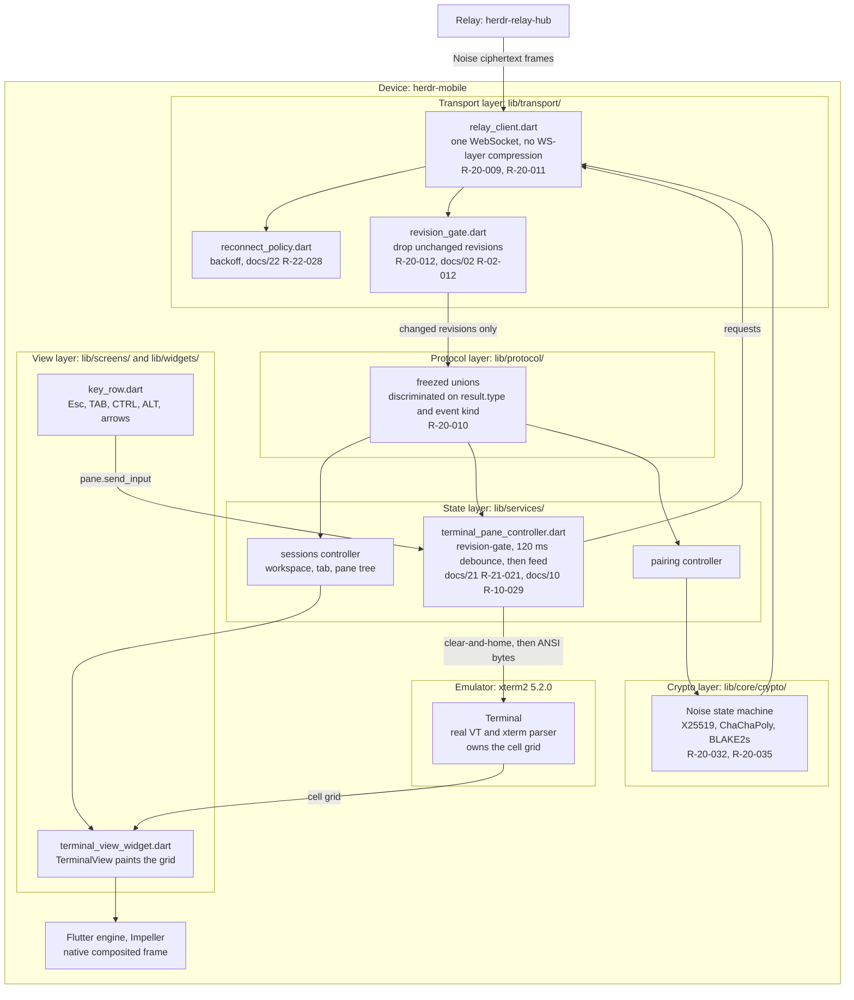

# Mobile Framework Decision

This document decides the framework for the `herdr-mobile` app. The app targets **Android and iOS
only**. There is no web build, no desktop build, and no tablet-specific build.

Every rule here is numbered `R-20-xxx`. Other documents cite these numbers. This document is the
dependency-version owner for the whole repository. Every version in every other document MUST match
the table in section 6.

Related documents:

- `docs/21-terminal-rendering.md` surveys the terminal emulator libraries in depth. This document
  reaches its own conclusion on the framework and cites `docs/21` for emulator internals.
- `docs/22-platform-integration.md` owns keystore, biometrics, local notifications, deep links, and
  store compliance.
- `docs/30-ux-spec.md` owns colour, type scale, spacing, radii, motion, and touch targets.
- `docs/41-code-standards.md` owns language-wide lint rules.
- `docs/02-herdr-probe-results.md` holds measured Herdr facts. Those facts constrain the transport.

---

## 1. Decision Criteria and Weights

The criteria are fixed before the evaluation. This prevents a novel option from winning on novelty.

| ID | Criterion | Weight | What a score of 10 means |
|---|---|---|---|
| C1 | Native terminal grid at 60 FPS from a real VT emulator | 30 | A real VT parser paints a real cell grid in the native render tree. No WebView. No pixel stream. |
| C2 | Terminal emulator library quality on **both** Android and iOS | 20 | One mature, maintained, permissively licensed emulator covers both platforms and cannot diverge between them. |
| C3 | Access to platform keystore, biometrics, and local notifications | 12 | Maintained wrappers exist for all three, on both platforms. |
| C4 | AI-agent-friendliness | 18 | See the sub-matrix in section 2. |
| C5 | Maintenance cost for a small team | 12 | One codebase, one language, one toolchain, one CI pipeline. |
| C6 | Store viability on both platforms | 8 | Many shipped apps on both the App Store and Google Play. |

**Verdict: terminal fidelity carries 50 of the 100 points (C1 plus C2). AI-agent-friendliness
carries 18. Novelty therefore cannot outrank fidelity.**

**R-20-001**: The app MUST render the terminal with a real VT emulator that paints a cell grid in the
native render tree. The app MUST NOT stream terminal video, MUST NOT use VNC or RDP, and MUST NOT
use screen sharing.

**R-20-002**: The app MUST NOT reach the terminal through a WebView. A WebView breaks native text
selection, adds a second input stack, adds a second font stack, and blocks the frame budget in
`docs/21-terminal-rendering.md` R-21-021.

**R-20-003**: Only structured commands and ANSI payloads cross the network. This follows the agreed
rendering model in `docs/02-herdr-probe-results.md` R-02-014.

### 1.1 Why the weights sit where they do

The product is 1-to-1 terminal fidelity on a phone. A framework that cannot paint a faithful cell
grid fails the product, whatever else it does well. C1 and C2 therefore dominate.

C4 is high because the user raised it. It is still lower than C1 so that an agent-friendly framework
with no emulator cannot win.

C5 is real but recoverable. A team can absorb cost. A team cannot absorb a framework that cannot
render the product.

---

## 2. AI-Agent-Friendliness Sub-Matrix

Each sub-criterion scores 0 to 10 with equal weight. The average, rounded to the nearest whole
number, becomes the C4 score.

| Sub-criterion | Flutter | React Native | .NET MAUI | KMP + Compose | Two native apps | Astryx |
|---|---|---|---|---|---|---|
| S1 Static typing and compiler feedback | 9 | 6 | 10 | 10 | 10 | 7 |
| S2 UI declared in reviewable text | 10 | 10 | 7 | 10 | 10 | 10 |
| S3 Hot reload and headless test speed | 10 | 9 | 8 | 7 | 8 | 9 |
| S4 Machine-readable build and test output | 9 | 6 | 9 | 4 | 4 | 10 |
| S5 Public training corpus size | 9 | 10 | 5 | 4 | 10 | 2 |
| S6 Exactly one obvious way per task | 8 | 2 | 8 | 5 | 5 | 10 |
| **Average** | **9.2** | **7.2** | **7.8** | **6.7** | **7.8** | **8.0** |
| **C4 score** | **9** | **7** | **8** | **7** | **8** | **8** |

Notes that justify the low outliers:

- **React Native S6 = 2.** There is no single obvious way to do anything. State management, routing,
  and styling each have several established choices, and Expo and bare workflows diverge. An agent
  must pick, and different agents pick differently.
- **React Native S1 = 6.** TypeScript typing is gradual and structural. `any` erases guarantees, and
  the native module boundary is typed by hand.
- **KMP S4 = 4.** Gradle output is verbose. A Kotlin Multiplatform build failure often reports the
  symptom in one module and the cause in another.
- **Two native apps S4 = 4.** `xcodebuild` output needs a third-party reformatter to become
  readable. Gradle output is verbose. An agent must parse two unlike formats.
- **Astryx S5 = 2.** Astryx reached public beta in mid-2026. The public corpus is small.
- **Astryx S4 = 10.** Astryx publishes a JSON CLI manifest and an MCP server. This is the best
  machine-readable surface in the whole comparison.

**Verdict: Flutter wins C4 with 9. Astryx is strong on the mechanical axes, S4 and S6, but a small
public corpus and gradual typing pull it to 8, so it does not win even the criterion built to favour
it. Section 3 shows why its score would not matter regardless.**

---

## 3. Astryx

### 3.1 What it actually is

I read the Astryx site and its "Working with AI" documentation.

| Question | Answer |
|---|---|
| What is it? | An open-source **design system**: React components plus a CLI. It is not an application framework. |
| Who publishes it? | Meta Platforms, Inc. The repository is `github.com/facebook/astryx`. |
| Licence | MIT. |
| Maturity | Public beta as of mid-2026. Meta states that APIs and component contracts may change before 1.0, and that the CLI surface is early. |
| Target platforms | Web. It is built on React and StyleX, Meta's compile-time CSS engine. The documented integrations are Next.js, Vite, Remix, and a CDN-only setup. |
| Can it render a native terminal grid? | No. It renders React components to the DOM. It ships no terminal emulator and no VT parser. |
| Android and iOS support | None documented. There is no React Native target and no native renderer. |

### 3.2 What it is genuinely good at

Astryx is the most agent-ready surface in this comparison, and the reason is concrete:

- `npx astryx manifest --json` emits a machine-readable contract for every CLI command, argument,
  flag, and response type.
- `npx @astryxdesign/cli init --features agents` generates a component index, behavioural rules, and
  a CLI reference into `AGENTS.md`, or into a tool-specific file.
- Every CLI command accepts `--dense`, which emits a token-efficient format for a context window.
- It hosts an MCP server at `https://astryx.atmeta.com/mcp` exposing `search(query)` and `get(name)`.

### 3.3 Verdict

**R-20-004**: The `herdr-mobile` app MUST NOT use Astryx.

The reason is not maturity and not licence. It is scope. Astryx is a web design system. It has no
Android target, no iOS target, and no terminal emulator. Choosing it would mean shipping a web app in
a WebView, which R-20-002 forbids, and then writing a terminal emulator from scratch, which the reuse
rule forbids. Astryx scores 144 of 1000 in section 5 because it earns marks on the one criterion it
addresses and zero on everything the product needs.

**R-20-005**: Astryx MAY be revisited only if this project later grows a **web** console. It is not
a
candidate for the mobile app. Treat it as a tool that helps agents build web UI in React, not as a
base for this app.

---

## 4. Candidate Evaluation

### 4.1 Flutter with Dart

- **Versions.** Flutter 3.47.0, stable on 2026-08-12. Dart 3.13.0.
- **Terminal story.** `xterm2` 5.2.0, MIT, `https://pub.dev/packages/xterm2`. It is the maintained
  fork of `xterm.dart`, whose original is marked unmaintained. It is a full VT and xterm escape
  parser written in Dart, with a Flutter widget that paints the cell grid through `CustomPaint`. The
  package documents 60 FPS rendering, wide-character support for CJK and emoji, and IME support.
  Android, iOS, and desktop are supported. See `docs/21-terminal-rendering.md` R-21-005.
- **Rendering path.** Native. Flutter composites the grid with Impeller. There is no WebView.
- **Why it scores well on C2.** One package covers both platforms, so Android and iOS cannot
  diverge. This matters because the product requirement is 1-to-1 fidelity.
- **Risk.** `xterm2` is a single-maintainer fork. Section 6 states the mitigation.

### 4.2 React Native with the New Architecture and Expo

- **Versions.** React Native 0.83, Expo SDK 55. The New Architecture is mandatory: the legacy bridge
  was removed in 0.82, and SDK 55 offers no way to disable Fabric, TurboModules, or JSI. Hermes is
  required.
- **Terminal story.** Weak. There are three paths and none is solid:
  1. `react-term` renders through a Skia canvas and claims React Native support with touch input and
     a TurboModule-ready design. It is a recent single-author project. It is not proven in shipped
     apps.
  2. `react-native-terminal-component` is a JavaScript emulator that has not been updated for years.
  3. `xterm.js` inside a WebView. **This path is a WebView path.** R-20-002 forbids it.
- **Verdict on the WebView conflict.** For React Native the WebView is a fallback, not the only
  option, so the conflict is partial. It still means the credible native path rests on one immature
  library.
- **Score driver.** C1 = 6 and C2 = 4. The platform can render a native grid; the library ecosystem
  to do it is not ready.

### 4.3 .NET MAUI

MAUI deserves a fair look because Herdr itself is .NET, so shared protocol types are possible.

- **Versions.** .NET MAUI 10.0.90, released 2026-07-22, on .NET 10. Version 11.0 is in preview and
  makes CoreCLR the default runtime on all MAUI platforms.
- **Shared protocol types.** This is the real attraction. Herdr is C#, so the request, response, and
  event records could be one shared assembly instead of two hand-kept copies.
- **Terminal story.** There is none. I found no VT emulator control for MAUI.
  - `Maui.TUI` is the **inverse** of what this app needs. It is a terminal backend for MAUI: it
    renders a MAUI UI *into* a terminal. It does not render a terminal into a MAUI UI.
  - Syncfusion and Telerik ship large MAUI control suites. Neither ships a terminal emulator.
  - **The only path to a terminal in MAUI is `xterm.js` inside a `BlazorWebView` or a
    `HybridWebView`.**
- **Verdict on the WebView conflict. This is fatal, not cosmetic.** MAUI can reach a terminal *only*
  through a WebView. That means: the cell grid lives in a DOM the app cannot measure; text selection,
  the on-screen key row in `docs/21` R-21-015, and the Control and Alt chords in R-21-016 all have to
  cross a JavaScript bridge; the font stack in R-21-014 becomes a web font stack; and the frame budget
  now includes a browser layout pass. The shared-protocol-types benefit is real but small, and it
  does not pay for losing native rendering, which is the product.
- **Score driver.** C1 = 2 and C2 = 1. C4 = 8 is genuinely good, driven by Roslyn and by MSBuild
  binary logs, but it cannot rescue the total.

### 4.4 Kotlin Multiplatform with Compose Multiplatform

- **Versions.** Kotlin 2.4.10 stable. Compose Multiplatform 1.11.1. Jetpack Compose 1.12 shipped in
  the August 2026 release. Compose Multiplatform for iOS has been stable since May 2025.
- **Terminal story.** There is no multiplatform VT emulator for Compose.
  - `Mosaic` 0.18.0 by Jake Wharton is, like `Maui.TUI`, the **inverse**: it builds terminal UI using
    the Compose compiler and runtime. It renders Compose to a TTY. It is not an embeddable terminal
    widget, and its own documentation states it will not run inside Gradle or an IDE because it needs
    a real TTY.
  - The workable route is `expect`/`actual`: Termux `terminal-view` on Android and `SwiftTerm` on
    iOS. That is the two-native-apps workload plus the Kotlin Multiplatform toolchain on top.
- **Score driver.** C1 = 4 and C2 = 2. The UI layer is genuinely good and genuinely native. The
  emulator layer does not exist, so the shared-UI benefit evaporates exactly where the product lives.

### 4.5 Two fully native apps: SwiftUI and Jetpack Compose

- **Terminal story.** The strongest of any candidate.
  - **iOS: `SwiftTerm` 1.20.0**, MIT, `https://github.com/migueldeicaza/SwiftTerm`. A VT100 and xterm
    emulator in Swift. The engine is UI-agnostic; the repository also ships a UIKit front end, which
    a `UIViewRepresentable` wraps for SwiftUI. It is proven in shipped App Store products including
    Secure Shellfish, La Terminal, and CodeEdit. Its author states it handles UTF-8, Unicode, and
    grapheme clusters better than comparable libraries.
  - **Android: Termux `terminal-emulator` and `terminal-view` 0.118.0**, Apache-2.0. Battle-tested by
    a very large install base.
- **Why it does not win.** Two reasons, and the second is a correctness reason, not a cost reason.
  1. **Cost.** C5 = 3. Every screen, every test, and every release step exists twice, forever, for a
     small team.
  2. **Divergence risk.** C2 = 7, not 10. The requirement is 1-to-1 fidelity with the Host. With two
     different emulators, the app must reconcile three renderings, not two: Host, SwiftTerm, and
     Termux. Any escape sequence the two libraries treat differently becomes a defect that appears on
     one platform only.
- **Score driver.** C1 = 10 is the best in the comparison. This candidate is the runner-up and the
  designated fallback.

### 4.6 Astryx

Covered in section 3. It is a web design system with no mobile target and no emulator.

### 4.7 WebView-only candidates, stated plainly

**R-20-006**: A candidate that can reach a terminal only through a WebView MUST be rejected. As of
this evaluation that means **.NET MAUI** and **Astryx**. React Native has a WebView fallback but also
a native path, so it is not rejected on this ground.

---

## 5. Weighted Decision Matrix

Each cell shows the raw score out of 10 and the weighted contribution. The maximum total is 1000.

| Candidate | C1 (30) | C2 (20) | C3 (12) | C4 (18) | C5 (12) | C6 (8) | **Total** |
|---|---|---|---|---|---|---|---|
| **Flutter 3.47 + `xterm2`** | 9 → 270 | 8 → 160 | 9 → 108 | 9 → 162 | 9 → 108 | 10 → 80 | **888** |
| Two native apps (SwiftUI + Compose) | 10 → 300 | 7 → 140 | 10 → 120 | 8 → 144 | 3 → 36 | 10 → 80 | **820** |
| React Native 0.83 + Expo 55 | 6 → 180 | 4 → 80 | 9 → 108 | 7 → 126 | 7 → 84 | 10 → 80 | **658** |
| KMP 2.4 + Compose MP 1.11 | 4 → 120 | 2 → 40 | 6 → 72 | 7 → 126 | 6 → 72 | 8 → 64 | **494** |
| .NET MAUI 10.0.90 | 2 → 60 | 1 → 20 | 6 → 72 | 8 → 144 | 6 → 72 | 7 → 56 | **424** |
| Astryx (beta) | 0 → 0 | 0 → 0 | 0 → 0 | 8 → 144 | 0 → 0 | 0 → 0 | **144** |

**Verdict: Flutter wins with 888 of 1000. Two native apps is the runner-up with 820.**

**R-20-007**: The `herdr-mobile` app MUST be one Flutter application that targets Android and iOS
from a single codebase.

### 5.1 The exact condition that changes the answer

The gap is 68 points. C1 is worth 30 points per score point, so a drop of C1 from 9 to 6 costs 90
points and puts Flutter at 798, below the runner-up at 820.

**R-20-008**: The team MUST run the fidelity and frame-rate gate below before writing any screen
beyond the first terminal view. If the gate fails, the team MUST switch to two native apps, SwiftUI
with `SwiftTerm` on iOS and Jetpack Compose with Termux `terminal-view` on Android.

The gate, stated so that it cannot be argued about:

1. Reference devices: **Pixel 6a** for Android and **iPhone SE (3rd generation)** for iOS. Both are
   low-cost and representative of the slowest hardware the app supports.
2. Feed `xterm2` a captured 8 KB ANSI viewport from a real agent pane, once every 100 ms, for 60
   seconds. 8 KB is the measured size in `docs/02-herdr-probe-results.md` R-02-015.
3. **Fail if** the sustained frame rate on either device falls below **30 FPS**.
4. **Fail if** `xterm2` renders any of these incorrectly while `SwiftTerm` renders it correctly:
   24-bit truecolour SGR, a wide CJK character, an emoji with a variation selector, or a Powerline
   glyph from the font in `docs/21-terminal-rendering.md` R-21-011.
5. The gate MUST NOT test cursor motion, scroll regions, OSC, or mode switches. `docs/10` R-10-016
   measured the Host payload as a pre-rendered grid carrying SGR styling only, confirmed by 3972
   escape sequences that were 100 percent `CSI m`. Those emulator paths are unreachable, so a defect
   in them cannot affect this product. Test only what the payload exercises.
6. Record the result in the pull request that closes the gate.

---

## 6. The Chosen Stack, Exactly

Every dependency below earns its place in one line. The reuse ladder applies: prefer the framework
default, then the SDK, then an existing dependency, and only then a new package.

| Purpose | Package | Exact version | Licence | Source |
|---|---|---|---|---|
| Language | Dart | 3.13.0 | BSD-3-Clause | https://dart.dev |
| Framework | Flutter | 3.47.0 | BSD-3-Clause | https://docs.flutter.dev/release/release-notes/release-notes-3.47.0 |
| Material widgets | `material_ui` | 1.1.0 | BSD-3-Clause | https://pub.dev/packages/material_ui |
| Cupertino widgets | `cupertino_ui` | 1.0.1 | BSD-3-Clause | https://pub.dev/packages/cupertino_ui |
| Cupertino glyph font | `cupertino_icons` | 1.0.9 | MIT | https://pub.dev/packages/cupertino_icons |
| Terminal emulator | `xterm2` | 5.2.0 | MIT | https://pub.dev/packages/xterm2 |
| State management and DI | `flutter_riverpod` | 3.4.2 | MIT | https://pub.dev/packages/flutter_riverpod |
| Navigation | `go_router` | 18.0.0 | BSD-3-Clause | https://pub.dev/packages/go_router |
| WebSocket client | `web_socket_channel` | 3.0.3 | BSD-3-Clause | https://pub.dev/packages/web_socket_channel |
| Noise crypto primitives | `cryptography` | 2.9.0 | Apache-2.0 | https://pub.dev/packages/cryptography |
| Crypto platform acceleration | `cryptography_flutter` | 2.3.4 | Apache-2.0 | https://pub.dev/packages/cryptography_flutter |
| Union and value types | `freezed_annotation` | 3.1.0 | MIT | https://pub.dev/packages/freezed_annotation |
| JSON annotations | `json_annotation` | 4.12.0 | BSD-3-Clause | https://pub.dev/packages/json_annotation |
| Secure storage | `flutter_secure_storage` | 10.3.1 | BSD-3-Clause | https://pub.dev/packages/flutter_secure_storage |
| Biometric unlock | `local_auth` | 3.0.2 | BSD-3-Clause | https://pub.dev/packages/local_auth |
| Local notifications | `flutter_local_notifications` | 22.3.0 | BSD-3-Clause | https://pub.dev/packages/flutter_local_notifications |
| Connectivity changes | `connectivity_plus` | 7.3.1 | BSD-3-Clause | https://pub.dev/packages/connectivity_plus |
| Device information | `device_info_plus` | 13.2.0 | BSD-3-Clause | https://pub.dev/packages/device_info_plus |
| App package information | `package_info_plus` | 10.2.1 | BSD-3-Clause | https://pub.dev/packages/package_info_plus |
| QR scanning | `mobile_scanner` | 7.4.0 | BSD-3-Clause | https://pub.dev/packages/mobile_scanner |
| Swipe-to-reveal actions | `flutter_slidable` | 4.0.3 | MIT | https://pub.dev/packages/flutter_slidable |
| Non-secret preferences | `shared_preferences` | 2.5.5 | BSD-3-Clause | https://pub.dev/packages/shared_preferences |
| Display font (Archivo) | `Archivo-Bold.ttf`, `Archivo-Black.ttf` | bundled TTF | SIL OFL 1.1 | https://github.com/Omnibus-Type/Archivo |
| Logging | `logging` | 1.3.0 | BSD-3-Clause | https://pub.dev/packages/logging |
| Union and JSON codegen | `freezed` (dev) | 4.0.0 | MIT | https://pub.dev/packages/freezed |
| JSON codegen | `json_serializable` (dev) | 6.14.1 | BSD-3-Clause | https://pub.dev/packages/json_serializable |
| Codegen runner | `build_runner` (dev) | 2.16.0 | BSD-3-Clause | https://pub.dev/packages/build_runner |
| Lints | `flutter_lints` (dev) | 6.0.0 | BSD-3-Clause | https://pub.dev/packages/flutter_lints |
| Mocks | `mocktail` (dev) | 1.0.5 | MIT | https://pub.dev/packages/mocktail |
| Unit and widget tests | `flutter_test` | Flutter SDK | BSD-3-Clause | https://api.flutter.dev/flutter/flutter_test/ |
| On-device end-to-end tests | `integration_test` | Flutter SDK | BSD-3-Clause | https://docs.flutter.dev/testing/integration-tests |

**Verdict: 30 entries. Four are the SDK or the framework, which are Dart, Flutter, `flutter_test`
and `integration_test`. The other 26 are pub.dev packages, of which 5 are dev-only. Every runtime
dependency maps to a capability the product requires.**

### 6.1 Why each dependency earns its place

- `cupertino_icons` — reuse-ladder rung 5 failed: the picked icon set cannot feed
  `CupertinoNavigationBar`'s automatic back button, `CupertinoSearchTextField` or
  `CupertinoExpansionTile`, which hard-code the `CupertinoIcons` family; without the package the
  built `FontManifest.json` carries no such family and those glyphs render as boxes; measured
  2026-09-08.

- `material_ui` — Flutter 3.44 froze the in-SDK `material.dart` library and moved
  new work to this standalone package, shipped on pub.dev on 2026-08-12 with
  `cupertino_ui`. Version 1.1.0, BSD-3-Clause, published by `flutter.dev` (a
  pub.dev verified publisher). Its constraints are `sdk: ^3.12.0` and
  `flutter: >=3.44.0`, which the pinned Dart 3.13.0 and Flutter 3.47.0 satisfy.
  A new project MUST start on the package. `go_router` 18.0.0 already depends
  on it.
- `xterm2` — the only Dart VT emulator with a Flutter widget and mobile support. See `docs/21`.
- `flutter_riverpod` — the app holds one long-lived WebSocket, a live pane tree, and a terminal
  controller whose lifetime must be scoped to a route. `ChangeNotifier` alone gives no scoped
  disposal and no async state model. Riverpod is also the dependency injection container, which is
  why there is no separate DI package.
- `go_router` — the app has deep links from a local notification tap straight to one pane. `Navigator`
  alone would need hand-written deep-link parsing.
- `web_socket_channel` — the Dart team's own wrapper. It reaches `dart:io` `WebSocket`, whose
  `IOWebSocketChannel` constructor accepts the `compression: CompressionOptions.compressionOff`
  argument R-20-011 requires, because the socket carries Noise ciphertext, which is
  incompressible.
- `cryptography` — provides the three Noise primitives the app needs: `X25519` for Curve25519
  Diffie-Hellman, `Chacha20.poly1305Aead` for ChaCha20-Poly1305 AEAD, and `Blake2s` for the display
  fingerprint. The Dart SDK does not provide these primitives. See R-20-032.
- `cryptography_flutter` — delegates `cryptography` calls to Android `javax.crypto` and iOS CryptoKit
  where possible. The `cryptography` package documentation recommends this companion package for
  Flutter apps.
- `freezed` and `json_serializable` — the Herdr envelope is a discriminated union keyed on
  `result.type`, per `docs/02-herdr-probe-results.md` R-02-007, across roughly 90 methods. These two
  generate the sealed hierarchy, the `fromJson` dispatch, and value equality. Value equality is not
  cosmetic here: Riverpod uses `==` to decide whether to rebuild.
- `logging` — the Dart team's levelled logger. `debugPrint` has no levels and no structure, and this
  app is a networked client whose failures are timing failures.
- `mocktail` — mocks with no code generation. It keeps the `build_runner` graph limited to
  serialisation.
- `shared_preferences`, `local_auth`, `flutter_local_notifications`, `connectivity_plus`,
  `mobile_scanner` — each maps to one rule in `docs/22-platform-integration.md`. See that document
  for configuration.
- `flutter_secure_storage` — also maps to one rule in `docs/22-platform-integration.md`, per the
  group above. Pinned to 10.3.1, not the newer 11.0.0, per R-40-054's compatibility-reason
  requirement: 11.0.0 raises the package's own Android `compileSdk` to 37, and no stable Android
  SDK Platform 37 exists yet — the newest listed stable platform is Android 16, API level 36. 10.3.1
  is the latest release with no such requirement, so it stays compatible with the `compileSdk = 36`
  pin in R-20-026.
  Source: `https://raw.githubusercontent.com/mogol/flutter_secure_storage/develop/flutter_secure_storage/CHANGELOG.md`
  and `https://developer.android.com/tools/releases/platforms`.
- `device_info_plus` — rung three of the reuse ladder failed: `dart:io` `Platform` gives
  `operatingSystem` and `operatingSystemVersion` but no model string. The panels draw the device
  model (`Pixel 8`, `iPhone 15`), and `device_info_plus` reads it from both platforms. The
  user-assigned device name is not reliably readable on iOS: since iOS 16 `UIDevice.name` returns
  the model, and the person's chosen name requires the Apple-restricted entitlement
  `com.apple.developer.device-information.user-assigned-device-name`.
  Source: `https://developer.apple.com/documentation/uikit/uidevice`.
  Constraints `sdk: >=3.10.0 <4.0.0` and `flutter: >=3.38.1` accept the pinned Dart 3.13.0 and
  Flutter 3.47.0.
- `package_info_plus` — rung three of the reuse ladder failed: `dart:io` has no version API.
  `R-11-131` requires `device_info.app_version`, and the About screen must show the same value.
  `--dart-define` at build time was rejected because the version then lives in two places, the
  build invocation and `pubspec.yaml`, and they drift silently. `package_info_plus` reads the
  value the platform already holds, so it cannot drift.
  Constraints `sdk: >=3.10.0 <4.0.0` and `flutter: >=3.38.1` accept the pinned Dart 3.13.0 and
  Flutter 3.47.0.
- `flutter_slidable` — rung four of the reuse ladder failed: no dependency already picked
  provides a reveal-then-tap pane, and the SDK `Dismissible` is dismiss-only. The Flutter SDK
  ships no reveal-then-tap widget, and `Dismissible.background` and
  `Dismissible.secondaryBackground` are non-interactive decoration that disappear with the
  child, so they cannot hold a tappable action. `flutter_slidable` 4.0.3 is pure Dart with no
  platform channel, MIT, a Flutter Favorite, published by `romainrastel.com`. Constraints
  `sdk: >=3.6.0 <4.0.0` and `flutter: >=3.27.0` accept the pinned Dart 3.13.0 and Flutter
  3.47.0.
  `https://pub.dev/packages/flutter_slidable`

- `cupertino_ui` — Flutter 3.44 froze the in-SDK `cupertino.dart` library and
  moved new work to this standalone package. Version 1.0.1, BSD-3-Clause,
  published by `flutter.dev` (a pub.dev verified publisher). Its constraints are
  `sdk: ^3.12.0` and `flutter: >=3.44.0`, which the pinned Dart 3.13.0 and
  Flutter 3.47.0 satisfy. It is a pure Dart package with no native iOS code, so
  it imposes no iOS deployment target above the Flutter floor of 15.0. The app
  ships the plain `cupertino_ui` appearance in version 1. Official Liquid Glass
  will land in `cupertino_ui` on its own release cadence, independent of the
  Flutter SDK version; the migration trigger is `docs/33-platform-chrome.md`
  R-33-069. `https://pub.dev/packages/cupertino_ui`
- `Archivo-Bold.ttf`, `Archivo-Black.ttf` — the display/typeface family for
  `type.display`, `type.title`, `type.heading` (weights 700 and 900). Bundled as
  static TTFs in `app/assets/fonts/`, SIL OFL 1.1 licence. The variable font
  `Archivo[wdth,wght].ttf` is an acceptable alternative if the static TTFs are
  unavailable; declare weights 700 and 900. `docs/32-design-language.md`
  `R-32-208` and `docs/40-repo-tooling.md` §3.2 tree hold the file names and
  owner `WP-12-a`. `https://github.com/Omnibus-Type/Archivo`

### 6.2 Dependencies deliberately rejected

| Rejected | Reason |
|---|---|
| `dio`, `http` | The app has no REST surface. It holds exactly one WebSocket, per `docs/22` R-22-025. An HTTP client would earn nothing. |
| `get_it`, `injectable` | `flutter_riverpod` is already the DI container. A second one is a second way to do one thing. |
| `flutter_bloc`, `provider`, `GetX`, `mobx` | One state solution only. Riverpod is chosen; the rest are alternatives to the same job. |
| `mockito` | Needs code generation for every mock. `mocktail` does not. |
| `hive`, `isar`, `sqflite`, `drift`, `objectbox` | The app persists no terminal content by design. `docs/22` R-22-035 declares that the app collects no data. Secrets go to the keystore, and two or three preferences go to `shared_preferences`. A database would create the very data store the privacy posture denies. |
| `intl`, `slang`, `easy_localization` | The app ships in English only. No localisation is requested. |
| `dartz`, `fpdart` | Dart 3 sealed classes and pattern matching already express a result type. |
| `retrofit`, `chopper` | They generate HTTP clients. There is no HTTP API. |
| `xterm` (the original) | Marked unmaintained upstream. `xterm2` is the maintained fork. |
| `archive` | R-20-011 requires zlib compression of the frame envelope's plaintext bytes before Noise encryption. `dart:io` `ZLibCodec` already provides RFC 1950 zlib, so no package is needed. |
| `noise_protocol_framework` | Does not provide `Noise_XXpsk0` or `Noise_KK`. It only provides `KNPSK0` and `NKPSK0`. It uses the `elliptic` package for traditional EC curves, not Curve25519. It uses the `crypto` package for SHA-256, not BLAKE2s. See R-20-032. |
| `firebase_messaging` | Version 1 has no push infrastructure. Local notifications only, per `docs/22` R-22-019. |
| `flutter_swipe_action_cell` | Requires a `SwipeActionNavigatorObserver` in `MaterialApp.navigatorObservers`, which makes a list-row widget reach into the app navigation setup. `flutter_slidable` needs no observer. `https://pub.dev/packages/flutter_swipe_action_cell` |
| Astryx | See R-20-004. |

### 6.3 Transport rules that follow from the measured Herdr facts

**R-20-009**: The app MUST hold exactly one WebSocket to the relay. That one socket belongs to the
active computer, per `docs/03-product-decisions.md` R-03-043. The app MUST NOT open a socket per
pane. The app MUST NOT open a socket per computer.

**R-20-010**: The app MUST read every Herdr result through its payload key, never through `result`
directly, and MUST switch on `result.type`. This follows `docs/02-herdr-probe-results.md` R-02-007.
The generated `freezed` union in `lib/protocol/` MUST use `type` as the discriminator.

**R-20-011**: The app MUST compress the frame envelope's serialized bytes with `dart:io`
`ZLibCodec` before Noise encryption, in `lib/services/frame_codec.dart`, and MUST NOT rely on
WebSocket-layer compression. The relay forwards only Noise ciphertext, which is incompressible
pseudorandom output, so negotiating a WebSocket compression extension over that ciphertext buys
nothing and costs CPU on every frame. The app MUST obtain its channel with `IOWebSocketChannel`
and MUST pass `compression: CompressionOptions.compressionOff` explicitly, so no reviewer has to
infer whether the omitted argument compresses an already-encrypted stream.
`docs/11-relay-protocol.md` §3.4 and §3.5 specify the exact compress-then-fragment wire format
that `frame_codec.dart` implements.

**R-20-012**: The app MUST NOT implement a cell-level diff in version one. `docs/02` R-02-016
measured pre-redesign compression cutting an 8 KB viewport to about 1.2 KB to 1.9 KB; the figure
needs re-measurement against the real zlib-before-Noise pipeline once
`docs/11-relay-protocol.md` R-11-229 to R-11-239 are built, but compression plus revision-gating
is expected to stay affordable on a mobile network either way.

**R-20-013**: The app MUST take the terminal column count from `pane.layout`, not from content
heuristics alone. `docs/10-herdr-integration.md` R-10-024 supersedes `docs/02` R-02-017 on this
point: `pane.layout` returns a `PaneLayoutRect` per pane measured in **character cells**, proven
because the pane widths in every tab sum exactly to the area width. `rect.width` is the column
**upper bound** and the longest rendered line is the **lower bound**; the measured gap is 2 to 4
cells. The app MUST render at `rect.width` and MUST NOT reflow, because the Host already pads every
row with styled spaces to its own width, so reflowing at the shorter value would wrap rows the Host
considers complete.

**R-20-030**: The app MUST take the row count from `scroll.viewport_rows`, never from `rect.height`.
`rect.height` carries a conditional chrome offset: `rect.height - viewport_rows` measured 2 in every
split tab and 0 in the sole pane of a single-pane tab, so the offset cannot be subtracted blindly.

**R-20-031**: The app MUST NOT request `pane.layout` per frame. It is fetched on attach and again on
a `layout.updated` event or a `pane.updated` event whose pane reports a changed `viewport_rows`, per
`docs/10` R-10-025.

### 6.4 Noise, hash, and local-notification decisions

**R-20-032**: The app MUST use `cryptography` 2.9.0 and `cryptography_flutter` 2.3.4 for the Noise
primitives. The `noise_protocol_framework` 1.2.0 package does not meet the product needs. Its source
on `https://github.com/levischechter/noise_protocol_framework` shows it provides only `KNPSK0` and
`NKPSK0` handshake patterns, not `Noise_XXpsk0` or `Noise_KK`. It uses the `elliptic` package for
traditional EC curves, not Curve25519. It uses the `crypto` package for SHA-256, not BLAKE2s. The
`cryptography` package provides `X25519` for Curve25519 Diffie-Hellman,
`Chacha20.poly1305Aead` for ChaCha20-Poly1305 AEAD, and `Blake2s` for the display fingerprint that
`docs/13-security-pairing.md` specifies. The app MUST implement the Noise state machine itself using
these primitives. The Dart SDK provides none of these primitives, so a new package is required.

**R-20-033**: The app MUST use `flutter_local_notifications` 22.3.0 to post native local
notifications on Android and iOS. The Flutter SDK does not expose local notification APIs through
platform channels. A platform-channel implementation would require writing native code for both
platforms. The maintained wrapper is required. The app MUST NOT use `firebase_messaging` or any
push infrastructure. Background delivery is unsupported. See `docs/22` R-22-019.

**R-20-034**: The app MUST NOT include any push, Firebase, APNs, FCM, push-token, silent-push,
contentless-push, background-wake, or push-gateway dependency. Version 1 uses local notifications
only, while the app process is alive. See `docs/22-platform-integration.md` R-22-019.

**R-20-035**: The app MUST generate a Curve25519 static keypair on first launch using `X25519()` from
the `cryptography` package. The private key MUST be stored as keychain or keystore data under
biometric access control, per `docs/22` R-22-001 and R-22-006. The app MUST use `Random.secure()`
from `dart:math` for the `device_id` UUIDv4. The Host generates the pairing phrase and the routing
handle, so the app needs no other random source.

### 6.5 Theme mode

**R-20-036**: The app MUST support three theme modes: `System`, `Light`, and `Dark`. `System` is the
default. The app MUST select the theme with `MaterialApp` `themeMode: ThemeMode.system` and MUST
supply both `theme` (light `ThemeData`) and `darkTheme` (dark `ThemeData`). When the mode is `Light`
or `Dark`, the app MUST set `themeMode` to `ThemeMode.light` or `ThemeMode.dark` respectively.
Source: `https://api.flutter.dev/flutter/material/MaterialApp-class.html` and
`https://api.flutter.dev/flutter/material/ThemeMode.html`.

**R-20-036a**: `ThemeData.useMaterial3` is `true` by default in the pinned
Flutter 3.47.0. The app MUST NOT set it to `false`. Material 3 is the default
design system and the app relies on its component shapes and colour roles.
Source: `https://api.flutter.dev/flutter/material/ThemeData/useMaterial3.html`.

**R-20-037**: When the mode is `System`, the app MUST follow the operating-system brightness
setting. A change to the operating-system setting MUST repaint the app with no restart and no
reconnect. Flutter reports the operating-system brightness through
`MediaQuery.platformBrightnessOf(context)` and `PlatformDispatcher.platformBrightness`. The
`MaterialApp` rebuilds its subtree when the platform brightness changes, because `themeMode`
selects between `theme` and `darkTheme` from the `MediaQuery` ancestor. Source:
`https://api.flutter.dev/flutter/widgets/MediaQuery/platformBrightnessOf.html` and
`https://api.flutter.dev/flutter/dart-ui/PlatformDispatcher/platformBrightness.html`.

**R-20-038**: The app MUST persist the theme mode, never a resolved brightness. A person who chose
`System` keeps following the operating system after an app restart. The persisted preference is
stored through `shared_preferences` 2.5.5, which is already pinned in the section 6 dependency
table. The app MUST NOT store `Brightness.light` or `Brightness.dark` as the preference, because
that would freeze the theme at launch time and ignore a later operating-system change.

**R-20-039**: Both themes are first class. Every colour token, including the 16 ANSI terminal slots,
has a value in both the light theme and the dark theme. A light theme is never produced by inverting
the dark one at run time. The colour values for both themes are owned by
`docs/32-design-language.md`. This document does not restate any colour. The terminal palette
switches with the theme: a frame already on screen is repainted with the new palette, and the
payload is not re-fetched, because the ANSI payload carries SGR indices and not RGB.

### 6.6 Swipe-to-reveal dependency

**R-20-040**: The app MUST use `flutter_slidable` 4.0.3 for every swipe-to-reveal interaction.
The app MUST NOT use `Dismissible` for a swipe that reveals actions. `Dismissible.background`
and `Dismissible.secondaryBackground` are non-interactive decoration that disappear with the
child, so they cannot hold a tappable action. An implementer who sees `Dismissible` in the SDK
will otherwise assume it is close enough.
Source: `https://pub.dev/packages/flutter_slidable` and
`https://api.flutter.dev/flutter/widgets/Dismissible-class.html`.

### 6.7 Liquid Glass is not a blur

**R-20-041** *(Retired. The prohibition on calling a `BackdropFilter` blur
Liquid Glass is owned by `docs/33-platform-chrome.md` R-33-013, which is
strengthened: the app MUST NOT approximate Liquid Glass by any means — blur,
shader, gradient or overlay — and the only acceptable glass is the official one
when `cupertino_ui` ships it, per the migration trigger R-33-069. The app ships
no glass on iOS in version 1, so this rule matters more now, not less. Cite
R-33-013 for the prohibition and R-33-069 for the migration trigger.)*

### 6.8 Standalone design libraries

**R-20-042**: The app MUST depend on the standalone `cupertino_ui` 1.0.1 and
`material_ui` 1.1.0 packages, not the frozen in-SDK `cupertino.dart` and
`material.dart` libraries. Flutter 3.44 froze the in-SDK libraries and moved new
work to the standalone packages, shipped on pub.dev on 2026-08-12. The import
migration is automated by `dart fix --apply --code=migrate_design_widgets`,
which changes `package:flutter/material.dart` to
`package:material_ui/material_ui.dart` and `package:flutter/cupertino.dart` to
`package:cupertino_ui/cupertino_ui.dart`.
Source: `https://pub.dev/packages/cupertino_ui` and
`https://pub.dev/packages/material_ui`.

Official Liquid Glass will land in `cupertino_ui`, on its own release cadence,
independent of the Flutter SDK version. That is the mechanism the migration
trigger in `docs/33-platform-chrome.md` R-33-069 depends on.

---

### 6.9 Registry audit, 2026-08-26

On 2026-08-26 the live pub.dev API reported the selected version as the latest version for all 26
pub.dev packages in the section 6 table. No pin changed. The other four entries are the SDK and the
framework, so the Flutter release channel governs them, not the package registry.

This audit proves registry freshness only. It is not a dependency solve, and it is not a
compatibility result. As of Phase 0, `app/` exists and its initial build, lint and test gates ran
clean; the solver commands and the build gates in the implementation checklist below still apply to
every later dependency change.

The same audit read the `cupertino_ui` release history, because that package carries the adoption
trigger of `docs/33-platform-chrome.md` R-33-069. The audit reported `cupertino_ui` 1.0.1. Apply
R-33-069 to determine the trigger status, and apply `R-33-012` to a glass dependency.

**R-20-043**: A dependency audit MUST report the latest registry version of every pub.dev package in
the section 6 table, and MUST report the `cupertino_ui` release that it read. **Rationale:** the
`cupertino_ui` release is the observable fact that `docs/33-platform-chrome.md` R-33-069 waits for,
so an audit that omits it leaves that trigger unwatched.

**R-20-044**: The app MUST depend on `cupertino_icons` 1.0.9, because every Cupertino widget that
draws its own glyph reads the `CupertinoIcons` family from that package. Source:
https://pub.dev/packages/cupertino_icons.

`docs/40-repo-tooling.md` R-40-055 and R-40-056 own when this audit runs, which is a daily job that
opens a pull request, and how a `cupertino_ui` release reaches the app.

## 7. Project Layout and File Rules

`docs/41-code-standards.md` owns lint rules and language style. This section owns only structure.

### 7.1 Layout choice

**R-20-014**: The app MUST use **folder-per-layer** under `lib/`, with these top-level
directories: `lib/models/` for immutable data types, `lib/services/` for stateless behaviour and
state holders, `lib/screens/` for route widgets, and `lib/widgets/` for shared widgets used by two
or more screens. Cross-cutting code lives in `lib/core/` (crypto, logging, result types),
`lib/protocol/` (generated and hand-written wire types), and `lib/transport/` (the relay WebSocket
and its lifecycle). A file that is shaped around one feature — for example a pairing controller —
lives in the layer that matches its kind (`lib/services/pairing.dart`), not in a per-feature
directory.

The reason is consistency. `docs/40-repo-tooling.md` section 3.2, `docs/11-relay-protocol.md`,
`docs/22-platform-integration.md`, `docs/30-ux-spec.md`, and `docs/90-implementation-plan.md` all
reference the layer layout and its file names. A folder-per-feature layout would contradict four
documents and the implementation plan.

### 7.2 Directory tree

Most of the tree below is still a future implementation target. As of Phase 0, `app/`, its
`pubspec.yaml`, its `analysis_options.yaml`, `android/`, `ios/` and `lib/main.dart` already exist.
Every other path is a later phase's target.

```text
herdr-mobile/
  app/                                  the Flutter application root
    pubspec.yaml                        dependency manifest and asset registration
    analysis_options.yaml               lint configuration; rules owned by docs/41
    lib/
      main.dart                         entry point; runApp only
      app.dart                          root widget, router wiring, theme wiring (future)
      core/                             cross-feature primitives with no UI and no feature imports
        config/                         compile-time and run-time configuration values
        crypto/                         Noise state machine, X25519, ChaChaPoly, BLAKE2s
        logging/                        logger setup and log level policy
        result/                         the shared sealed result and failure types
      protocol/                         generated and hand-written Herdr wire types only
        request/                        request params types, one file per method group
        response/                       result envelope union keyed on result.type
        event/                          subscription event union keyed on event kind
      transport/                        the single relay WebSocket and its lifecycle
        relay_client.dart               connect, send, receive, close
        reconnect_policy.dart           the backoff schedule from docs/22 R-22-028
        revision_gate.dart              revision tracking and read suppression
      models/                          immutable data types (state, tree, pane metadata)
      services/                        stateless behaviour and state holders
        relay.dart                      WebSocket client, frame send/receive, Noise session
        terminal.dart                   xterm2 Terminal wrapper, ANSI feed, coalescing
        notifications.dart              local notification scheduling and tap routing
        pairing.dart                    QR scan, manual entry, pairing-state machine
      screens/                          route widgets, one per screen
      widgets/                          shared widgets used by two or more screens
      ui/                               shared presentation with no feature knowledge
        theme/                          tokens from docs/30-ux-spec.md and docs/32-design-language.md
    test/                               unit and widget tests, mirroring lib/ exactly
    integration_test/                   on-device end-to-end tests
    assets/
      fonts/                            terminal font per docs/21 R-21-012; interface font per docs/30
    android/                            Android host project
    ios/                                iOS host project
```

**R-20-015**: The Dart package name MUST be `herdr_mobile`. The Flutter project MUST live in the
`app/` directory so that the Rust workspace can live beside it. `app/` exists as of Phase 0.

### 7.3 Numbered structure rules

**R-20-016 — File naming.** A file name MUST be `lower_snake_case.dart`. A file MUST contain exactly
one public declaration, and the file name MUST be the `snake_case` form of that declaration. So
`class TerminalPaneController` lives in `terminal_pane_controller.dart`. Private helper classes MAY
share the file with the public declaration they serve. A generated file MUST keep the generator's
suffix, `.freezed.dart` or `.g.dart`, and MUST NOT be edited by hand.

**R-20-017 — Maximum file length.** A Dart file MUST NOT exceed **400 lines**, excluding generated
files, which have no limit. At 400 lines the author MUST split the file.

**R-20-018 — How to split.** A file MUST be split along one of these seams, in this order of
preference:

1. Extract a widget that has its own state or its own layout into its own file in the `lib/widgets/`
   directory.
2. Extract a pure function group into a file in `core/`.
3. Extract a nested type into its own file in the `lib/models/` directory.
A file MUST NOT be split by cutting it at a line number into `part` files. `part` is reserved for
generator output.

**R-20-019 — Widget build length.** A `build` method MUST NOT exceed **60 lines**. Beyond 60 lines
the author MUST extract a child widget. The author MUST NOT extract a method that returns a `Widget`,
because that defeats Flutter's rebuild scoping.

**R-20-020 — Where a thing lives.**

| Kind | Definition | Location |
|---|---|---|
| Screen | A widget that a route resolves to. Owns no business logic. | `lib/screens/<name>_screen.dart` |
| Widget, feature-local | A widget used by exactly one screen. | `lib/widgets/<name>.dart` |
| Widget, shared | A widget used by two or more screens. | `lib/widgets/<name>.dart` |
| Model | An immutable data type. | `lib/models/<name>.dart` |
| Wire type | A type that appears on the Herdr or relay wire. | `lib/protocol/<group>/<name>.dart` |
| Service | A state holder or stateless behaviour, for example the keystore wrapper. | `lib/services/<name>.dart` |
| Core | Cross-cutting code with no UI. | `lib/core/<area>/<name>.dart` |
| Transport | Anything that touches the relay socket. | `lib/transport/<name>.dart` |

**R-20-021 — A shared widget must be shared.** A widget MUST NOT be placed in `lib/widgets/` until
a second screen imports it. Move it on the second use, not in anticipation.

**R-20-022 — Import direction.** `core/`, `protocol/`, `transport/`, and `ui/` MUST NOT import
from `screens/` or `services/`. A screen MUST NOT import another screen directly. Two screens that
need to share code MUST share it through `core/` or `widgets/`.

**R-20-023 — Import ordering.** Every Dart file MUST order its imports in these five groups,
separated by one blank line, each group sorted alphabetically:

1. `dart:` imports.
2. `package:` imports from outside this repository.
3. `package:herdr_mobile/` imports.
4. Relative imports.
5. `part` directives.

A file MUST use a `package:herdr_mobile/` import to reach another top-level directory, and a relative
import to reach a sibling in the same directory. Example:

```dart
import 'dart:async';

import 'package:cryptography/cryptography.dart';
import 'package:flutter_riverpod/flutter_riverpod.dart';
import 'package:xterm2/xterm.dart';

import 'package:herdr_mobile/protocol/response/pane_read_result.dart';
import 'package:herdr_mobile/transport/relay_client.dart';

import 'terminal_pane_state.dart';

part 'terminal_pane_controller.freezed.dart';
```

**R-20-024 — Test mirroring.** Every file in `lib/` that holds behaviour MUST have its test at the
same path under `test/`, with the `_test.dart` suffix. So
`lib/transport/revision_gate.dart` is tested by `test/transport/revision_gate_test.dart`. A pure data
file with no behaviour needs no test.

**R-20-025 — No barrel files.** The app MUST NOT create `index.dart` or other re-export barrel files.
An import MUST name the file that declares the symbol, so that a reader and an agent can find the
declaration from the import line alone.

---

## 8. Platform Minimums

| Setting | Value | Reason |
|---|---|---|
| Android `minSdkVersion` | **33** (Android 13) | Wallpaper dynamic colour needs API 31; `POST_NOTIFICATIONS` runtime permission is API 33. Below 33 notifications are implicitly granted, which is a real `if sdkInt >= 33` branch. Raising to 33 deletes it. 33 is the oldest floor with no branch that costs code. |
| Android `targetSdkVersion` | **36** | Flutter 3.47 supports up to API 37 but tests in CI only up to 36. Target the tested ceiling. |
| Android `compileSdkVersion` | **36** | Must match the target so that the compiled API surface and the declared behaviour agree. |
| iOS deployment target | **15.0** | Flutter 3.47's own minimum. Nothing in the design needs a higher floor. The app ships flat `cupertino_ui` chrome, which needs no version above the toolchain floor. `cupertino_ui` 1.0.1 is a pure Dart package and imposes no iOS floor above 15.0. Source: `https://docs.flutter.dev/reference/supported-platforms`, which lists iOS as supported "15 to 26" and unsupported "14 and earlier". |

**Verdict: Android 33 to 36, iOS 15.0. The app ships flat Cupertino chrome on
iOS and Material You on Android. No glass, no platform view, no version
branch.**

**R-20-026**: `android/app/build.gradle.kts` MUST set `minSdk = 33`, `targetSdk = 36`,
and `compileSdk = 36`. The Xcode project MUST set the iOS deployment target to `15.0`.
The app MUST use Swift Package Manager for its native iOS dependencies. Every pinned iOS plugin
supports it. The app MUST NOT retain a Podfile or require CocoaPods for this dependency set.

**R-20-027**: The app MUST NOT raise `minSdkVersion` above 33 or the iOS
deployment target above 15.0 without recording the reason. Raising a floor
drops real devices.

**Reason for the current floors.** Android `minSdk 33` is a product decision:
`POST_NOTIFICATIONS` is a runtime permission at API 33, and below 33
notifications are implicitly granted, which is a real `if sdkInt >= 33`
branch that raising to 33 deletes. Wallpaper dynamic colour needs API 31, and
33 exceeds it. `MediaQueryData.highContrast` reads false below API 34, which
is a graceful default costing no code, so it does not justify going to 34.
iOS 15.0 is simply Flutter 3.47's own minimum: nothing in the design needs
more. The app ships flat `cupertino_ui` chrome, not Liquid Glass, so no
version branch, no opaque fallback and no version probe exists. Holding 26.0
would drop roughly 21 percent of devices for no technical gain.

**R-20-028**: The iOS app MUST adopt the `UIScene` lifecycle. Flutter 3.47 records that Xcode 27
mandates it for UIKit apps.

---

## 9. Internal Layers



**R-20-029**: A layer MUST depend only downward in this diagram. A view MUST NOT reach the transport
directly. A controller MUST NOT paint. This is the same constraint that R-20-022 enforces on imports.

---

## 10. Implementation TODO

### Project creation

- [ ] Install Flutter 3.47.0 and confirm with `flutter --version` that Dart is 3.13.0.
- [ ] Run `flutter doctor -v` and resolve every Android and iOS finding.
- [ ] Create the project with this exact command from the repository root:
      `flutter create --org dev.herdr --project-name herdr_mobile --platforms=android,ios
      --template=app --empty app`
- [ ] Confirm that `app/lib/main.dart` holds no counter demo. The `--empty` flag removes it.
- [ ] Delete `app/test/widget_test.dart`, which tests the removed demo.
- [ ] Confirm that no `web/`, `windows/`, `linux/`, or `macos/` directory exists. Delete any that do.

### Platform minimums

- [ ] Set `minSdk = 33`, `targetSdk = 36`, `compileSdk = 36` in `app/android/app/build.gradle.kts` (R-20-026).
- [ ] Set the iOS deployment target to `15.0` in the Xcode project (R-20-026).
- [ ] Adopt the `UIScene` lifecycle in the iOS host project (R-20-028).
- [ ] Run `flutter build apk --debug` and `flutter build ios --debug --no-codesign` to prove both
  hosts compile.

### Dependencies

- [ ] Add the runtime dependencies from section 6 to `app/pubspec.yaml` at the exact versions listed.
- [ ] Add `cryptography: 2.9.0` and `cryptography_flutter: 2.3.4` for Noise primitives (R-20-032).
- [ ] Add `flutter_local_notifications: 22.3.0` for local notifications (R-20-033).
- [ ] Add the dev dependencies from section 6, including `freezed`, `json_serializable`,
  `build_runner`, `flutter_lints`, and `mocktail`.
- [ ] Add `material_ui: 1.1.0` and `cupertino_ui: 1.0.1` and migrate away from the frozen
  in-SDK `material.dart` and `cupertino.dart` libraries (R-20-042). Run
  `dart fix --apply --code=migrate_design_widgets` to automate the import migration.
- [ ] Run `flutter pub get` and commit `pubspec.lock`.
- [ ] Run `flutter pub outdated` with the selected Flutter SDK, then update each package to the latest
  compatible exact pin and commit the resulting `pubspec.lock`. Registry freshness alone is not a
  solver or device compatibility result.
- [ ] Check the `cupertino_ui` release notes in the same pass, and record whether the adoption trigger
  of `docs/33-platform-chrome.md` R-33-069 has fired (R-20-043). For a glass dependency, apply
  R-33-012 and R-33-069.
- [ ] Run `dart run build_runner build --delete-conflicting-outputs` once to prove the generator
  graph works.

### Layout

- [ ] Create every directory in the section 7.2 tree, each with a `.gitkeep` until it holds code.
- [ ] Write `app/lib/main.dart` so that it contains `runApp` and nothing else.
- [ ] Write `app/lib/app.dart` with the `go_router` configuration and the theme from `docs/30-ux-spec.md`.
- [ ] Wrap the root widget in `ProviderScope` so Riverpod is available.
- [ ] Record the import ordering rule R-20-023 in `analysis_options.yaml`, coordinating with `docs/41-code-standards.md`.

### Theme

- [ ] Wire `MaterialApp` with `themeMode: ThemeMode.system`, `theme` from the light `ThemeData`, and
  `darkTheme` from the dark `ThemeData` (R-20-036).
- [ ] Persist the theme mode (not a resolved brightness) through `shared_preferences` 2.5.5 (R-20-038).
- [ ] Verify that a change to the operating-system brightness repaints the app with no restart
  (R-20-037).
- [ ] Load colour tokens for both themes from `docs/32-design-language.md` (R-20-039).

### Transport

- [ ] Implement `lib/transport/relay_client.dart` with one `IOWebSocketChannel` (R-20-009).
- [ ] Pass `compression: CompressionOptions.compressionOff` explicitly to `IOWebSocketChannel`,
  because the socket carries Noise ciphertext, which is incompressible (R-20-011).
- [ ] Implement `lib/services/frame_codec.dart` performing the compress-then-fragment send path
  and the defragment-then-decompress receive path with `dart:io` `ZLibCodec`, per
  `docs/11-relay-protocol.md` §3.4 and §3.5 (R-20-011).
- [ ] Implement `lib/transport/revision_gate.dart` so that an unchanged revision suppresses the read
  (R-20-012).
- [ ] Implement `lib/transport/reconnect_policy.dart` with the backoff from `docs/22` R-22-028.
- [ ] Write `test/transport/revision_gate_test.dart` asserting that a repeated revision produces no
  read.

### Crypto

- [ ] Implement the Noise state machine in `lib/core/crypto/` using `X25519`,
  `Chacha20.poly1305Aead`, and `Blake2s` from the `cryptography` package (R-20-032).
- [ ] Generate a Curve25519 static keypair on first launch and store the private key under biometric
  access control (R-20-035).
- [ ] Compute the display fingerprint as `BLAKE2s-256(static_public_key_raw_32_bytes)`, first 8
  bytes, lowercase hex, per `docs/13` R-13-035.

### Protocol

- [ ] Generate the result envelope union in `lib/protocol/response/`, discriminated on `result.type`
  (R-20-010).
- [ ] Generate the event union in `lib/protocol/event/`, discriminated on the event kind.
- [ ] Include `params` on every request type, even when empty, per `docs/02` R-02-007.
- [ ] Write a test that decodes the real `ping` response recorded in `docs/02` R-02-007 and asserts
  `protocol == 21`.

### First running screen

- [ ] Build one route, `/hosts/:hostId/panes/:paneId`, that resolves to a terminal screen.
- [ ] Feed the screen a captured 8 KB ANSI fixture from `docs/02` R-02-015, with no network attached.
- [ ] Confirm on a real Pixel 6a and a real iPhone SE (3rd generation) that the grid paints with
  correct 24-bit colour.
- [ ] Run `flutter run --release` on both devices and confirm the app reaches the terminal screen
  from a cold start.

### Close the framework gate

- [ ] Run the R-20-008 fidelity and frame-rate gate on both reference devices.
- [ ] Record the measured sustained frame rate and the four fidelity checks in the pull request.
- [ ] If the gate fails, stop and escalate. Do not continue building screens on Flutter (R-20-008).

---

## Sources

- Flutter Swift Package Manager —
  `https://docs.flutter.dev/packages-and-plugins/swift-package-manager/for-app-developers` —
  enabled by default since Flutter 3.44; CocoaPods can be removed when all plugins support SwiftPM.

Read for this document:

- Astryx, Working with AI: https://astryx.atmeta.com/docs/working-with-ai
- Astryx site root and footer links, including the repository link
  `https://github.com/facebook/astryx`: https://astryx.atmeta.com/
- Flutter 3.47.0 release notes: https://docs.flutter.dev/release/release-notes/release-notes-3.47.0
- Flutter supported deployment platforms: https://docs.flutter.dev/reference/supported-platforms
- What's new in Flutter 3.47: https://flutter.dev/blog/whats-new-in-flutter-3-47
- `dart:io` `CompressionOptions`: https://api.flutter.dev/flutter/dart-io/CompressionOptions-class.html
- `dart:io` `WebSocket.connect`: https://api.flutter.dev/flutter/dart-io/WebSocket/connect.html
- `material_ui`: https://pub.dev/packages/material_ui
- `cupertino_icons`: https://pub.dev/packages/cupertino_icons
- `xterm2`: https://pub.dev/packages/xterm2
- `xterm2` repository: https://github.com/SoFluffyOS/xterm2
- `xterm.dart` repository: https://github.com/TerminalStudio/xterm.dart
- `flutter_riverpod`: https://pub.dev/packages/flutter_riverpod
- `go_router`: https://pub.dev/packages/go_router
- `web_socket_channel`: https://pub.dev/packages/web_socket_channel
- `cryptography`: https://pub.dev/packages/cryptography
- `cryptography` API docs, X25519 class: https://pub.dev/documentation/cryptography/latest/cryptography/X25519-class.html
- `cryptography` API docs, Chacha20 class: https://pub.dev/documentation/cryptography/latest/cryptography/Chacha20-class.html
- `cryptography` API docs, Blake2s class: https://pub.dev/documentation/cryptography/latest/cryptography/Blake2s-class.html
- `cryptography_flutter`: https://pub.dev/packages/cryptography_flutter
- `noise_protocol_framework`: https://pub.dev/packages/noise_protocol_framework
- `noise_protocol_framework` repository: https://github.com/levischechter/noise_protocol_framework
- `noise_protocol_framework` source, `noise_protocol_framework.dart`: https://github.com/levischechter/noise_protocol_framework/blob/master/lib/noise_protocol_framework.dart
- `freezed`: https://pub.dev/packages/freezed
- `freezed_annotation`: https://pub.dev/packages/freezed_annotation
- `json_serializable`: https://pub.dev/packages/json_serializable
- `build_runner`: https://pub.dev/packages/build_runner
- `flutter_secure_storage`: https://pub.dev/packages/flutter_secure_storage
- `local_auth`: https://pub.dev/packages/local_auth
- `local_auth` changelog, for the platform floor: https://pub.dev/packages/local_auth/changelog
- `flutter_local_notifications`: https://pub.dev/packages/flutter_local_notifications
- `connectivity_plus`: https://pub.dev/packages/connectivity_plus
- `mobile_scanner`: https://pub.dev/packages/mobile_scanner
- `shared_preferences`: https://pub.dev/packages/shared_preferences
- `logging`: https://pub.dev/packages/logging
- `flutter_lints`: https://pub.dev/packages/flutter_lints
- `mocktail`: https://pub.dev/packages/mocktail
- `json_annotation`: https://pub.dev/packages/json_annotation
- React Native New Architecture, Expo: https://docs.expo.dev/guides/new-architecture/
- .NET MAUI releases: https://github.com/dotnet/maui/releases
- What's new in .NET MAUI for .NET 11: https://learn.microsoft.com/en-us/dotnet/maui/whats-new/dotnet-11
- `Microsoft.Maui.Core` on NuGet, for the 10.0.90 version and date: https://www.nuget.org/packages/Microsoft.Maui.Core/
- `Maui.TUI`: https://github.com/Redth/Maui.TUI
- Kotlin Multiplatform compatibility and versions: https://kotlinlang.org/docs/multiplatform/multiplatform-compatibility-guide.html
- Compose Multiplatform compatibility and versions: https://kotlinlang.org/docs/multiplatform/compose-compatibility-and-versioning.html
- Compose Multiplatform 1.11.0 announcement: https://blog.jetbrains.com/kotlin/2026/05/compose-multiplatform-1-11-0/
- Jetpack Compose August 2026 release: https://android-developers.googleblog.com/2026/08/jetpack-compose-august-2026-release.html
- `Mosaic`: https://github.com/JakeWharton/mosaic
- `SwiftTerm`: https://github.com/migueldeicaza/SwiftTerm
- `SwiftTermApp`, the SwiftUI reference application: https://github.com/migueldeicaza/SwiftTermApp
- `react-term`: https://github.com/rahulpandita/react-term
- `react-native-terminal-component`: https://github.com/cawfree/react-native-terminal-component
- Termux application, for `terminal-emulator` and `terminal-view`: https://github.com/termux/termux-app
- `MaterialApp` class, `theme`, `darkTheme`, `themeMode` properties: https://api.flutter.dev/flutter/material/MaterialApp-class.html
- `ThemeMode` enum (`system`, `light`, `dark`): https://api.flutter.dev/flutter/material/ThemeMode.html
- `MediaQuery.platformBrightnessOf` static method: https://api.flutter.dev/flutter/widgets/MediaQuery/platformBrightnessOf.html
- `PlatformDispatcher.platformBrightness` property: https://api.flutter.dev/flutter/dart-ui/PlatformDispatcher/platformBrightness.html
- `flutter_slidable`: https://pub.dev/packages/flutter_slidable
- `flutter_slidable` repository: https://github.com/letsar/flutter_slidable
- `flutter_swipe_action_cell`: https://pub.dev/packages/flutter_swipe_action_cell
- `flutter_swipe_action_cell` repository: https://github.com/luckysmg/flutter_swipe_action_cell
- `dynamic_color`: https://pub.dev/packages/dynamic_color
- `dynamic_color` repository: https://github.com/material-foundation/flutter-packages/tree/main/packages/dynamic_color
- `dynamic_color` `DynamicColorBuilder` API: https://pub.dev/documentation/dynamic_color/latest/dynamic_color/DynamicColorBuilder-class.html
- `cupertino_ui`: https://pub.dev/packages/cupertino_ui
- `material_ui`: https://pub.dev/packages/material_ui
- Flutter `ThemeData.useMaterial3`: https://api.flutter.dev/flutter/material/ThemeData/useMaterial3.html
- Flutter issue 170310, Liquid Glass tracking: https://github.com/flutter/flutter/issues/170310
- Flutter 3.47 release — https://flutter.dev/blog/whats-new-in-flutter-3-47 — standalone Cupertino
  package status and the iOS 15 minimum.
- Flutter Q2 2026 survey — https://flutter.dev/blog/flutter-q2-2026-survey — official Liquid Glass
  support is future work, not a shipped Flutter package.
- pub.dev package API — https://pub.dev/api/packages/cupertino_ui — the latest-version field that the
  section 6.9 audit read for every package.
- Flutter `Dismissible` class: https://api.flutter.dev/flutter/widgets/Dismissible-class.html
- Flutter supported platforms (iOS 15 to 26): https://docs.flutter.dev/reference/supported-platforms
- `dart fix --apply --code=migrate_design_widgets`: https://pub.dev/packages/material_ui

Repository files read:

- `docs/02-herdr-probe-results.md` — measured transport, envelope, revision, payload, and
  compression facts.
- `docs/10-herdr-integration.md` — R-10-016 and R-10-017 (payload is a pre-rendered SGR-only grid,
  9-code vocabulary), R-10-024 and R-10-025 (`pane.layout` rect in character cells, columns and
  rows), R-10-029 and R-10-030 (120 ms debounce, 8 reads per second).
- `docs/21-terminal-rendering.md` — emulator survey, font rules, input path, coalescing budget.
- `docs/22-platform-integration.md` — keystore, biometrics, local notifications, deep links,
  reconnect, QR, store compliance, and the per-framework package tables.
- `docs/13-security-pairing.md` — cryptography, pairing, identity, key storage, display fingerprint.

---

## Retired rules

| Rule | Status | Replaced by |
|---|---|---|
| R-20-041 | Retired. The BackdropFilter prohibition is owned by `docs/33-platform-chrome.md` R-33-013 (strengthened). The migration trigger is `docs/33-platform-chrome.md` R-33-069. | `docs/33-platform-chrome.md` R-33-013, R-33-069 |

---

## Open questions

1. **Is `xterm2` a durable dependency?** It is a single-maintainer fork of an abandoned package.
   The exposure is smaller than it first appears. `docs/10` R-10-016 and R-10-017 measured the Host
   payload as a pre-rendered grid using a vocabulary of 9 SGR codes, with zero cursor motion, erase,
   OSC, or mode switches. So the app relies on `xterm2` for its **widget**, meaning selection,
   scrollback, input, and Flutter rendering, and not for VT correctness, exactly as `docs/21`
   R-21-001a states. A bug in its cursor or scroll-region handling is unreachable.
   **Recommended default, and the rule in force:** use `xterm2` 5.2.0, and vendor a pinned copy into
   `third_party/xterm2/` if upstream goes quiet for more than six months. The licence is MIT, so
   vendoring is permitted. The R-20-008 gate is the early-warning check.

   This finding arrived after the section 5 matrix was scored. It would raise Flutter's C2 from 8 to
   9, moving the total from 888 to 908 and widening the gap over the runner-up from 68 to 88. The
   matrix is left at the more conservative 888 because the winner and the runner-up do not change,
   and R-20-008 stays the safeguard either way.

2. **Does `xterm2` need a fork to support the clear-and-home feed model?** `docs/21` R-21-001 feeds
   a
   full snapshot after a reset on every cycle, which is not the streaming model the library was built
   for. **Recommended default:** use the library unchanged and set `maxLines: 0` to stop scrollback
   growth, as `docs/21` already specifies. Fork only if a measured defect appears in the R-20-008
   gate.

3. **Should the two-native fallback be prototyped in parallel as insurance?** Doing so costs real
   time for a fallback that the gate may never trigger. **Recommended default:** do not prototype it.
   Run the R-20-008 gate first, because it is cheap and it answers the same question.
