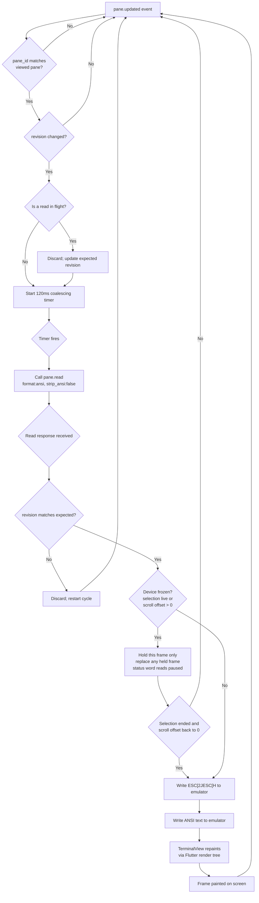

# 21 — Terminal Rendering

> **Scope.** This document owns the question: how does `herdr-mobile` paint a Herdr pane on an
> Android or iOS phone with 1-to-1 fidelity, using an existing terminal emulator library, when the
> input is ANSI text snapshots rather than a PTY byte stream?

## 1. Input Contract and Render Strategy

### 1.1 What the Host sends

The Host calls `pane.read` with `format: "ansi"`, `strip_ansi: false`, and `source: "visible"`. The
result is:

```json
{
  "pane_id": "<string>",
  "workspace_id": "<string>",
  "tab_id": "<string>",
  "source": "visible",
  "format": "ansi",
  "text": "<full ANSI text of the visible viewport>",
  "revision": 42,
  "truncated": false
}
```

The `revision` field is a `uint64` change token. The bridge subscribes to `pane.updated` events on
the Host socket. Each event triggers a `pane.read` call by the bridge; the bridge sends a
`pane_frame` relay message to the Device. The `text` field is a **snapshot** of the visible
viewport, not an incremental byte stream.

Source: the Herdr socket API schema, obtained at run time with `herdr api schema --json`. Types
`PaneReadParams` and `PaneReadResult`. The schema is never a committed file.

### 1.2 The payload is a flattened grid, not a PTY stream

Per R-10-016, measured across all 14 live panes, `pane.read` with `format:"ansi"` and
`strip_ansi:false` returned 2854 escape sequences, of which 100% were `ESC[...m` SGR. Zero cursor
positioning. Zero erase. Zero scroll region. Zero OSC. Zero mode switches. This includes full-screen
TUIs running in alternate screen.

Herdr renders the terminal grid on the Host and hands over the finished result: one text line per
screen row, with SGR runs inside. The payload is a complete grid of rows, not a byte stream.

This has two consequences for an emulator library:

1. A full cursor-addressing VT state machine is not needed. The Device needs a row array plus an SGR
   parser. However, using a full emulator like `xterm2` is still correct: it parses SGR sequences
   and renders the cell grid. The extra state machine code is unused but harmless.

2. The snapshot model (below) still applies: each `pane.read` is a full viewport repaint, never a
   fragment or delta (R-10-018).

### 1.2a Consequences for a stream-oriented emulator

Terminal emulator libraries are built for a continuous PTY byte stream. A snapshot breaks four
assumptions:

| Assumption | Stream model | Snapshot reality |
|---|---|---|
| Cursor position | The emulator tracks the cursor as bytes arrive. | The payload has no cursor positioning sequences. Each row is a complete line. The emulator's cursor state is irrelevant. |
| Scrollback growth | Lines scroll off the top into scrollback. | Each snapshot is the visible viewport only. Feeding it to a persistent emulator appends to scrollback, duplicating content. |
| Duplicated content | Each byte is new. | Each snapshot re-sends the full visible viewport. A persistent emulator accumulates copies. |
| Alternate screen | The alternate screen is entered and exited by escape sequences in the stream. | The payload never contains `ESC[?1049h`. Herdr resolves the alternate screen on the Host. The Device never learns which mode the pane is in (R-10-026). |

### 1.3 Strategy comparison

Per R-10-016, confirmed independently by Main's probe (3972 escape sequences, 100% `CSI m` SGR), the
payload is a pre-rendered grid of rows with SGR styling only. No cursor motion, no erase, no scroll
region, no OSC, no mode switches. This changes the strategy comparison: the Device does not need a
cursor-addressing VT state machine at all.

| Strategy | Bandwidth | Correctness | Complexity |
|---|---|---|---|
| **A. Fresh emulator per frame** | Full SGR snapshot per update. Per R-10-022, a 50-row pane is 288 B to 11.3 KB raw, 164 B to 1.7 KB compressed. | Correct: each frame is independent. No scrollback pollution, no cursor drift. | Low. Discard the old emulator, create a new one, feed the snapshot, render. |
| **B. Persistent emulator + clear-and-home reset** | Same as A. | Correct and now provably safe: a flattened grid with no cursor motion cannot desynchronise a persistent emulator. The clear-and-home reset prevents scrollback growth. | Medium. Must emit `ESC[2JESC[H` before each feed. |
| **C. Host-side cell-level diff** | Only changed cells. | Correct and efficient, but requires a new Host-side protocol. Per R-10-022, compression plus revision-gating already solves the bandwidth problem, so the diff is unnecessary. | High. Violates the "reuse, do not reinvent" constraint. |
| **D. SGR spans, no emulator** | Same as A and B. | Correct: parse SGR into styled spans and paint each row directly with Flutter's `RichText` and `TextSpan`. No VT state machine needed. | Medium-high. Parsing the measured vocabulary (9 SGR codes) is small and testable. But the Device then owns text selection, scrollback gestures, pinch-to-zoom, and the key row, which `xterm2`'s `TerminalView` provides for free. Building a terminal widget is what the reuse rule forbids. |

### 1.4 Decision

**R-21-001.** The Device MUST use strategy B: a persistent `xterm2` `Terminal` instance fed after a
clear-and-home reset on each `pane.updated` cycle.

**Reasoning.** The reuse ladder ranks existing dependencies above new code. `xterm2` provides a
complete Flutter terminal widget: `TerminalView` for rendering, `TerminalController` for selection,
`ScrollController` for scrollback, `keyInput`/`charInput`/`paste` for input, and `TerminalStyle` for
font configuration. Option D removes the `xterm2` dependency but requires building all of these from
scratch, which the reuse rule forbids.

The measured SGR-only payload (R-10-016, R-10-017) makes strategy B provably safe rather than merely
correct. A flattened grid with no cursor motion cannot desynchronise a persistent emulator. The
clear-and-home reset (`ESC[2JESC[H`) prevents scrollback growth. The measured vocabulary of 9 SGR
codes bounds our exposure to `xterm2`'s emulator gaps: we only exercise its SGR parser, which is the
simplest and most stable part of any terminal emulator. Complex VT features like cursor positioning,
scroll regions, and alternate-screen switching are never triggered by the Host payload.

**R-21-001a.** The Device depends on `xterm2` for its WIDGET: selection, scrollback, input handling,
and Flutter rendering. The Device does NOT depend on `xterm2` for VT correctness, because the Host
payload contains only SGR sequences (R-10-016). If `xterm2` has bugs in cursor motion, scroll
regions, or OSC handling, those bugs are unreachable.

**R-21-002.** Before each feed, the Device MUST emit `ESC[2JESC[H` to the emulator. This clears the
screen and homes the cursor. The emulator's scrollback does not grow because the clear wipes it.
With `maxLines: 0` (no scrollback), the clear is a trivial grid reset. After a fetched history
window shrinks back to live geometry, the Device MUST also clear the emulator's scrollback after
each live feed. `xterm2` retains its expanded capacity after a resize; clear-and-home alone does
not remove rows above the viewport (verified 2026-09-17).

**R-21-002a.** The bridge MUST use `source: "visible"` when calling `pane.read` on behalf of the
Device, per R-11-051 and R-10-021. `source: "detection"` silently ignores `strip_ansi: false` and
returns stripped text while still echoing `format: "ansi"`. Using `detection` for rendering would
discard all styling.

**R-21-003.** The Device MUST NOT rely on the snapshot to contain alt-screen enter/exit sequences.
Per R-10-016, the payload never contains mode-switch sequences. Herdr resolves the alternate screen
on the Host. The Device never learns which mode the pane is in (R-10-026). The emulator renders the
content in the main buffer. This is correct because the visible result is the same: the cells are
**R-21-004.** The Device MUST track the `revision` from the `pane_frame` relay message
(`docs/11-relay-protocol.md` R-11-051), not from the `pane.read` result. Per R-10-020, `pane.read`
always returns `revision: 0`. The bridge tracks revision from the `pane.updated` event payload
(`data.pane.revision`) per R-02-011. When `revision` does not move, the text is byte-identical
(R-02-012), so the bridge MUST skip the read. If a new `pane.updated` event arrives while a read
is in flight, the bridge MUST discard the in-flight read and issue a new one. This prevents
out-of-order rendering.

**R-21-004a.** The bridge MUST filter `pane.updated` events to the pane the Device is currently
viewing. Per R-02-013, the server has no server-side pane filter and idle plugin panes produce
about 9.8 events per second of noise. Forwarding unfiltered events would waste bandwidth and
battery. The bridge MUST filter by `data.pane.pane_id` before sending a `pane_frame` to the
Device.

## 2. Emulator Library Survey

### 2.1 Shortlist

The mobile app uses Flutter for both Android and iOS (see `docs/20-mobile-framework.md`). The
terminal emulator must be a Dart package that runs inside Flutter. The shortlist is:

| Library | Package | Version | Licence | Repo |
|---|---|---|---|---|
| xterm.dart (original) | `xterm` | 4.0.0 | MIT | https://github.com/TerminalStudio/xterm.dart |
| xterm2 (maintained fork) | `xterm2` | 5.2.0 | MIT | https://github.com/SoFluffyOS/xterm2 |
| SwiftTerm | SPM `SwiftTerm` | 1.20.0 | MIT | https://github.com/migueldeicaza/SwiftTerm |
| Termux terminal-emulator | `com.termux:terminal-emulator` | 0.118.0 | Apache-2.0 | https://github.com/termux/termux-app |
| Termux terminal-view | `com.termux:terminal-view` | 0.118.0 | Apache-2.0 | https://github.com/termux/termux-app |

**R-21-005.** The Device MUST use `xterm2` 5.2.0 (https://pub.dev/packages/xterm2, MIT licence,
latest version confirmed on pub.dev as of 2026-08-24). It is the maintained fork of `xterm.dart`,
which is the only Dart-language terminal emulator with a Flutter widget, full VT/xterm escape
parsing, and mobile platform support. SwiftTerm and Termux are native libraries for iOS and Android
respectively; they would require two separate rendering paths. `xterm2` gives one codebase for both
platforms.

Per R-21-001a, the Device uses `xterm2` for its widget (selection, scrollback, input, rendering),
not for VT correctness. The Host payload contains only SGR sequences (R-10-016), so only `xterm2`'s
SGR parser is exercised. The measured vocabulary of 9 SGR codes (R-10-017) is the simplest part of
any terminal emulator, which reduces our exposure to `xterm2`'s single-maintainer risk. If `xterm2`
is abandoned, the SGR parser is small enough to fork or replace without losing the widget
investment.

### 2.2 Library details

#### 2.2.1 xterm.dart / xterm2

- **Package:** `xterm2` on pub.dev (https://pub.dev/packages/xterm2)
- **Version:** 5.2.0
- **Licence:** MIT (file: `LICENSE`, "The MIT License (MIT), Copyright (c) 2020 xuty")
- **Repository:** https://github.com/SoFluffyOS/xterm2
- **Maintenance:** Active fork. The original `xterm.dart` (TerminalStudio) is marked "no longer
  maintained." `xterm2` was updated approximately 1 month ago as of 2026-08-24.
- **Platform support:** Android, iOS, desktop (macOS, Linux, Windows), web. Flutter >= 3.19.0, Dart
  SDK >= 3.0.0.
- **Source read:** `/tmp/librarian-xterm/` (clone of TerminalStudio/xterm.dart, source identical to
  xterm2 core).

**Can I feed it an arbitrary ANSI chunk?** Yes.

```dart
/// Writes the data from the underlying program to the terminal. Calling this
/// updates the states of the terminal and emits events such as [onBell] or
/// [onTitleChange] when the escape sequences in [data] request it.
void write(String data) {
  _parser.write(data);
  notifyListeners();
}
```

Source: `lib/src/terminal.dart`, lines 224–230.

**Can I read back the resulting cell grid?** Yes. The `Buffer` class exposes `lines`, an
`IndexAwareCircularBuffer<BufferLine>`. Each `BufferLine` stores cells in a `Uint32List` with 4
slots per cell: foreground, background, attributes, content.

```dart
int getForeground(int index) {
  return _data[index * _cellSize + _cellForeground];
}

int getBackground(int index) {
  return _data[index * _cellSize + _cellBackground];
}

int getAttributes(int index) {
  return _data[index * _cellSize + _cellAttributes];
}

int getContent(int index) {
  return _data[index * _cellSize + _cellContent];
}
```

Source: `lib/src/core/buffer/line.dart`, lines 40–54.

The `TerminalView` widget renders the buffer directly. You do not need to read back the grid for
rendering; the widget does it for you. You can read it for selection or search.

**Can I reset it cheaply?** Yes. Call `terminal.write('\x1b[2J\x1b[H')` to clear and home. The
`Terminal` constructor also takes `maxLines` (scrollback size). For the snapshot model, set
`maxLines: 0` to disable scrollback entirely.

```dart
Terminal({
  this.maxLines = 1000,
  ...
});
```

Source: `lib/src/terminal.dart`, lines 73–86.

#### 2.2.2 SwiftTerm (iOS native, not selected)

- **Package:** SwiftPM `SwiftTerm`
- **Version:** 1.20.0 (latest tag: `v1.20.0`, https://github.com/migueldeicaza/SwiftTerm/releases)
- **Licence:** MIT (file: `LICENSE`, "Copyright (c) 2019-2026 Miguel de Icaza")
- **Repository:** https://github.com/migueldeicaza/SwiftTerm
- **Maintenance:** Active. The release history holds 32 releases up to `v1.20.0`, and the `LICENSE`
  copyright runs 2019 to 2026, so development is continuous over seven years. Issue, pull-request
  and commit counts are deliberately absent: they date within a day and no rule here rests on one.
- **Platform support:** iOS (UIKit), macOS (AppKit), headless. iOS 14+, macOS 11+.

**Can I feed it an arbitrary ANSI chunk?** Yes.

```swift
public func feed (byteArray: [UInt8])
public func feed (text: String)
public func feed (buffer: ArraySlice<UInt8>)
```

Source: `Sources/SwiftTerm/Terminal.swift`, lines 6512–6534.

**Can I read back the resulting cell grid?** Yes. `Buffer.getChar(at:)` returns a `CharData` for a
position.

```swift
public func getChar (at: Position) -> CharData
public func getChar (atBufferRelative: Position) -> CharData
```

Source: `Sources/SwiftTerm/Buffer.swift`, lines 805–818.

`BufferLine.getData()` returns `[CharData]` for the full row:

```swift
public func getData() -> [CharData] {
  (0..<storage.count).map { storage.cell(at: $0) }
}
```

Source: `Sources/SwiftTerm/BufferLine.swift`, lines 345–347.

**Can I reset it cheaply?** Yes.

```swift
public func resetToInitialState ()
public func softReset ()
```

Source: `Sources/SwiftTerm/Terminal.swift`, lines 6776 and 4967.

**Not selected because:** It is a Swift-only library. Using it for iOS and `xterm2` for Android
would require two rendering codebases. The product constraint is one app for both platforms.

#### 2.2.3 Termux terminal-emulator + terminal-view (Android native, not selected)

- **Package:** `com.termux:terminal-emulator` and `com.termux:terminal-view` (Maven, version
  0.118.0)
- **Version:** 0.118.0 (file: `terminal-emulator/build.gradle`, line 80: `version = '0.118.0'`)
- **Licence:** Apache-2.0 (inherited from Termux project)
- **Repository:** https://github.com/termux/termux-app
- **Maintenance:** Active. Termux is a production Android terminal app with continuous development.
- **Platform support:** Android only. Java/Kotlin.

**Can I feed it an arbitrary ANSI chunk?** Yes. `TerminalEmulator.append(byte[], int)` feeds raw
bytes:

```java
public void append(byte[] buffer, int length) {
  for (int i = 0; i < length; i++)
    processByte(buffer[i]);
}
```

Source: `terminal-emulator/src/main/java/com/termux/terminal/TerminalEmulator.java`, lines 500–502.

**Can I read back the resulting cell grid?** Yes. `TerminalBuffer.mLines` is a `TerminalRow[]`
array. Each `TerminalRow` exposes `mText` (char array) and `mStyle` (long array, one per column).

```java
public char[] mText;
final long[] mStyle;
```

Source: `terminal-emulator/src/main/java/com/termux/terminal/TerminalRow.java`, lines 43–49.

**Can I reset it cheaply?** No dedicated reset method. You would need to create a new
`TerminalEmulator` instance. The `TerminalEmulator` constructor takes columns, rows, and a
`TerminalSessionClient`.

**Not selected because:** Android only. Same dual-codebase problem as SwiftTerm.

#### 2.2.4 flutter_pty (not an emulator)

- **Package:** `flutter_pty` on pub.dev (https://pub.dev/packages/flutter_pty)
- **Purpose:** PTY (pseudo-terminal) creation for Flutter. Provides native PTY file descriptors.
- **Not selected because:** It is a PTY provider, not a terminal emulator. The Herdr relay model
  does not use a local PTY. The Device receives ANSI text over the network, not a PTY stream.
  `flutter_pty` is not needed.

#### 2.2.5 xterm.js + WebView (not selected)

- **Package:** `xterm.js` (https://github.com/xtermjs/xterm.js)
- **Not selected because:** It requires a WebView to render HTML/Canvas. The product rule (see
  `docs/20-mobile-framework.md`) disfavours WebView-based rendering for the terminal surface. A
  WebView adds a layer of indirection, increases memory usage, and complicates input handling.
  `xterm2` provides native Flutter rendering without a WebView.

#### 2.2.6 Rust parsers via FFI (not selected)

| Crate | Version | Licence | Purpose |
|---|---|---|---|
| `vte` | 0.15.0 | Apache-2.0 OR MIT | ANSI parser state machine only. No cell grid, no rendering. |
| `vt100` | 0.16.2 | MIT | Parser + in-memory screen. Can read cells via `screen.cell(row, col)`. |
| `termwiz` | (part of wezterm) | MIT | Full terminal implementation. Heavy. |
| `wezterm-term` | (part of wezterm) | MIT | Full terminal implementation. Heavy. |

**Not selected because:** FFI adds a build complexity and a native bridge for each platform.
`xterm2` provides the same VT parsing and cell-grid access in pure Dart. The `vt100` crate has the
right API (`Parser::new(cols, rows, scrollback)`, `parser.process(bytes)`, `screen.cell(row, col)`)
but requires a Rust-to-Dart FFI bridge (flutter_rust_bridge or similar), which adds build complexity
for no fidelity gain.

Source: https://docs.rs/vt100/latest/vt100/ — `Parser::new(24, 80, 0)`, `parser.process(b"...")`,
`parser.screen().cell(0, 13)`.

#### 2.2.7 Compose Multiplatform terminal widget (does not exist)

No maintained Compose Multiplatform terminal emulator widget exists. `Mosaic` (JakeWharton) and
`Kotter` (varabyte) are libraries for building console applications, not for rendering terminal
output on mobile. They do not parse ANSI escape sequences or render cell grids. There is no Kotlin
Multiplatform library that provides a terminal emulator widget for Android and iOS.

## 3. Fidelity Feature Matrix

| Feature | xterm2 5.2.0 | SwiftTerm 1.20.0 | Termux 0.118.0 | Notes |
|---|---|---|---|---|
| SGR 16-colour | Yes | Yes | Yes |  |
| SGR 256-colour | Yes | Yes | Yes |  |
| SGR 24-bit truecolour | Yes | Yes | Yes |  |
| Bold | Yes (`CellAttr.bold`) | Yes (`CharacterStyle.bold`) | Yes (`CHARACTER_ATTRIBUTE_BOLD`) |  |
| Italic | Yes (`CellAttr.italic`) | Yes (`CharacterStyle.italic`) | Yes (`CHARACTER_ATTRIBUTE_ITALIC`) |  |
| Underline (single) | Yes (`CellAttr.underline`) | Yes (`CharacterStyle.underline`) | Yes (`CHARACTER_ATTRIBUTE_UNDERLINE`) |  |
| Underline curly | No (source-verified: `CellAttr` has only `underline`, no style variants) | Yes (`UnderlineStyle.curly`) | No | Never emitted by Host (R-10-017). |
| Underline coloured | No (source-verified: `CellAttr` has only `underline`, no colour variants) | Yes [UNVERIFIED — not confirmed from SwiftTerm source. Owner: SwiftTerm documentation. Fallback: assume yes; SwiftTerm has `UnderlineStyle` variants. Verify against SwiftTerm 1.20.0 source before release.] | No | Never emitted by Host (R-10-017). |
| Strikethrough | Yes (`CellAttr.strikethrough`) | Yes (`CharacterStyle.crossedOut`) | Yes (`CHARACTER_ATTRIBUTE_STRIKETHROUGH`) | Never emitted by Host (R-10-017). |
| Reverse | Yes (`CellAttr.inverse`) | Yes (`CharacterStyle.inverse`) | Yes (`CHARACTER_ATTRIBUTE_INVERSE`) | Never emitted by Host (R-10-017). |
| Dim/faint | Yes (`CellAttr.faint`) | Yes (`CharacterStyle.dim`) | Yes (`CHARACTER_ATTRIBUTE_DIM`) |  |
| Unicode width | Yes (`unicodeV11.wcwidth`) | Yes | Yes (`WcWidth.width()`) |  |
| CJK wide chars | Yes | Yes | Yes |  |
| Combining marks | No (source-verified: `writeChar` in `buffer.dart` treats every code point as a standalone cell; combining marks occupy their own cell rather than merging with a base character. Moot per R-10-016.) | Yes | Yes (max 15 per column, `MAX_COMBINING_CHARACTERS_PER_COLUMN`) |  |
| Emoji (ZWJ sequences) | Partial. Width is correct via `wcwidth`. Glyph rendering depends on font. | Yes | Partial. Width via `WcWidth`. Glyph depends on font. |  |
| Box-drawing chars | Yes. Rendered by font. | Yes. Has `BoxDrawingRenderer`. | Yes. Rendered by font. |  |
| Powerline glyphs | Yes. Rendered by font (Nerd Font). | Yes. Has `PowerlineRenderer`. | Yes. Rendered by font. |  |
| Alternate screen | Yes (`_altBuffer`) | Yes (`bufferActivated` callback) | Yes (DECSET 1049) |  |
| Scroll regions | Yes (`resetVerticalMargins`) | Yes (`scrollTop`/`scrollBottom`) | Yes |  |
| Bracketed paste | Yes (`_bracketedPasteMode`, `paste()`) | Yes | No [UNVERIFIED — not confirmed from Termux source. Owner: Termux documentation. Fallback: assume no; verify against Termux 0.118.0 source before release.] |  |
| Mouse reporting | Yes (`MouseMode`, `MouseReportMode`) | Yes (`mouseModeChanged`) | Yes (DECSET 1000/1002) |  |
| OSC 8 hyperlinks | No. `onPrivateOSC` callback receives unrecognized OSC codes but does not render them as links. | Yes. `linkReporting`, `link(at:mode:)`, `LinkLookupMode`. | No |  |
| Inline images (Sixel) | No. Sixel handler is commented out in `parser.dart` line 103. | Yes. `SixelDcsHandler`, `createImageFromBitmap`, `createImage`. | No |  |
| Inline images (iTerm2) | No | Yes. `iTermContent`, `createImage`. | No |  |
| Inline images (Kitty) | No | Yes. `KittyGraphics`, `KittyGraphicsState`. | No |  |

**R-21-006.** The Device MUST accept that inline images from `pane.graphics.*` will not render.
`xterm2` does not parse Sixel, iTerm2, or Kitty image protocols. The Sixel handler is commented out
in the source (`lib/src/core/escape/parser.dart`, line 103: `// 'P'.charCode: _unsupported_handler,
// Sixel`). If image support becomes a requirement, the Device MUST switch to SwiftTerm for iOS and
a custom renderer for Android, or contribute image parsing to `xterm2`.

**R-21-007.** The Device MUST accept that OSC 8 hyperlinks will not render as tappable links.
`xterm2` exposes `onPrivateOSC` for unrecognized OSC codes, but does not parse or render OSC 8
payloads. The Device MAY implement a custom OSC 8 parser by hooking `onPrivateOSC` and rendering
links as an overlay, but this is not required for 1-to-1 text fidelity.

### 3.1 Measured SGR vocabulary

Per R-10-017, the complete SGR set the Herdr server emits is:

| SGR parameter | Meaning | Occurrences |
|---|---|---|
| `0` | Reset all attributes | 1629 |
| `38;2;r;g;b` | Foreground truecolour (24-bit) | 545 |
| `2` | Dim/faint | 282 |
| `48;2;r;g;b` | Background truecolour (24-bit) | 268 |
| `1` | Bold | 78 |
| `3` | Italic | 35 |
| `38;5;n` | Foreground 256-index | 15 |
| `48;5;n` | Background 256-index | 2 |
| `4` | Underline (single) | 1 |

**R-21-007a.** The Device renderer MUST support SGR `0`, `1`, `2`, `3`, `4`, `38;2`, `48;2`, `38;5`,
and `48;5` per R-10-017. It SHOULD ignore any other SGR parameter rather than fail. The `xterm2`
emulator already parses all of these. No custom SGR parser is needed.

**R-21-007b.** The Device MUST NOT expect strikethrough, reverse, curly underline, coloured
underline, blink, or invisible attributes in the payload. The measured SGR vocabulary does not
include them. The `xterm2` emulator supports them if they appear, but the Host never emits them.

## 4. Grid Size and Screen Edges

### 4.1 The problem

A phone screen is narrow. A Herdr pane on the Host may be 120 columns wide. The phone may fit 40
columns at a readable font size. If the Device grid and the Host grid differ, the layout cannot be
1-to-1.

### 4.2 Options

| Option | How it works | 1-to-1? | Trade-off |
|---|---|---|---|
| **A. Match Host size on the Device** | Set the Device emulator to the Host pane's column and row count from `pane.layout` `rect.width` and `scroll.viewport_rows`. Readable mode shows a clipped, pannable window at the saved ladder size, including default 13px; explicit Overview uses measured cells to fit the whole grid. | Yes. Every cell maps to a Host cell. | Readable mode does not fit a wide grid; Overview is the explicit fit mode. |
| **B. Resize Host pane to Device** | Call `pane.resize` to set the Host pane to the Device's column/row count. | Yes. The Host reflows to the Device. | `pane.resize` takes `direction` and `amount` (a float split ratio), not explicit columns and rows. It resizes a split, not a pane's terminal dimensions. **This does not work.** |
| **C. Reflow on Device** | Set the Device emulator to the phone's column count. Feed the ANSI snapshot. The emulator reflows long lines. | No. Reflow changes line breaks. | Not 1-to-1. Lines wrap differently than on the Host. Per R-10-024, the Host pads every row with styled spaces to its own width, so reflowing at a shorter value would wrap rows that the Host considers complete. |

### 4.3 Schema verification

`pane.resize` params:

```json
"PaneResizeParams": {
  "properties": {
    "amount": { "format": "float", "type": ["number", "null"] },
    "direction": { "$ref": "#/schemas/request/$defs/PaneDirection" },
    "pane_id": { "type": ["string", "null"] }
  },
  "required": ["direction"],
  "type": "object"
}
```

`PaneDirection` enum: `["left", "right", "up", "down"]`.

Source: the Herdr socket API schema, `herdr api schema --json`. Types `PaneResizeParams` and
`PaneDirection`.

`pane.resize` adjusts the split ratio between panes in a given direction. It does not set explicit
terminal columns and rows. The terminal dimensions are a side effect of the pane's pixel size and
the font metrics. There is no API method to set columns and rows directly.

`pane.split` also takes `ratio` (float), not explicit dimensions:

```json
"PaneSplitParams": {
  "properties": {
    "direction": { "$ref": "#/schemas/request/$defs/SplitDirection" },
    "ratio": { "format": "float", "type": ["number", "null"] },
    ...
  }
}
```

Source: the Herdr socket API schema, `herdr api schema --json`. Type `PaneSplitParams`.

### 4.3a Column count from `pane.layout`

Per R-10-024, `pane.layout` returns a `PaneLayoutRect` per pane measured in **character cells, not
pixels**. Proof: across all 7 tabs, pane widths sum exactly to the area width (22+61+61=144,
22+122=144).

`rect.width` is the column **upper bound**. The longest rendered line is the **lower bound**.
Measured gap: 2 to 4 cells. Per R-10-024, the Device MUST render at `rect.width` and MUST NOT
reflow, because the Host pads every row with styled spaces to its own width.

`rect.height` includes tab chrome conditionally: `rect.height - viewport_rows` was 2 in every split
tab and 0 in the single-pane tab. The Device MUST take rows from `scroll.viewport_rows`, never from
`rect.height` (R-10-024).

Source: `docs/10-herdr-integration.md`, R-10-024, section 4.10.

### 4.4 Decision

> **2026-09-08 note.** Latest user screenshots supersede the earlier same-day fit-default decision:
> Readable text is the default, and `Overview` is the explicit whole-grid fit action.

**R-21-008.** The Device MUST match the Host pane size, option A. The emulator grid is exactly
`rect.width` columns by `scroll.viewport_rows` rows, per R-21-009. The latest user screenshots of
2026-09-08 supersede the earlier same-day fit-default decision. The 2026-09-17 user correction
adds continuous zoom between the two presets:

1. **Readable mode is the default.** It starts at the saved R-21-010 ladder size, 13 logical pixels
   by default, and MUST never shrink automatically. A wide grid clips at the viewport edge, supports
   horizontal pan, and reports its visible column range as required by R-21-037. Readable mode keeps
   the actual ladder size, including 13; it does not use fit math.
2. **Overview mode is explicit.** A labeled `Overview` action enables whole-grid fit. Overview MUST
   use the existing measured-cell math from the bundled font's real advance, measured as the emulator
   painter measures it. It MUST adopt the exact `renderTerminal.cellSize` result. The fit MUST
   recompute on viewport width, Host column count, text-size and mode changes. Overview hides the
   column window because the whole grid fits. Its action label is `Readable`, and pressing it
   immediately restores the size saved in Settings and its exact saved glyph width.
3. The mode is route-local. It MUST reset for a new pane or a restart, MUST survive rotation, and
   MUST NOT change Host rows, Host columns or saved settings. Rotation MUST preserve the existing
   broadcast ACK controller.
4. A pinch MUST scale continuously from the actual painted size at gesture start, including
   Overview's fractional fit. It MUST retain the exact custom size after release and rotation,
   without changing Settings. The bounds come from R-32-208. The mode button MUST keep its
   labeled destination during custom zoom; pressing it clears the custom size and applies that
   preset. Subsequent presses alternate Overview and Readable. Pinch MUST NOT change Host geometry.

**Reasoning.** Readable mode makes terminal text legible on first paint while preserving the Host grid.
Overview remains available for a structural view of a wide pane. Both modes map each rendered cell to
one Host cell and never reflow or resize the Host pane.
This rule is the single owner of the sizing model. `docs/31-mockups/08-terminal.md` `R-31-08-07`
cites it and keeps only what the screen draws.

**R-21-009.** The Device MUST obtain the column count from the `pane_frame` relay message
(`docs/11-relay-protocol.md` R-11-051). The bridge calls `pane.layout` per R-10-024 and R-10-025.
`rect.width` is the column upper bound. The longest rendered line is the lower bound. When the two
differ, the Device MUST render at `rect.width` and MUST NOT reflow, because the Host pads every row
with styled spaces to its own width. The row count comes from `scroll.viewport_rows` in the
`pane_frame` relay message, never from `rect.height`, which carries a conditional chrome offset
(R-10-024). A fetched `scroll_response` is an independent window: the Device MUST retain all
returned rows in the local emulator at the Host's column count. It MUST restore the live row
count on return to live output. This temporary local window MUST NOT change Host geometry or
the grid dimensions reported in the status strip.

The bridge MUST call `pane.layout` once when a Device attaches to a pane, and again on any
`layout.updated` or `pane.updated` event whose pane reports a changed `viewport_rows` (R-10-025). It
MUST NOT call `pane.layout` on every frame.

The emulator's `resize()` method sets the grid:

```dart
void resize(int newWidth, int newHeight, [int? pixelWidth, int? pixelHeight])
```

Source: `lib/src/terminal.dart`, lines 352–377.

**R-21-010.** The saved terminal text size MUST be one of exactly 10, 11, 12, 13, 14, 16, or 18
logical pixels, with 13 as the default, per R-30-210 (docs/30-ux-spec.md). R-21-008 permits a
temporary continuous zoom without changing that saved value. Readable mode starts at the saved
size, so the 13px window applies by default. The terminal text size MUST NOT follow the system text
scale. The line height is 1.3, per the reconciled constant in section 12 of the repository contract.
The font family is `JetBrainsMono Nerd Font Mono`, per R-21-011.

| Orientation | Screen width (px) | Font size (px) | Char width (px, approx) | Readable columns in the window |
|---|---|---|---|---|
| Portrait | 390 (iPhone 15) | 13 | 7.8 | 50 |
| Landscape | 844 (iPhone 15) | 13 | 7.8 | 108 |

Char width is approximately 0.6 × font size for JetBrains Mono. At 13 px, one character is roughly
7.8 px wide. So a 390 px Readable window holds roughly 50 columns and an 844 px window roughly 108.
These are the default readable windows, not the emulator grid width, which stays at `rect.width`.
Overview uses the measured-cell fit only when explicitly selected and does not change the saved ladder
size or glyph width. Its fit may therefore show all Host columns at a smaller cell size.

The widget parameters that keep this true are `autoResize: false` and
`textScaler: TextScaler.noScaling`, per R-21-038. The column count comes from `pane.layout`
`rect.width` per R-21-009, and a later layout change updates it via R-10-025. The widget's own
measured size MUST NOT set it.

**R-21-036.** A phone-side layout choice MUST NOT change the Host pane geometry. The bridge MUST NOT
call `pane.resize`, `pane.split`, or any other Herdr method that moves a pane boundary, as a
consequence of the phone's screen size, its orientation, the terminal text size, the pan offset, or
a pinch. The Device MUST NOT ask for one.

A pane resize is a real action at the workstation. It moves a split boundary and it reflows the pane
for the person sitting there, who did not ask for it. The grid the phone paints is a view of the
pane; it is not the pane.

This rule is stated independently of R-21-008 and it survives any later change to the presentation.
It also holds if a future Herdr API can set columns and rows directly: the ability to resize the
Host pane is not a licence to resize it on the phone's behalf. The one resize the phone may cause is
the explicit pane action in `docs/31-mockups/10-pane-actions.md`, which a person asks for and which
is never automatic. The `xterm2` widget defaults defeat this rule if they are left alone, which
R-21-038 fixes.

**R-21-037.** When the grid is wider than the window, the Device MUST make the window state visible
and reversible:

1. **Reach the rest by panning.** A horizontal drag inside the grid moves the window. R-21-040 owns
   where that drag may start.
2. **Show the column range.** In Readable mode, the status strip MUST report the first and last column
   the window holds, as `c<first>-<last>`, for example `c1-50`. It MUST appear whenever the grid is
   wider than the Readable window, including at the default 13px size. Overview fits the whole grid
   and hides the range. `docs/31-mockups/08-terminal.md` draws the range and the mode action.
3. **Keep both offsets.** The horizontal window offset and the vertical scroll offset MUST each
   survive an app background and resume, and a rotation. A rotation changes how many columns the
   window holds, and it MUST NOT reset the offset to column 1. Rotation also preserves the Overview
   mode and the existing broadcast ACK controller.
4. **Give the screen reader every column.** The one grid semantics node of R-30-710 MUST carry each
   row at its full `rect.width`, not the columns the window happens to hold. A screen reader cannot
   pan, so a label clipped to the window would hide content with no way to reach it.

Readable mode uses this rule whenever the grid is wider than the viewport, including at the default
13px window. Overview fits the whole grid and hides the range. Without the range in Readable mode a
person cannot tell a wide pane from a row that ended, because both look like a grid that stops at the
screen edge.

**R-21-038.** The Device MUST construct `TerminalView` with `autoResize: false` and
`textScaler: TextScaler.noScaling`. Each value differs from the package default, and each default
breaks a rule above:

| Parameter | `xterm2` 5.2.0 default | Why the default is wrong here |
|---|---|---|
| `autoResize` | `true` (`lib/src/terminal_view.dart` line 107) | The widget calls `terminal.resize()` from its own measured size, so a 144-column pane becomes about 50 columns on the phone. That reflows the grid, which R-10-024 forbids, and it breaks 1-to-1 fidelity. |
| `textScaler` | `MediaQuery.textScalerOf(context)` (`lib/src/terminal_view.dart` line 442) | The cell advance would follow the system text scale, so an OS setting would change how many columns the window holds. R-21-010 already forbids the terminal text size from following the system text scale, and this parameter is how that rule is enforced. |

The emulator grid is set once from the `pane_frame` column and row count, per R-21-009, and never
from the widget's own size. The system text scale still applies to every other surface on the
screen. It stops at the grid, because a cell is a unit of the Host's layout and not a unit of type.

### 4.5 The grid and the screen edges

**R-21-039.** The grid **background** MUST extend to the screen edges and under a display cutout, so
the screen reads as edge to edge. A grid **cell** MUST NOT. The Device MUST measure the cell
rectangle from the unobscured viewport: the grid rectangle inset by `MediaQuery.paddingOf(context)`,
with every `MediaQueryData.displayFeatures` entry whose type is `DisplayFeatureType.cutout`
excluded.

A cell under a cutout is a cell the person cannot read, and this screen exists to be exact. A hidden
column is worse here than on any other screen, because the person cannot tell a cell the cutout ate
from a cell the program left blank. The background may run under the cutout because it carries no
information: it is one flat `color.term.bg` fill, per `R-31-08-15`.

The column count does not change when the cell rectangle shrinks. The emulator stays at
`rect.width`, per R-21-038, and the window of R-21-037 simply holds fewer columns.

**R-21-040.** System edge gestures keep priority over the grid. Two requirements follow:

1. The horizontal pan of R-21-037 MUST begin from a touch that starts outside the system gesture
   insets, read as `MediaQueryData.systemGestureInsets`. A touch that starts inside them belongs to
   the system, and the app MUST let it through. The vertical scroll is unaffected, because no system
   edge gesture claims a vertical drag inside the screen.
2. The app MUST NOT set a broad gesture exclusion to win the edge. It MUST NOT call
   `View.setSystemGestureExclusionRects` over the grid on Android, and it MUST NOT defer system
   screen-edge gestures for this route on iOS. `docs/33-platform-chrome.md` `R-33-070` already
   forbids the app from disabling Android predictive back and keeps the iOS interactive pop gesture,
   and this rule adds only the grid consequence: the pan may not swallow the edge that gesture owns.

An exclusion would not even work. Android limits the exclusion it honours to 200 dp of vertical
extent per edge, and it clips a larger request silently, so a full-height grid can never hold the
edge. The limit is deliberate: the platform values a back gesture that behaves the same in every app
above any single app's gesture. Fighting it produces the worst result available, an edge that
sometimes pans and sometimes goes back.

A person who wants the leftmost columns while the window sits to the right therefore drags from
inside the grid, not from the edge. That costs one shorter drag and it keeps back working.

decided 2026-09-03, after the Phase 25 end-to-end run found the band dead on a real device: the
cutout-inset band between the grid's top edge and the first cell row is grid **background**, and
the grid's gestures accept it. The horizontal pan (R-21-037) and the force-read pull
(`docs/30-ux-spec.md`'s gesture table) may start in the band. The band is outside
`MediaQueryData.systemGestureInsets`, so this rule's edge priority is unchanged. The
implementation hit-tests the grid's `Listener` as `HitTestBehavior.opaque`, and it measures the
pull's start window from the first cell row, not from the `Listener`'s top edge.

## 5. Font Specification

### 5.1 Font choice

**R-21-011.** The terminal monospace font family MUST be `JetBrainsMono Nerd Font Mono` (Nerd
Fonts v3.5.1, based on JetBrains Mono 2.304). The app MUST NOT substitute a whole platform
monospace font for the bundled font. A whole-font substitution changes the cell advance and breaks
the grid. The app MAY use a per-glyph fallback chain (R-21-014) for codepoints the bundled font
does not contain. A per-glyph fallback cannot move a cell that the bundled font renders, because the
cell advance comes from `wcwidth` and the fixed `fontSize`, not from whichever font supplies the
glyph bitmap. Source: Flutter `fontFamilyFallback` documentation — the fallback list is searched
"when a glyph cannot be found in a higher priority font family"
(https://api.flutter.dev/flutter/painting/TextStyle/fontFamilyFallback.html). The font files and
fallback chain are specified by R-21-012 through R-21-014. The interface sans-serif font is owned
by `docs/30-ux-spec.md` R-30-200.

**R-21-011a.** The UI sans-serif font (IBM Plex Sans) is owned by `docs/30-ux-spec.md` R-30-200.
`docs/30` specifies the exact font files, weights, asset declaration, licence (SIL OFL 1.1) and the
Flutter asset path. This document owns only the terminal monospace font
(JetBrains Mono Nerd Font Mono)
and fallback chain (R-21-011 through R-21-014).

- **Font family:** JetBrains Mono
- **Licence:** SIL Open Font License 1.1 (OFL-1.1)
- **Download URL:** https://github.com/ryanoasis/nerd-fonts/tree/master/patched-fonts/JetBrainsMono
- **Original source:** https://github.com/JetBrains/JetBrainsMono (also OFL-1.1)
- **Nerd Font version:** 3.5.1 (based on JetBrains Mono 2.304)

### 5.2 Glyph coverage

- **Powerline glyphs:** Yes. The Nerd Font patch adds Powerline symbols (U+E0A0–U+E0A3,
  U+E0B0–U+E0B3).
- **Nerd Font symbols:** Yes. 3,600+ icons from Font Awesome, Material Design, Octicons, and more.
- **Wide CJK:** No. The bundled font contains no CJK glyphs. CJK codepoints depend on the
  per-glyph fallback chain (R-21-014) to resolve a system font.
- **Emoji:** No. The bundled font contains no emoji glyphs. Emoji codepoints depend on the
  per-glyph fallback chain (R-21-014) to resolve a system font. Per R-10-016, the Herdr probe
  measured emoji in real pane output, with 15 to 34 distinct non-ASCII code points per pane.
- **Box-drawing:** Yes. U+2500–U+257F (box drawing), U+2580–U+259F (block elements).

### 5.3 Files to bundle

**R-21-012.** The Device MUST bundle these four TTF files:

| File | Weight | Style |
|---|---|---|
| `JetBrainsMonoNerdFontMono-Regular.ttf` | 400 | Normal |
| `JetBrainsMonoNerdFontMono-Bold.ttf` | 700 | Bold |
| `JetBrainsMonoNerdFontMono-Italic.ttf` | 400 | Italic |
| `JetBrainsMonoNerdFontMono-BoldItalic.ttf` | 700 | Bold Italic |

Use the `NerdFontMono` variant (not `NerdFont` or `NerdFontPropo`). Both the `NerdFont` and
`NerdFontMono` variants keep a one-cell advance width. The `NerdFont` variant lets icons overhang
into the next cell (usually about 1.5 letters wide); the `NerdFontMono` variant scales icons to
fit exactly one cell. `xterm2` clips an over-wide glyph at the cell boundary
(`lib/src/ui/painter.dart`, lines 608–630: `canvas.clipRect` when the paragraph is wider than the
cell), so the `NerdFont` variant would render icons visually chopped. A Nerd Font icon receives one
cell from `xterm2` because the private-use ranges (U+E000–U+F8FF) are not in the `wcwidth` wide
tables (`lib/src/utils/unicode_v11.dart`); `painter.dart` lines 18–30 also carry an
`_isSymbolLike` check for that range. The Nerd Fonts project recommends: "If you are limited to
monospaced fonts (because of your terminal, etc) then pick a font with Nerd Font Mono (or NFM)."
Source: https://github.com/ryanoasis/nerd-fonts/wiki/FAQ-and-Troubleshooting. The internal
typographic family name (name table ID 16) is `JetBrainsMono Nerd Font Mono`; the short family
name (name table ID 1) is `JetBrainsMono NFM`. The Flutter `pubspec.yaml` `family` key is an
app-chosen alias that maps to the bundled TTF files, so it may differ from the internal name.

**R-21-013.** The four bundled TTF files total 10,303,912 bytes (about 9.8 MB), measured from the
Nerd Fonts v3.5.1 release (21 Aug 2026). The release ships `JetBrainsMono.zip` at 133,975,870
bytes with 96 TTF files across six family prefixes (`JetBrainsMonoNerdFont`,
`JetBrainsMonoNerdFontMono`, `JetBrainsMonoNerdFontPropo`, and the three `NL` no-ligature
equivalents), so a build MUST extract only the four files it needs. The built app size MUST still
be measured once after the first Flutter build, because a TTF packed in an APK or IPA is not the
same as a TTF on disk. Do not subset the font to reduce size: subsetting to ASCII, box-drawing and
Powerline would discard the 3,600 Nerd Font icons that are the reason to use a Nerd Font, and the
font contains no emoji glyphs to subset.

### 5.4 Fallback font rule

**R-21-014.** The `TerminalStyle` fallback chain MUST supply a per-glyph fallback for codepoints
the bundled font does not contain. The bundled font contains no CJK glyphs and no emoji glyphs, so
both depend on a system font. This is the one and only reason a fallback exists. Emoji receive two
cells from `wcwidth` (the emoji ranges are in the `HIGH_WIDE` table in
`lib/src/utils/unicode_v11.dart`), so the grid is safe; only the glyph source is missing. The chain
MUST resolve on both Android and iOS:

```dart
TerminalStyle(
  fontSize: 13.0,
  height: 1.3,
  fontFamilyFallback: [
    // CJK — Android system fonts
    'Noto Sans Mono CJK SC',
    'Noto Sans Mono CJK TC',
    'Noto Sans Mono CJK KR',
    'Noto Sans Mono CJK JP',
    // CJK — iOS system fonts
    'PingFang SC',
    'PingFang TC',
    'PingFang HK',
    'Hiragino Sans',
    'Apple SD Gothic Neo',
    // Emoji — platform system fonts
    'Apple Color Emoji',   // iOS
    'Noto Color Emoji',    // Android
    // Symbols
    'Noto Sans Symbols',
    'monospace',
  ],
);
```

The font family name comes from R-21-011. The CJK and emoji families are not bundled; they are
system fonts. `Noto Sans Mono CJK SC/TC/KR/JP` are Android system fonts. `PingFang SC/TC/HK`,
`Hiragino Sans`, and `Apple SD Gothic Neo` are iOS system fonts (source:
https://developer.apple.com/fonts/system-fonts/). `Apple Color Emoji` is the iOS emoji system font;
`Noto Color Emoji` is the Android emoji system font. `Noto Color Emoji` is not a system font on
iOS, so it resolves to nothing on iPhone and falls through to the next entry. If a platform lacks a
resolvable family for a codepoint, the final `monospace` fallback renders a tofu box.

## 6. Input Path

### 6.1 On-screen key panel

**R-21-015.** The Device MUST provide the key panel of R-03-117 above the input bar.
The `+` control opens it without changing keyboard visibility, per R-03-133.
R-31-09-21 owns its two default pages, navigation keys, labels, and function keys.
R-31-09-40 owns page state and overflow. These named keys use the paths below.

| Button | Label | Maps to |
|---|---|---|
| ESC | `esc` | `pane_input` relay message with `keys: ["Esc"]` (`docs/11-relay-protocol.md`) |
| TAB | `tab` | `pane_input` relay message with `keys: ["Tab"]` |
| CTRL | `ctrl` | Modifier toggle. The next character or Tab sends a Control chord. |
| ALT | `alt` | Modifier toggle. The next character or Tab sends an Alt chord. |
| ← | `←` | `pane_input` relay message with `keys: ["Left"]` |
| → | `→` | `pane_input` relay message with `keys: ["Right"]` |
| ↑ | `↑` | `pane_input` relay message with `keys: ["Up"]` |
| ↓ | `↓` | `pane_input` relay message with `keys: ["Down"]` |
| F1–F12 | `f1`–`f12` | `pane_input` relay message with `keys: ["F1"]`–`["F12"]`; modifier states stay unchanged |

### 6.2 Control and Alt chords

**R-21-016.** To compose a Control chord, the user taps CTRL (it highlights), then taps a character
key. The Device sends a `pane_input` relay message with `keys: ["ctrl+<char>"]`
(`docs/11-relay-protocol.md`); the bridge translates to `pane.send_input` per R-10-038. For
example, `ctrl+c` sends `{"pane_id": "...", "keys": ["ctrl+c"]}`. The Device MUST NOT send raw
control bytes in `text` when a named chord is available.

The `xterm2` `charInput` method (source: `lib/src/terminal.dart`, lines 271–301) implements the raw
control-char mapping internally, but the Device does not use it for control chords. The Device sends
named chords via `pane_input` relay messages instead.

**R-21-017.** To compose an Alt chord, the user taps ALT (it highlights), then taps a character key.
The Device sends a `pane_input` relay message with `keys: ["alt+<char>"]`
(`docs/11-relay-protocol.md`); the bridge translates to `pane.send_input` per R-10-039. For
example, `alt+b` sends `{"pane_id": "...", "keys": ["alt+b"]}`.

### 6.3 Paste

**R-21-018.** Paste MUST send a `pane_input` relay message with `text: <pasted-text>`
(`docs/11-relay-protocol.md`); the bridge translates to `pane.send_input`. The Device MUST NOT wrap
the paste in bracketed-paste escape sequences. The Host pane controls bracketed paste mode; if the
pane has enabled it, the Host shell expects the wrapping. The Device sends raw text and lets the
Host handle it.

### 6.4 Bridge translation to `pane.send_input`

The Device sends `pane_input` relay messages (`docs/11-relay-protocol.md`). The bridge translates
each one to a Herdr `pane.send_input` call. The Herdr params are:

```json
"PaneSendInputParams": {
  "properties": {
    "keys": { "items": { "type": "string" }, "type": "array" },
    "pane_id": { "type": "string" },
    "text": { "type": "string" }
  },
  "required": ["pane_id"],
  "type": "object"
}
```

Source: the Herdr socket API schema, `herdr api schema --json`. Type `PaneSendInputParams`.

- `text` sends a UTF-8 string. Use for typed characters, paste, and control chords.
- `keys` sends logical key names. Use for Escape, Tab, arrows, and function keys.
- Both can be sent in one call: `{"pane_id": "...", "text": "ls", "keys": ["Enter"]}`.

**R-21-019.** The Device MUST use the named key path for every key that has a name, especially
arrows. Per R-10-037, Herdr owns the pane's terminal state, so only Herdr knows whether the
application has set DECCKM (application cursor mode), which changes the arrow sequence. Sending a
raw arrow sequence would be wrong whenever a full-screen application has DECCKM set.

The accepted key names, per R-10-036 and R-10-038:

| Category | Key names |
|---|---|
| Arrows | `Up` `Down` `Left` `Right` |
| Submit | `Enter` `Return` |
| Tab | `Tab` |
| Escape | `Esc` (canonical) |
| Editing | `Backspace` |
| Space | `Space` |
| Function keys | `F1` through `F99`, and `F0` |
| Printable | any single character: `a` `Z` `1` `!` |
| Control chords | `ctrl+c`, `ctrl+shift+c`, `ctrl+alt+a` (lowercase, `+` separator, per R-10-038) |
| Alt chords | `alt+b` (per R-10-039) |

**R-21-019c.** The canonical Herdr key name for the Escape key is `Esc`. Every document, code
comment, key row binding, and `keys` array payload MUST use `Esc`, not `Escape`.
`docs/30-ux-spec.md` and `docs/31-mockups/09-key-row.md` cite this rule for the displayed label and
the spoken screen-reader label.

**R-21-019a.** Six keys have no name and MUST be sent as raw bytes in the `text` field per R-10-036:

| Key | Sequence | JSON escape |
|---|---|---|
| Home | `ESC [ H` | `\u001b[H` |
| End | `ESC [ F` | `\u001b[F` |
| PageUp | `ESC [ 5 ~` | `\u001b[5~` |
| PageDown | `ESC [ 6 ~` | `\u001b[6~` |
| Delete | `ESC [ 3 ~` | `\u001b[3~` |
| Insert | `ESC [ 2 ~` | `\u001b[2~` |

**R-21-019b.** The Device MUST send control chords by name (`ctrl+c`), not as raw bytes. Per
R-10-038, `ctrl+c` is accepted as a name and a raw `U+0003` in `text` is unnecessary.

Source: `docs/10-herdr-integration.md`, R-10-036 through R-10-039.

### 6.5 Existing terminal key toolbar libraries

**Termux `ExtraKeysView`** (Android, Java): `com.termux.shared.termux.extrakeys.ExtraKeysView` is a
`GridLayout` that shows ESC, TAB, CTRL, ALT, arrow keys, and function keys. It supports long-press
repeat and popup sub-keys. Source:
`termux-shared/src/main/java/com/termux/shared/termux/extrakeys/ExtraKeysView.java`. Default key
names are in `ExtraKeysConstants.java` (lines 21–49): `ESC`, `TAB`, `CTRL`, `ALT`, `UP`, `DOWN`,
`LEFT`, `RIGHT`, `F1`–`F12`, `BKSP`, `DEL`, `PGUP`, `PGDN`, `HOME`, `END`, `ENTER`.

**SwiftTerm `TerminalAccessory`** (iOS, Swift): `Sources/SwiftTerm/iOS/iOSAccessoryView.swift` is a
`UIInputView` that shows ESC, TAB, CTRL, arrow keys, F1–F10, and special characters (~, |, /, -).
The CTRL button toggles `controlModifier`. Arrow keys auto-repeat. Source: lines 75–96 and 128–214.

**R-21-020.** The Device MUST compose the key panel from Flutter's native controls.
Neither Termux `ExtraKeysView` nor SwiftTerm `TerminalAccessory` is a Dart/Flutter widget.
The `xterm2` package does not include a key toolbar. R-33-081 owns the SDK pager on both platforms.
R-32-535 owns native key caps. R-31-09-40 governs overflow, without an inner horizontal scroll.
The panel MUST preserve keyboard state and the 48 by 48 logical pixel target floor of R-30-290.
Amended 2026-09-23 by the product owner, per R-03-117.

## 7. Performance Budget

### 7.1 Targets

| Metric | Target | Rationale |
|---|---|---|
| Frame rate | 30 FPS minimum, 60 FPS target | Terminal output is not video. 30 FPS is smooth for text updates. |
| Max payload per update (raw) | 12 KB | Per R-10-022, the largest measured pane was 11.3 KB (52 rows, 143 cols). 12 KB gives headroom. |
| Max payload per update (compressed) | 2 KB | Per R-02-016, ANSI compresses to 13–24% with deflate or brotli. An 8 KB frame becomes roughly 1.2–1.9 KB. WebSocket `permessage-deflate` handles this with no application code. |
| Parse cost per snapshot | < 5 ms on a 2023 phone | The `xterm2` parser is a Dart state machine. Per R-10-022, `pane.read` round-trip p50 is 1 ms (p95 is 104 ms). The SGR-only payload (R-10-016) is simpler to parse than a full VT stream. [UNVERIFIED — not benchmarked on device. Owner: implementation team. Fallback: target < 5 ms, accept up to 10 ms. Profile on a real device before release.] |
| Coalescing window | 120 ms | Per R-10-029, the bridge debounces reads with a 120 ms window. This is below the 706 ms plugin noise cadence but above the server tick, so a real burst still feels immediate. |

### 7.2 Coalescing rule

**R-21-021.** When output is fast, the read path MUST coalesce. Steps 1 to 4 are the bridge, which
is the only side that speaks to the Herdr socket. Step 5 is the Device.

1. The bridge, on `pane.updated` (filtered to the viewed pane per R-21-004a), compares
   `data.pane.revision` to the last revision it read. If unchanged, it skips the read entirely
   (R-02-012, R-10-032).
2. If changed, and no read is in flight and no window is open, the bridge calls `pane.read` at
   once with `source: "visible"`, `format: "ansi"`, `strip_ansi: false`, sends the result to the
   Device as a `pane_frame` (R-11-051), and opens a 120 ms window (R-10-029 as amended
   2026-09-11; until then the first event only started the timer and the read waited for it).
3. If another `pane.updated` for the same pane arrives inside the window, the bridge updates the
   stored `revision` but does NOT restart the window (R-10-031). Only the newest revision matters
   because every frame is a full repaint (R-10-018).
4. When the window closes, the bridge reads once more only if the stored revision moved during it,
   and sends that frame the same way.
5. The Device MUST feed the frame to the emulator on arrival and render it, unless R-21-041 has
   frozen the emulator. A frozen Device holds the frame instead of feeding it. The Device MUST NOT
   impose a coalescing window of its own during normal operation. Only the slow-render fallback of
   R-21-022 permits a 240 ms Device throttle.

The bridge MUST NOT exceed 8 reads per second per pane (R-10-030). On exceeding it, drop the excess
and keep only the newest pending revision.

The 120 ms window is below the 706 ms plugin noise cadence (R-10-029) but above the server tick, so
a real burst still feels immediate while avoiding unnecessary reads. Per R-10-022, `pane.read`
round-trip p50 is 1 ms (p95 is 104 ms), so the read itself is not the bottleneck. The 120 ms window
exists to coalesce bursts, not to hide read latency.

**Amendment to R-21-021, 2026-09-08.** Step 3's "does NOT restart the timer" was suspected of
sending alternating blank and full frames. `R-02-027` observed none in 766 measured reads, so
steps 1 to 4 stay as written. The Device MUST NOT anchor its viewport on the frame's last
non-blank row: that row moves between frames (`R-02-027`), and an anchor on it moves the whole
viewport.

The same measurement found the flicker, on the Device, in step 5. `R-02-027` records that the
frame's own last non-blank row moves between consecutive frames, about four frames a second,
because the agent TUI redraws its bottom rows. The Device anchored
its follow position on that row, so a two-row change moved the whole visible window by two
rows on every frame. A pixel probe over the real widget measured the damage: one frame changed
281 pixel rows spanning the whole viewport, where only 16 pixel rows had genuinely new content.
The Device now anchors on the grid instead: once the ink runs past the first screenful, the
anchor is the grid bottom, which never moves. A sparse pane whose ink fits the first screenful
still anchors at the top, so its rows stay visible (R-31-08-16). After the change the same
probe measured 16 changed pixel rows per frame, matching the real content change exactly.
`app/lib/widgets/terminal_view_widget.dart` owns this anchor; the regression test is "the
follow anchor holds still when the frame's last non-blank row moves" in
`app/test/widgets/terminal_isolated_test.dart`.

**Amendment to R-21-021, 2026-09-11.** The Device mirrored the bridge's 120 ms window.
Every keystroke's echo waited another 120 ms after it arrived, with no benefit for a single frame.
The Device now feeds each frame on arrival. During a feed, it holds only the newest pending frame
and yields before the next feed to prevent recursive or unbounded synchronous work. R-21-041 still
holds one frame during a freeze and feeds it when both freeze conditions clear. The 240 ms Device
throttle remains only for the R-21-022 fallback, after five consecutive frames exceed 200 ms.
The normal diagnostics value describes the bridge window, not a second Device delay.

### 7.3 Measurement method

**R-21-022.** The Device MUST measure the time from `pane_frame` relay message receipt
(`docs/11-relay-protocol.md` R-11-051) to painted frame. Log this
as `render_ms` in the app's debug overlay. The target is < 120 ms, with no added Device delay. The single
render fallback threshold is **200 ms for five consecutive frames**. When the threshold trips, the
Device MUST increase the debounce window to 240 ms, log a warning, and show the `render_slow` status
on the diagnostics screen (`31-mockups/13-connection.md`). The diagnostics screen MUST show the
current debounce window, the last five `render_ms` values, and the count of threshold trips since
the session started.

## 8. Render Pipeline Diagram



## 9. Implementation TODO

- [ ] Add `xterm2: ^5.2.0` to `pubspec.yaml` under `dependencies`.
- [ ] Create `lib/features/terminal/controller/terminal_pane_controller.dart` that owns a `Terminal`
  instance with `maxLines: 0`.
- [ ] Implement the `pane_frame` → feed cycle in the controller (`docs/11-relay-protocol.md`
  R-11-051).
- [ ] Implement the clear-and-home reset (`ESC[2JESC[H`) before each feed.
- [ ] Implement revision tracking from the `pane_frame` relay message and in-flight frame
  discard (R-21-004).
- [ ] The bridge filters `pane.updated` events by pane-id before sending `pane_frame` messages
  (R-21-004a, R-02-013).
- [ ] Implement the 120 ms coalescing timer (R-21-021).
- [ ] Bundle the four JetBrains Mono Nerd Font Mono TTF files in `app/assets/fonts/`.
- [ ] Register the font in `pubspec.yaml` under `flutter.fonts`. - [ ] Create
`lib/features/terminal/view/key_row.dart` with ESC, TAB, CTRL, ALT, arrows, F1–F12 buttons.
- [ ] Implement Control chord logic in the key row (R-21-016).
- [ ] Implement Alt chord logic in the key row (R-21-017).
- [ ] Implement paste via `pane_input` relay message with `text` (R-21-018,
  `docs/11-relay-protocol.md`).
- [ ] Map key row buttons to `pane_input` relay messages with `keys` or `text`
  (`docs/11-relay-protocol.md`, R-21-019).
- [ ] Construct `TerminalView` with `autoResize: false` and `textScaler: TextScaler.noScaling`
  (R-21-038). Both differ from the package default.
- [ ] Implement Readable mode at the saved ladder size, default 13px, with a horizontal window and
  column range; keep both offsets across a background, a resume and a rotation (R-21-008, R-21-037).
- [ ] Add the labeled `Overview`/`Readable` action and its route-local mode. Recompute Overview's
  measured fit on width, column, size and mode changes, and adopt `renderTerminal.cellSize`
  exactly (R-21-008).
- [ ] Implement continuous pinch zoom from the painted size, with exact custom sizes and preset
  resets, never a Host column-count change (R-21-008).
- [ ] Never resize the Host pane from either mode; keep `autoResize: false` and the exact grid size
  (R-21-008, R-21-036, R-21-038).
- [ ] Assert in a test that no code path calls `pane.resize` or `pane.split` from a layout, an
  orientation, a text-size or a pan change (R-21-036).
- [ ] Measure the cell rectangle from the unobscured viewport, and paint the background to the full
  rectangle (R-21-039).
- [ ] Start the horizontal pan outside `MediaQueryData.systemGestureInsets`, and set no gesture
  exclusion anywhere (R-21-040).
- [ ] Implement the freeze: hold exactly one pending frame while a selection is live or the scroll
  offset is greater than zero, and apply it when both clear (R-21-041).
- [ ] Write a widget test that selects three rows, feeds ten further frames, then copies, and
  asserts the clipboard holds the text of the frame the selection was made in (R-21-041).
- [ ] Build the selection surface from `AdaptiveTextSelectionToolbar.buttonItems` with exactly
  `Copy` and `Select visible screen` (R-21-042, `R-31-08-22`).
- [ ] The bridge calls `pane.layout` on attach and on layout changes; the Device takes columns
  from the `pane_frame` relay message and rows from `scroll.viewport_rows`; call
  `terminal.resize()` (R-21-009, R-10-024, R-10-025).
- [ ] Implement the `render_ms` measurement from `pane_frame` receipt to painted frame and debug
  overlay (R-21-022).
- [ ] Implement the 200 ms fallback coalescing when `render_ms` exceeds 200 ms for 5 consecutive
  frames (R-21-022).
- [ ] Write a widget test that verifies the clear-and-home reset prevents scrollback growth across
  10 consecutive feeds.

## 10. Theme Switch

### 10.1 Palette values

**R-21-030**: The 16 ANSI terminal slots, the default foreground, the default background, and the
cursor colour MUST each have a value in both the dark and light themes.
`docs/32-design-language.md` owns the exact colour values. This document restates none.

### 10.2 Switch mechanism

**R-21-031**: When the resolved theme changes, the app MUST:

1. Apply the chrome theme (status bar, navigation bar, app surfaces) and the new 16-slot ANSI
   palette immediately, per R-22-050 through R-22-054.
2. Ask the bridge for one full frame of the currently watched pane. The bridge, which is the only
   side that speaks to the Herdr socket, calls `pane.read` with `format: "ansi"`,
   `strip_ansi: false`, `source: "visible"` and returns a `pane_frame` (R-11-051).
3. Repaint the emulator from the new payload with the new palette.
4. Do NOT recolour an existing grid in place. Do NOT reset the emulator state.
5. If the Device is frozen under R-21-041, hold the frame and keep the old palette on the frozen
   grid until the freeze clears. A theme change MUST NOT break a freeze: a person who is selecting
   text or reading scrollback did not ask for the grid under their finger to be replaced.

**Rationale.** A painted cell holds either a slot reference (an SGR index such as `31` or `38;5;12`)
or an absolute 24-bit `38;2;r;g;b` or `48;2;r;g;b` colour. R-30-153 forbids remapping an absolute
colour. R-30-158 records that live panes carry both slot-indexed and truecolour cells. On a
brightness flip, the slot-indexed cells would follow the new palette and the truecolour cells would
not, and the person would see a half-light, half-dark frame. A frame the person cannot trust is
worse than the cost of one round trip.

### 10.3 In-flight state

**R-21-032**: While the `pane.read` is in flight after a theme change, the app MUST keep the last
grid visible and dimmed, per R-31-08-05. The app MUST NOT blank the terminal surface. The dimmed
grid uses the old palette, because the new palette has no frame yet to apply to.

**R-21-033**: On read failure (timeout, network error, or an error frame), the app MUST keep the old
grid and the old palette. The app MUST NOT show a half-themed frame. The app MUST show a strip
stating the read failed and offering a retry action.

### 10.4 Cost

**R-21-034**: The theme-change read is a full `pane.read` from `source: "visible"`, which is the
existing Resyncing path already specified as always a full repaint and never a delta (R-11-051,
R-10-018). It uses the same coalescing rules (R-21-021) and the same clear-and-home reset
(R-21-002). The cost is one round trip on a rare event. A theme change is a person action, not a
high-frequency stream. The measured `pane.read` round-trip p50 is 1 ms and p95 is 104 ms (R-10-022).

### 10.5 Scrollback

**R-21-045.** A normal upward drag MUST request the most recent history window when the reader
approaches the first available row. The gesture MUST work when the live grid fits the phone, on
both platforms. The first request MUST add 100 lines to the Host viewport row count, capped at
1,000. Each further upward gesture near the oldest loaded rows MUST grow the requested window
by 100 lines, up to R-10-019's limit. Waiting or scrolling inside the loaded window MUST NOT
fetch more. A short reply or `truncated: false` MUST stop further growth for that reading session.
Returning live MUST reset the next request to the initial size.

The current Host API supplies recent windows, so each request retransmits that complete window.
This is progressive window expansion, not offset paging. Only a Host API extension can remove
the limit; see Open questions below.
Only one fetch may be in flight. A fetched window MUST replace the grid as one independent
snapshot; it MUST NOT be stitched to a live frame. Its columns stay fixed and all returned rows
remain available. Preserve the reader's distance from the bottom when the window opens or grows.
That distance does not identify the same text if new Host output shifts the snapshot between reads.

Live frames MUST wait during the fetch and while the reader uses the history window. A selection
MUST prevent a fetched reply from replacing its source grid. Returning to the bottom or leaving
the pane MUST invalidate an in-flight fetch, including its later error. A cancelled request MUST
NOT put a healthy live pane into the read-failed state. Select visible screen MUST clamp both
anchors to the rows visible in the phone's viewport. The truncated strip follows R-31-08-19.
Show that strip only when no larger window can be fetched.

Scrolling MUST retain the renderer's text cache while its colours and font stay unchanged.
The grid's accessibility text MUST include only visible rows, at full Host width, and MUST be
reused until those rows or their content change. Neither painting nor accessibility text
generation may traverse every loaded row on each scroll update.

**R-21-035**: The scrollback already held by the emulator MUST repaint from the same new payload.
After the forced `pane.read` completes, the emulator repaints the entire visible viewport from the
new payload under the new palette. Scrollback content retrieved on demand via `scroll_request`
(R-11-053) also renders under the current palette, because ANSI SGR indices resolve at paint time,
not at fetch time.

### 10.6 Implementation TODO

- [ ] Listen for platform-brightness changes through `MediaQuery.platformBrightnessOf(context)`.
- [ ] On a change, call `terminal.setPalette()` with the new 16-slot values from
  `docs/32-design-language.md`.
- [ ] Force one `pane.read`, dim the grid per R-31-08-05, repaint on success.
- [ ] On failure, keep the old grid and palette, show error strip with retry action.

## 11. Selection

### 11.1 The frame a selection holds

`xterm2` reads the **live** buffer when the person invokes Copy. Source:
`lib/src/ui/shortcut/actions.dart` lines 36 to 50, where `CopySelectionTextIntent` calls
`controller.selectionFor(terminal.buffer)` and then `terminal.buffer.getText(selection, true)`.
The selection is a pair of anchors into that buffer, not a copy of the text.

R-21-002 clears and rewrites the whole buffer before each feed, and the bridge may send up to 8
frames per second (R-10-030). So a selection made at one revision, copied at the next, returns the
text that now sits at those anchors. The person copies text they never selected. This is a
correctness defect in the one feature that moves terminal content off the phone.

**R-21-041.** The Device MUST NOT feed live frames to the emulator while either condition holds:

1. A selection is live.
2. The Device's own scroll offset is greater than zero, per `R-31-08-18`.

While either holds, the Device MUST keep exactly one pending frame. A newly arrived frame replaces
the pending frame; frames are never queued in order, because every frame is a full repaint of the
same viewport (R-10-018) and only the newest is worth painting. When both conditions clear, the
Device feeds the pending frame through the normal clear-and-feed cycle of R-21-002 and R-21-021 step
5. If no frame arrived, the Device MUST restore the last live frame when leaving a fetched history
window. A selection in a live frame needs no repaint.

**The freeze stops live-frame writes.** It needs no immutable snapshot object and no second
emulator. The buffer that `xterm2` reads at Copy time is correct by construction, because the buffer
did not change. This is the whole fix.

The status word MUST read `paused` while a freeze holds, which is the word the scrolled-back state
already uses. One word covers both triggers, because they mean the same thing to the person: new
output has arrived and the screen is not showing it yet.

A frozen grid MUST NOT be dimmed. Dimming means a lost or blocked link on this screen, per
`R-31-08-05`, and a freeze is neither.

**The scrolled-back case is the same defect.** The emulator holds `maxLines: 0`, so it holds one
screen and nothing else. While the person reads scrollback, that one screen is the fetched
`scroll_response` window, painted by the same clear-and-feed cycle (open question 2). A live frame
arriving would therefore clear the fetched window and replace it with the live viewport, which yanks
the person from the line they were reading to the bottom of the pane. The freeze is what makes
`paused` true rather than aspirational.

**The frames still earn their bandwidth.** The bridge keeps reading while the Device is frozen, and
the Device discards all but the newest frame. That is deliberate. The pending frame is what makes
the return to the live bottom instant: `R-31-08-06` resumes the live follow when the offset reaches
zero, and a person who arrives there must see the current screen, not wait a round trip for it.
The `revision` in the status strip also stays current, which is what proves the link is alive while
the paint is held. No new relay message is needed, and none is added.

A freeze MUST survive a lost link. The frozen grid and its selection stay, and Copy still works,
because both are local. `R-31-08-05` already keeps the last grid on screen for every non-live state.

### 11.2 Selection actions

**R-21-042.** Selection actions MUST be presented by the platform's own selection surface. The
Device MUST use Flutter `AdaptiveTextSelectionToolbar.buttonItems`, which builds the iOS edit menu
on iOS and the Material floating toolbar on Android through
`AdaptiveTextSelectionToolbar.getAdaptiveButtons`, with the platform's own selection handles. The
app MUST NOT draw a second bar, a bottom bar, or an app-bar action set that repeats a command the
selection surface already offers. `docs/31-mockups/08-terminal.md` `R-31-08-22` owns the item set
and what the screen draws.

The Device supplies the item list rather than accepting the platform default. Two reasons, and each
one is a rule the default breaks:

| Default item | Why it is wrong on this grid |
|---|---|
| `Paste` | The grid is read only. The write path to the pane is the keyboard the grid raises and `pane_input`, per R-21-018 and `R-03-054` (amended 2026-09-09; until then it was the key row's input field). `xterm2` wires `PasteTextIntent` to `terminal.paste(text)` (`lib/src/ui/shortcut/actions.dart` lines 25 to 35), which writes into the emulator and bypasses `pane_input` completely, so the pasted text would never reach the Host. |
| `Look Up`, `Translate`, `Share`, `Search Web` | Each one sends the selected text to a platform service or another app. Pane content is a person's private terminal output, which `SECURITY.md` names as sensitive. An action that leaves the device MUST be a choice the person makes on purpose, not a default the edit menu supplies. |

`Select all` MUST NOT keep that name here. `xterm2` implements `SelectAllTextIntent` as anchors from
`(0, 0)` to `(terminal.viewWidth, terminal.buffer.height - 1)`
(`lib/src/ui/shortcut/actions.dart` lines 51 to 63). With `maxLines: 0` the buffer is one screen, so
the command selects the visible screen and not the pane's scrollback. The platform command of the
same name selects everything, so the name promises what this command cannot do. The command MUST be
named `Select visible screen`.

Selecting the whole scrollback was considered and rejected. It would need a `scroll_request` round
trip behind a menu item, it can fail, and it can return `truncated: true` (`R-31-08-19`), so a menu
command would sometimes select 1000 lines, sometimes fewer, and sometimes nothing. An exact name on
an exact command beats a familiar name on an unpredictable one.

A selection MUST NOT reach past the window. A person may select cells that the pan of R-21-037 has
moved off screen, and the selection keeps them, because the selection is measured in grid cells and
not in visible pixels. Copy therefore returns full rows at their Host width, which is the same text
the screen-reader label carries under R-21-037 point 4.

## 12. Predictive local echo

`R-21-043` is retired by `R-03-130`. The grid shows only Host frames. A native composer
below the grid shows local edits and sends input to the Host. No prediction engine, overlay,
expiry timer or Safe typing mode remains. `docs/31-mockups/09-key-row.md` owns the composer rules.

## 13. Raw input

**R-21-046**: The app MUST distinguish typed text from an explicit paste. Ordinary typed text
MUST remain raw text, not a bracketed paste. Keyboard Enter MUST insert a newline in the native
line editor, not submit the command. `R-10-077` owns the raw input path.
`R-11-248` owns full-line reconciliation.

## 14. The grid palette

**R-21-044**: Apply the Host's Herdr palette to the grid only, per
R-03-131 and R-33-055. Use `surface_dim` for the background and `text`
for the default foreground. Parse colour values as `#RRGGBB`.

When the palette is absent, use `color.bg.base` and `color.fg.primary`.
A `reset` value restores the corresponding app colour. Leave all sixteen
ANSI colours, the cursor, selection colours, and search colours unchanged.

Apply the initial palette from `host_info`. Apply each later `host_theme`
through the terminal widget's theme property. Do not clear or feed the grid
when the palette changes. Keep all chrome outside the grid in the app's
own colours.

## Open questions

The current Host ANSI-read API limits this window to R-10-019's 1000 rows and has no paging offset.
The product owner's 2026-09-17 request to read arbitrarily old output therefore needs a Host API
extension. Owner: Host integration (`WP-6`). Fallback: show every row the current API returns and
state the boundary accurately; do not move the workstation's scroll position to bypass it.
