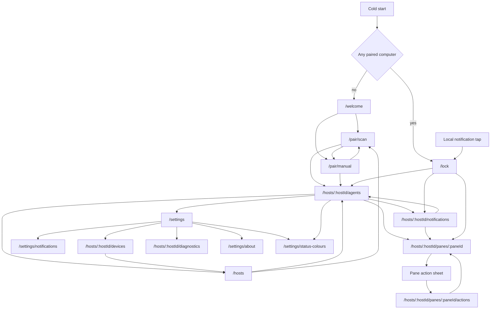
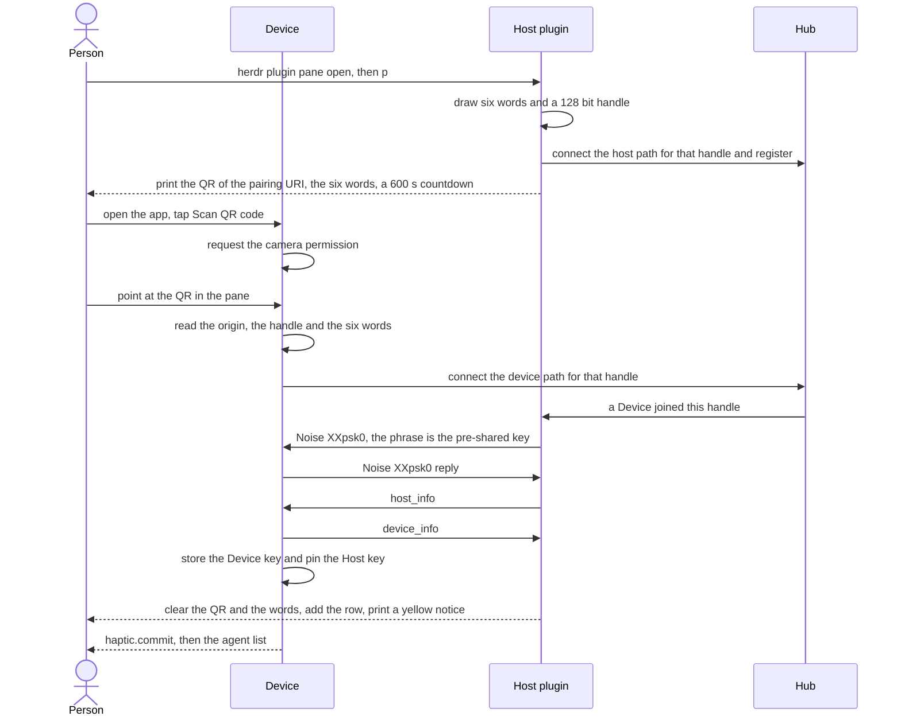
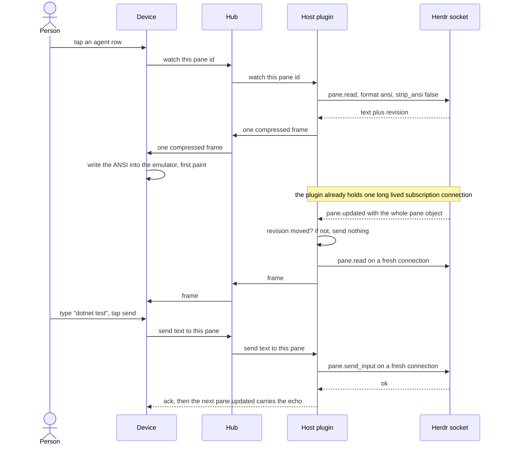
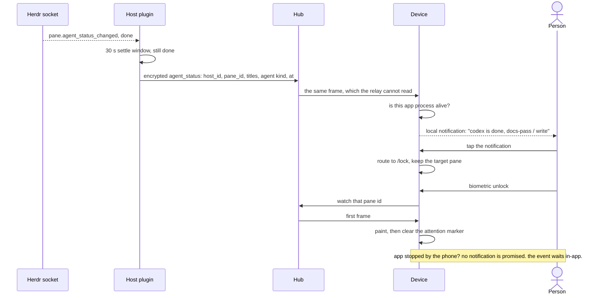
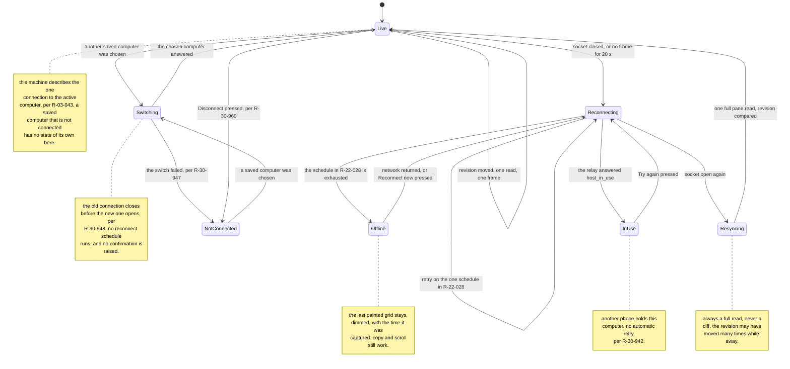
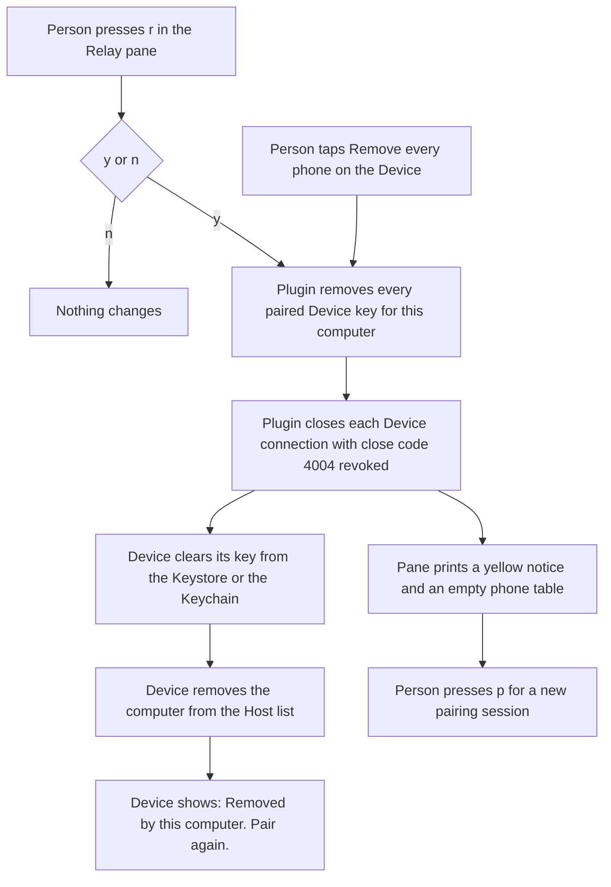

# 30 - User experience specification

This document is normative. It decides. Where a table compares options, the verdict line under
it is the rule. Every value here is exact: no ranges, no "roughly".

`docs/32-design-language.md` is the single source of truth for every visual value: colour, type,
spacing, radii, elevation, borders, opacity, sizes, icons, motion and component anatomy. This
document owns the screens, the flows, the interaction model, the states, the haptics and the
accessibility behaviour. It MUST NOT hold a hex value, a type size, a spacing number or an icon
name. Where a rule here needs a value, it cites the rule in `docs/32-design-language.md` that holds
that value.

The app is Flutter on Android and iOS. `docs/20-mobile-framework.md` owns the SDK version and
`docs/21-terminal-rendering.md` owns the terminal emulator package. This document names Flutter
API identifiers where that makes a requirement unambiguous, and states every requirement on the
terminal widget in behavioural terms, so a package change costs nothing here.

Three roles appear throughout: **Host** is the machine that runs Herdr and the plugin, **Hub** is
the hosted relay, **Device** is the phone.

- **R-30-001** The interface MUST use the word `computer` for a Host and `phone` for a Device.
  `Host`, `Hub` and `Device` are document words and MUST NOT appear in the interface. This rule
  binds interface copy, which means the words a person reads on the screen. It does not bind
  specification prose. A state row, a callout or a rule that names the `Host in use` condition to
  an implementer is document text and stays as it is, while the words that reach the screen come
  from `R-30-940`.
- **R-30-002** Every screen MUST define a loading, an empty, an error and an offline state. A
  screen whose mockup file lacks one of the four is incomplete.
- **R-30-003** The app MUST NOT show a spinner that covers a screen which already holds real
  data. The stale data stays, and the new state is announced in a strip.
- **R-30-004** A skeleton or a spinner MUST appear only after 150 ms of waiting, so a fast
  response never flashes.
- **R-30-005** The app MUST NOT use a modal dialog except to confirm a destructive action, or for
  one of the three terminal states that end the person's work in a pane, `pane gone`, `read failed`
  and `protocol mismatch`, per `R-03-119` and `docs/31-mockups/08-terminal.md` `R-31-08-27`
  (amended 2026-09-10). Every other choice is a bottom sheet, a strip, or an inline control.

## Page inventory

| # | Screen | Route | Purpose | Entry | Exit | Mockup |
| --- | --- | --- | --- | --- | --- | --- |
| 01 | First run and welcome | `/welcome` | Explain the product in three steps and start pairing | Cold start with zero paired Hosts | `/pair/scan`, `/pair/manual` | `31-mockups/01-welcome.md` |
| 02 | Pair a Host by QR scan | `/pair/scan` | Read the pairing QR from the Relay pane | `/welcome`, `+` on `/hosts` | `/hosts/:hostId/agents`, `/pair/manual` | `31-mockups/02-pair-scan.md` |
| 03 | Pair by phrase, entered by hand | `/pair/manual` | Enter the relay address and the six word phrase by hand | `/welcome`, `/pair/scan` | `/hosts/:hostId/agents`, `/pair/scan` | `31-mockups/03-pair-code.md` |
| 04 | Biometric lock | `/lock` | Gate the app behind the platform biometric | Resume after 120 s, cold start with a paired Host, notification tap | The route that was open, else the agent list | `31-mockups/04-lock.md` |
| 05 | Host list | `/hosts` | Choose a computer, add one, forget one | Host chip in the app bar | `/hosts/:hostId/agents`, `/pair/scan` | `31-mockups/05-host-list.md` |
| 06 | Agent list, the landing screen | `/hosts/:hostId/agents` | Answer, which agent needs me | App start with a paired Host, `/hosts`, pairing success, bottom navigation | Terminal, pane actions, `/hosts`, settings, `/settings/status-colours` (added 2026-09-09 per `R-03-112`); the app bar holds `Status colours` and search, in that order, per `R-03-112` and `R-03-102`; the create control is the floating action button of `R-30-041` on both platforms, and the list reserves no fixed band for it (corrected 2026-09-10 per `R-03-109`) | `31-mockups/06-agent-list.md` |
| 07 | Notifications | `/hosts/:hostId/notifications` | List the agent status changes of this session and let a person read, remove or open them | Bottom navigation, the `pane closed` case of `R-30-511` | Terminal | `31-mockups/07-notifications.md` |
| 08 | Terminal view | `/hosts/:hostId/panes/:paneId` | Render one pane at full fidelity | Agent list row, notification row, notification tap | Back to the caller, pane actions | `31-mockups/08-terminal.md` |
| 09 | Terminal input bar | part of `/hosts/:hostId/panes/:paneId` | Edit terminal input and supply keys absent from the phone keyboard | The bar stays visible on the terminal view | The key panel (opened by `+`), per R-03-133 | `31-mockups/09-key-row.md` |
| 10 | Pane action sheet | modal on `/hosts/:hostId/panes/:paneId` | Open plugin actions, split right or down, close the pane, read the last lines aloud; amended 2026-09-14 per `R-03-134` | Terminal overflow or long press on an agent row | Plugin actions, new pane after split, or caller | `31-mockups/10-pane-actions.md` |
| 11 | Agent prompt composer, retired 2026-09-09 per `R-03-101` | none; was `/hosts/:hostId/agents/:agentId/prompt` | none; a person types to the agent in the pane, per `R-03-054` | none | none | `31-mockups/11-prompt-composer.md`, kept as the record of its rule ids |
| 12 | Notification settings | `/settings/notifications` | Choose what earns a local notification and when | `/settings` | `/settings` | `31-mockups/12-notifications.md` |
| 13 | Connection status and diagnostics | `/hosts/:hostId/diagnostics` | Show which leg is broken and prove compression works | `/settings`, any offline strip | The caller | `31-mockups/13-connection.md` |
| 14 | Paired Device management | `/hosts/:hostId/devices` | List phones, open one, remove one, remove every one | `/settings` | `/hosts` after a revoke, `/welcome` when none is left, else `/settings` | `31-mockups/14-devices.md` |
| 15 | Settings: appearance, haptics, this phone's name, relay address | `/settings` | Set theme, terminal text size, haptics, this phone's name and the relay address | Bottom navigation | Notifications, devices, diagnostics, about | `31-mockups/15-appearance.md` |
| 16 | Host plugin popup pane | not a route, Herdr popup pane entrypoint `relay` | Show the QR and the six words, list phones, pair, remove all, stop | `herdr plugin pane open`, or a `config.toml` key | `q` or `esc` | `31-mockups/16-host-popup.md` |
| 17 | Create menu | sheet on `/hosts/:hostId/agents` | Create a space or tab only, per `R-03-134` | Create control, per `R-33-034` | Dismiss and remain on `Agents` | `31-mockups/17-create.md` |
| 18 | Host actions | `/hosts/:hostId/panes/:paneId/actions` | Show the computer's plugin actions as buttons, scoped to the pane on screen | The `Plugin actions` row of the pane action sheet, per `R-31-18-01` (amended 2026-09-09 per `R-03-055`) | Back to the terminal | `31-mockups/18-actions.md` |
| 19 | About: version and licences | `/settings/about` | Show the app version, the Herdr protocol this build targets and the licence list | `/settings` | `/settings` | `31-mockups/19-about.md` |
| 20 | Status colours | `/settings/status-colours` | Explain the colour of every state bar: one row per state, the states that share a hue together (added 2026-09-09 per `R-03-106`) | `/settings` | `/settings` | `31-mockups/20-status-legend.md` |

Row 11 is retired (2026-09-09, `R-03-101`): the live terminal of `R-03-054` is the prompt, so no
route carries `:agentId` any more. The row stays so that `R-30-020` holds for the retired mockup
file, which stays as the record of its rule ids.

- **R-30-020** Every screen in this table MUST have a mockup file, and every mockup file MUST
  appear in this table. A change to one MUST change the other in the same commit.
  The table holds one row per screen, not one row per route. A child route that is a variation of
  a screen, rather than a screen of its own, MUST NOT take a row, because a row would then demand
  its own mockup file under the sentence above. `/settings/about/licences` and
  `/settings/about/licences/:package` are the worked example: they are the licence surface of
  screen 19, and `docs/31-mockups/19-about.md` documents both inside that screen.
- **R-30-021** The app MUST hold exactly three bottom navigation destinations: `Agents`,
  `Notifications` and `Settings`. A fourth destination is not permitted. Decided 2026-09-04 by the
  product owner, after a live review of the Android build: `Notifications` replaced `Panes`. The
  `Panes` tree was a weaker copy of the `Workspace` axis of `docs/31-mockups/06-agent-list.md`, and
  the agent status changes had no list of their own. `docs/31-mockups/07-notifications.md` owns the
  new destination.
- **R-30-022** The terminal view MUST hide the bottom navigation, because a terminal needs every
  row it can get.
- **R-30-023** The app MUST NOT add a screen that lists Herdr features the phone cannot drive.
  Version one reads panes, sends input, sends prompts and manages access. Nothing else.
- **R-30-024** Every mockup file MUST carry an `## Accessibility` section that cites, for that
  screen, the touch target rule, the contrast rule, the screen reader labelling rule and the focus
  order rule. A mockup without that section is incomplete.
- **R-30-025** The relay address MUST NOT get a route of its own. It lives as a row and a sheet on
  `/settings`, because a person sets it once and reads it rarely. A separate screen for one value is
  a screen nobody finds.

## Navigation model

- **R-30-030** A notification tap MUST route through `/lock` and MUST keep the target pane, so
  the unlock lands on the pane the notification named.
- **R-30-031** Back from the terminal view MUST return to the route that opened it, never to a
  fixed route.

The three destinations match the owner's own words one to one:

| Owner's words | Destination | Route |
| --- | --- | --- |
| "an agents pane that shows agent sessions with statuses" | `Agents` | `/hosts/:hostId/agents` |
| "a list of agent status changes with clear, easy actions" (2026-09-04) | `Notifications` | `/hosts/:hostId/notifications` |
| "a settings page" | `Settings` | `/settings` |

The owner's first words also named "a connection page which shows the spaces, tabs and panels".
That page was the `Panes` destination until 2026-09-04. The `Workspace` axis of the agent list now
shows the same hierarchy, with the desktop's own names, so the separate page is gone (`R-30-410`).

## Platform chrome interaction rules

`docs/33-platform-chrome.md` owns the per-platform chrome components and their
appearance. This section owns the interaction rules that decide which control
appears where and what it may do. It MUST NOT hold a visual value or a platform
mechanism.

- **R-30-040** The app MUST present the platform's own navigation control and
  the platform's own create control, per `R-33-033` and `R-33-034`.
- **R-30-041** The create control MUST be the same control on both platforms: Material's floating
  action button on the `Agents` screen, `add` glyph, spoken `New`, per `R-33-034`. The app MUST
  NOT draw a create action in the app bar on either platform, and a list MUST NOT reserve a fixed
  band of empty space at its end for the button: a list that fits the screen ends at its last
  row, and a list that overflows scrolls its last row clear of the button through the scroll
  view's own end padding only, per `R-03-109`. (Amended 2026-09-09 by the product owner, per
  `R-03-109`: until then Android drew a `FloatingActionButton` above the navigation bar and iOS a
  `+` in the app bar, and the divergence was stated on purpose; that day the control moved into
  the app bar on both platforms. Corrected 2026-09-10 by the owner, per the corrected `R-03-109`:
  the floating button stays on both platforms and only the band goes.)
- **R-30-042** The app MUST NOT present a control that the platform does not
  have. The worked example was a `FloatingActionButton` on iOS, per `R-33-033`; since 2026-09-10
  that button is the one create control on both platforms, per `R-30-041`, because iOS now floats
  its own primary action too, so the example is the Material `Slider` of `R-03-110`, which MUST
  NOT appear on iOS in place of `CupertinoSlider`.
- **R-30-043** A translucent surface MUST honour the platform Reduce
  Transparency and Increase Contrast settings, per `R-33-051` and `R-33-052`.
- **R-30-044** The terminal grid MUST NOT be restyled by a platform theme or a
  wallpaper colour. The grid uses the Selenized palette on both platforms,
  always, per `R-30-153`. `R-33-055`, `R-33-057` and `R-33-060` own the
  isolation mechanism that keeps the grid independent of the chrome material
  and the wallpaper-derived palette.
- **R-30-045** A pushed detail route MUST keep the bottom navigation on screen. Five screens are
  pushed from a bottom destination: `/settings/notifications`, `/hosts/:hostId/diagnostics`,
  `/hosts/:hostId/devices`, `/settings/about` and, since 2026-09-09 per `R-03-106`,
  `/settings/status-colours`, which the `Agents` app bar also pushes since 2026-09-09 per
  `R-03-112`, so it keeps the bar from both destinations. A person who pushed one of them has not
  left the destination they were in. Hiding the bar there removes the other two destinations and the
  attention badge of `R-30-501` at the same time, which turns a detail screen into a dead end. Two
  exceptions are already stated elsewhere: the terminal view hides it, per `R-30-022`, because a
  terminal needs every row it can get; and a modal covers it, because a modal is the pattern for a
  task that owns the screen until it ends.
  Amended 2026-09-09: every bottom sheet MUST use the root navigator to cover the connection strip
  and the tab bar. The owner rejected leaving the strip visible below a sheet.
  `docs/33-platform-chrome.md` owns the control, which is the `CupertinoTabBar` on iOS and the
  Material `NavigationBar` on Android. This rule owns only whether it stays. A third exception
  existed from 2026-09-03 to 2026-09-08 and returned on 2026-09-09 per `R-03-055`: the pane-scoped
  actions route `/hosts/:hostId/panes/:paneId/actions`, pushed on top of the terminal on the root
  navigator, so it shares the terminal's own exception. `/hosts/:hostId/actions` is retired since
  2026-09-09 (`R-31-18-01`).

## Design system

`docs/32-design-language.md` holds the token catalogue: the Selenized source values, the Herdr
brand fixed palette, the 16 ANSI slots, the measured contrast table, the type scale, the spacing
scale, the radii, the elevations, the border widths, the opacities, the sizes, the icon map, the
motion set and the anatomy of every component. This section keeps the rules that decide where a
token applies and what a screen may not do. Each one cites the rule that holds the value.

### Naming rule

- **R-30-100** A token name is `category.role` or `category.role.variant`, lower case, dot
  separated, with `snake_case` inside a segment. Examples: `color.bg.base`,
  `color.term.ansi_9`, `type.body.strong`, `motion.duration.fast`.
- **R-30-101** Dart code MUST expose one class per category and MUST name the member as the
  token with the dots removed and the following letter capitalised. `color.bg.base` becomes
  `AppColor.bgBase`. `type.body.strong` becomes `AppType.bodyStrong`.
- **R-30-102** A widget MUST NOT hold a colour literal, a font size literal, a padding literal,
  a radius literal, or a duration literal. Every value comes from a token. A review MUST reject
  a hex string or a bare number outside the token files.
- **R-30-103** A new value MUST be added to `docs/32-design-language.md` as a token first, and used
  second, per `R-32-005`. A one-off override in a widget is not permitted.

### Colour and theme

Chrome and terminal draw from two separate sources since `R-32-104`: chrome from the Herdr brand
(ink/paper fixed palette), terminal and `color.status.*` from Selenized. `R-32-100` and
`R-32-103` hold every value and its source. `R-32-110`, `R-32-120`, `R-32-130` and `R-32-140` hold
the four ramps: surfaces and borders, text and accent, state hues, and the terminal slots.

- **R-30-110** Every colour token MUST hold a value in the dark theme and a value in the light
  theme. A token with one value only is a defect, per `R-32-011`.
- **R-30-111** The app MUST NOT use pure black or pure white for a Selenized-sourced value: the
  terminal and `color.status.*`, per `R-32-100`. Neither Selenized variant supplies either one,
  which enforces this by itself. Chrome moved to the Herdr brand fixed palette, per `R-32-103`,
  which uses the Ink ground `#17171a` and Paper ground `#efece5`; using a real source value as
  published is not a violation of this rule. See `R-32-017`.
- **R-30-112** The app MUST offer exactly three theme modes, `System`, `Light` and `Dark`, and
  `System` MUST be the default and MUST follow the operating-system setting without a restart. Both
  themes are complete and first class; the light theme is never produced by inverting the dark one
  at run time. `R-32-010` to `R-32-013` hold the mechanism, and `31-mockups/15-appearance.md` owns
  the control.
- **R-30-120** `color.fg.disabled` MUST NOT carry meaningful text. It falls below the 4.5 to 1
  requirement of WCAG 2.2 success criterion 1.4.3 on every surface, as `R-32-150` measures. It is
  permitted for a disabled control and a placeholder, both of which that criterion exempts as
  inactive. See `R-32-123`.
- **R-30-121** Exactly one filled control type exists, and its fill is `color.accent.primary` with
  the label in `color.fg.on_accent`, per `R-32-525`. Chrome moved to the Herdr brand fixed palette,
  per `R-32-103`, and `R-32-126` measures exactly one chrome fill that clears 4.5 to 1 with
  `color.fg.on_accent` as the label today: `color.accent.primary` itself. A filled destructive
  control is not available to chrome, unchanged from before the source moved; `R-32-527` records
  the separate, non-contrast reason version one would refuse it even if it existed.
- **R-30-130** A status hue MUST NOT carry text, as a consistency policy, per `R-32-131`. The Herdr
  brand state hues (blocked/error red, working/warning yellow, idle/ok green, done teal, info
  spot) clear the 3.0 indicator floor on all three surfaces in both themes, per `R-32-132`. The
  policy covers every hue on every surface, not only the combinations that fail. A status hue is
  therefore permitted only in an icon, a border, a bar, or a fill behind `color.fg.on_accent` (the
  dot left this list on 2026-09-09, per `R-03-100`).
- **R-30-131** Yellow is now the working/warning hue in the Herdr brand. Selenized light yellow
  still misses the indicator floor on `color.term.bg` at 2.98, per `R-32-133`. The brand yellow
  (`#e6b84a` dark, `#9a6f08` paper darkened) clears 3.0 on all three chrome surfaces in both
  themes. Yellow remains in the terminal palette, where the rules of the remote program apply,
  not ours.
- **R-30-132** `color.status.warning` and `color.status.blocked` share the red hue on purpose. A
  blocked agent is a warning. The icon and the label separate them.
- **R-30-133** A status hue is permitted on all three chrome surfaces (`color.bg.base`,
  `color.bg.raised`, `color.bg.high`), per `R-32-132`, which confirms every state hue clears the
  3.0 indicator floor on all three. A status hue MAY now appear inside a key cap, on the jump
  pill, or on any other control `color.bg.high` fills. This is a permission, not a requirement.

### Treatments

A treatment is a named composition, so a screen can name one instead of naming a colour that would
fail contrast. `R-32-506` holds the four compositions. Code MUST expose each as one widget.

| Token | Use |
| --- | --- |
| `treat.ok` | A success word, a healthy leg, a connected state |
| `treat.warning` | A warning line, a strip, the `host_in_use` banner, an expiring countdown |
| `treat.error` | A failure message and a failure strip |
| `treat.destructive` | A destructive action label |

- **R-30-140** A message, a state word, or a destructive label MUST use a treatment, never a bare
  status colour.
- **R-30-141** A treatment MUST carry both an icon and a label. Colour alone MUST NOT convey a
  state, per WCAG 2.2 success criterion 1.4.1. A state bar carries no icon: its non-colour signal
  is the state word beside it (amended 2026-09-09 by the product owner, per `R-03-100`).
- **R-30-142** An inline count badge MUST NOT be a filled pill. It is an icon in the status hue
  followed by the count in `color.fg.primary`, per `R-32-518`. A filled pill would put text on a
  hue, which `R-30-130` forbids. The badge on the `Notifications` destination is exempt: it MUST be
  the platform's own tab badge, the filled red circle with a light count that both platforms draw,
  with the destination glyph in its normal ink (amended 2026-09-09 by the product owner, per
  `R-03-059`; before that date the destination drew the inline badge with a recoloured bell, which
  neither platform does). `docs/32-design-language.md` section 7.5 owns both badges' values.
- **R-30-143** A destructive label MUST NOT be red text, per `R-30-130`'s status-hue policy:
  `color.status.error` individually clears 4.5 to 1 as ink in both themes on every surface today,
  as `R-32-150` measures, so this is the same consistency reason as every other status hue, not a
  contrast failure specific to red. `treat.destructive` carries the red in the icon and the bar
  instead. The rejected alternative is the iOS convention of red destructive text. A red **fill**
  is measurably available: `color.status.error` with `color.fg.on_accent` as the label measures
  5.53 in dark and 4.74 in light, per `R-32-150`. It is not a chrome fill, per `R-32-103`'s class
  split, only a semantic hue that happens to support this label, and `R-32-527` refuses it for a
  separate reason regardless: a red fill on a phone reads as an alert the person did not raise.

### Terminal palette

`R-32-140` holds the 16 ANSI slots, the background, the foreground, the bold foreground, the dim
foreground, the cursor and the selection background, in both themes. It also records the one
deviation from the published Selenized mapping, in `R-32-141`, and the one accepted failure, in
`R-32-142`.

- **R-30-150** The emulator MUST be configured with exactly the slots and defaults that `R-32-140`
  lists. It MUST NOT fall back to a package default palette, and MUST NOT leave a slot unset.
- **R-30-151** The default terminal foreground on the terminal background clears WCAG 2.2 success
  criterion 1.4.3 in both themes, and so do the bold foreground and the cursor. `R-32-143` holds
  the three measured pairs. These three are the app's choice, not the program's, which is why the
  text threshold applies to them.
- **R-30-152** WCAG contrast MUST NOT be applied to a colour the remote program chose. A program
  that prints dark grey on black is producing that result on the computer too, and the phone's
  job is fidelity. The app MUST NOT correct, boost, or remap a colour the pane emitted.
- **R-30-153** The app MUST render 24 bit truecolour SGR exactly as received. Truecolour output
  is confirmed present in real agent panes. See `R-02-014`.
- **R-30-154** The app MUST NOT offer a user choice of terminal colour scheme in version one.
  One scheme per theme, and it follows the app theme. `R-32-015` owns what happens to a painted
  grid when the theme changes.

### Terminal grid measurement

- **R-30-155** The grid size MUST be reported exactly, as `columns x rows`, for example `144x50`.
  A tilde, an `about`, or any other hedge is not permitted. Columns come from `rect.width` in
  `pane.layout`, whose rects are measured in character cells, proven because the pane widths in
  every tab sum exactly to the area width, for example 22 plus 61 plus 61 equals 144. Rows come
  from `scroll.viewport_rows`. See `R-10-024`.
- **R-30-156** Rows MUST NOT be taken from `rect.height`. The measured difference between
  `rect.height` and `viewport_rows` was 2 in every split tab and 0 in a single pane tab, so tab
  chrome is included conditionally and is not safely subtractable.
- **R-30-157** The app MUST treat `pane.read` output as a pre-rendered flat grid and MUST NOT run
  a VT state machine beyond painting SGR. Across all 14 live panes the payload held 3972 escape
  sequences, every one of them SGR, with no cursor motion, no erase, no scroll region, no OSC and
  no mode switch, even for a full screen TUI on the alternate screen. Herdr already ran the state
  machine. See `R-02-018`.
- **R-30-158** The measured SGR vocabulary is exactly `0`, `1`, `2`, `3`, `4`, `38;2`, `48;2`,
  `38;5` and `48;5`. The app MUST count any parameter outside that set and MUST show the count on
  `31-mockups/13-connection.md`, where the expected value is 0. A non zero count means Herdr
  changed upstream and rendering is about to break silently.
- **R-30-160** The column count is known, not inferred. Any document, comment, or interface string
  that calls it an estimate is wrong and MUST be corrected. The superseded claim was
  `R-02-017`.

### Type

Two families, one superfamily each for its job. `R-32-200` holds the interface faces, their files
and their licence, and `R-21-011` holds the monospace family. `R-32-202` holds the fourteen type
tokens with their exact size, line height, weight and letter spacing.

- **R-30-200** The app MUST bundle both families as assets. It MUST NOT download a font at run
  time. `R-21-011` owns the substitution rule for the terminal family. `R-32-200` names the
  interface faces and their files and states the licence, and `R-21-011` names the monospace
  family.
- **R-30-201** The interface MUST NOT use Inter, Roboto, Open Sans, or a platform default sans.
- **R-30-202** The app MUST bundle exactly the two IBM Plex Sans faces that `R-32-200` names, and
  MUST synthesise nothing else. Two faces cover every interface token, and every extra face costs
  bundle size for a difference nobody reads at the smallest token size.
- **R-30-210** `type.mono.terminal` is the only token whose size the user can change. `R-32-208`
  fixes the permitted sizes and the default, and this document keeps ownership of the rule that
  there is one changeable token and one closed list. The line height comes from the ratio that
  `docs/21-terminal-rendering.md` fixes in `R-21-010`, applied as `R-32-209` states, and this
  document MUST NOT restate that ratio.
- **R-30-211** The app MUST NOT offer a continuous font size slider. A closed list covers every
  real need and keeps the grid measurement testable.
- **R-30-212** A monospace token MUST NOT be used for a sentence, and a sans token MUST NOT be
  used for a path, an id, a raw error, or terminal content.
- **R-30-213** Letter spacing is 0 on every token except the upper case section header token, as
  `R-32-204` states. A pairing word is read, not spelled out, so `type.mono.phrase` MUST NOT be
  tracked out.

### Spacing, radii and elevation

`R-32-300` holds the spacing scale, `R-32-301` states which step applies where, `R-32-310` holds
the radii and `R-32-320` holds the elevations.

- **R-30-230** Every screen MUST use one screen edge inset, the step `R-32-301` fixes. The terminal
  grid is the one exception and MUST meet the screen edge, because a terminal column has to.
- **R-30-231** The gap between two rows in a group MUST be zero and the gap between two groups MUST
  be the group step in `R-32-301`. Rhythm comes from the group gap, not from a gap on every row.
- **R-30-232** A value outside the scale in `R-32-300` is not permitted. `space.7` does not exist.
- **R-30-250** The terminal grid MUST use `radius.none`. A rounded terminal clips a real cell.
- **R-30-260** Separation MUST come from `elev.1` first. A shadow is permitted only on a floating
  layer, as `R-32-320` states: a bottom sheet and a dialog at `elev.3`, an autocomplete strip, the
  create control and the snackbar at `elev.2` (amended 2026-09-09, per `R-03-109`, when the
  create control left the list with the floating action button; restored 2026-09-10, per the
  corrected `R-03-109`; the floating action bar had already gone with `R-32-538`).
- **R-30-261** The app MUST NOT use a decorative blur, a hand-rolled
  translucent surface, a glow border, or a gradient. The one exception: a
  platform standard component MAY draw its own translucency, on a chrome
  surface that `docs/33-platform-chrome.md` requires. `R-33-012` owns the iOS
  chrome surface list, and the plain `cupertino_ui` bar and sheet widgets are
  translucent by themselves. The distinction that decides a review is
  standard-component against hand-rolled, not glass against not-glass.
  Version one ships no Liquid Glass, so the app MUST NOT approximate it by
  any means, per `R-33-013`, and `R-33-069` owns what the app adopts when
  `cupertino_ui` ships the official material. A translucent surface MUST
  NEVER be applied over or behind the terminal grid, per `R-33-055`. The
  opaque variant of `R-33-068` is a user preference, not a fallback, and it
  is reachable only from `R-33-051` and `R-33-052`. The prohibition on a
  gradient and a glow border is unchanged.

### Motion

`R-32-600` holds the duration tokens, the curve tokens and the purpose of each one.

- **R-30-270** A press feedback MUST use `motion.duration.fast`. A route change, a sheet and a
  dialog MUST use `motion.duration.base`. A large surface that a person meets a few times a day
  MUST use `motion.duration.slow`. Bank two of the key row is not one of them: it opens tens of
  times a day, so it MUST open and close with no motion, because a size change would move the
  terminal grid (`R-31-09-24`; amended 2026-09-10 per `R-03-116`, where this clause moved off the
  retired Shortcuts palette onto bank two).
- **R-30-271** The app MUST NOT use an overshoot curve. `R-32-605` names every forbidden one. An
  overshoot on a developer tool reads as a toy.
- **R-30-272** The terminal grid MUST NOT animate. A repaint is instant. Any fade, slide, or
  cross dissolve on pane content is a defect, because it makes the person doubt what they read.
- **R-30-273** A list MUST NOT animate a reorder while a finger is down. See `R-31-06-05`. A status
  badge MUST NOT animate at all, per `R-32-601`.
- **R-30-274** (added 2026-09-09 by the product owner, per `R-03-108`) Motion MUST be the
  platform's own physical motion, and the app MUST NOT invent motion of its own. A sheet is the
  platform's draggable sheet and follows the finger. A pushed route is the platform's route with its
  interactive back gesture, per `R-33-070`. The `Priority` / `Workspace` axis switch follows
  `R-30-415`. Press feedback answers on pointer-down, per `R-32-609`. The only continuous animation
  is the two pulses of `R-32-601`. Reduced motion is honoured everywhere, per `R-32-606`. A screen
  that needs a movement this document does not name MUST use the platform's own component for it,
  and MUST NOT add a curve or a duration to `docs/32-design-language.md` section 8 to get it.

### Haptics

Every value maps to a `HapticFeedback` static method that exists in the Flutter services
library.

| Token | Flutter call | Fires on |
| --- | --- | --- |
| `haptic.select` | `HapticFeedback.selectionClick()` | A key row press, a list selection change, a stop of the terminal text size slider (amended 2026-09-09, per `R-03-110`: was a stepper step) |
| `haptic.confirm` | `HapticFeedback.lightImpact()` | Input accepted, a toggle flipped, a copy done |
| `haptic.commit` | `HapticFeedback.successNotification()` | A pairing succeeded, a pane action applied, a prompt sent |
| `haptic.alert` | `HapticFeedback.heavyImpact()` | An agent reached `blocked` while the app is open |
| `haptic.error` | `HapticFeedback.errorNotification()` | A wrong word, a failed send, a rejected biometric |

- **R-30-280** `haptic.commit` MUST use `successNotification` and `haptic.error` MUST use
  `errorNotification`. Both methods exist in the Flutter SDK that `docs/20-mobile-framework.md`
  pins. This was checked twice: in the published API page for `HapticFeedback`, and in the
  `HapticFeedback` source on the Flutter `stable` branch, which declares `successNotification`,
  `warningNotification` and `errorNotification`. Both sources are listed under `## Sources`.
- **R-30-284** Retired. The Android floor is now API 33, per `docs/20-mobile-framework.md`.
  `HapticFeedback` notification methods are available on every supported device. The
  behavioural result, that no fallback is needed because a haptic carries no
  information alone, still holds under `R-30-282`.
- **R-30-285** `haptic.alert` MUST stay `heavyImpact` and MUST NOT become `warningNotification`. It
  is the one haptic that fires for an event the person did not cause, per `R-30-283`, so it MUST
  feel unlike the two notification haptics that answer a press.
- **R-30-281** The `Haptics` setting off MUST silence every token, including `haptic.error`.
- **R-30-282** A haptic MUST accompany, never replace, a visible change. A person with haptics
  off MUST lose no information.
- **R-30-283** The app MUST NOT fire a haptic for an event the user did not cause, except
  `haptic.alert`.

### Touch target and layout

- **R-30-290** Every interactive element MUST present a touch target of at least 48 by 48 logical
  pixels. Android publishes 48dp by 48dp as its recommended minimum, and Apple publishes 44 by 44
  points as the **default** control size with 28 by 28 points as the **minimum**. So 48 satisfies
  Android's recommendation and exceeds Apple's default, and one number covers both platforms. A rule
  that calls 44 the Apple minimum states a wrong reason for a right number. `R-32-360` holds the
  sources. One measured exception: a control inside the iOS navigation bar is 48 wide and the
  bar's 44 high, per `R-33-076`.
- **R-30-291** A visual element MAY be smaller than its target. A chevron sits inside a 48 target.
  A state bar is not interactive at all. `R-32-361` holds the sizes.
- **R-30-292** Two adjacent targets MUST be separated by at least `space.1`, and a bezelled control
  MUST carry the horizontal padding that `R-32-301` fixes.
- **R-30-293** Content MUST be left aligned. Centring is permitted only on `/lock` and on a
  single full width button label, because those hold one thing.
- **R-30-294** A card MUST NOT contain a card. Grouping is done with a divider and a group gap.
- **R-30-295** The app MUST respect the safe area on every edge, and MUST let the terminal grid
  reach under a display cutout while keeping the system gesture insets clear.
- **R-30-519** Every screen that raises the software keyboard MUST follow one behaviour and MUST NOT
  invent its own. The terminal composer and the app's native text fields raise it, per `R-03-130`.
  - **The inset.** The app MUST read the keyboard inset through
    `MediaQuery.viewInsetsOf(context).bottom`. That value is the part of the display the keyboard
    fully obscures. `R-22-077` reads `MediaQuery.viewPaddingOf` for the system navigation bar, which
    is a different measurement: `viewPadding` ignores the keyboard, so it can never lift a control
    above one. A screen MUST use the per-aspect getter, never `MediaQuery.of`, so it rebuilds when
    that one value changes and not on every metric.
  - **What moves.** The focused input, and any control bound to it such as a send control or the key
    row, MUST stay above the inset. Everything above them scrolls. A secondary list, such as a
    recent-prompt list or a second bank of symbol keys, MUST yield first: it scrolls away or it
    collapses. The app MUST NOT shrink the input to make room for a list.
  - **The focused input stays visible.** A focused input that holds text MUST stay fully visible.
    The keyboard MUST NOT cover it, and a scroll MUST NOT carry it off screen while it holds the
    focus. A person who cannot see the typed text sends the wrong thing.
  - **At the maximum text scale.** At the clamp of `R-30-701`, a fixed row of targets at the floor
    of `R-30-290` no longer fits a narrow phone. The row MUST become scrollable across the screen
    and MUST keep a named essential subset visible, or it MUST wrap to a second line. It MUST NOT
    shrink a target, per `R-30-741`, and MUST NOT clip a label, per `R-30-703`. Each screen names
    its own essential subset, because only that screen knows which key it cannot lose.

  This rule decides the behaviour. It MUST NOT decide one screen's layout.

### Swipe to reveal actions

The app uses `flutter_slidable` 4.0.3, MIT, for every swipe-to-reveal interaction. `Dismissible`
MUST NOT appear anywhere in the app, because its only behaviour is dismiss-on-swipe and its
background decoration is non-interactive. An implementer who sees `Dismissible.background` in the
SDK might otherwise assume it can hold action buttons, so the prohibition is stated here rather
than left implicit. `docs/20-mobile-framework.md` owns the dependency version and
`docs/32-design-language.md` owns the action pane anatomy and the icon-plus-label rule that each
action MUST carry.

- **R-30-296** A left swipe on a row MUST reveal the trailing action pane and MUST NOT itself
  perform an action. The revealed actions stay on screen until the person taps one, taps elsewhere,
  or scrolls. The swipe is a reveal, never a command.
- **R-30-297** A non-destructive revealed action MUST act on the tap at once, with no dialog. A
  destructive revealed action MUST raise the destructive confirmation dialog that `R-30-005` permits
  on the tap and MUST NOT act before the person confirms. A full swipe MUST NOT bypass that
  confirmation, so `dragDismissible` MUST be `false` on any pane that carries a destructive action.
- **R-30-298** Every revealed action MUST also be reachable without a swipe, as a named custom
  semantics action on the row. `flutter_slidable` exposes nothing to the accessibility tree, so the
  app supplies the semantics itself. `R-32-515` already requires this for the notification list
  and the agent list, and it MUST now also say that the package provides nothing. A screen reader
  user cannot swipe, and an action that has no spoken path does not exist.
- **R-30-299** Only one row MUST hold its actions open at a time. Opening a pane closes any other
  open pane through a shared `Slidable.groupTag`. The app MUST close every open pane before it
  re-sorts a list, and MUST identify a row by a stable row identity, never by its list index. A
  reorder under an open pane detaches the pane from its row, and a pane keyed to an index closes
  the wrong row.
- **R-30-295a** A swipeable row MUST respect the platform gesture inset and MUST NOT sit flush to
  the screen edge, so a row swipe never fights the Android back gesture or the iOS interactive pop.
  This refines `R-30-295`, which already requires the app to respect the safe area on every edge.
  A swipeable row is the one control whose horizontal drag competes with the platform's own edge
  gestures.

## Terminal interaction model

A touch screen and a terminal fit badly. A terminal expects a cursor, modifier keys and a scroll
wheel. A phone has none of them. This section closes every gap with an exact binding.

One principle decides every conflict: **a gesture never sends input to the pane.** Only the key
row and native composer send input, per `R-03-130`. Composer edits send
immediately; the grid shows only Host frames. A stray
keystroke into a running agent is the worst outcome this app can produce, and a gesture is the
easiest thing to trigger by accident in a pocket.

### Gesture table

| Intent | Binding | Sends to the pane |
| --- | --- | --- |
| Raise the keyboard | Tap the native composer or the grid to focus the composer. The tap sends nothing, per `R-03-130` | no |
| Select a word | Double tap on the grid | no |
| Select a line | Triple tap on the grid | no |
| Start a free selection | Long press 400 ms, then drag | no |
| Extend a selection | Drag either selection handle | no |
| Copy | `Copy` in the platform's own edit menu, per `R-21-042`, or a second long press inside the selection | no |
| Select the visible screen | `Select visible screen` in that same edit menu. The item set is exactly two, per `R-31-08-22` | no |
| Scroll the scrollback | One finger vertical drag | no |
| Scroll by a page | Two finger vertical drag | no |
| Jump to the bottom | Tap the `to bottom` pill, or drag to the bottom, which resumes the live follow on its own | no |
| Pan the columns | One finger horizontal drag, only when the grid is wider than the screen | no |
| Change the terminal font size | Two finger pinch. It steps through the seven sizes in `R-30-210` and never lands between them | no |
| Zoom the QR camera | Multiply the gesture-start factor by the cumulative two-finger pinch scale; clamp to the device range, per `R-31-02-13` | no |
| Force a read | Pull down from the top of the grid while already at the bottom | no |
| Move the cursor | The arrow keys in the key row. There is no gesture for this | yes |
| Esc, Tab | The `esc` and `tab` keys in the key row | yes |
| A Control or Alt chord | Tap `ctrl` or `alt`, then one key. A quick second tap within the double-tap window of `R-30-301` locks the modifier, per `R-03-122`. A later second tap releases it. A tap on a locked modifier releases it (amended 2026-09-10 per R-03-122; until then any second tap locked). A tap on the other modifier adds it, so `ctrl` and `alt` hold together and the next key is `ctrl+alt+<key>`, per `R-03-120`. There is no chord list to pick from (amended 2026-09-09 per `R-03-113` item 2: `alt` and the lock are new, per `R-30-300`; amended 2026-09-10 per `R-03-116`: the Shortcuts palette is retired; amended again the same day per `R-03-120`: the second modifier added rather than replaced) | yes |
| Open the key panel | Tap `+` for the key panel (opened by `+`), per R-31-09-24. Opening sends nothing | no |
| A navigation key | `ins`, `home`, `pgup`, `del`, `end`, or `pgdn` from the key panel (opened by `+`) | yes |
| Type text | Edit the native composer. Every edit sends input; return submits and clears the field, per `R-31-09-27` and `R-31-09-28` | yes |
| Auto repeat a key | Hold a key row arrow. It repeats every 40 ms after a 400 ms delay | yes |
| Open the pane actions | Tap the overflow, or long press a row on the agent list | no |

- **R-30-300** No gesture on the grid MUST ever send a byte to the pane. Every send is an explicit
  press of a key, a chord, or an edit in the native composer, per `R-03-130`. A latched or locked
  modifier
  changes what a keystroke sends, never whether one is sent. One tap of `ctrl` or `alt` joins
  the next keystroke as a chord. A quick second tap within the double-tap window of `R-30-301`
  locks the modifier, per `R-03-122`. A later second tap releases it. A tap on a locked
  modifier releases it
  (amended 2026-09-10 per R-03-122; until then any second tap locked).
  A tap on the other modifier adds it, so one keystroke carries both, per `R-03-120`.
  Each keystroke is still one explicit press, per `R-31-09-08`, `R-31-09-19`
  and `R-31-09-23`. Bank two, the key row's one expansion, adds `ins`, `home`, `pgup`, `Left`,
  `Down`, `Right`, `del`, `end` and `pgdn` to the keys it offers, per `R-31-09-24`; no cap in it
  latches a modifier, because `ctrl` and `alt` are both on row one (amended
  2026-09-09 per `R-03-113` item 2; amended 2026-09-10 per `R-03-116`, where these keys moved
  off the retired Shortcuts palette onto bank two, and again the same day per `R-03-117`, which
  laid them out on a six-column grid and deleted the symbol caps: every one of them is on the
  phone keyboard's own symbol pages, so no key of this row types a character).
- **R-30-301** A long press MUST be 400 ms. A double tap window MUST be 300 ms. A triple tap
  window MUST be 300 ms between the second and the third tap.
- **R-30-302** A pinch MUST step to the next permitted size when the scale factor passes 1.15,
  and to the previous size when it passes 0.87. It MUST fire `haptic.select` on each step and MUST
  show the new size in the status strip for `motion.duration.slow`.
- **R-30-303** A three finger gesture MUST be unbound. It is reserved and MUST do nothing.
- **R-30-304** The grid MUST NOT accept a paste. The grid is read-only output rendered from the
  workstation, and the write path is the native composer. Its native paste sends the edit to the
  Host,
  per `R-03-130` and `R-31-09-27`. So the app MUST NOT offer
  `Paste` in the terminal edit menu, MUST NOT bind a paste gesture on the grid, and MUST disable
  `PasteTextIntent`, which `xterm2` binds by default to write straight into the local emulator.
  That default would put text into the grid that never reaches the workstation. It would look like
  it worked, it would break the one-to-one fidelity of `R-31-08-07`, and it would silently lose
  what the person pasted. An absent command is better than one that lies.
- **R-30-305** Copy MUST place plain text on the clipboard, with every escape sequence removed
  and with a trailing space stripped from each line. A person pastes into a chat or an issue, not
  into a terminal. The second menu item is named `Select visible screen`, never `Select all`,
  because it selects the visible screen and not the scrollback, and `Select all` means everything
  on both platforms everywhere else.
- **R-30-306** A vertical drag MUST scroll the local scrollback only. The app MUST NOT translate
  a scroll into an arrow key, a mouse wheel sequence, or an alternate screen scroll.
- **R-30-307** The grid MUST NOT reflow the Host's wrapping at any font size. See `R-31-08-07`.
- **R-30-308** Any gesture the terminal package binds by default that conflicts with this table
  MUST be disabled. The requirements on the widget are behavioural: it MUST accept an ANSI chunk
  written into it, it MUST support a text selection started by a long press and dragged, it MUST
  expose the selected text as a string, and it MUST report its own visible column and row count.
  `docs/21-terminal-rendering.md` owns which API delivers each one.

## Agent status presentation

Herdr reports five states. Two of them, `blocked` and `done`, are the reason a person picks up
the phone.

| State | Meaning | Colour token | Label | Earns attention |
| --- | --- | --- | --- | --- |
| `idle` | The agent is running and waiting for nothing | `color.status.idle` | `Idle` | no |
| `working` | The agent is doing something now | `color.status.working` | `Working` | no |
| `blocked` | The agent is waiting for a person | `color.status.blocked` | `Blocked` | yes |
| `done` | Unseen background work finished | `color.status.done` | `Done` | yes |
| `unknown` | The app cannot tell, usually a lost link | `color.status.unknown` | `Unknown` | no |

`R-32-130` holds the value of each token in both themes, and `R-32-401` holds the icon for each
state. The ASCII mockups write these as `o` for `idle`, `>` for `working`, `!` for `blocked`, `+`
for `done` and `?` for `unknown`.

- **R-30-400** The five states MUST always be shown as the state bar plus a label. The bar carries
  the colour, and the label carries the word. Neither alone is sufficient, per `R-30-141`
  (amended 2026-09-09 by the product owner, per `R-03-100`: the icon is now the bar of
  `docs/32-design-language.md` section 7.29).
- **R-30-401** The five states MUST stay distinct without colour: the word beside the bar names the
  state, and no two states share a word. The bar's shape does not vary by state (amended 2026-09-09
  by the product owner, per `R-03-100`: the five dot shapes, a hollow ring, a circular arrow, a
  raised hand, a tick in a circle and a question mark in a circle, are retired).
- **R-30-402** A status label MUST use `color.fg.primary`. It MUST NOT use the status hue, per
  `R-30-130`.
- **R-30-403** The `working` state MUST animate continuously through its state bar, with the
  pulse `R-32-608` fixes and at the period `R-32-601` names (amended 2026-09-09, per `R-03-100`).
  A state bar MUST NOT rotate. The pulse and the live-connection pulse are the only continuous
  animations in the app, and both MUST hold still at full opacity when the platform reduce motion
  setting is on.
- **R-30-404** The app MUST NOT invent a sixth state, and MUST NOT map an unrecognised state
  string to `idle`. An unrecognised value MUST render as `unknown`.
- **R-30-405** The age beside a status MUST count from the last state change, and MUST be relative,
  for example `4m` or `2h`. The app MUST take that time from `status_at` on the agent object in a
  snapshot, or from `at` on an `agent_status` event. `status_at` is nullable, because
  `docs/10-herdr-integration.md` records no status-change timestamp in the socket API, so the Host
  can only stamp a change it observed while it was running. When it is absent the app MUST draw the
  status with no age. It MUST NOT substitute the snapshot time, the connection time, or the time it
  first saw the row. An invented age is worse than no age, because a person decides whether to pick
  up the phone by how old the state is.

### Grouping axis

The agent list groups rows by one of two axes, chosen with a segmented control that
`docs/32-design-language.md` owns in `R-32-520` and `R-32-521`. `docs/31-mockups/06-agent-list.md`
owns the screen and its wireframes. This section owns the behaviour.

- **R-30-406** The app MUST offer exactly two grouping axes, `Priority` and `Workspace`, in that
  order. `Priority` MUST be the default on first run.
  Note, 2026-09-09 per `R-03-114`: this rule uses Herdr's word `Priority`, not the
  rejected word `Urgency`.
- **R-30-407** The choice and the collapse state of every space header MUST persist per Host
  across a route change and an app restart. A space is keyed by its repository name, or by the
  workspace id when the workspace has no worktree (decided 2026-09-04 by the product owner; before
  that date the key was the workspace header).
- **R-30-408** A workspace or a tab that holds no agent MUST NOT appear on this screen at all.
  This screen shows agents, never an empty branch.
- **R-30-409** In `Workspace` grouping, inside a tab an agent that needs attention MUST sort before
  one that does not. A blocked agent MUST NOT sit at the foot of a long group.
- **R-30-410** In `Workspace` grouping this screen MUST show exactly the Herdr desktop hierarchy,
  with the desktop's names: Space, then Worktree, then Tab, then Pane. Decided 2026-09-04 by the
  product owner, after a live review found the earlier two-tier form hard to read at a glance.
  The worktree tier MUST be omitted when a space holds one workspace that is not a linked
  worktree. The screen MUST NOT nest a pane inside a pane and MUST NOT put an expander on a
  worktree row or a tab row: the split geometry does not help a person on a phone.
- **R-30-411** The grouping control MUST still be shown when the Host reports agents in one
  workspace only. A control that appears and disappears teaches nothing.
- **R-30-412** In `Priority` grouping the four section headers MUST be sticky and MUST NOT be
  collapsible. Collapsing `NEEDS YOU` would hide the answer to the screen's own question.
- **R-30-413** In `Workspace` grouping the space header MUST be collapsible and MUST NOT pin; the
  worktree row and the tab header neither pin nor collapse (decided 2026-09-04 by the product
  owner). Each space is one raised block (`R-32-595`), so the block, not a pinned header, says
  where the person is while the list scrolls.
- **R-30-414** A collapsed workspace header that holds an agent needing attention MUST still show
  the attention badge, so attention can never hide inside a closed branch. This mirrors the
  attention badge that `R-32-566` keeps on a collapsed row.
- **R-30-415** (added 2026-09-09 by the product owner, per `R-03-108`) The axis switch MUST be
  physical. On Android the two axes are the two pages of a `TabBarView` behind the segmented
  control: a horizontal drag on the list body tracks the finger one-to-one, hands its velocity to
  the platform's page physics on release, and the segmented control follows the page. A tap on the
  control moves the page the platform's own way. The row swipe of `R-30-296` keeps its priority on
  the row that carries it, so the axis drag starts on a row without a revealed action, on a header
  or on the ground. On iOS the segmented control switches the axis with the platform's own
  transition, and the body takes no axis drag: `R-03-108` names the page physics for Android only,
  and a body drag on iOS would compete with the interactive pop of `R-33-070`. Neither platform
  takes a curve or a duration from `docs/32-design-language.md` section 8; `R-32-600` records that.
  `R-30-407` still saves the chosen axis per Host, whichever gesture chose it.

### Attention, badges and local notifications

Attention is one concept with three surfaces: a badge in the app, a sort order, and a native local
notification.

The notification is **local**. The app builds it on the phone from an event that arrived over the
encrypted link. There is no push service, no notification server, and no way to reach a phone whose
app the operating system has stopped. `docs/22-platform-integration.md` owns the platform call, and
`docs/11-relay-protocol.md` owns the `agent_status` message that carries the event.

- **R-30-500** An agent earns an attention marker when its state becomes `blocked` or `done`, and
  only then. No other state earns one.
- **R-30-501** An attention marker MUST produce four signals: the badge on the Host row of
  `/hosts`; the badge on the `Agents` bottom navigation destination; the row's state bar in
  `color.status.blocked` or `color.status.done`, which is the leading attention bar (amended
  2026-09-09 by the product owner, per `R-03-100`: the row carries one bar, and its hue and the
  word beside it carry attention); and, in `Priority` grouping, a place in the `NEEDS YOU` section,
  or, in `Workspace` grouping, the badge on the workspace header. All four, always, so attention is
  impossible to miss in both modes. The badge on the Host row is live for the connected computer
  only. On a saved computer it is the remembered attention `R-30-513` holds, presented as
  `R-03-046` requires.
  The second signal is the badge on the `Notifications` destination (decided 2026-09-04 by the
  product owner; before that date it was a bell in the agent-list app bar, and before that a badge
  on the `Agents` destination). The count is the number of unread rows of
  `docs/31-mockups/07-notifications.md`, which is the same set as `NEEDS YOU`, so the two never
  disagree. The count stays exact, per `R-30-508`, and the alerts-off marker stays in the app bar,
  per `R-30-515`, because a marker is not a count. The grouping axis stays saved per computer, per
  `R-30-407`. A saved `Workspace` axis hides nothing, because the fourth signal above puts the
  badge on the space header for exactly that case.
- **R-30-502** The app MUST post one native local notification for `blocked` and for `done`, subject
  to the settings on `31-mockups/12-notifications.md`, and only while its own process is alive. It
  MUST NOT post one for `idle`, `working` or `unknown`.
- **R-30-503** A marker clears when the person opens that agent's pane, or when the pane's own
  state moves on. Opening the pane is the proof that the work was seen. A marker MUST NOT clear on
  a scroll past it, on a notification arriving, or on a timer. It MUST clear when the tree reports
  the pane as `working`, `idle` or `unknown`, or no longer holds the pane at all (amended
  2026-09-11 per `R-31-06-35`; until then "when, and only when" kept a `Done` row on screen for a
  pane that had gone back to work, and a `Blocked` row for a pane the computer had closed): a
  marker names a state, and a state that is over has nothing left to mark. The notification list
  keeps its own history and is not this marker. Opening the pane MUST also send `mark_seen` for
  it (amended 2026-09-11, second, per `R-03-125`), so the computer marks it seen and every other
  surface follows; the local clear happens at once and does not wait for the reply (`R-11-241`).
- **R-30-504** A person MUST also be able to clear a marker without opening the pane, by a left
  swipe on the agent row to reveal `Mark as seen` and then a tap on that action. The action clears
  the marker at once, with no dialog, because it destroys nothing, and sends `mark_seen` for the
  pane (amended 2026-09-11 per `R-03-125`), so "seen" means the same thing on the phone and on
  the computer. Some finished work needs no reading.
- **R-30-505** A notification MUST carry the agent kind, the tab and the pane title, and MUST NOT
  carry pane text. Pane text on a lock screen was never agreed to. `R-30-510` holds the readable
  field set, and it is the whole set. The notification MUST NOT name the workspace, because
  `agent_status` carries `workspace_id` and no workspace title. An id routes; it is not a display
  value, and the app MUST NOT show one to a person or invent a name for one.
- **R-30-506** Repeated notifications for one agent MUST collapse into one entry. A flapping
  agent MUST NOT fill the shade. The entry is one native notification per pane: a newer `blocked`
  or `done` for the same pane replaces it in place and never adds a second, while the in-app log
  of `31-mockups/07-notifications.md` keeps every change as a row. Its title and body stay the
  field set of `R-30-505`, and a tap on it follows `R-30-511` to the exact pane, or to the
  `That pane has closed.` strip when the pane is gone (amended 2026-09-09 by the product owner,
  per `docs/03-product-decisions.md` `R-03-113` item 5). `31-mockups/12-notifications.md`
  `R-31-12-06` owns the notification id.
- **R-30-507** An agent that goes `blocked`, then `working`, then `blocked` again inside 30
  seconds MUST notify once. The app MUST hold a 30 second settle window per agent.
- **R-30-508** The app MUST show the attention count as an exact number. It MUST NOT show a plus
  sign or a cap such as `9+`, because the count is small by nature.
  The `Notifications` destination MUST count only unread rows in the current Host's notification
  log.
  It MUST read that count from the same list the screen draws, so the badge and the list cannot
  disagree and a row removed on the screen also leaves the count.
  The badge MUST hide at zero, including after a Host switch.
  Each Host chooser row MUST retain that Host's remembered attention count, per `R-03-046`, because
  a chooser row reports a computer the person is not looking at.
- **R-30-509** The app MUST ask for the platform notification permission once, on the first arrival
  at `/hosts/:hostId/agents` after the first successful pair. It MUST NOT ask on `/welcome`, and it
  MUST NOT gate any pairing route on the answer. Two facts decide the moment. A tap that starts
  pairing asks for the camera, so a notification request raised by that same tap asks for the wrong
  thing, and Android's own guidance warns that a request made away from its feature can permanently
  lose the ability to ask again. Deferring instead to the first `blocked` or `done` event is worse,
  because the app is still asking while that first event happens, so the first event cannot be
  notified about. The agent list is the first screen where an alert has a meaning the person can
  see, and it still arrives before any agent event can. The person has read the limitation sentence
  of `R-30-512` on `/welcome` by then, so the request keeps its context.
  Three outcomes, all named, because the two platforms differ. Allow, refuse, and no answer. Android
  returns an empty result array for a cancelled request, so a dismissal is neither a grant nor a
  denial and MUST leave the permission undetermined. The app MUST continue in all three cases. A
  refusal is a decision, so the app MUST NOT ask again, per `R-30-515`. No answer is not a decision,
  so the app MAY ask again at the same moment on a later launch, at most once per launch.
  `/settings/notifications` MUST offer `Open Settings` and MUST NOT offer an in-app `Turn on`
  action that pretends to re-enable alerts.
- **R-30-521** The app MUST offer the App Lock setting once, as a second and separate ask on the
  same first arrival at `/hosts/:hostId/agents` after the first successful pair that `R-30-509`
  names. It MUST appear after the platform notification-permission request of `R-30-509`
  resolves (allow, refuse or no answer), never before it and never merged into it: they are two
  different questions, and `R-30-005` forbids a modal for either, so each is its own bottom
  sheet. The app MUST NOT ask on `/welcome`, and MUST NOT gate any pairing route, or any other
  app access, on the answer. `docs/03-product-decisions.md` R-03-090 and R-03-091 own the
  product policy; this rule owns only the moment and the sequencing.
- **R-30-522** The App Lock sheet MUST read, in one sentence, `Lock the app behind your phone's
  screen lock?`, followed by one line of context, `You can turn this on or off later in
  Settings.` It MUST carry exactly two actions: `Not now`, which leaves App Lock off, and `Turn
  on`, which turns it on. Neither action is destructive, so neither uses `treat.destructive`. The
  app MUST remember whichever answer the person gives and MUST NOT show this sheet again, on this
  launch or any later one. The switch of `docs/31-mockups/15-appearance.md` R-31-15-18 is the
  only later way to change the choice.
- **R-30-523** When the device reports no screen lock capability at all
  (`local_auth.isDeviceSupported()` returns `false`), the app MUST NOT show the sheet of
  `R-30-522` as a choosable prompt. It MUST skip the sheet silently and leave App Lock off. The
  app MUST continue to `/hosts/:hostId/agents` exactly as it does after any other answer, per
  `R-30-509`'s own continue-in-every-case rule. A person on such a device can still see why the
  `App Lock` switch is disabled, on `docs/31-mockups/15-appearance.md` R-31-15-18, if they go
  looking for it later.
- **R-30-510** A notification MUST be built from the `agent_status` fields alone: `agent_kind`,
  `tab_title` and `pane_title` in the title and the body, `host_id` and `pane_id` in the payload,
  and `at` to order unseen attention. No other field, and never a byte of pane content.
- **R-30-511** A notification tap MUST route to `/hosts/:hostId/panes/:paneId`, built from `host_id`
  and `pane_id`, through `/lock` per `R-30-030`. Four degenerate cases, with their exact outcomes:
  - The computer is not connected. This case is narrow, because `R-03-045` means an alert can only
    come from the connected computer, so the connection must have dropped between the event and the
    tap. Connect to that computer as the switch of `R-03-044`, then open the pane. The order
    matters, because `R-30-946` forbids opening a per-Host route for a computer the app is not
    connected to. If that connect fails, route to `/hosts`, show that row's disconnected state, and
    offer `Try again`.
  - The pane has closed. Route to `/hosts/:hostId/notifications` and show `That pane has closed.`
    as a strip above the list, per `docs/31-mockups/07-notifications.md` `R-31-07-07`. Decided
    2026-09-04 by the product owner, with the `Panes` tree that used to receive this case.
  - The app is locked. Hold the target route, present `/lock`, then continue to the held route.
  - The computer is unpaired, or the relay does not know its handle. Route to `/hosts`, or to
    `/welcome` when nothing is saved, per `R-30-946`, and show the pairing entry point. The app
    MUST NOT open a stale pane.
- **R-30-512** The app MUST state the limit in plain words in five places: the welcome screen,
  `/settings/notifications`, the notification empty state, the notification error state, and
  `/hosts/:hostId/diagnostics`. The wording is `Alerts arrive while the app is running. If the phone
  closes the app, the alert is waiting in the app the next time you open it.` The app MUST NOT call
  this push notification support, and MUST NOT promise an alert while the app is closed. The second
  sentence MUST NOT promise a system notification after a reopen, because `R-30-513` forbids one.
  The alert waits inside the app, and the words say exactly that.
- **R-30-517** The app MUST state the alert scope in plain words in the same five places that
  `R-30-512` names: the welcome screen, `/settings/notifications`, the notification empty state,
  the notification error state, and `/hosts/:hostId/diagnostics`. The wording is `Alerts come from
  the computer you are connected to. If an agent finishes on another computer, you see it when you
  connect to that computer.` The sentence MUST sit immediately after the sentence of `R-30-512` in
  every one of those five places, so a person reads both limits as one paragraph. `R-03-045` sets
  the limit itself. This rule owns the words and the places.
- **R-30-513** After a period with the app closed, the app MUST show every missed `blocked` and
  `done` as unseen attention in the app, ordered by `at`. It MUST NOT post a system notification for
  an event that already passed. A notification about something that finished an hour ago is a lie
  about when it happened.
- **R-30-514** Retired. Replaced by `R-30-509` and `docs/31-mockups/01-welcome.md`.
- **R-30-515** A refusal MUST cost nothing else. The attention marker, the `NEEDS YOU` section,
  the badge and the leading bar all stay, per `R-30-501`. The app MUST NOT ask a second time,
  MUST NOT block a screen, and MUST show the alerts-off marker in the agent-list app bar, using
  the icon `docs/32-design-language.md` names for it. The only recovery from a refusal is the
  operating system's own settings. The app MUST NOT offer an app-level toggle that pretends to
  re-enable alerts.
- **R-30-516** After the platform notification permission is granted, the app MUST post an alert
  for every event that earns one, subject only to an explicit opt-out the person set on
  `/settings/notifications`. Every alert category defaults on and every suppression defaults off.
  `docs/31-mockups/12-notifications.md` owns the table of defaults; this document MUST NOT restate
  it.

## Global state rules

- **R-30-800** A loading state MUST keep the screen's frame: the app bar, the navigation and any
  data already held stay on screen. Only the unknown part is replaced.
- **R-30-801** An empty state MUST tell the person what to do next on the computer, and MUST NOT
  offer an action the phone cannot perform. Version one cannot start an agent, so no empty state
  offers to.
- **R-30-802** An empty state MUST NOT say `Nothing here`. It names the thing that is absent and
  the next step. (Note, 2026-09-09, per `R-03-107`.) An empty state sits on the ground grid, one of
  the two places the grid is permitted, and carries the brand silhouette watermark of
  `docs/32-design-language.md` `R-32-554`. Its title takes the accent look, the display face of the
  screen titles in `color.accent.text`, and the next step under it is a plain sentence in
  `color.fg.secondary`; `R-32-554` owns the values. The watermark is decorative: it MUST NOT carry
  the message, MUST NOT stand in for the text this rule and `R-30-801` require, and is excluded
  from semantics, so a screen reader hears the eyebrow, the title and the next step and nothing
  else.
- **R-30-803** An error state MUST show the raw error text in `type.mono.code`, in addition to a
  plain sentence. A person filing a bug needs the raw text, and the app must not hide it.
- **R-30-804** An error state MUST offer exactly one retry action, labelled `Try again`. Two states
  are exempt. `R-30-518` forbids that action after an unknown outcome, because a repeat can act
  twice, and it names what replaces it. `R-31-19-14` forbids it when a bundled asset failed to
  load, because a repeat reads the same bytes and cannot succeed. The two reasons are opposites,
  which is why both are named here: one repeat does too much, the other cannot do anything.
- **R-30-518** A mutating action has three outcomes, not two. The Host refused it, the Host applied
  it, or the Host applied it and the acknowledgement never arrived. The third outcome is
  `Outcome unknown`, and every screen that carries a mutating action MUST model it.
  - **It is common, not rare.** `R-22-025` has iOS tear the socket down within seconds of a
    background, and a phone backgrounds constantly. So the acknowledgement is lost whenever the
    person locks the screen, takes a call, or reads a notification in the second after the tap.
  - **It is not an error state.** Nothing failed, so the app MUST NOT draw an error, MUST NOT fire
    `haptic.error`, and MUST NOT invent raw error text to satisfy `R-30-803`. There is no error
    text. The wire went quiet.
  - **No one-tap retry.** After an unknown outcome on a non-idempotent action the app MUST NOT
    offer `Try again`, and MUST disable the action itself. A second tap makes a second split, a
    second pane, a second workspace or a duplicated prompt, and the person cannot tell that result
    from a first attempt that worked.
  - **The sentence a person reads.** `This phone did not get an answer. The change may already be
    done.` It MUST NOT claim the action failed, because the action may have succeeded. The state
    carries exactly one control, `Check now`.
  - **Reconcile, then re-enable.** `Check now` MUST read the current state from the computer before
    the app re-enables the action. For anything the tree holds, that read is `tree_request` and the
    `tree_snapshot` it returns, per `R-11-043`, which exist for exactly this purpose. For an entity
    the tree does not carry, the read is the one that owns that entity: a revoke reconciles against
    the paired-device list. This rule names the read. It does not name the field that answers a
    given action, because only the screen that sent the action knows which field moves when it
    lands, so each screen names its own.
  - **Four results, and the fourth is real.** When the read proves the change landed, the app MUST
    show the new state and MUST NOT offer a retry. When it proves the change did not land, the
    action becomes available again. When it cannot complete, because the phone is still offline,
    the state stays and the action stays disabled. And when it completes but cannot decide, the app
    MUST say so and MUST still NOT offer a one-tap retry. An inconclusive read is not a refusal.
    The screen MUST instead offer the route to the thing the action touched, so the person can
    judge it directly, and that route is a follow-up to a completed read and never a second
    control, so the one-control requirement above still holds.
  - **Which actions are exempt.** A read, a refresh and a disconnect are idempotent: a repeat costs
    nothing and reaches the same end, so they MAY keep the plain `Try again` of `R-30-804`. A
    create, a split, a rename, a resize, a prompt and a revoke are not exempt. The test is not
    mathematical idempotence. The test is whether a second attempt can change the computer a second
    time, or can overwrite a value that changed in between. A resize is the sharpest case, because
    `PaneResizeParams` is relative: it carries `amount` and `direction`, so a repeat moves the
    divider twice. A blind rename can overwrite a name the workstation set after the first attempt,
    and a repeated revoke of every phone can revoke a phone that the person paired between the two
    attempts.
- **R-30-805** An offline state MUST keep the last known data visible and MUST timestamp it, for
  example `Showing what we last saw at 14:02`. It MUST NOT blank the screen.
- **R-30-806** Every offline indicator MUST be tappable and MUST route to
  `/hosts/:hostId/diagnostics`.
- **R-30-807** An offline state MUST leave every local action enabled: scrolling, copying,
  reading the last screen, and every setting. It MUST disable only what needs the network.
- **R-30-808** The app MUST distinguish three link failures in words, never in one generic
  message: the phone has no network, the relay is unreachable, and the computer is not connected to
  the relay. The third one usually means the Relay pane is closed, and the app MUST say so. The
  visible word is `relay`. `Hub` is a document word and MUST NOT reach the screen, per `R-30-001`.
- **R-30-809** The app MUST use exactly one reconnect schedule, the one
  `docs/22-platform-integration.md` defines in `R-22-028`. This document, every mockup and every
  diagram MUST cite that rule and MUST NOT restate a delay, an attempt count, or a cap. Two
  schedules in two files is how a person ends up debugging a retry loop that no document describes.

## Pairing and the relay origin

The Host owns the secret. It draws six words, it draws a routing handle, it renders the QR code, and
it starts the 600 second countdown (`R-13-022`). The phone only reads.
`docs/13-security-pairing.md` owns the cryptography and the phrase rules.
`docs/11-relay-protocol.md` owns the URI form and every error code named below. This section owns
what the person sees and touches.

### One pairing input, two ways in

Both paths produce one identical pairing input record: a relay origin, a routing handle, and six
words.

| Path | Origin | Handle | Words |
| --- | --- | --- | --- |
| QR scan, `/pair/scan` | from the QR | from the QR | from the QR |
| By hand, `/pair/manual` | typed | typed | six word fields, or one pasted phrase |

- **R-30-900** The app MUST accept exactly one pairing URI form, the one `docs/11-relay-protocol.md`
  defines. This is the only worked example any screen in this repository shows:
`herdr-remote://pair?v=1&r=https%3A%2F%2Frelay.example.com&h=n6Loxf94CfyIO6hOxlaHvA&p=remedy-tapestry-hubcap-oversleep-jailbird-kinetic`
- **R-30-901** The QR path and the by hand path MUST converge on one identical pairing input record.
  The app MUST NOT hold two pairing code paths that can drift apart.
- **R-30-902** The interface MUST NOT show a numeric pairing code anywhere. There is no digit field,
  no numeric keypad, and no tracked digit token. The secret is six words.

### The six word field

- **R-30-903** `/pair/manual` MUST present six ordered word fields, numbered 1 to 6, and nothing
  else. Six fields make the word count visible without counting.
- **R-30-904** Each word field MUST use `type.mono.phrase` and MUST offer autocomplete against the
  EFF long word list after the second character, showing at most six suggestions in a strip docked
  above the keyboard. `R-30-519` owns the inset the strip rides on. Autocomplete MUST propose only
  an
  exact prefix match.
- **R-30-905** Each word field MUST raise a plain ASCII text keyboard with autocorrect off,
  autocapitalisation off, predictive text off and smart punctuation off. A word list entry is not
  prose, and an autocorrected word is a word that cannot pair.
- **R-30-906** A word field MUST validate on blur, and the sixth field MUST also validate when it
  loses focus. The app MUST NOT validate on each keystroke, because marking a half typed word wrong
  teaches the person to distrust the screen.
- **R-30-907** A paste into any word field MUST normalise before it validates: trim, lower case, and
  collapse a run of spaces or hyphens to one separator. A pasted value that splits into more than
  one word MUST fill the six fields from word 1, whichever field received it, so the person always
  sees exactly what was accepted.
- **R-30-908** The `Pair` action MUST stay disabled until all six fields hold a word from the list
  and the origin is valid. The app MUST NOT submit on its own when the sixth word lands, so a wrong
  word stays correctable.
- **R-30-909** Validation MUST NOT reorder a word, correct a word, or accept a near match. The order
  is part of the secret, per `docs/13-security-pairing.md`.

### Pairing error text, one message per code

Every message below maps to exactly one error code in `docs/11-relay-protocol.md`, with one
exception. `relay_origin_conflict` is a local check with no wire code: the app MUST compare the `r=`
parameter of a scanned pairing URI against the origin it already stores, and MUST refuse a pairing
whose origin differs. `R-30-922` to `R-30-927` make the origin one app-wide value and `R-31-05-05`
makes one relay serve every computer in the list, so a second origin has nowhere to live. The app
MUST NOT invent a message, and MUST NOT print a code to the person.

| Error code | What the person reads | Where it appears |
| --- | --- | --- |
| `pair_uri_scheme` | `That is not a Herdr pairing code.` | `/pair/scan` |
| `pair_uri_path` | `That is not a Herdr pairing code.` | `/pair/scan` |
| `pair_uri_version` | `That code came from a newer version. Update this app.` | `/pair/scan` |
| `pair_uri_field_missing` | `That pairing code is incomplete. Read it again.` | `/pair/scan` |
| `pair_uri_field_repeated` | `That pairing code is malformed. Read it again.` | `/pair/scan` |
| `pair_uri_too_long` | `That pairing code is too long to be one of ours.` | `/pair/scan` |
| `relay_origin_invalid` | `That is not a relay address. Use the form https://relay.example.com.` | both, and `/settings` |
| `relay_origin_insecure` | `A relay address must start with https, unless the computer is on your own network.` | both, and `/settings` |
| `relay_origin_conflict` | `That computer uses a different relay address. Change the address in Settings first.` | `/pair/scan` |
| `handle_malformed` | `That computer address is malformed. Read the code again.` | both |
| `phrase_word_count` | `A phrase holds six words. You entered four.` The count is exact. | `/pair/manual` |
| `phrase_word_unknown` | `Word 3 is not in the list. Check it against your computer.` The number is exact. | `/pair/manual` |
| `phrase_separator` | `Use one space or one hyphen between words.` | `/pair/manual` |
| `phrase_case` | `A phrase holds lower case letters only.` | `/pair/manual` |
| `phrase_expired` | `That phrase expired. Press p in the Relay pane for a new one.` The `p` is the inline key of `R-32-599` (amended 2026-09-09, per `R-03-103`). | both |
| `phrase_attempts` | `Three tries used. The computer made a new phrase. Read it again.` | both |

- **R-30-910** Every failure above MUST fire `haptic.error`, MUST keep what the person typed, and
  MUST move the focus to the field that failed. The app MUST NOT clear six fields because one word
  is wrong.
- **R-30-911** Retired. The manual-pairing countdown it specified cannot exist. See
  `## Retired rules`.
- **R-30-912** Each word field MUST carry the semantics label `Pairing word <n> of six`. A
  validation failure MUST be announced once, per `R-30-742`, with the same sentence the screen
  shows.

### The relay origin

The app stores an **origin**: a scheme, a host, and an optional port. No path, no query, no trailing
slash. `docs/11-relay-protocol.md` owns the canonical form and the allow list that decides which
cleartext origin is permitted.

- **R-30-920** The app MUST ship with no relay address. First run holds none. The app MUST NOT offer
  a suggested address, a placeholder address, or a list to choose from, because a suggested relay is
  a relay somebody else runs.
- **R-30-921** Pairing MUST supply the first origin. A QR fills it with no question asked. Entry by
  hand MUST require an `https` origin and six words together, on one screen, before `Pair` enables.
- **R-30-922** The relay address MUST be visible where it matters: as a row on `/settings`, as the
  first leg on `/hosts/:hostId/diagnostics`, and on the second line of the Host popup pane. The app
  MUST NOT hide the address that a person's terminal traffic crosses.
- **R-30-923** A permitted cleartext origin, which means a loopback or private network address, MUST
  raise a persistent strip on `/settings` and on `/hosts/:hostId/diagnostics`, reading `This relay
  connection does not use HTTPS. Terminal content remains end-to-end encrypted. Use it only on a
  trusted local network.` with `treat.warning`. That strip MUST NOT be dismissible, and it MUST NOT
  time out. The strip MUST NOT say that terminal content is unencrypted, because it never is: Noise
  protects the content end to end and only the outer hop lacks TLS. It MUST NOT say
  `local development` either, because `R-30-921` permits a private network address for a real
  connection, not only for a test.
- **R-30-924** Changing the relay address MUST be destructive, and MUST use the one modal dialog
  that `R-30-005` permits.
- **R-30-925** The confirmation dialog MUST carry this exact text. Title: `Change the relay
  address?`. Body: `This closes the connection, forgets which computers are reachable, and forgets
  the keys that prove they are the same computers. You will pair every computer again.` The
  destructive action is `Change and unpair`, with `treat.destructive`. The second action is the
  cancelling action, and `R-33-074` owns its title, because iOS titles it `Cancel` without
  exception. This rule owns the title, the body and the destructive verb. It MUST NOT name the
  cancel word.
- **R-30-926** On confirmation the app MUST act in this order: close the connection, clear the
  stored routing handle of every saved computer, clear the pinned Host key of every saved computer,
  store the new origin, then route to `/welcome`. It MUST NOT keep one saved computer across an
  origin change. Every saved computer was reached through the origin that is being replaced, so
  every one of them goes. `R-30-925` already says this to the person in the plural.
- **R-30-927** The app MUST NOT change the origin on its own, for any reason. Not on a redirect, not
  on a Host suggestion, and not on a message from the relay.

### The relay row on `/settings`, every state

| State | Trigger | The screen shows |
| --- | --- | --- |
| Empty, first run | No origin is stored. | The row reads `Relay address`, and under it `Not set. Pair a computer to set it.` in `type.caption`. A tap routes to `/pair/scan`. There is no editable field, because an address with no phrase pairs nothing. |
| Filled | An origin is stored. | `Relay address`, with the origin right aligned in `type.mono.code`, for example `https://relay.example.com`, and the labelled control of `R-33-072`. |
| Editing | The row was tapped. | A bottom sheet with one field, prefilled with the current origin, the hint `A scheme, a host, and an optional port. No path.`, and one action `Change`. Failures use the error text table above. |
| Confirming | `Change` was pressed with a valid origin that differs. | The dialog of `R-30-925`. |
| Unchanged | `Change` was pressed with the same origin. | The sheet closes and nothing else happens. No confirmation, because nothing is destroyed. |
| Insecure | The stored origin is a permitted cleartext origin. | The strip of `R-30-923` sits above the appearance group, and the row shows its origin with `treat.warning`. |
| Error | The typed origin failed validation. | The sheet keeps the text, shows the one matching sentence with `treat.error`, and `Change` stays disabled. |
| Offline | No route to the relay. | The row still opens and still edits, because an origin is local. The dialog body gains one line: `The connection is already down.` |

## One phone at a time

A computer serves exactly one phone. `docs/03-product-decisions.md` sets that policy, and
`docs/11-relay-protocol.md` carries it on the wire as the error `host_in_use` with close code
`4006`.

- **R-30-940** When the relay answers `host_in_use`, the app MUST show a full width, non dismissible
  banner under the app bar of every screen scoped to that computer. The banner reads
  `Computer in use on another phone` in `type.body.strong` with `treat.warning`, and one line
  under it:
  `patrick-desk is connected to another phone. Disconnect on that phone, then try again.`
  The banner says `Computer`, because `R-30-001` keeps `Host` out of the interface. The wire error
  stays `host_in_use` and the close code stays `4006`. Only the visible words change.
  This banner belongs to a computer the app has already saved. The pairing screens carry a
  name-free variant with no `Why` action, owned by `docs/31-mockups/02-pair-scan.md` `R-31-02-08`.
  `R-11-119` sends `host_in_use` before the Noise tunnel exists, so during a first pairing nothing
  is saved, no name is known and no row exists to name.
  The second line names no recovery on the computer, and that is deliberate. The Relay pane removes
  every phone at once and cannot remove one, so an instruction to remove that phone there would
  name an action the pane does not have. This phone cannot reach `/hosts/:hostId/devices` either,
  because `R-30-946` closes every per-Host route except diagnostics while nothing is connected.
  So the only true recovery is on the other phone, and the line names that one.
- **R-30-941** The banner MUST carry exactly two actions: `Try again`, which makes one connection
  attempt, and `Why`, which routes to `/hosts/:hostId/diagnostics`. It MUST NOT offer to disconnect
  the other phone, because this phone has no authority over it.
- **R-30-942** The app MUST NOT retry `host_in_use` on the reconnect schedule when another phone
  holds the computer. It is not a transport failure, and a retry loop would fight the other phone
  for the slot. One attempt per press of `Try again`. One exception (amended 2026-09-10): within 45
  seconds of this phone's own non-deliberate drop, a `host_in_use` names this phone's own dead
  socket, which the relay clears through its keepalive inside 40 seconds (`R-11-022`,
  `R-11-023`), so the schedule MUST continue through it. Measured 2026-09-10 on the emulator: an
  8 second network blip left the socket open on the relay, the first reconnect got `host_in_use`,
  the schedule stopped, and the app stayed `Not connected` until `Reconnect now`.
- **R-30-943** The phone that is already connected MUST see nothing: no banner, no strip, no
  notification, no dropped frame, no interruption of any kind. A second phone MUST NOT be able to
  disturb the first.
- **R-30-944** The Host row on `/hosts` MUST read `in use on another phone` as its detail line, and
  the terminal view MUST keep its last painted grid, dimmed, exactly as `R-31-08-05` requires for a
  disconnect. The app MUST NOT blank a screen that a person is reading.

## One computer at a time

The app saves every paired computer and keeps one of them connected.
`docs/03-product-decisions.md` sets that policy in `R-03-043` and `R-03-044`, and the one WebSocket
that `R-22-025` and `R-20-009` fix is what makes it necessary. So `/hosts` is a chooser, not a
dashboard. This section owns what a person sees while the app leaves one computer and reaches
another.

- **R-30-945** Pairing a computer while another one is connected MUST leave the newly paired
  computer connected. A person who walked up to a computer and read its code meant to use that
  computer. The ordering is the part an implementer can get wrong: the pairing handshake runs on
  the new computer's handle, so the app MUST close the current connection **before** the handshake
  starts, never after it succeeds. `R-03-043` forbids holding both. `/pair/scan` and `/pair/manual`
  MUST carry the caption `Pairing disconnects the computer you are using now.` while a computer is
  connected, and MUST NOT carry it on first run, when none is. If the pairing then fails, or the
  person abandons it, the app is connected to nothing and `R-30-947` decides what they see.
- **R-30-958** A pairing that a link started, per `R-03-073`, MUST behave on `/pair/manual` exactly
  as a typed one, with one difference at the press of `Pair` while a computer is connected: the app
  MUST raise the confirmation dialog of `R-30-005` before it disconnects, and MUST NOT disconnect
  when the person cancels. Title: `Switch computers?`. Body: `This disconnects the computer you are
  using now. It stays paired.` The confirming action is `Disconnect and pair`; it is a switch, not
  a destructive action, so it carries no `treat.destructive`. The second action is the platform's
  own cancel word. On confirmation the app continues exactly as `R-30-945` orders: close the
  current connection, then start the handshake. A typed or scanned pairing MUST NOT raise this
  dialog; for those the caption of `R-30-945` stands alone, because the person's own typing or scan
  is the consent. The prefilled fields MUST stay editable, so a person can correct a link that
  pasted badly, and the screen MUST NOT press `Pair` on its own.
- **R-30-946** Entering a per-Host route and holding one already open are two different moments,
  and the rule differs between them.
  - **Route entry.** The app MUST NOT open a `/hosts/:hostId/...` route for a saved computer it is
    not connected to, and MUST route to `/hosts` instead, per `R-03-043` and `R-03-046`. When no
    computer is saved at all the destination is `/welcome`, not `/hosts`, per `R-31-01-01`, because
    an empty chooser answers nothing.
  - **A screen already open.** A per-Host screen that is open when the connection drops, or is
    refused with `host_in_use`, MUST stay on screen. It MUST keep its last known data, dimmed and
    timestamped, per `R-30-805`, and MUST show the banner of `R-30-940`. It MUST NOT navigate away,
    per `R-30-944`. Nobody navigated, so the entry clause never fires. The worked path: this phone
    is connected and a person is reading a pane, the phone loses the network, another phone takes
    the slot, and this phone's reconnect is refused. Blanking that pane would break `R-30-805`.
  - **The one exception to route entry.** `/hosts/:hostId/diagnostics` is reachable whenever the
    app has that computer saved. The screen exists to diagnose a broken link, so it MUST be
    reachable while the link is broken, and `R-31-13-03` routes every offline indicator to it. A
    reader who narrows this rule to the connected computer alone makes the diagnostics screen
    unreachable at its whole reason for existing.
  - **After a failed switch.** `R-30-947` leaves nothing connected and no per-Host screen open, so
    every per-Host route except diagnostics is unreachable and `/hosts` is the only legal
    destination. That is the sharp edge of the entry clause, not an accident of it.
  - Six mockups depend on this rule: `docs/31-mockups/06-agent-list.md`, `07-notifications.md`,
    `08-terminal.md`, `13-connection.md`, `14-devices.md` and `18-actions.md`.
- **R-30-947** A failed switch, with its exact outcome. Two paths reach it: a switch a person
  started from a row tap, and a pairing that failed after `R-30-945` had already disconnected the
  previous computer. Both end the same way, with nothing connected and everything still saved. A
  pairing cancelled after that disconnect MUST also land on `/hosts` with nothing connected; the app
  MUST NOT restore the previous connection.
  - The app MUST NOT start a switch while the phone has no network. The tap MUST show the offline
    state instead, per `R-30-805` and `R-30-806`, and MUST leave the current computer connected.
    Dropping it would give up the cheap reconnect that `R-11-125` holds, and gain nothing.
  - Two failures remain once the current connection has closed: the relay answers `host_in_use`, or
    the chosen computer is not registered at the relay. Either one leaves the person connected to
    nothing. That state is real, it is not a fault in the app, and the app MUST say so plainly.
  - The app MUST land on `/hosts`. It MUST show the row it tried as `Switch failed` with a
    `Try again` action, and a strip reading `No computer is connected. Choose one.` with
    `treat.warning`. `docs/31-mockups/05-host-list.md` owns that row and that strip.
  - The app MUST NOT draw the connected glyph on the row it left or on the row it tried. Neither
    one is connected.
  - The app MUST NOT dial the computer it left again on its own. The person asked to leave it, and
    a silent return would connect them to a computer they did not choose. Both rows are one tap
    away, per `R-30-948`.
  - `host_in_use` MUST appear as the detail line of `R-30-944` on the row it tried, and MUST NOT
    raise the banner of `R-30-940`, because no screen is scoped to that computer while nothing is
    connected. A computer that is not registered MUST use the third failure sentence of `R-30-808`.
  - After a failed pairing, the computer the person left MUST read as saved and reachable, never as
    broken. Nothing was unpaired: `R-30-945` closed a connection, not a pairing.
- **R-30-948** A tap on a saved computer's row on `/hosts` MUST start a switch to that computer. The
  row needs no separate `Connect` control, because the row is the control. Exactly one row MUST draw
  the connected glyph, per `R-03-043`, and a swipe still reveals `Forget`, per `R-30-296`, so
  choosing a computer and forgetting one stay different gestures. A switch MUST close the current
  connection first and open the chosen one second, in the order `R-03-044` fixes. It MUST NOT raise
  a confirmation dialog: it destroys nothing, exactly as `Disconnect` destroys nothing under
  `R-30-960`. It MUST make exactly one connection attempt, and MUST NOT use the reconnect schedule
  of `R-22-028`, which recovers the connection the app already had and can never reach a different
  computer. While the attempt runs the chosen row reads `Switching` and no row draws the connected
  glyph. On success the app MUST route to `/hosts/:hostId/agents` for the chosen computer. On
  failure `R-30-947` decides what the person sees.
- **R-30-949** A switch MUST discard what the computer it left sent, and MUST keep what the person
  typed.
  - The app MUST clear every route that carries `:hostId` from the navigation stack. `Back` from
    the chosen computer's agent list MUST reach `/hosts`, never a pane on the computer the person
    left. `R-30-946` already forbids drawing such a screen. This clears the stack so `Back` never
    asks for one.
  - The app MUST drop every pane watch, and MUST discard every painted grid and every cached pane
    image of the computer it left. Content from one computer MUST NOT be on screen while another
    one is connected. This is the opposite of `R-30-944`, which keeps the last grid dimmed, and the
    difference is intent: a person who left on purpose is not waiting for that grid to return.
  - Until 2026-09-09 this rule kept an unsent prompt draft per agent across the switch.
    `R-03-101` retired that prompt composer. The native composer from `R-03-130` sends
    every edit immediately. The app MUST discard its field content when the person changes
    computers.

## Create

One control opens one menu with two actions, per `R-03-134` (amended 2026-09-14).
Each action uses one call and has no form.

| Menu item | Herdr method | Available when |
| --- | --- | --- |
| `New space` | `workspace.create` | Always while connected |
| `New tab` | `tab.create` with `workspace_id` | A workspace exists; context or the picker selects it, per `R-31-17-02` |

- **R-30-950** Amended 2026-09-14 per `R-03-134`: the create control MUST offer exactly `New space`
  and `New tab`.
  Pane splitting belongs in the pane action sheet. `R-30-040` and `R-33-034` own the create control.

- **R-30-951** Amended 2026-09-14 per `R-03-134`: an unavailable `New tab` MUST stay visible and
  disabled.
  Its caption MUST read `Open a workspace first`. `New space` needs no workspace context.
  `R-30-807` still disables both actions when the computer is unavailable.

- **R-30-952** `focus` MUST be `false` on every create call. A phone MUST NOT
  steal focus on the workstation, because a person may be sitting at that desk.
  The phone navigates to the new thing itself; the workstation does not jump.
  The same principle bounds what else a phone may do to a layout, and it is why
  no screen offers to match a pane to the phone's screen. Reshaping the panes
  that a person at that desk is reading is a larger intrusion than taking their
  focus, so the phone MUST NOT resize a pane to suit itself. `PaneResizeParams`
  could not express it in any case, because it carries a relative `amount` and
  `direction` and no column count.
- **R-30-953** Creating is not destructive and MUST NOT ask for confirmation.
  Contrast `R-30-005`, which permits a modal only for a destructive action.
- **R-30-954** A new space, tab or pane is created unnamed. The `label`
  parameter is omitted. The existing rename action on the pane action sheet
  names it.
- **R-30-955** The app MUST NOT offer to close a workspace or a tab, and MUST
  NOT offer to stop the workstation server. `workspace.close`, `tab.close` and
  `server.stop` are version-one exclusions. A workspace and a tab are shared
  resources a phone MUST NOT tear down on its own, and stopping the server
  would kill every workspace on the computer from a pocket.
- **R-30-956** The new thing MUST be reachable at once. The action
  acknowledgement carries the new id, so the phone can navigate without a full
  snapshot.

## Disconnect

- **R-30-960** The app MUST offer `Disconnect` on
  `/hosts/:hostId/diagnostics`. Disconnect closes this phone's link to the
  relay and keeps the pairing and the Device key. It is not destructive and
  MUST NOT raise a modal, per `R-30-005`.
- **R-30-961** After a disconnect the app MUST return to `/hosts` and show the
  row in its disconnected state. The row MUST offer `Reconnect`. `R-11-125`
  holds the handle registration window that makes a reconnect inside that
  window cheap. (Amended 2026-09-09, per `R-03-113` items 3 and 7.) Every
  reconnect, from that row, from `Reconnect now` and from the schedule of
  `R-22-028`, MUST first reuse the relay origin, the routing handle and the
  pinned Host key the pairing record already holds: no rediscovery, no new
  pairing, no built-in origin, per `R-03-030` and `R-03-031`. Only a relay
  refusal the handle cannot recover from ends that path, and then the person
  pairs again. `/hosts/:hostId/diagnostics` MUST show the attempt as one named
  stage per awaited step, with the raw error text of `R-30-803` and the one
  retry of `R-30-804`; `docs/31-mockups/13-connection.md` `R-31-13-24` owns the
  rows and their words. This document MUST NOT restate them.
- **R-30-962** The words `Disconnect`, `Forget` and `Remove` MUST stay
  distinct. `docs/31-mockups/13-connection.md` owns the full distinction table.
  This document MUST NOT restate it.

## Plugin actions

A Host exposes actions from its plugins. The app MUST show those actions as buttons. An action
button is better than a synthesised prefix chord for two reasons. One, Herdr does not expose
keybindings over the socket at all: there is no keybinding, hotkey or config-read method in the
socket API. Two, an `action_id` stays correct after the person rebinds the key on the workstation,
while a synthesised chord silently breaks.

The phone's own key row is the other half of this split, and the two MUST NOT be
confused. The key row holds keys the app itself owns, it sends one `pane.send_input` to the pane
on screen, and it reaches no plugin. This screen holds the computer's plugin actions, it sends
`plugin.action.invoke`, and the result lands where the plugin puts it, which is usually a surface
on the workstation. `R-31-09-24` holds the phone side; `R-30-963` below holds the
plugin side. Neither surface can show a person their own configured Herdr bindings, because the
socket exposes none.

- **R-30-963** The app MUST show a Host's plugin actions and MUST invoke them by
  `action_id` through `plugin.action.invoke`. The app MUST NOT send a keystroke or a prefix chord
  to emulate a Herdr keybinding. The screen is required, not optional. A plugin action that opens a
  pane is the only way a phone reaches plugin functionality, and `R-30-520` holds the measured
  evidence and makes that pane reachable. The requirement falls on the screen, not on the rows: a
  computer with no plugin, or with no action its own platform permits, MUST show the no-plugin
  empty state of `31-mockups/18-actions.md` and is still conformant.
- **R-30-964** The Host MUST project the action list before it crosses the wire. The Device MUST
  receive only `plugin_id`, `action_id`, `title`, `description` and `contexts`. The Device MUST
  NOT receive `command`, `manifest_path`, `plugin_root` or any Host path.
  `plugin.action.invoke` MUST carry only `plugin_id`, `action_id` and the id of the workspace,
  tab or pane the Device is looking at. The Host builds every other field of
  `PluginInvocationContext` itself. A phone that could set `selected_text`,
  `focused_pane_cwd`, `workspace_cwd`, `clicked_url` or `link_handler_id` could exfiltrate
  content or redirect a handler.
- **R-30-965** An action MUST be invoked only from an explicit tap on its labelled row. No swipe,
  no long press, and no repeat.
- **R-30-966** The app MUST show only actions whose declared `contexts` the current surface
  satisfies. An action whose `contexts` is absent MUST be treated as `global`. The app MUST
  name the scope the screen is on, once, and MUST NOT print a scope word on a row: `contexts`
  declares where an action may be shown, not what it acts on. `R-31-18-12` holds the row half of
  that prohibition with the measured evidence.
- **R-30-967** The app MUST NOT claim an action is safe or destructive, because
  `PluginActionInfo` carries no field that says so. It follows that the app MUST NOT raise a
  confirmation dialog. This is a deliberate exception to `R-30-005`, not an oversight: the
  dialog that rule permits is for an action the app can classify as destructive, and an action
  the app cannot classify MUST NOT be deferred behind a dialog it does not need. The
  recommended upstream change is a `kind` field on `PluginActionInfo` with at least the values
  `read_only` and `mutating`, so a future version can restore the confirmation for a known
  destructive action. Recorded in `## Open questions`.
  This prohibition covers a third-party plugin, whose record is all the app has. It does not cover
  the `herdr-relay` plugin, whose manifest this project writes: the app MUST hide that plugin's own
  action rows, per `R-31-18-16`, because it knows exactly what they do and each one is unusable or
  self-destroying from a phone.
- **R-30-968** The app MUST NOT be able to enable, disable, link or unlink a plugin. Herdr has
  no socket method for any of those.
- **R-30-520** When the acknowledgement of `plugin.action.invoke` names a pane, the app MUST offer
  to open that pane, and MUST NOT navigate on its own. `docs/11-relay-protocol.md` owns the field
  that carries it, in `R-11-217`. Ten of the twenty measured actions open, focus or close a pane,
  per `R-02-024`, so this is the normal case for a real plugin and not an edge one.
  - **What the person sees.** A result row appears under the action that was invoked, reading
    `That opened a pane.`, with one control, `Open the pane`. The control routes to
    `/hosts/:hostId/panes/:paneId`. The row MUST stay until the person leaves the screen or invokes
    another action. It MUST NOT be a strip that times out, because reaching the pane is the whole
    point of the action, and a person who missed a timed strip has no second path to it.
  - **Why it offers instead of jumping.** Four reasons, and the first is decisive. The
    acknowledgement carries a pane id only when exactly one new pane appeared, per `R-11-217a`, and
    carries none when a toggle closed its pane, per `R-11-217b`. So the same row yields a route on
    one tap and no route on the next, and a navigation that fires unpredictably is worse than an
    offer that is always in the same place. Second, the person tapped a row in a list, so a jump
    into a full-screen terminal removes the bottom navigation, per `R-30-022`, and takes away the
    list they were working in. Third, the terminal view is heavy: it starts a live VT stream, which
    is a poor thing to start without being asked. And `R-30-965` already holds that an action runs
    only from an explicit tap, so the same reason applies to leaving the screen.
  - **When the pane is gone.** If the named pane is absent from the current tree, the result row
    MUST read `That pane has already closed.` and MUST NOT carry the control. The app MUST NOT open
    a stale pane, exactly as `R-30-511` requires of a notification tap.
  - **Never for a hidden action.** This rule MUST NOT reach the `herdr-relay` plugin, whose rows
    `R-30-967` hides. Its `pair` action opens the pane that renders the live pairing QR and the six
    words, so an offer to open that pane would draw a live pairing secret onto a phone that is
    already paired.

## Host popup pane

The plugin's only user surface is a Herdr popup pane, so it is a terminal interface. The full
mock, every state and every key binding are in `31-mockups/16-host-popup.md`. The rules that bind
the whole plugin are here.

- **R-30-600** The pane MUST copy the layout of `herdr-scheduled`: a cyan title line with a
  count, a bright black second line of context, a blank line, a bright black fixed width column
  header, rows with the selection in reverse video, a blank line, a detail block for the selected
  row, a blank line, a bright black one line footer of key bindings, and a yellow notice line
  that clears on the next redraw.
- **R-30-601** The pane MUST use only the eight basic ANSI colours, bright black, and reverse
  video. It MUST NOT emit 24 bit colour, because the pane must stay readable under any user
  terminal theme.
- **R-30-602** The key bindings MUST match the reference where the action matches: `up` and `k`,
  `down` and `j`, `f` to reload, `q` and `esc` to quit, and a `y/n` question for every destructive
  action.
- **R-30-603** The destructive `refresh` action of the product brief MUST be bound to `r` and
  MUST be labelled `remove all`. `f` MUST keep the reference meaning of redraw. Two keys that both
  read as `refresh` would be a trap, because one is harmless and one destroys every grant.
- **R-30-604** The pane MUST encode the pairing URI itself and MUST render it as a QR code built
  from half block glyphs. It MUST NOT call an external encoder such as `qrencode`, which a stock
  Windows install does not have, and there is no QR endpoint on the relay to ask. The exact
  geometry, the glyph set and the fallback are in `31-mockups/16-host-popup.md`.
- **R-30-605** The pane MUST hide the QR code and the six words the moment the pairing session ends,
  by a successful pair, by expiry, or by quitting.
- **R-30-606** The pane MUST support `--once`, which renders one pass and exits, so a test can
  assert the output with no terminal.
- **R-30-607** The pane MUST draw from one snapshot and MUST reload only after a write or after
  `f`. Moving the selection MUST cost no network call.
- **R-30-608** The pane MUST NOT print pane content, agent output, or prompt text.

## Flows

### First run to paired and connected

### Open a pane and send a command

### An agent finishes and the person lands in the right pane

### Lose the network and recover

### Revoke a Device, the refresh action

- **R-30-610** The Device path and the Host path of a revoke MUST reach the same call on the Host,
  so the two can never disagree about who has access. The relay holds no grant and cannot revoke
  one.
- **R-30-611** A revoked Device MUST discard its stored key at once and MUST NOT keep a cached
  pane image.

## Accessibility

### Dynamic type

- **R-30-700** Every interface text token MUST scale with `MediaQuery.textScalerOf(context)`. A
  fixed font size in a widget is a defect.
- **R-30-701** The app MUST stay usable, with no clipped text and no overlapping control, up to a
  scale factor of 2.0. Above 2.0 the app MUST clamp with
  `TextScaler.clamp(maxScaleFactor: 2.0)`, because the terminal chrome cannot shrink further.
- **R-30-702** `type.mono.terminal` MUST NOT scale with the system setting. Terminal content is
  content, not chrome, and the system scale would silently change the column count the person is
  reading. The user controls it on `/settings` instead, and that screen MUST say so in one line.
- **R-30-703** A row MUST grow in height and MUST wrap its label at a large scale. It MUST NOT
  truncate an essential label to fit.
- **R-30-704** `MediaQuery.boldTextOf(context)` true MUST raise every 400 weight to 600 and every
  500 to 700. It MUST NOT change a size.

### Screen reader and terminal content

A terminal grid is the hardest surface in this app for a screen reader. A naive
implementation exposes one node per cell, which produces thousands of nodes and makes the screen
unusable. The rule is therefore explicit.

- **R-30-710** The terminal grid MUST be exposed as exactly one semantics node. Per cell and per
  line nodes are forbidden.
- **R-30-711** That node's label MUST be the visible screen as plain text with every escape
  sequence removed, with trailing spaces stripped from each line, and with empty lines collapsed
  to one.
- **R-30-712** That node MUST be marked read only and multiline, and MUST NOT be a live region. A
  live region on a terminal interrupts speech on every repaint, which makes the screen worse than
  silent.
- **R-30-713** The pane action sheet MUST offer `Read the last 20 lines`, which announces through
  the mechanism `R-30-742` names, with `TextDirection.ltr`. That action is the intended way to hear
  pane output.
- **R-30-714** When an agent on the open pane reaches `blocked` or `done`, the app MUST announce
  exactly one sentence, for example `claude is blocked and waiting for you`, through the mechanism
  `R-30-742` names. It MUST NOT announce any other state change.
- **R-30-715** Every key row key MUST carry a spoken label that differs from its printed glyph:
  `arrow_upward`, `arrow_downward`, `arrow_back`, and `arrow_forward` are full arrow icons with
  spoken labels `Arrow up`, `Arrow down`, `Arrow left`, and `Arrow right`; `esc` is `Escape`,
  `ctrl+c` is `Control C`, and `>>` is `Send`.
- **R-30-716** Every status icon MUST carry the state word as its semantics label, so a screen
  reader reads `Blocked` and not `Icon`.
- **R-30-717** Every icon only control MUST carry a semantics label: `:` is `Pane actions`, `+` is
  `Pair a computer`, `q` is `Search panes`, `x` is `Cancel`.
- **R-30-718** The app MUST NOT rely on a hover state, and MUST give every control a visible
  focus indicator, for a person using an external keyboard. `R-32-503` holds its width, its colour
  and its radius, and `R-32-127` holds the surface it is drawn on.
- **R-30-719** The traversal order MUST follow the visual reading order: the app bar leading
  control, the title, the app bar trailing controls left to right, then the content top to bottom,
  then any fixed bottom layer such as the key row or the bottom navigation. A sheet and a dialog
  MUST trap the focus until they close, and MUST return the focus to the control
  that opened them (amended 2026-09-10 per `R-03-116`: the Shortcuts palette that also trapped it
  is retired; bank two of the key row opens in place and traps nothing).

### Contrast, measured

`R-32-150` holds the measured contrast table. Every pair the app uses has a row there, with the
screens it appears on, its ratio in both themes to two decimals, the floor that applies to it, and
its verdict. This document MUST NOT hold a second copy of that table.

Three permission rules follow from those measurements, and every screen MUST obey them:

- `color.accent.text` is permitted on `color.bg.base` only, per `R-32-124`.
- `color.fg.primary` is the only ink permitted on `color.bg.high`, per `R-32-121` and `R-32-122`.
- A status hue is permitted on `color.bg.base` and `color.bg.raised` only, per `R-32-132` and
  `R-30-133`.

- **R-30-720** Every text pair in the app MUST meet 4.5 to 1. Every non text indicator MUST meet
  3.0 to 1. A new colour pairing MUST be measured and added to the table in `R-32-150` before use,
  and a pair that table marks forbidden MUST NOT appear on any screen.
- **R-30-721** `color.fg.disabled` MUST be used only for a disabled control and a placeholder,
  which WCAG 2.2 exempts as inactive. See `R-30-120` and `R-32-123`.
- **R-30-722** A colour a remote program chose is out of scope, per `R-30-152`. `R-32-145` states
  the same rule on the value side, and `R-32-142` records the one payload slot that misses the
  indicator floor rather than hiding it.

### Reduced motion

- **R-30-730** When `MediaQuery.disableAnimationsOf(context)` is true, every
  `motion.duration.*` MUST become 0 ms and every `motion.curve.*` MUST become
  `Curves.linear`. A route change becomes an instant swap.
- **R-30-731** Reduced motion MUST stop the `working` icon rotation, per `R-30-403`. The icon
  stays, still, in its colour.
- **R-30-732** Reduced motion MUST NOT remove information. A spinner becomes a static
  progress indicator with the same words.

### Touch target

- **R-30-740** The minimum is 48 by 48 logical pixels, per `R-30-290`. This includes every key in
  both banks of the key row, every switch, and the thumb of the terminal text size
  slider on `/settings` (amended 2026-09-09, per `R-03-110`: was the two stepper buttons).
- **R-30-741** A large text scale MUST NOT shrink a target below 48.

### Announcements

- **R-30-742** The app MUST NOT call `SemanticsService.announce`. Flutter deprecates it after
  v3.35.0-0.1.pre, with the annotation `@Deprecated('Use sendAnnouncement instead. ...')`, and
  `docs/20-mobile-framework.md` pins Flutter 3.47.0, so every such call is a deprecated call today.
  Two rules replace it, in this order.
  - **Prefer a changed node.** Where a changed semantic node or a live region can carry the state,
    the app MUST use one and MUST NOT announce. Android deprecated its own announcement event
    because TalkBack clears its speech queue to speak it, which throws away what the person was
    listening to. Flutter's own API page states this and points at `Semantics` instead.
  - **Announce only what a node cannot express.** For a one-shot event with no node to change, the
    app MUST call
    `SemanticsService.sendAnnouncement(View.of(context), message, TextDirection.ltr)`, and MUST
    first check `MediaQuery.supportsAnnounceOf(context)`, because not every platform supports an
    announcement. Four cases qualify, and they are the only ones: a pairing validation failure, per
    `R-30-912`; `Read the last 20 lines`, per `R-30-713`; an agent that reaches `blocked` or `done`
    on the open pane, per `R-30-714`; and a message that appears away from the focus and changes no
    node the person is on. The fourth case is stated as a condition rather than as one control, so
    a screen can test it. Two examples: the insecure-relay strip of `R-30-923`, and an error that a
    scanner hint carries while the viewfinder keeps the focus. The counter-example is the same
    error raised in a sheet, which takes the focus and is therefore the changed node the first
    bullet requires, so it MUST NOT be announced. A message in the fourth case MUST NOT be a live
    region either, because a live region re-announces on every repaint.

- **R-30-743** A result strip, a snackbar, or any transient message that carries information the
  person must read MUST NOT time out while `MediaQuery.accessibleNavigationOf(context)` is true.
  A screen reader user reads at their own pace, and a result that vanishes unread is a result the
  person never had. When the platform screen reader is not active, the normal timing rules apply.
  This is the single rule that covers every result-bearing transient control in the app, including
  the snackbar on `31-mockups/18-actions.md` and the disconnect snackbar on
  `31-mockups/13-connection.md`, so no mockup needs its own copy.

## Open questions

- **Landscape key row width.** The landscape mock shows fourteen keys plus a readout at 72 columns:
  the five of row one and the nine the portrait expansion holds, per `R-03-117` (the count was
  twelve until 2026-09-10, when the grid changed). A
  5.4 inch phone in landscape is narrower than that in logical pixels at a large text scale. Only a
  measurement on real hardware settles it, and this repository cannot make one. Recommended default,
  and the rule the mockups follow: keep the row scrollable and never wrap it, per `R-31-09-01`.

- **Plugin action destructiveness classification.** `PluginActionInfo` carries no `kind` field
  to say whether an action is read-only or mutating. The app therefore cannot raise a
  confirmation dialog for a destructive action, per `R-30-967`. The recommended upstream
  change is a `kind` field with at least `read_only` and `mutating`. Until that field exists,
  the app MUST NOT invent its own classification from the action title or description.
  Recommended default for a future version that gains the field: apply `R-30-005` normally,
  i.e. confirm before invoking a `mutating` action.

## Retired rules

| Rule | Disposition |
| --- | --- |
| `R-30-514` | Retired. Replaced by `R-30-509` and `docs/31-mockups/01-welcome.md`. |
| `R-30-284` | Retired. The Android floor is now API 33. `HapticFeedback` notification methods are available on every supported device. The behavioural result stands under `R-30-282`. |
| `R-30-262` | Retired. Folded into `R-30-261`, which now carries the gradient and glow-border prohibition together with the narrow standard-component carve-out. |
| `R-30-911` | Retired. It fixed the format and the Host-expiry source of the manual-pairing countdown. No message delivers a phrase expiry to the Device before the handshake, so the countdown had no data source and `31-mockups/03-pair-code.md` `R-31-03-11` now forbids it. The requirement it stated was right; the display it stated it for cannot exist. |

## Sources

- `docs/32-design-language.md` - every visual value this document cites: the Selenized palette and
  its licence, the app chrome ramp, the 16 ANSI slots, the measured contrast table, the type scale
  and its faces, the spacing scale, the radii, the elevations, the icon map, the motion set and the
  anatomy of every component.
- https://www.eff.org/files/2016/07/18/eff_large_wordlist.txt - the EFF long word list, 7776
  entries, the source of every pairing word and of the autocomplete strip in `R-30-904`.
- https://api.flutter.dev/flutter/services/HapticFeedback-class.html - the published method list.
- The `HapticFeedback` source on the Flutter `stable` branch declares the three notification
  methods. This is the evidence for `R-30-280`:
https://github.com/flutter/flutter/blob/stable/packages/flutter/lib/src/services/haptic_feedback.dart
- https://api.flutter.dev/flutter/widgets/MediaQuery-class.html - `textScalerOf`,
  `boldTextOf`, `disableAnimationsOf`, `accessibleNavigationOf`, `viewInsetsOf` and
  `supportsAnnounceOf`. `viewInsets` is the part of the display the keyboard obscures, which is the
  measurement `R-30-519` names, and it is not `viewPadding`.
- https://api.flutter.dev/flutter/semantics/SemanticsService/announce.html - the deprecation
  annotation, deprecated after v3.35.0-0.1.pre, and the Android warning that an announcement event
  makes TalkBack clear its speech queue. The replacement is
  https://api.flutter.dev/flutter/semantics/SemanticsService/sendAnnouncement.html. Both pages are
  the evidence for `R-30-742`.
- https://developer.android.com/training/permissions/requesting - ask for a permission in context,
  when the person starts the feature it serves; a cancelled request returns empty result arrays, so
  it is neither a grant nor a denial; a second `Deny` becomes a permanent denial. Evidence for
  `R-30-509`.
- https://docs.flutter.dev/release/release-notes/release-notes-3.47.0 - the current stable
  release, for the SDK context `docs/20-mobile-framework.md` owns.
- `docs/02-herdr-probe-results.md` - measured socket behaviour, the `pane.updated` payload, the
  revision gate, the pre-rendered flat grid and its SGR vocabulary in `R-02-018`, the payload
  and compression measurements, and `R-02-024`, which holds the twenty measured plugin actions and
  the ten that open, focus or close a pane, cited by `R-30-520`.
- `docs/03-product-decisions.md` - the product policy this document draws on: full terminal control,
  one phone per computer, one active computer per phone, local notifications only, and no built-in
  relay address.
- `docs/10-herdr-integration.md` - the verified logical key names, `session.snapshot`,
  `agent.prompt`, the subscriptions, and `R-10-024`, which proves `pane.layout` rects are measured
  in character cells so `rect.width` is the column count.
- `docs/11-relay-protocol.md` - the pairing URI, the routing handle, the pairing error codes, the
  close codes including `4006` `host_in_use`, and the `agent_status` message.
- `docs/13-security-pairing.md` - the six word phrase, its 600 second lifetime, the three attempt
  limit, the Noise handshakes, and the key storage.
- `docs/21-terminal-rendering.md` - `R-21-010` the terminal line height, `R-21-011` the monospace
  family, `R-21-019c` the canonical `Esc` name, `R-21-021` the 120 ms coalescing window, `R-21-022`
  the render fallback threshold.
- `docs/22-platform-integration.md` - `R-22-028`, the one reconnect schedule, the biometric
  background timeout, and the platform call that posts a local notification.
- The Herdr socket API schema, read at run time with `herdr api schema --json` -
  `PaneSendKeysParams`, `PaneSendInputParams`, `pane.split`, `pane.zoom`, `pane.rename`,
  `pane.resize`, `pane.close`. It is never a committed file.
- The `herdr-scheduled` plugin, `posix/ui.sh` - the popup pane conventions: colours at lines 13 to
  20, `read_key` at 44 to 63, `render` at 163 to 237, the key loop at 263 to 386.
- The `herdr-scheduled` plugin, `windows/ui.ps1` - `Show-Ui` at 69 to 144, the same header, column
  widths, status colours and footer.
- The `herdr-scheduled` plugin, `herdr-plugin.toml` - `[[panes]]` with `placement = "popup"`,
  `width = "90%"`, `height = "80%"`.
- `docs/33-platform-chrome.md` - the per-platform chrome components, the platform split table
  (`R-33-006`), the native control map (`R-33-033`), the create control divergence (`R-33-034`),
  the iOS chrome surface list and its plain `cupertino_ui` appearance (`R-33-012`), the
  prohibition on approximating Liquid Glass (`R-33-013`), the opaque variant (`R-33-068`), the
  Reduce Transparency and Increase Contrast handling (`R-33-051`, `R-33-052`), the terminal grid
  isolation mechanism (`R-33-055`, `R-33-057`, `R-33-060`), and the migration trigger for the
  official material (`R-33-069`).
- `docs/31-mockups/17-create.md` - the create menu mockup, screen 17 in the page inventory.
- `docs/31-mockups/13-connection.md` - the `Disconnect`, `Forget` and `Remove` distinction table
  cited by `R-30-962`.

## Implementation checklist

### Foundation, do this first

- [ ] Add both bundled font families as assets and declare them, per `R-30-200` and `R-32-200`.
- [ ] Write `AppColor` from the four ramps in `R-32-110`, `R-32-120`, `R-32-130` and `R-32-140`, in
  both themes.
- [ ] Write `AppType` from the token table in `R-32-202`.
- [ ] Write `AppSpace`, `AppRadius`, `AppElev` and `AppMotion` from `R-32-300`, `R-32-310`,
  `R-32-320` and `R-32-600`, and `AppHaptic` from the haptics table in this document.
- [ ] Write the four `treat.*` widgets from the compositions in `R-32-506`.
- [ ] Write the one filled button, the one text button, the one row, the one section header and the
  one strip from section 7 of `docs/32-design-language.md`. Nothing else may be a shared primitive
  yet.
- [ ] Add a lint or a test that fails on a hex literal, a bare font size, or a bare duration outside
  the token files, per `R-30-102`.
- [ ] Add a test that recomputes every row of the contrast table in `R-32-150` from the tokens and
  fails on a difference, per `R-32-153`.
- [ ] Build the three destination shell with `Agents`, `Notifications` and `Settings`, using the
  platform-native navigation control and create control per `R-33-033`, `R-33-034` and `R-30-040`.
- [ ] Keep the bottom navigation on every pushed detail route, per `R-30-045`.
- [ ] Build the one `Outcome unknown` state with its `Check now` control, and offer no `Try again`
  after it, per `R-30-518`.
- [ ] Build the one keyboard-inset behaviour that every text-field screen uses, per `R-30-519`.
- [ ] Badge the `Agents` destination with the exact attention count, per `R-30-501`.
- [ ] Use `SemanticsService.sendAnnouncement` and never `announce`, per `R-30-742`.

### 01 Welcome

- [ ] Draw the screen from `31-mockups/01-welcome.md`.
- [ ] Gate the route on a zero paired Host count, per `R-31-01-01`.
- [ ] Add the keystore error state and the offline strip.
- [ ] Assert the screen never requests the camera permission, per `R-31-01-02`.

### 02 Pair by QR scan

- [ ] Draw the viewfinder, the scrim, the hint, the flash toggle and the fallback action.
- [ ] Request the camera permission on route open only.
- [ ] Stop the camera on focus loss, per `R-31-02-03`.
- [ ] Add all six states: default, loading, permission denied, unreadable, expired, offline.
- [ ] Reject a QR that is not a Herdr pairing payload.

### 03 Pair by phrase, entered by hand

- [ ] Draw six ordered word fields with `type.mono.phrase` and no paste field, per `R-30-903`.
- [ ] Bundle the EFF long word list and wire prefix autocomplete, per `R-30-904`.
- [ ] Turn off autocorrect, autocapitalisation, predictive text and smart punctuation on every
  field, per `R-30-905`.
- [ ] Validate on blur, never on keystroke, and keep the typed words on a failure, per `R-30-906`
  and `R-30-910`.
- [ ] Normalise a paste into any word field, then fill the six fields from it, per `R-30-907`.
- [ ] Require an `https` origin field beside the words, per `R-30-921`, and draw no countdown, per
  `31-mockups/03-pair-code.md` `R-31-03-11`.
- [ ] Map every failure to exactly one sentence from the pairing error text table.

### 04 Biometric lock

- [ ] Lock after 120 seconds in the background.
- [ ] Take the biometric label from the platform, never from a string constant.
- [ ] Set `FLAG_SECURE` on Android while locked and blank the task snapshot.
- [ ] Keep the target route across the unlock for a notification tap, per `R-31-04-04`.
- [ ] Add the rejected, locked out and no enrolment states.

### 05 Host list

- [ ] Draw the rows, the connection glyph, the detail line and the attention badge.
- [ ] Sort by attention, then connection, then name, per `R-31-05-01`.
- [ ] Add the swipe-to-reveal `Forget` action with its confirmation dialog, per `R-30-296`,
  `R-30-297` and `R-31-05-02`.
- [ ] Add the loading skeleton, the rejected Device error and the offline state.
- [ ] Add the `Computer in use on another phone` banner and detail line, per `R-30-940` and
  `R-30-944`.
- [ ] Add the `Disconnected` state for every saved computer that is not the connected one, and show
  its last-seen time, per `R-03-046`.
- [ ] Make a tap on a row start a switch, and draw the connected glyph on one row only, per
  `R-30-948`.
- [ ] Add the `Switching` state on the tapped row, with no confirmation and no reconnect schedule,
  per `R-30-948`.
- [ ] Land here, not on a per-Host route, whenever the named computer is not connected, per
  `R-30-946`.
- [ ] Add the failed switch: the `Switch failed` row with `Try again`, the `No computer is
  connected. Choose one.` strip, and no automatic return to the computer just left, per `R-30-947`.
- [ ] Clear every `:hostId` route from the stack on a switch, and discard every grid of the
  computer left, per `R-30-949`.

### 06 Agent list, the landing screen

- [ ] Make this the start route whenever a Host is paired, per `R-31-06-01`.
- [ ] Draw the four sections in the fixed order, hiding an empty section with its header.
- [ ] Build the two-axis grouping control with `Priority` as the default, per `R-30-406`.
- [ ] Draw the breadcrumb on every row, full in `Priority` grouping and pane title only in
  `Workspace` grouping, per `docs/32-design-language.md`.
- [ ] Sort agents needing attention before idle agents inside a tab in `Workspace` grouping, per
  `R-30-409`.
- [ ] Hide a branch that holds no agent, per `R-30-408`.
- [ ] Draw the status icon, the label in `color.fg.primary`, the age and the attention bar.
- [ ] Drive status from `pane.agent_status_changed`, never from polling.
- [ ] Suppress any pane text preview, per `R-31-06-03`.
- [ ] Add pull to refresh with one `session.snapshot`.
- [ ] Add the loading skeleton, the no agents empty state, the error block and the offline strip.
- [ ] Clear the attention marker when a row opens, and add the `Mark as seen` action on swipe
  reveal, per `R-30-504`.
- [ ] Put `Status colours` and search in the app bar, in that order, on both platforms; draw the
  floating create button of `R-30-041` on both, and no fixed band under the list, per `R-03-112`
  and `R-03-109` (added 2026-09-09, corrected 2026-09-10).

### 07 Notifications

- [ ] Keep one row per pane for the session, the latest status winning, per `R-31-07-01`.
- [ ] Order the rows newest first, a row with no time last, per `R-31-07-02`.
- [ ] Add `Mark as read`, `Mark all read`, `Remove` and `Remove all`, the last one behind a
  confirmation, per `R-31-07-03` and `R-31-07-04`.
- [ ] Open the pane on a row tap and mark the row read, per `R-31-07-05`.
- [ ] Show `That pane has closed.` when a notification tap named a closed pane, per `R-31-07-07`.

### 08 Terminal view

- [ ] Mount the emulator, apply the full terminal palette, and disable every conflicting default
  gesture.
- [ ] Read with `format: "ansi"` and `strip_ansi: false` on every read, per `R-31-08-02`.
- [ ] Repaint only when the revision moves, per `R-31-08-03`.
- [ ] Draw the status strip: the exact grid size as `columns x rows`, the link word, the revision,
  the scroll offset.
- [ ] Take columns from `rect.width` in `pane.layout` and rows from `scroll.viewport_rows`, and
  never rows from `rect.height`.
- [ ] Count SGR parameters outside the measured vocabulary and surface the count on the diagnostics
  screen.
- [ ] Draw the jump to bottom pill, and resume the live follow on reaching the bottom.
- [ ] Keep the grid on a disconnect, dimmed, with the capture time.
- [ ] Add the scrolled, selection, landscape, loading, pane gone, read failed, protocol mismatch,
  offline, host in use and truncated states.
- [ ] Assert a single tap sends nothing, per `R-31-08-08`.
- [ ] Measure the first paint and hold it under 400 ms on a real network.

### 09 Key row and input toolbar

- [ ] Build the six-column grid of `R-03-117`: row one, `esc` `tab` `ctrl` `alt` `Up` and the
  toggle; row two, `ins` `home` `pgup` `Left` `Down` `Right`; row three, `del` `end` `pgdn`, per
  `R-31-09-24`.
- [ ] Use the named key path for every key that has a name, and the raw CSI bytes for the six that
  do not.
- [ ] Latch `ctrl` for exactly one key, with the 5000 ms timeout and the hint line.
- [ ] Latch `ctrl` and `alt` together: the second modifier adds, the next key sends one
  `ctrl+alt+<char>` call, each modifier keeps its own one-shot or locked state, and the hint names
  every held modifier, per `R-03-120` and `R-31-09-08`.
- [ ] Add key press haptics and the pressed fill for `motion.duration.fast`.
- [ ] Draw a latched or locked modifier cap as the platform's own high-emphasis button, with the
  label unchanged and a `toggled` semantics flag, per `R-31-09-25` and `R-03-118`.
- [ ] Use native composer editing, per `R-03-130`. Disable autocorrect, suggestions and
  automatic capitalisation, per `R-31-09-30`.
- [ ] Send every native composer edit immediately, per `R-03-130` and `R-31-09-27`.
- [ ] Submit `Enter` once and clear the composer without deletion keys, per `R-31-09-28`.
- [ ] Keep named keys and modifier chords outside the field, per `R-31-09-29`.
- [ ] Add the send refused, outcome unknown and offline states.

### 10 Pane action sheet

- [ ] Build the header, grab handle, `Plugin actions`, `Split right`, `Split down` and `Close pane`
  rows.
- [ ] Keep `Read the last 20 lines` in its separate group when the screen reader is on.
- [ ] Wire `pane.split` and `pane.close`, per `R-03-101`, amended 2026-09-14 per `R-03-134`.
- [ ] Confirm only `Close pane`, per `R-31-10-01`.
- [ ] Apply the loading, disabled, offline and refusal states, per `R-31-10-13`.
- [ ] Replace the terminal with the new pane after the split acknowledgement, per `R-31-10-14`.

### 11 Agent prompt composer

Retired 2026-09-09 per `R-03-101`. The screen, its service, its draft store and its `RECENT` list
are gone; `docs/31-mockups/11-prompt-composer.md` keeps the rule ids. Nothing to build.

### 12 Notification settings

- [ ] Build the three groups with their exact defaults.
- [ ] Build the audience as one switch whose secondary line names the value not in force, per
  `R-31-12-12`.
- [ ] Implement quiet hours as hold and release, not drop, per `R-31-12-03`.
- [ ] Strip pane text from every notification payload and add a test that asserts it.
- [ ] Collapse repeated notifications per agent and add the 30 second settle window.
- [ ] Add `Send a test notification` through the real local path.
- [ ] Ask for the notification permission once, on the first arrival at the agent list after the
  first successful pair, and never on `/welcome`, per `R-30-509`.
- [ ] Print the `app is running` limitation on this screen, per `R-30-512`.
- [ ] Add the permission not asked, permission denied and error states.
- [ ] Add a test that asserts the app posts no system notification for an event that arrived while
  the process was stopped, per `R-30-513`.

### 13 Connection status and diagnostics

- [ ] Show the two legs separately with their own state words and latencies.
- [ ] Show the protocol against 21 and surface a mismatch here and on the terminal.
- [ ] Show the frame and byte counters and the compression percentage.
- [ ] Show the skipped read count from the revision gate.
- [ ] Show the `RENDER` group: the exact grid size, the longest line drawn, and the unknown SGR
  count with an expected value of 0.
- [ ] Show the raw last error with a wall clock time.
- [ ] Make `copy` produce plain text with no colour codes.
- [ ] Route every offline indicator in the app to this screen.
- [ ] Add the `Disconnect` action, per `R-30-960`. It closes the link and keeps the pairing and the
  Device key.
- [ ] Return to `/hosts` after a disconnect and show the row in its disconnected state with
  `Reconnect`, per `R-30-961`.
- [ ] Keep `Disconnect`, `Forget` and `Remove` distinct in every label, per `R-30-962` and
  `docs/31-mockups/13-connection.md`.

### 14 Paired Device management

- [ ] List the phones with the platform, the pair time, the last seen time and the state.
- [ ] Add the detail sheet with the editable Device name.
- [ ] Add both revokes with an exact count in each confirmation.
- [ ] Expose the three removes through one `delete` action in the app bar that opens the
  platform's choice surface, never as list rows, per `R-03-111` (added 2026-09-09).
- [ ] Require the Host confirmation before reporting success.
- [ ] Disable both revokes while offline.
- [ ] Use the label `Remove every phone`, never `Refresh`, per `R-31-14-02`.

### 15 Settings

- [ ] Build the theme segmented control with `System` as the default.
- [ ] Build the terminal text size row with the discrete platform slider over the seven sizes of
  `R-21-010` and the live terminal preview, per `R-03-110` (amended 2026-09-09: was a stepper).
- [ ] Keep the terminal size independent of the system text scale, and say so on screen.
- [ ] Add both haptic switches with the master off behaviour.
- [ ] Build the `Relay address` row with its empty, filled, editing, confirming, unchanged, insecure
  and offline states.
- [ ] Wire the destructive change: close, clear every routing handle, clear every pinned Host key,
  store, route to `/welcome`, per `R-30-926`.
- [ ] Add the non dismissible insecure origin strip, per `R-30-923`.
- [ ] Add the navigation rows, and the About row to `/settings/about`, per
  `docs/31-mockups/19-about.md`.
- [ ] Add the `Status colours` row under `Theme`, to `/settings/status-colours`, per
  `docs/31-mockups/20-status-legend.md` and `R-03-106` (added 2026-09-09).

### 16 Host plugin popup pane

- [ ] Build the pane with `ratatui`, following the reference structure.
- [ ] Encode the pairing URI locally and render the QR with half block glyphs, with no external
  encoder.
- [ ] Fall back to the phrase, the address and the handle as text when the QR does not fit the pane.
- [ ] Implement `p`, `d`, `r`, `s`, `f`, `q` and `esc`, plus `up`, `down`, `k` and `j`.
- [ ] Add a `y/n` confirmation with an exact count to `d`, `r` and `s`.
- [ ] Implement `--once` and add a test that asserts the rendered output.
- [ ] Hide the QR and the six words the instant the session ends.
- [ ] Restrict output to the eight basic ANSI colours, bright black and reverse video.
- [ ] Strip a leading verbatim path prefix on Windows and resolve through `HERDR_PLUGIN_ROOT`.

### 17 Create

- [ ] Build the platform-native create control, per `R-33-034`, and wire it to a menu or a
  popover, per `R-33-037` and `31-mockups/17-create.md`.
- [ ] Offer exactly two actions: `New space` and `New tab`, per `R-30-950`.
- [ ] Show each unavailable action as disabled with its reason caption, never hide it, per
  `R-30-951`.
- [ ] Set `focus` to `false` on every create call and navigate the phone to the new thing, per
  `R-30-952`.
- [ ] Omit `label` so the new thing is unnamed, per `R-30-954`.
- [ ] Confirm that creating raises no modal, per `R-30-953`.
- [ ] Confirm that no close workspace, close tab or stop server action is reachable, per
  `R-30-955`.
- [ ] Use the id in the acknowledgement to navigate at once, per `R-30-956`.

### 18 Host actions

- [ ] Project the action list on the Host: drop `command`, `manifest_path`, `plugin_root`, every
  `*_cwd` and `selected_text`, per `R-30-964`.
- [ ] Filter by the Host's own platform and drop duplicate titles, per the measured facts in
  `docs/02-herdr-probe-results.md`.
- [ ] Draw as a list of rows, each with the action `title` as the primary line and
  `description` as the secondary line. Reuse the existing list row component of
  `docs/32-design-language.md` section 7.4, with no trailing chevron.
- [ ] Gate by `contexts`: show only actions whose declared context the current screen satisfies,
  and treat an absent `contexts` as `global`, per `R-30-966`.
- [ ] Invoke on tap only, with `haptic.confirm`, per `R-30-965`.
- [ ] Send only `plugin_id`, `action_id` and the id of the current workspace, tab or pane in
  the invocation, per `R-30-964`.
- [ ] Raise no confirmation dialog, per `R-30-967`.
- [ ] Show the screen on every computer, including one that has no plugin, per `R-30-963`.
- [ ] Hide the `herdr-relay` plugin's own action rows, per `R-30-967` and `R-31-18-16`.
- [ ] Offer `Open the pane` in a result row that stays when the acknowledgement names a pane, and
  navigate only on that tap, per `R-30-520`.
- [ ] Add the loading skeleton, the no actions empty state, the error block and the offline
  strip.
- [ ] Add the stale-plugin failure: when `plugin.action.invoke` returns an error because the
  plugin was removed or disabled.

### 19 About

- [ ] Draw the screen from `31-mockups/19-about.md` at `/settings/about`.
- [ ] Show the app version, the Herdr protocol this build targets and the licence list.
- [ ] Reach it from the navigation row on `/settings`, and return to `/settings` on back.
- [ ] Define all four states, per `R-30-002`, even where a local-only screen makes one degenerate.
- [ ] Add the `## Accessibility` section checks, per `R-30-024`.

### 20 Status colours

- [ ] Draw the screen from `31-mockups/20-status-legend.md` at `/settings/status-colours`, per
  `R-03-106` (added 2026-09-09).
- [ ] List every state the state bar can show once, grouped by hue, the shared pairs together.
- [ ] Reach it from the `Status colours` row on `/settings` and from the `Status colours` action in
  the `Agents` app bar, per `R-03-112` (added 2026-09-09), and return to the caller on back.
- [ ] Define all four states, per `R-30-002`, even where a local-only screen makes one degenerate.
- [ ] Add the `## Accessibility` section checks, per `R-30-024`.

### Accessibility, do this before any release

- [ ] Expose the terminal grid as exactly one semantics node with the plain text label.
- [ ] Add `Read the last 20 lines` to the pane action sheet with a screen reader announcement.
- [ ] Announce exactly one sentence when the open pane's agent reaches `blocked` or `done`.
- [ ] Add a spoken label to every key row key, every status icon and every icon only control.
- [ ] Verify the app at a text scale of 2.0 with no clipping on every screen.
- [ ] Verify reduce motion sets every duration to 0 and stops the `working` rotation.
- [ ] Verify every touch target measures at least 48 by 48 with a widget test.
- [ ] Run the contrast test over the tokens and check it against the measured table.
