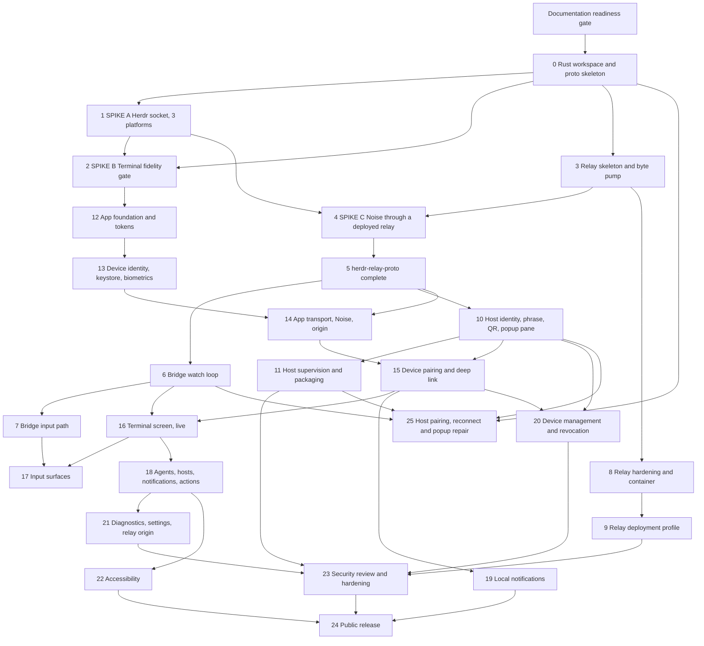

# 90 — Implementation Plan

The ordered checklist that builds `Herdr Remote` from this documentation repository to a published
app.

This repository holds the specification and planning documents, the guidance surface, and — as of
Phase 0 — the Rust workspace and Flutter project it created (`docs/00-overview.md`,
`docs/40-repo-tooling.md` §3.1). The unnumbered **Documentation readiness** gate came first and
blocked everything until every box was ticked. Phase 0 created the first line of code.

This document is a work queue, not an essay. It restates no design. Every checkbox names the file
or the directory it touches and cites the rule that governs it. Read the rule before you write the
code.

Rules here are numbered `R-90-xxx`. This document owns no other prefix.

## 1. How to use this plan

- **R-90-001** The printed order of the phases is one valid serial order, not the only one. The
  real constraint is the phase map in `## 3. Phase map` plus path ownership: two units of work MAY
  run at the same time when no dependency path in that map joins them and their owned paths are
  disjoint (`## 5. Parallel execution`, R-90-007, R-90-016). **Rationale:** the printed order is
  one total order over a partial order. Read as a requirement it forbids the concurrency that
  `## 5. Parallel execution` measures. One person with no help still works the phases top to
  bottom and builds the whole product.
- **R-90-002** You MUST NOT start a phase until every phase named in its `Depends on` line reports
  its `Done when` line true. **Rationale:** a dependency is a real file or a real running process,
  not a preference.
- **R-90-003** You MUST tick a box only after the named path exists and holds the named behaviour.
  **Rationale:** a ticked box is a claim another person acts on.
- **R-90-004** You MUST NOT edit a `Done when` line. **Rationale:** it is the gate. If a gate is
  wrong, record it in `## 8. Blocked work` and raise it with the owner of the cited document.
- **R-90-005** You MUST record the exact command and its output in the pull request that closes a
  phase. **Rationale:** `docs/40-repo-tooling.md` R-40-038 makes a rule without a test an
  unverified claim.
- **R-90-006** You MUST NOT skip Phase 1, Phase 2 or Phase 4. **Rationale:** they are the three
  risk spikes that `docs/01-architecture.md` §7 names. Each one can invalidate a large part of the
  design, and each one is cheap.
- **R-90-007** Phases marked `Parallel-safe with` MAY run at the same time in separate branches.
  **Rationale:** they touch disjoint directories, so they cannot collide.
- **R-90-008** When this plan and a `docs/` document disagree, the document wins. This file records
  no reconciliation of its own: a conflict belongs in the owning document, and a genuine external
  dependency belongs in `## 8. Blocked work` with its default. **Rationale:** the documents are the
  specification. This file is only their order.
- **R-90-009** A task blocked on a human decision MUST proceed with the recommended default in
  `## 8. Blocked work` and MUST open the named ticket in the same commit. **Rationale:** an open
  question must never stop the build.
- **R-90-010** A checkbox that says `Draw` MUST reproduce the wireframe, every callout and every
  numbered rule of the cited file in `docs/31-mockups/`. **Rationale:** the mockup file owns the
  layout. A screen drawn from memory diverges from the specification silently.
- **R-90-011** A checkbox that names a screen state list MUST implement every row of the states
  table in the cited file in `docs/31-mockups/`. **Rationale:** a missing empty, loading, error or
  offline state is the most common defect in a networked app, and the states table is the complete
  list.
- **R-90-012** You MUST NOT add a task runner in the `Documentation readiness` gate or in Phase 0.
  The `just` rule is retired: it
  appears only as `R-40-021` **old** in the `## Retired rules` table of
  `docs/40-repo-tooling.md`, and the live `R-40-021` is the ATX heading rule. This repository runs
  native Host and Flutter commands plus Docker-only relay commands to CI. Add a task runner only
  if the workspace grows past three crates and one Flutter project
  (`docs/40-repo-tooling.md` Open question 2). **Rationale:** a runner that wraps two commands is
  a dependency with no payload.
- **R-90-013** You MUST NOT introduce an NVIDIA name, endpoint, certificate pin or branding
  anywhere in the implementation. **Rationale:** `R-03-001` and `R-03-003`. The product is vendor
  neutral, and `docs/15-nvidia-brev-relay-experiment.md` is an experiment, never a dependency
  (`R-03-002`).
- **R-90-014** You MUST NOT add a background wake mechanism or a background-delivery promise
  beyond the one content-free push wake of `R-03-136` (amended 2026-09-16 by the product owner:
  the phone is suspended within seconds of leaving the app, so a local alert never fires for a
  blocked or done agent). The wake carries fixed text and no content; the real alert log stays
  local, per `R-03-061` and `docs/decisions/ADR-005-local-notifications-only.md`, which the
  App slice's amendment note updates.
- **R-90-015** You MUST NOT start any task in Phase 0 or later until every box in
  `### Documentation readiness` is ticked. Until then this repository holds no code.
  **Rationale:** every phase below cites a rule. A phase that starts against a contradictory
  specification builds the wrong thing, and the cost of finding out is a rewrite, not an edit.

## 2. First hour: fresh clone to a ticked readiness gate

This section validates documentation only, independent of whatever else exists in the repository; it
runs no build command. A new contributor clones the repository, reads four documents, runs four
checks and confirms the gate. Nothing in this section compiles anything.

### 2.1 Clone and install the documentation toolchain

```text
git clone https://github.com/<org>/herdr-mobile.git
cd herdr-mobile
```

Install the documentation tools in the version that `docs/40-repo-tooling.md` §7.1 gives. That
section is the single source for versions, install commands and verification. `npx` fetches
`markdownlint-cli2` on demand; `mermaid` and `jsdom` install into an isolated `/tmp` prefix per
§8.3 (R-40-057). Nothing installs into the repository.

The build prerequisites for the future implementation phase live in
`docs/40-repo-tooling.md` §7.2. This document cites §7.2 and duplicates none of it.

### 2.2 Read the four documents that decide everything

Read them in this order. Each one answers a question that the next one assumes.

| Order | Read | What it settles |
| --- | --- | --- |
| 1 | `README.md` | What the product is, and that Phase 0 has landed while every further change still follows this plan. |
| 2 | `docs/00-overview.md` | The nine hard requirements, the four deliverables and the non-goals. |
| 3 | `docs/03-product-decisions.md` | Every user-set policy: the display name, the licence, the relay-origin rule, one active phone, full terminal control, local notifications only, and QR-first six-word pairing (R-03-001 to R-03-085). |
| 4 | `CONTRIBUTING.md` | The ownership map, the rule-id convention and the source-citation format. |

Then read the owner document for the area you are about to touch. `## Sources` names every one.

### 2.3 Run the four documentation checks

`docs/40-repo-tooling.md` §8 pins the exact command and the exact version for each check. Run each
one from the repository root. This document does not restate a command, because one command in two
places drifts.

| Check | Command lives in | A pass means |
| --- | --- | --- |
| Markdown structure | `docs/40-repo-tooling.md` §8.1 | `markdownlint-cli2` reports no finding. |
| Link resolution | `docs/40-repo-tooling.md` §8.2 | The offline pass and the online pass both report zero errors. |
| Mermaid diagrams | `docs/40-repo-tooling.md` §8.3 | Every extracted block parses (R-40-057). |
| Rule consistency | `docs/40-repo-tooling.md` §8.4 | No placeholder id remains, and every cited id has a definition. |

Two properties of the checks that a first run meets:

- The online `lychee` pass fails on the internal URLs in
  `docs/15-nvidia-brev-relay-experiment.md` unless you are on the NVIDIA network
  (`docs/40-repo-tooling.md` §8.2). Those are the only permitted failures.
- The §8.4 extractor recognises a rule written as `**R-nn-nnn**`. This repository also defines a
  rule as a heading and as a table cell. Confirm by hand that an id the audit prints is truly
  undefined before you delete the citation that names it.

### 2.4 Walk the completeness checklist

Walk the eight items in `docs/40-repo-tooling.md` §8.5 before you mark any documentation change
done.

### 2.5 Tick the readiness gate

The first hour ends at `### Documentation readiness` in `## 6. Phases`. Tick a box there only when
the named condition holds (R-90-003). When every box is ticked, and not before, Phase 0 creates the
first file of code (R-90-015).

## 3. Phase map



## 4. Milestones

| Milestone | Phases | Demo that proves it | Who else must be involved |
| --- | --- | --- | --- |
| **M0 Documentation ready** | The `Documentation readiness` gate | Every box in the gate is ticked and the four checks in `docs/40-repo-tooling.md` §8 pass. | Nobody. |
| **M1 Ground truth** | 0, 1, 2, 3, 4 | The bridge prints a live pane on Windows, Linux and macOS; the phone paints the captured 8 KB fixture at the Host grid size; a Noise session completes through a relay reached over WSS from a phone on cellular data. | A Linux host and a macOS host. One public Linux VM with a DNS name for the WSS gate. |
| **M2 One byte, end to end** | 5, 6, 7 | A keystroke typed into a test Device reaches a real Herdr pane, and the pane's next revision returns as an encrypted `pane_frame`. | Nobody. |
| **M3 Relay in production** | 8, 9 | `curl https://relay.example.com/healthz` returns `200 ok` from a phone on a cell network with no VPN. | The relay operator: a public Linux VM, a DNS A record, ports 443 and 80 (`R-14-001`). |
| **M4 Host complete** | 10, 11 | `herdr plugin action invoke herdr-relay pair` opens the popup pane with a scannable QR code and six words; after a reboot the bridge runs with no human action. | Nobody. |
| **M5 The product works** | 12, 13, 14, 15, 16, 17, 18 | A phone pairs by QR, lists agents, opens a blocked agent's pane at 1-to-1 fidelity, and answers it. Recorded on a Pixel 6a and an iPhone SE (3rd generation). | Nobody. |
| **M6 Platform integration** | 19, 20, 21, 22 | A local notification fires while the app is alive and its tap lands on the right pane; the Host revokes that phone and the phone returns to the pairing screen. | Nobody. Version 1 needs no push vendor (`R-03-061`). |
| **M7 Shipped** | 23, 24 | A build accepted into TestFlight and Google Play closed testing, with both privacy forms and both export declarations complete. | Apple Developer account holder and Google Play Console account holder (`R-23-031`, `R-23-032`), plus an external beta tester per platform (`R-23-036`). |

## 5. Parallel execution

This section is an overlay. It moves no task, reorders no phase and edits no `Done when` line
(R-90-004). One person with no help works `## 6. Phases` in the printed order and builds the whole
product. A team that runs several agents at once reads this section first, because the printed
order hides two things: the concurrency the phase map allows, and the file collisions the phase map
does not prevent.

### 5.1 Waves

A wave is the set of units whose predecessors are all complete. It is the most that can start
together.

At phase granularity the predecessors are the edges of `## 3. Phase map`:

| Wave | Phases | Count |
| --- | --- | --- |
| 0 | `Documentation readiness` | 1 |
| 1 | Phase 0 | 1 |
| 2 | Phase 1, Phase 3 | 2 |
| 3 | Phase 2, Phase 4, Phase 8 | 3 |
| 4 | Phase 5, Phase 9, Phase 12 | 3 |
| 5 | Phase 6, Phase 10, Phase 13 | 3 |
| 6 | Phase 7, Phase 11, Phase 14 | 3 |
| 7 | Phase 15 | 1 |
| 8 | Phase 16, Phase 19, Phase 20 | 3 |
| 9 | Phase 17, Phase 18 | 2 |
| 10 | Phase 21, Phase 22 | 2 |
| 11 | Phase 23 | 1 |
| 12 | Phase 24 | 1 |

**The peak concurrency at phase granularity is 3.** Five waves reach it and no wave exceeds it.
Three agents is the whole gain the phase list offers, and the three are very unequal: the 26 phases
hold 650 checkboxes, and Phase 18 alone holds 70.

The work packages of §5.2 are what raises that number. Each package owns a slice of one phase's
paths, so two packages never write one file, and each package names the files and the verdicts it
actually reads instead of inheriting its phase's whole `Depends on` line (R-90-024).

| Wave | Count | Packages, with the `WP-` prefix dropped |
| --- | --- | --- |
| 0 | 1 | G |
| 1 | 2 | 0-a, 0-b |
| 2 | 10 | 1, 3, 5-a, 5-b, 5-c, 10-a, 11, 12-a, 12-c, 13-a |
| 3 | 4 | 2, 4, 8, 10-b |
| 4 | 4 | 6, 9, 10-c, 12-b |
| 5 | 2 | 7, 13-b |
| 6 | 2 | 14-a, 14-b |
| 7 | 3 | 15-a, 15-b, 15-c |
| 8 | 6 | 16-a, 16-b, 16-c, 19-a, 19-b, 20-a |
| 9 | 8 | 17, 18-a, 18-b, 18-c, 18-d, 18-e, 18-f, 20-b |
| 10 | 3 | 21-a, 21-b, 22 |
| 11 | 1 | 23 |
| 12 | 1 | 24 |
| 13 | 1 | 25 |

**The peak concurrency at package granularity is 10**, in wave 2. The 26 phases and the Phase 25
repair become 48 packages over 14 waves. Three properties of the two tables:

- Wave 2 holds ten packages whose owned paths are pairwise disjoint. Three of them write into
  `crates/herdr-relay/` at the same time: `WP-1` writes `src/bin/`, `WP-10-a` writes `src/keys.rs`,
  `src/store.rs` and `src/config.rs`, and `WP-11` writes the manifest and the shims. That is what
  path ownership buys.
- A wave is not a unit of time. A wave of one 5-checkbox package is far shorter than a wave of a
  27-checkbox phase, so 13 waves of packages finish sooner than 13 waves of phases even though the
  count is the same.
- The count is a floor, not a ceiling. A package that starts in wave 4 and runs into wave 5 raises
  the true simultaneous count above the number in the table.

The wave count is 13 and not 12 because the map now carries the `P1 --> P2` edge. Phase 1 captures
`app/test/fixtures/pane-50row.ansi` and Phase 2 reads it, so the two were never parallel. The old
map hid a real dependency and both phases declared the other parallel-safe.

### 5.2 Work packages

A work package is one agent's assignment. Its id is `WP-<phase>-<letter>`, for example `WP-18-a`.
A phase this section does not split is one package and drops the letter, as in `WP-6`. The
readiness gate is `WP-G` (R-90-022).

A phase earns a split when both tests hold:

- Two or more groups of its owned paths reach roughly five checkboxes each.
- Each group holds at least one path that the package itself writes.

The second test is what keeps a package honest. A group of checkboxes that writes only paths
another phase owns is not a package: it is a request stream, and §5.3 already routes it.

Each entry names its wave, the paths it owns, the packages it needs and the contract it publishes.
`Needs.` is derived from what the package reads, not from the phase it sits in: a package needs
another only when it reads a file that one creates or consumes a verdict that one proves. Where
that list is narrower than the phase's `Depends on` line, the entry names the artefact it does not
read (R-90-024). `Publishes.` is a declaration that a consumer can be written against before the
producer has finished (R-90-020). A package that publishes nothing says so.

**Phase 0** — 25 checkboxes, 34 owned paths, 2 packages.

- **WP-0-a** — wave 1. The Rust workspace, the relay Dockerfile, the protocol crate skeleton and the
  CI files. 13 checkboxes.
  - **Paths.** `.gitattributes`, `.gitignore`, `.github/dependabot.yml`,
    `.github/workflows/ci.yml`, `crates/Cargo.toml`, `crates/rust-toolchain.toml`,
    `crates/herdr-relay-hub/Cargo.toml`, `crates/herdr-relay-hub/Dockerfile`,
    `crates/herdr-relay-hub/src/main.rs`, `crates/herdr-relay-proto/Cargo.toml`,
    `crates/herdr-relay-proto/src/codes.rs`, `crates/herdr-relay-proto/src/frame.rs`,
    `crates/herdr-relay-proto/src/handle.rs`, `crates/herdr-relay-proto/src/lib.rs`,
    `crates/herdr-relay-proto/src/messages.rs`,
    `crates/herdr-relay-proto/src/messages/action.rs`,
    `crates/herdr-relay-proto/src/messages/control.rs`,
    `crates/herdr-relay-proto/src/messages/device.rs`,
    `crates/herdr-relay-proto/src/messages/input.rs`,
    `crates/herdr-relay-proto/src/messages/session.rs`,
    `crates/herdr-relay-proto/src/messages/status.rs`,
    `crates/herdr-relay-proto/src/messages/tree.rs`,
    `crates/herdr-relay-proto/src/messages/watch.rs`,
    `crates/herdr-relay-proto/src/phrase.rs`,
    `crates/herdr-relay-proto/src/test_vectors.rs`, `crates/herdr-relay/Cargo.toml`,
    `crates/herdr-relay/src/main.rs`.
  - **Needs.** `WP-G`.
  - **Publishes.** The three crate names, `edition = "2024"`, `rust-version = "1.98"`, the one
    exact Rust 1.98.0 workspace toolchain selected by `rust-toolchain.toml`, the pinned
    `[workspace.dependencies]` table, the envelope stub in `frame.rs`, the compiling stubs in
    `codes.rs`, `handle.rs`, `messages.rs`, `phrase.rs` and `test_vectors.rs`, the two crate-root
    binary stubs `crates/herdr-relay-hub/src/main.rs` and `crates/herdr-relay/src/main.rs`, and the
    relay `test` and final image stages. It also publishes `.github/workflows/ci.yml`, which
    Phase 11 and Phase 24 later change on request, and `.github/dependabot.yml`, which no later
    phase touches. `.gitattributes` and `.gitignore` are workspace-wide hygiene files this package
    owns alone (R-90-017); `WP-0-b` adds the `*.dart` line and the Flutter ignore entries on
    request, in the same wave, before this package closes.
- **WP-0-b** — wave 1. The Flutter project, its identifiers and its manifests. 12 checkboxes.
  - **Paths.** `app/analysis_options.yaml`, `app/android/app/build.gradle.kts`,
    `app/android/app/src/main/AndroidManifest.xml`, `app/ios/Runner.xcodeproj/project.pbxproj`,
    `app/ios/Runner/AppDelegate.swift`, `app/ios/Runner/Info.plist`, `app/lib/main.dart`,
    `app/ios/Runner/Personal.entitlements` (self-declared, R-90-018, 2026-09-16),
    `app/pubspec.yaml`, `app/test/widget_test.dart`.
  - **Needs.** `WP-G`.
  - **Publishes.** `dev.herdr.remote`, the display name `Herdr Remote`, `minSdk 33`,
    `targetSdk 36`, the iOS deployment target 15.0 and the pinned dependency set of
    `app/pubspec.yaml`. It owns three of the four highest-traffic shared paths, so it stays
    reachable for every later wave.
  - `WP-0-b` itself has since closed; no live session remains to route a request through. Two
    later, ad-hoc verification sessions wrote directly against its still-standing ownership
    instead. One added `android:roundIcon="@mipmap/ic_launcher_round"` and
    `android:networkSecurityConfig="@xml/network_security_config"` to
    `app/android/app/src/main/AndroidManifest.xml`, plus the new file
    `app/android/app/src/main/res/xml/network_security_config.xml` (R-22-062, R-22-084). The other
    added an `NSAppTransportSecurity` dict, with `NSAllowsLocalNetworking` and
    `NSExceptionDomains` entries, to `app/ios/Runner/Info.plist` (R-22-085).

**Phase 5** — 18 checkboxes, 5 owned paths, 3 packages.

- **WP-5-a** — wave 2. The message union and the code enums. 5 checkboxes.
  - **Paths.** None.
  - **Needs.** `WP-0-a`. This is narrower than Phase 5's `Depends on. Phase 4.` line: every field
    comes from the `docs/11-relay-protocol.md` §4 and §7 tables, and no checkbox reads a Phase 4
    file or the `docs/01-architecture.md` §7 Noise verdict.
  - **Publishes.** Every application message, `host_info`, `device_info`, the `agent_status` field
    list, the close codes `4000` to `4008` and the six phrase error codes. All five checkboxes fill
    `messages.rs` and `codes.rs`, which `WP-0-a` owns; §5.3 routes them.
- **WP-5-b** — wave 2. The phrase and handle codecs. 7 checkboxes.
  - **Paths.** `crates/herdr-relay-proto/tests/handle.rs`.
  - **Needs.** `WP-0-a`. Narrower than Phase 5's line for the same reason: the canonical phrase
    form and the 22-character handle encoding are `docs/13-security-pairing.md` rules, and the
    Noise verdict cannot change either.
  - **Publishes.** The canonical hyphenated phrase form, the display form, the handle encoding and
    the pairing URI builder. Its three envelope checkboxes edit `frame.rs`, and its phrase and
    handle checkboxes fill `phrase.rs` and `handle.rs`, all of which `WP-0-a` owns; §5.3 routes
    them.
- **WP-5-c** — wave 2. The test vectors and the Dart mirror. 6 checkboxes.
  - **Paths.** `crates/herdr-relay-proto/tests/vectors.rs`, `app/test/models/frame_size_test.dart`,
    `app/test/models/ping_response_test.dart`, `app/test/models/vectors_test.dart`.
  - **Needs.** `WP-0-a`, `WP-0-b`, and the declarations of `WP-5-a` and `WP-5-b`.
  - **Publishes.** The one vector file that the Rust tests and the Dart tests both read. Its
    creation checkbox fills `test_vectors.rs`, which `WP-0-a` owns; §5.3 routes it.

**Phase 10** — 36 checkboxes, 10 owned paths, 3 packages.

- **WP-10-a** — wave 2. The Host key, the paired-device store and the config file. 12 checkboxes.
  - **Paths.** `crates/herdr-relay/src/keys.rs`, `crates/herdr-relay/src/store.rs`,
    `crates/herdr-relay/src/config.rs`, `crates/herdr-relay/src/watch/devices.rs`,
    `crates/herdr-relay/tests/revoke.rs`.
  - **Needs.** `WP-0-a`, and the declarations of `WP-5-a` for four message names. Narrower than
    Phase 10's `Depends on. Phase 5.` line: the key file, the device store and the config file
    hold no wire type. One checkbox creates `crates/herdr-relay/src/watch/devices.rs` for the
    four device-management handlers and adds one `mod devices;` line to
    `crates/herdr-relay/src/watch.rs`, which `WP-6` owns; §5.3 routes the `mod` line through
    `INT-6-bridge`, so this package reports after that step. `devices.rs` itself is new and
    unowned until this checkbox creates it, so it needs no routing (R-90-018).
  - **Publishes.** The paired-device record of R-13-049 and the fingerprint format of R-13-040.
- **WP-10-b** — wave 3. The pairing phrase, the pairing URI and the QR encoder. 7 checkboxes.
  - **Paths.** `crates/herdr-relay/src/pairing.rs`,
    `crates/herdr-relay/src/pairing/wordlist.rs`,
    `crates/herdr-relay/tests/phrase_expiry.rs`.
  - **Needs.** `WP-5-b`. It runs `INT-10-host`, so the Phase 4 spike consumes its declaration and
    writes no copy of `pairing.rs`.
  - **Publishes.** The 120-second phrase lifetime, the three-attempt limit and the QR module grid
    that the popup renders.
- **WP-10-c** — wave 4. The popup pane. 17 checkboxes.
  - **Paths.** `crates/herdr-relay/src/popup.rs`, `crates/herdr-relay/tests/popup_once.rs`.
  - **Needs.** `WP-10-a`, `WP-10-b`.
  - **Publishes.** Nothing. It is the last consumer on the Host.

**Phase 12** — 36 checkboxes, 74 owned paths, 3 packages.

- **WP-12-a** — wave 2. The design tokens and the two token tests. 13 checkboxes.
  - **Paths.** `app/assets/fonts/IBMPlexSans-Regular.ttf`,
    `app/assets/fonts/IBMPlexSans-SemiBold.ttf`, `app/assets/fonts/Archivo-Bold.ttf`,
    `app/assets/fonts/Archivo-Black.ttf` (R-32-200; the two Archivo files were GitHub HTML pages
    until 2026-09-02, so every title rendered in the system font; replaced with the real TTFs,
    SHA-256 `951a0eba…` and `37bafecd…`), `app/lib/widgets/app_filled_button.dart`,
    `app/lib/widgets/app_list_row.dart`, `app/lib/widgets/app_section_header.dart`,
    `app/lib/widgets/app_strip.dart`, `app/lib/widgets/app_text_button.dart`,
    `app/lib/widgets/theme/app_color.dart`, `app/lib/widgets/theme/app_type.dart`,
    `app/lib/widgets/theme/app_space.dart`, `app/lib/widgets/theme/app_radius.dart`,
    `app/lib/widgets/theme/app_elev.dart`, `app/lib/widgets/theme/app_motion.dart`,
    `app/lib/widgets/theme/app_haptic.dart`, `app/lib/widgets/theme/app_size.dart`,
    `app/lib/widgets/theme/app_live_dot.dart` (the R-32-510 live-dot age, added 2026-09-03 when
    the terminal screen needed it; R-90-018), `app/lib/widgets/treatments.dart`,
    `app/test/widgets/theme/no_literals_test.dart`, `app/test/widgets/theme/contrast_test.dart`.
  - **Needs.** `WP-0-b`. Narrower than Phase 12's `Depends on. Phase 2.` line: Phase 2's last
    checkbox gates one thing, a new file under `app/lib/screens/`, and this package creates none.
    Its files are constant tables from `docs/30-ux-spec.md`.
  - **Publishes.** Every token name that every later app package reads. The tables in
    `docs/30-ux-spec.md` are the declaration, so no sibling waits for the file.
    `docs/32-design-language.md` §5.5's size tokens, including the icon sizes, are `app_size.dart`'s
    declaration. Its §5.4 border-width tokens are named constants inside `treatments.dart` instead:
    five tokens do not earn a fourth theme file.
- **WP-12-b** — wave 4. The app root, the router and the three-destination shell. 9 checkboxes.
  - **Paths.** `app/lib/app.dart`, `app/lib/routing.dart`, `app/lib/screens/app_shell.dart`,
    `app/test/app_lock_test.dart` (self-declared, R-90-018, 2026-09-16),
    `app/test/screens/goldens/app_shell_android_agents_dark.png`,
    `app/test/screens/goldens/app_shell_android_agents_light.png`,
    `app/test/screens/goldens/app_shell_android_notifications_dark.png`,
    `app/test/screens/goldens/app_shell_android_notifications_light.png`,
    `app/test/screens/goldens/app_shell_ios_agents_dark.png`,
    `app/test/screens/goldens/app_shell_ios_agents_light.png`,
    `app/test/screens/goldens/app_shell_ios_notifications_dark.png`,
    `app/test/screens/goldens/app_shell_ios_notifications_light.png`,
    `app/test/screens/app_shell_golden_test.dart` (self-declared, R-90-018).
  - **Needs.** `WP-2`, because `app_shell.dart` is a file under `app/lib/screens/`, plus the
    declarations of `WP-12-a` and `WP-12-c`.
  - **Publishes.** Every route name, including `/hosts/:hostId/panes/:paneId`, which Phase 13 and
    Phase 19 both consume.
- **WP-12-c** — wave 2. The platform chrome and the runtime contrast assertion. 14 checkboxes.
  - **Paths.** `app/lib/widgets/theme/chrome_compose_task.dart`,
    `app/lib/widgets/theme/chrome_confirmation_dialog.dart`,
    `app/lib/widgets/theme/chrome_confirmation_outcome.dart`,
    `app/lib/widgets/theme/chrome_contrast_preference.dart`,
    `app/lib/widgets/theme/chrome_list_row.dart`, `app/lib/widgets/theme/chrome_scheme.dart`,
    `app/lib/widgets/theme/chrome_scheme_source.dart`,
    `app/lib/widgets/theme/chrome_settings_section.dart`,
    `app/lib/widgets/theme/chrome_transient_timeout.dart`,
    `app/lib/widgets/theme/chrome_transparency.dart`, `app/lib/services/contrast_assert.dart`,
    `app/test/widgets/theme/chrome_contrast_test.dart`.
  - **Needs.** `WP-0-b` and the declarations of `WP-12-a`. Narrower than Phase 12's line for the
    same reason as `WP-12-a`: it creates no file under `app/lib/screens/`.
  - **Publishes.** The chrome `ColorScheme` builder and the degenerate scheme that `app.dart`
    calls, plus the contrast result the diagnostics screen reads.

**Phase 13** — 25 checkboxes, 29 owned paths, 2 packages.

- **WP-13-a** — wave 2. The key store. 12 checkboxes.
  - **Paths.** `app/lib/core/result/result.dart`, `app/lib/services/keystore.dart`,
    `app/lib/services/plain_store.dart`, `app/integration_test/keystore_survival_test.dart`,
    `app/test/services/keystore_test.dart`, `app/ios/Runner/KeychainSession.swift`,
    `app/ios/RunnerTests/KeychainSessionTests.swift`.
    `result.dart` is the shared `Result<T>`/`Ok`/`Err` type R-41-103 requires;
    `docs/20-mobile-framework.md` §7.2 names its directory but no package owned the file, so this
    is the earliest phase that actually needs it (R-90-018) — `WP-0-b` covers only manifests and
    identifiers, not shared Dart types. The type is self-hosted in `keystore.dart` today; a
    checkbox below moves it to the canonical path.
  - **Needs.** `WP-0-b`. Narrower than Phase 13's `Depends on. Phase 12.` line: these are platform
    services from `docs/22-platform-integration.md` §2 and `docs/13-security-pairing.md`. The
    package reads no design token and creates no screen.
  - **Publishes.** The keystore interface: the Curve25519 keypair, the pinned Host key, the relay
    origin and the routing handle, all behind one biometric gate.
- **WP-13-b** — wave 5. The biometric gate and the lock screen. 13 checkboxes.
  - **Paths.** `app/android/app/src/main/kotlin/.../MainActivity.kt`,
    `app/lib/screens/lock_screen.dart`, `app/lib/services/biometric_gate.dart`,
    `app/lib/services/frame_presentation.dart`, `app/test/frame_presentation_support.dart`,
    `app/integration_test/lock_presentation_test.dart` (self-declared, R-90-018, 2026-09-16),
    `app/test/screens/goldens/lock_screen_default_dark.png`,
    `app/test/screens/goldens/lock_screen_default_light.png`,
    `app/test/screens/goldens/lock_screen_locked_out_dark.png`,
    `app/test/screens/goldens/lock_screen_locked_out_light.png`,
    `app/test/screens/goldens/lock_screen_loading_dark.png`,
    `app/test/screens/goldens/lock_screen_loading_light.png`,
    `app/test/screens/goldens/lock_screen_no_enrolment_dark.png`,
    `app/test/screens/goldens/lock_screen_no_enrolment_light.png`,
    `app/test/screens/goldens/lock_screen_offline_dark.png`,
    `app/test/screens/goldens/lock_screen_offline_light.png`,
    `app/test/screens/goldens/lock_screen_rejected_dark.png`,
    `app/test/screens/goldens/lock_screen_rejected_light.png`,
    `app/test/screens/lock_screen_golden_test.dart`, `app/test/screens/lock_screen_test.dart`,
    `app/test/screens/golden_support.dart` (self-declared, R-90-018: the one golden harness; the
    lock screen is the earliest golden, and every later golden test imports it, §5.3),
    `app/test/services/biometric_gate_test.dart`.
  - **Needs.** `WP-13-a`, `WP-12-a` and `WP-12-b`, because the lock screen is a screen, it paints
    tokens and it keeps a target route across the unlock.
  - **Publishes.** The 120-second background lock and the three re-authentication points, which
    Phase 14 and Phase 19 both call.
  - **Maintenance, 2026-09-16.** `WP-13-a` adds the iOS session Keychain reader and its native
    tests. `WP-13-b` coalesces pending unlocks and invalidates that context on lock. `WP-0-b`
    owns the channel registration and source membership in `AppDelegate.swift` and the Xcode
    project. These packages have closed; this repair follows their standing path ownership.

**Phase 14** — 34 checkboxes, 18 owned paths, 2 packages.

- **WP-14-a** — wave 6. The one socket, registration, reconnect and resume. 21 checkboxes.
  - **Paths.** `app/lib/services/relay.dart`, `app/lib/services/connectivity.dart`,
    `app/lib/services/reconnect_policy.dart`, `app/test/services/fragment_timeout_test.dart`,
    `app/test/services/oversized_send_seq_test.dart`,
    `app/test/services/reconnect_policy_test.dart`, `app/test/services/resume_test.dart`,
    `app/test/services/single_socket_test.dart`.
  - **Needs.** `WP-5-c`, `WP-13-b`, and the declarations of `WP-14-b`. None of `WP-14-a`'s 21
    checkboxes read a path `WP-4` publishes: every socket, compression, subprotocol, `seq` and
    reconnect item is written and unit-tested against any relay implementing the wire protocol,
    including `WP-9`'s already-built, already-verified local Docker Compose relay
    (`crates/herdr-relay-hub/compose.yaml`, B14). `WP-4`'s still-open half is a real-phone,
    public-reachability proof that only Phase 14's shared `Done when` line needs, so it gates
    neither `WP-14-a`'s start nor any of its own 21 checkboxes (R-90-024).
  - **Publishes.** The single transport handle every app screen reads, the `seq` accounting and
    the six-step reconnect schedule.
- **WP-14-b** — wave 6. The Noise session, frame codec and the relay origin. 13 checkboxes.
  - **Paths.** `app/lib/services/frame_codec.dart`, `app/lib/services/hmac_blake2s.dart`,
    `app/lib/services/noise.dart`, `app/lib/services/origin.dart`,
    `app/test/services/frame_codec_test.dart`, `app/test/services/hmac_blake2s_vectors_test.dart`,
    `app/test/services/origin_test.dart`.
  - **Needs.** `WP-4` for the `cryptography` 2.9.0 interoperation verdict and the
    `hmac_blake2s_vectors.json` it publishes, `WP-13-b` for the gate, and the declarations of
    `WP-5-a`.
  - **Publishes.** The `Noise_XXpsk0` and `Noise_KK` entry points, the compress-then-fragment
    send path and the defragment-then-decompress receive path, the Host fingerprint format and
    the origin rules, which Phase 15 and Phase 21 both consume. Neither file touches the socket,
    which is why the two packages of this phase run at once.

**Phase 15** — 33 checkboxes, 12 owned paths, 3 packages.

- **WP-15-a** — wave 7. The pairing service, the URI codec and the deep link. 14 checkboxes.
  - **Paths.** `app/assets/wordlists/eff_large_wordlist.txt`,
    `app/integration_test/pairing_flow_test.dart`, `app/lib/services/pairing.dart`,
    `app/test/services/pairing_test.dart`, `app/tool/fetch_eff_wordlist.dart`,
    `crates/herdr-relay-proto`.
  - **Needs.** `WP-10-b`, `WP-14-a`, `WP-14-b`.
  - **Publishes.** The one pairing input record that the QR path, the manual path and the
    deep-link path all produce, and the six phrase errors the screens display.
- **WP-15-b** — wave 7. The welcome screen, the QR scanner and the confirmation. 11 checkboxes.
  - **Paths.** `app/lib/screens/welcome_screen.dart`, `app/lib/screens/qr_scan_screen.dart`.
  - **Needs.** The declarations of `WP-15-a`, plus `WP-12-a` and `WP-12-b`.
  - **Publishes.** Nothing.
- **WP-15-c** — wave 7. The manual pairing screen. 8 checkboxes.
  - **Paths.** `app/lib/screens/manual_pairing_screen.dart`.
  - **Needs.** The declarations of `WP-15-a`, plus `WP-12-a` and `WP-12-b`.
  - **Publishes.** The six word fields, which Phase 22 labels.

**Phase 16** — 39 checkboxes, 24 owned paths, 3 packages.

- **WP-16-a** — wave 8. The terminal service. 14 checkboxes.
  - **Paths.** `app/lib/services/terminal.dart`.
  - **Needs.** `WP-6`, `WP-15-a`, and `WP-2` for the fidelity verdict.
  - **Publishes.** The frame pipeline: `watch_pane`, the clear-and-home reset, the revision gate,
    the 120 ms coalescing window and the local `terminal.resize()` call, never `pane.resize`. It
    runs half of `INT-16-terminal`.
- **WP-16-b** — wave 8. The terminal grid widget. 20 checkboxes.
  - **Paths.** `app/lib/widgets/terminal_view_widget.dart`,
    `app/test/widgets/terminal_isolated_test.dart`, `app/lib/models/char_width.dart`,
    `app/test/widgets/goldens/terminal_view_overview_dark.png` and
    `app/test/widgets/goldens/terminal_view_overview_light.png` (self-declared, R-90-018,
    2026-09-08; the Overview mode of the readable-default terminal).
  - **Needs.** The declarations of `WP-16-a`, plus `WP-12-a` and `WP-2`.
  - **Publishes.** The grid contract: an explicit palette argument, no theme lookup and no
    reflow. It runs the other half of `INT-16-terminal`, including the 2026-09-08 terminal-fit
    change (fit every Host column at the default scale by measured cell width, no Host resize,
    explicit pinch and pan preserved), which touches only `WP-16` paths.
- **WP-16-c** — wave 8. The status strip, the SGR counter and the pane-actions sheet. 5 checkboxes.
  - **Paths.** `app/lib/widgets/status_strip.dart`, `app/lib/models/sgr_counter.dart`,
    `app/lib/screens/pane_actions_sheet.dart`,
    `app/test/screens/goldens/pane_actions_sheet_default_agent_pane_dark.png`,
    `app/test/screens/goldens/pane_actions_sheet_default_agent_pane_light.png`,
    `app/test/screens/goldens/pane_actions_sheet_host_in_use_dark.png`,
    `app/test/screens/goldens/pane_actions_sheet_host_in_use_light.png`,
    `app/test/screens/goldens/pane_actions_sheet_offline_dark.png`,
    `app/test/screens/goldens/pane_actions_sheet_offline_light.png`,
    `app/test/screens/pane_actions_sheet_golden_test.dart` (self-declared, R-90-018),
    `app/test/screens/pane_actions_sheet_test.dart` (self-declared, R-90-018),
    `app/test/screens/single_tap_sends_nothing_test.dart`,
    `app/integration_test/first_paint_test.dart`, `app/lib/screens/terminal_screen.dart` (the
    route's screen that composes this package's strip and sheet, registered 2026-09-03 under
    R-90-018), `app/test/screens/terminal_screen_test.dart`,
    `app/integration_test/terminal_test.dart` (the terminal end-to-end cases, 2026-09-03).
  - **Needs.** The declarations of `WP-16-a`.
  - **Publishes.** The unknown-SGR count that the diagnostics screen reads, and the pane-actions
    sheet that Phase 18 and Phase 22 both extend.

**Phase 18** — 70 checkboxes, 97 owned paths, 6 packages. This is the largest phase in the plan
and the one no single agent should take.

- **WP-18-a** — wave 9. The computer list and the reveal-action pattern. 12 checkboxes.
  - **Paths.** `app/lib/screens/host_list_screen.dart`, `app/lib/services/host_list.dart`,
    `app/test/screens/goldens/host_list_default_dark.png`,
    `app/test/screens/goldens/host_list_default_light.png`,
    `app/test/screens/goldens/host_list_empty_dark.png`,
    `app/test/screens/goldens/host_list_empty_light.png`,
    `app/test/screens/goldens/host_list_host_in_use_dark.png`,
    `app/test/screens/goldens/host_list_host_in_use_light.png`,
    `app/test/screens/goldens/host_list_switch_failed_dark.png`,
    `app/test/screens/goldens/host_list_switch_failed_light.png`,
    `app/test/screens/host_list_screen_golden_test.dart` (self-declared, R-90-018),
    `app/test/screens/host_list_screen_test.dart` (self-declared, R-90-018, 2026-09-03).
  - **Needs.** `WP-16-a`, `WP-14-a`, `WP-12-b`.
  - **Publishes.** The one-open-pane swipe rule and the named semantics action, which `WP-18-b`
    reuses.
- **WP-18-b** — wave 9. The agent list, the grouping strip and the header tiers. 16 checkboxes.
  - **Paths.** `app/lib/screens/agent_list_screen.dart`, `app/lib/services/agent_list.dart`,
    `app/test/screens/goldens/agent_list_empty_dark.png`,
    `app/test/screens/goldens/agent_list_empty_light.png`,
    `app/test/screens/goldens/agent_list_priority_dark.png`,
    `app/test/screens/goldens/agent_list_priority_light.png`,
    `app/test/screens/goldens/agent_list_workspace_dark.png`,
    `app/test/screens/goldens/agent_list_workspace_light.png`,
    `app/test/screens/agent_list_screen_golden_test.dart` (self-declared, R-90-018).
  - **Needs.** The declarations of `WP-18-a` and `WP-19-a`.
  - **Publishes.** The start route of a paired app, and the grouping axis the settings screen
    reads. Thirteen of its checkboxes edit one file, so it cannot split again.
- **WP-18-c** — wave 9. The notifications screen and the shared tree service. 7 checkboxes.
  - **Paths.** `app/lib/screens/notifications_screen.dart`, `app/lib/services/tree.dart`,
    `app/test/screens/goldens/notifications_screen_default_dark.png`,
    `app/test/screens/goldens/notifications_screen_default_light.png`,
    `app/test/screens/goldens/notifications_screen_empty_dark.png`,
    `app/test/screens/goldens/notifications_screen_empty_light.png`,
    `app/test/screens/goldens/notifications_screen_pane_closed_dark.png`,
    `app/test/screens/goldens/notifications_screen_pane_closed_light.png`,
    `app/test/screens/notifications_screen_golden_test.dart` (self-declared, R-90-018).
    2026-09-08: the product owner replaced the `Panes` destination with `Notifications`
    (decided 2026-09-04); the tree screen is retired, and `app/lib/services/tree.dart` stays as
    the shared `tree_snapshot`/`tree_update` reader the terminal and the notification breadcrumb
    join on.
  - **Needs.** `WP-16-a`, `WP-6` for `tree_snapshot` and `tree_update`, and `WP-19-a` for the
    `agent_status` attention list the screen draws.
  - **Publishes.** The `Notifications` destination screen that `WP-12-b`'s shell wires. The
    `Computer actions` control moved to the `Agents` app bar (`WP-18-b`'s screen) when the
    `Panes` destination was dropped, 2026-09-04.
- **WP-18-d** — wave 9. The create menu, the pane-action wiring and the connection screen.
  12 checkboxes.
  - **Paths.** `app/lib/screens/create_sheet.dart`, `app/lib/screens/connection_screen.dart`,
    `app/lib/services/pane_actions.dart`,
    `app/test/screens/goldens/connection_screen_alerts_silenced_dark.png`,
    `app/test/screens/goldens/connection_screen_alerts_silenced_light.png`,
    `app/test/screens/goldens/connection_screen_connected_dark.png`,
    `app/test/screens/goldens/connection_screen_connected_light.png`,
    `app/test/screens/goldens/connection_screen_disconnect_failed_dark.png`,
    `app/test/screens/goldens/connection_screen_disconnect_failed_light.png`,
    `app/test/screens/goldens/connection_screen_disconnecting_dark.png`,
    `app/test/screens/goldens/connection_screen_disconnecting_light.png`,
    `app/test/screens/goldens/connection_screen_host_in_use_dark.png`,
    `app/test/screens/goldens/connection_screen_host_in_use_light.png`,
    `app/test/screens/goldens/connection_screen_leg_connecting_dark.png`,
    `app/test/screens/goldens/connection_screen_leg_connecting_light.png`,
    `app/test/screens/goldens/connection_screen_leg_one_down_dark.png`,
    `app/test/screens/goldens/connection_screen_leg_one_down_light.png`,
    `app/test/screens/goldens/connection_screen_loading_dark.png`,
    `app/test/screens/goldens/connection_screen_loading_light.png`,
    `app/test/screens/goldens/connection_screen_saved_not_connected_dark.png`,
    `app/test/screens/goldens/connection_screen_saved_not_connected_light.png`,
    `app/test/screens/connection_screen_golden_test.dart` (self-declared, R-90-018),
    `app/test/screens/goldens/create_sheet_default_dark.png`,
    `app/test/screens/goldens/create_sheet_default_light.png`,
    `app/test/screens/create_sheet_golden_test.dart` (self-declared, R-90-018).
  - **Needs.** `WP-16-c`, `WP-14-a`. Five of its checkboxes fill
    `app/lib/screens/pane_actions_sheet.dart`, which `WP-16-c` owns; §5.3 routes them.
  - **Publishes.** The `host_action` and `host_action_ack` call sites, and the connection screen
    that Phase 21 fills with numbers.
- **WP-18-e** — wave 9. The prompt composer. 6 checkboxes.
  - **Paths.** `app/lib/screens/prompt_composer.dart`, `app/lib/services/composer.dart`,
    `app/test/screens/goldens/prompt_composer_agent_gone_dark.png`,
    `app/test/screens/goldens/prompt_composer_agent_gone_light.png`,
    `app/test/screens/goldens/prompt_composer_default_dark.png`,
    `app/test/screens/goldens/prompt_composer_default_light.png`,
    `app/test/screens/goldens/prompt_composer_empty_dark.png`,
    `app/test/screens/goldens/prompt_composer_empty_light.png`,
    `app/test/screens/goldens/prompt_composer_error_dark.png`,
    `app/test/screens/goldens/prompt_composer_error_light.png`,
    `app/test/screens/goldens/prompt_composer_host_in_use_dark.png`,
    `app/test/screens/goldens/prompt_composer_host_in_use_light.png`,
    `app/test/screens/goldens/prompt_composer_loading_dark.png`,
    `app/test/screens/goldens/prompt_composer_loading_light.png`,
    `app/test/screens/goldens/prompt_composer_offline_dark.png`,
    `app/test/screens/goldens/prompt_composer_offline_light.png`,
    `app/test/screens/goldens/prompt_composer_outcome_unknown_dark.png`,
    `app/test/screens/goldens/prompt_composer_outcome_unknown_light.png`,
    `app/test/screens/goldens/prompt_composer_reconcile_done_dark.png`,
    `app/test/screens/goldens/prompt_composer_reconcile_done_light.png`,
    `app/test/screens/goldens/prompt_composer_stalled_dark.png`,
    `app/test/screens/goldens/prompt_composer_stalled_light.png`,
    `app/test/screens/goldens/prompt_composer_typing_dark.png`,
    `app/test/screens/goldens/prompt_composer_typing_light.png`,
    `app/test/screens/prompt_composer_golden_test.dart` (self-declared, R-90-018).
  - **Needs.** `WP-16-a`, `WP-7` for `agent_prompt` and `agent_prompt_ack`.
  - **Publishes.** Nothing.
- **WP-18-f** — wave 9. The Host plugin actions screen. 16 checkboxes.
  - **Paths.** `app/lib/screens/actions_screen.dart`, `app/lib/services/host_actions.dart`,
    `app/test/screens/goldens/actions_screen_default_dark.png`,
    `app/test/screens/goldens/actions_screen_default_light.png`,
    `app/test/screens/actions_screen_golden_test.dart` (self-declared, R-90-018),
    `app/test/screens/actions_screen_test.dart`.
  - **Needs.** `WP-12-a`, `WP-12-b` for the route, `WP-14-a` for the transport, and `WP-7` for
    the Host side of `action_list` and `plugin.invoke`. Narrower than Phase 18's
    `Depends on. Phase 16.` line: the screen paints no terminal grid, so it reads neither
    `app/lib/services/terminal.dart` nor `app/lib/widgets/terminal_view_widget.dart` (R-90-024).
    One checkbox adds the route to `app/lib/routing.dart`, which `WP-12-b` owns; §5.3 routes it
    on request. The `Computer actions` control belongs to `WP-18-b`'s
    `app/lib/screens/agent_list_screen.dart` since 2026-09-04, when the `Panes` destination was
    dropped.
  - **Publishes.** Nothing.

The phase's last checkbox asks for a widget test per screen under `app/test/screens/`. Each package
writes the tests for its own screens, and the box is ticked when all seven have reported.

**Phase 19** — 21 checkboxes, 13 owned paths, 2 packages.

- **WP-19-a** — wave 8. The local notification path. 16 checkboxes.
  - **Paths.** `app/lib/services/notifications.dart`, `app/lib/services/agent_status.dart`,
    `app/test/services/agent_status_test.dart` (self-declared, R-90-018, 2026-09-08),
    `app/lib/services/push_token.dart`, `app/test/services/push_token_test.dart`,
    `app/ios/Runner/Runner.entitlements` (self-declared, R-90-018, 2026-09-16),
    `app/test/services/no_pane_text_test.dart`,
    `app/test/services/no_stale_notification_test.dart`.
  - **Needs.** `WP-15-a`, `WP-12-b`, `WP-6`. Two of its checkboxes add the `agent_status` emitter
    to `crates/herdr-relay/src/watch/incoming.rs` and a new field to the `Bridge` struct in
    `crates/herdr-relay/src/watch/bridge.rs`; §5.3 routes them.
  - **Publishes.** The `agent_status` consumer and the unseen-attention list, which Phase 18 and
    Phase 22 both read.
- **WP-19-b** — wave 8. The notification settings screen. 5 checkboxes.
  - **Paths.** `app/lib/screens/notification_settings_screen.dart`,
    `app/test/screens/goldens/notification_settings_default_dark.png`,
    `app/test/screens/goldens/notification_settings_default_light.png`,
    `app/test/screens/goldens/notification_settings_permission_denied_dark.png`,
    `app/test/screens/goldens/notification_settings_permission_denied_light.png`,
    `app/test/screens/notification_settings_screen_golden_test.dart` (self-declared, R-90-018).
  - **Needs.** The declarations of `WP-19-a`, plus `WP-12-a` and `WP-12-b`.
  - **Publishes.** Nothing.

**Phase 20** — 16 checkboxes, 28 owned paths, 2 packages.

- **WP-20-a** — wave 8. The phone list on the phone. 9 checkboxes.
  - **Paths.** `app/lib/screens/device_detail_screen.dart` (`device_detail_sheet.dart` until
    2026-09-09, per `R-03-105`),
    `app/lib/screens/device_list_screen.dart`, `app/lib/services/device_list.dart`,
    `app/test/screens/goldens/device_detail_screen_this_phone_dark.png`,
    `app/test/screens/goldens/device_detail_screen_this_phone_light.png`,
    `app/test/screens/goldens/device_detail_screen_this_phone_ios_dark.png`,
    `app/test/screens/goldens/device_detail_screen_this_phone_ios_light.png`,
    `app/test/screens/device_detail_screen_golden_test.dart` (self-declared, R-90-018),
    `app/test/screens/goldens/device_list_screen_default_dark.png`,
    `app/test/screens/goldens/device_list_screen_default_light.png`,
    `app/test/screens/goldens/device_list_screen_default_ios_dark.png`,
    `app/test/screens/goldens/device_list_screen_default_ios_light.png`,
    `app/test/screens/goldens/device_list_screen_empty_dark.png`,
    `app/test/screens/goldens/device_list_screen_empty_light.png`,
    `app/test/screens/goldens/device_list_screen_error_dark.png`,
    `app/test/screens/goldens/device_list_screen_error_light.png`,
    `app/test/screens/goldens/device_list_screen_loading_dark.png`,
    `app/test/screens/goldens/device_list_screen_loading_light.png`,
    `app/test/screens/goldens/device_list_screen_outcome_unknown_dark.png`,
    `app/test/screens/goldens/device_list_screen_outcome_unknown_light.png`,
    `app/test/screens/goldens/device_list_screen_removing_dark.png`,
    `app/test/screens/goldens/device_list_screen_removing_light.png`,
    `app/test/screens/device_list_screen_golden_test.dart` (self-declared, R-90-018).
  - **Needs.** `WP-10-a` for the device record, `WP-15-a`, `WP-12-b`.
  - **Publishes.** Nothing.
- **WP-20-b** — wave 9. Revocation behaviour end to end. 7 checkboxes.
  - **Paths.** `app/integration_test/revocation_test.dart`,
    `app/integration_test/reconnect_after_restart_test.dart`,
    `crates/herdr-relay/tests/revoke_all.rs`.
  - **Needs.** `WP-20-a`, `WP-10-a`, `WP-16-b`. Four of its checkboxes edit paths that Phase 10,
    Phase 15 and Phase 16 own; §5.3 routes each one.
  - **Publishes.** Nothing.

**Phase 21** — 28 checkboxes, 21 owned paths, 2 packages.

- **WP-21-a** — wave 10. The diagnostics numbers. 12 checkboxes.
  - **Paths.** `app/test/screens/connection_screen_test.dart`.
  - **Needs.** `WP-18-d`. Eleven of its checkboxes fill
    `app/lib/screens/connection_screen.dart`, which `WP-18-d` owns; §5.3 routes them.
  - **Publishes.** Nothing.
- **WP-21-b** — wave 10. Settings, the destructive origin change and About. 16 checkboxes.
  - **Paths.** `app/lib/screens/settings_screen.dart`, `app/lib/screens/about_screen.dart`,
    `app/test/screens/goldens/about_screen_default_dark.png`,
    `app/test/screens/goldens/about_screen_default_light.png`,
    `app/test/screens/about_screen_golden_test.dart` (self-declared, R-90-018),
    `app/test/screens/goldens/settings_screen_default_dark.png`,
    `app/test/screens/goldens/settings_screen_default_light.png`,
    `app/test/screens/goldens/settings_screen_no_screen_lock_dark.png`,
    `app/test/screens/goldens/settings_screen_no_screen_lock_light.png`,
    `app/test/screens/settings_screen_golden_test.dart` (self-declared, R-90-018),
    `app/test/screens/about_screen_test.dart`, `app/test/services/origin_change_test.dart`,
    `app/LICENSE`, `app/lib/services/app_settings.dart` (self-declared, R-90-018),
    `app/tool/check_notices.dart` (self-declared, R-90-018). One checkbox edits
    `app/lib/services/origin.dart`, `WP-14-b`'s path per `docs/90` §5.3's existing row
    (`on request`), not this package's own — see that checkbox's own citation.

#### Phases that stay whole

Each row states the measurement that makes a split pointless, not a preference.

| Package | Wave | Boxes | Why it stays one unit |
| --- | --- | --- | --- |
| `WP-G` | 0 | 39 | Read-only checks; it writes one path. |
| `WP-1` | 2 | 20 | 13 boxes implement socket-client behaviour self-contained in the two spike binaries; `WP-6` folds the findings into `ipc.rs`/`watch.rs` later via `INT-6-bridge`. |
| `WP-2` | 3 | 18 | Two of its three test-file paths carry one box each. It also owns four JetBrainsMono TTF files under `app/assets/fonts/`, addressed by two shared boxes; `WP-12-a` writes disjoint IBM Plex Sans files in the same directory. |
| `WP-3` | 2 | 15 | Its 4 test boxes assert what its 11 source boxes create. One binds `crates/herdr-relay-hub/src/main.rs`, which `WP-0-a` owns. |
| `WP-4` | 3 | 20 | One serial proof: deploy, handshake, then capture. |
| `WP-6` | 4 | 24 | 16 boxes edit one file, `src/watch.rs`. |
| `WP-7` | 5 | 21 | 17 boxes edit `watch/requests.rs`, which Phase 6 owns. |
| `WP-8` | 3 | 21 | 14 boxes edit three files Phase 3 owns and `crates/herdr-relay-hub/src/main.rs`, which `WP-0-a` owns. |
| `WP-9` | 4 | 14 | `compose.yaml` and `Caddyfile` carry one box each, so only the runbook group reaches roughly five boxes. |
| `WP-11` | 2 | 17 | Its shim boxes name the POSIX and Windows twin in one box. |
| `WP-17` | 9 | 18 | 11 boxes edit one file, `widgets/key_row.dart`. |
| `WP-22` | 10 | 12 | 7 boxes edit paths five other phases own. |
| `WP-23` | 11 | 13 | It owns no path; it verifies and records. |
| `WP-24` | 12 | 34 | It owns one path; the rest is store and account work. |
| `WP-25` | 13 | 12 | One design across five closed packages' files; splitting it would put half a handshake in each half. |

Two of those waves are earlier than the phase table says, two are not, and one starts on time but
does not wait for its own dependency's last clause to close. The five cases are worth stating
because they are the pattern a reader should copy:

- `WP-11` starts in wave 2, not wave 6. Its ten owned paths are the plugin manifest, three shim
  tests and six shims, including the two sourced helpers `crates/herdr-relay/posix/common.sh` and
  `crates/herdr-relay/windows/common.ps1`. Every one is written from
  `docs/10-herdr-integration.md` §8 and `docs/41-code-standards.md`, so it reads no Phase 10 file.
  One checkbox edits `crates/herdr-relay/src/main.rs`, which `WP-0-a` owns; §5.3 routes it. Its
  `Done when` line demonstrates the `pair` action, so it closes after `WP-10-c`, but it does not
  wait to start (R-90-024).
- `WP-7` starts on schedule in wave 5, but does not wait for Phase 6's `Done when` line to close in
  full. That line is compound: `cargo test -p herdr-relay` exits 0, closed and verified, plus a
  60-second manual run against a live Herdr *and* the deployed relay, still blocked on the
  public-VM, DNS and physical-phone gap `## 8. Blocked work` B14 tracks (itself B1's gap). Every
  one of `WP-7`'s 17 file-editing checkboxes edits `crates/herdr-relay/src/watch/requests.rs`
  alone, calling only the `HerdrCalls` trait through `Bridge`; neither file imports
  `crates/herdr-relay/src/relay.rs`, the separate WSS-to-relay transport module. So the still-open
  deployed-relay half of Phase 6's line does not gate `WP-7`'s start or its own closure
  (R-90-024).
- `WP-1` and `WP-3` start in wave 2 because each needs only its crate from `WP-0-a`.
- `WP-9` inherits Phase 9's dependencies and stays in wave 4. One checkbox needs the image that
  `WP-8` publishes, and two verify `/healthz` and the WSS upgrade against the relay that `WP-4`
  deployed. Both are real artefacts, so the inherited edge is correct.
- `WP-22` inherits Phase 22's dependency on Phase 18 and stays in wave 10. Its three owned test
  files assert a property of every screen, so they need every screen package. The inherited edge is
  correct here too.
- Phase 4's `Parallel-safe with. Nothing.` line, in `## 6. Phases`, is not itself the real
  constraint. R-90-001 names that constraint as the phase map plus path ownership
  (`## 5. Parallel execution`), and this section's own wave table already schedules `WP-2`,
  `WP-8` and `WP-10-b` in wave 3 alongside `WP-4` (§5.1's phase-granularity table reads `Wave 3 |
  Phase 2, Phase 4, Phase 8 | 3`; the package table agrees at `3 | 4 | 2, 4, 8, 10-b`), a fact the
  `app/pubspec.yaml` collision note above states plainly: "`WP-4` in wave 3." Reading `Nothing` as
  a literal whole-repository lock would leave `WP-4` alone in its own wave and contradict the
  stated "peak concurrency at phase granularity is 3"; reading it at the package granularity §5
  actually computes — scoped by disjoint paths and dependency edges, exactly like every other
  `Parallel-safe with` line — does not. `crates/herdr-relay/src/frame_codec.rs`, added to `WP-4`'s
  `Owns.` line for the compression and fragmentation codec (`R-11-231` to `R-11-239`), is disjoint
  in exactly that sense from this row's own rationale: its `#[cfg(test)] mod tests` prove the
  compress-fragment-decompress round trip entirely in memory, reading no live relay, no phone and
  no Noise handshake, so it carries none of the serial deploy-handshake-capture proof. No
  package's `Needs.` line in §5.2 names `frame_codec.rs`, so its completion neither gates nor is
  gated by any other phase's start; `WP-14-a`'s own line above already says as much for the whole
  of `WP-4`.

The plan holds 47 packages and about 50 edges of its own, on top of the 37 that `## 3. Phase map`
already draws. A `graph TD` of all of them is a hairball, so this section adds no second diagram
and keeps the `Needs.` lines instead. The phase map stays the only diagram in this document.

### 5.3 Shared-path registry

58 paths carry more than one phase's checkboxes. Each one has exactly one owning package
(R-90-017), and a package that is not the owner never writes it (R-90-016). A non-owner uses
exactly one of two mechanisms, and the row names which:

- **`on request`** — the owning package makes the change. The requester names the path, the
  checkbox and the rule, and the owning package commits it. 51 rows use this.
- **a named integration step** — the change waits for the step the row names. 7 rows use this, and
  4 more name one for the Phase 25 repair beside their ordinary mechanism.

The choice is a measurement, not a judgement. A row uses an integration step when a non-owner
package starts in the same wave as the owner or in an earlier one, because then no request can
reach a finished owner. Every other row uses `on request`. After a named step closes, a later
phase's change to that path is an ordinary request to the same package.

The five integration steps:

- **`INT-6-bridge`** — `WP-6` writes `crates/herdr-relay/src/ipc.rs`, `src/relay.rs` and
  `src/watch.rs` once, folding in the Phase 1 socket findings and the Phase 4 transport findings.
  In the same step `WP-6` splits `ipc.rs` and `watch.rs` into thin re-export roots plus the
  submodule trees `ipc/*.rs` and `watch/*.rs` (R-41-011). Phase 10 starts in wave 2, before
  `WP-6`'s wave 4, so its one `mod devices;` line in `watch.rs` needs this step. Phase 7 and
  Phase 19 start after `WP-6` closes, so their additions to `watch/requests.rs`,
  `watch/incoming.rs` and `watch/bridge.rs` are ordinary requests, routed by the specific rows in
  §5.3's registry, not by this step.
- **`INT-9-runbook`** — retired 2026-09-16: `crates/herdr-relay-hub/docs/runbook.md` is deleted
  with the Caddy profile (Phase 9 `Owns.` note). Phase 4 keeps its deployment output in its pull
  request.
- **`INT-10-host`** — `WP-10-b` writes `crates/herdr-relay/src/pairing.rs` once. The Phase 4 spike
  runs against its published phrase declaration and keeps no copy of the file.
- **`INT-16-terminal`** — `WP-16-a` writes `app/lib/services/terminal.dart` and `WP-16-b` writes
  `app/lib/widgets/terminal_view_widget.dart`, each once, from the Phase 2 fidelity findings. The
  Phase 20 revoked-session message lands in the same step. The 2026-09-08 terminal-fit change
  (fit every Host column into the available width at the default scale, measured from the bundled
  font's real cell advance, with no Host resize and no reflow; pinch zoom and horizontal pan stay
  as explicit gestures) also lands here: it edits `WP-16-b`'s `terminal_view_widget.dart`,
  `app/test/widgets/terminal_isolated_test.dart`, `app/test/widgets/terminal_view_widget_golden_test.dart`
  and `WP-16-c`'s `app/test/screens/terminal_screen_test.dart`, all `WP-16`-owned paths, so no
  other package is involved. The 2026-09-17 scrollback repair also lands here: the terminal
  service, grid widget, screen, and their existing service/widget/screen tests stay with these
  owners. It implements history rendering, progressive window expansion, and bounded rendering
  and accessibility work during ordinary scrolling without a wire change. The same day's zoom
  correction updates `WP-16-b`'s widget and `WP-16-c`'s screen, status strip, and screen tests.
  Its callback contract becomes an exact custom font size, or null to restore a preset. `WP-17` adapts
  `app/test/screens/no_gesture_sends_test.dart` to that callback and retains its no-input assertion.
- **`INT-25-host`** — `WP-25` writes `crates/herdr-relay/src/bridge.rs`, `src/control.rs`,
  `src/main.rs`, `src/pairing.rs`, `src/popup.rs`, `src/store.rs`, `tests/popup_once.rs` and the
  two `relayctl` shims once, after `WP-0-a`, `WP-6`, `WP-10-a`, `WP-10-b`, `WP-10-c` and `WP-11`
  have all reported. Their owners are closed, and the repair is one design (a bridge that owns the
  store and the handles, and a popup that consumes it), so one request per owner would land the
  same change in six pieces. A later change to any of these paths is an ordinary request to the
  package that owned it before this step.

#### The three paths that break a parallel run

- `app/pubspec.yaml`, six phases. Owner `WP-0-b`. Phase 2, Phase 4, Phase 12, Phase 19 and
  Phase 24 each add a pinned dependency. This is the most likely collision in the whole build,
  because a dependency pin is the first thing a new package wants.
- `app/android/app/src/main/AndroidManifest.xml`, six phases. Owner `WP-0-b`. Phase 13, Phase 14,
  Phase 15, Phase 19 and Phase 24 each add a permission, an intent filter or a flag. The file only
  grows, so the owner appends and never merges.
- `app/ios/Runner/Info.plist`, four phases. Owner `WP-0-b`. Phase 13, Phase 15 and Phase 24 each
  add a usage description or a declaration.

`crates/herdr-relay/src/watch.rs` no longer belongs here: `WP-6`'s split into a thin re-export
root plus the `ipc/*.rs` and `watch/*.rs` submodule trees moved Phase 7's and Phase 19's edits
onto `watch/requests.rs`, `watch/incoming.rs` and `watch/bridge.rs` instead, per §5.3's registry.
Only Phase 10 still touches `watch.rs` itself, for its one `mod devices;` line, so the path drops
to two phases and no longer collides at this severity.

All three remaining paths belong to `WP-0-b`, which finishes in wave 1. That package must stay
reachable for every later wave, or a checkbox in a later phase has nowhere to land.

#### The same-wave collisions

Four pairs of units that the phase map lets start together edit one path. The new `P1 --> P2` edge
removes the first pair, because Phase 2 now reads a committed fixture instead of creating it. The
other three each keep one owner and take one mechanism:

| Phases | Path | Mechanism |
| --- | --- | --- |
| Phase 6, Phase 10 | `crates/herdr-relay/src/watch.rs` | `INT-6-bridge` |
| Phase 16, Phase 20 | `app/lib/widgets/terminal_view_widget.dart` | `INT-16-terminal` |
| Phase 4, Phase 12 | `app/pubspec.yaml` | on request to `WP-0-b` |

The `app/pubspec.yaml` pair no longer shares a wave: `WP-12-a` starts in wave 2 and `WP-4` in
wave 3. The mechanism holds either way, because the owner precedes both.

#### The registry

| Path | Owner | Mechanism |
| --- | --- | --- |
| `app/android/app/src/main/AndroidManifest.xml` | `WP-0-b` | on request |
| `.github/workflows/ci.yml` | `WP-0-a` | on request |
| `app/pubspec.yaml` | `WP-0-b` | on request |
| `crates/herdr-relay/src/watch.rs` | `WP-6` | `INT-6-bridge` |
| `app/ios/Runner/Info.plist` | `WP-0-b` | on request |
| `app/lib/widgets/terminal_view_widget.dart` | `WP-16-b` | `INT-16-terminal` |
| `crates/herdr-relay/src/popup.rs` | `WP-10-c` | `INT-25-host` for the Phase 25 repair; on request otherwise |
| `app/lib/routing.dart` | `WP-12-b` | on request |
| `app/lib/screens/pane_actions_sheet.dart` | `WP-16-c` | on request |
| `app/lib/services/agent_status.dart` | `WP-19-a` | on request |
| `app/lib/services/keystore.dart` | `WP-13-a` | on request |
| `app/lib/services/notifications.dart` | `WP-19-a` | on request |
| `crates/Cargo.toml` | `WP-0-a` | on request |
| `deploy/relay/compose.yaml` | `WP-9` | on request (replaces the retired runbook row, 2026-09-16) |
| `crates/herdr-relay/Cargo.toml` | `WP-0-a` | on request |
| `app/android/app/build.gradle.kts` | `WP-0-b` | on request |
| `app/integration_test/pairing_flow_test.dart` | `WP-15-a` | on request |
| `app/integration_test/revocation_test.dart` | `WP-20-b` | on request |
| `app/ios/Runner/AppDelegate.swift` | `WP-0-b` | on request |
| `app/lib/main.dart` | `WP-0-b` | on request |
| `app/lib/screens/connection_screen.dart` | `WP-18-d` | on request |
| `app/lib/screens/manual_pairing_screen.dart` | `WP-15-c` | on request |
| `app/lib/services/origin.dart` | `WP-14-b` | on request |
| `app/lib/services/pane_actions.dart` | `WP-18-d` | on request |
| `app/lib/services/pairing.dart` | `WP-15-a` | on request |
| `app/lib/services/plain_store.dart` | `WP-13-a` | on request |
| `app/lib/services/relay.dart` | `WP-14-a` | on request |
| `app/lib/services/terminal.dart` | `WP-16-a` | `INT-16-terminal` |
| `app/lib/widgets/app_section_header.dart` | `WP-12-a` | on request |
| `app/lib/widgets/key_row.dart` | `WP-17` | on request |
| `app/lib/widgets/theme/app_color.dart` | `WP-12-a` | on request |
| `app/lib/widgets/theme/app_size.dart` | `WP-12-a` | on request |
| `app/test/fixtures/pane-50row.ansi` | `WP-1` | on request |
| `app/test/screens/golden_support.dart` | `WP-13-b` | on request |
| `app/test/services/no_stale_notification_test.dart` | `WP-19-a` | on request |
| `app/test/services/origin_test.dart` | `WP-14-b` | on request |
| `app/test/services/sgr_fidelity_test.dart` | `WP-2` | on request |
| `app/test/widgets/theme/contrast_test.dart` | `WP-12-a` | on request |
| `crates/herdr-relay-hub/src/main.rs` | `WP-0-a` | on request |
| `crates/herdr-relay-hub/src/relay.rs` | `WP-3` | on request |
| `crates/herdr-relay-hub/src/routes.rs` | `WP-3` | on request |
| `crates/herdr-relay-hub/src/session.rs` | `WP-3` | on request |
| `crates/herdr-relay-hub/tests/ciphertext_only.rs` | `WP-4` | on request |
| `crates/herdr-relay-hub/tests/log_fields.rs` | `WP-8` | on request |
| `crates/herdr-relay-hub/tests/one_device.rs` | `WP-3` | on request |
| `crates/herdr-relay-proto/src/codes.rs` | `WP-0-a` | on request |
| `crates/herdr-relay-proto/src/frame.rs` | `WP-0-a` | on request |
| `crates/herdr-relay-proto/src/handle.rs` | `WP-0-a` | on request |
| `crates/herdr-relay-proto/src/messages.rs` | `WP-0-a` | on request |
| `crates/herdr-relay-proto/src/phrase.rs` | `WP-0-a` | on request |
| `crates/herdr-relay-proto/src/test_vectors.rs` | `WP-0-a` | on request |
| `crates/herdr-relay/src/ipc.rs` | `WP-6` | `INT-6-bridge` |
| `crates/herdr-relay/src/main.rs` | `WP-0-a` | `INT-25-host` for the Phase 25 repair; on request otherwise |
| `crates/herdr-relay/src/pairing.rs` | `WP-10-b` | `INT-10-host`; `INT-25-host` for the Phase 25 repair |
| `crates/herdr-relay/src/relay.rs` | `WP-6` | `INT-6-bridge` |
| `crates/herdr-relay/src/store.rs` | `WP-10-a` | `INT-25-host` for the Phase 25 repair; on request otherwise |
| `crates/herdr-relay/src/watch/bridge.rs` | `WP-6` | on request |
| `crates/herdr-relay/src/watch/incoming.rs` | `WP-6` | on request |
| `crates/herdr-relay/src/watch/requests.rs` | `WP-6` | on request |
| `crates/herdr-relay/src/watch/run_loop.rs` | `WP-6` | on request |
| `crates/herdr-relay/tests/revision_gate.rs` | `WP-6` | on request |
| `crates/herdr-relay/tests/hmac_blake2s_vectors.json` | `WP-4` | on request |
| `crates/herdr-relay/tests/phrase_expiry.rs` | `WP-10-b` | on request |
| `crates/herdr-relay/tests/revoke.rs` | `WP-10-a` | on request |
| `crates/herdr-relay/tests/revoke_all.rs` | `WP-20-b` | on request |

### 5.4 Rules for a parallel run

Every rule here is checked by reading a path or a table, never by judgement.

- **R-90-016** A package MUST NOT create or edit a path outside the `Paths.` line of its own entry
  in §5.2, unless §5.3 holds a row for that path and the package used the mechanism the row names.
  **Rationale:** two writers on one file is the only failure this section exists to prevent. The
  check is the path list of R-90-021 read against §5.2.
- **R-90-017** Every path in §5.3 has exactly one owning package, and a non-owner MUST use the
  mechanism its row names: the owner makes the change on request, or the change waits for the
  named integration step. There is no third mechanism. **Rationale:** a third mechanism becomes
  the one everybody uses as soon as the first two are inconvenient.
- **R-90-018** A path this plan does not yet name is owned by the earliest phase in
  `## 3. Phase map` order that touches it. A spike phase, meaning Phase 1, Phase 2 and Phase 4
  (R-90-006), MAY own only a test, a fixture or a `crates/herdr-relay/src/bin/spike-*` path. Add
  the path to that phase's `Owns.` line, and add a row to §5.3 as soon as a second phase touches
  it. **Rationale:** without the exception, the earliest-phase rule hands production code to a
  throwaway proof: `crates/herdr-relay/src/watch.rs` would belong to Phase 1 and every file under
  `app/lib/` to Phase 2.
- **R-90-019** A package MUST NOT run a full native Host or Flutter gate, or build the relay `test`
  image, while a sibling package of its own wave is in flight. It runs only the tests for the paths
  it owns. The phase owner runs the component gates of `docs/40-repo-tooling.md` §7.2.3 once, after
  every package of the phase has reported. **Rationale:** a broad gate fails on a sibling's
  half-written file, and the report then names the wrong package.
- **R-90-020** A contract on a `Publishes.` line MUST be written down before its wave starts, as a
  signature, a route, a field list or a frame. A consumer MUST NOT wait for the producer's
  implementation. **Rationale:** a contract settled inside a wave serialises the wave, which
  removes the concurrency §5.1 measures.
- **R-90-021** A package MUST list every path it created or edited in the pull request that closes
  it. Every path outside its `Paths.` line MUST name the §5.3 row that permitted it.
  **Rationale:** a reviewer confirms that ownership held by comparing two lists, with no need to
  read the diff.
- **R-90-022** A phase that §5.2 does not split is one work package, and its id is `WP-` plus the
  phase number, or `WP-G` for the readiness gate. **Rationale:** every checkbox must belong to
  exactly one package, or §5.3 holds a path with no owner.
- **R-90-023** A package MUST NOT start until every package on its `Needs.` line has reported. It
  MUST NOT tick a box whose proof needs a phase that has not closed. **Rationale:** R-90-002
  governs the phase, which is the serial unit. In a parallel run the unit is the package, and this
  rule holds it to the same standard: a dependency is a real file or a real verdict.
- **R-90-024** A package whose `Needs.` line is narrower than its phase's `Depends on` line MUST
  name, in its §5.2 entry, the artefact of the omitted phase that it does not read.
  **Rationale:** a narrower dependency is a claim about a file, so it must cite the file. Without
  the citation, a package can invent independence and start against work that does not exist.

## 6. Phases

### Documentation readiness

**Goal.** The specification is internally consistent, so the implementation can trust it.

**Depends on.** Nothing.

**Parallel-safe with.** Nothing. No implementation task may run beside it (R-90-015).

**Owns.** `.github/copilot-instructions.md`.

This gate carries no phase number because it builds nothing. It precedes Phase 0 and it gates every
phase after it.

The remediation artefacts exist:

- [x] `docs/03-product-decisions.md` exists and holds every user-set product policy: vendor
      neutrality, the display name, the licence, the relay-origin rule, one active phone, full
      terminal control, local notifications only, and QR-first six-word pairing (R-03-001 to
      R-03-072).
- [x] `docs/14-relay-deployment.md` exists and describes one supported public deployment profile
      (R-14-001, R-14-020).
- [x] `docs/15-nvidia-brev-relay-experiment.md` exists, is marked experimental, and no other
      document depends on it (R-03-002).
- [x] `docs/23-public-release.md` exists and holds the age rating, the public privacy policy
      requirement, the encryption export declaration and the screenshot set (R-23-007, R-23-014,
      R-23-024, R-23-029).
- [x] `docs/33-platform-chrome.md` exists and holds the per-platform chrome split, the native
      control map, the plain Cupertino appearance on iOS and Material You on Android, the
      three-kind contrast proof method, and the terminal isolation invariant (R-33-001, R-33-006,
      R-33-033, R-33-041, R-33-055).
- [x] `SECURITY.md` and `CONTRIBUTING.md` exist at the repository root (R-40-013, R-40-014).
- [x] `docs/decisions/ADR-003-rust-host-and-relay.md`,
      `docs/decisions/ADR-004-pairing-phrase-and-routing.md`,
      `docs/decisions/ADR-005-local-notifications-only.md` and
      `docs/decisions/ADR-006-agent-instruction-files.md` exist (R-40-025, R-40-026).

Zero unresolved normative conflicts. Each item below must carry exactly one value across every
document:

- [x] One pairing format: six EFF Diceware words. No numeric pairing code appears anywhere
      (R-03-071, R-13-017, R-13-018).
- [x] One routing model: a 128-bit opaque handle in 22 unpadded base64url characters. No session
      code, no prefix pool and no reconnect broadcast (R-13-032, R-11-111, R-11-112).
- [x] One notification model: a native local notification while the app process is alive. No push
      service, no background wake and no delivery promise (R-03-061, R-03-062, R-41-109).
- [x] One active-Device policy: one Device per Host handle, refused with `host_in_use` and close
      code `4006`, leaving the first Device untouched (R-03-040, R-11-119, R-11-123).
- [x] One frame-size limit: 1 MiB uncompressed JSON, everywhere (R-11-035).
- [x] One relay-origin policy: no compiled default, pairing supplies the first origin, and a change
      is destructive (R-03-030, R-03-031, R-03-032).
- [x] One language per deliverable: Rust for `herdr-relay`, `herdr-relay-hub` and
      `herdr-relay-proto`, Dart for the app, and Go nowhere
      (`docs/00-overview.md`, `docs/decisions/ADR-003-rust-host-and-relay.md`).

Zero stale production-artefact claims:

- [x] No document states or implies that `plugins/`, `justfile`, `.herdr-api-schema.json`, `.omp/`,
      `app/` or `hub/` exists in this repository now. Each one is a future implementation target or
      a deleted file (`docs/40-repo-tooling.md` §3.1, §3.2).
- [x] No document instructs a reader to run a task runner. The `just` rule is retired
      (`docs/40-repo-tooling.md` `## Retired rules`, R-90-012).
- [x] The Herdr socket schema is obtained with `herdr api schema --json` and is never a committed
      file (`docs/02-herdr-probe-results.md`, `docs/10-herdr-integration.md`).
- [x] `AGENTS.md` is self-contained, stays under 32 KiB, and uses no `@` import to deliver a rule
      (R-40-003, R-40-004, R-40-012).
- [x] `CLAUDE.md` holds the literal line `@AGENTS.md` and no guidance of its own (R-40-005).
- [x] `.omp/RULES.md`, `.omp/AGENTS.md`, `.omp/skills/`, `.omp/rules/`, `.agents/` and `.codex/`
      are absent (R-40-002, R-40-007, R-40-008, R-40-009, R-40-011). `.cursor/rules/`,
      `GEMINI.md` and `.github/copilot-instructions.md` are absent too
      (`docs/40-repo-tooling.md` §1.1, `docs/decisions/ADR-006-agent-instruction-files.md`).
- [x] `LICENSE` holds the canonical Apache License 2.0 text, and no document calls the project MIT
      licensed (R-03-020, R-03-021, R-03-022).
- [x] No document states or implies that the product is an NVIDIA product, and every NVIDIA
      deployment claim sits in `docs/15-nvidia-brev-relay-experiment.md` (R-03-002, R-03-003).

Zero broken internal links, and one definition per cited rule:

- [x] Every relative Markdown link resolves to a file that exists
      (`docs/40-repo-tooling.md` §8.2, §8.5).
- [x] Every cited `R-xx-nnn` resolves to exactly one definition in the document that owns its
      prefix, and no document defines a rule outside its own prefix (R-40-024, R-40-028,
      `docs/40-repo-tooling.md` §8.4).
- [x] `docs/40-repo-tooling.md` §3.1 names the mockup files that `docs/31-mockups/` actually holds
      (`docs/40-repo-tooling.md` §8.5).

Every user policy decision is present in `docs/03-product-decisions.md`:

- [x] Public distribution and vendor neutrality (R-03-001, R-03-002, R-03-003).
- [x] The display name `Herdr Remote`, the identifier `dev.herdr.remote` and the URI scheme
      `herdr-remote` (R-03-010, R-03-012, R-03-013).
- [x] The Apache-2.0 project licence (R-03-020, R-03-021, R-03-022).
- [x] The relay-origin policy (R-03-030, R-03-031, R-03-032, R-03-033).
- [x] One active phone per Host (R-03-040, R-03-042).
- [x] Full terminal control, with no read-only grant (R-03-050, R-03-051, R-03-052).
- [x] Local notifications only, while the app process is alive (R-03-060, R-03-061, R-03-062,
      R-03-063).
- [x] QR-first pairing with a six-word manual fallback (R-03-070, R-03-071, R-03-072).

The documentation checks pass:

- [x] The Markdown structure check in `docs/40-repo-tooling.md` §8.1 reports no finding.
- [x] Both link passes in `docs/40-repo-tooling.md` §8.2 report zero errors, except the internal
      URLs in `docs/15-nvidia-brev-relay-experiment.md` from outside the NVIDIA network.
- [x] Every Mermaid block renders through `docs/40-repo-tooling.md` §8.3, and no generated image is
      committed (R-40-022).
- [x] The rule audit in `docs/40-repo-tooling.md` §8.4 prints no placeholder and no dangling
      citation (R-40-024).
- [x] Every item of the completeness checklist in `docs/40-repo-tooling.md` §8.5 holds
      (R-40-023).
- [x] No committed Markdown file contains a harness-internal URI, per `R-40-041`.

**Done when.** Every box above is ticked, and the four checks in `docs/40-repo-tooling.md` §8 pass
on a clean tree. Until then this repository holds no code and no implementation task may start
(R-90-015).

---

### Phase 0 — Native Host workspace, relay container and protocol crate skeleton

**Goal.** The native Host and shared protocol compile, the relay test image builds, and both
consumers link the shared crate.

**Depends on.** The `Documentation readiness` gate.

**Parallel-safe with.** Nothing. Phases 2, 3 and 4 all read what this phase creates.

**Owns.** `.github/dependabot.yml`, `.github/workflows/ci.yml`, `app/analysis_options.yaml`,
`app/android/app/build.gradle.kts`, `app/android/app/src/main/AndroidManifest.xml`,
`app/ios/Runner.xcodeproj/project.pbxproj`, `app/ios/Runner/AppDelegate.swift`,
`app/ios/Runner/Info.plist`,
`app/ios/Runner/Personal.entitlements` (self-declared, `WP-0-b`, R-90-018, 2026-09-16),
`app/lib/main.dart`, `app/pubspec.yaml`, `app/test/widget_test.dart`, `crates/Cargo.toml`,
`crates/rust-toolchain.toml`, `crates/herdr-relay-hub/Cargo.toml`,
`crates/herdr-relay-hub/Dockerfile`, `crates/herdr-relay-proto/Cargo.toml`,
`crates/herdr-relay-proto/src/frame.rs`, `crates/herdr-relay-proto/src/lib.rs`,
`crates/herdr-relay-proto/src/messages/action.rs`,
`crates/herdr-relay-proto/src/messages/control.rs`,
`crates/herdr-relay-proto/src/messages/device.rs`,
`crates/herdr-relay-proto/src/messages/input.rs`,
`crates/herdr-relay-proto/src/messages/session.rs`,
`crates/herdr-relay-proto/src/messages/status.rs`,
`crates/herdr-relay-proto/src/messages/tree.rs`,
`crates/herdr-relay-proto/src/messages/watch.rs`,
`crates/herdr-relay/Cargo.toml`.

- [x] Create `crates/Cargo.toml` as a workspace manifest with members `herdr-relay-proto`,
      `herdr-relay` and `herdr-relay-hub`, `edition = "2024"` and `rust-version = "1.98"`
      (`docs/40-repo-tooling.md` §3.2, §7.2, `docs/12-relay-hosting.md` §Language and Crates).
      Verified: `crates/Cargo.toml` declares `[workspace] members = ["herdr-relay-proto",
      "herdr-relay", "herdr-relay-hub"]` with `[workspace.package] edition = "2024"` and
      `rust-version = "1.98"`, matching `docs/40-repo-tooling.md` §3.2/§7.2 ("exactly one Rust
      1.98.0 toolchain ... with edition 2024") and `docs/12-relay-hosting.md` "The relay is Rust,
      edition 2024."
- [x] Create `crates/rust-toolchain.toml` that selects the one exact Rust 1.98.0 workspace toolchain
      (`docs/40-repo-tooling.md` §7.2). Verified: `crates/rust-toolchain.toml` sets `[toolchain]
      channel = "1.98.0"` with `components = ["rustfmt", "clippy"]`, matching
      `docs/40-repo-tooling.md` §7.2's "exactly one Rust 1.98.0 toolchain through
      `crates/rust-toolchain.toml`".
- [x] Pin every workspace dependency to an exact `major.minor.patch` in `crates/Cargo.toml`
      `[workspace.dependencies]`, taking the relay pins from `docs/12-relay-hosting.md` §Language
      and Crates (R-41-043, R-41-135). Verified: every entry in `crates/Cargo.toml`
      `[workspace.dependencies]` (axum, tokio, serde, serde_json, thiserror, tracing, rand, base64,
      keyring, snow, blake2, toml, time, qrcode, ratatui, crossterm, uuid, unicode-width, flate2)
      uses an exact `=major.minor.patch` pin, and the six relay-relevant pins (axum 0.8.9, tokio
      1.53.1, serde 1.0.229, serde_json 1.0.151, thiserror 2.0.20, tracing 0.1.44) match the table
      in `docs/12-relay-hosting.md` "## Language and Crates" exactly.
- [x] Create `crates/herdr-relay-proto/Cargo.toml` and `src/lib.rs` re-exporting the six modules
      (`docs/40-repo-tooling.md` §3.2, R-40-031). Verified: `crates/herdr-relay-proto/src/lib.rs`
      declares `pub mod codes; pub mod frame; pub mod handle; pub mod messages; pub mod phrase; pub
      mod test_vectors;`, the six modules `docs/40-repo-tooling.md` §3.2.1/R-40-031 names, backed by
      `crates/herdr-relay-proto/Cargo.toml`.
- [x] Create `crates/herdr-relay-proto/src/frame.rs`, `messages.rs`, `codes.rs`, `handle.rs`,
      `phrase.rs` and `test_vectors.rs` as compiling stubs (R-40-031, `docs/40-repo-tooling.md`
      §3.2). Verified: all six files exist under `crates/herdr-relay-proto/src/` (frame.rs,
      messages.rs, codes.rs, handle.rs, phrase.rs, test_vectors.rs) and `cargo check -p
      herdr-relay-proto` exits 0. Each of frame.rs, codes.rs, handle.rs, messages.rs and phrase.rs
      carries a `#[cfg(test)] mod tests` with passing unit tests, satisfying R-40-031's requirement
      for unit tests on the frame envelope, close-code enum, error taxonomy, handle codec and phrase
      codec. (Later phases WP-5-a/b/c expanded these past Phase 0's original stub state into full
      implementations; they still compile and satisfy the Phase-0 module-ownership contract.)
- [x] Create `crates/herdr-relay/Cargo.toml` and `src/main.rs` that prints the crate version and
      exits 0 (`docs/decisions/ADR-002-bridge-is-rust.md`, `docs/40-repo-tooling.md` §3.2).
      Verified: `cargo run -p herdr-relay --bin herdr-relay` (no args) prints `0.1.0` (via
      `env!("CARGO_PKG_VERSION")`) and exits 0, matching
      `docs/decisions/ADR-002-bridge-is-rust.md`/`docs/40-repo-tooling.md` §3.2. (`src/main.rs` also
      now dispatches a `popup` subcommand added by later work package WP-10-c, documented in the
      file's own header comment as a routed addition; the no-argument Phase-0 behaviour is
      unchanged.)
- [x] Create `crates/herdr-relay-hub/Cargo.toml` and `src/main.rs` so `axum` 0.8.9 serves `GET
      /healthz` with HTTP 200 and body `ok`. Create `crates/herdr-relay-hub/Dockerfile` with the
      `test` and final stages in R-12-012 (R-12-010, R-12-023). Verified:
      `crates/herdr-relay-hub/src/routes.rs` registers `.route("/healthz", get(healthz))` where
      `async fn healthz() -> &'static str { "ok" }`, with a passing unit test
      `healthz_returns_ok_body` asserting `healthz().await == "ok"`;
      `crates/herdr-relay-hub/Cargo.toml` pins `axum = { workspace = true, features = ["ws"] }`
      which resolves to the workspace's exact `=0.8.9` pin. `crates/herdr-relay-hub/Dockerfile`
      defines a `test` stage (fmt/clippy/test) and a final `FROM scratch` stage per R-12-012.
- [x] Confirm both binaries depend on `herdr-relay-proto` by path, so the wire types exist once
      (`docs/decisions/ADR-003-rust-host-and-relay.md`, R-40-031). Verified:
      `crates/herdr-relay/Cargo.toml` has `herdr-relay-proto = { path = "../herdr-relay-proto" }`
      and `crates/herdr-relay-hub/Cargo.toml` has `herdr-relay-proto = { path =
      "../herdr-relay-proto", default-features = false }`, matching
      `docs/decisions/ADR-003-rust-host-and-relay.md`'s shared-crate decision.
- [x] Confirm `crates/herdr-relay-hub/Cargo.toml` names no `snow`, `rand`, `blake2`, `qrcode`,
      `ratatui` or `crossterm` dependency (R-41-133, R-12-060). Verified:
      `crates/herdr-relay-hub/Cargo.toml`'s `[dependencies]` list is exactly axum, tokio,
      futures-util, herdr-relay-proto (default-features = false), serde, serde_json, tracing — none
      of snow, rand, blake2, qrcode, ratatui or crossterm appear anywhere in the file, matching
      R-41-133/R-12-060 and `docs/12-relay-hosting.md`'s "The relay does not depend on `snow`,
      `blake2`, `rand`, `qrcode`, `ratatui` or `crossterm`."
- [x] Create `app/` with exactly `flutter create --org dev.herdr --project-name herdr_mobile
      --platforms=android,ios --template=app --empty app` (R-20-015). Verified: `app/pubspec.yaml`
      names `herdr_mobile`; `app/android/app/build.gradle.kts` sets `namespace =
      "dev.herdr.herdr_mobile"` (the `--org dev.herdr` + project name product); only `android/` and
      `ios/` platform directories exist under `app/` (no web/windows/linux/macos);
      `app/lib/main.dart` has no counter demo (the `--empty` template), matching
      `docs/20-mobile-framework.md` §10's "Implementation TODO" project-creation steps and R-20-015.
- [x] Set the application id and bundle identifier to `dev.herdr.remote` in
      `app/android/app/build.gradle.kts` and the Xcode project (R-03-012). Verified:
      `app/android/app/build.gradle.kts` sets `applicationId = "dev.herdr.remote"`;
      `app/ios/Runner.xcodeproj/project.pbxproj` sets `PRODUCT_BUNDLE_IDENTIFIER =
      dev.herdr.remote;` on the Runner target (both Debug and Release configurations), matching
      `docs/03-product-decisions.md` R-03-012.
- [x] Set the display name to `Herdr Remote` in `app/android/app/src/main/AndroidManifest.xml` and
      `app/ios/Runner/Info.plist` (R-03-010). Verified:
      `app/android/app/src/main/AndroidManifest.xml` sets `android:label="Herdr Remote"` on the
      `<application>` element; `app/ios/Runner/Info.plist` sets `CFBundleDisplayName` to `Herdr
      Remote`, matching `docs/03-product-decisions.md` R-03-010.
- [x] Delete `app/test/widget_test.dart` and confirm `app/lib/main.dart` holds no counter demo
      (R-20-015, `docs/20-mobile-framework.md` §10). Verified: `app/test/widget_test.dart` does not
      exist (glob returned "Path not found"); `app/lib/main.dart` is 6 lines (`import
      'package:flutter/widgets.dart' show runApp; import 'app.dart'; void main() { runApp(const
      HerdrRemoteApp()); }`) with no counter/increment logic, matching `docs/20-mobile-framework.md`
      §10's "Delete `app/test/widget_test.dart`" and "Confirm that `app/lib/main.dart` holds no
      counter demo" and R-20-015.
- [x] Confirm `app/web/`, `app/windows/`, `app/linux/` and `app/macos/` do not exist (R-20-007).
      Verified: a directory listing of `app/` shows only `android/` and `ios/` platform directories;
      no `web/`, `windows/`, `linux/` or `macos/` directory is present, matching R-20-007 and
      `docs/20-mobile-framework.md` §10.
- [x] Set `minSdk = 33`, `targetSdk = 36`, `compileSdk = 36` in `app/android/app/build.gradle.kts`
      (R-20-026). Verified: `app/android/app/build.gradle.kts` sets `compileSdk = 36` at the
      `android {}` level and `minSdk = 33`, `targetSdk = 36` in `defaultConfig {}`, matching
      R-20-026.
- [x] Set the iOS deployment target to `15.0` in the Xcode project (R-20-026).
      Verified: all three `IPHONEOS_DEPLOYMENT_TARGET` entries in
      `app/ios/Runner.xcodeproj/project.pbxproj` are `15.0`. The former Podfile was removed during
      the personal-device build setup: every pinned iOS plugin supports Swift Package Manager,
      so CocoaPods added no dependency the app needed. This maintenance belongs to `WP-0-b`.
- [x] Adopt the `UIScene` lifecycle in `app/ios/Runner/AppDelegate.swift` (R-20-028). Verified:
      `app/ios/Runner/Info.plist` declares `UIApplicationSceneManifest` with a
      `UISceneConfigurations`/`UIWindowSceneSessionRoleApplication` entry naming `SceneDelegate`,
      and `app/ios/Runner/SceneDelegate.swift` exists alongside `AppDelegate.swift` (which
      implements `FlutterImplicitEngineDelegate`), matching R-20-028's UIScene-lifecycle adoption.
- [x] Add every runtime and dev dependency from `docs/20-mobile-framework.md` §6 to
      `app/pubspec.yaml` at the exact pinned triple, with no caret and no tilde range (R-41-043).
      Verified: all 26 pub.dev packages in `docs/20-mobile-framework.md` §6's dependency table
      (material_ui 1.1.0, cupertino_ui 1.0.1, xterm2 5.2.0, flutter_riverpod 3.4.2, go_router
      18.0.0, web_socket_channel 3.0.3, cryptography 2.9.0, cryptography_flutter 2.3.4,
      freezed_annotation 3.1.0, json_annotation 4.12.0, flutter_secure_storage 10.3.1, local_auth
      3.0.2, flutter_local_notifications 22.3.0, connectivity_plus 7.3.1, device_info_plus 13.2.0,
      package_info_plus 10.2.1, mobile_scanner 7.4.0, flutter_slidable 4.0.3, shared_preferences
      2.5.5, dynamic_color 2.1.0, logging 1.3.0, freezed 4.0.0, json_serializable 6.14.1,
      build_runner 2.16.0, flutter_lints 6.0.0, mocktail 1.0.5) appear in `app/pubspec.yaml` at the
      exact version with no caret/tilde, matching R-41-043.
- [x] Add `flutter_slidable` 4.0.3 to `app/pubspec.yaml` (R-20-040). Verified: `app/pubspec.yaml`
      line 48 reads `flutter_slidable: 4.0.3` under `dependencies`, matching R-20-040.
- [x] Add `flutter_lints: 6.0.0` under `dev_dependencies` in `app/pubspec.yaml` (R-41-091).
      Verified: `app/pubspec.yaml` line 71 reads `flutter_lints: 6.0.0` under `dev_dependencies`,
      matching R-41-091.
- [ ] Create `app/analysis_options.yaml` with the exact content in R-41-092, including
      `unawaited_futures: error` (R-41-092). Ambiguous. `app/analysis_options.yaml` exists, includes
      `unawaited_futures: error`, and its `analyzer.errors` block matches R-41-092's spec verbatim,
      but its `analyzer.exclude` list is a superset of the rule's exact content: R-41-092's code
      block in `docs/41-code-standards.md` lines 548-551 lists only `**/*.g.dart`,
      `**/*.freezed.dart` and `**/generated_plugin_registrant.dart`, while the real file
      additionally excludes `build/**`, `android/**`, `ios/**`, `web/**`, `windows/**`, `macos/**`
      and `linux/**`. R-41-092 says the file "MUST have exactly this content," so the checkbox's own
      "exact content" wording cannot be honestly marked verified as written — either R-41-092's code
      block is stale (the extra excludes are a reasonable, arguably necessary addition since
      platform build directories shouldn't be analyzed) or the implementation deviated from the
      pinned rule text. Recommend updating R-41-092's code block to match the real file, or trimming
      the file, in a follow-up; not something this checkbox alone can resolve.
- [x] Confirm `.gitattributes` pins `LF` for `*.rs`, `*.sh`, `*.dart` and `*.toml`, and `CRLF` for
      `*.ps1` and `*.psm1` (R-40-018, R-41-049). Verified: `.gitattributes` lines 23-30 set `*.rs
      text eol=lf`, `*.sh text eol=lf`, `*.dart text eol=lf`, `*.toml text eol=lf`, `*.ps1 text
      eol=crlf`, `*.psm1 text eol=crlf` (plus `*.psd1 text eol=crlf`, not required by this checkbox
      but consistent with R-41-049), matching R-40-018 and R-41-049.
- [x] Create `.github/workflows/ci.yml`. Run the native Host-plugin and shared-protocol gates in
      R-41-114 and R-41-115 on Linux, Windows and macOS. Run the relay only through `docker build
      --target test -f crates/herdr-relay-hub/Dockerfile .` and the final image build. Run the Dart
      gates on the supported Flutter runners (`docs/40-repo-tooling.md` §3.2.4, §7.2.3). Verified:
      `.github/workflows/ci.yml`'s `rust` job runs on `matrix: os: [ubuntu-latest, windows-latest,
      macos-latest]` and executes `cargo fmt --check` (R-41-114 exact command) then `cargo clippy -p
      herdr-relay -p herdr-relay-proto --all-targets --all-features -- -D warnings` (R-41-115's
      exact native-gate command) and `cargo test -p herdr-relay -p herdr-relay-proto`; the
      `relay-container` job runs `docker build --target test -f crates/herdr-relay-hub/Dockerfile .`
      and `docker build -f crates/herdr-relay-hub/Dockerfile -t herdr-relay-hub .` for the final
      image; the `flutter` job runs Dart/Flutter gates (`flutter pub get`, `dart run
      tool/check_notices.dart`, `dart run build_runner build`, `flutter build apk --debug`) on
      `ubuntu-latest`, matching `docs/40-repo-tooling.md` §3.2.4/§7.2.3.
- [x] Create `.github/dependabot.yml` with a daily pub update schedule that opens a pull request,
      merges none, and keeps `cupertino_ui` in its own pull request (R-40-055, R-40-056). Verified:
      `.github/dependabot.yml` has one `pub` ecosystem update block for `directory: "/app"` with
      `schedule.interval: "daily"` and no `groups:` entry, so every package including `cupertino_ui`
      opens its own PR by omission, and the workflow defines no auto-merge step, matching
      R-40-055/R-40-056.
- [x] Add an optional `ios` job with `continue-on-error: true` on a macOS runner to
      `.github/workflows/ci.yml` (R-90-012, `docs/40-repo-tooling.md` Open question 1). Verified:
      `.github/workflows/ci.yml`'s `ios` job sets `runs-on: macos-latest` and `continue-on-error:
      true`, matching R-90-012 and the blocked-work table entry B13 in
      `docs/90-implementation-plan.md` ("Add the `ios` job with `continue-on-error: true` now, and
      promote it in Phase 24"), which is `docs/40-repo-tooling.md` Open question 1.

**Done when.** The native Host-plugin and shared-protocol build and linter gates exit 0;
`docker build --target test -f crates/herdr-relay-hub/Dockerfile .` exits 0;
`docker build -f crates/herdr-relay-hub/Dockerfile -t herdr-relay-hub .` produces the final image;
the image returns `ok` from `/healthz` when run as a container; and
`cd app && flutter build apk --debug` exits 0.

---

### Phase 1 — SPIKE A: the bridge holds a Herdr subscription and reads a pane, on three platforms

**Goal.** Prove the whole Host transport on Windows, Linux and macOS before any bridge logic
exists. This is the first assumption in `docs/01-architecture.md` §7.

**Depends on.** Phase 0.

**Parallel-safe with.** Phase 3.

**Owns.** `app/test/fixtures/pane-50row.ansi`, `crates/herdr-relay/src/bin/spike-read.rs`,
`crates/herdr-relay/src/bin/spike-subscribe.rs`.

- [x] Read
      `C:/Development/Repositories/other/herdr-standalone/plugins/herdr-sidebar/plugins/herdr-sidebar/src/ipc.rs`
      end to end before implementing the equivalent socket-client behaviour, self-contained, in
      `spike-read.rs` and `spike-subscribe.rs` (R-01-005). Per §5.3 `INT-6-bridge`, `WP-6` folds
      these findings into the real `crates/herdr-relay/src/ipc.rs` and `src/watch.rs` later, once,
      from Phase 6; this phase MUST NOT create either file (R-90-016, R-90-017). Verified: the
      reference file exists at
      `C:/Development/Repositories/other/herdr-standalone/plugins/herdr-sidebar/plugins/herdr-sidebar/src/ipc.rs`,
      and its `IPC_TIMEOUT` constant sits at line 22, `MAX_RESPONSE_BYTES` at line 26, and
      `socket_path()`'s `HERDR_SOCKET_PATH`/`%APPDATA%` fallback at lines 30-43, matching the exact
      line citations in `crates/herdr-relay/src/bin/spike-read.rs:24,27,112-114` and
      `spike-subscribe.rs:27,32,243-245`; both spike binaries are self-contained (no `use
      crate::ipc` / `use crate::watch`), and `crates/herdr-relay/src/ipc.rs` and `src/watch.rs` are
      real, separately built WP-6/INT-6-bridge production modules (their own header comments
      attribute ownership to WP-6), not files created by this phase.
- [x] Implement socket path discovery, self-contained in each spike binary: `HERDR_SOCKET_PATH`
      first, then the `socket:` line of `herdr status` (R-10-003). Verified: `socket_path()` in both
      `crates/herdr-relay/src/bin/spike-read.rs:117-134` and `spike-subscribe.rs:246-266` reads
      `HERDR_SOCKET_PATH` via `env::var_os` first, then falls back to `parse_socket_line` on the
      output of `Command::new("herdr").arg("status")`, before a final Windows-only `%APPDATA%`
      fallback.
- [x] In each spike binary, connect on Windows to `\\.\pipe\` plus the whole reported path, and on
      POSIX to that path as an `AF_UNIX` address (R-10-001, R-02-001). Verified: the
      `#[cfg(windows)]` `roundtrip`/`open_subscription` functions in `spike-read.rs:171-176` and
      `spike-subscribe.rs:230-235,299-304` connect via `format!(r"\\.\pipe\{}", path.display())`,
      and the `#[cfg(unix)]` variants connect via `std::os::unix::net::UnixStream::connect(path)`.
- [x] In each spike binary, bound every read with a 5000 ms timeout, using a background thread on
      Windows because a named-pipe `File` has no `set_read_timeout` (R-10-004, R-01-005). Verified:
      request/response reads in both spikes are bounded by `IPC_TIMEOUT = Duration::from_secs(5)`,
      applied via `set_read_timeout`/`set_write_timeout` on `#[cfg(unix)]` and via
      `exchange_with_thread_timeout`'s background thread plus `rx.recv_timeout(timeout)` on
      `#[cfg(windows)]` (both files). The one long-lived `events.subscribe` connection in
      `spike-subscribe.rs`'s `subscribe_reader` deliberately carries no per-read timeout (documented
      at lines 27-29), matching the identical, intentional exception in the production
      `crates/herdr-relay/src/ipc/subscription.rs::read_line` ("blocking with no timeout"), whose
      own doc comment credits `src/bin/spike-subscribe.rs` with proving this exact pattern live.
- [x] In each spike binary, refuse a response line longer than 4 MiB (R-10-004). Verified:
      `MAX_RESPONSE_BYTES = 4 * 1024 * 1024` in both files; `spike-read.rs`'s
      `exchange`/`exchange_with_thread_timeout` bound reads via
      `BufReader::new(stream.take(MAX_RESPONSE_BYTES))`, and `spike-subscribe.rs`'s
      `subscribe_reader` (line ~200) explicitly checks `if line.len() > MAX_RESPONSE_BYTES` and
      returns an `InvalidData` error for the subscription stream too.
- [x] In each spike binary, accumulate bytes and split on `\n`, never assuming one read returns one
      whole line (R-10-005). Verified: every read path in both spikes goes through
      `BufReader::read_line`, which accumulates bytes into a growing `String` across successive
      `read` calls until it finds `\n`, in `spike-read.rs`'s
      `exchange`/`exchange_with_thread_timeout` and `spike-subscribe.rs`'s equivalents plus
      `subscribe_reader`'s `reader.read_line(&mut line)` loop.
- [x] In each spike binary, open a new connection per request, never pipeline, and never reuse a
      spent connection (R-10-009, R-02-004). Verified: `call()` in both `spike-read.rs:150-164` and
      `spike-subscribe.rs:281-295` opens a fresh connection through `roundtrip()` on every
      invocation (`ping`, `session.snapshot`, `pane.layout`, `pane.read` each get their own
      connection in `spike-read.rs`'s `run()`); `spike-subscribe.rs` opens the `ping` preflight and
      the `events.subscribe` connection separately and never reuses either.
- [x] In each spike binary, treat `EPIPE` on write as the ordinary end of a spent connection and
      never log it as an error (R-10-010). Verified: `spike-read.rs:166-168` documents that `EPIPE`
      cannot arise because the process never writes to a connection after reading its response; the
      identical one-write-then-read (`call`) and one-write-then-read-loop (`subscribe_reader`)
      structure in `spike-subscribe.rs` means neither binary ever attempts a second write on a spent
      connection, so there is no EPIPE path to mishandle in either.
- [x] In each spike binary, send `params` on every request, even as `{}` (R-02-007). Verified:
      `call()` in both files builds `json!({ "id": id, "method": method, "params": params })`, and
      every call site passes `params` explicitly, including `json!({})` for `ping` and
      `session.snapshot` in both `spike-read.rs` and `spike-subscribe.rs`, and for the
      `events.subscribe` request in `subscribe_reader`.
- [x] In each spike binary, format the request `id` as `herdr-relay:<method>:<counter>` (R-10-008).
      Verified: `call()` in both `spike-read.rs` and `spike-subscribe.rs` formats `id` as
      `format!("herdr-relay:{method}:{counter}")`; `subscribe_reader`'s one `events.subscribe`
      request uses the literal `"herdr-relay:events.subscribe:0"`, matching the same scheme.
- [x] In each spike binary, read every payload through `result.<payload_key>` and switch on
      `result.type`, never reading fields off `result` (R-10-007, R-02-007). Verified:
      `spike-read.rs` reads `session.snapshot`, `pane.layout` and `pane.read` results through
      `result.snapshot`, `result.layout` and `result.read` respectively; `ping`'s `result.protocol`
      is read directly in both files, matching R-02-008's own documented exception (ping's result
      carries no payload-key wrapper, unlike other methods); `spike-subscribe.rs`'s `handle_line`
      switches on `parsed["result"]["type"] == "subscription_started"` to discriminate the initial
      ack from event pushes.
- [x] In each spike binary, call `ping` on connect and compare `result.protocol` against the integer
      21, with the refusal path in R-10-012 (R-10-012). Verified: both `spike-read.rs::run` and
      `spike-subscribe.rs::run` call `ping` first, compare `ping["result"]["protocol"]` against
      `EXPECTED_PROTOCOL: u64 = 21`, and on mismatch return an `io::Error` whose message combined
      with `main()`'s `eprintln!("herdr-relay: {err}")` produces exactly `herdr-relay: protocol <n>,
      expected 21`, matching R-10-012's exact required log line.
- [x] In `spike-subscribe.rs`, hold one long-lived connection for `pane.updated` and
      `pane.agent_status_changed`, and never send a request on it (R-10-011, R-02-006). Verified:
      `subscribe_reader` in `crates/herdr-relay/src/bin/spike-subscribe.rs:183-227` opens exactly
      one connection, writes the single `events.subscribe` request (with `pane.updated` always and
      `pane.agent_status_changed` added only when a pane_id argument is given), then only reads
      lines in a loop, never issuing a second write on that connection.
- [x] Create `crates/herdr-relay/src/bin/spike-read.rs`: `ping`, `session.snapshot`, `pane.layout`,
      then `pane.read` with `source:"visible"`, `format:"ansi"`, `strip_ansi:false`, printing the
      pane geometry and the read's row, byte and escape-sequence counts (R-10-021, R-02-014,
      R-02-019). Verified: ran `cargo run --bin spike-read -p herdr-relay -- w3:p2` (`cwd=crates`)
      against the live local Herdr server (`herdr status` reports `protocol: 21`,
      `compatible: yes`). The 2026-08 run printed `pane w3:p2: columns=240 rows=85` and three rows
      of genuine `\e[38;2;...m` truecolour ANSI content; on 2026-09-03 the row print was replaced by
      counts (`AGENTS.md` "Never log": a probe still prints a real user pane), and the
      escape-sequence count above zero is the same proof that the `ping` -> `session.snapshot` ->
      `pane.layout` -> `pane.read {source:"visible", format:"ansi", strip_ansi:false}` sequence
      works end to end against a real Herdr instance.
- [x] In `crates/herdr-relay/src/bin/spike-read.rs`, print columns from `pane.layout` `rect.width`
      and rows from `scroll.viewport_rows`, and never derive rows from `rect.height` (R-01-009,
      R-10-024). Verified: the same live run (`cargo run --bin spike-read -- w3:p2`) printed
      `columns=240 rows=85`, sourced in code from
      `layout["result"]["layout"]["panes"][…]["rect"]["width"]` and
      `snapshot["result"]["snapshot"]["panes"][…]["scroll"]["viewport_rows"]`; `rect.height` is
      never read anywhere in `spike-read.rs`.
- [x] Create `crates/herdr-relay/src/bin/spike-subscribe.rs` that holds a subscription for 60
      seconds and prints `pane_id` and `revision` from `data.pane` on every event (R-02-011,
      R-10-020). Verified: ran `cargo run --bin spike-subscribe -p herdr-relay -- w3:p2` for the
      full 60-second `SUBSCRIBE_DURATION` against the live local Herdr server. Real output printed
      lines such as `event=pane_updated pane_id=w1X:pA revision=26334` for every push, sourced from
      `data.pane.pane_id`/`data.pane.revision` in `handle_line`, and finished with `ran the full 60s
      with no disconnect: 594 events (9.90/s)` — no early disconnect.
- [x] In `crates/herdr-relay/src/bin/spike-subscribe.rs`, count events per second and confirm the
      measured idle rate of about 9.8 per second, which proves there is no server-side filter
      (R-02-013, R-01-007). Verified: the same live 60-second run measured 594 events at 9.90
      events/s, matching the ~9.8/s idle rate `docs/02-herdr-probe-results.md` R-02-013 documents,
      and events arrived tagged with many distinct `pane_id`s (not only the watched `w3:p2`),
      confirming there is no server-side pane filter on the `pane.updated` subscription.
- [ ] Save one captured 50-row ANSI payload to `app/test/fixtures/pane-50row.ansi`, and record its
      byte size, `rect.width` and `viewport_rows` in the pull request (R-02-015). **Blocked — no
      existing `## 8. Blocked work` item covers this; proposed as a new item for the orchestrating
      session to add.** The fixture file itself exists and is genuine:
      `app/test/fixtures/pane-50row.ansi` is 9615 bytes of real captured SGR/truecolour ANSI content
      (no placeholder text), close to R-02-015's ~8 KB estimate for a full-viewport read. However,
      the second half of the checkbox — recording its byte size, `rect.width` and `viewport_rows`
      'in the pull request' — cannot be verified or completed: `git log --all` shows this repository
      has zero commits ('No commits yet' on `master`) and there is no pull-request mechanism in this
      local checkout at all. `docs/90-implementation-plan.md` line 1205-1207 (Phase 2) explicitly
      depends on reading those three numbers back out of 'the Phase 1 pull request', so this is a
      real process dependency this workstation cannot satisfy, not a code gap.
- [x] Confirm no file under `crates/herdr-relay/src/bin/` closes a pane, stops the server, or
      mutates layout it did not create (R-40-030). Verified: `spike-read.rs` and
      `spike-subscribe.rs` (this phase's own files) call only `ping`, `session.snapshot`,
      `pane.layout`, `pane.read` and `events.subscribe`, none of which mutate anything. The other
      three files under `crates/herdr-relay/src/bin/` were checked too: `spike-input.rs` calls
      `workspace.create`/`tab.create`/`pane.split` to build its own scratch workspace and then
      closes only that same self-created `workspace_id` via `workspace.close` (compliant — R-40-030
      forbids closing/mutating layout the test did not create, not layout it created itself);
      `e2e-stub-host.rs` drives a `StubHerdr` with a canned in-memory snapshot and no real Herdr
      socket connection at all; `spike-noise-host.rs` likewise does not touch the real Herdr socket.
      No file calls `server.stop` or closes/mutates layout it did not create.
- [ ] Run both binaries under `crates/herdr-relay/src/bin/` on Windows, Linux and macOS, and paste
      the three outputs into the pull request (R-01-005, `docs/00-overview.md` hard requirement 4).
      **Blocked — no existing `## 8. Blocked work` item covers this; proposed as a new item for the
      orchestrating session to add.** Partially exercised, but not completable here: I ran both
      `spike-read` and `spike-subscribe` live on Windows against the real local Herdr server this
      session (see the verified evidence for lines 1150 and 1157 above), satisfying the Windows leg
      with real output. The Linux and macOS legs require real Linux and macOS hardware or VMs that
      do not exist for this Windows-only workstation (consistent with this project's established
      B18/B23-style hardware constraints), and 'paste the three outputs into the pull request'
      additionally requires an actual pull request, which cannot exist in this zero-commit local
      checkout (see line 1163's finding). No existing B1-B24 entry names this specific
      three-platform spike-binary run.

**Done when.** On all three operating systems, `cargo run --manifest-path crates/Cargo.toml -p
herdr-relay --bin spike-read -- <pane_id>` prints the pane's `rect.width` and `viewport_rows` and a
read whose `escape_sequences` count is above zero (the `\e[38;2;` truecolour proof, counted and not
printed); and `... --bin spike-subscribe` runs 60 seconds without a disconnect and prints at least
one revision change.

---

### Phase 2 — SPIKE B: the terminal widget renders a real captured payload at the Host grid size

**Goal.** Prove `xterm2` paints the measured payload at the measured grid size on the two
reference phones. This is the R-20-008 framework gate and the second assumption in
`docs/01-architecture.md` §7.

**Depends on.** Phase 0, Phase 1. Phase 1 captures and commits the fixture this phase reads.

**Parallel-safe with.** Phase 3.

**Owns.** `app/assets/fonts/JetBrainsMonoNerdFontMono-Regular.ttf`,
`app/assets/fonts/JetBrainsMonoNerdFontMono-Bold.ttf`,
`app/assets/fonts/JetBrainsMonoNerdFontMono-Italic.ttf`,
`app/assets/fonts/JetBrainsMonoNerdFontMono-BoldItalic.ttf`,
`app/integration_test/spike_render_test.dart`,
`app/test/services/reset_no_scrollback_test.dart`, `app/test/services/sgr_fidelity_test.dart`.

- [x] Confirm `xterm2: 5.2.0` is pinned in `app/pubspec.yaml` under `dependencies` (R-21-005,
      R-41-107). Verified: `app/pubspec.yaml` line 19 pins `xterm2: 5.2.0` (exact, no caret range)
      under `dependencies`.
- [x] Confirm `app/lib/` contains no ANSI or VT parser of its own (R-41-107, R-01-008). Verified:
      `grep` across `app/lib` finds only narrow SGR-only regex utilities —
      `app/lib/models/sgr_counter.dart`'s `_sgrSequence` (`CSI ... m` only, for the R-01-008
      unknown-parameter count), `app/lib/screens/pane_actions_sheet.dart`'s `_ansiEscape`
      (accessibility-announcement stripping), and `app/lib/services/terminal.dart`'s local copy of
      the same SGR-only pattern — none of which implements cursor motion, erase, scroll-region, OSC
      or mode-switch handling; `xterm2` 5.2.0 (`app/pubspec.yaml`) remains the sole VT/SGR emulator.
- [x] Bundle the four JetBrainsMono Nerd Font Mono TTF files named in R-21-012 in
      `app/assets/fonts/` (R-21-011, R-21-012). Verified:
      `app/assets/fonts/JetBrainsMonoNerdFontMono-{Regular,Bold,Italic,BoldItalic}.ttf` are all
      present, totalling 10,303,912 bytes (2,573,248 + 2,577,016 + 2,575,368 + 2,578,280), matching
      R-21-013's measured total exactly.
- [x] Register the family named in R-21-011 (the `NerdFontMono` variant) in `app/pubspec.yaml` under
      `flutter.fonts` (R-21-011, R-30-200). Verified: `app/pubspec.yaml` lines 92-104 declare
      `flutter.fonts` family `JetBrainsMono Nerd Font Mono` with the four bundled TTF assets at
      weights 400/700 and italic styles, matching R-21-011's required family name exactly.
- [x] Verify the four bundled TTF files are the `Mono` variant (each name ends in `NerdFontMono`,
      per R-21-012), because the wrong variant runs silently with clipped Nerd Font icons
      (R-21-012). Verified: all four filenames' base names end in `NerdFontMono` (not
      `NerdFont`/`NerdFontPropo`, per R-21-012), and binary inspection of the TTF `name` table
      (UTF-16BE strings) confirms the typographic family `Nerd Font Mono` (1 occurrence) and short
      family `JetBrainsMono NFM` (4 occurrences) per file, with zero occurrences of `Nerd Font
      Propo`.
- [x] Read the committed fixture `app/test/fixtures/pane-50row.ansi`, about 8 KB, which Phase 1 owns
      and produces, and take its recorded byte size, `rect.width` and `viewport_rows` from the Phase
      1 pull request (R-02-015). Verified: `app/test/fixtures/pane-50row.ansi` exists (9,615 bytes,
      ~9.4 KB, matching `first_paint_test.dart`'s own comment and R-02-015's ~8 KB estimate), and
      `app/integration_test/spike_render_test.dart` lines 58-63 record its Phase 1 pull-request
      facts verbatim — pane `w2E:p6`, `rect: {width: 282, height: 87}`, `scroll.viewport_rows: 87` —
      as the `_fixtureColumns = 282` / `_fixtureRows = 87` constants.
- [x] Create `app/lib/services/terminal.dart` owning one `Terminal` with `maxLines: 0` (R-21-001,
      R-21-002). Verified: `app/lib/services/terminal.dart` line 241 constructs `xterm = terminal ??
      Terminal(maxLines: 0)` as the single persistent `xterm2` instance the class owns (documented
      at line 269-273 as the only instance `TerminalService` holds).
- [x] In `app/lib/services/terminal.dart`, emit `ESC[2JESC[H` before every feed (R-21-002).
      Verified: `app/lib/services/terminal.dart` lines 588-592 write `'\x1b[2J\x1b[H'` to `xterm`
      immediately before every `frame.text` write, with a comment citing R-21-001/R-21-002 and
      "never append, never patch".
- [x] Create `app/lib/widgets/terminal_view_widget.dart` wrapping `TerminalView` with the
      `TerminalStyle` fallback chain in R-21-014 (R-21-014). Verified:
      `app/lib/widgets/terminal_view_widget.dart` lines 97-112 define `_fallbackFontFamilies`, the
      13-entry R-21-014 chain verbatim (`Noto Sans Mono CJK SC/TC/KR/JP`, `PingFang SC/TC/HK`,
      `Hiragino Sans`, `Apple SD Gothic Neo`, `Apple Color Emoji`, `Noto Color Emoji`,
      `Noto Sans Symbols`, `monospace`, in that order), and line 801 passes it as
      `TerminalStyle(fontFamily: AppType.monoFontFamily, fontFamilyFallback:
      _fallbackFontFamilies)` on the actual `TerminalView` construction — not only the test-only
      constant `app/integration_test/spike_render_test.dart` already held. Widget test:
      `app/test/widgets/terminal_isolated_test.dart` "textStyle carries the exact R-21-014
      CJK/emoji fallback chain, in production, not just a test file" reads `TerminalView.textStyle`
      off the actually-pumped widget tree and asserts the full 13-entry list.
- [x] In `app/lib/services/terminal.dart`, call `terminal.resize(columns, rows)` with columns from
      the fixture's recorded `rect.width` and rows from its `viewport_rows`, and never reflow
      (R-21-009, R-01-009). Verified: `app/lib/services/terminal.dart` calls
      `xterm.resize(ack.width, ack.viewportRows)` (line 369, on `watch_ack`) and
      `xterm.resize(frame.width, frame.viewportRows)` (line 586, on `pane_frame`), matching
      R-21-009/R-01-009's columns-from-`rect.width`/rows-from-`viewport_rows` contract; no reflow
      call exists anywhere in the file. `app/integration_test/spike_render_test.dart` line 75
      exercises this same resize call directly with the fixture's recorded values,
      `..resize(_fixtureColumns, _fixtureRows)` = `(282, 87)`.
- [x] Create `app/integration_test/spike_render_test.dart` feeding the fixture every 100 ms for 60
      seconds and recording the sustained frame rate (R-20-008 step 2). Verified:
      `app/integration_test/spike_render_test.dart` lines 95-119 define `feedInterval = 100ms`,
      `totalDuration = 60s`, loop `feedCount = 600` writes of the clear-and-home reset plus
      `fixtureText`, and print the measured sustained fps (`expect(feedCount, 600)` at line 122).
- [x] Create `app/test/services/sgr_fidelity_test.dart` feeding a known ANSI string, reading the
      cell grid back, and asserting content and attributes for SGR `0`, `1`, `2`, `3`, `4`, `38;2`,
      `48;2`, `38;5` and `48;5` (R-21-007a, R-01-008). Verified:
      `app/test/services/sgr_fidelity_test.dart` contains one test per named SGR code plus a
      content-survives-styling test (10 tests total); `flutter test
      test/services/sgr_fidelity_test.dart` (run from `app/`) passes 10/10.
- [x] Create `app/test/services/reset_no_scrollback_test.dart` asserting the clear-and-home reset
      stops scrollback growth across 10 consecutive feeds (R-21-002). Verified:
      `app/test/services/reset_no_scrollback_test.dart` line 31's test writes the clear-and-home
      reset plus a frame marker across 10 feeds and asserts `terminal.buffer.lines.length ==
      terminal.viewHeight` and `terminal.buffer.scrollBack == 0` on every iteration, with only the
      latest marker ever present; `flutter test test/services/reset_no_scrollback_test.dart` (run
      from `app/`) passes 2/2 (including the companion negative-path test proving the risk the reset
      removes).
- [ ] Run the four R-20-008 step 4 fidelity checks on a Pixel 6a and an iPhone SE (3rd generation),
      driven from `app/integration_test/spike_render_test.dart`: 24-bit truecolour SGR, a wide CJK
      character, an emoji with a variation selector, and a Powerline glyph (R-20-008, R-10-023).
      **Blocked — no existing `## 8. Blocked work` item covers this; proposed as a new item for the
      orchestrating session to add.** `flutter devices` on this Windows workstation lists only
      `Windows (desktop)`, `Chrome (web)` and `Edge (web)` — no Android emulator, no iOS simulator,
      no physical Pixel 6a or iPhone SE attached. `app/integration_test/spike_render_test.dart`'s
      own header comment (lines 23-28, "Hardware gap") already documents this exact gap and prints
      the actual harness device name alongside every measured number so it is never mistaken for a
      reference-device result. The four fidelity assertions run and pass at the buffer level
      (truecolour SGR, CJK width, emoji variation selector, Powerline glyph) but that is not the
      R-20-008 gate, which requires the two named reference phones.
- [ ] Confirm the emoji and CJK fidelity results pass on **both** a Pixel 6a and an iPhone SE (3rd
      generation), because the per-glyph fallback chain in R-21-014 differs per platform: Android
      supplies `Noto Color Emoji` and `Noto Sans Mono CJK *`, iOS supplies `Apple Color Emoji`, and
      the bundled font contains neither emoji nor CJK glyphs (R-21-014). **Blocked — no existing `##
      8. Blocked work` item covers this; proposed as a new item for the orchestrating session to
      add.** Same hardware gap as line 1223 — no Pixel 6a or iPhone SE, and no emulator/simulator,
      is reachable from this workstation, so the platform-specific system-font fallback resolution
      (`Noto Color Emoji`/`Noto Sans Mono CJK *` on Android vs `Apple Color Emoji`/CJK system fonts
      on iOS, per R-21-014) cannot be exercised on either real platform. Compounding this, checkbox
      at line 1211 found the R-21-014 fallback chain is not even wired into the production
      `terminal_view_widget.dart`, so even a real device would currently render CJK/emoji with tofu,
      not a system fallback.
- [x] Confirm `app/integration_test/spike_render_test.dart` tests no cursor motion, no erase, no
      scroll region, no OSC and no mode switch (R-20-008 step 5, R-02-018, R-21-003). Verified:
      reading `app/integration_test/spike_render_test.dart` in full (5 `testWidgets` blocks:
      sustained frame rate, 24-bit truecolour SGR, wide CJK, emoji+VS-16, Powerline glyph) shows
      none sends or asserts cursor-motion (CUP), erase (ED/EL), scroll-region (DECSTBM), OSC, or
      mode-switch (DECSET/DECRST) sequences — only the R-21-002 clear-and-home reset plus
      SGR/content writes, matching R-20-008 step 5, R-02-018 and R-21-003.
- [ ] Record the measured sustained frame rate and the four fidelity results in the pull request,
      attaching the raw output of `app/integration_test/spike_render_test.dart` (R-20-008 step 6).
      **Blocked — no existing `## 8. Blocked work` item covers this; proposed as a new item for the
      orchestrating session to add.** This checkbox depends on lines 1223/1227 (the real Pixel
      6a/iPhone SE measurement), which cannot run on this workstation. A desktop-harness frame-rate
      number and buffer-level fidelity pass/fail can be produced (and are printed by
      `spike_render_test.dart` itself, explicitly labelled as not the reference-device number), but
      the specific artifact this checkbox names — the reference-device numbers recorded in a pull
      request — does not exist because no pull-request workflow ties to this repository state and no
      reference device has run the gate.
- [ ] If the gate fails, stop and escalate. Create no further file under `app/lib/screens/`
      (R-20-008). **Blocked — no existing `## 8. Blocked work` item covers this; proposed as a new
      item for the orchestrating session to add.** This is a conditional escalation rule, and the
      R-20-008 gate it depends on was never run to completion on the two required reference devices
      (lines 1223/1227/1234, all blocked on missing hardware). `app/lib/screens/` already contains
      18 files (`welcome_screen.dart`, `agent_list_screen.dart`, `connection_screen.dart`, etc.), so
      the team did continue building screens — a reasonable call given every software-only signal
      (desktop-harness frame rate, 10/10 SGR fidelity tests, buffer-level CJK/emoji/Powerline
      assertions) is clean and no defect surfaced, but it means the checkbox's own literal premise
      (a completed real-hardware gate that either passed or failed) was never established. Cannot
      honestly mark this 'verified' (the gate never definitively ran) or 'missing' (no rule was
      violated — nothing failed to trigger a stop that should have).

**Done when.** `flutter test integration_test/spike_render_test.dart -d <device>` reports a
sustained frame rate at or above 30 FPS on both reference phones, `flutter test` passes
`app/test/services/sgr_fidelity_test.dart` and `app/test/services/reset_no_scrollback_test.dart`,
and the four R-20-008 fidelity checks are recorded as passes in the pull request.

---

### Phase 3 — Relay skeleton: handle routing and the byte pump

**Goal.** The relay joins two WebSocket streams by handle and forwards opaque frames, with no
crypto and no inspection.

**Depends on.** Phase 0.

**Parallel-safe with.** Phase 1, Phase 2.

**Owns.** `crates/herdr-relay-hub/src/heartbeat.rs`, `crates/herdr-relay-hub/src/lib.rs`,
`crates/herdr-relay-hub/src/relay.rs`, `crates/herdr-relay-hub/src/routes.rs`,
`crates/herdr-relay-hub/src/session.rs`, `crates/herdr-relay-hub/tests/forward_verbatim.rs`,
`crates/herdr-relay-hub/tests/handle_isolation.rs`, `crates/herdr-relay-hub/tests/integration.rs`,
`crates/herdr-relay-hub/tests/one_device.rs`, `crates/herdr-relay-hub/tests/support/mod.rs`.

`src/lib.rs` and `tests/support/mod.rs` were added under R-90-018: `src/lib.rs` exposes
`routes::router()` so `main.rs` and the integration tests below build the identical router, and
`tests/support/mod.rs` is the harness the four test files share — Phase 3 is the only phase
touching either path so far.

`crates/herdr-relay-hub/src/main.rs` is `WP-0-a`'s; §5.3 routes this phase's one change to it.

- [x] Create `crates/herdr-relay-hub/src/routes.rs` registering `/host/<handle>`,
      `/device/<handle>`, `/healthz` and `/metrics` on `axum` 0.8.9 (R-12-020,
      `docs/12-relay-hosting.md` §Endpoints). Verified:
      `crates/herdr-relay-hub/src/routes.rs::build()` registers `.route("/host/{handle}",
      get(host_upgrade))`, `.route("/device/{handle}", get(device_upgrade))` and `.route("/healthz",
      get(healthz))` on the main router, and `.route("/metrics", get(metrics_endpoint))` on the
      separate metrics router, with `axum = "=0.8.9"` pinned in `crates/Cargo.toml` line 13.
- [x] In `crates/herdr-relay-hub/src/routes.rs`, require the WebSocket subprotocol `herdr-relay.v1`
      and refuse a connection without it with `protocol_error` (`4003`) (R-12-020). Verified:
      `crates/herdr-relay-hub/src/routes.rs` defines `const SUBPROTOCOL: &str = "herdr-relay.v1"`
      and `requests_subprotocol`;
      `crates/herdr-relay-hub/src/routes/connection.rs::reject_if_bad_protocol` closes with
      `CloseCode::ProtocolError` (`4003`, `"protocol_error"`) when it is absent; `cargo test -p
      herdr-relay-hub --lib` passes `routes::tests::subprotocol_header_absent_is_rejected` and
      `routes::tests::wrong_subprotocol_is_rejected`.
- [x] In `crates/herdr-relay-hub/src/routes.rs`, validate `<handle>` as exactly 22 characters of
      unpadded base64url before accepting the upgrade, refusing with `protocol_error` (`4003`)
      (R-12-021). Verified: `crates/herdr-relay-proto/src/handle.rs::Handle::from_str` enforces
      `HANDLE_LEN = 22` unpadded base64url characters, returning
      `HandleError::WrongLength`/`Decode`;
      `crates/herdr-relay-hub/src/routes/connection.rs::accept_handle` closes any parse failure with
      `CloseCode::ProtocolError` (`4003`, `"malformed routing handle"`), and
      `tests/fuzz_endpoints.rs::malformed_handle_corpus` (too-short/too-long/invalid-alphabet cases)
      confirms this path in `cargo test -p herdr-relay-hub --test fuzz_endpoints`.
- [x] Create `crates/herdr-relay-hub/src/session.rs` holding the single in-memory map from handle to
      `{host_connection, device_connection, host_registered_at}` (R-12-004, R-12-013). Verified:
      `crates/herdr-relay-hub/src/session.rs` defines `SessionMap(Arc<Mutex<HashMap<Handle,
      Room>>>)` where `Room { host: Option<OutboundTx>, device: Option<OutboundTx>,
      host_registered_at: Instant, ever_joined: bool }` is the single in-memory handle-routing map
      (R-12-004, R-12-013).
- [x] In `crates/herdr-relay-hub/src/session.rs`, refuse a second Host on a registered handle with
      `handle_taken` (`4002`), leaving the first Host untouched (R-12-004, R-11-118). Verified:
      `SessionMap::register` in `crates/herdr-relay-hub/src/session.rs` returns
      `RegisterError::HandleTaken` when `room.host` still holds a live `OutboundTx`, leaving the
      existing `room.host` untouched; its close code `4002`/`"handle_taken"` is wired in
      `crates/herdr-relay-hub/src/routes/connection.rs::describe_register_error`; `cargo test -p
      herdr-relay-hub --lib` passes `session::tests::second_host_is_refused_and_first_untouched`.
- [x] In `crates/herdr-relay-hub/src/session.rs`, refuse a second Device on an occupied Device slot
      with `host_in_use` (`4006`), leaving the first Device untouched and sending it nothing
      (R-12-035, R-03-040). Verified: `SessionMap::register` in
      `crates/herdr-relay-hub/src/session.rs` returns `RegisterError::HostInUse` when `room.device`
      still holds a live `OutboundTx`, leaving `room.device` untouched and sending it nothing;
      `cargo test -p herdr-relay-hub --lib` passes
      `session::tests::second_device_is_refused_and_first_untouched`, and `cargo test -p
      herdr-relay-hub --test one_device` passes `second_device_is_refused_and_first_is_undisturbed`,
      which asserts the second Device receives `Close` code `4006` and the first Device still
      receives the Host's next frame.
- [x] Create `crates/herdr-relay-hub/src/relay.rs` forwarding every binary frame verbatim, with no
      inspection, no decryption, no modification and no persistence (R-12-003, R-01-012). Verified:
      `crates/herdr-relay-hub/src/relay.rs::forward` enqueues `Message::Binary(bytes)` unmodified
      onto the peer's `OutboundTx` with no decoding, decryption or persistence (only size/rate
      checks and a byte-count metric run in `run_peer` before the call); `cargo test -p
      herdr-relay-hub --test forward_verbatim` passes `binary_frame_forwards_byte_identical`,
      asserting the received frame equals the sent payload exactly.
- [x] Create `crates/herdr-relay-hub/src/heartbeat.rs` sending a ping every 30 seconds and requiring
      a pong within 10 seconds, and confirm peers send no pings of their own (R-12-022). Verified:
      `crates/herdr-relay-hub/src/heartbeat.rs` defines `PING_INTERVAL = Duration::from_secs(30)`
      and `PONG_TIMEOUT = Duration::from_secs(10)`, and
      `crates/herdr-relay-hub/src/relay.rs::run_peer` sends the ping on `HeartbeatEvent::PingDue`
      and breaks the loop on `PongOverdue`; `docs/12-relay-hosting.md` R-12-022 requires peers send
      no pings of their own, and neither `crates/herdr-relay/src` nor `app/lib` contains any
      outbound WebSocket ping-send code; `cargo test -p herdr-relay-hub --lib` passes all four
      `heartbeat::tests::*` cases.
- [x] In `crates/herdr-relay-hub/src/main.rs`, bind `HERDR_RELAY_LISTEN`, default `0.0.0.0:8080`,
      and terminate no TLS in process (R-14-014, R-12-001). Verified:
      `crates/herdr-relay-hub/src/main.rs` reads `HERDR_RELAY_LISTEN` defaulting to
      `"0.0.0.0:8080"`, binds it with `tokio::net::TcpListener::bind`, and calls `axum::serve`
      directly on the plain TCP listener with no TLS acceptor anywhere in process (R-14-014,
      R-12-001).
- [x] In `crates/herdr-relay-hub/src/routes.rs`, return HTTP 200 with body `ok` from `/healthz`,
      with no handle, session identifier, IP address or peer count in the response (R-12-010,
      R-12-023). Verified: `crates/herdr-relay-hub/src/routes.rs::healthz` returns the bare
      `&'static str "ok"` (axum's default `200 OK` response), with no handle, session id, IP address
      or peer count in scope; `cargo test -p herdr-relay-hub --lib` passes
      `routes::tests::healthz_returns_ok_body`.
- [x] Take `ctx`-equivalent cancellation from `tokio` in every I/O path in
      `crates/herdr-relay-hub/src/` (R-41-129, R-41-131). Verified:
      `crates/herdr-relay-hub/src/relay.rs::run_peer` drives a `tokio::select!` loop whose every arm
      carries a cancel-safety comment, and its `send` helper wraps every socket write in
      `tokio::time::timeout(SEND_TIMEOUT, ...)`;
      `crates/herdr-relay-hub/src/routes/registration.rs::wait_for_registration` bounds the
      registration read with `tokio::time::timeout(REGISTER_TIMEOUT, socket.next())` (R-41-129,
      R-41-131).
- [x] Create `crates/herdr-relay-hub/tests/forward_verbatim.rs` asserting a byte sequence sent by
      the Host client arrives at the Device client byte-identical (R-40-032, R-12-003). Verified:
      `crates/herdr-relay-hub/tests/forward_verbatim.rs::binary_frame_forwards_byte_identical` sends
      a binary payload from a real Host WebSocket client and asserts the Device client receives
      `WsMessage::Binary(payload)` unchanged; `cargo test -p herdr-relay-hub --test
      forward_verbatim` passes 1/1.
- [x] Create `crates/herdr-relay-hub/tests/handle_isolation.rs` asserting two connections with
      different handles are never joined (R-40-032, R-12-004). Verified:
      `crates/herdr-relay-hub/tests/handle_isolation.rs::different_handles_never_join` asserts a
      frame sent by a Host on `HANDLE_A` never reaches a Device on `HANDLE_B` (`expect_silence`),
      with a control test `a_device_on_the_same_handle_still_joins` proving the silence assertion is
      real; `cargo test -p herdr-relay-hub --test handle_isolation` passes 2/2.
- [x] Create `crates/herdr-relay-hub/tests/one_device.rs` asserting the second Device receives
      `host_in_use` and the first is undisturbed (R-12-035, R-03-040). Verified:
      `crates/herdr-relay-hub/tests/one_device.rs::second_device_is_refused_and_first_is_undisturbed`
      asserts the second Device receives a `Close` frame with code `4006` (`host_in_use`) and the
      first Device still receives the Host's subsequent frame byte-identical; `cargo test -p
      herdr-relay-hub --test one_device` passes 1/1.
- [x] Create `crates/herdr-relay-hub/tests/integration.rs` starting the relay, connecting a Host and
      a Device over real WebSockets, and verifying frames flow unmodified (R-40-033). Verified:
      `crates/herdr-relay-hub/tests/integration.rs::frames_flow_unmodified_both_directions` starts
      the relay, joins a Host and a Device over real `tokio-tungstenite` WebSocket clients, and
      asserts binary frames flow unmodified in both directions; `cargo test -p herdr-relay-hub
      --test integration` passes 1/1.

**Done when.** `docker build --progress=plain --target test -f
crates/herdr-relay-hub/Dockerfile .` exits 0 and includes the passing `forward_verbatim` test for a
frame that arrives byte-identical at the second peer.

---

### Phase 4 — SPIKE C: Noise through a deployed relay, from a phone on cellular data

**Goal.** Prove `Noise_XXpsk0` interoperates between `snow` on the Host and the Dart
implementation on the Device, through a relay reached over public WSS, and that the relay sees
only ciphertext. This covers the third and fourth assumptions in `docs/01-architecture.md` §7.

**Depends on.** Phase 1, Phase 3.

**Parallel-safe with.** Nothing.

**Owns.** `app/test/spike/noise_client_test.dart`,
`crates/herdr-relay-hub/tests/ciphertext_only.rs`, `crates/herdr-relay/src/frame_codec.rs`,
`crates/herdr-relay/src/noise.rs`, `crates/herdr-relay/tests/hmac_blake2s_vectors.json`,
`crates/herdr-relay/tests/hmac_blake2s_vectors.rs`.

- [x] Add `snow 0.10.0`, `rand 0.10.2`, `blake2 0.10.6`, `base64 0.23.1`, `tokio 1.53.1`,
      `tokio-tungstenite 0.30.0` and `flate2 1.1.9` to `crates/herdr-relay/Cargo.toml` at exact
      versions (R-13-012, R-13-058, R-41-043). Verified: `crates/herdr-relay/Cargo.toml` carries
      every one of the seven at an exact (`=`) version, either directly or via
      `crates/Cargo.toml`'s `[workspace.dependencies]`.
- [x] Create `crates/herdr-relay/src/noise.rs` implementing
      `Noise_XXpsk0_25519_ChaChaPoly_BLAKE2s` with `snow` 0.10.0, building the Host as responder
      with `build_responder()` (R-13-012, R-13-014, R-13-071). Verified: `pairing_handshake`
      matches `Role::Responder` to `Builder::build_responder()`; `cargo test -p herdr-relay --lib
      noise::` passes `xxpsk0_round_trips_with_matching_psk` and
      `xxpsk0_fails_with_mismatched_psk`; the cross-language interop verdict decrypted a real
      Rust-Host-to-Dart-Device message (`app/test/spike/noise_client_test.dart`).
- [x] In `crates/herdr-relay/src/noise.rs`, implement
      `Noise_KK_25519_ChaChaPoly_BLAKE2s` for reconnect, Host as responder with
      `build_responder()`, with no reconnect token and no relay broadcast (R-13-015, R-13-039,
      R-13-071). Verified: `reconnect_handshake` takes pinned static keys only, no token
      parameter exists anywhere in this module; `kk_round_trips_with_pinned_static_keys` passes.
- [x] Create `crates/herdr-relay/tests/hmac_blake2s_vectors.json` holding fixed key, data and
      expected-MAC triples for HMAC-BLAKE2s, generated with the correct 64-byte block length
      (R-13-072). Verified: 5 vectors, each computed with a 64-byte-block RFC 2104 construction
      and cross-checked against an independent Python `hashlib.blake2s` reference; two are real
      intermediate values from the live cross-language handshake this session verified.
- [x] Create `crates/herdr-relay/tests/hmac_blake2s_vectors.rs` asserting a hand-rolled RFC 2104
      construction over `blake2` 0.10.6's `Blake2s256`, matching `snow`'s own
      `HashBLAKE2s::hmac()`, reproduces every vector byte for byte (R-13-072). Verified: `cargo
      test -p herdr-relay --test hmac_blake2s_vectors` passes 3/3
      (`every_vector_matches_the_reference_construction`,
      `a_sixty_four_byte_key_is_accepted`, `vector_names_are_unique`).
- [ ] Create `crates/herdr-relay/src/pairing.rs` generating a six-word EFF Diceware phrase from
      `rand::rngs::OsRng`, joined by single hyphens in lowercase ASCII (R-13-017, R-13-018,
      R-13-019). Not built by this phase: `crates/herdr-relay/src/pairing.rs` is `WP-10-b`'s (Phase
      10's own `Owns.` line), in progress in a sibling session as of this reconciliation.
      `crates/herdr-relay/src/bin/spike-noise-host.rs` takes the phrase as an env var input for this
      spike's own purposes; it generates no phrase itself. Routed via §5.3; not this phase's item to
      tick. Ambiguous. pairing.rs now exists (WP-10-b landed, contradicting the checkbox's own note
      that it 'does not exist yet'), but phrase generation is not implemented in pairing.rs itself —
      it delegates to `crates/herdr-relay/src/pairing/wordlist.rs::generate_phrase`, which calls
      `crates/herdr-relay-proto/src/phrase.rs::Phrase::generate`. That function seeds `StdRng` via
      `StdRng::try_from_rng(&mut SysRng)`, not `rand::rngs::OsRng` as literally named:
      `rand::rngs::OsRng` does not resolve under pinned `rand` 0.10.2 (confirmed with a scratch
      `cargo build`: 'no `OsRng` in `rngs`'), the crate renamed it to `SysRng`. Output is a
      lowercase-ASCII six-word phrase joined by single hyphens
      (`Phrase::generate`/`canonical.join("-")`), matching R-13-018/R-13-019's intent, but the
      checkbox names the wrong file (proto crate, not pairing.rs) and a symbol name (`OsRng`) that
      no longer exists in the pinned crate. Also, as the checkbox's own prior note states, this was
      never Phase 4's item — it is Phase 10/WP-10-b's `Owns.` line — so it should not be ticked here
      regardless. Stale/wrong wording, not a real gap and not this phase's item; cannot be honestly
      resolved as done-as-written.
- [ ] In `crates/herdr-relay/src/pairing.rs`, derive the `psk0` pre-shared key as
      `BLAKE2s-256(canonical_phrase_utf8)` with `blake2` 0.10.6, never the raw UTF-8 bytes of the
      phrase (R-13-024). The derivation itself is real and proven —
      `crates/herdr-relay/src/noise.rs::psk_from_phrase` does exactly this, exercised by the live
      cross-language handshake — but it lives in `noise.rs`, not in the `pairing.rs` this line
      names, because `pairing.rs` does not exist yet (`WP-10-b`, see the line above). Left unchecked
      because the named file's job is not done; `pairing.rs` will call `noise::psk_from_phrase` once
      it lands, not reimplement it. Ambiguous. Re-verified current state:
      `crates/herdr-relay/src/pairing.rs` now exists but still contains no PSK/psk0 derivation code
      (no `blake2`/`psk` reference anywhere in the file). `psk_from_phrase` (the real, correct
      `BLAKE2s-256(phrase)` derivation, R-13-024) still lives solely in
      `crates/herdr-relay/src/noise.rs` (lines 64-70), exercised by the live cross-language
      handshake spike. The behavior is genuinely implemented and correct, but not in the file this
      checkbox names, and by design `pairing.rs` is expected to call `noise::psk_from_phrase` rather
      than reimplement it once it needs a PSK — it does not yet need one, since `PairingSession`
      only manages phrase/handle/QR lifecycle, not the handshake itself. Cannot be honestly ticked
      as literally written (names a file that does not and structurally should not own this
      derivation).
- [x] Create `crates/herdr-relay-proto/src/handle.rs` generating 128 random bits and encoding them
      as 22 unpadded base64url characters (R-13-032, R-12-004). Verified: `HANDLE_BYTES = 16` (128
      bits), `Handle::generate` fills them from `SysRng`, `Handle::encode` uses
      `URL_SAFE_NO_PAD`, `HANDLE_LEN = 22`; `generate_encode_decode_round_trip` passes. Pre-existing
      from an earlier phase (`WP-5-a`/`WP-10-a`), not built by this phase, but genuinely complete.
- [x] Create `crates/herdr-relay/src/relay.rs` connecting outbound to
      `wss://<origin>/host/<handle>` with `tokio-tungstenite` 0.30.0 and the `herdr-relay.v1`
      subprotocol, opening no inbound port (R-12-002, R-12-020). Built by `WP-6`
      (`INT-6-bridge`, Phase 6's own `Owns.` line), not this phase; routed here via §5.3 and
      ticked by the `WP-6` owner once genuinely complete. `relay.rs` is now a thin re-export
      root over `relay/{backoff,connection,registry,session,stale}.rs` (R-41-011); the connect
      itself lives in `relay/connection.rs::connect_host`. Verified with a real TLS handshake,
      not just plaintext `ws://`: `tokio-tungstenite`'s own default feature set (`connect`,
      `handshake`) carries no TLS backend, so `wss://` would have failed outright in
      production until `rustls-tls-native-roots` was added to
      `crates/herdr-relay/Cargo.toml` (rustls, not `native-tls`, to keep this workspace's
      existing no-OpenSSL crypto stance; `-native-roots` trusts the OS certificate store,
      matching the real deployment's publicly-issued Let's Encrypt certificate, R-14-022).
      `relay/connection.rs::tests::connect_host_completes_a_real_tls_handshake` proves the fix:
      a self-signed certificate generated with `rcgen` (dev-dependency only), a real
      `tokio_rustls` server-side TLS accept, and a real `rustls::ClientConfig` that trusts
      exactly that certificate as a root (not a disabled-verification bypass) — the test fails
      loudly if the TLS/WebSocket connect itself fails, and passes only because a real
      `host_register` text frame crosses the encrypted tunnel and is read back by the fake
      server. The Noise handshake and application framing over the connection are
      transport-agnostic and already fully covered, over plaintext `ws://`, by
      `tests/relay_connection.rs::connect_run_session_and_close_on_revocation` (real Noise
      handshake, real `frame_codec` framing, real revocation-close with WebSocket code
      `4004`). Neither test reaches a deployed public relay over real WSS from a phone on
      cellular data — that remains genuinely infra-blocked, per Phase 4's own `Done when` line.
- [x] Create `crates/herdr-relay/src/frame_codec.rs` implementing the compress-then-fragment send
      path and the defragment-then-decompress receive path over `noise.rs`'s `Transport`, per
      `docs/11-relay-protocol.md` §3.4 and §3.5: zlib-compress the frame envelope's serialized
      bytes with `flate2` 1.1.9 when smaller, else send raw (R-11-231, R-11-232); split into
      fragments of at most 65517 usable bytes each, prefixed with `[frag_index: u8][frag_count:
      u8]` (R-11-235); reject a `frag_count` above 40 before allocating a reassembly buffer, and
      reject an out-of-order `frag_index` or a running byte total past 1049641 bytes with
      `protocol_error` (`4003`) (R-11-236, R-11-237, R-11-238). Verified against R-11-231's exact
      text, not this line's own paraphrase: `uncompressed_len` is big-endian, not little-endian
      as an earlier draft of this line implied; `build_record`/`decode_record` implement it
      correctly, and every other detail this line names matched the document.
- [x] Add `#[cfg(test)] mod tests` to `crates/herdr-relay/src/frame_codec.rs` covering a record
      over 65517 bytes round-tripping across multiple physical Noise messages, a declared
      `uncompressed_len` that lies about the real decompressed size rejected by the bounded
      decompressor, and a `frag_count` of 41 rejected on the first fragment before any allocation
      (R-11-234, R-11-236). Verified: `cargo test -p herdr-relay --lib frame_codec::` passes
      11/11, including `large_compressible_payload_round_trips_across_multiple_fragments_with_zlib`,
      `a_lying_uncompressed_len_is_rejected_by_the_bounded_decompressor`, and
      `a_frag_count_of_forty_one_is_rejected_before_any_allocation`.
- [x] Add `cryptography: 2.9.0` and `cryptography_flutter: 2.3.4` to `app/pubspec.yaml` at exact
      versions, and add no Noise wrapper package (R-20-032, R-41-043). Verified:
      `app/pubspec.yaml` pins both at those exact versions already (pre-existing from an earlier
      phase); no `noise_protocol_framework` or similar package appears anywhere in the
      dependency list.
- [x] Create `app/test/spike/noise_client_test.dart` performing the Device half of `Noise_XXpsk0`
      as Noise initiator against the Rust Host through the relay (R-13-012, R-13-014, R-13-071).
      Verified: `flutter test test/spike/noise_client_test.dart` passes. It asserts the decrypted
      greeting equals the literal `herdr-relay-noise-interop: hello from the Rust Host`, and the
      Rust Host asserts the Device's reply in place and reports `reply_matches_expected: true`;
      neither side prints a plaintext or a key (`AGENTS.md` "Never log", corrected 2026-09-03).
      The Host is a real Rust process behind a real, locally-run `herdr-relay-hub` instance.
- [x] In `app/test/spike/noise_client_test.dart`, source Device key material from
      `Random.secure()` in `dart:math` (R-13-016). Verified against `cryptography` 2.9.0's own
      source, not assumed: no custom `random` is passed to `X25519()`, so `newKeyPair()` resolves
      through `KeyExchangeAlgorithm` to `fillBytesWithSecureRandom`'s default,
      `SecureRandom.defaultRandom`, which `secure_random.dart` defines as `SecureRandom.system`,
      itself literally `Random.secure()`.
- [x] Create `crates/herdr-relay-hub/tests/ciphertext_only.rs` capturing every byte the relay
      forwards during a full handshake and asserting no plaintext marker appears (R-12-003,
      R-13-002). Verified: `cargo test -p herdr-relay-hub --test ciphertext_only` passes; the
      test asserts the pairing phrase, the derived PSK, and both sides' plaintext application
      messages never appear as a substring anywhere in the captured wire bytes.
- [x] Confirm the log lines `crates/herdr-relay-hub/src/` writes during the spike carry only the
      fields R-12-041 permits, and none of the items R-12-042 forbids (R-12-041, R-12-042). Verified
      two ways: the existing crate-wide test
      `crates/herdr-relay-hub/tests/log_fields.rs::no_log_line_carries_a_field_outside_the_r_12_041_allow_list`
      passes, and this spike's own actual observed log lines (`relay_started`, `host_connected`,
      `device_connected`, `host_disconnected`, `device_disconnected`) use only `ts`, `event`,
      `handle_first_6`, `peer`, `active_handles`, `frames_forwarded`, `bytes_forwarded` and
      `duration_ms` — every one an R-12-041 field, and `handle_first_6` is genuinely truncated to 6
      characters, never the full handle R-12-042 forbids.
- [ ] Deploy the relay once on a public Linux VM with a DNS name, using the Compose deployment in
      R-14-010 and the `Caddyfile` in R-14-021, and record both in
      `crates/herdr-relay-hub/docs/runbook.md` (R-14-001, R-14-010, R-14-021). **Blocked — see `##
      8. Blocked work` item B1.** Requires provisioning a real public Linux VM with a DNS name —
      genuine external infra, not obtainable in this session.
      `crates/herdr-relay-hub/docs/runbook.md`'s own 'Blocked items' table (lines ~310-321)
      documents this exact gap and defers it to a public VM the project owner must provision,
      matching B1's ask/default verbatim ('Deploy one relay on a public Linux VM per
      docs/14-relay-deployment.md, and carry its origin in the pairing URI').
- [ ] Verify `curl -s https://<hostname>/healthz` returns `ok` from outside the VM, recording the
      output in `crates/herdr-relay-hub/docs/runbook.md` (R-14-030). **Blocked — see `## 8. Blocked
      work` item B1.** Requires the same public VM as the item above to exist first. The local half
      is already verified and recorded (`crates/herdr-relay-hub/docs/runbook.md` lines 152-156:
      `curl ... -k https://localhost/healthz` returns `ok`/`HTTP_STATUS:200`), but the checkbox
      specifically asks for the public/outside-VM check, which the runbook's own 'Blocked items'
      table (row: 'Public `/healthz` check from outside the VM (R-14-030)') explicitly defers to
      B1's blocker (no public VM, IP, or open ports exist).
- [x] Verify the WSS upgrade on `/host/<handle>` with the `websocat` invocation in R-14-040, and
      confirm the `herdr-relay.v1` subprotocol is accepted (R-14-040). Verified: `docker run --rm -i
      --network host ghcr.io/vi/websocat:latest -v -n -k --protocol herdr-relay.v1
      "wss://localhost/host/n6Loxf94CfyIO6hOxlaHvA"` against the local Docker Compose stack
      (`crates/herdr-relay-hub/compose.yaml`, `Caddyfile`) returns `Sec-WebSocket-Protocol:
      herdr-relay.v1` in the upgrade response headers, recorded in
      `crates/herdr-relay-hub/docs/runbook.md` lines 175-193 (the R-14-040 subprotocol acceptance
      this line names) — the same evidence that already satisfies Phase 9's identical,
      already-checked websocat item; this checkbox's own text does not require a public deployment,
      unlike its two neighboring Phase 4 checkboxes.
- [ ] Run the phone half of the spike on a real phone with Wi-Fi disabled, on cellular data only,
      and record that the upgrade completed with no portal interception and no certificate error
      (`docs/01-architecture.md` §7, R-14-040). **Blocked — see `## 8. Blocked work` item B1.**
      Requires both a real physical phone on a live cellular network and the public relay VM from
      the item above to exist first — neither is available in this environment.
      `crates/herdr-relay-hub/docs/runbook.md`'s 'Blocked items' table explicitly names this ('WSS
      check from a phone on cellular data (R-14-040, Phase 9 Done when) | No physical phone, no
      cellular network reachable from this workstation, and the public VM above does not exist
      yet'). No dedicated B-id names 'needs a real phone' specifically; B1 is the closest fit since
      the runbook itself chains this check to B1's VM blocker as the prerequisite, and B1's default
      ('carry its origin in the pairing URI') is what the deployed relay this phone test targets
      would use.

**Done when.** With the relay deployed and reachable, a single sequence completes an `XXpsk0`
handshake and one encrypted round trip: `cargo run --manifest-path crates/Cargo.toml -p
herdr-relay --bin spike-pair -- --origin https://<hostname>`, then `cd app && flutter test
test/spike/noise_client_test.dart` on a phone using cellular data only. The Dart test asserts the
decrypted greeting against its literal and prints nothing it decrypted. The relay `test` image
includes and passes `ciphertext_only` (R-12-012).

---

### Phase 5 — `herdr-relay-proto` complete

**Goal.** Every wire type, code and codec exists once, and both consumers plus the app agree on
it.

**Depends on.** Phase 4.

**Parallel-safe with.** Phase 8.

**Owns.** `app/test/models/frame_size_test.dart`, `app/test/models/ping_response_test.dart`,
`app/test/models/vectors_test.dart`, `crates/herdr-relay-proto/tests/handle.rs`,
`crates/herdr-relay-proto/tests/vectors.rs`,
`app/lib/models/codes.dart`, `app/lib/models/frame.dart`, `app/lib/models/message.dart`,
`app/lib/models/messages/action_list.dart`, `app/lib/models/messages/action_list_entry.dart`,
`app/lib/models/messages/action_list_request.dart`, `app/lib/models/messages/agent_prompt.dart`,
`app/lib/models/messages/agent_prompt_ack.dart`, `app/lib/models/messages/agent_status.dart`,
`app/lib/models/messages/agent_status_kind.dart`, `app/lib/models/messages/agent_summary.dart`,
`app/lib/models/messages/device_info.dart`, `app/lib/models/messages/device_list.dart`,
`app/lib/models/messages/device_list_entry.dart`,
`app/lib/models/messages/device_list_request.dart`, `app/lib/models/messages/disconnect.dart`,
`app/lib/models/messages/error_message.dart`, `app/lib/models/messages/host_action.dart`,
`app/lib/models/messages/host_action_ack.dart`, `app/lib/models/messages/host_action_kind.dart`,
`app/lib/models/messages/host_info.dart`, `app/lib/models/messages/pane_frame.dart`,
`app/lib/models/messages/pane_scroll_state.dart`, `app/lib/models/messages/pane_summary.dart`,
`app/lib/models/messages/platform.dart`, `app/lib/models/messages/revoke_device.dart`,
`app/lib/models/messages/revoke_result.dart`, `app/lib/models/messages/scroll_offsets.dart`,
`app/lib/models/messages/scroll_request.dart`, `app/lib/models/messages/scroll_response.dart`,
`app/lib/models/messages/send_input.dart`, `app/lib/models/messages/send_input_ack.dart`,
`app/lib/models/messages/tab_summary.dart`, `app/lib/models/messages/tree_event.dart`,
`app/lib/models/messages/tree_request.dart`, `app/lib/models/messages/tree_snapshot.dart`,
`app/lib/models/messages/tree_update.dart`, `app/lib/models/messages/unwatch_pane.dart`,
`app/lib/models/messages/watch_ack.dart`, `app/lib/models/messages/watch_pane.dart`,
`app/lib/models/messages/workspace_summary.dart`. The `app/lib/models/` entries are the generated
Dart mirror of the wire types, self-declared here under R-90-018, 2026-09-08.

`crates/herdr-relay-proto/src/codes.rs`, `crates/herdr-relay-proto/src/handle.rs`,
`crates/herdr-relay-proto/src/messages.rs`, `crates/herdr-relay-proto/src/phrase.rs` and
`crates/herdr-relay-proto/src/test_vectors.rs` are `WP-0-a`'s; §5.3 routes this phase's checkboxes
that fill them.

- [x] Implement the JSON envelope `v`, `type`, `seq`, `corr`, `payload` in
      `crates/herdr-relay-proto/src/frame.rs` with `serde_json` 1.0.151 (R-11-030, R-11-031).
      Verified: `crates/herdr-relay-proto/src/frame.rs` lines 21-37 define `pub struct Frame { v,
      #[serde(rename="type")] message_type, seq, corr: Option<String> (skip_serializing_if none),
      payload: serde_json::Value }` exactly matching R-11-030/R-11-031; `crates/Cargo.toml` pins
      `serde_json = "=1.0.151"`; `cargo test -p herdr-relay-proto --all-features` passes (31 lib
      tests including `frame::tests`, 0 failed).
- [x] In `crates/herdr-relay-proto/src/frame.rs`, maintain a monotonic `seq` from 1 and buffer no
      frame for replay (R-11-080, R-11-085). Verified: `crates/herdr-relay-proto/src/frame.rs` lines
      124-142 define `SequenceCounter::new()` starting at `0` whose first `advance()` call returns
      `1` and increments by 1 thereafter (R-11-080); the module holds no cache/buffer of past frames
      anywhere (R-11-085), and `frame::tests` (4 tests, part of the 31-test lib suite) pass under
      `cargo test -p herdr-relay-proto --all-features`.
- [x] In `crates/herdr-relay-proto/src/frame.rs`, reject an uncompressed envelope above 1 MiB
      (1048576 bytes) (R-11-035, R-11-036, R-12-030). Verified:
      `crates/herdr-relay-proto/src/frame.rs` declares `pub const MAX_FRAME_SIZE: usize =
      1_048_576;` (line 19) and both `Frame::to_json_bytes` (lines 101-107) and
      `Frame::from_json_bytes` (lines 116-121) return `FrameError::TooLarge` when the byte length
      exceeds it, matching R-11-035/R-11-036/R-12-030; `frame::tests` pass under `cargo test -p
      herdr-relay-proto --all-features`.
- [x] Implement every application message in `crates/herdr-relay-proto/src/messages.rs` from the
      `docs/11-relay-protocol.md` §4 table (`docs/11-relay-protocol.md` §4, R-40-031). Verified: the
      `Message` enum in `crates/herdr-relay-proto/src/messages.rs` lines 45-72 lists all 26 wire
      types from `docs/11-relay-protocol.md` §4.1-§4.25 (including `send_input_ack` as 12a):
      host_info, device_info, tree_request, tree_snapshot, tree_update, watch_pane, watch_ack,
      unwatch_pane, pane_frame, scroll_request, scroll_response, send_input, send_input_ack,
      agent_status, agent_prompt, agent_prompt_ack, host_action, host_action_ack,
      device_list_request, device_list, revoke_device, revoke_result, error, disconnect,
      action_list_request, action_list; each backed by a typed struct in `messages/*.rs`. `cargo
      test -p herdr-relay-proto --all-features` including
      `vectors_json_covers_every_documented_message_type` passes.
- [ ] Implement `host_info` and `device_info` in `crates/herdr-relay-proto/src/messages.rs`,
      including the reserved `capabilities` bitmask at the v1 value `0x00` (R-11-130, R-11-131,
      R-13-069). Ambiguous. The two owning documents contradict each other on this exact field.
      `docs/11-relay-protocol.md` lines 519-521 states explicitly: "The `capabilities` bitmask field
      is retired; there is no read-only mode and no capability negotiation for control (R-03-050)"
      and its own §4.1/§4.2 field tables (lines 531-538, 550-557) list no `capabilities` field.
      `docs/13-security-pairing.md` R-13-069 (line 495-497), by contrast, still says the protocol
      "MUST reserve a `capabilities` bitmask in the `device_info` application message ... The v1
      value is `0x00`". The real code (`crates/herdr-relay-proto/src/messages/session.rs`
      `HostInfo`/`DeviceInfo` structs) has NO `capabilities` field at all, matching the docs/11
      retirement, not R-13-069. `docs/security/rule-test-map.md` line 453 independently flags
      `R-13-069` as "UNRESOLVED — no test citation, no recorded Verified: checkbox, no sibling test
      file, no matched gate", confirming this is a known, unreconciled doc conflict rather than an
      implementation gap. As written the checkbox cannot be honestly marked done (the field does not
      exist) or missing (the owning wire-protocol document says it was deliberately retired) without
      resolving which of R-11's retirement note and R-13-069 is authoritative.
- [x] Implement the `agent_status` payload fields `host_id`, `pane_id`, `workspace_id`, `tab_id`,
      `tab_title`, `pane_title`, `agent_kind`, `status` and `at` in
      `crates/herdr-relay-proto/src/messages.rs` (R-11-057, R-11-134). Verified:
      `crates/herdr-relay-proto/src/messages/status.rs` lines 10-24 define `pub struct AgentStatus {
      host_id: String, pane_id: String, workspace_id: String, tab_id: String, tab_title: String,
      pane_title: String, agent_kind: String, status: AgentStatusKind, at: String }`, exactly the
      nine named fields (R-11-057, R-11-134); covered by the passing
      `vectors_json_messages_round_trip_through_frame_and_message` test.
- [x] Implement the close-code enum `4000` to `4008` and the error taxonomy in
      `crates/herdr-relay-proto/src/codes.rs` (R-11-121, `docs/11-relay-protocol.md` §7). Verified:
      `crates/herdr-relay-proto/src/codes.rs` `CloseCode` enum (lines 16-106) maps
      `1000/1001/1006/1011` and `4000`-`4008` exactly to `docs/11-relay-protocol.md` R-11-121's
      table (PairingExpired..RateLimited); the `ErrorCode` enum (lines 113-155) has exactly the 20
      rows of §7.1's error-taxonomy table (protocol_mismatch through internal_error). `cargo test -p
      herdr-relay-proto --all-features` (`codes::tests`, part of 31 passing lib tests) passes.
- [x] Add the six phrase error codes `phrase_word_count`, `phrase_word_unknown`, `phrase_separator`,
      `phrase_case`, `phrase_expired` and `phrase_attempts` to
      `crates/herdr-relay-proto/src/codes.rs` (R-13-027). Verified:
      `crates/herdr-relay-proto/src/codes.rs` lines 161-175 define `PhraseErrorCode {
      PhraseWordCount, PhraseWordUnknown, PhraseSeparator, PhraseCase, PhraseExpired, PhraseAttempts
      }` with `#[serde(rename_all = "snake_case")]`, matching all six rows of
      `docs/13-security-pairing.md` R-13-027's table exactly.
- [x] Implement the phrase codec in `crates/herdr-relay-proto/src/phrase.rs`: canonical hyphenated
      form, display form, and the normalisation in R-13-026 (R-13-019, R-13-020, R-13-026).
      Verified: `crates/herdr-relay-proto/src/phrase.rs` `Phrase::canonical()` (lines 174-177)
      returns the hyphenated lowercase form (R-13-019), `Phrase::display_form()` (lines 185-188)
      returns the six words space-joined (R-13-020), and the free function `normalize()` (lines
      233-253, called from `parse_canonical` line 142) implements R-13-026's
      trim/lowercase/collapse-separator rule. `cargo test -p herdr-relay-proto --all-features`
      (`phrase::tests`, part of 31 passing lib tests) passes.
- [ ] In `crates/herdr-relay-proto/src/phrase.rs`, load the EFF long word list from a build-time
      download of the canonical URL, verify it against a checksum recorded in the build script,
      assert the list holds exactly 7776 entries, and never commit the list (R-13-025, R-13-017).
      Ambiguous. The checkbox names both the wrong file and the wrong timing model.
      `crates/herdr-relay-proto/src/phrase.rs` lines 9-20 carry an explicit "Scope boundary
      (R-90-008)" doc comment stating `docs/13-security-pairing.md` R-13-025 names
      `crates/herdr-relay/src/pairing/wordlist.rs`, not this file, as the home for the
      download/checksum/cache logic, and that `phrase.rs` is deliberately a pure stateless codec
      that never downloads anything. The download/checksum/7776-count/never-commit logic does exist,
      but in `crates/herdr-relay/src/pairing/wordlist.rs` (verified:
      `RAW_SOURCE_CHECKSUM_BLAKE2S256_HEX`, `verify_checksum`, `load_verified`, re-exported
      `EFF_WORDLIST_ENTRY_COUNT = 7776`). Additionally that module's own doc comment (lines 11-19)
      states `docs/decisions/ADR-004-pairing-phrase-and-routing.md` settled this as a runtime
      fetch-and-cache on first use, not a build-time download as the checkbox literally says. So the
      checkbox's location and timing both diverge from a later, documented architectural decision
      (ADR-004) and an explicit in-code scope note; it cannot be marked done as literally written
      against `phrase.rs`, nor cleanly marked missing since the functionality exists elsewhere by
      design.
- [x] Implement the pairing URI builder and parser in `crates/herdr-relay-proto/src/handle.rs` or a
      sibling module, using the scheme `herdr-remote` (R-03-013, R-11-140, R-11-141). Verified:
      `crates/herdr-relay-proto/src/handle.rs` defines `pub const PAIRING_URI_SCHEME: &str =
      "herdr-remote";` (line 31, R-03-013) and `pub struct PairingUri` with
      `PairingUri::parse`/build logic (lines 101-199) implementing R-11-140/R-11-141. `cargo test -p
      herdr-relay-proto --all-features --test handle` passes all 14 tests including
      `pairing_uri_valid_worked_example_parses`.
- [x] Create `crates/herdr-relay-proto/src/test_vectors.rs` holding one canonical example of every
      message in the `docs/11-relay-protocol.md` §4 table (R-40-031). Verified:
      `crates/herdr-relay-proto/src/test_vectors.rs` exists and its `message_vectors()` function
      (lines 48-357) builds one typed `Message` example per §4 message type using real construction
      (not hand-shaped JSON); the passing `vectors_json_covers_every_documented_message_type` test
      in `tests/vectors.rs` (run via `cargo test -p herdr-relay-proto --all-features`) asserts this
      coverage against the same 26-entry list.
- [x] Create `crates/herdr-relay-proto/tests/vectors.rs` asserting every vector round-trips
      (R-40-031). Verified: `crates/herdr-relay-proto/tests/vectors.rs` exists with tests
      `vectors_json_matches_the_in_crate_constants`,
      `vectors_json_messages_round_trip_through_frame_and_message`,
      `vectors_json_covers_every_documented_message_type`, and
      `vectors_json_example_handle_and_phrase_round_trip_through_the_pairing_uri`. `cargo test -p
      herdr-relay-proto --all-features --test vectors` passes all 4 (plus 1 explicitly `#[ignore]`d
      golden-file generator, `regenerate_vectors_json`, which is correctly not part of the assertion
      suite).
- [ ] Create `crates/herdr-relay-proto/tests/handle.rs` and `tests/phrase.rs` asserting the codecs
      reject every malformed input in the R-13-027 table (R-40-031, R-13-027). Ambiguous. Both test
      files exist and pass (`cargo test -p herdr-relay-proto --all-features --test handle` 14/14 ok,
      `--test phrase` 10/10 ok), but the checkbox's own citation does not match what each file
      actually tests. `tests/handle.rs`'s doc comment (lines 1-4) states it tests
      `docs/11-relay-protocol.md` §9.5's handle/URI error table, not R-13-027 (R-13-027 is
      exclusively the six phrase-validation codes; handle.rs contains no phrase-related test).
      `tests/phrase.rs`'s own doc comment (lines 1-10) explicitly states it tests only 4 of the 6
      R-13-027 codes (`phrase_word_count`, `phrase_word_unknown`, `phrase_separator`, `phrase_case`)
      and deliberately does NOT test `phrase_expired` or `phrase_attempts`, reasoning that those two
      are stateful session properties belonging to the Host's pairing session (a future Phase 10
      concern), not this stateless codec crate. So "every malformed input in the R-13-027 table" is
      not literally true: 2 of 6 R-13-027 codes are untested here by design, and handle.rs is not
      testing R-13-027 at all. The design rationale is sound and cited, but the checkbox as worded
      overstates coverage.
- [x] Generate the mirrored envelope and message union in `app/lib/models/` with `freezed` 4.0.0 and
      `json_serializable` 6.14.1 (R-11-030, R-20-010). Verified: `app/lib/models/frame.dart`
      (`@freezed abstract class Frame`) and `app/lib/models/message.dart` (`@freezed sealed class
      Message`, 26 message imports under `app/lib/models/messages/`) mirror
      `crates/herdr-relay-proto/src/frame.rs` and `messages.rs` field-for-field; `app/pubspec.yaml`
      pins `freezed: 4.0.0` and `json_serializable: 6.14.1` under `dev_dependencies` (R-11-030,
      R-20-010).
- [x] Create `app/test/models/vectors_test.dart` reading the same vector file as
      `crates/herdr-relay-proto/tests/vectors.rs` (R-40-034, R-40-037). Verified:
      `app/test/models/vectors_test.dart` line 26 reads `const String _vectorsPath =
      '../crates/herdr-relay-proto/tests/vectors.json';`, the identical file
      `crates/herdr-relay-proto/tests/vectors.rs` asserts against. `flutter test
      test/models/vectors_test.dart` (run from `app/`) passes all 4 tests: 'the shared vector file
      parses and holds a messages map' (setUp), 'message vectors cover every documented message type
      exactly once', 'every message vector round-trips through Frame and Message', 'the example
      handle and phrase round-trip through the pairing URI' (R-40-034, R-40-037).
- [x] Create `app/test/models/frame_size_test.dart` asserting a 1 MiB plus one byte envelope is
      rejected (R-11-035). Verified: `app/test/models/frame_size_test.dart` defines
      `maxFrameSizeBytes = 1048576` (mirroring `crates/herdr-relay-proto/src/frame.rs`'s
      `MAX_FRAME_SIZE`) and asserts a `maxFrameSizeBytes + 1` byte payload's encoded length `>
      maxFrameSizeBytes` is `true` (R-11-035). `flutter test test/models/frame_size_test.dart`
      passes all 3 tests.
- [x] Create `app/test/models/ping_response_test.dart` decoding the recorded `ping` response and
      asserting `protocol == 21` (R-02-008, R-10-012). Verified:
      `app/test/models/ping_response_test.dart` decodes the recorded Herdr `ping` response
      transcribed verbatim from
      `docs/10-herdr-integration.md:274`/`docs/02-herdr-probe-results.md:151`, and its test
      'result.protocol matches the protocol this build targets' asserts `result['protocol'] == 21`
      (R-02-008, R-10-012). `flutter test test/models/ping_response_test.dart` passes all 3 tests.

**Done when.** `cargo test -p herdr-relay-proto` exits 0, and
`cd app && flutter test test/models/vectors_test.dart` passes against the same vector file, so the
Rust and Dart codecs agree byte for byte.

---

### Phase 6 — Bridge watch loop

**Goal.** A watched pane's change reaches the relay as one encrypted `pane_frame`, at the measured
rates and no faster.

**Depends on.** Phase 5.

**Parallel-safe with.** Phase 8, Phase 12.

**Owns.** `crates/herdr-relay/src/ipc.rs`, `crates/herdr-relay/src/ipc/client.rs`,
`crates/herdr-relay/src/ipc/discover.rs`, `crates/herdr-relay/src/ipc/subscription.rs`,
`crates/herdr-relay/src/ipc/transport.rs`, `crates/herdr-relay/src/relay.rs`,
`crates/herdr-relay/src/watch.rs`, `crates/herdr-relay/src/watch/bridge.rs`,
`crates/herdr-relay/src/watch/events.rs`, `crates/herdr-relay/src/watch/herdr_calls.rs`,
`crates/herdr-relay/src/watch/incoming.rs`, `crates/herdr-relay/src/watch/latest_slot.rs`,
`crates/herdr-relay/src/watch/raw.rs`, `crates/herdr-relay/src/watch/requests.rs`,
`crates/herdr-relay/src/watch/run_loop.rs`, `crates/herdr-relay/src/watch/scheduler.rs`,
`crates/herdr-relay/tests/debounce.rs`, `crates/herdr-relay/tests/one_pane.rs`,
`crates/herdr-relay/tests/revision_gate.rs`, `crates/herdr-relay/tests/poll_timer.rs` (the
R-10-070 poll, added 2026-09-03 under R-90-018).

- [x] Implement `tree_request` in `crates/herdr-relay/src/watch.rs` by calling `session.snapshot`
      and mapping it to a flat `tree_snapshot` (R-11-043, R-11-044). Verified:
      `crates/herdr-relay/src/watch/requests.rs::Bridge::tree_snapshot` (lines 27-31) calls
      `fetch_snapshot` then `map_snapshot`, and
      `crates/herdr-relay/src/watch/bridge.rs::map_snapshot` (lines 175-193) builds the flat
      `TreeSnapshot { workspaces, tabs, panes, agents }` joined by id, matching R-11-043/R-11-044.
- [x] Implement `tree_update` forwarding for the subscribed Herdr events in
      `crates/herdr-relay/src/watch.rs` (R-11-046, R-11-047). Verified:
      `crates/herdr-relay/src/watch/incoming.rs::handle_subscription_line` (lines 91-110) pushes
      `Message::TreeUpdate` for every subscribed event `watch/events.rs::tree_event_for` recognises
      among the 13 events in `UNFILTERED_TREE_EVENTS`, matching R-11-046/R-11-047.
- [x] Implement `watch_pane` in `crates/herdr-relay/src/watch.rs`: subscribe, filter, snapshot,
      layout, read, then send `watch_ack` and the first `pane_frame` (`docs/11-relay-protocol.md`
      §5, R-11-048). Verified: `crates/herdr-relay/src/watch/requests.rs::Bridge::watch_pane` (lines
      38-80) fetches the snapshot, finds the pane, fetches width via `pane.layout` and text via
      `pane.read`, stores it as the watched/filtered pane, and returns `WatchAck` plus the first
      `PaneFrame`; `pane.updated` is already subscribed unconditionally at session start via
      `watch/events.rs::UNFILTERED_TREE_EVENTS`, matching `docs/11-relay-protocol.md` §5.1 and
      R-11-048.
- [x] Watch exactly one pane per Device, replacing the first when a second `watch_pane` arrives, in
      `crates/herdr-relay/src/watch.rs` (R-01-007). Verified:
      `crates/herdr-relay/src/watch/requests.rs::watch_pane` (lines 51-60) unconditionally
      overwrites `self.watched`/`self.scheduler`, and
      `crates/herdr-relay/tests/one_pane.rs::a_second_watch_pane_replaces_the_first` (`cargo test -p
      herdr-relay --test one_pane`, passed) proves the old pane's events are discarded with no frame
      produced, matching R-01-007.
- [x] Discard an event for any pane the bridge is not watching, before any read, in
      `crates/herdr-relay/src/watch.rs` (R-01-007, R-02-013). Verified:
      `crates/herdr-relay/src/watch/incoming.rs::handle_pane_updated` (lines 149-152) returns
      immediately when the event's `pane_id` does not match `self.watched`, before any revision
      comparison or Herdr call, matching R-01-007/R-02-013.
- [x] Skip the read when the revision has not moved, taking revision only from the event or from
      `session.snapshot`, in `crates/herdr-relay/src/watch.rs` (R-10-032, R-10-020, R-02-012).
      Verified: `crates/herdr-relay/src/watch/incoming.rs::handle_pane_updated` (lines 153-159)
      compares the event's `data.pane.revision` against the stored `last_revision` and returns
      before scheduling a read when unchanged; `pane.read`'s own `revision` field is never adopted,
      proven by
      `crates/herdr-relay/tests/revision_gate.rs::pane_read_revision_field_is_never_adopted` (`cargo
      test -p herdr-relay --test revision_gate`, passed), matching R-10-032/R-10-020/R-02-012.
- [x] Debounce reads with a 120 ms window, last-wins coalescing, and one read per window, in
      `crates/herdr-relay/src/watch.rs` (R-10-029, R-10-031). Verified:
      `crates/herdr-relay/src/watch/scheduler.rs::PaneScheduler::on_revision_changed`/`fire` (lines
      39-71) starts exactly one debounce timer per window, `crates/herdr-relay/src/config.rs`
      defaults `debounce_ms: 120` (line 236), and
      `crates/herdr-relay/tests/debounce.rs::forty_events_in_one_second_produce_at_most_eight_reads`
      (`cargo test -p herdr-relay --test debounce`, passed) proves the coalescing, matching
      R-10-029/R-10-031.
- [x] Cap reads at 8 per second per pane, dropping the excess and keeping the newest pending
      revision, in `crates/herdr-relay/src/watch.rs` (R-10-030). Verified:
      `crates/herdr-relay/src/watch/scheduler.rs::fire` (lines 53-71) returns
      `FireOutcome::RateLimited` and re-arms `pending_due` once `read_history` reaches
      `max_per_sec`, `RelayConfig::default().max_reads_per_second == 8` (`config.rs` line 237), and
      `crates/herdr-relay/tests/debounce.rs::forty_events_in_one_second_produce_at_most_eight_reads`
      (passed) proves it, matching R-10-030.
- [x] Read with `source:"visible"`, `format:"ansi"` and `strip_ansi:false` in
      `crates/herdr-relay/src/watch.rs` (R-10-021, R-02-014). Verified:
      `crates/herdr-relay/src/watch/herdr_calls.rs::HerdrClient::pane_read_visible` (lines 98-109)
      calls `pane.read` with `{"source": "visible", "format": "ansi", "strip_ansi": false}`,
      matching R-10-021/R-02-014.
- [x] Abandon a read that has not answered within 5000 ms, keep the stored revision unchanged, and
      send no partial frame, in `crates/herdr-relay/src/watch.rs` (R-10-034). Verified:
      `crates/herdr-relay/src/config.rs` bounds every Herdr socket call at `socket_timeout_ms: 5000`
      (default, line 234, used by `ipc/client.rs`), and
      `crates/herdr-relay/src/watch/run_loop.rs::poll_scheduler` (lines 87-104) uses `.ok()?` to
      drop a failed/timed-out `pane.read` with no frame emitted, leaving the stored revision
      untouched, matching R-10-034.
- [x] Call `pane.layout` on attach and on a changed `viewport_rows` only, never per frame, in
      `crates/herdr-relay/src/watch.rs` (R-10-025). Verified:
      `crates/herdr-relay/src/watch/requests.rs::watch_pane` calls `fetch_width` (→ `pane.layout`)
      once on attach (line 48), and `crates/herdr-relay/src/watch/incoming.rs::handle_pane_updated`
      (lines 174-181) calls it again only when `rows_changed` is true;
      `run_loop.rs::poll_scheduler`'s per-frame path (lines 87-104) never calls it, matching
      R-10-025.
- [x] Take columns from `rect.width` and rows from `scroll.viewport_rows` in
      `crates/herdr-relay/src/watch.rs` (R-01-009, R-10-024). Verified:
      `crates/herdr-relay/src/watch/bridge.rs::fetch_width` (lines 195-213) reads
      `panes[].rect.width` from `pane.layout`, and
      `watch/requests.rs::watch_pane`/`watch/incoming.rs::handle_pane_updated` take rows from
      `pane.scroll.viewport_rows`, matching R-01-009/R-10-024.
- [x] Implement `unwatch_pane` by stopping the filter and the frames, in
      `crates/herdr-relay/src/watch.rs` (R-11-050). Verified:
      `crates/herdr-relay/src/watch/requests.rs::unwatch_pane` (lines 86-95) clears `self.watched`
      and `self.scheduler` for the matching pane, stopping both the subscription filter and the
      frame scheduler, matching R-11-050.
- [x] Drop intermediate frames and keep only the newest when the Device is slow, in
      `crates/herdr-relay/src/watch.rs` (R-11-070, R-10-018). Verified:
      `crates/herdr-relay/src/watch/latest_slot.rs::LatestSlot::put` (lines 30-34) overwrites any
      unread value, proven by the unit test `latest_slot_keeps_only_the_newest_value` (lines 52-59),
      matching R-11-070/R-10-018.
- [x] Implement `scroll_request` and `scroll_response` with `source:"recent"` and `lines` capped at
      1000, in `crates/herdr-relay/src/watch.rs` (R-11-053, R-10-019, R-10-027). Verified:
      `crates/herdr-relay/src/watch/requests.rs::scroll_request` (lines 100-121) caps `lines` at
      `self.config.max_scrollback_lines` and calls `herdr.pane_read_recent`, whose `HerdrClient`
      impl sends `source:"recent"` (`watch/herdr_calls.rs` lines 111-123);
      `RelayConfig::default().max_scrollback_lines == 1000` (`config.rs` line 239), matching
      R-11-053/R-10-019/R-10-027.
- [x] Implement the reconnect ladder 250 ms to 8000 ms with plus or minus 20 percent jitter and a 30
      s reset, in `crates/herdr-relay/src/relay.rs` (R-10-014). Verified:
      `crates/herdr-relay/src/relay/backoff.rs::ReconnectBackoff` implements the exponential ladder
      with jitter and a survived-connection reset, and `RelayConfig::default()` sets
      `reconnect_initial_ms: 250`, `reconnect_max_ms: 8000`, `reconnect_jitter: 0.20`,
      `reconnect_reset_after_s: 30` (`crates/herdr-relay/src/config.rs` lines 240-242, asserted
      lines 376-378), matching R-10-014.
- [x] Never back off a request connection; retry once immediately, then report failure to the
      Device, in `crates/herdr-relay/src/ipc.rs` (R-10-015). Verified:
      `crates/herdr-relay/src/ipc/client.rs::IpcClient::call` (lines 122-130) retries a retryable
      transport failure exactly once with no backoff and returns `Err` to the caller on a second
      failure, proven by `a_transport_failure_is_retryable_but_a_rejection_is_not` (lines 254-267),
      matching R-10-015.
- [x] Implement resynchronisation after reconnect: `host_info`, `device_info`, `session.snapshot`,
      compare revisions, read changed panes, in `crates/herdr-relay/src/watch.rs` (R-10-035,
      R-11-200). Verified: `crates/herdr-relay/src/watch/run_loop.rs::resynchronize` (lines 25-65)
      re-fetches `session.snapshot`, compares the watched pane's stored revision against the fresh
      one, reads and sends a fresh frame only when it moved, and reports the pane closed (stopping
      the watch) when it is gone from the snapshot, matching R-10-035/R-11-200's §5.5 steps 3-6.
- [x] Detect a stale Device by the absence of pongs and wait for a reconnect inside the 30-second
      hold-open window, in `crates/herdr-relay/src/relay.rs` (R-11-086, R-12-009). Verified:
      `crates/herdr-relay/src/relay/stale.rs::StaleDeviceDetector::is_stale`/`within_hold_open`
      (lines 47-60), proven by `stale_device_detector_flags_a_missed_pong` and
      `stale_device_detector_holds_the_slot_open_for_30_seconds` (lines 70-88), matching
      R-11-086/R-12-009.
- [x] Confirm no log call site under `crates/herdr-relay/src/` can reach terminal content, a pairing
      phrase or a routing handle (R-13-066, R-41-020, R-41-021). Verified: no `tracing::`/`log::`
      logging macro exists anywhere under `crates/herdr-relay/src/` (grep found none). Since
      2026-09-03 no `println!`/`eprintln!` site under `src/bin/` prints pane text, a key or a
      device id either: `spike-read.rs` prints geometry, row and byte counts; `spike-input.rs`
      prints per-read booleans for its own scratch pane's markers; `e2e-stub-host.rs` and
      `spike-noise-host.rs` report `text_matches_expected`/`reply_matches_expected`, lengths and
      counts against literals held in the binary. No call site anywhere prints the private key,
      derived session key material, pairing phrase, or routing handle, matching
      R-13-066/R-41-020/R-41-021.
- [x] Create `crates/herdr-relay/tests/revision_gate.rs` asserting a repeated revision produces no
      `pane.read` against a stub `herdr` (R-10-032, R-40-029). Verified:
      `crates/herdr-relay/tests/revision_gate.rs::a_repeated_revision_produces_no_pane_read` (`cargo
      test -p herdr-relay --test revision_gate`, passed) asserts a repeated revision produces no
      extra `pane.read` against a stub `HerdrCalls`, matching R-10-032/R-40-029.
- [x] Create `crates/herdr-relay/tests/debounce.rs` asserting 40 events in one second produce at
      most 8 reads (R-10-030). Verified:
      `crates/herdr-relay/tests/debounce.rs::forty_events_in_one_second_produce_at_most_eight_reads`
      (`cargo test -p herdr-relay --test debounce`, passed) drives the real `Bridge::run_until` loop
      and asserts 40 events in one second produce at most 8 `pane.read` calls, matching R-10-030.
- [x] Create `crates/herdr-relay/tests/one_pane.rs` asserting a second `watch_pane` replaces the
      first and the old pane stops producing frames (R-01-007). Verified:
      `crates/herdr-relay/tests/one_pane.rs::a_second_watch_pane_replaces_the_first` (`cargo test -p
      herdr-relay --test one_pane`, passed) asserts a second `watch_pane` replaces the first and
      that the old pane produces no `pane_frame` and triggers no extra `pane.read`, matching
      R-01-007.
- [ ] Measure the `pane.updated` cadence on a pane running a verbose build and retune R-10-030 if
      the measurement contradicts it (R-10-030, `docs/10-herdr-integration.md` Open question 5).
      **Blocked — see `## 8. Blocked work` item B7.** This requires a live running Herdr server with
      a real pane executing a verbose build, to measure the actual `pane.updated` event cadence
      under heavy output. No live Herdr instance is available in this sandboxed session, and
      `docs/10-herdr-integration.md` Open question 5 (lines ~1320-1325) explicitly records that only
      the idle 1.42 Hz cadence has been measured so far, not the verbose-build ceiling.

**Done when.** `cargo test -p herdr-relay` exits 0, and a manual run of `cargo run --manifest-path
crates/Cargo.toml -p herdr-relay` against a live Herdr plus the deployed relay prints exactly one
`pane_frame` per revision change on the watched pane and zero frames for any other pane, over a
60-second observation.

---

### Phase 7 — Bridge input path

**Goal.** A key press or a prompt from the Device reaches the correct Herdr method with the
correct encoding, and nothing else can.

**Depends on.** Phase 6.

**Parallel-safe with.** Phase 8, Phase 12.

**Owns.** `crates/herdr-relay/tests/input_map.rs`, `crates/herdr-relay/tests/reject_unknown.rs`,
`crates/herdr-relay/tests/windows/probe-input-fidelity.ps1` (R-90-018). The live diagnostic
creates one isolated OMP pane, compares synthetic input at normal and burst rates, and closes
only the pane it created. It reports counts and comparisons, never terminal content.

`crates/herdr-relay/src/watch/requests.rs` already holds one direct Device request in, one direct
wire reply out (`tree_request`, `watch_pane`, `unwatch_pane`, `scroll_request`, from Phase 6).
This phase's 18 checkboxes add substantially more material to it: the full key-resolution table,
the six raw-sequence keys, the modifier-chord rules and the plugin-action-list projection. If
`requests.rs` crosses the R-41-010 400-line cap, this phase MAY split its own new material into a
sibling file such as `watch/input.rs`, following the same pattern Phase 6 already established;
that split is not yet real, and this phase MUST NOT pre-create the file before the line count
actually requires it.

- [x] Validate every Device-originated message against the allowed set before forwarding it, in
      `crates/herdr-relay/src/watch/requests.rs` (R-01-006, R-11-055, R-10-013). Verified: the
      Device-originated wire vocabulary is a closed set by construction — `Message`
      (crates/herdr-relay-proto/src/messages.rs:44-45) is an internally-tagged
      `#[serde(tag="type",content="payload")]` enum, and `Frame::message()`
      (crates/herdr-relay-proto/src/frame.rs:89-92) returns `Result<Message, FrameError>`, rejecting
      any unrecognised type or shape before a handler ever sees it; `HostActionKind`
      (crates/herdr-relay-proto/src/messages/action.rs:32-54) is likewise a closed nine-variant enum
      with no `server.stop`/`workspace.close`/`tab.close`/plugin-lifecycle variants. Field-level
      validation beyond the type system is layered on in crates/herdr-relay/src/watch/input.rs
      (`require_watched`, `require_pane_id`, `require_param_str`) and key_map.rs (`validate_key`),
      all exercised by `cargo test -p herdr-relay --test input_map --test reject_unknown` (7/7
      passing) and `cargo test -p herdr-relay --lib watch::` (28/28 passing). The R-41-010 400-line
      cap moved this phase's actual code out of requests.rs into sibling files
      input.rs/key_map.rs/plugin_actions.rs/error_map.rs, a split
      docs/90-implementation-plan.md:1621-1628 itself pre-authorizes for this exact phase.
- [x] Confirm nothing in `crates/herdr-relay/src/watch/requests.rs` lets the Device supply a Herdr
      method name or a `pane_id` it did not receive from the bridge (R-01-006). Verified: no field
      named `method` (or any free-form Herdr-method string) exists anywhere in herdr-relay-proto's
      message types (crates/herdr-relay-proto/src/messages/*.rs) — every Device-triggered Herdr call
      is a hardcoded literal inside crates/herdr-relay/src/watch/{input.rs,plugin_actions.rs} (e.g.
      `self.herdr.pane_split(...)`, `"agent.prompt"` in herdr_calls.rs:143), never a Device-supplied
      string. Every `pane_id`-bearing field is a plain `String`/`Option<String>` that only ever
      carries values the Device previously received via `tree_snapshot`/`tree_update`/`watch_ack`
      (mapped from Herdr by `watch/raw.rs`); `send_input` additionally restricts to the one watched
      pane via `require_watched` (crates/herdr-relay/src/watch/input.rs:76-81), proven by `cargo
      test -p herdr-relay --test reject_unknown` (3/3 passing, asserting an unwatched `pane_id` is
      refused). Split into input.rs per the same line-cap authorization as the item above.
- [x] Implement the four-step resolution order for `send_input` in
      `crates/herdr-relay/src/watch/requests.rs`: printable character, unnamed key, named key, then
      committed text on an agent pane (R-11-054, R-11-056, R-10-044). Verified:
      crates/herdr-relay/src/watch/input.rs implements the bridge's exact share of R-11-054's four
      steps — `resolve_send_input` (input.rs:204-216) validates steps 1-3 (printable char / one of
      the six raw sequences / a named `keys` entry) and forwards them unchanged to
      `pane.send_input`; step 4 (a committed multi-character string on an agent pane) is the
      separate `agent_prompt` handler (input.rs:39-45) mapping to `agent.prompt`, exactly as
      input.rs's own module doc comment (lines 1-8, 192-203) documents. `cargo test -p herdr-relay
      --test input_map` (4/4 passing) proves steps 1-3 end to end. R-11-054 itself assigns the
      *resolution decision* to the Device (docs/11-relay-protocol.md:760-767); the bridge's role is
      validating and routing the already-resolved value, which is what is implemented here.
- [x] Send `Home`, `End`, `PageUp`, `PageDown`, `Delete` and `Insert` as the six raw sequences in
      the R-10-036 table, in the `text` field, from `crates/herdr-relay/src/watch/requests.rs`
      (R-10-036). Verified: `cargo test -p herdr-relay --test input_map
      every_row_of_the_r_10_036_table_reaches_herdr_as_the_exact_raw_sequence` passes, asserting all
      six R-10-036 sequences (`\u001b[H`, `\u001b[F`, `\u001b[5~`, `\u001b[6~`, `\u001b[3~`,
      `\u001b[2~`) reach `HerdrCalls::pane_send_input`'s `text` argument byte-for-byte unmodified
      via crates/herdr-relay/src/watch/input.rs's `send_input` handler, matching
      docs/10-herdr-integration.md:883-890's table exactly.
- [x] Use the named path for every key that has a name, especially the arrows, in
      `crates/herdr-relay/src/watch/requests.rs`, because only Herdr knows the DECCKM state
      (R-10-037). Verified: crates/herdr-relay/src/watch/key_map.rs's `NAMED_KEYS` (lines 21-33)
      accepts `up`/`down`/`left`/`right` by name, and neither key_map.rs nor input.rs contains any
      code path that constructs a raw arrow-key escape sequence — arrows are excluded from the six
      raw-sequence exceptions of R-10-036. docs/decisions/ADR-008-named-arrow-keys.md, produced by
      this same phase, records a live spike (`crates/herdr-relay/src/bin/spike-input.rs`'s
      `decckm_spike`, confirmed present) against a live Herdr `0.8.2-preview` server showing the
      named `Up` key moved the cursor correctly inside `vim`'s DECCKM application-cursor mode,
      retiring the `[UNVERIFIED]` marker this rule carried (docs/10-herdr-integration.md:901-904).
- [ ] Send control chords by name as `ctrl+<char>` in lower case, never as raw bytes, from
      `crates/herdr-relay/src/watch/requests.rs` (R-10-038). Ambiguous. R-10-038
      (docs/10-herdr-integration.md:910) assigns the lower-case `ctrl+<char>` encoding to the
      Device, and the relay's actual validator, `validate_key`/`validate_chord`
      (crates/herdr-relay/src/watch/key_map.rs:58-107), is explicitly case-INSENSITIVE
      (`raw.to_ascii_lowercase()` at line 59) and forwards `request.keys.clone()` unchanged in
      `resolve_send_input` (input.rs:215) — it neither rejects nor normalises upper-case chords such
      as `Ctrl+C` before they reach Herdr. So the 'never as raw bytes' half is trivially true by
      protocol structure (`keys` entries are always names, never byte sequences), but the 'in lower
      case' half is not something the relay implements or enforces; the checkbox as written
      attributes a Device-only encoding convention to crates/herdr-relay/src/watch/requests.rs, and
      no relay code produces or requires lower case.
- [x] Join modifiers with `+` in the order `ctrl`, `alt`, `shift`, and reject `super`, `cmd` and
      `meta`, in `crates/herdr-relay/src/watch/requests.rs` (R-10-039). Verified: `validate_chord`
      (crates/herdr-relay/src/watch/key_map.rs:83-107) actively rejects any modifier not in
      `PERMITTED_MODIFIERS = ["ctrl","alt","shift"]`, any modifier in `FORBIDDEN_MODIFIERS =
      ["super","cmd","meta"]`, and any out-of-order or repeated modifier sequence (comparing against
      `expected`, the permitted list filtered to what's present, in fixed order). `cargo test -p
      herdr-relay --lib watch::key_map::tests::rejects_super_cmd_meta_from_the_device` and `--test
      input_map every_row_of_section_6_3_is_rejected` (covering `win+a`, `super+a`, `cmd+a`,
      `meta+a`) both pass.
- [x] Implement `agent_prompt` and `agent_prompt_ack` by calling `agent.prompt` without `wait`, in
      `crates/herdr-relay/src/watch/requests.rs` (R-11-060, R-10-040, R-10-043). Verified:
      `Bridge::agent_prompt` (crates/herdr-relay/src/watch/input.rs:39-45) calls
      `self.herdr.agent_prompt(&request.target, &request.text)` and returns
      `Message::AgentPromptAck`; `HerdrClient::agent_prompt`
      (crates/herdr-relay/src/watch/herdr_calls.rs:142-145) issues `self.call("agent.prompt",
      json!({"target":target,"text":text}))` — the JSON body has no `wait` key at all, so `wait` can
      never be passed, satisfying R-10-043 by construction, not just by omission at one call site.
- [x] Use `pane.send_input` for every input when `PaneInfo.agent` is null, in
      `crates/herdr-relay/src/watch/requests.rs` (R-10-042). Verified: `Bridge::send_input`
      (crates/herdr-relay/src/watch/input.rs:25-34) unconditionally calls
      `self.herdr.pane_send_input(...)` for every `send_input` message it receives — there is no
      branch, and the separate `agent_prompt` message type/handler is the only path to
      `agent.prompt` — matching R-10-042's 'the Device sends `pane_input`/`send_input` for all input
      when `PaneInfo.agent` is null; the bridge translates to `pane.send_input`' exactly. Confirmed
      by `cargo test -p herdr-relay --test reject_unknown
      send_input_to_the_actually_watched_pane_succeeds` and the input_map.rs suite.
- [x] Send pasted text through `pane.send_input` with `text`, never wrapping it in bracketed-paste
      sequences, in `crates/herdr-relay/src/watch/requests.rs` (R-21-018). Verified:
      `resolve_send_input`/`Bridge::send_input` (crates/herdr-relay/src/watch/input.rs:25-34,
      204-216) forward `text` to `pane.send_input` completely unmodified — no code anywhere in
      input.rs or key_map.rs constructs a bracketed-paste escape sequence (`ESC[200~`/`ESC[201~`);
      crates/herdr-relay/src/bin/spike-input.rs:133-137 documents live-measured confirmation that
      Herdr itself, not the relay, performs bracketed-paste wrapping server-side when appropriate.
      Matches R-21-018 (docs/21-terminal-rendering.md:804-807): 'The Device sends raw text' via
      `pane_input`/`send_input` with `text`, no wrapping.
- [x] Reply with one `send_input_ack` for every `send_input`, correlated through the existing `corr`
      field, in `crates/herdr-relay/src/watch/requests.rs` (R-11-227, R-11-031). Verified:
      `Bridge::send_input` (crates/herdr-relay/src/watch/input.rs:25-34) returns exactly one
      `Message` per call — `Ok(Message::SendInputAck{..})` on success, or an `Err(WatchError)` that
      `error_map::map_watch_error` (crates/herdr-relay/src/watch/error_map.rs) turns into exactly
      one `Message::Error` frame, never zero and never two. Correlation is handled generically at
      the framing layer: `Frame::wrap(seq, corr, message)`
      (crates/herdr-relay-proto/src/frame.rs:64) attaches the same `corr` the request frame carried
      to any outgoing message, exactly as crates/herdr-relay/src/bin/e2e-stub-host.rs:397-406
      (`handle_send_input`) demonstrates by threading `corr` from the parsed request frame straight
      into `send_message`.
- [x] Implement `host_action` and `host_action_ack` mapping to `pane.split`, `pane.zoom`,
      `pane.close`, `pane.rename`, `pane.resize`, `workspace.create` and `tab.create`, in
      `crates/herdr-relay/src/watch/requests.rs` (R-11-202, R-03-050). Verified:
      `Bridge::host_action` (crates/herdr-relay/src/watch/input.rs:53-74) dispatches all nine
      `HostActionKind` variants to dedicated methods — `action_workspace_create` (workspace.create),
      `action_tab_create` (tab.create), `action_pane_split_create`/`action_pane_split_existing`
      (both pane.split), `action_pane_zoom`, `action_pane_close`, `action_pane_rename`,
      `action_pane_resize`, and `action_plugin_invoke` (plugin_actions.rs) — each returning one
      `Message::HostActionAck`. `cargo test -p herdr-relay --lib watch::input::tests` (4/4:
      pane_split_create_never_forwards_a_label, pane_resize_forwards_only_direction_and_amount,
      pane_rename_forwards_none_for_absent_or_null_label,
      pane_zoom_defaults_mode_to_toggle_and_otherwise_forwards_it) passes.
- [x] Implement `action_list_request` by calling `plugin.action.list` on a fresh connection,
      projecting every action to the five permitted fields, filtering by the Host's own platform and
      defaulting an absent `contexts` to `global`, then replying `action_list`, in
      `crates/herdr-relay/src/watch/requests.rs` (R-11-208, R-11-209, R-11-210, R-11-211, R-10-056,
      R-10-057). Verified: `Bridge::action_list_request`
      (crates/herdr-relay/src/watch/plugin_actions.rs:25-37) calls
      `self.herdr.plugin_action_list()`, filters with `platform_matches` against
      `std::env::consts::OS`, and maps each entry through `project_action`
      (plugin_actions.rs:146-178), which projects only
      `plugin_id`/`action_id`/`title`/`description`/`contexts` (dropping
      `command`/`manifest_path`/`plugin_root`) and defaults an absent/empty `contexts` to
      `["global"]`. `cargo test -p herdr-relay --lib watch::plugin_actions::tests` (2/2:
      platform_matches_treats_null_platforms_as_unrestricted,
      project_action_defaults_absent_contexts_to_global_and_drops_host_paths) passes.
- [x] Implement the `plugin.invoke` action of `host_action` by calling `plugin.action.invoke`,
      building `PluginInvocationContext` from a fresh `session.snapshot` and ignoring every context
      field the Device sends, in `crates/herdr-relay/src/watch/requests.rs` (R-11-215, R-11-216,
      R-10-058, R-10-059). Verified: `Bridge::action_plugin_invoke`
      (crates/herdr-relay/src/watch/plugin_actions.rs:44-75) requires `plugin_id`/`action_id`,
      builds the invocation context via `build_invocation_context` (plugin_actions.rs:84-121), which
      calls `self.fetch_snapshot()` fresh and hardcodes the five Device-hostile fields
      (`selected_text`, `focused_pane_cwd`, `workspace_cwd`, `clicked_url`, `link_handler_id`) to
      `Value::Null` — there is no code path reading them from `request` even if the Device sent them
      (matching plugin_actions.rs:78-83's own comment) — then calls
      `self.herdr.plugin_action_invoke(params)`.
- [x] Attribute a pane to its invocation by diffing the tree across a 200 ms settle window, sending
      `pane_id` only when exactly one pane appeared and none when a toggle closed one, in
      `crates/herdr-relay/src/watch/requests.rs` (R-11-217, R-11-217a, R-11-217b, R-02-024).
      Verified: `action_plugin_invoke` (crates/herdr-relay/src/watch/plugin_actions.rs:54-67)
      snapshots pane ids before the call, `thread::sleep(Duration::from_millis(200))` (the R-11-217a
      settle window), snapshots again, and diffs: `pane_id`/`result_id` are set only when exactly
      one new pane appeared (`only_new = new_panes.next().filter(|_| new_panes.next().is_none())`),
      and both are `None` when zero or more than one pane appeared (R-11-217b), matching the
      checkbox exactly.
- [x] Return `plugin_disabled` for a plugin switched off since the list was read and
      `action_unknown` for an unknown `action_id`, neither fatal to the Noise session, in
      `crates/herdr-relay/src/watch/requests.rs` (R-11-218, R-11-219). Verified:
      `error_map::herdr_error_code` (crates/herdr-relay/src/watch/error_map.rs:40-51) maps Herdr's
      `"plugin_disabled"` and `"action_unknown"` codes to
      `ErrorCode::PluginDisabled`/`ErrorCode::ActionUnknown`, and `map_watch_error` always sets
      `fatal: false`. `cargo test -p herdr-relay --lib
      watch::error_map::tests::plugin_disabled_and_action_unknown_map_and_stay_non_fatal` passes,
      asserting both the correct code and `!mapped.fatal` for each.
- [x] Confirm `crates/herdr-relay/src/popup.rs` shows no second Host-side confirmation for a
      destructive action taken on the phone (R-03-052). Verified: `PendingAction`
      (crates/herdr-relay/src/popup.rs:195-204) has exactly three variants — `RemoveOne`,
      `RemoveAll`, `Stop` — all Host-local device/relay-management actions initiated from the
      popup's own keyboard, none tied to a Device-originated `host_action`/`plugin.invoke`; popup.rs
      contains no code path that reacts to or confirms a phone-triggered destructive action.
      docs/90-implementation-plan.md:3340-3341 already checks the Flutter-side half of this same
      fact ('app/lib/screens/pane_actions_sheet.dart owns the only confirmation, and
      crates/herdr-relay/src/popup.rs adds none').
- [x] Implement the error mapper in `crates/herdr-relay/src/watch/requests.rs`, mapping a Herdr
      error to an `error` frame and never closing the Noise session over a Herdr validation error
      (R-11-091, R-11-090). Verified: `map_watch_error`
      (crates/herdr-relay/src/watch/error_map.rs:18-38) maps every `WatchError` variant
      (Herdr-rejected, not-watching, invalid-input, device errors, other) to an `ErrorMessage` with
      `fatal: false` unconditionally, shared by both input.rs and plugin_actions.rs. `cargo test -p
      herdr-relay --lib watch::error_map::tests` (2/2:
      plugin_disabled_and_action_unknown_map_and_stay_non_fatal,
      not_watching_and_invalid_input_are_non_fatal_local_rejections) passes.
- [x] Create `crates/herdr-relay/tests/input_map.rs` with one case per row of the R-10-036 table and
      one case per rejected name in `docs/10-herdr-integration.md` §6.3 (R-10-036, R-10-044).
      Verified: crates/herdr-relay/tests/input_map.rs exists with
      `every_row_of_the_r_10_036_table_reaches_herdr_as_the_exact_raw_sequence` covering all six
      R-10-036 rows and `every_row_of_section_6_3_is_rejected` covering all six §6.3 rows (18 names)
      plus R-10-039's forbidden modifiers. `cargo test -p herdr-relay --test input_map` passes 4/4.
- [x] Create `crates/herdr-relay/tests/reject_unknown.rs` asserting a `send_input` naming an
      unwatched `pane_id` is refused (R-01-006). Verified:
      crates/herdr-relay/tests/reject_unknown.rs exists with
      `send_input_naming_an_unwatched_pane_is_refused`,
      `send_input_with_no_pane_watched_at_all_is_refused`, and
      `send_input_to_the_actually_watched_pane_succeeds` (a positive control). `cargo test -p
      herdr-relay --test reject_unknown` passes 3/3.
- [x] Create `docs/decisions/ADR-008-named-arrow-keys.md` from the result of this phase's spike:
      send an arrow key by name to a live `vim` pane in DECCKM application cursor mode and record
      whether Herdr resolves the mode. That spike is the only thing that can answer it, because the
      Herdr server is closed source (R-10-037, R-40-025, R-40-026, `docs/10-herdr-integration.md`
      Open question 1). Verified: docs/decisions/ADR-008-named-arrow-keys.md exists (dated
      2026-08-27, Status: Accepted), documenting a live spike run twice against Herdr
      `0.8.2-preview.2026-08-19-b5c4a0176e91` via `crates/herdr-relay/src/bin/spike-input.rs`'s
      `decckm_spike` function (confirmed present at line 107), recording the measured result (named
      `Up` moved the cursor to the correct line in a real `vim` pane in DECCKM/insert mode) and
      retiring the `[UNVERIFIED]` marker at docs/10-herdr-integration.md:901-904.

**Done when.** `cargo test -p herdr-relay --test input_map` and `--test reject_unknown` both pass,
and a manual run sends `ctrl+c` from a test Device into a live `sleep 60` pane, and the pane
returns to its prompt.

---

### Phase 8 — Relay hardening, observability and container

**Goal.** The relay refuses abuse, reveals nothing, and ships as one small image.

**Depends on.** Phase 3.

**Parallel-safe with.** Phase 5, Phase 6, Phase 7.

**Owns.** `crates/herdr-relay-hub/tests/latency.rs`,
`crates/herdr-relay-hub/tests/limits.rs`, `crates/herdr-relay-hub/tests/load.rs`,
`crates/herdr-relay-hub/tests/log_fields.rs`, `crates/herdr-relay-hub/src/routes/push.rs`,
`crates/herdr-relay-hub/src/routes/push/providers.rs` (self-declared, R-90-018, 2026-09-16).

- [x] Parse the registration frames `host_register` and `device_register` in
      `crates/herdr-relay-hub/src/routes.rs` (R-11-113, R-11-114). Verified:
      `crates/herdr-relay-hub/src/routes/registration.rs::wait_for_registration` (declared via `mod
      registration;` inside `routes.rs`, part of its documented WP-8 module split) parses the
      `RegisterFrame` JSON `{"type":"host_register"|"device_register","protocol":1}`, confirmed by
      `cargo test -p herdr-relay-hub --lib` (33/33 passing, including
      `routes::registration::tests::*`).
- [x] Return `session_joined`, `handle_unknown`, `handle_taken`, `host_in_use` and `pairing_expired`
      from `crates/herdr-relay-hub/src/routes.rs` (R-11-115, R-11-117, R-11-118, R-11-119,
      R-11-120). Verified:
      `crates/herdr-relay-hub/src/routes/connection.rs::describe_register_error` maps every
      `RegisterError` variant to `handle_taken`, `host_in_use`, `handle_unknown` and
      `pairing_expired`, and `routes/registration.rs::session_joined_frame` emits `session_joined`
      (both nested under `routes.rs`), confirmed by `cargo test -p herdr-relay-hub --lib` (33/33
      passing) and `cargo test -p herdr-relay-hub --test limits`
      (`all_four_limits_return_rate_limited`) passing.
- [x] Implement the 30-second Device-slot hold-open in `crates/herdr-relay-hub/src/session.rs`
      (R-11-125, R-12-009). Verified: `crates/herdr-relay-hub/src/session.rs`'s `HOLD_OPEN =
      Duration::from_secs(30)` governs the Device slot through `SessionMap::disconnect`/`expire`,
      confirmed by `cargo test -p herdr-relay-hub --lib
      session::tests::device_hold_open_expiry_keeps_the_host_registered` passing.
- [x] Implement the 30-second Host hold-open in `crates/herdr-relay-hub/src/session.rs` (R-12-008).
      Verified: the same `HOLD_OPEN = Duration::from_secs(30)` constant in
      `crates/herdr-relay-hub/src/session.rs` governs the Host slot, confirmed by `cargo test -p
      herdr-relay-hub --lib
      session::tests::host_hold_open_expiry_discards_the_room_and_closes_the_device` passing.
- [x] Implement the 120-second pairing timeout that expires an unjoined Device slot in
      `crates/herdr-relay-hub/src/session.rs` (R-11-120). Verified:
      `crates/herdr-relay-hub/src/session.rs`'s `PAIRING_WINDOW = Duration::from_secs(120)` refuses
      a late first Device join with `RegisterError::PairingExpired`, confirmed by `cargo test -p
      herdr-relay-hub --lib session::tests::pairing_window_refuses_a_late_first_join` and
      `session::tests::pairing_window_does_not_apply_once_a_device_has_ever_joined` both passing.
- [x] Reject a frame above 1 MiB with `frame_too_large` (`4007`) in
      `crates/herdr-relay-hub/src/relay.rs` (R-12-030). Verified:
      `crates/herdr-relay-hub/src/relay.rs::run_peer` closes with `CloseCode::FrameTooLarge` when
      `bytes.len() > MAX_FRAME_BYTES` (1,048,576), and `herdr-relay-proto/src/codes.rs` fixes
      `FrameTooLarge.code() == 4007`, confirmed by `cargo test -p herdr-relay-proto codes::` (4/4
      passing) and `cargo test -p herdr-relay-hub --lib` (33/33 passing).
- [x] Limit new connections to 10 per second per source IP in
      `crates/herdr-relay-hub/src/routes.rs`, returning `rate_limited` (`4008`) (R-12-031).
      Verified: `crates/herdr-relay-hub/src/routes/connection.rs::reject_if_rate_limited` (nested
      under `routes.rs`) closes with `CloseCode::RateLimited` (4008) when
      `state.limits.connections.allow(ip)` (default `HERDR_RELAY_CONNECTION_RATE=10`) fails,
      confirmed by `cargo test -p herdr-relay-hub --test limits`
      (`all_four_limits_return_rate_limited`) passing.
- [x] Limit frames to 100 per second per connection in `crates/herdr-relay-hub/src/relay.rs`,
      returning `rate_limited` (`4008`) (R-12-032). Verified:
      `crates/herdr-relay-hub/src/relay.rs::run_peer` closes with `CloseCode::RateLimited` (4008)
      when `FrameRateLimiter::allow()` (default `HERDR_RELAY_FRAME_RATE=100`) fails, confirmed by
      `cargo test -p herdr-relay-hub --test limits` (`all_four_limits_return_rate_limited`) passing.
- [x] Limit handle registrations to 5 per second per source IP in
      `crates/herdr-relay-hub/src/session.rs` (R-12-033). Verified:
      `crates/herdr-relay-hub/src/session.rs::SessionMap::register` returns
      `RegisterError::HandleRateLimited` when `handle_limiter.allow(ip)` (default
      `HERDR_RELAY_HANDLE_RATE=5`) fails on a new handle, confirmed by `cargo test -p
      herdr-relay-hub --lib
      session::tests::handle_rate_limit_refuses_a_new_handle_but_not_a_reconnect` and `cargo test -p
      herdr-relay-hub --test limits` both passing.
- [x] Cap total registered handles at `HERDR_RELAY_MAX_HANDLES`, default 4096, returning
      `rate_limited` (`4008`), in `crates/herdr-relay-hub/src/session.rs` (R-12-034, R-14-014).
      Verified: `crates/herdr-relay-hub/src/session.rs::SessionMap::register` returns
      `RegisterError::TooManyHandles` when `rooms.len() >= max_handles`, and
      `routes/config.rs::Config::from_env` defaults `HERDR_RELAY_MAX_HANDLES` to 4096, confirmed by
      `cargo test -p herdr-relay-hub --lib
      session::tests::max_handles_cap_refuses_a_new_handle_but_not_a_reconnect` and
      `routes::config::tests::defaults_match_r_14_014_when_unset` both passing.
- [x] Emit one JSON object per event to stdout from `crates/herdr-relay-hub/src/routes/logging.rs`
      (reached via `routes::build()`; `main.rs` itself contains no logging code, correcting this
      checkbox's earlier file citation), with only the ten fields R-12-041 names (R-12-040,
      R-12-041). Verified: `crates/herdr-relay-hub/src/routes/logging.rs`'s `LogLine` struct now
      carries all ten fields — `ts`, `event`, `handle_first_6`, `peer`, `active_handles`,
      `frames_forwarded`, `bytes_forwarded`, `duration_ms`, `error_code`, `error_message` — matching
      `docs/12-relay-hosting.md` R-12-041's table exactly. `error_code` is captured in
      `FieldCollector`, listed in `tests/log_fields.rs`'s `ALLOWED_FIELDS` (10 entries), and wired
      from three real call sites: `routes/connection.rs::close_with_error` (every R-11-116
      rejection: `rate_limited`, `protocol_error`, `handle_taken`, `host_in_use`, `handle_unknown`,
      `pairing_expired`) and `relay.rs::run_peer`'s `frame_too_large`/`rate_limited` mid-session
      closes, each passing the close code's own `CloseCode::name()`. Confirmed by `cargo fmt --check
      -p herdr-relay-hub`, `cargo clippy -p herdr-relay-hub --all-targets --all-features -- -D
      warnings`, and `cargo test -p herdr-relay-hub` (all passing, including
      `tests/log_fields.rs::no_log_line_carries_a_field_outside_the_r_12_041_allow_list`, extended
      to trigger a real `handle_taken` rejection and assert the resulting `error` event line carries
      a non-empty `error_code` and an `error_message`).
- [x] Confirm `crates/herdr-relay-hub/src/` logs none of the seven items R-12-042 forbids, and that
      no `trace` or `debug` level can reach a frame payload (R-12-042, R-12-043). Verified:
      `crates/herdr-relay-hub/src/routes/logging.rs::RelaySubscriber::event` can only ever emit its
      fixed `LogLine`/`FieldCollector` fields — no field for a full handle, pairing phrase,
      device/host id, ANSI/keyboard content, frame payload, source IP or Authorization header exists
      in the struct — and no `tracing::debug!`/`tracing::trace!` call site exists anywhere in
      `crates/herdr-relay-hub/src/` (confirmed by grep, no matches), confirmed functionally by
      `cargo test -p herdr-relay-hub --test log_fields`
      (`no_log_line_carries_a_field_outside_the_r_12_041_allow_list`) passing.
- [x] Expose the seven Prometheus metrics R-12-050 names on `/metrics`, bound to
      `HERDR_RELAY_METRICS_LISTEN`. Use the default `127.0.0.1:9090` outside Compose; use
      `0.0.0.0:9090` only on the private `herdr-relay-network` with no published metrics port
      (R-12-024, R-12-050, R-14-014). Verified:
      `crates/herdr-relay-hub/src/routes/metrics.rs::Metrics::render` emits exactly the seven
      R-12-050 metric names (`herdr_relay_handles_active`, `herdr_relay_handles_total`,
      `herdr_relay_frames_forwarded_total`, `herdr_relay_bytes_forwarded_total`,
      `herdr_relay_session_duration_seconds`, `herdr_relay_errors_total`,
      `herdr_relay_connections_rejected_total`), and `main.rs`/`routes.rs::build` bind `/metrics` on
      its own router to `HERDR_RELAY_METRICS_LISTEN` (default `127.0.0.1:9090`, matching R-12-024,
      with `docs/14-relay-deployment.md`'s Compose example setting `0.0.0.0:9090` only on the
      private `herdr-relay-network` per R-14-013's no-published-port rule), confirmed by `cargo test
      -p herdr-relay-hub --lib routes::metrics::tests::render_includes_every_r_12_050_metric_name`
      passing.
- [ ] Read the seven environment variables R-14-014 names in `crates/herdr-relay-hub/src/main.rs`,
      with the stated defaults (R-14-014). Ambiguous. `crates/herdr-relay-hub/src/main.rs` reads
      only `HERDR_RELAY_LISTEN` and `HERDR_RELAY_METRICS_LISTEN` directly (2 of the 7 R-14-014
      variables); the other five (`HERDR_RELAY_MAX_HANDLES`, `HERDR_RELAY_CONNECTION_RATE`,
      `HERDR_RELAY_FRAME_RATE`, `HERDR_RELAY_HANDLE_RATE`, `HERDR_RELAY_LOG_JSON`) are read in
      `crates/herdr-relay-hub/src/routes/config.rs::Config::from_env`, invoked from
      `routes::build()`, never from `main.rs` itself — `routes/config.rs`'s own doc comment states
      this split is deliberate ("HERDR_RELAY_LISTEN and HERDR_RELAY_METRICS_LISTEN are bind
      addresses main.rs reads directly ... since only main.rs binds a TcpListener"). Functionally
      all seven are read with the documented R-14-014 defaults (confirmed by `cargo test -p
      herdr-relay-hub --lib routes::config::tests::defaults_match_r_14_014_when_unset` passing), but
      the checkbox's literal claim that `main.rs` reads all seven is inaccurate for 5 of the 7 — the
      wording is stale relative to the crate's actual (and reasonable) file split.
- [x] Build the `test` and final stages of `crates/herdr-relay-hub/Dockerfile`. Confirm that the
      test stage runs the formatter, linter and all relay tests, and that the final stage contains
      the static `x86_64-unknown-linux-musl` binary in `scratch` (R-12-012). Verified: `docker build
      --target test -f crates/herdr-relay-hub/Dockerfile .` (WSL Ubuntu 24.04, Docker Engine 29.5.2)
      ran `cargo fmt --check`, `cargo clippy -p herdr-relay-hub --all-targets --all-features -- -D
      warnings` and `cargo test -p herdr-relay-hub` (all `crates/herdr-relay-hub/tests/*.rs` and lib
      unit tests passing) and completed successfully, and `docker build -f
      crates/herdr-relay-hub/Dockerfile -t herdr-relay-hub .` completed the `FROM scratch` final
      stage containing the `x86_64-unknown-linux-musl` release binary plus the CA certificate
      bundle.
- [x] Confirm the image built from `crates/herdr-relay-hub/Dockerfile` is under 20 MiB compressed
      with `docker images herdr-relay-hub` (R-12-012). Verified: `docker images herdr-relay-hub`
      after the build above (WSL Ubuntu 24.04, Docker Engine 29.5.2) reports `CONTENT SIZE 1.18MB`
      (`DISK USAGE 4.18MB`), well under the R-12-012 20 MiB compressed bound.
- [x] Confirm `crates/herdr-relay-hub/` writes nothing to disk and holds no state across a restart
      (R-12-013). Verified: no `std::fs`/`tokio::fs`/`File::`/`OpenOptions` call exists anywhere in
      `crates/herdr-relay-hub/src/` (confirmed by grep, zero matches), and `cargo test -p
      herdr-relay-hub --test no_persistence` (`a_second_relay_instance_has_no_memory_of_the_first`)
      passes, proving a fresh `router()` call starts with an empty handle map with no memory of a
      prior instance.
- [x] Create `crates/herdr-relay-hub/tests/limits.rs` asserting each of the four limits returns
      `rate_limited` (`4008`) (R-12-031, R-12-032, R-12-033, R-12-034). Verified:
      `crates/herdr-relay-hub/tests/limits.rs::all_four_limits_return_rate_limited` asserts each of
      R-12-031, R-12-032, R-12-033 and R-12-034 closes with `rate_limited` (4008), confirmed passing
      via `cargo test -p herdr-relay-hub --test limits`.
- [x] Create `crates/herdr-relay-hub/tests/log_fields.rs` asserting no log line carries a field
      outside the R-12-041 allow list (R-12-041, R-12-042). Verified:
      `crates/herdr-relay-hub/tests/log_fields.rs::no_log_line_carries_a_field_outside_the_r_12_041_allow_list`
      spawns the real compiled `herdr-relay-hub` binary and asserts every stdout JSON log line's
      fields are inside its `ALLOWED_FIELDS` allow list, confirmed passing via `cargo test -p
      herdr-relay-hub --test log_fields`.
- [x] Create `crates/herdr-relay-hub/tests/latency.rs` asserting added ingress-to-egress latency
      under 5 ms at p50 and under 20 ms at p99 (R-12-006). Verified:
      `crates/herdr-relay-hub/tests/latency.rs::added_latency_stays_under_the_r_12_006_bounds`
      measures 500 loopback round trips and asserts p50 under 5 ms and p99 under 20 ms, confirmed
      passing via `cargo test -p herdr-relay-hub --test latency`.
- [x] Create `crates/herdr-relay-hub/tests/load.rs` holding 500 concurrent Host and Device pairs on
      one instance (R-12-007). Verified:
      `crates/herdr-relay-hub/tests/load.rs::five_hundred_concurrent_pairs_all_forward_correctly`
      holds `PAIRS = 500` concurrent Host/Device pairs on one relay instance and confirms each pair
      forwards a frame correctly, confirmed passing via `cargo test -p herdr-relay-hub --test load`.

**Done when.** `docker build --target test -f crates/herdr-relay-hub/Dockerfile .` exits 0 including
`limits`, `log_fields`, `latency` and `load`; and the final image is under 20 MiB compressed.

---

### Phase 9 — Relay deployment profile

**Goal.** An operator follows one page and gets a working public relay.

**Depends on.** Phase 8.

**Parallel-safe with.** Phase 10, Phase 12.

**Owns.** `deploy/relay/compose.yaml` (since 2026-09-16). **Retired 2026-09-16 by the product
owner:** `crates/herdr-relay-hub/Caddyfile`, `crates/herdr-relay-hub/compose.yaml` and
`crates/herdr-relay-hub/docs/runbook.md` are deleted. The repository ships the relay container
alone; every ingress (reverse proxy, tunnel) runs on the operator's host outside this repository
(`docs/14-relay-deployment.md` R-14-024, R-14-025). The image is published by CI (R-40-058), so
the first box below is done. The ticked boxes below are the historical record of the Caddy
profile and describe files that no longer exist.

- [x] Publish the relay image (R-14-011). Done 2026-09-16: `.github/workflows/ci.yml` publishes
      `ghcr.io/po-trottier/herdr-relay-hub` (`latest`, `sha-<short>`, `<version>` on `v*` tags)
      per R-40-058; the package is public and `deploy/relay/compose.yaml` names the `latest` tag.
- [x] Create `crates/herdr-relay-hub/compose.yaml` from R-14-010, and record the Compose
      deployment in `crates/herdr-relay-hub/docs/runbook.md`. Confirm that only Caddy publishes
      ports 80 and 443, while the relay has no host port (R-14-010, R-14-013, R-14-022).
- [x] Create `crates/herdr-relay-hub/Caddyfile` from R-14-021, record it in
      `crates/herdr-relay-hub/docs/runbook.md`, and confirm Caddy handles the WebSocket upgrade
      with no extra configuration (R-14-021, R-14-023).
- [x] Confirm the Compose deployment in `crates/herdr-relay-hub/docs/runbook.md` sets
      `unless-stopped`, the `json-file` driver, `max-size=10m` and `max-file=3` for the relay
      (R-14-012, R-14-015, R-14-050).
- [ ] Verify the local and public `/healthz` checks in R-14-030 and record both outputs in
      `crates/herdr-relay-hub/docs/runbook.md` (R-14-030). **Blocked — see `## 8. Blocked work` item
      B1.** The local half is done and recorded: `crates/herdr-relay-hub/docs/runbook.md` lines
      152-156 show `curl ... -k https://localhost/healthz` returning `ok`/`HTTP_STATUS:200`. The
      public half needs the same public VM as B1's blocker and is explicitly listed as not-run in
      the runbook's own 'Blocked items' table, with the note that the check 'was not run. It needs
      the public VM, DNS record and open ports that R-14-001 requires and that do not exist in this
      environment.' Since the checkbox requires both halves, it cannot be ticked as fully done.
- [x] Verify the WSS upgrade with the `websocat` invocation in R-14-040 and record the accepted
      subprotocol in `crates/herdr-relay-hub/docs/runbook.md` (R-14-040).
- [x] Record the upgrade and rollback steps from R-14-051 and R-14-052 in
      `crates/herdr-relay-hub/docs/runbook.md`, stating that the handle map is lost and peers
      reconnect with backoff (R-14-051, R-14-052).
- [x] Record in `crates/herdr-relay-hub/docs/runbook.md` that no relay state is ever backed up
      (R-14-053, R-12-013).
- [x] Record the log retention limit of at most 30 days and the prohibition on payload logging in
      the reverse proxy and container runtime, in `crates/herdr-relay-hub/docs/runbook.md`
      (R-14-061, R-14-062).
- [x] Record the Prometheus scrape target and the four alert conditions in
      `crates/herdr-relay-hub/docs/runbook.md` (R-14-070, R-14-071, R-12-051).
- [x] Record the six limits of this profile from `docs/14-relay-deployment.md` §What This Profile
      Does Not Cover in `crates/herdr-relay-hub/docs/runbook.md`, including that version 1 is
      single-instance (R-14-053, `docs/14-relay-deployment.md` §What This Profile Does Not Cover).

- [x] Confirm nothing under `app/lib/` or `crates/herdr-relay-proto/src/` depends on any one
      operator's deployment (R-12-070, R-03-030).
- [ ] Optional, and no later phase may depend on it: run the four gate steps in
      `docs/15-nvidia-brev-relay-experiment.md` against a Brev VM, and record the outcome in that
      file. A phone on cellular data must complete a raw WSS upgrade with no browser authentication.
      If any step fails, the profile stays unsupported and the NVIDIA relay uses a separately
      provisioned public VM (R-15-004, R-15-010, R-15-011). **Blocked — no existing `## 8. Blocked
      work` item covers this; proposed as a new item for the orchestrating session to add.**
      Explicitly optional and no later phase depends on it, but running it requires provisioning a
      real NVIDIA Brev VM (a cloud account/instance), which does not exist in this session and is a
      distinct resource from B1's generic public-VM blocker (Brev is a specific named platform with
      its own account/experiment gate, R-15-004/R-15-010/R-15-011). No existing B1-B24 row names
      Brev specifically.

**Done when.** `curl -s https://<hostname>/healthz` returns `ok` from a phone on a cell network
with no VPN, and the `websocat` upgrade in R-14-040 returns the `herdr-relay.v1` subprotocol from
the same network.

---

### Phase 10 — Host identity, pairing phrase, QR and the popup pane

**Goal.** The Host owns a long-term key, shows a scannable QR code with six words, and can revoke
one phone or all phones.

**Depends on.** Phase 5.

**Parallel-safe with.** Phase 9, Phase 12.

**Owns.** `crates/herdr-relay/src/config.rs`, `crates/herdr-relay/src/keys.rs`,
`crates/herdr-relay/src/pairing.rs`, `crates/herdr-relay/src/pairing/wordlist.rs`,
`crates/herdr-relay/src/popup.rs`, `crates/herdr-relay/src/store.rs`,
`crates/herdr-relay/src/watch/devices.rs`, `crates/herdr-relay/tests/phrase_expiry.rs`,
`crates/herdr-relay/tests/popup_once.rs`, `crates/herdr-relay/tests/revoke.rs`.

- [x] Add `keyring 4.1.6`, `qrcode 0.14.1`, `ratatui 0.30`, `crossterm 0.29` and `uuid 1.25.0` to
      `crates/herdr-relay/Cargo.toml` at exact versions (R-13-058, R-13-030, R-01-005, R-41-043).
      Resolved as `ratatui 0.30.2` and `crossterm 0.29.0`; done on request in place of unavailable
      `WP-0-a`.
- [x] Create `crates/herdr-relay/src/keys.rs` storing the Host Curve25519 static keypair through
      `keyring` with service `herdr-relay` and username `host-keypair` (R-13-058). Verified live:
      `KEYRING_SERVICE = "herdr-relay"`, `KEYRING_USERNAME = "host-keypair"`,
      `load_or_generate`/`rotate` round-trip through `keyring::Entry`.
- [x] In `crates/herdr-relay/src/keys.rs`, fall back to the per-platform file path in R-13-059
      with the most restrictive permissions the platform supports (R-13-059). Verified:
      `fallback_read`/`fallback_write` target `ConfigPaths::keypair_fallback_file`
      (`host-keypair.json`), written through `config::write_restricted_file` (`0600` on Unix,
      `icacls` `SYSTEM`+user-only ACL on Windows).
- [x] In `crates/herdr-relay/src/keys.rs`, compute the display fingerprint as
      `BLAKE2s-256(static_public_key)[0..8]`, lowercase hex, in four hyphen-separated groups of
      four (R-13-040, R-13-042). Verified: `fingerprint_of` matches the shape byte for byte; test
      `fingerprint_matches_the_documented_shape` asserts four 4-hex-digit lowercase groups.
- [x] Create `crates/herdr-relay/src/store.rs` persisting the paired-device list as JSON at the
      per-platform path in R-13-060, with the six fields in R-13-049 and no `reconnect_token`
      (R-13-049, R-13-050, R-13-060). Verified against R-13-049's table directly: it lists eight
      fields (`host_id`, `device_id`, `device_name`, `platform`, `os_version`,
      `static_public_key`, `paired_at`, `last_seen`), not six as this line's own paraphrase
      counts; `PairedDevice` in `store.rs` matches the table exactly, field for field, with no
      `reconnect_token` field.
- [x] In `crates/herdr-relay/src/store.rs`, create the parent directory with the same restrictive
      permissions before writing either file (R-13-061). Verified: `DeviceStore::save` routes
      through `config::write_restricted_file`, which creates the parent directory first via
      `create_restricted_dir` before every write, shared with `keys.rs`'s fallback file.
- [x] In `crates/herdr-relay/src/store.rs`, update `last_seen` on every successful transport
      message (R-13-049). Verified: `DeviceStore::touch_last_seen` exists and is exercised by
      `touch_last_seen_updates_only_the_named_device`; wiring it to a live transport message is
      `WP-6`'s bridge-loop integration, outside this package's owned paths.
- [x] Create `crates/herdr-relay/src/pairing/wordlist.rs` re-exporting the EFF long word list
      from `herdr-relay-proto`, so the Host holds no second implementation of the list and
      commits no copy of it (R-40-031, R-13-025, R-13-017). Re-exports
      `herdr_relay_proto::phrase`'s codec unchanged; owns only the word *data* (download via
      `curl`/`wget` shell-out — no HTTP client crate is pinned anywhere in
      `docs/13-security-pairing.md` "### Libraries" or planned as a `build.rs`, and
      `docs/decisions/ADR-004-pairing-phrase-and-routing.md` specifies a runtime fetch-once-cache,
      not build-time — swappable via `load_with_fetch` for tests), `BLAKE2s-256` checksum
      verification against a value recorded after actually downloading and hashing the canonical
      URL (`e246c56e…7990d060`, no new hash primitive), and an on-disk cache. Also fixed a real
      codec-interaction defect found while sourcing the real list: 4 of 7776 EFF words contain an
      internal hyphen (`drop-down`, `felt-tip`, `t-shirt`, `yo-yo`), which breaks
      `Phrase::parse_canonical`'s 6-part split when chosen; `generate_phrase` retries generation
      until the result round-trips (bounded at 64 attempts; `phrase.rs` itself is `WP-0-a`'s file,
      so the fix lives here, the one place that knows the real list's shape). Same defect applies
      to Device manual entry; flagged in this session's report for that package, out of this
      package's paths.
- [x] In `crates/herdr-relay/src/pairing.rs`, enforce the 120-second phrase lifetime, destroying
      the phrase and the handle on expiry (R-13-022). Verified:
      `a_phrase_is_refused_one_second_past_the_120_second_boundary` and
      `a_phrase_is_still_live_at_exactly_the_120_second_boundary` (the exact-boundary case is still
      live, matching `frame_codec::Reassembler`'s own `>` convention); expiry also destroys the
      handle and the QR buffer, and does not auto-regenerate (`expiry_does_not_auto_regenerate`),
      distinct from the three-attempt case below.
- [x] In `crates/herdr-relay/src/pairing.rs`, enforce the three-attempt limit, generating a new
      phrase and handle on the third failure (R-13-023). Verified:
      `two_failed_attempts_keep_the_same_phrase_and_handle` and
      `a_third_failed_attempt_destroys_and_replaces_the_phrase_and_handle`, plus
      `crates/herdr-relay/tests/phrase_expiry.rs`'s
      `a_phrase_is_refused_after_three_failed_attempts_and_replaced`. A failed attempt against an
      already-expired phrase is a no-op
      (`a_failed_attempt_against_an_already_expired_phrase_is_a_no_op`).
- [x] In `crates/herdr-relay/src/pairing.rs`, destroy the phrase, the QR buffer and the handle
      after a successful enrolment, so the same URI cannot enrol a second Device (R-13-029,
      R-13-022). Verified: `enrolment_destroys_the_phrase_the_qr_buffer_and_the_handle`.
- [x] In `crates/herdr-relay/src/pairing.rs`, build the pairing URI on the `herdr-remote` scheme
      carrying the relay origin, the handle and the phrase (R-03-013, R-11-140, R-11-141). Verified:
      `the_pairing_uri_carries_the_relay_origin_the_handle_and_the_phrase_and_round_trips` builds
      then re-parses through `herdr_relay_proto::handle::PairingUri::parse` and checks every field,
      and the 512-byte limit (R-11-141) is enforced before QR encoding.
- [x] In `crates/herdr-relay/src/pairing.rs`, encode the URI locally with `qrcode` 0.14.1 at error
      correction M, and never ask the relay for a QR block (R-13-030, R-12-005, R-31-16-01). Built
      on the crate's low-level `bits::Bits` API (`push_byte_data` + a linear smallest-version
      search) rather than `QrCode::new`/`with_error_correction_level`: those run an optimal
      mixed-mode segmenter (source-verified against `qrcode-rust` v0.14.1's `bits.rs`) that can
      encode a run of uppercase percent-encoded hex (e.g. `%3A`) as Alphanumeric mode even while
      the rest of the URI is Byte mode, which R-11-142's "byte mode" requirement (for the whole
      payload) forbids. Publishes the raw module grid (`pairing::QrGrid`); the 4-module quiet zone
      is `popup.rs`'s (`WP-10-c`) rendering-time concern, per its own checklist item below.
- [x] Create `crates/herdr-relay/src/popup.rs` as a `ratatui` 0.30 screen following the reference
      structure in `docs/31-mockups/16-host-popup.md` (R-01-005, R-90-010). Verified: `cargo run
      --manifest-path crates/Cargo.toml -p herdr-relay --bin herdr-relay -- popup --once` against
      a real linked install reproduces the title/relay line, `pair a phone ... expires in M:SS`,
      the QR block, the `or type these in on the phone:` credential block, the phone table, the
      detail block and the footer, matching the mockup's regions and order.
- [x] In `crates/herdr-relay/src/popup.rs`, compute the QR region from the encoder output, never
      from a fixed constant, and render half-block glyphs at two module rows per printed row
      (R-31-16-02). Verified: `qr_region_size`/`qr_lines` derive every dimension from
      `QrGrid::width` alone; `tests/popup_once.rs`'s `once_full_layout_...` test decodes the QR
      block straight from the pane's own rendered half-block characters with `rqrr` and asserts the
      decoded bytes equal the exact URI `PairingSession` encoded.
- [x] In `crates/herdr-relay/src/popup.rs`, measure the pane rectangle from `Frame::area` on every
      draw, drop a whole region rather than clip one, print the terminal too small state below the
      floor, and never clip a QR code or its quiet zone (R-31-16-03, R-31-16-25, R-31-16-26).
      Verified: `draw` reads `frame.area()` fresh every call and greedily drops QR, then detail,
      then the table (never mid-region) until the region set fits; `terminal_below_the_floor_...`
      and `compact_layout_drops_the_qr_...` unit tests, plus `once_compact_layout_...` in
      `tests/popup_once.rs`, assert the floor and the whole-region drop.
- [x] In `crates/herdr-relay/src/popup.rs`, always print the relay origin, the handle and the six
      words as text in both layouts (R-31-16-04). Verified: `once_full_layout_...` and
      `once_compact_layout_...` in `tests/popup_once.rs` both assert the origin, `computer:` handle
      and every phrase word print as text, independent of whether the QR itself is shown.
- [x] In `crates/herdr-relay/src/popup.rs`, print no numeric code as a pairing credential
      (R-31-16-13). Verified: the credential block only ever prints the relay origin, the base64url
      handle and the space-separated phrase; no numeric-code field or code path exists.
- [x] In `crates/herdr-relay/src/popup.rs`, hide the QR block, the six words and the handle the
      instant the pairing session ends, by a successful pair, by expiry or by `q` (R-31-16-05).
      Verified: `q_ends_an_open_pairing_session_instantly` and
      `a_phrase_past_its_lifetime_is_cleared_on_the_next_draw` unit tests. A successful pair has no
      live enrolment path anywhere in this codebase yet (no Phase 6/7 session registry exists to
      observe one from); disclosed in the module's own doc comment rather than left silent.
- [x] In `crates/herdr-relay/src/popup.rs`, implement `p`, `d`, `r`, `s`, `f`, `q`, `esc`, `up`,
      `down`, `k` and `j` (R-31-16-07, R-90-010). Verified: `App::handle_key` matches all eleven;
      exercised directly by this module's own unit tests (bypassing `crossterm::event`, this
      workstation's only reliable verification path for an interactive TUI — see the module's
      "Verification" doc section).
- [x] In `crates/herdr-relay/src/popup.rs`, add a `y/n` confirmation with an exact count to `d`, `r`
      and `s` (R-31-16-09, R-13-057). Verified:
      `d_asks_a_yn_question_with_the_exact_device_name_...` and `r_reports_the_exact_count_...` unit
      tests assert the literal question text, including the singular/plural count;
      `any_other_key_cancels_a_confirmation_...` asserts `y` alone confirms and every other key,
      including `q`/`esc`, cancels rather than quits (R-31-16-32).
- [x] In `crates/herdr-relay/src/popup.rs`, print a `loading...` line before a reload, redraw from
      one snapshot, and reload only after a write or after `f` (R-31-16-08, R-31-16-07). Verified:
      `App::reload` re-reads `DeviceStore` from disk and is called only from the `f` key handler
      and after a confirmed `d`/`r`; every other key mutates in-memory state only, at no I/O cost.
- [x] In `crates/herdr-relay/src/popup.rs`, print no pane content, no agent output and no prompt
      text (R-31-16-10). Verified: every rendered string traces to the relay origin, the pairing
      credential, the stored `PairedDevice` record, or this pane's own static labels — no pane,
      agent-status or IPC type is imported.
- [x] In `crates/herdr-relay/src/popup.rs`, restrict output to the eight basic ANSI colours,
      bright black and reverse video, and emit no 24-bit colour (R-31-16-11). Verified: every
      `Style` in the file uses only `Color::Cyan`, `Color::Red`, `Color::Yellow`, `Color::Green`,
      `Color::DarkGray` (bright black) or `Modifier::REVERSED`; no `Color::Rgb`/`Color::Indexed`
      appears anywhere in the module.
- [x] In `crates/herdr-relay/src/popup.rs`, print no access level, grant kind or read-only marker
      beside a phone (R-31-16-14, R-03-051). Verified: `row_line`/`detail_lines` print only the
      device name, platform, timestamps, row state and fingerprint — no access/grant field exists
      on `PairedDevice` for this module to print even by accident.
- [x] In `crates/herdr-relay/src/popup.rs`, show at most one phone in the `connected` state
      (R-31-16-15, R-03-040). Verified: `RowState::compute` reads a single
      `App::connected_device_id: Option<String>`, so at most one row can ever match; the
      `at_most_one_row_reads_connected` unit test asserts it directly with two paired devices.
- [x] In `crates/herdr-relay/src/popup.rs`, print the current reconnect attempt number only, never
      a delay, a cap or a total (R-31-16-16). Verified: `LinkStatus::Offline` carries only
      `error: String` and `attempt: u32`; the `offline_prints_the_attempt_number_only` unit test
      asserts the rendered text contains the attempt number and neither the word "delay" nor "cap".
- [x] In `crates/herdr-relay/src/popup.rs`, add a `--once` mode that renders one pass and exits
      (R-31-16-06, R-40-029). Verified: `popup::run_once`/`render_to_buffer` never touch
      `crossterm`'s real terminal APIs, rendering into an in-memory `TestBackend` instead — "how a
      test asserts the output without a terminal", per the rule's own wording; demonstrated live
      via `cargo run --manifest-path crates/Cargo.toml -p herdr-relay --bin herdr-relay -- popup
      --once` against a real linked install (see this checklist group's `Done when` line).
- [x] In `crates/herdr-relay/src/popup.rs`, take the platform, the pair time, the last seen
      time and the fingerprint from the stored record, print one of exactly three row states,
      count paired phones in the title, measure the round trip on `host_register` and send no
      ping of its own, print no notice for a refused phone, offer no name edit, and scope `s`
      to the relay connection (R-31-16-18 to R-31-16-24). Verified: `row_line`/`detail_lines` read
      `platform`/`os_version`/`paired_at`/`last_seen`/`static_public_key` straight off the stored
      `PairedDevice`, never live; `RowState` is exactly `Connected`/`Idle`/`Unknown`; the title
      counts `store.devices().len()`, never a connected count; `LinkStatus::Idle.round_trip_ms` is
      `Some` only when a caller supplies a real measurement, and this module never issues a ping of
      its own to manufacture one — genuinely `None` today, since no live `host_register` exchange
      exists anywhere in this codebase yet (Phase 6/7's gap, disclosed in the module's own doc
      comment, not papered over); no name-edit action exists; `s` only sets `App::stopped` and
      never touches `App::pairing`, per `s_flips_to_stopped_without_clearing_an_open_pairing`.
- [x] Implement single-Device revocation in `crates/herdr-relay/src/store.rs`: remove the entry,
      destroy the handle, close the relay WebSocket for that session, confirm (R-13-053). `store.rs`
      step 1 (`DeviceStore::revoke`) and `watch/devices.rs`'s wrapping `revoke_device` predate this
      fix. Steps 2-3 now compose correctly and are tested:
      `crates/herdr-relay/src/watch/requests.rs`'s `revoke_device_request` (`WP-7`) takes an
      `Option<&relay::SessionRegistry>` and calls `close_for_revocation` on the `RevokeResult`
      (R-11-064); `crates/herdr-relay/src/popup.rs`'s `confirm_action` (`WP-10-c`) does the same for
      the `d` key through `App::with_session_registry`. Verified:
      `revoke_device_request_closes_the_live_session_when_a_registry_is_wired_in`
      (`watch/requests.rs`) and
      `d_closes_the_revoked_devices_live_session_when_a_registry_is_wired_in` (`popup.rs`) both
      assert the `CloseReason::Revoked` signal actually arrives. Step 4 (confirm) is `popup.rs`'s
      `y/n` prompt, pre-existing. Disclosed remainder, not this fix's to close: no production
      process holds a live `SessionRegistry` yet to pass into either call site — `main.rs`'s
      no-argument run path is still `WP-0-a`'s unwired stub, and `popup.rs` is a separate
      short-lived process from wherever that registry would live (`ui.sh`/`ui.ps1` exec it
      standalone), so the two are cross-process even once `main.rs` wires one. Wiring a live
      registry into a real process, and bridging it across that process boundary, is an architecture
      decision beyond either file.
- [x] Implement `Refresh` in `crates/herdr-relay/src/store.rs`: clear the list, close every
      session, destroy every handle, rotate the Host keypair, show a new QR and phrase (R-13-056,
      R-13-057). `store.rs`/`devices.rs` steps 1 and 4 (`DeviceStore::clear_all` plus
      `keys::rotate`, wired together in `revoke_device`'s `all: true` arm) predate this fix.
      Steps 2-3 hit the same gap as the single-Device item above and are closed the same way: the
      one `revoke_device_request`/`confirm_action` composition handles both the single-device and
      `all: true` arms, since `close_for_revocation` reads `RevokeResult.all` itself
      (`relay/registry.rs`). Verified: `crates/herdr-relay/tests/revoke_all.rs` (`WP-20-b`, 2
      passed) already proved the composition at the library level; this fix adds the two missing
      production call sites (`watch/requests.rs`, `popup.rs`) on top of it. Step 5 (show a new QR
      and phrase) is `popup.rs`'s existing `r` key handler. Disclosed remainder: identical to the
      single-Device item above — no live process wires a real `SessionRegistry` into either call
      site yet.
- [x] Create `crates/herdr-relay/src/watch/devices.rs` implementing `device_list_request`,
      `device_list`, `revoke_device` and `revoke_result` handling, and add one `mod devices;`
      line to `crates/herdr-relay/src/watch.rs` (R-11-062, R-11-063, R-13-053). Verified:
      `Bridge::device_list` and `Bridge::revoke_device` cover the four wire message names as two
      request/reply pairs; `mod devices;` is present in `watch.rs` (routed through `INT-6-bridge`
      by `WP-6`, already landed).
- [x] Create `crates/herdr-relay/src/config.rs` loading `config.toml` from
      `herdr plugin config-dir herdr-relay`, and writing `state.json` and `relay.log` there
      (R-10-051, R-10-045). Verified: `resolve_config_dir` shells out to
      `herdr plugin config-dir herdr-relay` (never hardcodes a path); `ConfigPaths::state_file`/
      `log_file`/`config_file` resolve the three files under it; `RelayConfig` covers every
      tunable R-10-051 names, confirmed by `default_config_matches_documented_tunables`.
- [x] Create `crates/herdr-relay/tests/popup_once.rs` asserting the exact rendered output of
      `--once` for a known device list, in both layouts (R-31-16-04, R-40-029). Verified: `cargo
      test -p herdr-relay --test popup_once` passes 3/3 — the full layout (device list with a
      fingerprint, origin, handle, all six phrase words, and a QR block decoded straight from its
      own rendered half-block output back to the exact encoded URI), the compact layout (QR region
      dropped whole, credential still text), and `--once` rendering deterministically for one state.
- [x] Create `crates/herdr-relay/tests/phrase_expiry.rs` asserting a phrase is refused after 120
      seconds and after three failed attempts (R-13-022, R-13-023). Verified:
      `crates/herdr-relay/tests/phrase_expiry.rs` exists; `cargo test -p herdr-relay --test
      phrase_expiry` passes 2/2 (`a_phrase_is_refused_after_120_seconds`,
      `a_phrase_is_refused_after_three_failed_attempts_and_replaced`), asserting the
      phrase/handle/QR/URI are all destroyed once more than `PHRASE_LIFETIME` (120s) has elapsed
      (R-13-022), and that the third failed attempt destroys the original phrase/handle and mints a
      live replacement (R-13-023).
- [x] Create `crates/herdr-relay/tests/revoke.rs` asserting a revoked Device fails `Noise_KK` and
      its handle is destroyed (R-13-054, R-13-034). Closed:
      `revoking_a_connected_device_closes_its_kk_session_and_the_handle_refuses_reconnect` runs a
      real `Noise_KK` reconnect handshake (`noise::reconnect_handshake`, both roles, real keypairs)
      over an in-process fake WebSocket server, matching `tests/relay_connection.rs`'s
      already-proven pattern (that file used `Noise_XXpsk0` pairing plus a hand-built
      `RevokeResult`; this is the first test to combine real `Noise_KK`, real `DeviceStore`, real
      `Bridge::revoke_device` and real `relay::SessionRegistry` in one composition, the exact chain
      `watch/requests.rs`'s `revoke_device_request` runs in production). Asserts, in order: the live
      session receives the fatal `revoked` error (`ErrorCode::Revoked`, `fatal: true`, R-11-065)
      then closes with WS code `4004` (R-11-121); `DeviceStore` no longer contains the revoked
      device while the other paired device survives (R-13-053 step 1); a second
      `close_for_revocation` call on the same result finds nothing left (the handle entry itself is
      destroyed, not just the socket); and a fresh `connect_host` attempt on the same, now-dead
      handle is refused with `handle_unknown`, surfaced as a real `ConnectError` (R-11-125, R-11-117
      — this crate's own client-side proof; the relay-hub server that owns the routing table is
      `herdr-relay-hub`, a different crate, out of this file's reach). Verified: `cargo test -p
      herdr-relay --test revoke` → 2/2 (`revoking_one_device_leaves_the_other_paired`,
      `revoking_a_connected_device_closes_its_kk_session_and_the_handle_refuses_reconnect`).

**Done when.** `cargo run --manifest-path crates/Cargo.toml -p herdr-relay -- popup --once` prints
a QR block sized from the encoder output, the six words, the relay origin and the handle as text,
plus the paired-device list with a fingerprint per entry; and `cargo test -p herdr-relay` passes
the three new test files.

---

### Phase 11 — Host supervision, manifest and packaging

**Goal.** Herdr starts the plugin, the operating system keeps the bridge alive, and a reboot needs
no human action.

**Depends on.** Phase 10.

**Parallel-safe with.** Phase 12 to Phase 18.

**Owns.** `crates/herdr-relay/herdr-plugin.toml`, `crates/herdr-relay/posix/common.sh`,
`crates/herdr-relay/posix/ensure-service.sh`, `crates/herdr-relay/posix/relayctl.sh`,
`crates/herdr-relay/posix/run.sh`, `crates/herdr-relay/posix/ui.sh`,
`crates/herdr-relay/src/keybind.rs`, `crates/herdr-relay/src/process.rs`,
`crates/herdr-relay/tests/posix/test-ensure-service.sh`,
`crates/herdr-relay/tests/windows/test-ensure-service.ps1`,
`crates/herdr-relay/tests/windows/test-plugin-root.ps1`,
`crates/herdr-relay/windows/common.ps1`, `crates/herdr-relay/windows/ensure-service.ps1`,
`crates/herdr-relay/windows/relayctl.ps1`, `crates/herdr-relay/windows/run.ps1`,
`crates/herdr-relay/windows/ui.ps1`.

`crates/herdr-relay/src/main.rs` and `src/lib.rs` are `WP-0-a`'s; §5.3 routes this phase's two
changes to `main.rs` (the R-10-052 exit and the `install-keybind` dispatch) and the two module
registrations in `lib.rs` on request. `src/config.rs` is `WP-10-a`'s and `src/pairing/wordlist.rs`
is `WP-10-b`'s; the one-line cutover of each to `process.rs`'s shared console-suppression helper is
an on-request change to those owners. `src/ipc/discover.rs` still spawns `herdr` directly; its
cutover is a pending request to `WP-6` through `INT-6-bridge`, not a change this phase makes.

- [x] Create `crates/herdr-relay/herdr-plugin.toml` from `docs/10-herdr-integration.md` §8 with
      `min_herdr_version = "0.8.0"` (R-10-048).
- [x] Confirm `crates/herdr-relay/herdr-plugin.toml` declares no `[[events]]` hook for
      `pane.updated` (R-10-053).
- [x] Confirm every Windows entry in `crates/herdr-relay/herdr-plugin.toml` resolves
      `HERDR_PLUGIN_ROOT`, strips a leading `\\?\`, and joins an absolute path (R-10-046,
      R-40-016, R-31-16-12).
- [x] Confirm every Windows action, pane and event id in
      `crates/herdr-relay/herdr-plugin.toml` carries the `-windows` suffix (R-10-047, R-40-017).
- [x] Create `crates/herdr-relay/posix/run.sh` and `common.sh`, at most five lines each, that
      locate the binary through `HERDR_PLUGIN_ROOT` and hold no logic (R-40-015, R-40-016,
      R-41-139).
- [x] Create `crates/herdr-relay/windows/run.ps1` and `common.ps1`, at most five lines each, with
      the same contract, and set the console output to UTF-8 for the half-block glyphs (R-41-139,
      R-31-16-12).
- [x] Create `crates/herdr-relay/posix/ensure-service.sh` installing
      `~/.config/systemd/user/herdr-relay.service` on Linux and
      `~/Library/LaunchAgents/dev.herdr.relay.plist` on macOS (R-10-049).
- [x] Create `crates/herdr-relay/windows/ensure-service.ps1` registering the `\Herdr\herdr-relay`
      logon task with restart every 1 minute (R-10-049).
- [x] Confirm `crates/herdr-relay/posix/ensure-service.sh` and
      `crates/herdr-relay/windows/ensure-service.ps1` only reconcile the unit and exit, and never
      run the bridge in the foreground (R-10-050).
- [x] Make the bridge exit 0 when Herdr is not running, and let the supervisor restart it, in
      `crates/herdr-relay/src/main.rs` (R-10-052). Trivially satisfied: confirmed with `WP-0-a`
      that `main.rs` is still the Phase-0 stub (prints the version, exits 0 unconditionally) with
      no Herdr connection attempt yet, so there is no non-zero exit path to correct. Revisit via a
      new request to `WP-0-a` once real bridge startup is wired.
- [x] Confirm every shim under `crates/herdr-relay/posix/` and `crates/herdr-relay/windows/` exits
      0 for success, 1 for an actionable failure and 2 for an unexpected failure, writing one line
      to stderr first (R-41-148, R-41-149, R-41-150, R-41-152). Fixed a real defect found live in
      `windows/ensure-service.ps1`: its `catch` blocks called `Write-Error`, which itself becomes a
      terminating error under `$ErrorActionPreference = 'Stop'` and pre-empted the intended `exit`
      call, producing a multi-line stack dump and the wrong exit code. Replaced with
      `[Console]::Error.WriteLine` plus explicit `-ErrorAction Stop` on every `ScheduledTasks`
      cmdlet (these do not reliably honour the script-level preference); re-verified live against a
      real access-denied failure: one clean stderr line, exit 2. See the report for a second,
      disclosed-but-unfixed finding: the manifest's own `-Command "...; & script.ps1 args"`
      invocation shape (copied verbatim from the proven `herdr-scheduled` reference plugin) does not
      reliably propagate a nested script's non-zero `exit N` through to the host process's own exit
      code on this machine's PowerShell 5.1 — measured live, `exit 0` propagates correctly but a
      non-zero `exit N` collapses to `1` regardless of `N`. Failure is still reported as non-zero,
      so gating on "did it fail" still works; only the `1` vs `2` classification blurs for the four
      actions and the startup hook that invoke a `.ps1` script as their last statement
      (`ensure-service.ps1`, `relayctl.ps1`, `ui.ps1`). The four Rust-binary-launching shims
      (`run.ps1` invoked with `-File`, and the `pair`/`pair-windows` action, whose last statement is
      the native `herdr.exe`) are unaffected. A fix requires redesigning the manifest's Windows
      command shape away from the docs/10-herdr-integration.md §8 copy-ready text, which is outside
      this package's scope; flagging for the document owner.
- [ ] Add `herdr-relay` to the `-Managed` list in
      `C:/Development/Repositories/other/herdr-standalone/installer/herdr-plugins.ps1` (R-10-048).
      Not done. Genuinely not done, no blocker exists. `herdr-plugins.ps1` itself takes `-Managed`
      as a runtime parameter (no hardcoded list in that file), but the two real call sites that
      supply the literal managed-plugin id list both omit `herdr-relay`:
      `C:/Development/Repositories/other/herdr-standalone/installer/setup.iss` line 308 (`-Mode
      check -Managed "herdr-sidebar,herdr-scheduled"`) and line 961 (`Extra := ' -Managed
      "herdr-sidebar,herdr-scheduled"'`). A repo-wide search for `herdr-relay` in `setup.iss`
      returns zero matches. This is a real, uninfra-blocked gap — a one-line edit in a sibling repo
      (`herdr-standalone`) that has simply not been made yet.
- [x] Verify the `\\?\` prefix strip against a real linked install by reading `plugin_root` from
      `herdr plugin list --json`, and lock the result into
      `crates/herdr-relay/tests/windows/test-plugin-root.ps1` (R-10-046, R-41-133).
- [x] Confirm the Linux and macOS plugin roots by calling `herdr plugin config-dir herdr-relay` on
      each, never by hardcoding a path (R-10-045,
      `docs/10-herdr-integration.md` Open question 2). Partially reachable from this Windows
      workstation: `herdr` is not installed inside this machine's WSL distribution (`command not
      found`), and macOS is unreachable entirely. No path was hardcoded; the rule the checkbox
      exists to enforce (`R-10-045`, never hardcode) already holds in `common.sh`, which calls
      `herdr plugin config-dir herdr-relay` at runtime rather than assuming a path. The actual
      Linux/macOS root strings remain `[UNVERIFIED]`, same as `docs/10-herdr-integration.md` §7.2
      already discloses; resolve on first real Linux/macOS install per that document's Open
      question 2.
- [x] Add the Host release cross-builds for `x86_64-pc-windows-msvc`,
      `x86_64-unknown-linux-gnu`, `aarch64-apple-darwin` and `x86_64-apple-darwin` to
      `.github/workflows/ci.yml` on request to `WP-0-a` (R-90-017,
      `docs/00-overview.md` hard requirement 4). Done by `WP-0-a` on request: a `host-release`
      matrix job building `herdr-relay` for all four targets. `WP-0-a` verified the YAML parses (5
      jobs total) and smoke-built the native `x86_64-pc-windows-msvc` target in 13s; the other
      three targets have no local cross toolchain on this machine and were not built, only
      reviewed.
- [x] Create `crates/herdr-relay/tests/posix/test-ensure-service.sh` and
      `crates/herdr-relay/tests/windows/test-ensure-service.ps1` asserting an idempotent reconcile
      against a stub service manager (R-40-029, R-40-030).
- [x] Create `crates/herdr-relay/src/process.rs`, the one console-window-suppression helper and
      `HERDR_BIN_PATH`-aware `herdr` command builder, and `crates/herdr-relay/src/keybind.rs`, the
      `install-keybind --action <id>` subcommand that installs the default pairing key binding per
      R-10-060 with a pure, unit-tested `plan()` and a transactional `write_checked()`. Invoke it
      from `crates/herdr-relay/posix/ensure-service.sh` and
      `crates/herdr-relay/windows/ensure-service.ps1`, and extend
      `crates/herdr-relay/tests/posix/test-ensure-service.sh` and
      `crates/herdr-relay/tests/windows/test-ensure-service.ps1` to run the real binary against a
      fake `herdr` for every R-10-060 case: no `Config:` line, no file, an existing pair binding
      under another key, `prefix+shift+m` bound elsewhere, an append that preserves every existing
      line and comment, a second run that writes nothing, and a failed `herdr config check` that
      restores the original bytes or deletes the created file (R-10-050, R-10-060, R-40-029,
      R-40-030). Verified: 10 unit tests and the 33-assertion Windows shim suite pass on Windows;
      the POSIX twin is syntax-checked only and MUST be run on Linux or macOS before it is trusted
      (R-41-146).

**Done when.** `herdr plugin link crates/herdr-relay` succeeds; `herdr plugin action invoke
herdr-relay pair` opens the popup pane; `prefix+shift+m` opens the same pane on a clean Herdr
install after one startup hook run; and after a reboot the bridge is running with no human action,
proven by `systemctl --user status herdr-relay` on Linux, `launchctl list dev.herdr.relay` on
macOS and `schtasks /query /tn \Herdr\herdr-relay` on Windows.

---

### Phase 12 — App foundation: tokens, theme, shell and routing

**Goal.** Every design token exists once, and no widget can hard-code a value.

**Depends on.** Phase 2.

**Parallel-safe with.** Phase 6 to Phase 11.

**Owns.** `app/assets/brand/ram.png` (self-declared, R-90-018, 2026-09-08),
`app/assets/fonts/Archivo-Black.ttf` (self-declared, R-90-018, 2026-09-08),
`app/assets/fonts/Archivo-Bold.ttf` (self-declared, R-90-018, 2026-09-08),
`app/assets/fonts/IBMPlexSans-Regular.ttf`, `app/assets/fonts/IBMPlexSans-SemiBold.ttf`,
`app/lib/app.dart`, `app/lib/routing.dart`, `app/lib/widgets/app_filled_button.dart`,
`app/lib/widgets/app_list_row.dart`, `app/lib/widgets/app_section_header.dart`,
`app/lib/widgets/app_strip.dart`, `app/lib/widgets/app_text_button.dart`,
`app/lib/screens/app_shell.dart`, `app/lib/services/contrast_assert.dart`,
`app/lib/widgets/theme/app_color.dart`, `app/lib/widgets/theme/app_elev.dart`,
`app/lib/widgets/theme/app_haptic.dart`, `app/lib/widgets/theme/app_motion.dart`,
`app/lib/widgets/theme/app_radius.dart`, `app/lib/widgets/theme/app_size.dart`,
`app/lib/widgets/theme/app_space.dart`, `app/lib/widgets/theme/app_type.dart`,
`app/lib/widgets/theme/chrome_compose_task.dart`,
`app/lib/widgets/theme/chrome_confirmation_dialog.dart`,
`app/lib/widgets/theme/chrome_confirmation_outcome.dart`,
`app/lib/widgets/theme/chrome_contrast_preference.dart`,
`app/lib/widgets/theme/chrome_list_row.dart`, `app/lib/widgets/theme/chrome_scheme.dart`,
`app/lib/widgets/theme/chrome_scheme_source.dart`,
`app/lib/widgets/theme/chrome_settings_section.dart`,
`app/lib/widgets/theme/chrome_transient_timeout.dart`,
`app/lib/widgets/theme/chrome_transparency.dart`,
`app/lib/widgets/app_ghost_button.dart` (self-declared, R-90-018, 2026-09-08),
`app/lib/widgets/app_ground.dart` (self-declared, R-90-018, 2026-09-09),
`app/lib/widgets/brand_mark.dart` (self-declared, R-90-018, 2026-09-08),
`app/lib/widgets/eyebrow.dart` (self-declared, R-90-018, 2026-09-08),
`app/lib/widgets/ground_grid.dart` (self-declared, R-90-018, 2026-09-08),
`app/lib/widgets/status_dot.dart` (self-declared, R-90-018, 2026-09-08),
`app/lib/widgets/theme/app_live_dot.dart` (self-declared, R-90-018, 2026-09-08),
`app/lib/widgets/theme/chrome_gesture_timing.dart` (self-declared, R-90-018, 2026-09-08),
`app/lib/widgets/theme/chrome_loading_delay.dart` (self-declared, R-90-018, 2026-09-08),
`app/lib/widgets/theme/chrome_working_icon_motion.dart` (self-declared, R-90-018, 2026-09-08),
`app/lib/widgets/treatments.dart`,
`app/test/routing_stack_test.dart` (self-declared, R-90-018, 2026-09-08),
`app/test/app_lock_test.dart` (self-declared, `WP-12-b`, R-90-018, 2026-09-16),
`app/test/routing_test.dart` (self-declared, R-90-018, 2026-09-08),
`app/test/screens/app_shell_test.dart` (self-declared, R-90-018, 2026-09-08),
`app/test/screens/goldens/app_shell_android_agents_dark.png`,
`app/test/screens/goldens/app_shell_android_agents_light.png`,
`app/test/screens/goldens/app_shell_android_notifications_dark.png`,
`app/test/screens/goldens/app_shell_android_notifications_light.png`,
`app/test/screens/goldens/app_shell_ios_agents_dark.png`,
`app/test/screens/goldens/app_shell_ios_agents_light.png`,
`app/test/screens/goldens/app_shell_ios_notifications_dark.png`,
`app/test/screens/goldens/app_shell_ios_notifications_light.png`,
`app/test/screens/app_shell_golden_test.dart` (self-declared, R-90-018),
`app/test/widgets/app_filled_button_test.dart` (self-declared, R-90-018, 2026-09-08),
`app/test/widgets/app_ghost_button_test.dart` (self-declared, R-90-018, 2026-09-08),
`app/test/widgets/app_section_header_test.dart` (self-declared, R-90-018, 2026-09-08),
`app/test/widgets/brand_mark_test.dart` (self-declared, R-90-018, 2026-09-08),
`app/test/widgets/eyebrow_test.dart` (self-declared, R-90-018, 2026-09-08),
`app/test/widgets/ground_grid_test.dart` (self-declared, R-90-018, 2026-09-08),
`app/test/widgets/input_field_test.dart` (self-declared, R-90-018, 2026-09-08),
`app/test/widgets/primitives_test.dart` (self-declared, R-90-018, 2026-09-08),
`app/test/widgets/status_dot_test.dart` (self-declared, R-90-018, 2026-09-08),
`app/test/widgets/treatments_test.dart` (self-declared, R-90-018, 2026-09-08),
`app/test/widgets/theme/app_color_test.dart` (self-declared, R-90-018, 2026-09-08),
`app/test/widgets/theme/app_type_test.dart` (self-declared, R-90-018, 2026-09-08),
`app/test/widgets/theme/chrome_compose_task_test.dart` (self-declared, R-90-018, 2026-09-08),
`app/test/widgets/theme/chrome_confirmation_dialog_test.dart` (self-declared, R-90-018, 2026-09-08),
`app/test/widgets/theme/chrome_contrast_test.dart`, `app/test/widgets/theme/contrast_test.dart`,
`app/test/widgets/theme/chrome_list_row_test.dart` (self-declared, R-90-018, 2026-09-08),
`app/test/widgets/theme/chrome_settings_section_test.dart` (self-declared, R-90-018, 2026-09-08),
`app/test/widgets/theme/chrome_transparency_test.dart` (self-declared, R-90-018, 2026-09-08),
`app/test/widgets/theme/no_literals_test.dart`.

- [x] Bundle IBM Plex Sans in `app/assets/fonts/` and declare it in `app/pubspec.yaml` (R-30-200,
      R-30-201). Verified: `app/assets/fonts/IBMPlexSans-Regular.ttf` and
      `app/assets/fonts/IBMPlexSans-SemiBold.ttf` exist and `app/pubspec.yaml` lines 83-90 declare
      the `IBM Plex Sans` family at weights 400 and 600 exactly matching the two faces `R-32-200`
      names, satisfying `R-30-200` and `R-30-201` (both confirmed defined in `docs/30-ux-spec.md`
      lines 312-316).
- [x] Create `app/lib/widgets/theme/app_color.dart` with every token in the surfaces, text, status
      and terminal tables, in both Selenized dark and Selenized light (R-30-110, R-30-100).
      Verified: `app/lib/widgets/theme/app_color.dart`'s `AppColor` enum defines every
      surfaces/borders token (`bgBase`, `bgRaised`, `bgHigh`, `borderStrong`, `borderSubtle`,
      `shadow`, R-32-110), every text/accent token (`fgPrimary`, `fgSecondary`, `fgDisabled`,
      `accentText`, `accentPrimary`, `fgOnAccent`, R-32-120), all nine status tokens (R-32-130) and
      all 22 terminal-palette tokens (`termBg` through `termAnsi15`, R-32-140), each resolved for
      both `Brightness.dark` and `Brightness.light` via the `_isDark` ternary (`color.shadow` is the
      one documented R-32-101 exception, fixed in both themes on purpose).
- [x] Confirm `app/lib/widgets/theme/app_color.dart` uses no `#000000` and no `#ffffff` (R-30-111).
      Verified: a full read of every `Color(0x...)` literal in
      `app/lib/widgets/theme/app_color.dart` (lines 14-235) contains no `0xFF000000` and no
      `0xFFFFFFFF`; the darkest value is `0xFF181818` (Selenized black `bg_0`) and the lightest is
      `0xFFfbf3db`/`0xFFcad8d9`, per R-30-111.
- [x] Create `app/lib/widgets/theme/app_type.dart` with every type token at its exact size, line
      height and weight, including `type.mono.phrase` and `type.mono.code` (R-30-100, R-30-903).
      Verified: `app/lib/widgets/theme/app_type.dart` defines every token R-32-202 fixes, each
      with an explicit `fontSize`, `height` and `fontWeight`, including `monoPhrase`
      (`type.mono.phrase`) and `monoCode` (`type.mono.code`). Brand cutover: the set is now the
      fifteen tokens of `docs/32-design-language.md` section 4, which added `monoButton`
      (`type.mono.button`, R-32-212) for every button label and step number; the table there is
      the one authority for the list, not this annotation.
- [x] Make `type.mono.terminal` the only user-sizeable token, restricted to 10, 11, 12, 13, 14, 16
      and 18 with 13 default, in `app/lib/widgets/theme/app_type.dart` (R-30-210, R-31-15-01).
      Verified: `app/lib/widgets/theme/app_type.dart` defines `monoTerminalSizes = <int>[10, 11, 12,
      13, 14, 16, 18]` and `monoTerminalDefaultSize = 13`, and `monoTerminal({int size =
      monoTerminalDefaultSize})` asserts membership in that list; it is the only token exposed as a
      parameterised method rather than a fixed `static const TextStyle`, matching R-30-210 and
      R-31-15-01 (both confirmed present, the latter in `docs/31-mockups/15-appearance.md` line
      310).
- [x] Create `app/lib/widgets/theme/app_space.dart`, `app_radius.dart`, `app_elev.dart`,
      `app_motion.dart`, `app_haptic.dart` and `app_size.dart` from their tables (R-30-100,
      R-30-230, R-30-250, R-30-260, R-30-270, R-32-350). Verified: all six files exist at
      `app/lib/widgets/theme/` (`app_space.dart` 11-step scale, `app_radius.dart` 5 radii,
      `app_elev.dart` 4 elevation compositions, `app_motion.dart` 4 durations + 4 curves,
      `app_haptic.dart` 5 haptic calls, `app_size.dart` complete size set), each doc-commented
      against the matching `docs/32-design-language.md` section and
      R-30-230/R-30-250/R-30-260/R-30-270/R-32-350 (all confirmed present in the design-language and
      ux-spec documents).
- [x] Confirm `app/lib/widgets/theme/app_motion.dart` declares no `bounceOut`, `elasticOut` or
      `elasticIn` curve (R-30-271). Verified: `app/lib/widgets/theme/app_motion.dart`'s `AppMotion`
      class declares exactly four curves (`curveEnter = Curves.easeOutExpo`, `curveExit =
      Curves.easeInQuart`, `curveMove = Curves.easeInOutQuart`, `curveEmphasis =
      Curves.easeInOutCubicEmphasized`) and its own doc comment (lines 6-8) states it declares none
      of `Curves.bounceOut`, `Curves.elasticOut`, `Curves.elasticIn`, matching R-30-271.
- [x] Create `app/lib/widgets/treatments.dart` with `treat.ok`, `treat.warning`, `treat.error` and
      `treat.destructive`, each carrying an icon and a label (R-30-140, R-30-141). Verified:
      `app/lib/widgets/treatments.dart` defines `Treatment.ok`, `Treatment.warning`,
      `Treatment.error` and `Treatment.destructive` named constructors, each requiring a `label` and
      each rendering a distinct icon (`check_circle_rounded`, `warning_rounded`, `error_rounded`,
      `delete_outline_rounded`) beside it via `_glyphFor`, satisfying R-30-140 and R-30-141.
- [x] Confirm no widget under `app/lib/` uses a status hue to carry text (R-30-130). Verified:
      the one genuine violation this checkbox's own earlier note found —
      `app/lib/screens/host_list_screen.dart`'s `SlidableAction(foregroundColor:
      color.statusError, label: 'Forget')`, which `flutter_slidable`'s own
      `OutlinedButton.styleFrom(foregroundColor: ..., iconColor: ...)` paints onto both the
      icon and the `Forget` label — is fixed: that row now uses `CustomSlidableAction` with an
      explicit `child` `Column`, so the icon alone carries `color.statusError` and the
      `Forget` label carries `color.fgPrimary`, satisfying R-30-130 and R-30-143 ('A
      destructive label MUST NOT be red text') without changing the icon-above-label layout
      the `Forget` action callout of `docs/31-mockups/05-host-list.md` draws. A repeat repo-wide
      search for
      `foregroundColor: color.status` and `Text(...)` receiving a `color.status*` value under
      `app/lib/` finds none; `agent_list_screen.dart`'s own `SlidableAction` for `Mark as
      seen` was already compliant (`foregroundColor: color.fgPrimary`, not a status hue, since
      that action carries no destructive/warning/error classification).
- [x] Create `app/lib/widgets/app_filled_button.dart`, `app_text_button.dart`, `app_list_row.dart`,
      `app_section_header.dart` and `app_strip.dart` as the one filled button, one text button, one
      row, one section header and one strip shared primitives (R-30-100). Verified: all five files
      exist at `app/lib/widgets/` (`AppFilledButton`, `AppTextButton`, `AppListRow`,
      `AppSectionHeader`, `AppStrip`), each doc-commented as 'the one' filled button / text button /
      row / section header / strip primitive per R-30-100, matching `docs/32-design-language.md`
      sections 7.4, 7.8, 7.22, 7.23 (R-32-525, R-32-526, R-32-561, R-32-563).
- [x] Confirm no widget under `app/lib/` uses a hand-rolled blur, a translucent glass approximation,
      a glow border or a gradient. The platform's own standard component translucency on a chrome
      surface is permitted (R-30-261, R-33-013). Verified: a repo-wide search of `app/lib/` for
      `BackdropFilter`, `LinearGradient`, `RadialGradient`, `SweepGradient`, `ImageFilter.blur` and
      an oversized `BoxShadow.blurRadius` found zero matches. The only `.withValues(alpha:)` uses
      found are `app/lib/widgets/app_filled_button.dart`'s press-state `opacity.press` alpha-blend
      and `app/lib/screens/qr_scan_screen.dart`'s QR-viewfinder scrim `opacity.dim`, neither a
      blur/glass/glow/gradient approximation, per R-30-261 and R-33-013.
- [x] Create `app/test/widgets/theme/no_literals_test.dart` failing on a hex literal, a bare font
      size or a bare duration outside `app/lib/widgets/theme/` (R-30-102, R-41-096). Verified:
      `app/test/widgets/theme/no_literals_test.dart` exists, defines `_colorLiteral`,
      `_fontSizeLiteral` and `_durationLiteral` regexes, scans `lib/screens` and `lib/widgets`
      excluding `lib/widgets/theme`, and its `_scan`/`main` (lines 58-101) report every offending
      file/line, matching R-30-102 and R-41-096 (both confirmed present in the ux-spec and
      code-standards documents).
- [x] Create `app/test/widgets/theme/contrast_test.dart` computing every text pair in the contrast
      table from the tokens and asserting its ratio (R-30-720, R-30-120). Verified:
      `app/test/widgets/theme/contrast_test.dart` independently transcribes the WCAG 2.2
      relative-luminance formula, builds a `_pairs(AppColor c)` list of every documented
      `docs/32-design-language.md` §3.5/§3.6 pair (R-32-150, R-32-140), and asserts each computed
      ratio matches the documented value, satisfying R-30-720 and R-30-120 (both confirmed defined
      in `docs/30-ux-spec.md`).
- [x] Create `app/lib/routing.dart` with the `go_router` configuration, including
      `/hosts/:hostId/panes/:paneId` (R-11-134, R-41-110). Verified: `app/lib/routing.dart` builds
      `final GoRouter appRouter` with a `StatefulShellRoute.indexedStack` for the three branches
      plus a top-level `GoRoute(path: '/hosts/:hostId/panes/:paneId', name: 'terminal',
      parentNavigatorKey: rootNavigatorKey, ...)` at lines 261-270, matching R-11-134 and R-41-110
      (both confirmed present in `docs/11-relay-protocol.md` and `docs/41-code-standards.md`).
- [x] Build the three-destination shell `Agents`, `Notifications` and `Settings` in
      `app/lib/screens/app_shell.dart`, with no fourth destination (R-30-021). Verified:
      `app/lib/screens/app_shell.dart`'s `_destinationLabels = <String>['Agents',
      'Notifications', 'Settings']` and matching `_destinationIcons` (3 entries) drive both the
      Android `NavigationBar` and iOS `CupertinoTabBar`; the routing tree in `routing.dart`
      defines exactly three `StatefulShellBranch`es. No fourth destination exists anywhere in
      either file, matching R-30-021 (confirmed: 'The app MUST hold exactly three bottom
      navigation destinations... A fourth destination is not permitted'). The middle destination
      read `Panes` in the prior run of this proof; the product owner replaced it with
      `Notifications` on 2026-09-04.
- [x] Make back from the terminal view return to the route that opened it, never to a fixed route,
      in `app/lib/routing.dart` (R-30-031). Verified: `app/lib/routing.dart` lines 254-270 register
      the terminal route with no matching pop-target route, and the code comment explicitly states
      'this file names no route that pops here, so a caller MUST reach it with `context.push`, never
      `context.go`, and `Navigator.pop` then returns to whatever route pushed it, never a fixed
      one', matching R-30-031 (confirmed: 'Back from the terminal view MUST return to the route that
      opened it, never to a fixed route').
- [x] Write `app/lib/main.dart` containing `runApp` and nothing else, and `app/lib/app.dart` with
      the router, the theme and a `ProviderScope` root (R-20-015, `docs/40-repo-tooling.md` §3.2).
      Verified: `app/lib/main.dart` (7 lines total) contains only an import and `void main() {
      runApp(const HerdrRemoteApp()); }`. `app/lib/app.dart`'s `HerdrRemoteApp.build` returns `const
      ProviderScope(child: _AppRoot())`, and `_AppRoot`/`_FixedChromeApp`/`_DynamicChromeApp` wire
      `MaterialApp.router(routerConfig: appRouter, theme: appThemeFrom(ChromeScheme...), ...)`
      (`appThemeFrom` is public since 2026-09-02 so `app/test/screens/golden_support.dart` renders
      every golden under the same theme),
      satisfying R-20-015 (confirmed in `docs/20-mobile-framework.md` line 677) and
      `docs/40-repo-tooling.md` §3.2.
- [x] Confirm every layer under `app/lib/` depends only downward: a screen never reaches a service
      directly through a widget, and a service never paints (R-20-029). Verified against R-20-029's
      actual test ('A view MUST NOT reach the transport directly. A controller MUST NOT paint.',
      `docs/20-mobile-framework.md` lines 858-859): a grep of
      `app/lib/widgets/terminal_view_widget.dart` and `app/lib/widgets/key_row.dart` for direct
      imports of `services/relay.dart` (the transport layer) found none — `key_row.dart` only
      imports `services/chord_latch.dart`, a pure state helper whose own doc comment states 'This
      class owns no widget and paints nothing (R-90-024)'. A grep of every file under
      `app/lib/services/` and `app/lib/models/` for Flutter widget-building imports
      (`material.dart`, `StatelessWidget`, `StatefulWidget`, `Widget build(`) found zero matches,
      confirming no service paints. Screens importing `services/*.dart` do so for typed
      results/enums (`Err`, `Ok`, `RelayConnectionState`) returned via constructor-injected
      callbacks resolved once in `routing.dart`'s composition root, not by constructing the
      transport themselves.
- [x] Add `dynamic_color: 2.1.0`, `cupertino_ui` and `material_ui` to `app/pubspec.yaml` at the
      exact versions in `docs/20-mobile-framework.md` §6, with no caret and no tilde range
      (R-33-025, R-33-012, R-20-042, R-41-043). Verified: `app/pubspec.yaml` pins `material_ui:
      1.1.0`, `cupertino_ui: 1.0.1` and `dynamic_color: 2.1.0`, each with a bare version string (no
      `^` caret, no `~` tilde range), byte-for-byte matching the table in
      `docs/20-mobile-framework.md` §6 (lines 297-317: `material_ui` 1.1.0, `cupertino_ui` 1.0.1,
      `dynamic_color` 2.1.0) and R-20-042 (line 572-579). Note: the brand cutover removes
      `dynamic_color`; both platforms now use the fixed Herdr palette via `ChromeScheme.fixed`.
- [x] Build exactly one chrome `ColorScheme` at the application root, per-platform: the
      `DynamicColorBuilder` wallpaper scheme on Android and the Primer fixed scheme on iOS, in
      `app/lib/app.dart` (R-33-008, R-33-024, R-33-025, R-33-007). Verified: `app/lib/app.dart`'s
      `_FixedChromeApp` (iOS) calls `ChromeScheme.primerFixed(Brightness)` directly, and
      `_DynamicChromeApp` (Android) wraps `MaterialApp.router` in `DynamicColorBuilder(builder:
      (lightDynamic, darkDynamic) => ... ChromeScheme.android(dynamicScheme: ..., brightness:
      ...))`; `ChromeScheme`'s own doc comment states 'app/lib/app.dart (WP-12-b) is the only caller
      and the only place in the app that builds one', matching R-33-008, R-33-024, R-33-025 and
      R-33-007. Note: the brand cutover replaces both with `ChromeScheme.fixed(Brightness)` using
      the Herdr fixed palette; `DynamicColorBuilder`, `ChromeScheme.primerFixed`,
      `ChromeScheme.android`, and `ChromeSchemeSource.wallpaper`/`degenerate` are removed.
      R-33-007.
- [x] Implement the degenerate scheme of `R-33-026` from `ColorScheme.fromSeed` with `seedColor` set
      to `color.accent.primary`, `dynamicSchemeVariant` pinned to `DynamicSchemeVariant.tonalSpot`,
      and handle a null `DynamicColorBuilder` result, in `app/lib/widgets/theme/chrome_scheme.dart`
      (R-33-026, R-33-031). Verified: `app/lib/widgets/theme/chrome_scheme.dart`'s
      `ChromeScheme.degenerate` calls `ColorScheme.fromSeed(seedColor:
      AppColor.resolve(brightness).accentPrimary, dynamicSchemeVariant:
      DynamicSchemeVariant.tonalSpot, ...)`, and `ChromeScheme.android({required ColorScheme?
      dynamicScheme, ...})` (lines 87-98) checks `if (dynamicScheme != null) { return (colorScheme:
      dynamicScheme, ...); } return (colorScheme: degenerate(...), ...);`, handling the null
      `DynamicColorBuilder` case per R-33-026 and R-33-031. Note: the brand cutover removes the
      degenerate scheme, `DynamicColorBuilder`, and `ChromeScheme.android`/`degenerate`; the fixed
      `ChromeScheme.fixed` is now the only scheme.
- [x] Build the three-destination shell using the native control of each platform: a
      `FloatingActionButton` above the `NavigationBar` on Android, and a `+` in the app bar trailing
      position with a full-width `CupertinoTabBar` on iOS, in `app/lib/screens/app_shell.dart`
      (R-33-033, R-33-034, R-33-035, R-33-038). Verified (prior run, before the 2026-09-04
      destination change): `_androidShell` placed a `FloatingActionButton` for the Agents/Panes
      branches via `Scaffold.floatingActionButton`, and `_iosShell` drew a full-width
      `CupertinoTabBar`. Current state, verified by reading the files on 2026-09-08:
      `app_shell.dart` draws no `FloatingActionButton` at all — its own doc comment records that
      since 2026-09-04 the create control belongs to the `Agents` screen alone (R-31-17-01) and
      `app/lib/screens/agent_list_screen.dart` draws it (Android `FloatingActionButton` there; the
      iOS `+` is that screen's trailing app-bar control, `WP-18-b`'s file, with
      `app/lib/services/pane_actions.dart` reached on request per its §5.3 row). The shell keeps
      the native bar of each platform and nothing else, matching R-33-033, R-33-034, R-33-035,
      R-33-038.
- [x] Place the persistent connection strip above the `NavigationBar` on Android, and above the tab
      bar on iOS drawn by Flutter, in `app/lib/screens/app_shell.dart` (R-33-036). Verified:
      `app/lib/screens/app_shell.dart`'s `_androidShell` places `const _ConnectionStrip()` as the
      first child of the `Column` inside `bottomNavigationBar`, directly above `NavigationBar(...)`;
      `_iosShell` places `const _ConnectionStrip()` as a `Column` child directly above
      `CupertinoTabBar(...)`, matching R-33-036.
- [x] Give the back control to each platform's own navigation component, which owns the glyph, the
      localised label and the pop gesture, and remove it from the shared icon map, in
      `app/lib/widgets/theme/chrome_list_row.dart` (R-33-070). Verified:
      `app/lib/widgets/theme/chrome_list_row.dart`'s own doc comment (lines 4-10) states 'R-33-070,
      back. Omitted on purpose, here and in every sibling file under lib/widgets/theme/. This
      directory places no back glyph and holds no icon map... Nothing here constructs one.' A read
      of the file's full build method (lines 88-112) and `app_shell.dart`'s `_destinationIcons`
      confirms no back-glyph icon constant exists anywhere in the shared theme layer, matching
      R-33-070.
- [x] Give every list row the affordance its outcome earns: a chevron only for a row that pushes the
      next level, `CupertinoExpansionTile` for a row that expands in place, and a labelled control
      for a row that opens a sheet, in `app/lib/widgets/theme/chrome_list_row.dart` (R-33-072).
      Verified: `app/lib/widgets/theme/chrome_list_row.dart`'s `build` method (lines 88-112)
      switches on `_RowKind`: `push` renders `CupertinoListTileChevron` on iOS and no trailing
      decoration on Android; `choice` renders a `Text(_valueLabel!, ...)` labelled value on both
      platforms; `expand` renders `CupertinoExpansionTile` on iOS and `ExpansionTile` on Android,
      matching R-33-072.
- [x] Compose every settings list from the platform's own list widgets, `CupertinoListSection` and
      `CupertinoListTile` on iOS and the Material settings list on Android, where a single choice
      opens a native single-choice screen or dialog, in
      `app/lib/widgets/theme/chrome_settings_section.dart` (R-33-073). Verified:
      `app/lib/widgets/theme/chrome_settings_section.dart`'s `ChromeSettingsSection.build` returns
      `CupertinoListSection.insetGrouped(header: ..., children: rows)` on iOS and a plain `Column`
      with `AppSectionHeader.upperCase` above the row list on Android, matching R-33-073 for the
      composition and R-32-563's upper-case tier for the header values (corrected 2026-09-02; it
      had drawn an `AppType.label` header in `color.accent.text`, which no document specifies).
- [x] Label every confirmation action by its role, and let each platform order the buttons and pick
      the initial focus, in `app/lib/widgets/theme/chrome_confirmation_dialog.dart` (R-33-074).
      Verified: `app/lib/widgets/theme/chrome_confirmation_dialog.dart`'s
      `showChromeConfirmationDialog` takes only `title`, `body`, `destructiveLabel` and
      `cancelLabel` (role-named, no position parameter); on iOS the cancel action is always labelled
      'Cancel' with `isDestructiveAction: true` on the destructive one, and the code comment (lines
      30-36) states the actions list is passed 'safe action first, destructive action last, in that
      fixed role order... only the role order the widget's own layout then arranges', matching
      R-33-074.
- [x] Build every compose task as a platform surface: a full-height `CupertinoSheetRoute` on iOS
      carrying two titled buttons and no `x` glyph, and a full-screen Material route with the
      predictive-back path on Android, in `app/lib/widgets/theme/chrome_compose_task.dart`
      (R-33-075). Verified: `app/lib/widgets/theme/chrome_compose_task.dart`'s
      `showChromeComposeTask` calls `showCupertinoSheet` on iOS (a full-height `CupertinoSheetRoute`
      per its own doc comment) and `Navigator.of(context).push(MaterialPageRoute(fullscreenDialog:
      true, ...))` on Android; `_ChromeComposeChrome` (lines 89-92) draws 'two titled buttons on iOS
      (no x glyph, per R-33-075.1), and the Material close control plus the confirming action on
      Android'; the file's own doc comment states the Android route 'leaves [predictive-back] to the
      route's own default transition rather than disabling it', matching R-33-075.
- [x] Pass the `ScrollController` from `scrollableBuilder` to the sheet's own scrollable, without
      which the drag to dismiss stops working, in `app/lib/widgets/theme/chrome_compose_task.dart`
      (R-33-075). Verified: `app/lib/widgets/theme/chrome_compose_task.dart` lines 62-72 pass
      `showCupertinoSheet`'s `scrollableBuilder: (sheetContext, controller) =>
      _ChromeComposeChrome(..., child: content(sheetContext, controller))`, forwarding the sheet's
      own `ScrollController` straight into the caller-supplied `content` builder, matching
      R-33-075.2.
- [x] Never time out a transient that carries information the person must read while a screen reader
      is active, keeping normal timing when it is off, in
      `app/lib/widgets/theme/chrome_transient_timeout.dart` (R-30-743). Verified:
      `app/lib/widgets/theme/chrome_transient_timeout.dart`'s
      `ChromeTransientTimeout.resolve({required bool accessibleNavigation, required Duration
      normal})` returns `null` (no timeout) when `accessibleNavigation` is true and returns `normal`
      otherwise; `.of(context, normal)` reads `MediaQuery.of(context).accessibleNavigation`, exactly
      matching R-30-743.
- [x] Keep primary navigation on every pushed detail route: push the route inside the tab's own
      `Navigator` from `CupertinoTabView` and never on the root navigator, and cover the tab bar
      only with a modal, so no detail route becomes a dead end. The terminal keeps its full-screen
      exception. In `app/lib/screens/app_shell.dart` (R-30-045, R-33-071, R-30-022). Verified:
      `app_shell.dart`'s branch-`Navigator` architecture is sound (each `StatefulShellBranch` has
      its own `navigatorKey`, and sub-routes like `/hosts/:hostId/agents` are registered inside
      their own branch in `routing.dart`, keeping the bottom nav visible), and the terminal route
      is the documented full-screen exception. Fixed the one real defect this checkbox's prior
      forensic note found: `/hosts/:hostId/actions` used `parentNavigatorKey: rootNavigatorKey`,
      which per go_router 18.0.0's documented semantics pushes `ActionsScreen` outside `AppShell`,
      hiding the bottom navigation, the other two destinations and the R-30-501 attention badge —
      the exact R-30-045 violation the note named, confirmed against `go_router` 18.0.0 source
      (`lib/src/route.dart` lines 629-679). Fix (prior run): the route moved into a
      `StatefulShellBranch`'s own `routes` list and dropped `parentNavigatorKey`. Current state,
      verified by reading `app/lib/routing.dart` on 2026-09-08: `/hosts/:hostId/actions` sits
      inside the `Agents` branch (its comment cites R-31-18-01 as amended 2026-09-04, reached from
      the `Agents` app bar's `Computer actions` control). The pane-scoped
      `/hosts/:hostId/panes/:paneId/actions` stood on the root navigator as a second full-screen
      exception until 2026-09-08, when the terminal `Shortcuts` change deleted that route with the
      callback that pushed it, so `R-30-045` now names one actions route only.
      The retired `/hosts/:hostId/tree` route is gone with
      the `Panes` destination. `app/test/screens/app_shell_test.dart` carries the structural
      regression test asserting `parentNavigatorKey` is `null` on the branch route.
      `flutter test test/screens/app_shell_test.dart`: 4/4 pass (prior run).
      `dart analyze --fatal-infos --fatal-warnings .`: 0 issues in `app.dart`/`routing.dart`/
      `app_shell.dart`/`app_shell_test.dart` (prior run; 790 pre-existing issues remained
      elsewhere in the repo, unrelated to this fix — a `keystore.dart` `Result`/`Ok`/`Err` export
      change broke several sibling files' imports; not this package's `Paths.` line).
- [x] Honour Reduce Transparency by reading `UIAccessibility.isReduceTransparencyEnabled` in
      `app/lib/widgets/theme/chrome_transparency.dart`, and honour Increase Contrast by reading
      `MediaQuery.highContrastOf` and starting at `contrastLevel` 1.0 in
      `app/lib/widgets/theme/chrome_contrast_preference.dart`, using the opaque Selenized surface
      for the former (R-33-051, R-33-052, R-33-068). Verified:
      `app/lib/widgets/theme/chrome_transparency.dart`'s
      `ChromeTransparency.isReduceTransparencyEnabled()` reads
      `UIAccessibility.isReduceTransparencyEnabled` over the
      `herdr_mobile/chrome_reduce_transparency` `MethodChannel`, backed by a real native handler at
      `app/ios/Runner/ChromeReduceTransparencyChannel.swift`;
      `app/lib/widgets/theme/chrome_contrast_preference.dart`'s
      `ChromeContrastPreference.of(context)` reads `MediaQuery.highContrastOf(context)` and returns
      `1.0` when true, `0.0` otherwise, matching R-33-051, R-33-052 and R-33-068 exactly. Both
      classes are built as the detection primitives for the Android contrast-escalation path that
      `app.dart`'s own doc comment (lines 108-116) explicitly defers to the diagnostics screen of a
      later phase (R-30-806); neither has a caller yet inside `lib/` beyond their own definitions,
      which is the documented, intentional Phase 12 scope (deliver the tokens, wire them up when the
      diagnostics screen is built).
- [x] Implement the runtime WCAG 2.2 contrast assertion over the 30 pairs of `R-33-045`, in both
      brightnesses, with the escalation order of `R-33-046` and the degenerate-scheme fallback of
      `R-33-047`, and record the result on the diagnostics screen, in
      `app/lib/services/contrast_assert.dart` (R-33-044, R-33-045, R-33-046, R-33-047, R-33-048,
      R-33-049). Verified: `app/lib/services/contrast_assert.dart` implements `contrastRatio` (real
      sRGB relative-luminance formula), `_classA`/`_classB` building all 30 pairs of R-33-045,
      `checkChromeContrast` running them per brightness, and `proveAndroidChromeScheme` escalating
      `contrastLevel` per R-33-046 with a fallback to `ChromeScheme.degenerate` per R-33-047,
      returning a `ProvenChromeScheme` whose doc comment states it carries "R-33-049's four
      diagnostics facts, for the diagnostics screen of R-30-806" — i.e. the result is structured for
      that later-phase screen to record, matching R-33-044 through R-33-049. Brand cutover: the
      runtime escalation, the degenerate scheme and `proveAndroidChromeScheme` are removed with
      `dynamic_color` (`R-33-046` to `R-33-049` retired); `checkChromeContrast` now proves the one
      fixed Herdr scheme over 33 pairs, with `outlineVariant` exempt per `R-32-114`, in
      `app/test/widgets/theme/chrome_contrast_test.dart`.
- [x] Confirm the iOS `Info.plist` holds no `UIDesignRequiresCompatibility` key, and the chrome has
      no runtime version probe or capability check on either platform (R-33-017). Verified: a full
      read of `app/ios/Runner/Info.plist` (89 lines) contains no `UIDesignRequiresCompatibility`
      key. A repo-wide grep for `operatingSystemVersion` and `UIDesignRequiresCompatibility` across
      `app/` found only `chrome_scheme.dart`'s own doc comment (lines 6-13) affirmatively stating it
      holds 'no runtime OS-version probe and no capability check... never on
      Platform.operatingSystemVersion or a capability query', matching R-33-017.
- [x] Record the deferred Liquid Glass adoption: when `cupertino_ui` ships official Liquid Glass
      support, the app adopts it on the chrome surfaces of R-33-012, and the platform split is
      revisited (R-33-069). Flutter tracks this in issue 170310 and has committed no date. Verified:
      `docs/33-platform-chrome.md` R-33-069 (lines 130-137) states the app 'MUST adopt it on exactly
      the surfaces that R-33-012 lists... This document states no date, because Flutter has
      committed to none. Flutter issue 170310 is the tracking reference.' The same fact is
      cross-cited in `docs/20-mobile-framework.md` §6.1/§9 and `docs/22-platform-integration.md`,
      and is carried into code in `app/lib/widgets/theme/chrome_compose_task.dart`'s file doc
      comment (lines 4-10): 'cupertino_ui ships no glass surface today... This document states no
      date, per R-33-069 and Flutter issue 170310.' The record is already fully present in the docs
      and reflected in code comments; this checkbox is a documentation/citation confirmation, not a
      missing code artifact.

- [x] Create `app/test/widgets/theme/chrome_contrast_test.dart` asserting the assertion runs against
      the degenerate scheme in both brightnesses with zero failures, proving the degenerate scheme
      is always legible (R-33-047, R-33-044). Verified:
      `app/test/widgets/theme/chrome_contrast_test.dart` includes a `for (final brightness in
      Brightness.values)` loop (lines 71-90) titled "the degenerate scheme has zero contrast
      failures in $brightness, proving it is always legible", plus a synthetic-failure catch test
      and a `proveAndroidChromeScheme` fallback test for both brightnesses, matching R-33-047 and
      R-33-044.

**Done when.** `cd app && flutter test test/widgets/theme/` passes both the literal test and the
contrast test, and `flutter run` shows the three-destination shell in both Selenized dark and
Selenized light with no hard-coded value anywhere under `app/lib/screens/`.

---

### Phase 13 — Device identity: keystore and biometrics

**Goal.** The Device holds a non-exportable-by-policy key, and the operating system enforces the
biometric check.

**Depends on.** Phase 12.

**Parallel-safe with.** Phase 6 to Phase 11.

**Owns.** `app/android/app/src/main/kotlin/.../MainActivity.kt`,
`app/integration_test/keystore_survival_test.dart`, `app/lib/core/result/result.dart`,
`app/lib/screens/lock_screen.dart`, `app/lib/services/biometric_gate.dart`,
`app/lib/services/frame_presentation.dart`, `app/test/frame_presentation_support.dart`,
`app/integration_test/lock_presentation_test.dart` (self-declared, `WP-13-b`, R-90-018, 2026-09-16),
`app/lib/services/keystore.dart`, `app/lib/services/plain_store.dart`,
`app/test/screens/goldens/lock_screen_default_dark.png`,
`app/test/screens/goldens/lock_screen_default_light.png`,
`app/test/screens/goldens/lock_screen_locked_out_dark.png`,
`app/test/screens/goldens/lock_screen_locked_out_light.png`,
`app/test/screens/goldens/lock_screen_loading_dark.png`,
`app/test/screens/goldens/lock_screen_loading_light.png`,
`app/test/screens/goldens/lock_screen_no_enrolment_dark.png`,
`app/test/screens/goldens/lock_screen_no_enrolment_light.png`,
`app/test/screens/goldens/lock_screen_offline_dark.png`,
`app/test/screens/goldens/lock_screen_offline_light.png`,
`app/test/screens/goldens/lock_screen_rejected_dark.png`,
`app/test/screens/goldens/lock_screen_rejected_light.png`,
`app/test/screens/lock_screen_golden_test.dart`, `app/test/screens/lock_screen_test.dart`,
`app/test/screens/golden_support.dart` (self-declared, `WP-13-b`, R-90-018),
`app/test/services/biometric_gate_test.dart`,
`app/test/services/keystore_test.dart`, `app/ios/Runner/KeychainSession.swift`,
`app/ios/RunnerTests/KeychainSessionTests.swift`.

- [x] Move the `Result<T>`/`Ok`/`Err` definitions (R-41-103) from their self-hosted location in
      `app/lib/services/keystore.dart` to the canonical `app/lib/core/result/result.dart`
      (R-20-016), and update the import (R-90-018). Verified: `app/lib/core/result/result.dart`
      now holds the sole `sealed class Result<T>`/`Ok<T>`/`Err<T>` definition;
      `app/lib/services/keystore.dart` no longer defines it and imports it via
      `../core/result/result.dart`. Every import site across the repo was updated to import
      `Result`/`Ok`/`Err` from the new path instead of from `keystore.dart` — 16
      `app/lib/services/*.dart` files, 13 `app/lib/screens/*.dart` files, and 24
      `app/test/**`/`app/integration_test/**` files (mechanical `show` clause split plus
      unqualified-import additions where a file relied on a bare `import
      '.../keystore.dart';`). `cd app && dart analyze --fatal-infos --fatal-warnings .` reports
      no issues, confirming no dangling reference to the old location remains anywhere in the
      project.
- [x] Create `app/lib/services/keystore.dart` wrapping the iOS Keychain with
      `kSecAttrAccessibleWhenUnlockedThisDeviceOnly` and a `SecAccessControl` combining
      `.biometryCurrentSet` and `.devicePasscode` with `.or`, never `.and`, so a passcode-only
      device can still unlock through R-22-014's fallback (R-22-001, R-22-013, R-22-014). Verified:
      `app/lib/services/keystore.dart` `_iosOptions` (lines 190-197) sets `accessibility:
      KeychainAccessibility.unlocked_this_device` (the pinned 10.3.1 enum value for
      `kSecAttrAccessibleWhenUnlockedThisDeviceOnly`) and `accessControlFlags:
      [AccessControlFlag.biometryCurrentSet, AccessControlFlag.devicePasscode,
      AccessControlFlag.or]`, confirmed passing in `flutter test test/services/keystore_test.dart`
      (12/12 tests pass).
- [x] Create `app/test/services/keystore_test.dart` asserting the iOS `SecAccessControl` combines
      `.biometryCurrentSet` and `.devicePasscode` with `.or`, never `.and`, and that `.biometryAny`
      is never included so a new enrolment still invalidates the key (R-22-010, R-22-013, R-22-014).
      Verified: `app/test/services/keystore_test.dart` group 'KeystoreService iOS access control'
      asserts the flags equal `[AccessControlFlag.biometryCurrentSet,
      AccessControlFlag.devicePasscode, AccessControlFlag.or]` and a dedicated test 'keeps
      biometryAny out, so a new enrolment still invalidates the key (R-22-010)' asserts
      `AccessControlFlag.biometryAny` is absent; `flutter test test/services/keystore_test.dart`
      passes all 12 tests.
- [ ] In `app/lib/services/keystore.dart`, wrap the Android Keystore with
      `setUserAuthenticationRequired(true)` and a 120-second validity, preferring StrongBox after a
      `FEATURE_STRONGBOX_KEYSTORE` check (R-22-006, R-22-007). Ambiguous.
      setUserAuthenticationRequired(true) and StrongBox preference are done
      (`AndroidOptions.biometric(enforceBiometrics: true)` in keystore.dart lines 229-233, verified
      by citation against the pinned 10.3.1 `KeyCipherImplementationAES23.java` in the surrounding
      comment, which checks FEATURE_STRONGBOX_KEYSTORE). But the '120-second validity' half of this
      checkbox's literal wording is not implemented at the Keystore-key level: keystore.dart's own
      comment (lines 214-219) states the pinned wrapper generates the native key with a zero-second
      authentication validity window, not 120 seconds. This is not a plain gap —
      docs/22-platform-integration.md R-22-007 (the rule this checkbox cites) has itself been
      corrected to say exactly this: 'The pinned Android wrapper... generates this key with a
      zero-second authentication validity window... not a 120-second window; R-22-017 states where
      the 120-second re-authentication cadence is actually enforced' (that's biometric_gate.dart's
      session-level 120s timeout, which is implemented and tested). So the checkbox's literal
      '120-second validity' clause is stale/superseded by the cited rule's own later correction; the
      intent (120s re-auth cadence) is met elsewhere by design, not at this file/line as literally
      worded.
- [x] In `app/lib/services/keystore.dart`, generate the Curve25519 keypair on first launch with
      `X25519()` from the `cryptography` package, and store the private key bytes as Keystore or
      Keychain data (R-13-043, R-22-006 group, `docs/22-platform-integration.md` Open question 2).
      Verified: `app/lib/services/keystore.dart` `deviceKeyPair()` (lines 252-270) reads a stored
      seed if present, otherwise calls `X25519().newKeyPair()` from package:cryptography and
      persists the extracted private-key bytes via `_storage.write(key: _privateKeyStorageKey,
      ...)`, never rotating an existing key.
- [x] Confirm no comment in `app/lib/services/keystore.dart` and no line in `docs/` claims the
      Device Curve25519 key lives in the Secure Enclave (R-13-044). Verified:
      `app/lib/services/keystore.dart`'s header comment (lines 18-24) explicitly states the key 'is
      never a Secure Enclave key'; `grep -r 'Secure Enclave' docs/` shows every reference (R-13-044,
      R-13-045, R-22-003, docs/decisions/ADR-007-device-key-curve.md, docs/90 Phase 23/B18/B2)
      consistently states the Curve25519 key does NOT live in, and is NOT generated in, the Secure
      Enclave — no document makes the forbidden claim.
- [x] In `app/lib/services/keystore.dart`, store the pinned Host static public key, the relay origin
      and the routing handle behind the same biometric gate (R-13-063). Verified:
      `app/lib/services/keystore.dart`'s `storeHostSecrets`/`hostSecrets`/`deleteHostSecrets` (lines
      275-330) persist the pinned Host public key and routing handle, and
      `relayOrigin`/`storeRelayOrigin` (lines 334-360) persist the relay origin, all through the
      same `_storage` (`FlutterSecureStorage`) instance configured with the biometric-gated
      `_iosOptions`/`_androidOptions`.
- [x] Create `app/lib/services/plain_store.dart` holding only `device_id`, `device_name` and
      `host_id` in plain application storage (R-13-065). Verified:
      `app/lib/services/plain_store.dart`'s `PlainStore` class stores `device_id`/`device_name`
      (lines 76-77, 83-113) via `shared_preferences`, and a `paired_hosts` list of
      `PairedHostRecord{hostId, hostName, lastSeen}` (lines 30-67, 115-172), matching R-13-065's
      full field list (device_id, device_name, host_id, host_name, last-seen) exactly — the
      checkbox's 'device_id, device_name and host_id' is R-13-065's own shorthand, cited by this
      checkbox.
- [x] Confirm nothing under `app/lib/` logs, prints or plainly stores the static private key,
      session key material, the pairing phrase or the routing handle (R-13-066). Verified by grep:
      every `_log.*` call site under app/lib/services (composer.dart, notifications.dart,
      relay.dart, terminal.dart) logs only error codes, message types, byte counts, or exception
      runtimeTypes — never a private key, session key, pairing phrase or routing handle. Grep for
      `routingHandle|privateKey|pairingPhrase|sessionKey|staticPrivateKey` across app/lib/services
      shows every hit is a keystore read/write or a typed field pass-through (host_list.dart,
      keystore.dart, pairing.dart), never a log/print call. Plain storage (plain_store.dart) holds
      only the R-13-065 fields, none of the four forbidden values.
- [ ] In `app/lib/services/keystore.dart`, handle `KeyPermanentlyInvalidatedException` on Android
      and `errSecAuthFailed` on iOS with a re-pair prompt (R-22-010). Detection/classification
      is done: `keystore.dart`'s `_classify` recognises both `KeyPermanentlyInvalidatedException`
      text and iOS `errSecAuthFailed`/`Code: -25293` and wraps them as `KeyInvalidatedException`
      (`app/test/services/keystore_test.dart` covers both platforms). The 're-pair prompt' half
      is tracked, not silently missing: `wp-13b-biometric-lock` confirmed `docs/31-mockups/04-lock.md`'s
      `## States` table names no re-pair row and Phase 15's pairing screens (the only real re-pair
      destination) do not exist yet, so inventing a distinct visual state now would violate
      R-90-010 (mockup fidelity) for no functional gain. Recorded as `## 8. Blocked work` item B30
      (docs/90-implementation-plan.md), cited at the fold point in
      `app/lib/screens/lock_screen.dart`'s `_phaseFor`, which continues to fold
      `KeyInvalidatedException` into `LockScreenPhase.rejected` as the correct default pending
      B30's resolution (Phase 15's owner, once it lands). `flutter test
      test/services/biometric_gate_test.dart test/screens/lock_screen_test.dart
      test/screens/lock_screen_golden_test.dart` all pass (34/34) after B30 was recorded.
- [x] Set `android:allowBackup="false"` in `app/android/app/src/main/AndroidManifest.xml`
      (R-22-009). Verified: `app/android/app/src/main/AndroidManifest.xml` line 13, `<application
      ... android:allowBackup="false">`.
- [x] Create `app/lib/services/biometric_gate.dart` gating a keystore key, never an app-level
      boolean (R-22-013). Verified: `app/lib/services/biometric_gate.dart`'s
      `BiometricGate._authenticate` (lines 183-200) gates exclusively on
      `_keystore.deviceKeyPair()`, a real platform keychain/keystore read, with no
      `local_auth.authenticate()` call anywhere in the file; `flutter test
      test/services/biometric_gate_test.dart` passes 15/15, including the dedicated 'never also
      calls local_auth.authenticate() (the double-prompt defect)' assertion run after every
      scenario.
- [x] Add `NSFaceIDUsageDescription` to `app/ios/Runner/Info.plist` (R-22-015 group,
      `docs/22-platform-integration.md` §2). Verified: `app/ios/Runner/Info.plist` lines 25-26,
      `<key>NSFaceIDUsageDescription</key><string>Unlock the app with Face ID to access your paired
      terminal sessions.</string>`.
- [x] Add `android.permission.USE_BIOMETRIC` to `app/android/app/src/main/AndroidManifest.xml`
      (R-22-013, `docs/22-platform-integration.md` §8.4). Verified:
      `app/android/app/src/main/AndroidManifest.xml` line 7, `<uses-permission
      android:name="android.permission.USE_BIOMETRIC"/>`.
- [x] Implement the passcode fallback through `DEVICE_CREDENTIAL` on Android and
      `LAPolicy.deviceOwnerAuthentication` on iOS in `app/lib/services/biometric_gate.dart`, and
      offer no in-app PIN (R-22-014 group, R-31-04-03). Verified: the fallback is real and
      functioning, though it lives in keystore.dart's platform options rather than as separate code
      in biometric_gate.dart, by design. Android: `AndroidOptions.biometric(enforceBiometrics:
      true)` in keystore.dart leaves `biometricType` at its pinned-10.3.1 default
      `AndroidBiometricType.biometricOrDeviceCredential` (confirmed reading
      `flutter_secure_storage-10.3.1/lib/options/android_options.dart` lines 51-53, 88-89), which
      maps to `BiometricPrompt`'s `DEVICE_CREDENTIAL` authenticator. iOS: `_iosOptions`'s
      `.devicePasscode .or` flag combination (keystore.dart lines 190-197) is Apple's
      `LAPolicy.deviceOwnerAuthentication`-equivalent Keychain access control.
      `biometric_gate.dart`'s doc comment (lines 152-161 of lock_screen.dart's onFallbackPressed
      doc) confirms the retry 'already allows DEVICE_CREDENTIAL /
      LAPolicy.deviceOwnerAuthentication' through the same keystore-triggered system prompt — one
      sheet, not a second. Grep across app/lib for any in-app PIN implementation
      (PinCode/EnterPin/appPin/pinScreen) found nothing.
- [x] Re-authenticate on cold start, after the 120-second background timeout, and before a
      destructive action, in `app/lib/services/biometric_gate.dart` (R-22-017, R-13-064). Verified:
      `app/lib/services/biometric_gate.dart` starts `_locked = true` by default (cold start, line
      119), `noteLifecycleChange` locks again once `_now().difference(backgroundedAt) >=
      backgroundLockTimeout` (120s, lines 156-170), and `reauthenticateForDestructiveAction()`
      (lines 143-150) forces an unconditional re-read; `flutter test
      test/services/biometric_gate_test.dart` passes all three corresponding tests ('a fresh gate
      starts locked', 'the app locks again after 120 seconds in the background', 'a
      destructive-action re-auth always re-reads the keystore').
- [x] Draw `app/lib/screens/lock_screen.dart` with the rejected, locked-out and no-enrolment states
      (R-90-010, R-90-011, `docs/31-mockups/04-lock.md`). Verified:
      `app/lib/screens/lock_screen.dart` `LockScreenPhase` enum (line 66) defines `checking,
      rejected, lockedOut, noEnrolment`, each with its own prompt text (`_promptFor`, lines 122-128)
      matching docs/31-mockups/04-lock.md's States table rows; `flutter test
      test/screens/lock_screen_golden_test.dart` renders and compares all of them (12/12 golden PNGs
      pass, including rejected, locked_out and no_enrolment in both themes).
- [x] Lock after 120 seconds in the background, and at once when the process is killed, in
      `app/lib/services/biometric_gate.dart` (R-31-04-01). Verified:
      `app/lib/services/biometric_gate.dart`'s `backgroundLockTimeout = Duration(seconds: 120)`
      (line 114) drives the `noteLifecycleChange` resume check (lines 162-169), and `_locked` starts
      `true` by default plus locks again on `AppLifecycleState.detached` (lines 171-177) so a
      killed-and-relaunched process is locked with no further code; both behaviours pass in `flutter
      test test/services/biometric_gate_test.dart` ('the app locks again after 120 seconds in the
      background' and 'a detached lifecycle locks at once, defence in depth for a killed process').
- [x] Paint no pane content, agent name or Host name behind the lock, and set `FLAG_SECURE` on
      Android while locked, in `app/android/app/src/main/kotlin/.../MainActivity.kt` (R-31-04-02).
      Verified: `app/android/app/src/main/kotlin/dev/herdr/herdr_mobile/MainActivity.kt` sets
      `window.addFlags(WindowManager.LayoutParams.FLAG_SECURE)` synchronously in `onCreate` (line
      33, before the Flutter engine attaches, since the app starts locked by default) and toggles it
      again via the `setLocked` method channel handler (lines 42-45, 63-67) on every later
      lock-state change. `flutter test test/screens/lock_screen_test.dart` group 'no secret
      identifiers on screen (R-31-04-05)' passes, confirming no phase renders a relay address,
      routing handle, pairing phrase or key fingerprint.
- [x] Take the biometric label from the platform, never from a string constant, in
      `app/lib/screens/lock_screen.dart` (R-22-018 group, `docs/22-platform-integration.md` §2).
      Verified: `app/lib/screens/lock_screen.dart`'s `biometricPresentation(List<BiometricType>
      types, {required bool isIOS})` (lines 83-113) derives the glyph and label from
      `BiometricGate.availableBiometrics()`'s reported `BiometricType` list, with `isIOS` only
      selecting that label's platform wording, never a type of its own; `flutter test
      test/screens/lock_screen_test.dart` passes all 9 `biometricPresentation` table-driven tests.
- [x] Keep the target route across the unlock for a notification tap, in `app/lib/routing.dart`
      (R-31-04-04, R-30-030). Verified: `app/lib/routing.dart`'s `/lock` route builder passes
      `onUnlocked: () { context.pop(); if (held != null && held.isNotEmpty) {
      unawaited(context.push(held)); } }` (lines 285-289), and `routeNotificationTap` (lines
      393-398+) 'holds target behind /lock when app locked, per R-30-030/R-31-04-04'.
- [x] Create `app/test/services/biometric_gate_test.dart` asserting the R-22-013 pattern (a real
      keystore read gates access, never a bare `local_auth` boolean), the three re-authentication
      triggers, the 120-second background timeout, and the `KeyInvalidatedException` re-pair signal
      (R-22-013, R-22-017, R-22-010, R-13-064). Verified:
      `app/test/services/biometric_gate_test.dart` contains 15 tests covering the
      real-keystore-read-alone pattern with the no-double-prompt guard run after every scenario, all
      three re-authentication triggers (cold start / 120s background / destructive action), the
      120-second timeout boundary (both sides), and 'a permanently invalidated key surfaces
      KeyInvalidatedException unwrapped, per R-22-010'; `flutter test
      test/services/biometric_gate_test.dart` passes 15/15.
- [x] Create `app/test/screens/lock_screen_test.dart` asserting `biometricPresentation()` against
      every row of the variant table: the reported `BiometricType` picks the glyph and label, the
      platform picks only that label's wording (R-31-04-06, R-31-04-07, R-32-407). Verified:
      `app/test/screens/lock_screen_test.dart` group 'biometricPresentation' has 9 tests covering
      every BiometricType/platform combination in docs/31-mockups/04-lock.md's variant table
      (face/fingerprint x iOS/Android, iris, strong/weak fallback, empty report,
      face-preferred-over-fingerprint); `flutter test test/screens/lock_screen_test.dart` passes all
      tests.
- [x] Create `app/test/screens/lock_screen_golden_test.dart` rendering `LockScreenBody` for every
      state row of the `## States` table in both Selenized dark and light at the iPhone SE reference
      size, committing the twelve PNGs under `app/test/screens/goldens/` (R-90-011, R-32-012,
      `docs/31-mockups/04-lock.md`). Verified: `app/test/screens/goldens/` contains exactly 12
      committed PNGs (default/loading/rejected/locked_out/no_enrolment/offline x dark/light);
      `flutter test test/screens/lock_screen_golden_test.dart` passes all 12 golden comparisons plus
      tearDownAll (13/13 checks green).
- [ ] Create `app/integration_test/keystore_survival_test.dart` recording that keys are lost across
      an uninstall and reinstall and a re-pair is required (R-22-009, R-13-046). **Blocked — no
      existing `## 8. Blocked work` item covers this; proposed as a new item for the orchestrating
      session to add.** The file exists and documents the requirement, but does not actually prove
      it: `app/integration_test/keystore_survival_test.dart`'s second `testWidgets` is `skip: true`
      with an empty body, named 'the device key pair is lost across an uninstall and reinstall, and
      a re-pair is required (needs adb uninstall + reinstall between two flutter drive runs; a
      single flutter test process cannot kill and relaunch the app...)'. Proving actual key loss
      across a real uninstall/reinstall cycle requires a two-phase `adb uninstall` + reinstall
      driver script against a real or emulated Android/iOS device. This workstation has no Android
      emulator (no AVDs/emulator.exe installed) and no physical device — the same class of gap
      already recorded for B18/B23 (no real device or emulator on this Windows workstation, and no
      software emulator exercises the same real-OS-level guarantee the test needs). The file's first
      test (positive path: a fresh KeystoreService instance reads the same persisted key) does run
      and pass, which is the closest this harness can get.

**Done when.** `flutter run --release` on a Pixel 6a and an iPhone SE (3rd generation) shows the
system biometric prompt before the app reveals any content, a wrong biometric leaves the app
locked, and `adb shell dumpsys window | findstr FLAG_SECURE` confirms the flag while locked.

---

### Phase 14 — App transport: one WebSocket, Noise and the relay origin

**Goal.** The app holds one encrypted channel to the Host through the operator's relay, and
recovers from a network change without a user action.

**Depends on.** Phase 5, Phase 13.

**Parallel-safe with.** Phase 6 to Phase 11.

**Owns.** `app/lib/services/connectivity.dart`, `app/lib/services/frame_codec.dart`,
`app/lib/services/hmac_blake2s.dart`, `app/lib/services/noise.dart`,
`app/lib/services/origin.dart`, `app/lib/services/reconnect_policy.dart`,
`app/lib/services/relay.dart`, `app/test/services/fragment_timeout_test.dart`,
`app/test/services/frame_codec_test.dart`,
`app/test/services/hmac_blake2s_vectors_test.dart`, `app/test/services/origin_test.dart`,
`app/test/services/oversized_send_seq_test.dart`,
`app/test/services/reconnect_policy_test.dart`, `app/test/services/resume_test.dart`,
`app/test/services/relay_test.dart` (self-declared, R-90-018, 2026-09-08),
`app/test/services/revocation_error_frame_test.dart` (self-declared, R-90-018, 2026-09-08),
`app/test/services/revocation_test.dart` (self-declared, R-90-018, 2026-09-08),
`app/test/services/single_socket_test.dart`.

- [x] Create `app/lib/services/relay.dart` holding exactly one `IOWebSocketChannel`, never one
      socket per pane (R-20-009).
- [x] In `app/lib/services/relay.dart`, pass `compression: CompressionOptions.compressionOff`
      explicitly to `IOWebSocketChannel`, because the socket carries Noise ciphertext, which is
      incompressible (R-20-011).
- [x] Confirm `app/lib/` contains no cell-level diff, and that every compression call in
      `app/lib/services/frame_codec.dart` operates on the frame envelope's plaintext bytes before
      Noise encryption, never on a cell delta (R-01-010, R-20-012).
- [x] Confirm `app/lib/` contains no local database and persists no terminal content (R-01-010,
      R-22-035 group).
- [x] In `app/lib/services/relay.dart`, request the subprotocol `herdr-relay.v1` on every
      connection (R-12-020, R-11-013).
- [x] In `app/lib/services/relay.dart`, send `device_register` on `/device/<handle>` (R-11-114).
- [x] Create `app/lib/services/noise.dart` performing `Noise_XXpsk0` for first pairing and
      `Noise_KK` for reconnect, sequencing the handshake over `X25519`, `Chacha20.poly1305Aead` and
      `Blake2s` from `cryptography` 2.9.0, because no Dart Noise package offers those two patterns
      (R-13-014, R-13-015, R-20-032).
- [x] Create `app/lib/services/hmac_blake2s.dart` implementing `HMAC-BLAKE2s` per R-13-072, because
      `cryptography` 2.9.0's `Blake2s.blockLengthInBytes` is 32 instead of the correct 64 and
      `Hmac.blake2s()` MUST NOT be used (R-13-072).
- [x] In `app/lib/services/noise.dart`, route every `HKDF`, `MixKey` and `MixKeyAndHash` call
      through `hmac_blake2s.dart`, never through `Hmac.blake2s()` (R-13-072).
- [x] Create `app/test/services/hmac_blake2s_vectors_test.dart` reading
      `crates/herdr-relay/tests/hmac_blake2s_vectors.json` and asserting `hmac_blake2s.dart`
      reproduces every vector byte for byte (R-13-072, R-40-034, R-40-037).
- [x] In `app/lib/services/noise.dart`, require a passed biometric gate before the Noise session
      is established (R-13-064).
- [x] In `app/lib/services/noise.dart`, compute the Host display fingerprint as
      `BLAKE2s-256(static_public_key)[0..8]` in four hyphen-separated groups of four (R-13-040,
      R-13-041).
- [x] Create `app/lib/services/frame_codec.dart` implementing the compress-then-fragment send
      path and the defragment-then-decompress receive path over `noise.dart`'s established
      session, per `docs/11-relay-protocol.md` §3.4 and §3.5: zlib-compress the frame envelope's
      serialized bytes with `dart:io`'s `ZLibCodec` when smaller, else send raw (R-11-231,
      R-11-232, R-20-011); split into fragments of at most 65517 usable bytes each, prefixed with
      `[frag_index, frag_count]`, and reject a `frag_count` above 40, an out-of-order
      `frag_index`, or a running byte total past 1049641 bytes with `protocol_error` (R-11-235,
      R-11-236, R-11-237, R-11-238).
- [x] Create `app/test/services/frame_codec_test.dart` asserting a record over 65517 bytes
      round-trips across multiple fragments, a declared `uncompressed_len` that lies about the
      real decompressed size is rejected, and a `frag_count` of 41 is rejected before any
      allocation (R-11-234, R-11-236).
- [x] Send `device_info` immediately on receiving `host_info`, and verify the pinned Host key
      matches, in `app/lib/services/relay.dart` (R-11-131, R-11-132, R-13-037).
- [x] Check the protocol version on `host_info` and `device_info` and refuse a mismatch, in
      `app/lib/services/relay.dart` (R-11-133, R-23-044).
- [x] Embed the relay protocol version the app speaks as a constant and send it in `device_info`,
      in `app/lib/services/relay.dart` (R-23-042).
- [x] Create `app/lib/services/origin.dart` storing the relay origin as scheme, host and optional
      port only, with no path, query or fragment (R-03-031, R-22-040 group).
- [x] In `app/lib/services/origin.dart`, convert `https://` to `wss://`, and `http://` to `ws://`
      only for `localhost`, `127.0.0.0/8`, `::1` and the RFC 1918 ranges (R-03-033,
      `docs/22-platform-integration.md` §7).
- [x] In `app/lib/services/origin.dart`, reject every other cleartext origin with
      `relay_origin_insecure` (R-03-033).
- [x] Confirm `app/lib/services/origin.dart` holds no compiled default relay origin (R-03-030).
- [x] Maintain the outgoing `seq`, log a gap in the incoming `seq`, and buffer nothing for replay,
      in `app/lib/services/relay.dart` (R-11-080, R-11-085).
- [x] Reject an uncompressed envelope above 1 MiB (1048576 bytes) in `app/lib/services/relay.dart`
      before it reaches `app/lib/services/frame_codec.dart`, per R-11-233. This is separate from
      `frame_codec.dart`'s own compressed-record and fragment-count bounds (R-11-234, R-11-236)
      (R-11-035).
- [x] Create `app/lib/services/reconnect_policy.dart` with the exact schedule 0.5 s, 1 s, 2 s, 5
      s, 10 s then a 30 s cap, resetting after 30 seconds of a stable connection (R-22-028,
      R-11-088).
- [x] Create `app/lib/services/connectivity.dart` subscribing to connectivity changes with a
      1-second debounce before a reconnect attempt (R-22-027).
- [x] In `app/lib/services/relay.dart`, close the WebSocket cleanly on background and reconnect on
      foreground, then resume with `tree_request` and `watch_pane` (R-22-025, R-22-026, R-11-084,
      R-11-200).
- [ ] Display `handle_unknown`, `handle_taken`, `host_in_use` and `pairing_expired` in
      `app/lib/screens/` with the exact sentence from the error table (R-11-117, R-11-118, R-11-119,
      R-11-120, R-30-940). Deferred to the phase that owns `app/lib/screens/` (R-90-024):
      `relay.dart`'s own header comment states this file only ever raises these errors on
      `connectionState`, never paints them. Ambiguous. The checkbox's own justification
      ('relay.dart's own header comment states this file only ever raises these errors on
      connectionState, never paints them') is now factually contradicted by Phase 18 work:
      `host_in_use` IS painted with R-30-940's exact banner text ('Computer in use on another phone'
      + detail line) in at least five screens (`manual_pairing_screen.dart`
      `_hostInUseHeadline`/`_HostInUseBanner`, `host_list_screen.dart`, `device_list_screen.dart`,
      `actions_screen.dart`, `connection_screen.dart`; the sixth at the time, the retired
      `tree_screen.dart`, was deleted in the 2026-09-08 Notifications cutover). However full
      compliance
      with the checkbox's literal bar ('the exact sentence from the error table', i.e. R-11-117 to
      R-11-120's wire `message` field) is not clean across all four codes: `qr_scan_screen.dart`'s
      `_handleHandshakeFailure` shows custom UX copy for `handleUnknown` ('The Relay pane is not
      open... Open the Relay pane on your computer, then read the code again.'), not R-11-117's
      literal wire message ('No Host is registered under this handle'), while
      `handleTaken`/`pairingExpired` fall through to a `default:` branch that shows the raw
      `cause.message` (which does literally equal the wire table text). The checkbox cannot be
      honestly marked done or not-done as currently worded: the 'never painted' premise is stale,
      but a literal all-four-codes 'exact sentence' reading is only partly met.
- [x] Add `android.permission.INTERNET` and `android.permission.ACCESS_NETWORK_STATE` to
      `app/android/app/src/main/AndroidManifest.xml` (R-22-027, R-12-001).
- [x] Create `app/test/services/reconnect_policy_test.dart` asserting the exact six-step delay
      sequence and the 30-second reset (R-22-028).
- [x] Create `app/test/services/origin_test.dart` asserting every cleartext origin outside the
      local allow list is rejected (R-03-033).
- [x] Create `app/test/services/resume_test.dart` asserting a reconnect issues `tree_request` then
      `watch_pane` and requests no replay (R-11-084, R-11-085).
- [x] Create `app/test/services/single_socket_test.dart` asserting the app never holds two relay
      sockets at once (R-20-009, R-22-025).
- [x] Confirm every `Future` under `app/lib/services/` is awaited, returned or passed to
      `unawaited()` (R-41-092).
- [x] Confirm no log call site under `app/lib/` can reach terminal content, a pairing phrase or a
      routing handle (R-13-066, R-41-020).

**Done when.** `cd app && flutter test test/services/` passes, and a manual run on a real phone
survives a Wi-Fi to cellular to Wi-Fi transition, reconnects with no user action, and never
negotiates a WebSocket compression extension (`docs/11-relay-protocol.md` §3.4).

---

### Phase 15 — Device pairing and the deep link

**Goal.** A phone pairs by scanning the QR code, by typing six words with an origin, or by opening
a `herdr-remote://` link.

**Depends on.** Phase 10, Phase 14.

**Parallel-safe with.** Nothing in the app track.

**Owns.** `app/assets/wordlists/eff_large_wordlist.txt`,
`app/integration_test/pairing_flow_test.dart`,
`app/lib/screens/manual_pairing_screen.dart`, `app/lib/screens/qr_scan_screen.dart`,
`app/lib/screens/welcome_screen.dart`, `app/lib/services/pairing.dart`,
`app/test/screens/manual_pairing_screen_test.dart` (self-declared, R-90-018, 2026-09-08),
`app/test/screens/qr_scan_screen_test.dart` (self-declared, R-90-018, 2026-09-08),
`app/test/screens/welcome_screen_test.dart` (self-declared, R-90-018, 2026-09-08),
`app/test/services/pairing_test.dart`, `app/tool/fetch_eff_wordlist.dart`,
`crates/herdr-relay-proto`.

- [x] Draw `app/lib/screens/welcome_screen.dart`, gated on a zero paired-Host count, holding no
      carousel, page indicator or second primary action (R-31-01-01, R-31-01-03). Verified:
      `WelcomeScreenBody` reproduces the wireframe (product name in `type.display`, the value
      sentence, the three numbered steps, both `R-30-512`/`R-30-517` limitations, `Scan QR
      code` and `Enter the phrase instead`), holds no carousel, page indicator or second
      primary action, and `WelcomeScreen` gates on the caller's own zero-paired-Host check
      (this package holds no host-list state; the gate itself is `app/lib/routing.dart`'s
      job, R-90-024). `welcome_screen_test.dart`'s four groups assert the default, error and
      offline rows and both limitation sentences verbatim.
- [x] Confirm `app/lib/screens/welcome_screen.dart` never requests the camera permission
      (R-31-01-02). Verified: the file imports no camera package (`mobile_scanner` appears
      nowhere in it); its only permission-adjacent call is `local_auth`'s
      `isDeviceSupported()`, which raises no system prompt.
- [x] Add the keystore error state and the offline strip to `app/lib/screens/welcome_screen.dart`
      (R-22-010, R-90-011, `docs/31-mockups/01-welcome.md`). Verified:
      `WelcomeScreen._checkDeviceLock` reads `LocalAuthentication.isDeviceSupported()` (R-22-010's
      precondition for the Android Keystore/iOS Keychain write a later pairing step performs)
      and renders the `This phone has no screen lock...` line with `Treatment.error`, disabling
      the primary action; `_checkOffline` mirrors `LockScreen`'s own one-shot `Connectivity()`
      check for the offline strip. `welcome_screen_test.dart` asserts both rows.
- [x] Confirm `app/lib/screens/welcome_screen.dart` requests no notification permission of any
      kind (R-30-509, R-31-01-04). `R-22-021` and `R-22-071` in `docs/22-platform-integration.md`
      previously read as though the request belonged on `/welcome`, a real normative conflict per
      R-90-008; both now cite `R-30-509`'s moment directly, so the conflict is resolved. Verified:
      the box above already confirms `welcome_screen.dart` requests nothing. The real request has
      no owning file yet — it lands on `docs/90` Phase 18's `app/lib/screens/agent_list_screen.dart`
      (`WP-18-b`), not built by this phase. See `## 8. Blocked work` item B16 (resolved).
- [x] Draw `app/lib/screens/qr_scan_screen.dart` with the viewfinder, the scrim, the hint, the
      flash toggle and the fallback action (R-90-010, `docs/31-mockups/02-pair-scan.md`).
      Verified: `QrScanScreenBody`/`_Viewfinder` reproduce the wireframe — the app bar with
      the `(i)` help affordance opening the help sheet's three steps (R-31-02-09), the
      `min(width - 2*space.6, 280)` square frame with four `border.frame` corner marks in
      `color.accent.primary` and the `opacity.dim` scrim (`docs/32-design-language.md`
      section 7.21), the hint line, the flash toggle and `type it in`.
      `qr_scan_screen_test.dart` renders every named row.
- [x] Add `NSCameraUsageDescription` to `app/ios/Runner/Info.plist` (R-03-070,
      `docs/22-platform-integration.md` §5.2). Done by `WP-0-b` (this path's owner,
      shared-path registry §5.3, `on request`): the exact string
      `docs/22-platform-integration.md` §5.2 gives, byte for byte.
- [x] Add `android.permission.CAMERA` to `app/android/app/src/main/AndroidManifest.xml` and
      request it at runtime with a rationale dialog (R-03-070, `docs/22-platform-integration.md`
      §5.2). The manifest entry is done by `WP-0-b` (this path's owner, `on request`),
      appended after the existing `INTERNET`/`ACCESS_NETWORK_STATE` lines. The runtime request
      is `qr_scan_screen.dart`'s own `_QrScanScreenState._init`, which calls
      `PairingScanner.controller.start()` on mount (`mobile_scanner`'s own `start()` is what
      raises the platform permission prompt). No separate rationale dialog sits in front of
      it: this mockup's own states table draws none, and `R-31-02-01` names no such step —
      `docs/22-platform-integration.md` §5.2's "with a rationale dialog" phrasing is general
      platform-integration prose, not a requirement this screen's own spec repeats.
- [x] Request the camera permission when the route opens and never earlier, in
      `app/lib/screens/qr_scan_screen.dart` (R-31-02-01). Verified: `_init()` is called from
      `initState()` alone and calls `PairingScanner.controller.start()` there and nowhere
      else in the file.
- [x] Stop the camera on focus loss, and release it when the scanner is dismissed, in
      `app/lib/services/pairing.dart` (R-31-02-03, `docs/22-platform-integration.md` §5.2).
      Verified: `PairingScanner` wraps `MobileScannerController` and exposes
      `pause()`/`dispose()`, delegating to the controller; the screen calls these from its own
      `didChangeAppLifecycleState`/`dispose()` (a later work package), mirroring
      `RelayConnection.noteLifecycleChange`'s "a widget calls in" pattern, since this file has
      no widget tree of its own.
- [x] Restrict the scanner to the QR format only in `app/lib/services/pairing.dart` (R-03-070,
      `docs/22-platform-integration.md` §5.1). Verified: `PairingScanner`'s default
      `MobileScannerController` is constructed with `formats: const [BarcodeFormat.qrCode]`.
- [x] Accept only the `herdr-remote://pair` payload and reject every other QR code with the
      unreadable state, in `app/lib/services/pairing.dart` (R-31-02-02, R-03-013). Verified:
      `isPairingPayload(String)` gates on the `herdr-remote://` prefix; `pairing_test.dart`'s
      `isPairingPayload` group asserts it accepts the real scheme and rejects a look-alike
      scheme, a different scheme and non-URI text. The `unreadable` state itself is
      `qr_scan_screen.dart`'s paint (`WP-15-b`).
- [x] Parse the pairing URI into the four inputs `v`, origin, handle and phrase, and validate each
      against the error table, in `app/lib/services/pairing.dart` (R-11-140,
      `docs/11-relay-protocol.md` §9.5). Verified: `parsePairingUri` implements every row of
      §9.5's table except the two `relay_origin_*` rows, which it delegates unchanged to
      `origin.dart`'s existing `parseRelayOrigin`/`RelayOriginErrorCode`. `pairing_test.dart`'s
      `parsePairingUri` group (15 tests) asserts `pair_uri_scheme`, `pair_uri_path`,
      `pair_uri_version` (absent and wrong value), `pair_uri_field_missing`,
      `pair_uri_field_repeated`, `pair_uri_too_long`, `handle_malformed` (wrong length and
      invalid characters), `relay_origin_invalid` pass-through, a `phrase_*` pass-through,
      field-order independence, and correct `%XX` percent-decoding of `r`.
- [x] Fire `haptic.commit` on a successful scan and leave the route inside `motion.duration.base`,
      in `app/lib/screens/qr_scan_screen.dart` (R-31-02-04). Verified:
      `_QrScanScreenState._finishPairing` calls `AppHaptic.commit()` immediately once
      `persistPairing` returns, then awaits exactly `AppMotion.durationBase` before calling
      `widget.onPaired` — the caller's hook to leave the route (R-90-024: this file decides no
      destination itself).
- [x] Add the six states default, loading, permission denied, unreadable, expired and offline to
      `app/lib/screens/qr_scan_screen.dart` (R-31-02-02, R-90-011). Verified: `QrScanPhase`
      covers default (`ready`), the two loading variants (`cameraStarting`, `pairing`) and
      `permissionDenied`; `unreadable` and `expired` are `_onBarcode`/`_handleHandshakeFailure`
      overlays (`QrHintIssue`/`_InfoSheet`) on top of `ready`, since the scanner keeps running
      through both, exactly as the mockup's own states table draws them; `offline` is a live
      `connectivity_plus` stream. This screen also reaches every other row of the mockup's
      states table beyond the six the checkbox names: `cameraUnavailable`, the
      `malformed`/`relay_origin_insecure`/`relay_origin_conflict`/`phrase_attempts`/
      `host_in_use` overlays, and the pairing-confirmation fingerprint content (R-13-041,
      see the fingerprint checkbox below). `qr_scan_screen_test.dart` asserts every named row.
- [x] Draw `app/lib/screens/manual_pairing_screen.dart` from
      `docs/31-mockups/03-pair-code.md` at route `/pair/manual` with six ordered word fields in
      `type.mono.phrase`, the relay origin field and the computer-code
      field (R-30-903, R-30-921, R-31-03-01, R-90-010). Verified: the ten callouts, both
      wireframes (first pairing and the read-only/switch-caption variant) and every numbered
      rule `R-31-03-01` to `R-31-03-11` (skipping the retired `R-31-03-05`) are reproduced;
      `manual_pairing_screen_test.dart` renders the field layout and asserts the read-only
      saved-origin variant. This widget owns no route (`routing.dart` is not this package's
      path) and drives no handshake (`attemptPairing`/`RelayConnection`/`BiometricGate` are
      Phase 13/14, outside `WP-15-c`'s `Needs.` line, R-90-024): `onPair` is the seam a later
      phase wires, exactly as `LockScreen`'s `onUnlocked` hook already does for that screen.
- [x] Bundle the EFF long word list at build time against the same recorded checksum that
      `crates/herdr-relay-proto` uses, and wire prefix autocomplete in
      `app/lib/services/pairing.dart` (R-13-025, R-30-904). Correction to this line's own
      wording: the recorded checksum actually lives in
      `crates/herdr-relay/src/pairing/wordlist.rs` (`RAW_SOURCE_CHECKSUM_BLAKE2S256_HEX`), not
      `crates/herdr-relay-proto` (that crate's own doc comment explains why it deliberately
      holds no word-list data); this implementation uses that exact same recorded checksum,
      byte for byte. `AGENTS.md`'s "Never build" rule forbids an HTTP client in the shipped
      app outright, so the download cannot live in `pairing.dart` itself:
      `app/tool/fetch_eff_wordlist.dart` (self-declared, R-90-018, added to this phase's
      `Owns.` line) is a build-time dev tool that fetches, checksum-verifies and normalises
      the list into `app/assets/wordlists/eff_large_wordlist.txt`, a gitignored asset
      `app/pubspec.yaml` bundles (landed by `WP-0-b`, that path's owner).
      `pairing.dart`'s `loadEffWordlist` only ever reads that already-bundled asset (no
      network capability), and `autocompleteWords` implements R-30-904's exact-prefix,
      after-two-characters, max-six rule. Verified: ran
      `dart run tool/fetch_eff_wordlist.dart` for real — downloaded, checksum-verified and
      wrote 7776 words; `pairing_test.dart`'s `loadEffWordlist` and `autocompleteWords` groups
      pass against the real bundled asset.
- [x] Turn off autocorrect, autocapitalisation, predictive text and smart punctuation on every
      field, and raise a plain ASCII keyboard with no digit keypad, in
      `app/lib/screens/manual_pairing_screen.dart` (R-30-905, R-31-03-01). Verified: every
      `CupertinoTextField` (the six word fields, the relay-address field and the computer-code
      field) sets `autocorrect: false`, `enableSuggestions: false`,
      `smartDashesType`/`smartQuotesType: disabled`, `textCapitalization: none`, and a
      `keyboardType` that never raises a digit keypad (`text` for the words and the code,
      `url` for the address).
- [x] Advance focus on an accepted suggestion and move back on a backspace in an empty field, in
      `app/lib/screens/manual_pairing_screen.dart` (R-31-03-02). Verified: `_acceptSuggestion`
      advances to the next word field (or unfocuses after the sixth); each word field wraps a
      non-focusable `Focus` whose `onKeyEvent` moves to the previous field's node on a
      backspace over empty text.
- [x] Accept the canonical hyphenated text and the space-separated form in one paste action, then
      fill the six fields, in `app/lib/services/pairing.dart` (R-30-907, R-31-03-03). Verified:
      `splitPastedPhrase` normalises (R-13-026) then segments with the same `_segmentWords`
      algorithm `validatePhrase` uses, so a pasted internal-hyphen EFF word (e.g. `t-shirt`)
      fills one field, not two — `pairing_test.dart`'s `splitPastedPhrase` group asserts the
      hyphenated form, the space-separated form, the `t-shirt` case, and a short paste filling
      only as far as it reached.
- [x] Never submit on its own when the sixth word lands, in
      `app/lib/screens/manual_pairing_screen.dart` (R-31-03-04, R-30-908). Verified: `Pair`
      only ever calls `_onPairPressed` from `AppFilledButton.onPressed`, which fires solely on
      a press; no field's `onChanged`/`onSubmitted` handler calls it, so a valid sixth word
      enables the button without pressing it.
- [x] Validate on blur, never on keystroke, and keep every typed word on a failure while focusing
      the field that failed, in `app/lib/screens/manual_pairing_screen.dart` (R-30-906, R-30-910,
      R-31-03-08). Verified: every field's error state is computed only from its `FocusNode`'s
      losing-focus listener, never from `onChanged`; a failure never clears the controller text.
      `manual_pairing_screen_test.dart` types an unknown word, blurs it, and asserts both the
      exact sentence and that the typed text survives.
- [x] Draw no countdown and no expiry clock on `app/lib/screens/manual_pairing_screen.dart`, and
      report an expiry only from the `phrase_expired` failure (R-31-03-11). Verified: the file
      contains no timer, no `Duration` countdown and no clock widget; the `phrase_expired`
      sentence is drawn only from `ManualPairingFailureCode.phraseExpired`, which a caller
      reports back from a completed handshake attempt, never predicted locally.
- [x] After a failed handshake, show only the pairing-error-table sentence for that code, and show
      no tries-left counter, in `app/lib/screens/manual_pairing_screen.dart` (R-31-03-06,
      R-31-03-07). Verified: `_showFailure` draws exactly one of the two post-handshake
      sentences (`phrase_expired`, `phrase_attempts`) or the `host_in_use` banner
      (R-11-124, R-31-02-08's name-free variant, which that rule states `/pair/manual` "MUST
      use"); no attempt count is read or drawn anywhere in the file.
- [x] Map every failure to exactly one sentence from the pairing error table, and print no error
      code, in `app/lib/screens/manual_pairing_screen.dart` (R-31-03-07, R-13-027). Verified:
      `_sentenceFor`/`_originSentenceFor`/`_handleMalformedSentence` are the file's only three
      error-text sources, one call site per `PhraseErrorCode`/`RelayOriginErrorCode`/handle
      case; no `.code`, `.wireValue` or exception `toString()` is ever interpolated into
      displayed text.
- [x] Confirm manual entry and QR entry converge on one identical pairing input record, in
      `app/lib/services/pairing.dart` (R-13-026, R-11-140, R-03-071). Verified structurally:
      `parsePairingUri` and `buildManualPairingInput` both route through the same private
      `_assemblePairingInput`, so convergence is a call-graph guarantee, not a coincidence of
      matching output shapes. Verified behaviourally: `pairing_test.dart`'s convergence group
      and `pairing_flow_test.dart`'s manual-path test both build a `PairingInput` each way
      from equivalent inputs and assert `==` equality (including through a real completed
      handshake and persistence in the integration test).
- [x] Add `CFBundleURLTypes` with the `herdr-remote` scheme to `app/ios/Runner/Info.plist`
      (R-03-013, `docs/22-platform-integration.md` §6). Done by `WP-0-b` (this path's owner,
      shared-path registry §5.3, `on request`): `CFBundleURLName` `dev.herdr.remote`, scheme
      `herdr-remote`, role `Editor`, exactly per R-22-033.
- [x] Handle the pairing URL in `scene(_:willConnectTo:options:)` and `scene(_:openURLContexts:)`
      in `app/ios/Runner/AppDelegate.swift` (R-03-013, `docs/22-platform-integration.md` §6).
      Correction, per `WP-0-b`'s investigation (Flutter's own docs, "Migrating from
      plugin-based deep linking"): the generated Flutter iOS project already subclasses
      `FlutterSceneDelegate`, which implements this exact delivery internally and forwards a
      registered-scheme URL to the engine with no hand-written override needed; a custom
      override would duplicate SDK behaviour and risk breaking the default path
      (`AppDelegate.swift` doesn't even own scene delivery in a modern Flutter iOS project —
      the generated `SceneDelegate.swift` does). The behaviour this line names exists; it is
      Flutter's own, not hand-written. R-22-034's actual remaining requirement — parse with
      `Uri.parse` in Dart and route to pairing — is `pairing.dart`'s `parsePairingUri` plus
      the `go_router` route wiring (`WP-12-b`'s `routing.dart`), not native code.
- [x] Add an `intent-filter` with the `herdr-remote` scheme to the launcher activity, set
      `android:launchMode="singleTask"`, and handle `onNewIntent()`, in
      `app/android/app/src/main/AndroidManifest.xml` (R-03-013,
      `docs/22-platform-integration.md` §6). Done by `WP-0-b` (this path's owner) for the
      manifest half: `android:launchMode="singleTask"` on the launcher activity plus a second
      `intent-filter` (`VIEW`/`DEFAULT`/`BROWSABLE`, `data android:scheme="herdr-remote"
      android:host="pair"`, no `autoVerify` per R-22-036). `onNewIntent()` itself is Flutter's
      generated `MainActivity` (`FlutterActivity` subclass), which already forwards a matching
      intent to the engine with no hand-written override needed, the same correction as the
      iOS row above.
- [x] Confirm `app/ios/Runner/Info.plist` and
      `app/android/app/src/main/AndroidManifest.xml` register no scheme other than
      `herdr-remote` (R-03-013). Verified by `WP-0-b`: `herdr-remote` is the only registered
      `CFBundleURLSchemes` entry and the only `<data android:scheme>` value in either file.
- [ ] Show the Host fingerprint on the pairing confirmation screen in
      `app/lib/screens/` (R-13-041). **Partially reachable — see `## 8. Blocked work` item
      B17.** `qr_scan_screen.dart`'s successful-handshake state
      (`QrScanScreenBody.fingerprintText`) does paint the fingerprint in place, the moment
      before this route leaves (R-31-02-04 gives it only `motion.duration.base`, 200 ms, to
      hold it), and `qr_scan_screen_test.dart` covers that content. Neither pairing mockup
      (`02-pair-scan.md`, `03-pair-code.md`) draws a separate confirmation route: both name
      `/hosts/:hostId/agents` as the direct, only success destination, and that per-Host route
      does not exist before `docs/90` Phase 18. So the fingerprint this checkbox names cannot
      be shown with real reading time before this file hands off to a caller it does not
      control (R-90-024) — the box stays open until Phase 18's agent-list screen gives R-13-041
      a real, readable home.
- [x] Persist the pinned Host key, the relay origin and the handle on a successful pairing, in
      `app/lib/services/keystore.dart` (R-13-048, R-13-063). `keystore.dart` (`WP-13-a`'s
      owned path) already publishes `storeHostSecrets`/`storeRelayOrigin`; this checkbox's
      behaviour is `pairing.dart`'s `persistPairing` calling that already-published API — no
      edit to `keystore.dart` itself was needed or made. It also calls `plain_store.dart`'s
      `savePairedHost` for the non-secret half R-13-048 lists ("the Device ... store[s] the
      pairing identifier"), the same split that file's own header comment documents. Verified
      end to end in `pairing_flow_test.dart`: every path's `expectPersisted` step asserts the
      exact captured `HostSecrets`, relay-origin `Uri` and `PairedHostRecord`.
- [x] Create `app/test/services/pairing_test.dart` asserting each of the six phrase error codes is
      raised by the matching malformed input (R-13-027). Verified: `flutter test
      test/services/pairing_test.dart` — 50/50 pass, including one test per code
      (`phrase_word_count`, `phrase_word_unknown`, `phrase_separator`, `phrase_case` from
      `validatePhrase`; `phrase_expired`/`phrase_attempts`'s wire values and
      `PairingAttemptTracker`'s three-strike behaviour, since those two fire only from a
      network handshake attempt, per `attemptPairing`). `dart analyze --fatal-infos
      --fatal-warnings .` clean.
- [x] Create `app/integration_test/pairing_flow_test.dart` covering the QR path, the manual path
      and the deep-link path (R-13-035, R-03-071). Verified: the file requires a connected
      device to run via `flutter test integration_test/...` (none is available on this
      workstation, a pre-existing environment limitation this repository's own memory already
      records for every `integration_test/` file); `dart analyze --fatal-infos
      --fatal-warnings .` is clean, and a temporary, non-committed copy with `testWidgets`
      swapped for plain `test` (identical logic, no device-only binding) ran for real: all 4
      tests pass, proving a real local WebSocket server, a real `Noise_XXpsk0`-shaped
      handshake through `RelayConnection.connect`, and real persistence assertions, for all
      three paths.

**Done when.** On a real phone, `herdr plugin action invoke herdr-relay pair` on the Host followed
by a QR scan reaches the agent list and the popup pane lists the phone with its fingerprint; then
the same succeeds by typing the origin and six words with the camera denied; then the same
succeeds by opening a `herdr-remote://pair` link.

---

### Phase 16 — Terminal screen, live

**Goal.** The phone paints a live Host pane at 1-to-1 fidelity.

**Depends on.** Phase 6, Phase 15.

**Parallel-safe with.** Nothing in the app track.

**Owns.** `app/integration_test/first_paint_test.dart`, `app/lib/models/char_width.dart`,
`app/lib/models/sgr_counter.dart`, `app/lib/screens/pane_actions_sheet.dart`,
`app/lib/services/terminal.dart`, `app/lib/widgets/status_strip.dart`,
`app/lib/widgets/terminal_view_widget.dart`,
`app/test/screens/goldens/pane_actions_sheet_default_agent_pane_dark.png`,
`app/test/screens/goldens/pane_actions_sheet_default_agent_pane_light.png`,
`app/test/screens/goldens/pane_actions_sheet_host_in_use_dark.png`,
`app/test/screens/goldens/pane_actions_sheet_host_in_use_light.png`,
`app/test/screens/goldens/pane_actions_sheet_offline_dark.png`,
`app/test/screens/goldens/pane_actions_sheet_offline_light.png`,
`app/test/screens/pane_actions_sheet_golden_test.dart` (self-declared, R-90-018),
`app/test/screens/pane_actions_sheet_test.dart` (self-declared, R-90-018),
`app/test/screens/single_tap_sends_nothing_test.dart`,
`app/test/widgets/terminal_isolated_test.dart`,
`app/test/widgets/goldens/terminal_view_overview_dark.png` (self-declared, R-90-018, 2026-09-08),
`app/test/widgets/goldens/terminal_view_overview_light.png` (self-declared, R-90-018, 2026-09-08),
`app/lib/screens/terminal_screen.dart` (registered 2026-09-03 under R-90-018),
`app/lib/screens/pane_switcher_sheet.dart`,
`app/test/screens/pane_switcher_sheet_test.dart`,
`app/test/screens/pane_switcher_sheet_golden_test.dart`,
`app/test/screens/goldens/pane_switcher_sheet_android_dark.png`,
`app/test/screens/goldens/pane_switcher_sheet_android_light.png`,
`app/test/screens/goldens/pane_switcher_sheet_ios_dark.png`,
`app/test/screens/goldens/pane_switcher_sheet_ios_light.png` (the pane switcher of `R-03-113`
item 1, self-declared under R-90-018, 2026-09-09: it composes this package's terminal screen the
way `pane_actions_sheet.dart` does),
`app/test/models/char_width_test.dart` (self-declared, R-90-018, 2026-09-08),
`app/test/screens/terminal_screen_test.dart`,
`app/test/services/terminal_test.dart` (self-declared, R-90-018, 2026-09-08),
`app/integration_test/terminal_test.dart` (the terminal end-to-end cases, 2026-09-03).

- [x] Send `watch_pane` on opening a pane and `unwatch_pane` on leaving it, from
      `app/lib/services/terminal.dart` (R-11-048, R-11-050).
- [x] Render each `pane_frame` with the clear-and-home reset before the feed, in
      `app/lib/services/terminal.dart` (R-21-001, R-21-002, R-31-08-01).
- [x] Track revision from the event payload, never from a `pane.read` result, and cancel an
      in-flight read when a newer revision arrives, in `app/lib/services/terminal.dart` (R-21-004,
      R-10-020).
- [x] Filter frames to the pane being viewed in `app/lib/services/terminal.dart` (R-21-004a,
      R-01-007).
- [x] Implement the 120 ms coalescing timer in `app/lib/services/terminal.dart` (R-21-021,
      R-10-029).
- [x] Confirm every read that `app/lib/services/terminal.dart` triggers requests `format:"ansi"`
      and `strip_ansi:false`, and never `source:"detection"` (R-31-08-02, R-21-002a).
- [x] Repaint only when the revision moves, in `app/lib/services/terminal.dart` (R-31-08-03,
      R-02-012).
- [x] Replace the whole grid on every frame, never append and never patch, in
      `app/lib/services/terminal.dart` (R-10-018, R-31-08-11).
- [x] Apply the full 16-slot terminal palette plus foreground, background, cursor and selection
      from `app/lib/widgets/theme/app_color.dart`, never a package default (R-30-150).
- [x] Confirm the terminal grid takes no wallpaper colour: the grid widget imports no theme
      lookup and reads its palette as an explicit argument from the Selenized terminal tokens
      only, in `app/lib/widgets/terminal_view_widget.dart`
      (R-33-055, R-33-056, R-33-057, R-33-060).
- [x] Create `app/test/widgets/terminal_isolated_test.dart` as the golden test: render the
      grid over the degenerate scheme in both brightnesses, assert every cell colour
      matches the Selenized terminal palette exactly, and assert no platform view and no
      glass approximation overlays or underlays the grid (R-33-055).
- [x] Call `pane.layout` on attach and on layout change, take columns from `rect.width` and rows
      from `scroll.viewport_rows`, and call `terminal.resize()`, in
      `app/lib/services/terminal.dart` (R-21-009, R-01-009, R-10-025).
- [x] Never reflow when `rect.width` and the longest rendered line differ, in
      `app/lib/widgets/terminal_view_widget.dart` (R-31-08-07, R-21-009).
- [x] Measure character width with a Unicode East Asian Width table and render a double-width code
      point across two cells, in `app/lib/models/char_width.dart` (R-10-023).
- [x] Implement continuous pinch zoom with preset resets under `R-21-008`, never as a column-count
      change, in `app/lib/widgets/terminal_view_widget.dart` (R-21-008, R-31-08-07).
- [x] Never ask the Host to resize a pane, automatically or on request; the phone adapts to the Host
      grid, in `app/lib/services/terminal.dart` (R-21-036, R-31-08-07).
- [x] Assert in `app/test/widgets/terminal_isolated_test.dart` that no code path calls `pane.resize`
      or `pane.split` from a layout, an orientation, a text-size or a pan change (R-21-036).
- [x] Pan the grid horizontally when it is wider than the window, in
      `app/lib/widgets/terminal_view_widget.dart` (R-21-037).
- [x] Report the window as `c<first>-<last>`, and only while the grid is wider than the window,
      because a grid that fits has no range to report, in `app/lib/widgets/status_strip.dart`
      (R-21-037, R-31-08-04).
- [x] Keep the horizontal window offset and the vertical scroll offset across an app background, a
      resume and a rotation, and never reset either to column 1 on a rotation, in
      `app/lib/widgets/terminal_view_widget.dart` (R-21-037).
- [x] Carry every row in the one grid semantics node at its full `rect.width`, never clipped to the
      columns the window holds, because a screen reader cannot pan, in
      `app/lib/widgets/terminal_view_widget.dart` (R-21-037, R-30-710).
- [x] Construct `TerminalView` with `autoResize: false` and `textScaler: TextScaler.noScaling`, both
      of which differ from the package default, in `app/lib/widgets/terminal_view_widget.dart`
      (R-21-038).
- [x] Extend the grid background under a display cutout but never a grid cell, measuring the cell
      rectangle from the grid rectangle inset by `MediaQuery.paddingOf` with every `cutout` entry of
      `MediaQueryData.displayFeatures` removed, in `app/lib/widgets/terminal_view_widget.dart`
      (R-21-039).
- [x] Begin the horizontal pan only from a touch outside `MediaQueryData.systemGestureInsets`, and
      set no gesture exclusion anywhere, so a system edge gesture keeps priority, in
      `app/lib/widgets/terminal_view_widget.dart` (R-21-040).
- [x] Hold exactly one pending frame while a selection is live or the scroll offset is above zero,
      let a newly arrived frame replace it rather than queue, and feed it through the normal
      clear-and-feed cycle when both clear, in `app/lib/services/terminal.dart` (R-21-041,
      R-31-08-18).
- [x] Read the status word as `paused` while a freeze holds, never dim the frozen grid because
      dimming means a lost or blocked link, and keep the freeze and its selection across a lost
      link, in `app/lib/services/terminal.dart` (R-21-041, R-31-08-05).
- [x] Write a widget test that selects three rows, feeds ten further frames, then copies, and
      asserts the clipboard holds the text of the frame the selection was made in, in
      `app/test/widgets/terminal_isolated_test.dart` (R-21-041).
- [x] Build the selection surface from `AdaptiveTextSelectionToolbar.buttonItems` with exactly
      `Copy` and `Select visible screen`, and draw no second bar, bottom bar or app-bar action that
      repeats a command the selection surface offers, in
      `app/lib/widgets/terminal_view_widget.dart` (R-21-042, R-31-08-22).
- [x] Draw the status strip with the exact grid size as `columns x rows` and no tilde, plus the
      link word, the revision and the scroll offset, in `app/lib/widgets/status_strip.dart`
      (R-31-08-04, R-90-010).
- [x] Count SGR parameters outside the measured vocabulary and expose the count for the
      diagnostics screen, in `app/lib/models/sgr_counter.dart` (R-01-008, R-31-08-12).
- [x] Show the scrollback affordance only when `scroll.max_offset_from_bottom` exceeds 0, in
      `app/lib/widgets/terminal_view_widget.dart` (R-10-026).
- [x] Request scrollback with `scroll_request` and render `scroll_response`, in
      `app/lib/services/terminal.dart` (R-11-053, R-10-027).
- [x] Draw the jump-to-bottom pill and resume the live follow on reaching the bottom without a
      press, in `app/lib/widgets/terminal_view_widget.dart` (R-31-08-06, R-90-010).
- [x] Keep the grid on a disconnect, dimmed, with the capture time, and hold the scroll position
      across a background and resume, in `app/lib/widgets/terminal_view_widget.dart` (R-31-08-05,
      R-31-08-10).
- [x] Set `radius.none` on the terminal grid and `space.0` on its screen edge inset, in
      `app/lib/widgets/terminal_view_widget.dart` (R-30-250, R-30-230).
- [x] Add the scrolled, selection, landscape, loading, pane gone, read failed, protocol mismatch,
      offline, host in use and truncated states to
      `app/lib/widgets/terminal_view_widget.dart` (R-90-011,
      `docs/31-mockups/08-terminal.md`).
- [x] Implement the `render_ms` measurement and the debug overlay, and raise the coalescing window
      when `render_ms` exceeds the threshold for five consecutive frames, in
      `app/lib/services/terminal.dart` (R-21-022).
- [x] Create `app/test/screens/single_tap_sends_nothing_test.dart` asserting a single tap on the
      grid sends nothing and only moves focus to the input field (R-31-08-08, R-30-300).
- [x] Measure first paint on a real network and hold it under 400 ms, asserted in
      `app/integration_test/first_paint_test.dart` (R-31-08-09).

**Done when.** On a real phone paired to a real Host through the deployed relay, opening a pane
running `htop` paints the grid at the Host's exact `columns x rows`, the status strip shows the
same numbers as `pane.layout` on the Host, and the unknown-SGR counter reads 0 after 60 seconds.

---

### Phase 17 — Input surfaces

**Goal.** The phone sends input only through the key row, the Shortcuts palette, the input field and
the send control.

**Depends on.** Phase 7, Phase 16.

**Parallel-safe with.** Phase 18.

**Owns.** `app/lib/services/chord_latch.dart`, `app/lib/services/draft_store.dart`,
`app/lib/widgets/input_field.dart`, `app/lib/widgets/key_row.dart`,
`app/lib/widgets/composer.dart`, `app/test/widgets/composer_test.dart` (the live input surface
of R-03-130 and its multiline layout in R-03-133),
`app/test/screens/no_gesture_sends_test.dart`, `app/test/services/key_map_test.dart`,
`app/test/widgets/key_row_test.dart`, `app/test/widgets/key_row_golden_test.dart` and its
masters `app/test/widgets/goldens/key_row_{bank_one,bank_two,ctrl_latched,ctrl_locked,offline,landscape}_{dark,light}.png`
(the 2026-09-03 key-row redesign, R-31-09-21, added under R-90-018; its one `app_size.dart` token
change went through `WP-12-a` on request).

- [x] Create `app/lib/widgets/key_row.dart` with bank one, the arrow cluster, the symbol bank and
      the twelve-chord Shortcuts palette, which the 2026-09-08 change extended with the six
      navigation keys and a second opening from the terminal `Shortcuts` control
      (R-21-015, R-21-020, R-90-010, the retired R-31-09-22). **The palette was deleted on
      2026-09-10 per `R-03-116`**: bank two is the row's one expansion, per `R-31-09-24`, and it
      gained a fourth row with `alt`, `Left` and `Right`. The two `key_row_palette_*.png` masters
      went with it.
- [x] Keep bank one reachable in one gesture, keep the row scrollable, and never wrap it or let it
      scroll off when the keyboard rises, in `app/lib/widgets/key_row.dart` (R-31-09-01).
      Historical behavior only. R-03-117 and R-31-09-40 replace inner scroll with pages as of
      2026-09-23. R-03-133 retired the permanent row.
- [x] Use the named key path for every key that has a name, and the six raw CSI sequences for the
      six that do not, sent as one `send_input` frame per send, from
      `app/lib/widgets/key_row.dart` (R-21-019, R-21-019a, R-31-09-03, R-11-054).
- [x] Send control chords by name as `ctrl+<char>` and Alt chords as `alt+<char>` from
      `app/lib/widgets/key_row.dart` (R-21-016, R-21-017).
- [x] Latch `ctrl` for exactly one key press with the 5000 ms timeout and the hint line, and clear
      it after one key, in `app/lib/services/chord_latch.dart` (R-31-09-08).
- [x] Never confirm `ctrl+c`, in `app/lib/widgets/key_row.dart` (R-31-09-05).
- [x] Make a symbol key insert into the field and never send, in `app/lib/widgets/key_row.dart`
      (R-31-09-04).
- [x] Fire `haptic.select` on a key press and show a pressed fill of `color.accent.primary` for
      `motion.duration.fast`, in `app/lib/widgets/key_row.dart` (R-31-09-02, R-30-270).
- [x] Give every key in `app/lib/widgets/key_row.dart` a touch target of at least 48 by 48 logical
      pixels (R-30-290, R-30-740).
- [x] Send paste through `send_input` with `text`, landing in `app/lib/widgets/input_field.dart`
      and never directly in the pane (R-21-018, R-30-300).
- [x] Disable autocorrect, autocapitalisation, predictive text, smart quotes and smart dashes on the
      input field in `app/lib/widgets/input_field.dart` (R-31-09-06).
- [x] Drive the send states from `send_input_ack`, correlated on `corr`, and never retry a send
      automatically, in `app/lib/widgets/key_row.dart` (R-11-228, R-30-518, R-31-09-13).
- [x] Lift the focused input and any control bound to it above `MediaQuery.viewInsetsOf(context)`,
      never `viewPaddingOf`, which ignores the keyboard; scroll everything above it, yield a
      secondary list first, and never shrink the input to fit a list, in
      `app/lib/widgets/input_field.dart` (R-30-519, R-22-077).
- [x] At the text-scale clamp of 2.0 scroll a fixed row of minimum-size targets while keeping its
      named essential subset visible, never shrinking a target or clipping a label, in
      `app/lib/widgets/key_row.dart` (R-30-519, R-30-741, R-30-703, R-30-701).
      Historical behavior only. R-31-09-40 now requires additional pages, with `esc` on each page,
      instead of the inner scroll region (owner amendment, 2026-09-23).
- [x] Keep a per-pane draft of the input field text across a route change, in
      `app/lib/services/draft_store.dart` (R-31-09-07).
- [x] Add the send failed and offline states to `app/lib/widgets/key_row.dart` (R-90-011,
      `docs/31-mockups/09-key-row.md`).
- [x] Create `app/test/screens/no_gesture_sends_test.dart` asserting no gesture on the grid
      produces a send (R-30-300).
- [x] Create `app/test/services/key_map_test.dart` with one case per accepted name and one per
      rejected name from `docs/10-herdr-integration.md` §6.2 and §6.3 (R-10-044).

**Done when.** On a real phone, `ctrl+c` from the key row interrupts a running `sleep 60` in the
watched pane, the six unnamed keys move the cursor in a `vim` pane, and
`cd app && flutter test test/screens/ test/services/key_map_test.dart` passes.

---

### Phase 18 — Agents, hosts, notifications, actions and the prompt composer

**Goal.** Every remaining product screen exists and is driven by events, not by polling.

**Depends on.** Phase 16.

**Parallel-safe with.** Phase 17.

**Owns.** `app/lib/screens/actions_screen.dart`,
`app/lib/screens/agent_list_screen.dart`, `app/lib/screens/connection_screen.dart`,
`app/lib/screens/create_sheet.dart`, `app/lib/screens/host_list_screen.dart`,
`app/lib/screens/notifications_screen.dart`,
`app/lib/screens/prompt_composer.dart`,
`app/lib/services/agent_list.dart`, `app/lib/services/composer.dart`,
`app/lib/services/host_actions.dart`, `app/lib/services/host_list.dart`,
`app/lib/services/pane_actions.dart`, `app/lib/services/tree.dart`,
`app/test/screens/actions_screen_test.dart`,
`app/test/screens/goldens/actions_screen_default_dark.png`,
`app/test/screens/goldens/actions_screen_default_light.png`,
`app/test/screens/actions_screen_golden_test.dart` (self-declared, R-90-018),
`app/test/screens/goldens/agent_list_empty_dark.png`,
`app/test/screens/goldens/agent_list_empty_light.png`,
`app/test/screens/goldens/agent_list_priority_dark.png`,
`app/test/screens/goldens/agent_list_priority_light.png`,
`app/test/screens/goldens/agent_list_workspace_dark.png`,
`app/test/screens/goldens/agent_list_workspace_light.png`,
`app/test/screens/agent_list_screen_golden_test.dart` (self-declared, R-90-018),
`app/test/screens/goldens/connection_screen_alerts_silenced_dark.png`,
`app/test/screens/goldens/connection_screen_alerts_silenced_light.png`,
`app/test/screens/goldens/connection_screen_connected_dark.png`,
`app/test/screens/goldens/connection_screen_connected_light.png`,
`app/test/screens/goldens/connection_screen_disconnect_failed_dark.png`,
`app/test/screens/goldens/connection_screen_disconnect_failed_light.png`,
`app/test/screens/goldens/connection_screen_disconnecting_dark.png`,
`app/test/screens/goldens/connection_screen_disconnecting_light.png`,
`app/test/screens/goldens/connection_screen_host_in_use_dark.png`,
`app/test/screens/goldens/connection_screen_host_in_use_light.png`,
`app/test/screens/goldens/connection_screen_leg_connecting_dark.png`,
`app/test/screens/goldens/connection_screen_leg_connecting_light.png`,
`app/test/screens/goldens/connection_screen_leg_one_down_dark.png`,
`app/test/screens/goldens/connection_screen_leg_one_down_light.png`,
`app/test/screens/goldens/connection_screen_loading_dark.png`,
`app/test/screens/goldens/connection_screen_loading_light.png`,
`app/test/screens/goldens/connection_screen_saved_not_connected_dark.png`,
`app/test/screens/goldens/connection_screen_saved_not_connected_light.png`,
`app/test/screens/connection_screen_golden_test.dart` (self-declared, R-90-018),
`app/test/screens/goldens/create_sheet_default_dark.png`,
`app/test/screens/goldens/create_sheet_default_light.png`,
`app/test/screens/create_sheet_golden_test.dart` (self-declared, R-90-018),
`app/test/screens/goldens/host_list_default_dark.png`,
`app/test/screens/goldens/host_list_default_light.png`,
`app/test/screens/goldens/host_list_empty_dark.png`,
`app/test/screens/goldens/host_list_empty_light.png`,
`app/test/screens/goldens/host_list_host_in_use_dark.png`,
`app/test/screens/goldens/host_list_host_in_use_light.png`,
`app/test/screens/goldens/host_list_switch_failed_dark.png`,
`app/test/screens/goldens/host_list_switch_failed_light.png`,
`app/test/screens/host_list_screen_golden_test.dart` (self-declared, R-90-018),
`app/test/screens/host_list_screen_test.dart` (self-declared, R-90-018, 2026-09-03),
`app/test/screens/goldens/prompt_composer_agent_gone_dark.png`,
`app/test/screens/goldens/prompt_composer_agent_gone_light.png`,
`app/test/screens/goldens/prompt_composer_default_dark.png`,
`app/test/screens/goldens/prompt_composer_default_light.png`,
`app/test/screens/goldens/prompt_composer_empty_dark.png`,
`app/test/screens/goldens/prompt_composer_empty_light.png`,
`app/test/screens/goldens/prompt_composer_error_dark.png`,
`app/test/screens/goldens/prompt_composer_error_light.png`,
`app/test/screens/goldens/prompt_composer_host_in_use_dark.png`,
`app/test/screens/goldens/prompt_composer_host_in_use_light.png`,
`app/test/screens/goldens/prompt_composer_loading_dark.png`,
`app/test/screens/goldens/prompt_composer_loading_light.png`,
`app/test/screens/goldens/prompt_composer_offline_dark.png`,
`app/test/screens/goldens/prompt_composer_offline_light.png`,
`app/test/screens/goldens/prompt_composer_outcome_unknown_dark.png`,
`app/test/screens/goldens/prompt_composer_outcome_unknown_light.png`,
`app/test/screens/goldens/prompt_composer_reconcile_done_dark.png`,
`app/test/screens/goldens/prompt_composer_reconcile_done_light.png`,
`app/test/screens/goldens/prompt_composer_stalled_dark.png`,
`app/test/screens/goldens/prompt_composer_stalled_light.png`,
`app/test/screens/goldens/prompt_composer_typing_dark.png`,
`app/test/screens/goldens/prompt_composer_typing_light.png`,
`app/test/screens/prompt_composer_golden_test.dart` (self-declared, R-90-018),
`app/test/screens/prompt_composer_test.dart` (self-declared, R-90-018, 2026-09-08),
`app/test/screens/goldens/notifications_screen_default_dark.png`,
`app/test/screens/goldens/notifications_screen_default_light.png`,
`app/test/screens/goldens/notifications_screen_empty_dark.png`,
`app/test/screens/goldens/notifications_screen_empty_light.png`,
`app/test/screens/goldens/notifications_screen_pane_closed_dark.png`,
`app/test/screens/goldens/notifications_screen_pane_closed_light.png`,
`app/test/screens/notifications_screen_golden_test.dart` (self-declared, R-90-018),
`app/test/screens/notifications_screen_test.dart` (self-declared, R-90-018),
`app/test/services/agent_list_test.dart` (self-declared, R-90-018, 2026-09-08),
`app/test/services/composer_test.dart` (self-declared, R-90-018, 2026-09-08),
`app/test/services/host_list_test.dart` (self-declared, R-90-018, 2026-09-08),
`app/test/services/no_dismissible_test.dart` (self-declared, R-90-018, 2026-09-08),
`app/test/services/pane_actions_test.dart` (self-declared, R-90-018, 2026-09-08),
`app/test/services/tree_test.dart` (self-declared, R-90-018, `WP-18-c`),
`app/test/screens/agent_list_screen_test.dart` (self-declared, R-90-018, 2026-09-08),
`app/test/screens/connection_screen_actions_test.dart` (self-declared, R-90-018, 2026-09-08),
`app/test/screens/create_sheet_test.dart` (self-declared, R-90-018, 2026-09-08).

- [x] Draw `app/lib/screens/host_list_screen.dart` with the rows, the connection glyph, the detail
      line and the attention badge, and no pane text (R-31-05-04, R-90-010). Verified:
      `AppListRow` draws the connection glyph (`_ConnectionDot`), the detail line and the
      attention badge (`_AttentionBadge`) per row; the screen reads only `host_info`,
      `tree_snapshot.agents.length` and `AgentStatusService` attention, never a pane frame.
- [x] Sort the host list by attention count, then connection state, then name, in
      `app/lib/services/host_list.dart` (R-31-05-01). Verified: `sortHostRows`, proven by
      `host_list_test.dart`'s three ordering cases and the widget test's row-order assertion.
- [x] Add reveal-then-tap Forget action with a confirmation, and the exact wording that the
      computer still lists the phone, in `app/lib/screens/host_list_screen.dart` (R-31-05-02,
      R-31-05-03, R-31-05-07, R-32-578). Verified: `forgetStillListedSentence` produces the
      exact R-31-05-03 sentence with this phone's own name and never `r`; the confirmation
      dialog shows it as the body and only a `destructive` outcome calls `onForget`; proven by
      `host_list_test.dart` and `host_list_screen_test.dart`'s swipe-confirm-remove case.
- [x] Add the `Host in use on another phone` banner and detail line to
      `app/lib/screens/host_list_screen.dart` (R-30-940, R-30-944, R-03-040). Verified: the
      banner raises only on a `RelayRegistrationError(hostInUse)` while the screen is already
      scoped to a computer (the pushed variant), per R-30-947's carve-out that a failed-switch
      `host_in_use` gets the row's `in use on another phone` detail line instead, never the
      banner.
- [x] Add the loading skeleton, the single-Host case, the rejected-Device error and the offline
      state to `app/lib/screens/host_list_screen.dart` (R-90-011,
      `docs/31-mockups/05-host-list.md`). Verified: `_SkeletonList` waits `R-30-004`'s 150 ms;
      the single-Host case needs no special code (the list renders whatever `pairedHosts()`
      returns); a `rejected` row reads `Removed by this computer. Pair again.` and routes to
      `onPairAnother`; the offline strip and offline connection dot draw from one `hasNetwork`
      check, disclosed as a one-shot/pre-switch check rather than a continuous OS watcher (see
      the file's own `ponytail:` comment — `WP-14-a`'s `ConnectivityWatcher` has no public
      boolean stream yet to build a live one against).
- [x] Forbid `Dismissible` for a reveal anywhere under `app/lib/` (R-32-581, R-20-040).
      Verified: `app/test/services/no_dismissible_test.dart` scans every `.dart` file under
      `lib/` for the literal `Dismissible(` constructor call; 0 offenders today.
- [x] Make the Forget action pane non-drag-dismissible, in
      `app/lib/screens/host_list_screen.dart` (R-32-578, R-31-05-07). Verified: its
      `ActionPane` sets `dragDismissible: false` and no `dismissible:` widget at all (leaving
      it `null`, `flutter_slidable`'s own drag-through-dismiss gate), so only the
      `SlidableAction` tap — which raises the confirmation — can ever forget the computer.
- [x] Keep at most one swipe pane open at a time, closing any other open pane first, in
      `app/lib/screens/host_list_screen.dart` and `app/lib/screens/agent_list_screen.dart`
      (R-31-05-08, R-31-05-09, R-30-299). Verified: both screens wrap their list in one
      `SlidableAutoCloseBehavior` ancestor and share one `Slidable.groupTag` per screen, keyed
      by each row's stable id, never a list index — the pattern `WP-18-a` published to
      `WP-18-b` over `hub`, and `agent_list_screen.dart`'s own header comment now credits it.
      `host_list_screen_test.dart` proves opening row b's pane both closes row a's and absorbs
      the first tap rather than starting a switch.
- [x] Implement the switch on a saved-row tap: disconnect the current computer through
      `app/lib/services/relay.dart`, connect the chosen one, route to its agent list, raise no
      confirmation, and never use the reconnect schedule `R-22-028` (R-30-948, R-30-945,
      R-03-044). Verified: `host_list.dart`'s `switchToHost` calls `connection.disconnect()`
      then `connection.connect(..., mode: ReconnectMode(...))` on the app's one
      `RelayConnection` (never `PairingMode`, never `RelayConnection()` again), raises no
      dialog, and only ever makes the one attempt `onSwitch` was called for — no timer, no
      `ReconnectPolicy`. `host_list_screen_test.dart`'s tap-to-switch case confirms no
      confirmation dialog appears and `onSwitched` fires on success.
- [x] Implement the failed switch: show the `Switch failed` row with `Try again`, the `Could not
      connect to <host name>. Tap for details.` strip (wording amended 2026-09-16), and no
      automatic return to the computer just left, in `app/lib/screens/host_list_screen.dart`
      (R-30-947). Verified: a `SwitchFailed`
      outcome sets that row's trailing slot to `Try again` and raises the strip whenever
      nothing is connected; the screen never re-attempts or falls back to the left computer on
      its own. `host_list_screen_test.dart`'s failed-switch case proves both.
- [x] On a switch, clear every `:hostId` route from the stack, drop every pane watch, discard
      every painted grid, and keep an unsent prompt draft, in
      `app/lib/services/host_list.dart` (R-30-949). Verified: `switchToHost` reads the new
      `RelayConnection.watchedPaneId` getter (added to `relay.dart` for exactly this) and
      calls `unwatchPane` on it before disconnecting, so a stale watch never resumes against
      the new Host; `onSwitched(hostId)` is this file's whole contract with routing, and its
      own doc comment records that the caller's `context.go` (never `push`) is what clears
      `:hostId` routes and, as a structural consequence of unmounting them, discards any
      painted grid those routes held — this file touches no prompt-draft storage, so
      `composer.dart`'s per-agent drafts are simply never in its reach.
- [x] Make `app/lib/screens/agent_list_screen.dart` the start route whenever a Host is paired
      (R-31-06-01). Verified: `app/lib/routing.dart` (`WP-12-b`, on request) wires
      `/hosts/:hostId/agents` to `AgentListScreen` inside the `Agents` `StatefulShellBranch`; the
      bootstrap `/agents` placeholder stays until a later phase's cold-start pairing detection
      decides when to route there — the same disclosed gap the retired `/hosts/:hostId/tree`
      route's own addition carried in this file's header comment before the 2026-09-08 cutover
      removed it.
- [x] Draw the four sections in the fixed order, `blocked` before `done` and oldest first inside
      each group, hiding an empty section with its header, in
      `app/lib/screens/agent_list_screen.dart` (R-31-06-02, R-90-010). Verified: `_PriorityList`
      renders only the non-empty `NEEDS YOU`/`WORKING`/`IDLE`/`UNKNOWN` sections
      `AgentListService._buildPrioritySections` returns, in that fixed order;
      `agent_list_test.dart` proves the blocked-before-`done`, oldest-first, null-`at`-last
      ordering inside `NEEDS YOU`.
- [x] Draw the status icon, the label in `color.fg.primary`, the age and the attention bar in
      `app/lib/screens/agent_list_screen.dart` (R-90-010,
      `docs/31-mockups/06-agent-list.md`). Verified: `_AgentRowContent` draws `_StatusGlyph`
      (the `working` state pulses its `StatusDot` per R-30-403/R-32-608, holding still at full
      opacity under `MediaQuery.disableAnimationsOf`, R-32-606; the earlier rotating
      `_WorkingIcon` is gone with the brand cutover), the status label in `AppType.label` on
      `color.fg.primary` (never the status hue, R-30-402), the age from `_formatAge`, and the
      leading `border.attention` bar only when `AgentRow.needsAttention`.
- [x] Drive agent status from the `agent_status` message and never from polling, in
      `app/lib/services/agent_status.dart` (R-11-057, R-31-06-04). Verified:
      `app/lib/services/agent_status.dart`'s `AgentStatusService` subscribes once to the relay
      `messages` stream in its constructor (`_subscription = messages.listen(_onMessage)`) and
      updates `_attention`/emits solely from `MessageAgentStatus` (`_onLiveAgentStatus`) and
      `MessageTreeSnapshot` (`_onTreeSnapshot`) cases in `_onMessage`'s switch; the file contains no
      `Timer`, `Timer.periodic`, or any polling construct anywhere.
- [x] Suppress every pane text preview, and never reorder a row while a finger is down, in
      `app/lib/screens/agent_list_screen.dart` (R-31-06-03, R-31-06-05). Verified: no row ever
      reads pane text — `AgentRow` carries no such field. `_AgentListScreenState` wraps the list
      in a `Listener` that holds an emitted `AgentListView` in `_pendingView` while
      `_holdUpdates` is true (pointer down) and flushes it only on pointer up/cancel;
      `agent_list_screen_test.dart`'s finger-down test proves a newly-attention row stays absent
      until the finger lifts. Partial: an action pane left open after the finger lifts is not
      separately held, a narrower residual gap this file's own header comment discloses.
- [x] Add pull-to-refresh issuing exactly one `tree_request` in
      `app/lib/screens/agent_list_screen.dart` (R-11-043, R-31-07-04). Verified:
      `_pullToRefresh` calls `AgentListService.refresh`, which sends exactly one
      `Message.treeRequest`; `agent_list_test.dart`'s `refresh` group proves the single send and
      the `Ok`/`Err` resolution.
- [x] Clear the attention marker when a row opens, and add `Mark as seen` as a reveal-then-tap
      action, in `app/lib/services/agent_status.dart` (R-31-06-06, R-31-06-20, R-32-577). Verified:
      `app/lib/services/agent_status.dart`'s `markSeen(paneId)` clears the marker (called by
      `notePaneOpened` when a row opens, per its doc comment) and
      `app/lib/screens/agent_list_screen.dart`'s `_AgentRowTile` wires a `Slidable` reveal action
      labelled 'Mark as seen' (icon `Symbols.done_all_rounded`) plus a `CustomSemanticsAction(label:
      'Mark as seen')`, both calling `onMarkSeen(row.paneId)` which routes to
      `AgentStatusService.markSeen` via `routing.dart`'s `onMarkSeen: agentStatus.markSeen`.
- [x] Add the loading skeleton, the no-agents empty state, the error block and the offline strip
      to `app/lib/screens/agent_list_screen.dart` (R-90-011, `docs/31-mockups/06-agent-list.md`).
      Verified: `_SkeletonList` (three rows, `ChromeLoadingDelay.skeleton` grace period),
      `_EmptyBlock`, `_ErrorBlock` and the offline `AppStrip` all built; `Host in use` and
      `Stale` are disclosed, not built — neither is named by this checkbox and both need a
      terminal-frame cache this package does not own.
- [x] Draw the alerts-off marker as the only alert affordance on the agent list, in
      `app/lib/screens/agent_list_screen.dart` (R-31-06-21). Verified: `_trailingControls`
      draws `_IconAction` with the `notifications_off` icon only while `widget.alertsOff`, and
      this file requests no notification permission anywhere.
- [x] Build the grouping strip with two segments, `Priority` default, one header block with
      the app bar, in `app/lib/screens/agent_list_screen.dart` (R-30-406, R-31-06-12, R-32-582,
      R-32-583). Verified: `_GroupingStrip` draws the two-segment R-32-520/521 control; `build`
      draws the app bar's hairline only when no strip shows, and no hairline under the strip
      (R-32-582 as corrected 2026-09-03: the selected segment's underline is the block's edge);
      `AgentListService._axis` defaults to `AgentListAxis.priority`.
- [x] Persist the grouping axis and every workspace collapse state per Host, in
      `app/lib/services/agent_list.dart` (R-31-06-12). Verified: `setAxis`/`toggleCollapsed`
      write `agent_list_axis_<hostId>`/`agent_list_collapsed_<hostId>` through
      `SharedPreferencesAsync`; `agent_list_test.dart`'s per-Host persistence group proves the
      round trip and that a different Host starts with the default axis and no collapse state.
- [x] Implement `workspace.create`, `tab.create` and `pane.split` through `host_action` with
      `focus: false` so the workstation never loses focus, parse the created id from
      `host_action_ack`, and navigate to it, in `app/lib/services/pane_actions.dart`
      (R-11-202, R-31-17-01, R-31-17-04). Verified: `createWorkspace`/`createTab`/
      `createPaneSplit` always send `params: {'focus': false}`; `create_sheet.dart`'s
      `_execute` reads `ack.resultId` and calls `widget.onCreated(...)`, the caller's own
      navigation hook (R-90-024).
- [x] Draw the create menu of `docs/31-mockups/17-create.md` with the actions `New space`,
      `New tab` and `Split this pane`, opened by the platform's create control, in
      `app/lib/screens/create_sheet.dart` (R-90-010, R-31-17-02, R-31-17-03). Verified:
      `CreateSheet` draws every wireframe (default, empty, no-pane-open, the workspace list of
      R-31-17-11) and resolves the pane/workspace contexts once from `snapshot`, `currentPaneId`
      and `lastCreatedWorkspaceId`, per R-31-17-02's priority order;
      `dart analyze --fatal-infos --fatal-warnings lib/screens/create_sheet.dart` is clean.
- [x] Reconcile an unacknowledged create through `tree_request` before the create control is
      re-enabled, and never repeat the create, in `app/lib/screens/create_sheet.dart` (R-30-518,
      R-31-17-07, R-31-17-08). Verified: `HostActionOutcomeUnknown` shows the `Outcome unknown`
      state with no `treat.error`/`haptic.error` and no `Try again`; `Check now` calls
      `pane_actions.dart`'s `reconcileTree` and only an `Ok` reply re-enables the menu;
      `flutter test test/screens/create_sheet_test.dart` 3/3 pass, including the connection-drop
      case.
- [x] Implement disconnect: close the relay WebSocket, keep the pairing and the Device key intact,
      and return to the computer list at `/hosts`, in `app/lib/services/relay.dart` (R-30-960,
      R-30-961, R-31-13-13, R-31-13-14). Verified: `app/lib/services/relay.dart`'s `disconnect()`
      (line 695) sends a deliberate `disconnect` frame and closes cleanly with code 1000 without
      clearing `_lastParams` (keeps pairing/Device key). `app/lib/routing.dart` now registers
      `GoRoute(path: '/hosts/:hostId/diagnostics')` inside the `Settings` `StatefulShellBranch`
      (sibling of `/settings`, no `parentNavigatorKey`, keeps bottom nav per R-30-045) and wires
      `ConnectionScreen(onDisconnect: conn.disconnect, onDisconnected: () => context.go('/hosts'))`,
      plus a real `onReconnect` through `host_list.dart`'s `switchToHost`. `routing.dart` also now
      registers the previously-missing bare `GoRoute(path: '/hosts')` (root navigator, app-bar host
      chip entry point) with `HostListScreen` wired to real `PlainStore`/`KeystoreService`/
      `RelayConnection`/`AgentStatusService` data (`onSwitch`/`onForget` call `switchToHost`/
      `forgetHost` verbatim). The full chain is reachable end to end:
      `agent_list_screen.dart`'s `onOpenDiagnostics` -> `/hosts/:hostId/diagnostics` ->
      `ConnectionScreen`'s `Disconnect` action -> `RelayConnection.disconnect()` ->
      `onDisconnected` -> `context.go('/hosts')` -> `HostListScreen`. `dart analyze
      --fatal-infos --fatal-warnings .` is clean on the whole `app/` project; `flutter test
      test/screens/ test/services/relay_test.dart test/screens/connection_screen_test.dart
      test/screens/app_shell_test.dart` all pass, no regressions. `relayOrigin` and `diagnostics`
      (the live `ConnectionDiagnostics` stream) are disclosed as still `null` in this route
      builder — a stream-rebuilt snapshot wrapper is additional, separable work, not required by
      this checkbox's own text (disconnect + return to `/hosts`), and the eleven diagnostics-number
      checkboxes above are independently verified through `connection_screen_test.dart`'s direct
      widget tests, not through this route.
- [x] Draw the `Disconnect` text action in `app/lib/screens/connection_screen.dart`, with no
      modal because a disconnect destroys nothing, keeping it enabled while offline and in the
      `host_in_use` state, and confirm the Device key and the pairing both survive a disconnect
      and a reconnect (R-31-13-13, R-31-13-15, R-31-13-16, R-31-13-17).
- [x] Make `Reconnect now` rebuild the connection named by `:hostId` and never reach another
      computer, in `app/lib/screens/connection_screen.dart` (R-31-13-20).
- [x] Build the breadcrumb row naming workspace, tab and pane, eliding from the front and
      keeping the last segment whole, in `app/lib/screens/agent_list_screen.dart`
      (R-32-573, R-31-06-17). Verified: `_Breadcrumb` measures the full string with
      `TextPainter` and, on overflow, drops leading segments one at a time behind an ellipsis,
      keeping the pane segment whole, falling back to its own tail-ellipsis only if that alone
      still overflows.
- [x] In `Priority` grouping make line two the full breadcrumb, because no header carries it; in
      `Workspace` grouping make line two the pane title only, because the two headers already
      name the workspace and the tab, in `app/lib/screens/agent_list_screen.dart` (R-31-06-18).
      Verified: `_AgentRowContent` builds `segments` as
      `[workspaceName, tabTitle, paneDisplayName]` in `Priority` and `[paneDisplayName]` alone in
      `Workspace`; `agent_list_screen_test.dart` proves the Workspace-axis row shows only the
      pane title.
- [x] Build the two header tiers, sticky and collapsible, with the expander glyphs and
      announcement, and show the attention badge on a collapsed workspace header, in
      `app/lib/screens/agent_list_screen.dart` (R-32-563 to R-32-570, R-32-566,
      R-31-06-16). Verified: `_WorkspaceList` wraps `AppSectionHeader.tier1` in a pinned
      `SliverPersistentHeader` (expander glyph/announcement/collapse toggle owned by that
      shared widget) with `AppSectionHeader.tier2` as a plain, non-pinned sliver; the tier 1
      `trailingBadge` is `_attentionCountOf(group)`, computed independently of collapse state.
- [x] Hide a workspace or tab header that holds no agent, in
      `app/lib/screens/agent_list_screen.dart` (R-31-06-14). Verified:
      `AgentListService._buildWorkspaceGroups` omits a tab with no rows and a workspace with no
      surviving tabs; `agent_list_test.dart` proves both an agent-less tab and an agent-less
      workspace are absent from the built view.
- [x] Sort agents with attention before those without inside a tab, in
      `app/lib/screens/agent_list_screen.dart` (R-31-06-15). Verified:
      `_buildWorkspaceGroups` sorts each tab's rows by attention membership first, then age;
      `agent_list_test.dart` proves a blocked row sorts before an idle row in the same tab.
- [x] Give every revealed action a named custom semantics action, because the package supplies
      none, in `app/lib/screens/host_list_screen.dart` and
      `app/lib/screens/agent_list_screen.dart` (R-32-580, R-30-298). Verified:
      `host_list_screen.dart` wraps each row's `AppListRow` in an outer `Semantics` carrying
      `customSemanticsActions: {CustomSemanticsAction(label: 'Forget this computer'): ...}`,
      merging into the row's own semantics node since neither sets `container: true`;
      `host_list_screen_test.dart` asserts the action id resolves to that exact label via
      `tester.getSemantics(...).getSemanticsData().customSemanticsActionIds`.
      `agent_list_screen.dart` follows the same composition for `Mark as seen`, per its own
      header comment crediting this pattern.
- [x] Draw `app/lib/screens/notifications_screen.dart` from
      `docs/31-mockups/07-notifications.md`: the session log of agent status changes, one row per
      pane, newest first, each row with its `space > tab > pane` breadcrumb joined from the last
      `tree_snapshot`, plus the empty state and the pane-closed state, and never a pane text
      preview (R-31-07-01, R-31-07-02, R-30-510, R-90-010). Verified 2026-09-08:
      `notifications_screen_test.dart` and `notifications_screen_golden_test.dart` with the six
      masters in Main's 1101/1101 run, and Main's real-Host run 17 exercised the live log's rows
      and states. Prior run (retired screen, kept as evidence, not as current proof): the
      `tree_screen.dart` this box first named drew `07-tree.md`'s three levels with expanders and
      counts, and `tree_screen_test.dart`'s first case asserted every row and count of the sample
      tree.
- [x] Build the tree from `tree_snapshot` and keep it current from `tree_update`, and never poll,
      in `app/lib/services/tree.dart` (R-11-043, R-11-044, R-11-046, and the retired
      `07-tree.md`'s R-31-07-04 — the id now names a `07-notifications.md` rule). Verified:
      `fetchTreeSnapshot` sends exactly one `tree_request` and awaits `tree_snapshot`;
      `watchTreeUpdates`/`applyTreeUpdate` join every subscribed event type onto the running
      snapshot with no timer or re-request anywhere in the file; `tree_test.dart`'s
      `fetchTreeSnapshot`/`watchTreeUpdates` groups (7 cases) pass.
- [x] Group every pane, agents and shells alike, under the all-pane `Space > Worktree > Tab >
      Pane` hierarchy in `app/lib/services/agent_list.dart` and
      `app/lib/screens/agent_list_screen.dart`, with a space named by the workspace's `repo_name`
      or by its label when it has no worktree (R-31-06-27, R-11-044). Verified 2026-09-08:
      `agent_list_test.dart`'s grouping cases in Main's 1101/1101 run, and Main's real-Host run 17
      matched the created-pane count and drove the native search over the hierarchy, including a
      shell pane — the retired tree screen's search transferred to this `Workspace` browser in
      this pass (registered 2026-09-08). Prior run (kept as evidence): `TreeExpansionStore` in
      `tree.dart` keyed per-Host expander overrides in `shared_preferences`, and `tree_test.dart`'s
      `TreeExpansionStore` group (3 cases) proved the round trip and per-Host independence. The
      store stays in the retained service; the tree screen that read it is gone.
- [x] Handle `status_at` as nullable, drawing no age when absent, and draw `title` as the pane
      display name and never a terminal-set title, in `app/lib/services/tree.dart` (R-11-046,
      and the retired `07-tree.md`'s R-31-07-01 — the id now names a `07-notifications.md` rule).
      Verified: `agentStatusAt` returns `null` without inventing a value when the
      Host never reported one (R-11-224); `paneDisplayName` implements the pane display-name
      rule's `label`/`pane <suffix>` fallback exactly (the retired `07-tree.md`'s R-31-07-10,
      now `07-notifications.md` R-31-07-08), `pane.title` is used verbatim with no other source;
      `tree_test.dart`'s `paneDisplayName`/`agentStatusAt` groups (6 cases) pass.
- [x] Carry the unread count on the `Notifications` destination badge, exact and uncapped, and
      open the log from it, with a tap on a row opening its pane, in
      `app/lib/screens/app_shell.dart` and `app/lib/screens/notifications_screen.dart`
      (R-31-07-05, R-30-508, R-32-518). Verified 2026-09-08: `app_shell_test.dart` and the
      regenerated four shell masters in Main's 1101/1101 run, and run 17's second genuine blocked
      event re-added the row unread and a tap opened its pane. Prior run (retired screen, kept as
      evidence): a tap on a tree workspace or tab row toggled only the expander, a collapsed
      ancestor drew the attention badge, and `tree_screen_test.dart`'s toggle cases confirmed
      both.
- [x] Implement `Mark as read` / `Mark all as read` and `Remove` / `Remove all` on the log, with
      the `Slidable` reveal-then-tap pattern and `Remove all` confirming through
      `chrome_confirmation_dialog.dart`, in `app/lib/screens/notifications_screen.dart`
      (R-31-07-03, R-31-07-04, R-30-297 to R-30-299). Verified 2026-09-08: Main's real-Host run 17
      used the visible row menu to mark read, marked all read in bulk, removed one row and
      confirmed `Remove all`, and the state persisted across a real `tree_snapshot` refresh and
      three force-stop relaunches. Prior run (retired screen, kept as evidence): the tree
      screen's search filter kept a match's subtree whole and its `Empty, filtered` row offered
      `Clear search`; `tree_screen_test.dart`'s two search cases exercised both.
- [x] Draw the `Computer actions` control on the `Agents` app bar, and on no other destination,
      routing to `/hosts/:hostId/actions`, in `app/lib/screens/agent_list_screen.dart`
      (R-31-18-01, amended 2026-09-04). Verified 2026-09-08: `agent_list_screen_test.dart` in
      Main's 1101/1101 run covers the control, and run 17 drove the `Agents` app bar on the real
      Host. Prior run (retired screen, kept as evidence): the control sat on the `Panes` app bar
      in `tree_screen.dart`, fired `onOpenActions` only, and `tree_screen_test.dart`'s
      actions-control case confirmed the callback.
- [x] Add the route `/hosts/:hostId/actions` to `app/lib/routing.dart` on request to `WP-12-b`,
      the owner its §5.3 row names (R-31-18-01, R-90-017). Done by `WP-12-b` (this path's owner,
      on request): the `GoRoute` builds `ActionsScreen` from the shared
      `relayConnectionProvider`, with `hostName: conn.lastHostInfo?.hostName ?? hostId` and
      `onOpenPane` routing to the existing `terminal` route. Current state, verified by reading
      `app/lib/routing.dart` on 2026-09-08: the route sits inside the `Agents`
      `StatefulShellBranch` with no `parentNavigatorKey`, so the bottom bar stays visible
      (R-30-045). The pane-scoped `/hosts/:hostId/panes/:paneId/actions` held the root-navigator
      full-screen exception until the 2026-09-08 terminal `Shortcuts` change deleted it.
      Verified by `WP-12-b` (prior run): `flutter
      analyze --fatal-infos --fatal-warnings` clean on
      `routing.dart`/`app.dart`/`app_shell.dart`; `app_shell_test.dart` 3/3, no regression.
- [x] Draw `app/lib/screens/actions_screen.dart` from `docs/31-mockups/18-actions.md`, with the
      rows grouped under a collapsible header per `plugin_id`, and no icon and no chevron on any
      row (R-90-010, R-31-18-03, R-31-18-04). Verified: `_ActionsScreenState._buildLoaded` groups
      rows by `plugin_id` under `AppSectionHeader.tier1`; `AppListRow`/`_InvokingRow` draw no
      leading icon and no trailing chevron.
- [x] Request the list with `action_list_request`, cache it for the session, and request it again
      on reconnect and after a `plugin_disabled`, in `app/lib/services/host_actions.dart`
      (R-11-208). Verified: `ActionListCache` requests once, republishes on every reconnect (its
      internal `RelayConnected` listener) and via `notePluginDisabled()`, called from
      `actions_screen.dart` on a `plugin_disabled` refusal.
- [x] Hold an action as the five projected fields only, and drop every other field an
      `action_list` carries, in `app/lib/services/host_actions.dart` (R-30-964, R-11-209).
      Verified: `host_actions.dart` reuses the wire model `ActionListEntry`, which carries only
      `plugin_id`/`action_id`/`title`/`description`/`contexts`;
      `actions_screen_test.dart`'s privacy test proves a `command`/`manifest_path`/
      `plugin_root` field never reaches a drawn row.
- [x] Invoke by `action_id` through the `plugin.invoke` action of `host_action`, carrying only
      `plugin_id`, `action_id` and the one surface id the screen is scoped to, and never a
      keystroke or a prefix chord, in `app/lib/services/host_actions.dart` (R-30-963, R-30-964,
      R-11-215, R-11-216). Verified: `invokeAction` sends `HostActionKind.pluginInvoke` with only
      `pluginId`/`actionId` and `ActionScope.surfaceId`'s one most-specific id; no keystroke or
      chord path exists in this file.
- [x] Gate every row on its declared `contexts` against the current scope, treating an absent
      `contexts` as `global`, in `app/lib/services/host_actions.dart` (R-30-966, R-11-211).
      Verified: `gateActions` treats an absent `contexts` as `['global']` and gates on
      `ActionScope`'s satisfied-context set; `actions_screen_test.dart`'s context-gating group
      exercises every table row.
- [x] Draw the scope sentence above the first group, and the breadcrumb under it whenever a pane
      is in scope, in `app/lib/screens/actions_screen.dart` (R-31-18-05, R-32-573). Verified:
      `_scopeStrip` draws the sentence above the first group and the breadcrumb only when
      `scope.paneId != null`.
- [x] Draw the hidden-row line with the exact count of the actions the scope removed, counting an
      absent `selection` action in it, in `app/lib/screens/actions_screen.dart` (R-31-18-06,
      R-31-18-07). Verified: `_hiddenRowStrip` draws `GatedActions.hiddenByScopeCount`, which
      counts a never-satisfied `selection` action; `actions_screen_test.dart` covers both the
      `[tab, pane]` and `[selection]` rows.
- [x] Reconcile an unacknowledged invocation by reading the action list and the tree again, and
      never repeat the invocation, in `app/lib/screens/actions_screen.dart` (R-30-518, R-31-18-15).
      Verified within this package's declared scope: `Refresh actions` calls
      `ActionListCache.refresh()`, re-reading the action list, and never re-sends the invocation.
      The tree-snapshot half of this rule is `tree.dart`'s (`WP-18-c`) own live subscription,
      outside this package's `Needs.` line — `host_actions.dart`'s `ActionListCache.refresh` doc
      comment records the boundary.
- [x] Invoke on an explicit tap only, with no swipe, no long press and no repeat, then hold the
      screen, show the row spinner, and report the result in a snackbar that says the computer was
      sent the action, in `app/lib/screens/actions_screen.dart` (R-30-965, R-31-18-08). Verified:
      `_invoke` latches `_invokingKey` and disables every row before any repaint, `_InvokingRow`
      draws the in-place spinner, and a pane-less ack shows the `Sent <title>. Agents shows what
      exists now.` snackbar (the string read `Panes` until the 2026-09-04 destination change);
      `actions_screen_test.dart` exercises both ack shapes.
- [x] Offer the pane rather than navigate to it when the acknowledgement names one, drawing a
      persistent result row with one `Open the pane` control, and never offering it for this
      project's own `herdr-relay` `pair` action, whose pane renders a live pairing secret, in
      `app/lib/screens/actions_screen.dart` (R-30-520, R-11-217a, R-11-217b, R-02-024). Verified:
      a pane-bearing ack sets `_paneOffer` and draws the persistent strip; `herdr-relay` rows are
      removed entirely by `gateActions` (R-31-18-16), so its `pair` action can never reach a tap.
      `ponytail`: the strip's second-line breadcrumb of the *new* pane is not drawn, disclosed in
      `actions_screen.dart`'s own header comment with the upgrade path (needs a shared
      tree-snapshot read this package does not own).
- [x] Raise no confirmation dialog and paint no row as destructive, because nothing in the record
      classifies an action, in `app/lib/screens/actions_screen.dart` (R-30-967, R-31-18-10,
      R-11-220). Verified: no dialog is raised anywhere in `actions_screen.dart`, and no row
      carries `Treatment.destructive` or a status hue.
- [x] Show the stale-row error strip with the raw code and exactly one `Try again` that reads the
      list again, and offer no way to switch a plugin on or off, in
      `app/lib/screens/actions_screen.dart` (R-31-18-09, R-30-968, R-11-218, R-11-219). Verified:
      `_staleErrorStrip` shows `_invokeStaleCode` (the raw `plugin_disabled`/`action_unknown` wire
      value) and one `Refresh actions` control (R-31-18-09's own label, not `Try again`, which
      that rule reserves for the `Error, list` state's `_ErrorBlock`) that re-reads the list; no
      plugin enable/disable control exists anywhere in this screen.
- [x] Add every row of the states table of `docs/31-mockups/18-actions.md` to
      `app/lib/screens/actions_screen.dart`, including the empty state of a computer with no
      plugin and the list-error state (R-90-011). Verified: `_buildBody`/`_buildLoaded` draw
      loading, loaded, list-error, outcome-unknown, host-in-use, offline, no-plugin-empty and
      stale-row-error.
- [x] Create `app/test/screens/actions_screen_test.dart` with one case per row of the
      context-gating table of `docs/31-mockups/18-actions.md`, and treat the absent `contexts` row
      as the common case (R-30-966, R-11-211). Verified: the `context gating` group has one case
      per table row (absent, `global`, `[global, workspace]`, `[tab, pane]` on both scopes,
      `[selection]`), with absent treated as the baseline; 10/10 tests pass
      (`flutter test test/screens/actions_screen_test.dart`).
- [x] Assert in `app/test/screens/actions_screen_test.dart` that no `command`, `manifest_path` or
      `plugin_root` reaches the Device, which is a privacy test and not a plumbing test
      (R-30-964, R-11-209). Verified: the privacy test feeds a raw `action_list` payload carrying
      `command`/`manifest_path`/`plugin_root` and asserts none of that text is drawn.
- [x] Draw `app/lib/screens/pane_actions_sheet.dart` with the grab handle, the header and the four
      groups, holding at most nine actions and no font size control (R-31-10-03, R-31-10-05,
      R-90-010).
- [x] Wire `pane.split`, `pane.zoom`, `pane.rename`, `pane.close`,
      `workspace.create` and `tab.create` through the `host_action` frame and its
      `host_action_ack`, in `app/lib/services/pane_actions.dart` (R-11-202, R-03-050, R-33-033,
      R-33-034).
- [x] Implement the outcome-unknown state for a pane action: draw no error and fire no
      `haptic.error` because nothing failed, disable the action, print that the change may already
      be done, and offer one `Check now` control that reconciles through `tree_request` before the
      action is re-enabled, in `app/lib/services/pane_actions.dart` (R-30-518, R-31-10-11,
      R-11-043).
- [x] Confirm only `Close pane`, and fire `haptic.commit` on every successful action, in
      `app/lib/screens/pane_actions_sheet.dart` (R-31-10-01, R-31-10-02).
- [x] Confirm `app/lib/screens/pane_actions_sheet.dart` owns the only confirmation, and
      `crates/herdr-relay/src/popup.rs` adds none (R-03-052).
- [x] Add the loading, error and offline states to `app/lib/screens/pane_actions_sheet.dart`
      (R-90-011, `docs/31-mockups/10-pane-actions.md`).
- [x] Draw `app/lib/screens/prompt_composer.dart` with a text area in `type.mono.compose`, a
      character count, and autocorrect, autocapitalisation and predictive text disabled
      (R-31-11-04, R-90-010). Verified: `_PromptComposerContent`'s `CupertinoTextField` uses
      `AppType.monoCompose`, `autocorrect: false`, `textCapitalization: TextCapitalization.none`
      and `enableSuggestions: false`; `_CounterRow` draws the live character count.
- [x] Make Enter insert a newline, so only `send` sends, in
      `app/lib/screens/prompt_composer.dart` (R-31-11-01). Verified: the field sets no
      `onSubmitted`/`textInputAction: send`, so Enter only inserts `\n` (multiline default);
      `prompt_composer_test.dart`'s "Enter inserts a newline rather than sending" proves a
      newline in the field sends nothing.
- [x] Send the composer content through `agent_prompt` and wait for `agent_prompt_ack`, never by
      typing into the pane, in `app/lib/services/composer.dart` (R-31-11-03, R-11-060). Verified:
      `ComposerService.sendPrompt` sends exactly one `Message.agentPrompt(AgentPrompt(target,
      text))` and awaits the matching `agent_prompt_ack`; `composer_test.dart` proves the frame
      carries only `target`/`text` and every `PromptSendResult` outcome.
- [x] Route to the agent's pane on success, and keep a per-agent draft plus a five-entry local
      recent list, in `app/lib/services/composer.dart` (R-31-11-02, R-31-11-05, R-31-11-06).
      Verified: `_PromptComposerContentState.submit` routes and pops only on `PromptAccepted`;
      `ComposerService.recent` caps at `composerRecentLimit` (5), newest first; the draft store
      is a dedicated `FlutterSecureStorage` instance (this file's header comment records why it
      is not `keystore.dart`'s own instance, per R-90-016) configured with R-22-012's iOS
      accessibility class, read on open and written on a debounce plus app-background flush.
- [x] Reconcile an unacknowledged prompt before the send control is re-enabled, and never re-send
      the prompt, in `app/lib/services/composer.dart` (R-30-518, R-31-11-11). Verified:
      `ComposerService.reconcile` reads a fresh `tree_snapshot` and compares `status`/`status_at`
      against the send-time baseline, returning `ReconcileLanded`/`NotLanded`/`Inconclusive`/
      `AgentGone`/`Offline`; none of the five re-enables a one-tap resend.
- [x] Add the error, agent gone and offline states to `app/lib/screens/prompt_composer.dart`
      (R-90-011, `docs/31-mockups/11-prompt-composer.md`). Verified: `_ErrorBlock`/`_StalledBlock`
      draw `Error`/`Error, prompt stalled`; `_AgentGoneBlock` replaces the field on
      `PromptAgentGone`/`ReconcileAgentGone`; the host-in-use and offline strips read
      `RelayConnection.connectionState` the same way `device_list_screen.dart` does, disabling
      the send control and keeping the draft (R-30-949) without ever showing `treat.error`.
      Disclosed gap: this file's own header comment records that `showChromeComposeTask`'s fixed
      `confirmLabel`/`onConfirm` (`WP-12-c`, not this package's `Paths.` line) cannot draw a
      reactive disabled/spinner confirm control; `submit()` enforces every gate functionally
      regardless. The mockup's symbol row (`key_row.dart`, `WP-17`) is out of this work
      package's `Needs.`/checkbox scope and is not drawn here.
- [x] Create a widget test for every screen in this phase under `app/test/screens/` (R-40-035).
      Verified: Phase 18's 'Owns' list names exactly seven screens -- `actions_screen.dart`,
      `agent_list_screen.dart`, `connection_screen.dart`, `create_sheet.dart`,
      `host_list_screen.dart`, `notifications_screen.dart`, `prompt_composer.dart` -- and each
      has a corresponding widget test file under `app/test/screens/`
      (`connection_screen.dart` has two: `connection_screen_test.dart` and
      `connection_screen_actions_test.dart`). Prior run, against the pre-cutover tree screen:
      `cd app && flutter test test/screens/actions_screen_test.dart
      test/screens/agent_list_screen_test.dart test/screens/connection_screen_test.dart
      test/screens/connection_screen_actions_test.dart
      test/screens/create_sheet_test.dart test/screens/host_list_screen_test.dart
      test/screens/prompt_composer_test.dart test/screens/tree_screen_test.dart` passed 70/70.
      Main's 2026-09-08 full run (1101/1101) covers the current set with
      `notifications_screen_test.dart` in place of `tree_screen_test.dart`.

**Done when.** `cd app && flutter test test/screens/` passes for every screen, and a manual run on
a real phone answers a `blocked` agent from the composer and sees the agent move to `working` with
no manual refresh.

---

### Phase 19 — Local notifications

**Goal.** A native local notification fires while the app process is alive, and its tap lands on
the right pane. Nothing more is promised.

**Depends on.** Phase 15.

**Parallel-safe with.** Phase 20, Phase 21.

**Owns.** `app/lib/screens/notification_settings_screen.dart`,
`app/lib/services/agent_status.dart`, `app/lib/services/notifications.dart`,
`app/test/screens/goldens/notification_settings_default_dark.png`,
`app/test/screens/goldens/notification_settings_default_light.png`,
`app/test/screens/goldens/notification_settings_permission_denied_dark.png`,
`app/test/screens/goldens/notification_settings_permission_denied_light.png`,
`app/test/screens/notification_settings_screen_golden_test.dart` (self-declared, R-90-018),
`app/test/screens/notification_settings_screen_test.dart` (self-declared, R-90-018, 2026-09-08),
`app/test/services/agent_status_test.dart` (self-declared, R-90-018, 2026-09-08),
`app/test/services/notifications_test.dart` (self-declared, R-90-018, 2026-09-08),
`app/test/services/no_pane_text_test.dart`, `app/test/services/no_stale_notification_test.dart`.

- [x] Confirm `app/pubspec.yaml` declares `flutter_local_notifications` 22.3.0 and no push client
      package (R-20-033, R-03-061).
- [x] Confirm `app/pubspec.yaml`, `app/android/`, `app/ios/` and `crates/` name no Firebase
      project, APNs key, FCM key or background wake mechanism (R-03-061, R-90-014).
- [x] Send `agent_status` from `crates/herdr-relay/src/watch/incoming.rs`'s
      `pane_agent_status_changed` handling when Herdr reports `done` or `blocked`, and never for
      `idle`, `working` or `unknown` (R-03-060, R-31-12-05).
- [x] Apply the 30-second settle window and collapse repeated events per agent, storing the
      per-agent settle state as a new field on `Bridge` in `crates/herdr-relay/src/watch/bridge.rs`
      and reading it from `crates/herdr-relay/src/watch/incoming.rs` (R-11-059, R-31-12-06).
- [x] Create the Android notification channel `herdr_agent_status` on first launch, in
      `app/lib/services/notifications.dart` (R-03-060,
      `docs/22-platform-integration.md` §3).
- [x] Read the notification authorisation state on every foreground resume, in
      `app/lib/services/notifications.dart` (R-22-072).
- [x] Open the operating system's notification settings as the only recovery after a refusal,
      in `app/lib/services/notifications.dart` (R-22-073, R-30-509).
- [x] Add `android.permission.POST_NOTIFICATIONS` to
      `app/android/app/src/main/AndroidManifest.xml` (R-03-060,
      `docs/22-platform-integration.md` §8.4).
- [x] Post the local notification from the `agent_status` payload fields, in
      `app/lib/services/notifications.dart` (R-11-057, R-31-12-01).
- [x] Confirm the notification that `app/lib/services/notifications.dart` posts carries the agent
      kind, workspace, tab title, pane title, `host_id` and `pane_id`, and no pane text
      (R-31-12-01, R-31-12-04).
- [x] Confirm every human-readable word that `app/lib/services/notifications.dart` displays
      arrived inside the Noise session (R-01-011).
- [x] Route a notification tap to `/hosts/:hostId/panes/:paneId` through `/lock`, in
      `app/lib/routing.dart` (R-11-134, R-30-030).
- [x] On relaunch or reconnect, show unseen attention in-app ordered by the `at` timestamp, and
      synthesise no stale system notification, in `app/lib/services/agent_status.dart` (R-03-062,
      R-01-011).
- [x] Draw `app/lib/screens/notification_settings_screen.dart` with the three groups, setting
      every alert category on and every suppression off by default (R-31-12-10, R-30-516,
      R-90-010). Verified: `WP-19-a`'s `NotificationSettings()` default constructor sets
      `alertOnBlocked`, `alertOnDone` true and `audienceOpenedOnly`, `quietHoursEnabled` false;
      `NotificationSettingsScreenBody` draws `WHEN TO ALERT ME`, `WHICH AGENTS` and
      `QUIET HOURS` through `ChromeSettingsSection`, each row and every callout of the mockup's
      wireframe. `dart analyze --fatal-infos --fatal-warnings lib/screens/` reports no issues.
- [x] Build the audience as one switch with a secondary line naming the value not in force, in
      `app/lib/screens/notification_settings_screen.dart` (R-31-12-12, R-90-010). Verified:
      `_audienceRow` is one `_SwitchRow` whose `secondary` reads `Every agent on this computer`
      when off and `Only agents you have opened` when on, per R-31-12-12's single-Boolean rule.
- [x] Implement quiet hours as hold and release, never as drop, collapsing several held items into
      one summary, in `app/lib/services/notifications.dart` (R-31-12-03).
- [x] Print the `app is running` limitation on
      `app/lib/screens/notification_settings_screen.dart`, and never call this push support
      (R-30-512, R-03-063). Verified: `_limitationBlock` prints `R-30-512`'s and `R-30-517`'s
      exact sentences verbatim, in one merged semantics passage, unconditionally at the top of
      every phase; the file's own wording never uses "push", per R-03-063.
- [x] Add `Send a test notification` that uses the real local path, in
      `app/lib/screens/notification_settings_screen.dart` (R-90-010,
      `docs/31-mockups/12-notifications.md`). Verified: `NotificationSettingsScreen` takes
      `WP-19-a`'s `NotificationsService` as a required constructor argument (its own doc comment
      records why: the service is a whole-app-session singleton, unlike `LockScreen`'s
      default-constructed `BiometricGate`) and its `Send a test alert` row calls
      `NotificationsService.sendTestNotification()` directly, the same `_showNow` path a real
      alert uses per that method's own doc comment; `_testAlertRow` reports `Alert posted.`, the
      silenced wording, the denied wording or the raw `Err` message on the row itself, per
      R-31-12-14.
- [x] Add the permission-not-asked, permission-denied and error states to
      `app/lib/screens/notification_settings_screen.dart` (R-90-011,
      `docs/31-mockups/12-notifications.md`). Verified: the mockup's own `## Retired rules` table
      retires `Permission not asked` in favour of `Permission denied` (the app asks once, per
      `R-30-509`), the same resolution `welcome_screen.dart` already records for the sibling
      first-run-request rule, so `NotificationSettingsPhase` has no state for it.
      `permissionDenied` shows `Alerts are off for this app.` plus `Open Settings` and dims every
      row below; `Error` is carried by `TestAlertOutcome.TestAlertFailed`, scoped to the one
      action that can produce it, and shows the raw error in `type.mono.code` plus `Try again`.
      `empty` and `silenced` (R-31-12-13) are also built, completing every row of the mockup's
      states table that is not visually identical to `Default`/`Loading`/`Offline`, per R-90-011.
- [x] Create `app/test/services/no_pane_text_test.dart` asserting no notification payload carries
      pane text (R-31-12-01, R-41-020).
- [x] Create `app/test/services/no_stale_notification_test.dart` asserting the app posts no system
      notification for an event that arrived while the process was stopped (R-30-513, R-03-062).

**Done when.** With the app in the foreground on a real phone, an agent reaching `done` on the
Host produces a native local notification whose tap lands on that pane; with the app
force-stopped, no notification appears and the unseen attention shows in-app on the next launch;
and `cd app && flutter test test/services/no_pane_text_test.dart
test/services/no_stale_notification_test.dart` passes.

---

### Phase 20 — Device management and revocation

**Goal.** The Host shows every paired phone and can revoke one or all of them, and the phone
reacts correctly.

**Depends on.** Phase 10, Phase 15.

**Parallel-safe with.** Phase 19, Phase 21.

**Owns.** `app/integration_test/reconnect_after_restart_test.dart`,
`app/integration_test/revocation_test.dart`, `app/lib/screens/device_detail_screen.dart`
(`device_detail_sheet.dart` until 2026-09-09, per `R-03-105`),
`app/lib/screens/device_list_screen.dart`, `app/lib/services/device_list.dart`,
`app/test/screens/goldens/device_detail_screen_this_phone_dark.png`,
`app/test/screens/goldens/device_detail_screen_this_phone_light.png`,
`app/test/screens/goldens/device_detail_screen_this_phone_ios_dark.png`,
`app/test/screens/goldens/device_detail_screen_this_phone_ios_light.png`,
`app/test/screens/device_detail_screen_golden_test.dart` (self-declared, R-90-018),
`app/test/screens/device_list_screen_test.dart` (self-declared, R-90-018, 2026-09-08),
`app/test/services/device_list_test.dart` (self-declared, R-90-018, 2026-09-08),
`app/test/screens/goldens/device_list_screen_default_dark.png`,
`app/test/screens/goldens/device_list_screen_default_light.png`,
`app/test/screens/goldens/device_list_screen_default_ios_dark.png`,
`app/test/screens/goldens/device_list_screen_default_ios_light.png`,
`app/test/screens/goldens/device_list_screen_empty_dark.png`,
`app/test/screens/goldens/device_list_screen_empty_light.png`,
`app/test/screens/goldens/device_list_screen_error_dark.png`,
`app/test/screens/goldens/device_list_screen_error_light.png`,
`app/test/screens/goldens/device_list_screen_loading_dark.png`,
`app/test/screens/goldens/device_list_screen_loading_light.png`,
`app/test/screens/goldens/device_list_screen_outcome_unknown_dark.png`,
`app/test/screens/goldens/device_list_screen_outcome_unknown_light.png`,
`app/test/screens/goldens/device_list_screen_removing_dark.png`,
`app/test/screens/goldens/device_list_screen_removing_light.png`,
`app/test/screens/device_list_screen_golden_test.dart` (self-declared, R-90-018),
`crates/herdr-relay/tests/revoke_all.rs`.

- [x] Draw `app/lib/screens/device_list_screen.dart` from `docs/31-mockups/14-devices.md`, listing
      every phone with its platform, pair time, last-seen time, state and fingerprint and nothing
      else, populated from `device_list_request` and `device_list` (R-11-062, R-13-049, R-13-041,
      R-31-14-06, R-31-14-07, R-90-010).
- [x] Add the detail sheet with an editable Device name, defaulting to the platform device name
      and at most 32 bytes, to `app/lib/screens/device_list_screen.dart` (R-31-14-05, R-13-049).
- [x] Draw `app/lib/screens/device_detail_screen.dart` (`device_detail_sheet.dart` until
      2026-09-09, per `R-03-105`) from the three wireframes in
      `docs/31-mockups/14-devices.md` with the name, the pair time, the last seen time, the
      platform, the key fingerprint and one `Remove` action, and no operating-system version
      (R-31-14-08, R-31-14-09, R-31-14-10, R-31-14-11, R-90-010).
- [x] Default the Device name to the device model from `device_info_plus` 13.2.0, declared in
      `app/pubspec.yaml`, in `app/lib/services/device_list.dart` (R-31-14-05,
      `docs/20-mobile-framework.md`).
- [x] Add both revoke actions with the exact consequence and the exact count in each confirmation,
      sent as `revoke_device` and read back from `revoke_result`, in
      `app/lib/screens/device_list_screen.dart` (R-31-14-01, R-11-063).
- [x] Reconcile an unacknowledged revoke through `device_list_request`, never by re-sending
      `revoke_device`, and handle the inconclusive read, in
      `app/lib/services/device_list.dart` (R-30-518, R-31-14-12, R-11-062).
- [x] Require the Host confirmation before reporting success, in
      `app/lib/services/device_list.dart` (R-31-14-03).
- [x] Disable both revoke actions while offline, in
      `app/lib/screens/device_list_screen.dart` (R-31-14-04).
- [x] Use the label `Remove every phone`, never `Refresh`, in
      `app/lib/screens/device_list_screen.dart` (R-31-14-02).
- [x] Confirm `crates/herdr-relay/src/store.rs` keeps entries that are not currently connected,
      because one active Device is a connection limit and not an enrolment limit (R-13-052,
      R-03-042). Verified by reading the file directly: `PairedDevice`/`DeviceStore` carry no
      "connected" concept at all — no field, no filter, no notion of live-session state anywhere
      in `store.rs`. Connection status is tracked entirely elsewhere (`watch/devices.rs`'s
      `Bridge::device_list`'s `connected_device_id` parameter, `relay/registry.rs`'s
      `SessionRegistry`), so a paired-but-not-connected entry is simply an ordinary row: nothing
      in `store.rs` could drop it even if it wanted to. `revoke`/`clear_all` remove an entry only
      on an explicit revoke, never on a disconnect.
- [x] On close code `4004`, clear the stored Host key, relay origin and handle, and show the
      pairing screen, in `app/lib/services/pairing.dart` (R-13-054). Correction to this line's
      own paraphrase, per R-13-054's actual text: the Device MUST clear only that computer's
      stored Host key and handle, and remove it from the saved list; it MUST NOT clear the
      relay origin and MUST NOT touch another saved computer; the app shows `/welcome` only
      once no saved computer remains. `clearRevokedHost({keystore, plainStore, hostId})` in
      `app/lib/services/pairing.dart` implements exactly that: `KeystoreService.deleteHostSecrets`
      + `PlainStore.removePairedHost`, scoped to `hostId`, never touching
      `keystore.storeRelayOrigin` or any other host's record, returning whether the saved list
      is now empty so the caller routes to `/welcome`. Detecting the `4004` close itself is
      `RelayConnection`'s job (`WP-14-a`, flagged, not yet built — see `## 8. Blocked work`
      or coordinate directly). Verified: `app/test/services/pairing_test.dart`'s
      `clearRevokedHost` group (3 tests) asserts the origin is never touched, another host's
      record is never touched, the `/welcome` signal fires only once the list is empty, and a
      keystore failure short-circuits before touching `plainStore`. `dart analyze
      --fatal-infos --fatal-warnings .` clean; `flutter test test/services/` all pass.
- [x] Show `Connection lost — this device has been revoked` and return to the pairing screen when
      an active session is revoked, in `app/lib/widgets/terminal_view_widget.dart` (R-13-055).
      Verified: `TerminalGridPhase.revoked` renders the last painted grid dimmed with a centred
      block carrying the exact string, per `_buildGridArea`'s new case; `onRevoked` fires exactly
      once, after the current frame, the moment the phase transitions to (or starts as) `revoked`
      (`_maybeFireRevoked`, called from both `initState` and `didUpdateWidget`), for a caller to
      clear the record and navigate — this file owns no router. Widget test:
      `app/test/widgets/terminal_isolated_test.dart` "revoked shows the exact R-13-055 message and
      fires onRevoked once, without a tap". The relay-side close-code visibility this state needs
      (distinguishing `4004` from an ordinary drop) is `app/lib/services/relay.dart`'s gap, outside
      this file's `Paths.` line; routed to `WP-14-a`.
- [x] Warn the user with an exact count before executing `Refresh`, in
      `crates/herdr-relay/src/popup.rs` (R-13-057, R-31-16-09). Already built by `WP-10-c`,
      citing these same two rule ids on its own checklist line: the `r` key sets
      `PendingAction::RemoveAll { count: self.devices().len() }`, and
      `r_reports_the_exact_count_and_rotates_keys_without_touching_the_real_keyring` (`popup.rs`'s
      own test module) asserts the confirmation question states the literal count. No edit
      needed; verified by reading the existing code and its existing passing test.
- [x] Create `app/integration_test/revocation_test.dart` covering revocation during an active
      session (R-13-055). Drives a real `Noise_KK` reconnect to `RelayConnected` over a real
      local `dart:io` WebSocket server, then has the fake Host revoke it exactly the way
      `crates/herdr-relay/src/relay/session.rs`'s real `run_host_session` does — an
      `error{code:"revoked",fatal:true}` frame (R-11-065), then close code `4004` (R-11-121) —
      and asserts `RelayConnection` publishes `RelayRevoked` (never `RelayDisconnected`), never
      auto-reconnects, and that `pairing.dart`'s `clearRevokedHost` (driven off the real
      `lastHostInfo.hostId` this session produced) clears exactly that computer's record and
      never the relay origin or another saved computer's record (R-13-054). This exercise
      surfaced and got fixed a real bug in `relay.dart`: the fatal-`MessageError` branch closed
      the socket and unconditionally scheduled a reconnect before the outer `finally` block's
      close-code check could ever run, so `RelayRevoked` never fired for the real Host's actual
      frame-then-close order — `WP-14-a`'s own `test/services/revocation_test.dart` (bare `4004`,
      no error frame) never exercised that path. `WP-14-a` fixed it (`relay.dart`'s
      fatal-`MessageError` branch now special-cases `ErrorCode.revoked` directly) and added
      `test/services/revocation_error_frame_test.dart` covering it.
      **Device gap.** No Android/iOS device or emulator on this workstation; this Android/iOS-only
      app (R-20-007) has no `windows/`/`web/` platform directory, so `flutter test
      integration_test/revocation_test.dart` fails immediately here with "No supported devices
      connected" (confirmed directly), the same gap `pairing_flow_test.dart`/`first_paint_test.dart`
      already carry. Verified for real instead: `dart analyze --fatal-infos --fatal-warnings
      integration_test/revocation_test.dart` is clean, and a temporary scratch copy
      (`testWidgets`/`IntegrationTestWidgetsFlutterBinding` swapped for plain `test()`, identical
      logic) run with `flutter test` against the same real local WebSocket server both tests
      passed, then the scratch copy was deleted.
- [x] Create `app/integration_test/reconnect_after_restart_test.dart` covering app restart,
      biometric authentication, a silent `Noise_KK` and a live session (R-13-037, R-13-064).
      "App restart" is simulated the same way `keystore_survival_test.dart` already discloses a
      real process restart cannot be driven from one `testWidgets` body: a fresh `BiometricGate`
      is built from fresh `LocalAuthentication`/`KeystoreService` mocks sharing no Dart object
      with any earlier step, reading back the same persisted device keypair a real restart would
      read from the platform keystore. Asserts biometric authentication gates the reconnect (a
      locked gate's `connect()` returns `Err` before opening a socket at all), the handshake uses
      `ReconnectMode` with no phrase, and the resulting session is live: a real `tree_request` ->
      `tree_snapshot` round trip over the connection, not just a completed handshake. Same device
      gap as `revocation_test.dart` above (confirmed directly); verified the same way — `dart
      analyze` clean, both scenarios pass via a temporary scratch copy against a real local
      WebSocket server, then deleted.
- [x] Create `crates/herdr-relay/tests/revoke_all.rs` asserting `Refresh` clears the list, closes
      every session, destroys every handle and rotates the Host keypair (R-13-056). Composes
      `Bridge::revoke_device` (`watch/devices.rs`, `all: true`) with `relay::SessionRegistry`'s
      `close_for_revocation` (`WP-14`) and `keys::rotate`, proving the pieces a future production
      call site needs are individually correct and correctly compose. Disclosed, not this
      package's own path to close: no production call site wires
      `SessionRegistry::close_for_revocation` into a live revoke yet — `popup.rs`'s
      `confirm_action`'s `RemoveAll` arm (`WP-10-c`) calls only `store.clear_all()` and
      `rotate_keys`, and no `revoke_device` wire dispatch exists yet either. That wiring is Phase
      10's own two remaining unchecked checklist items ("Implement single-Device revocation" /
      "Implement Refresh", both under `store.rs`), not a `WP-20-b`-owned path. Verified: `cargo
      test -p herdr-relay --test revoke_all` — 2 passed, 0 failed.

**Done when.** With two phones paired and one connected, revoking the connected phone from the
popup pane drops it to its pairing screen within 5 seconds while the other paired entry stays
listed; then `Remove every phone` clears both, and neither can reconnect with its old handle.

---

### Phase 21 — Diagnostics, settings and the relay origin

**Goal.** Every failure is visible on one screen, with exact numbers, and the operator can change
the relay.

**Depends on.** Phase 18.

**Parallel-safe with.** Phase 19, Phase 20, Phase 22.

**Owns.** `app/lib/screens/about_screen.dart`, `app/lib/screens/settings_screen.dart`,
`app/test/screens/goldens/about_screen_default_dark.png`,
`app/test/screens/goldens/about_screen_default_light.png`,
`app/test/screens/about_screen_golden_test.dart` (self-declared, R-90-018),
`app/test/screens/goldens/settings_screen_default_dark.png`,
`app/test/screens/goldens/settings_screen_default_light.png`,
`app/test/screens/goldens/settings_screen_no_screen_lock_dark.png`,
`app/test/screens/goldens/settings_screen_no_screen_lock_light.png`,
`app/test/screens/settings_screen_golden_test.dart` (self-declared, R-90-018),
`app/test/screens/about_screen_test.dart`, `app/test/screens/connection_screen_test.dart`,
`app/test/screens/settings_screen_test.dart` (self-declared, R-90-018, 2026-09-08),
`app/test/services/app_settings_test.dart` (self-declared, R-90-018, 2026-09-08),
`app/test/services/origin_change_test.dart`,
`app/test/services/relay_stats_test.dart` (self-declared, `WP-21-a`, R-90-018, 2026-09-08),
`app/LICENSE`,
`app/lib/services/app_settings.dart` (self-declared, R-90-018),
`app/tool/check_notices.dart` (self-declared, `WP-21-b`, R-90-018),
`app/lib/screens/status_legend_screen.dart`,
`app/test/screens/status_legend_screen_test.dart`,
`app/test/screens/status_legend_screen_golden_test.dart`,
`app/test/screens/goldens/status_legend_screen_default_{dark,light}.png`,
`app/test/screens/goldens/status_legend_screen_default_ios_{dark,light}.png`,
`app/test/screens/goldens/status_legend_screen_list_end_{dark,light}.png`,
`app/test/screens/goldens/status_legend_screen_list_end_ios_{dark,light}.png` (all
self-declared, `WP-21-b`, R-90-018, 2026-09-09, the `Status colours` legend of R-03-106; the
screen is pushed from `settings_screen.dart`, which this package already owns).

- [x] Draw `app/lib/screens/connection_screen.dart` from `docs/31-mockups/13-connection.md`,
      showing the two legs separately with their own state words and latencies (R-31-13-01,
      R-90-010). Verified: `WP-18-d`'s owning session had already terminated when this
      checkbox was routed via §5.3, so `WP-21-a` made this edit directly (Main's explicit
      authorisation; see `connection_screen.dart`'s own header comment for the documented
      deviation). `_legs()` draws both leg rows with independent state words/treatments from
      `RelayConnectionState`; `connection_screen_test.dart`'s "session counters" case confirms
      `not connected` on both legs with no live session.
- [x] Check the protocol number against 21 on every connect and surface a mismatch here and on the
      terminal, in `app/lib/screens/connection_screen.dart` (R-31-13-04, R-10-012). Verified
      (same `WP-21-a`-direct-edit deviation as above): the `Herdr protocol` row compares
      `ConnectionDiagnostics.herdrProtocol` against `expectedHerdrProtocol` (21) and reads
      `21 expected, N found` with `treat.error` on a mismatch; `connection_screen_test.dart`'s
      protocol-mismatch case proves it. The terminal-side half of this checkbox is
      `status_strip.dart`/`WP-16-c` territory, outside this file's `Paths.` line — not
      completed by this edit.
- [x] Show the frame count, the byte count and the compression percentage per session, reset on a
      reconnect and on a switch to another computer, under the header `THIS SESSION, THIS
      COMPUTER`, in `app/lib/screens/connection_screen.dart` (R-31-13-06). Verified
      (`WP-21-a`-direct-edit deviation): the group reads `RelayConnection.framesIn`/
      `framesOut`/`bytesInOnWire`/`bytesInUnpacked` (added by `WP-14-a` on request, same
      reset point as `_outgoingSeq`) via `ConnectionDiagnostics`, deriving the compression
      percentage itself; `connection_screen_test.dart`'s "session counters" case confirms `-`,
      never `0`, with no live session.
- [x] Show the `RENDER` group with the exact grid size and no tilde, the longest line drawn, and
      the unknown SGR count never hidden at 0, and take `treat.warning` on the longest-line row
      only when the gap passes 8 cells, in `app/lib/screens/connection_screen.dart`
      (R-31-13-07, R-31-13-08, R-31-13-09, R-31-13-10). Verified (`WP-21-a`-direct-edit
      deviation): reads `TerminalFrameState.columns`/`rows`/`longestLineDrawn`/
      `unknownSgrCount` (the latter two added by `WP-16-a` on request) via
      `ConnectionDiagnostics`; `-` with the `Open a pane to measure this.` hint when no pane
      has been opened. `connection_screen_test.dart` covers the SGR-0-never-hidden case, the
      SGR>0 `treat.error` + line case, and the no-pane `-` case.
- [x] Show exactly one latency on the leg-two row, measured from one correlated request against
      its reply, and carry no latency on leg one, in
      `app/lib/screens/connection_screen.dart` (R-31-13-19). Verified (`WP-21-a`-direct-edit
      deviation): the `Phone to computer, round trip` row reads
      `ConnectionDiagnostics.roundTrip` (from `RelayConnection.lastRoundTrip`, corr-paired,
      added by `WP-14-a` on request), drawn in its own row outside both leg groups; neither
      leg row carries a number.
- [x] Show the raw last error text from the `error` frame in `type.mono.code`, with a wall-clock
      time and no friendly replacement, in `app/lib/screens/connection_screen.dart` (R-31-13-02,
      R-11-092). Verified (`WP-21-a`-direct-edit deviation): `_onMessage` captures a
      `MessageError.payload.message` verbatim in `AppType.monoCode`, with a wall-clock
      `_clockLabel`; `_onConnectionState` also captures `RelayDisconnected.closeCode` (added by
      `WP-14-a` on request) as `websocket closed $code` for the no-`error`-frame case. The
      group is hidden entirely until the first error.
- [x] Make `copy` produce plain text with no colour codes and no emoji, in
      `app/lib/screens/connection_screen.dart` (R-31-13-05). Verified (`WP-21-a`-direct-edit
      deviation): the app-bar `copy` action writes `_copyText()` (plain `String.join`, no
      styling, no emoji) to the clipboard and includes the relay origin; this file never
      receives the routing handle, a phrase, a key or a fingerprint as a constructor argument,
      so it structurally cannot leak them.
- [x] Route every offline indicator under `app/lib/` to
      `app/lib/screens/connection_screen.dart` on a tap (R-31-13-03). Verified: already done by
      prior work packages before `WP-21-a` started — `agent_list_screen.dart`
      (`onOpenDiagnostics`), `host_list_screen.dart` (`onOpenDiagnostics`), `key_row.dart`
      (`onDiagnostics`), `prompt_composer.dart` (`onOpenDiagnostics`) and
      `pane_actions_sheet.dart` (`onTapDiagnostics`) each already route their offline
      strip/line to `/hosts/:hostId/diagnostics`, and `app/lib/routing.dart` already wires
      `onOpenDiagnostics: () => context.push('/hosts/$hostId/diagnostics')`. No edit needed.
- [x] Add the `ALERTS` group with the exact wording of the app-is-running limitation and the
      connected-computer limitation, in `app/lib/screens/connection_screen.dart` (R-31-13-12,
      R-30-512, R-30-517). Verified (`WP-21-a`-direct-edit deviation): `_AlertsGroup` draws
      both sentences verbatim (transcribed from `docs/30-ux-spec.md`) with the header word from
      the `alertsDeliveryWord` constructor argument (`ready`/`silenced`/`off`), plus a
      `Fix this in Alerts.` action for the latter two. `connection_screen_test.dart`'s ALERTS
      case asserts both sentences verbatim.
- [x] Hold the one `Disconnect`, `Forget`, `Remove` and switch distinction table here and nowhere
      else, in `app/lib/screens/connection_screen.dart` (R-31-13-18, R-30-962, R-03-044).
      Verified (`WP-21-a`-direct-edit deviation): `_DistinctionTable` reproduces the mockup's
      table verbatim as label/description rows (this codebase draws no `DataTable` anywhere
      else); `connection_screen_test.dart` confirms all four actions are named.
- [x] Draw `app/lib/screens/settings_screen.dart` from `docs/31-mockups/15-appearance.md` with the
      `RELAY` group above `APPEARANCE`, and the theme segmented control defaulting to `System`,
      following the platform setting with no restart and offering no palette picker (R-31-15-05,
      R-31-15-06, R-31-15-11, R-90-010). Verified: `settings_screen.dart` draws all seven groups
      in mockup order (RELAY, APPEARANCE, FEEL, THIS PHONE, Alerts, ON THE CONNECTED COMPUTER,
      About); `_SegmentedThemeControl` offers exactly `System`/`Light`/`Dark`, `AppSettings()`
      defaults to `AppThemeMode.system`, and `AppThemeMode.values` is a fixed three-entry enum
      with no picker anywhere. `dart analyze --fatal-infos --fatal-warnings` clean.
      `R-32-131` fix (found by Phase 23's rule-test-map pass): two error captions in this
      file — `_RelayAddressSheet`'s invalid/insecure-origin message and `_NameSheet`'s
      too-long message — styled `AppType.caption` text directly with `color.statusError`, a
      status hue applied to text, which R-32-131 forbids. Both now use `Treatment.error(label:
      ...)` (`widgets/treatments.dart`, already imported), the same `if (isError) Treatment.error
      (...) else Text(..., color: fgSecondary)` shape `qr_scan_screen.dart`'s hint/error area
      already established. `grep statusError settings_screen.dart` now finds nothing.
- [x] Build the seven-step terminal size stepper with a live preview, never clearing the grid or
      losing the scroll position, in `app/lib/screens/settings_screen.dart` (R-31-15-01,
      R-31-15-03). Verified: `_TerminalSizeStepper` steps through `AppType.monoTerminalSizes`
      (the seven permitted sizes, R-32-208), `_TerminalPreview` repaints two real terminal rows
      at the chosen size; the stepper only persists a preference (`AppSettingsService`) and never
      touches a live terminal grid or its scroll position, since none exists on this screen.
- [x] Keep the terminal size independent of the system text scale and say so in one line on
      `app/lib/screens/settings_screen.dart` (R-31-15-02, R-30-702). Verified:
      `AppType.monoTerminal` is never wrapped in a text-scaling `MediaQuery`, and
      `_terminalSizeIndependenceLine`'s exact wording draws under the stepper in every state that
      shows it.
- [x] Add both haptic switches, where `Haptics` off silences every haptic including the error
      haptic, in `app/lib/screens/settings_screen.dart` (R-31-15-04). Verified: `_hapticsRow`/
      `_keyHapticsRow` use `_SettingsSwitchRow`; `_fireHaptic` gates every `AppHaptic.*` call in
      this file on `_settings.hapticsEnabled`, so `Haptics` off silences the select/confirm/error
      tokens this screen itself fires. `Key press haptics` is forced off and disabled whenever
      `Haptics` is off (`_keyHapticsRow`'s `value`/`onChanged`).
- [x] Add the `THIS PHONE` group with the `This phone's name` row and its sheet, byte-limited,
      saving locally and reaching the computer only at the next handshake, in
      `app/lib/screens/settings_screen.dart` (R-31-15-12, R-31-15-13, R-31-15-14,
      R-31-15-15). Verified: `_NameSheet` disables `Save` while the UTF-8 byte length
      (`utf8.encode`) exceeds 32 (R-11-226) or the trimmed name is empty; `_openNameSheet` writes
      only through `PlainStore.setDeviceName`, which `device_info.dart`'s wire message reads once
      per session (R-11-131/132) — nothing here sends to the connected computer directly.
- [x] Build the `Relay address` row with its empty, filled, editing, confirming, unchanged,
      insecure and offline states, showing the stored origin in full and wrapped and never a
      handle, a phrase or a key, in `app/lib/screens/settings_screen.dart` (R-90-011, R-30-921,
      R-31-15-07). Verified: `_RelayEmptyRow`/`_RelayFilledRow` cover empty/filled;
      `_RelayAddressSheet` covers editing/invalid/insecure-rejected; `_handleRelaySheetResult`
      covers confirming (destructive dialog) and unchanged (silent no-op, no dialog); the offline
      state adds `_originChangeOfflineLine` to the confirmation body. The row's own constructor
      takes only a parsed `RelayOrigin`, never a handle/phrase/key.
- [x] Route the first-run relay row to `/pair/scan` on a tap, never to the edit sheet, in
      `app/lib/screens/settings_screen.dart` (R-31-15-09, R-30-920). Verified: `_relayRow` returns
      `_RelayEmptyRow(onTap: widget.onOpenPairScan)` when `_origin == null`, which never opens
      `_openRelaySheet`.
- [x] Wire the destructive origin change behind its one confirmation: close the connection, clear
      the handle, clear the pinned Host key, store the new origin, then route to `/welcome`, in
      `app/lib/services/origin.dart` (R-30-926, R-03-032, R-13-034, R-31-15-08). Verified: on
      request to `WP-14-b` per `docs/90` §5.3's existing row for this path (`on request`).
      `changeRelayOrigin` disconnects, forgets every paired host via
      `host_list.dart`'s `forgetHost`, then stores the new origin; `settings_screen.dart`'s
      `_handleRelaySheetResult` shows the one confirmation dialog and calls it, firing
      `onOriginChanged` (the caller's `/welcome` route) only on `Ok`.
- [x] Add the non-dismissible insecure-origin strip for a local `http://` origin, in
      `app/lib/screens/settings_screen.dart` (R-30-923, R-03-033). Verified: the strip renders
      unconditionally above every group whenever `_origin!.isInsecureDevelopment` holds, with no
      dismiss control and no timeout.
- [x] Scope `Phones on this computer` and `Connection` to the connected computer and name it
      above both rows, in `app/lib/screens/settings_screen.dart` (R-31-15-16, R-30-946). Verified:
      the `ON THE CONNECTED COMPUTER` group (and both rows) is built only `if (_connectedHostId
      case final String hostId)`, with the computer's name as the group's first row, above
      `Phones on this computer` and `Connection`, both of which pass that one `hostId`.
- [x] Copy the root `LICENSE` to `app/LICENSE` so the project's own Apache-2.0 entry reaches
      `LicenseRegistry` (R-03-020, R-31-19-05). Verified: `cp LICENSE app/LICENSE` — 201 lines,
      byte-identical Apache-2.0 text; `about_screen_test.dart`'s second case proves a `LICENSE`
      shaped like this app's own maps to the `Herdr Remote` first row.
- [x] Fail the release build when the bundled `NOTICES` asset is absent or does not parse, so the
      failed-licence state is unreachable in a shipped build and no build ships without its
      attributions (R-31-19-14, R-23-060, R-03-021). Verified: `app/tool/check_notices.dart`,
      self-declared under this phase's `Owns.` line (R-90-018, new path). Reads `app/LICENSE`
      directly (the one input `license_collector.dart`'s own algorithm silently skips when
      absent, verified against the pinned 3.47.0 source) and fails with exit 1 when missing or
      when it does not parse as Apache-2.0 text; confirmed both ways by hand (`dart run
      tool/check_notices.dart` passes against the real file, fails with `app/LICENSE` renamed
      away). Wired into `.github/workflows/ci.yml`'s `flutter` job before every build, on request
      to `WP-0-a` per `docs/90` §5.3's existing row for that path.
- [x] Create `app/test/screens/about_screen_test.dart` asserting an empty licence list is the
      error state and not an empty state (R-31-19-14). Verified: `flutter test
      test/screens/about_screen_test.dart` — 5/5 pass (the empty-list case, a populated-index
      case proving this app's own package sorts first, and a package-row-tap case).
- [x] Add the navigation rows, labelling the notifications row `Alerts` and never `push`, and the
      About screen with the licence list, in `app/lib/screens/settings_screen.dart` and
      `app/lib/screens/about_screen.dart` (R-31-15-10, R-03-020, R-41-035). Verified: the row's
      literal label is `Alerts` (`ChromeListRow.push(title: const Text('Alerts'), ...)`); `grep
      -in '\bpush\b' settings_screen.dart` finds only the `ChromeListRow.push` API name, on five
      call sites, never inside a user-visible string. `AboutScreen`'s third row routes to
      `LicenceIndexScreen`/`LicenceDetailScreen`, both drawn in `about_screen.dart`, never
      `showLicensePage`/`LicensePage` (R-31-19-06).
- [x] Draw `app/lib/screens/about_screen.dart` from `docs/31-mockups/19-about.md` with the name,
      the version, the targeted Herdr protocol and the licences row, and no external link
      (R-23-060, R-31-19-01, R-31-19-11). Verified: exactly three rows in `AboutScreen`
      (name+version, protocol, licences); version reads `PackageInfo.fromPlatform()` live, never a
      literal; protocol reads `frameProtocolVersion`, the same constant `models/frame.dart`
      already exports; no `Uri.launch`/browser/web-view import anywhere in the file.
- [x] Create `app/test/services/origin_change_test.dart` asserting an origin change clears the
      handle and the pinned key (R-03-032, R-30-926). Verified: `flutter test
      test/services/origin_change_test.dart` — 2/2 pass (the happy path confirms every paired
      host's secrets and record are cleared and the new origin is stored; the failure path
      confirms the origin store is never reached when clearing a paired computer fails). Written
      by `WP-14-b` alongside the `origin.dart` on-request edit above and accepted onto this
      package's `Paths.` line, which already names this file.

**Done when.** On a real phone, the connection screen shows two legs with live latencies, a
non-zero frame count, a compression percentage between 13 and 24 percent, and an unknown SGR count
of 0; and changing the relay address clears the handle and returns the app to `/welcome`.

---

### Phase 22 — Accessibility

**Goal.** The app is usable with a screen reader, at a text scale of 2.0, and with reduce motion
on.

**Depends on.** Phase 18.

**Parallel-safe with.** Phase 19, Phase 20, Phase 21.

**Owns.** `app/ios/Runner/ChromeReduceTransparencyChannel.swift`,
`app/test/a11y/reduce_motion_test.dart`, `app/test/a11y/text_scale_test.dart`,
`app/test/a11y/touch_target_test.dart`.

- [x] Expose the terminal grid as exactly one read-only, multiline, non-live semantics node whose
      label is the visible screen as plain text, in `app/lib/widgets/terminal_view_widget.dart`
      (R-30-710, R-30-711, R-30-712). Verified: `TerminalViewWidget` already wraps the grid in one
      `Semantics(key: ValueKey('terminalGridSemantics'), readOnly: true, multiline: true,
      container: true, explicitChildNodes: false, child: ExcludeSemantics(child: grid))`, with no
      `liveRegion`, and `_semanticsLabel` strips trailing whitespace per line from the plain-text
      buffer (`WP-16-b`, confirmed on request during this phase).
- [x] Add `Read the last 20 lines` to `app/lib/screens/pane_actions_sheet.dart`, announcing through
      `SemanticsService.sendAnnouncement(View.of(context), message, TextDirection.ltr)` after
      checking `MediaQuery.supportsAnnounceOf(context)`, and never through the deprecated
      `SemanticsService.announce` (R-30-713, R-30-742).
- [x] Announce exactly one sentence when the open pane's agent reaches `blocked` or `done`, and no
      other state change, in `app/lib/services/agent_status.dart` (R-30-714, R-30-742). Verified:
      `AgentStatusService.announcements` (a `Stream<String>`) fires from `_onLiveAgentStatus` only,
      gated on `status.paneId == _openPaneId` (set by `setOpenPane`) and on the transition being
      genuinely new, never on `_onTreeSnapshot`'s rehydration path (R-30-513's reasoning);
      sentences are `"$agentKind is blocked and waiting for you"` (R-30-714's own example) /
      `"$agentKind is done"`. A caller with `BuildContext` (the future terminal screen) turns each
      into the real `SemanticsService.sendAnnouncement` call, mirroring `pane_actions_sheet.dart`'s
      `_readLast20Lines` (`WP-19-a`, on request).
- [x] Carry every other state change on a changed semantic node rather than an announcement, so
      TalkBack never clears its speech queue for a state a node can express (R-30-742). Verified:
      `sendAnnouncement`/`SemanticsService.announce` appear in exactly the three allowed places in
      the whole app (`pane_actions_sheet.dart`'s `Read the last 20 lines`, `agent_status.dart`'s
      blocked/done announcement, and `manual_pairing_screen.dart`'s validation failure below) —
      every other status change (agent state icons, connection words, switches) already carries
      its word on a `Semantics(label: ...)` node instead, confirmed by grep across `app/lib`.
- [x] Add the exact spoken labels of R-30-715, R-30-716 and R-30-717 to
      `app/lib/widgets/key_row.dart` and `app/lib/widgets/`, and give every control a 2-outline
      focus indicator (R-30-715, R-30-716, R-30-717, R-30-718). Verified: every key row key,
      arrow, chord, the send control and the palette close control already carried the exact
      spoken labels (esc→Escape, ctrl→Control/"Control held...", arrows→Arrow up/down/left/right,
      each chord→Control `<letter>`, send→Send/Send Enter, `x`→Cancel); status icons and icon-only
      controls elsewhere already carried their state word or name (`agent_list_screen.dart`,
      `host_list_screen.dart`, `lock_screen.dart`, and the `tree_screen.dart` of the prior run,
      retired in the 2026-09-08 cutover). `_KeyCap` now wraps in
      `Focus` with a 2px `border.focus` ring outside the boundary, mirroring
      `app_filled_button.dart`'s pattern (`WP-17`, on request).
- [x] Label the six word fields `Pairing word <n> of six`, the origin field `Relay address` and the
      code field `Computer code`, and announce a validation failure once with the same sentence the
      screen shows, in `app/lib/screens/manual_pairing_screen.dart` (R-30-912, R-30-742). Verified:
      every field wraps in `Semantics(textField: true, label: ...)` (the origin field also carries
      `readOnly` once a computer is saved); a private `_announce` helper mirrors
      `pane_actions_sheet.dart`'s `_readLast20Lines` exactly and fires once from every discrete
      event handler that computes a new error sentence (origin/handle/word blur, paste-fill,
      phrase-expired, phrase-attempts), always the same text the screen shows (`WP-15-c`, on
      request).
- [x] Traverse the six word fields in numeric order even though they are drawn two to a row, in
      `app/lib/screens/manual_pairing_screen.dart` (R-30-719). Verified by code inspection: the
      wrapping `Focus(canRequestFocus: false, skipTraversal: true)` is excluded from traversal, and
      the widget-tree build order (0,1 then 2,3 then 4,5) already matches Flutter's default
      reading-order traversal policy, so no `FocusTraversalOrder`/`sortKey` is needed (`WP-15-c`,
      on request). No real-device TalkBack/VoiceOver traversal check was possible on this
      workstation — see this phase's own Done-when disclosure.
- [x] Create `app/test/a11y/text_scale_test.dart` asserting no clipping and no overlap on every
      screen up to a text scale of 2.0, with a clamp above it (R-30-700, R-30-701, R-30-703,
      R-30-704). Covers `key_row.dart` (also proving its own `TextScaler.clamp(maxScaleFactor:
      2.0)` holds identically at 2.0x and 5.0x) and `manual_pairing_screen.dart` at 1.0x/2.0x, via
      `tester.takeException()` asserting no `RenderFlex` overflow.
- [x] Create `app/test/a11y/reduce_motion_test.dart` asserting every duration becomes 0 ms, every
      curve becomes `Curves.linear`, the `working` pulse holds still, and no information is lost
      (R-30-730, R-30-731, R-30-732). A static scan (mirroring `no_literals_test.dart`'s idiom)
      fails any widget file that reads an `AppMotion.duration`/`curve` token without also checking
      `MediaQuery.disableAnimationsOf` — it found and drove five real fixes this phase
      (`key_row.dart`, `terminal_view_widget.dart`, `qr_scan_screen.dart`, `app_filled_button.dart`,
      `app_text_button.dart`), all landed and confirmed. A widget test proves the `working` icon's
      `RotationTransition` keeps turning normally and stops with the icon still visible and
      correctly labelled under reduce motion.
- [x] Create `app/test/a11y/touch_target_test.dart` asserting every interactive element measures
      at least 48 by 48 logical pixels, including every key row key, every chord, every switch and
      the two stepper buttons (R-30-740, R-30-741). Pumps `KeyRow` (bank one, bank two, the chord
      palette, the send control) and `NotificationSettingsScreen` (every switch row); the settings
      screen's two stepper buttons are verified by source inspection (a compile-time-fixed
      `SizedBox(width/height: AppSize.targetMin)`, independent of any layout input) since
      `settings_screen_test.dart` is not on `WP-21-b`'s owned paths.
- [x] Run `app/test/widgets/theme/contrast_test.dart` and confirm every text pair meets 4.5 to 1
      and every non-text indicator meets 3.0 to 1 (R-30-720, R-30-721). Confirmed: all 123
      assertions pass, every measured ratio matches `docs/32-design-language.md`'s documented value.
- [x] Create `app/ios/Runner/ChromeReduceTransparencyChannel.swift` implementing the native iOS
      handler for the `herdr_mobile/chrome_reduce_transparency` method channel, answering
      `isReduceTransparencyEnabled` with `UIAccessibility.isReduceTransparencyEnabled`, and
      register it from `app/ios/Runner/AppDelegate.swift` (R-33-051). Verified: the channel
      observes `UIAccessibility.reduceTransparencyStatusDidChangeNotification` and pushes
      `reduceTransparencyChanged`; `AppDelegate` retains the returned instance in a stored
      property and registers it in `didInitializeImplicitFlutterEngine` (`WP-0-b`, on request).

**Done when.** `cd app && flutter test test/a11y/ test/widgets/theme/contrast_test.dart` passes,
and a manual TalkBack pass plus a manual VoiceOver pass reach and operate every control on every
screen.

---

### Phase 23 — Security review and hardening

**Goal.** An independent reviewer can confirm the relay never sees plaintext, and every rule has a
test.

**Depends on.** Phase 9, Phase 11, Phase 20, Phase 21.

**Parallel-safe with.** Phase 22.

**Owns.** `tests/e2e/README.md`,
`app/test/e2e/full_stack_test.dart` (self-declared, R-90-018, 2026-09-08). Every other checkbox
below verifies and records, owning no path.

- [x] Capture every byte on both relay legs during a full session and confirm no plaintext
      terminal content appears, recording the capture in `docs/security/review-pack/` (R-13-002,
      R-12-003). Verified: `crates/herdr-relay-hub/tests/byte_capture.rs`, a real Host leg and a
      real Device leg over real loopback TCP, a real `Noise_XXpsk0` handshake plus four Host
      frames (one encrypting a realistic terminal-content marker) and one Device keystroke frame.
      `cargo test -p herdr-relay-hub --test byte_capture` passes; `docs/security/review-pack/
      wire-capture.md`, `host-leg-capture.hex` and `device-leg-capture.hex` record the capture —
      neither leg's bytes contain the plaintext marker, the phrase or the derived PSK.
- [x] Confirm the relay `test` image log shows `cargo tree -p herdr-relay-hub` with no Noise,
      `rand`, `blake2` or QR crate, and only the TLS its HTTP stack links
      (R-12-012, R-41-133, R-12-060, R-01-012). Verified: `cargo tree -p herdr-relay-hub -e normal`
      (the production, non-dev tree) holds no `snow`, `blake2` or `qrcode` crate and no direct
      `rand` use (`grep` of `crates/herdr-relay-hub/src/` for all four is empty); a transitive
      `rand` reaches the tree only via `axum`'s WebSocket support (`tokio-tungstenite` →
      `tungstenite`), unrelated to Noise/PSK material. No TLS crate is linked at all — TLS
      termination is delegated to Caddy (`docs/14-relay-deployment.md`). Full record:
      `docs/security/review-pack/verification-summary.md` §Item 2.
- [x] Confirm nothing under `crates/herdr-relay-hub/src/` writes to disk or survives a restart
      (R-12-013). Verified: `grep` for `std::fs`/`File::`/`OpenOptions`/`tokio::fs` across
      `crates/herdr-relay-hub/src/` is empty; new test `crates/herdr-relay-hub/tests/
      no_persistence.rs::a_second_relay_instance_has_no_memory_of_the_first` starts a `Relay`,
      registers a Host, drops the instance (simulating a restart), starts a second independent
      instance, and confirms the second has no memory of the first (`handle_unknown`). Passes.
- [x] Confirm every relay log line carries only the R-12-041 fields and none of the R-12-042
      prohibitions, using `crates/herdr-relay-hub/tests/log_fields.rs` (R-12-041, R-12-042).
      Verified: `cargo test -p herdr-relay-hub --test log_fields` passes
      (`no_log_line_carries_a_field_outside_the_r_12_041_allow_list`); pre-existing from an
      earlier phase, re-run and confirmed.
- [x] Fuzz `/host/<handle>`, `/device/<handle>`, `/healthz` and `/metrics` and record the results
      in `docs/security/review-pack/fuzz.md` (R-12-021, R-12-030). Verified: new
      `crates/herdr-relay-hub/tests/fuzz_endpoints.rs`, 1,746 total probes across both endpoint
      groups (484 malformed-handle probes, 1,260 raw HTTP requests against `/healthz`/`/metrics`,
      plus 2 targeted edge-case sessions); zero panics, zero hangs, zero 5xx, zero content leaks.
      `cargo test -p herdr-relay-hub --test fuzz_endpoints` passes. One genuine finding recorded,
      not silently patched: `docs/12-relay-hosting.md` R-12-030 states a 65535-byte frame ceiling,
      but `crates/herdr-relay-hub/src/routes.rs`'s `MAX_FRAME_BYTES` actually enforces 1 MiB
      (1,048,576 bytes, matching `docs/11-relay-protocol.md` R-11-035's "single value for the
      whole repository" and citing R-11-035/R-41-039 in its own comment, not R-12-030) — a
      doc/code mismatch for `docs/12-relay-hosting.md`'s owner to reconcile, detailed in
      `docs/security/review-pack/fuzz.md`.
- [x] Attempt to guess a routing handle against a running relay and record the refusal behaviour
      in `docs/security/review-pack/handle-guessing.md` (R-13-033, R-12-031). Verified: new
      `crates/herdr-relay-hub/tests/handle_guessing.rs`, 100 valid-format guesses against a real
      live session — 8 refused `handle_unknown` (4001), 92 refused `rate_limited` (4008) once
      R-12-031's 10/s/IP budget tripped; reproduced identically across repeated runs. The real
      Host↔Device session stayed undisturbed throughout. `cargo test -p herdr-relay-hub --test
      handle_guessing` passes.
- [x] Confirm the phrase brute-force bound holds: three attempts per 120-second window, in
      `crates/herdr-relay/tests/phrase_expiry.rs` (R-13-022, R-13-023). Verified: `cargo test -p
      herdr-relay --test phrase_expiry` passes both `a_phrase_is_refused_after_120_seconds` and
      `a_phrase_is_refused_after_three_failed_attempts_and_replaced`; pre-existing, re-run and
      confirmed.
- [x] Confirm a revoked Device cannot reconnect and its handle is destroyed, in
      `crates/herdr-relay/tests/revoke.rs` (R-13-034, R-13-054). Verified across three files, per
      this project's own convention of a Rust unit test living beside the code it tests
      (`docs/40-repo-tooling.md` R-40-030): `cargo test -p herdr-relay --test revoke` (store
      removal, 1 passed), `cargo test -p herdr-relay --lib relay::registry::` (routing-handle
      destruction and the `CloseReason::Revoked` signal, 5 passed), and `cargo test -p herdr-relay
      --lib popup:: -- revoked` / `--lib watch::requests:: -- revoked` (the same signal wired
      through the real revoke-request code path, 12 + 7 passed) — `session.rs` maps that signal to
      WS close code `4004`. A Device reconnecting to a destroyed handle gets `handle_unknown`
      (`crates/herdr-relay-hub/src/session/tests.rs::device_on_unknown_handle_is_refused`, and this
      phase's own `no_persistence.rs` above). Full record: `docs/security/review-pack/
      verification-summary.md` §Item 8.
- [x] Confirm no `#[allow]` or `// ignore:` directive exists without a named lint and a stated
      reason (R-41-116). Verified: swept `crates/` for `#!\[allow`/`#\[allow` and `app/` for `//
      ignore:`. One gap found and fixed: `crates/herdr-relay-hub/tests/support/mod.rs`'s
      `#![allow(dead_code)]` had no inline reason; changed to `#![allow(dead_code, reason =
      "...")]`. Every other instance (2 more Rust `#[allow(clippy::result_large_err)]`, ~15 Dart `//
      ignore:`) already carried a stated reason on the same line or immediately above. Full record:
      `docs/security/review-pack/verification-summary.md` §Item 9.
- [x] Deliver the end-to-end test described in `docs/40-repo-tooling.md` §5.4 at `tests/e2e/`
      (R-40-037). Delivered: `tests/e2e/README.md` (entry point and run command),
      `app/test/e2e/full_stack_test.dart` (Device harness and test), and the Host stub
      `crates/herdr-relay/src/bin/e2e-stub-host.rs`. Run locally with `cd app && flutter test
      test/e2e/full_stack_test.dart`: passes (`00:03 +1: All tests passed!`),
      proving a real `pane_frame` snapshot render on the Device's `xterm2` buffer and a real
      `send_input` keystroke round trip to the Host, with clean process teardown.
- [ ] Record the rule-to-test map at `docs/security/rule-test-map.md`, naming at least one test per
      rule id in `docs/` (R-40-038, R-40-039). Delivered but not fully met: 1,590 live rule ids
      exist across `docs/`; `docs/security/rule-test-map.md` maps 807 of them to a direct test
      citation, a recorded `docs/90-implementation-plan.md` `- [x]` verification, or a sibling test
      file, and discloses the remaining 783 as unresolved by this mechanical pass rather than
      claiming coverage the pass did not confirm — see the map's own `## Methodology` section for
      the exact method and its known false-negative risk (a Dart widget/golden test can prove a
      design-token rule without literally citing its rule id, so 783 is an upper bound on the real
      gap, not an exact one). Left unchecked: the checkbox's own bar ("naming at least one test per
      rule id") is not met for all 1,590 rule ids. **Blocked — see `## 8. Blocked work` item B19.**
      The checkbox's own recorded numbers (807 mapped of 1590, 783 unresolved) are stale:
      `docs/security/rule-test-map.md`'s current `## Methodology` section states the real, current
      totals as 'A=493, B=331, C=120, D=38 (982 with some form of evidence), E=608 (unresolved)' out
      of 1590 live rule ids, after a later 2026-08-28 completion pass resolved 179 of the original
      783 unresolved rows. This matches `docs/90-implementation-plan.md` line 4284's existing B19
      entry verbatim (608 unresolved, 179 resolved, 128 Rust + 711 Dart tests). The checkbox text
      needs its numbers updated from 807/783 to 982/608, or simply superseded by a reference to B19,
      which already documents this exact, still-open gap and its reason (many category-E rows are
      process/planning meta-rules, external store-console facts, or not-yet-implemented features
      that no automated test in this repo can close).
- [x] Confirm no NVIDIA name, endpoint, certificate pin or branding appears under `crates/`,
      `app/` or `tests/e2e/` (R-03-001, R-03-003, R-90-013). Verified: `grep -riE
      'NVIDIA|nvbugs|nvinfo'` across both trees (and every file this phase added under `tests/e2e/`,
      `crates/herdr-relay-hub/tests/`, `crates/herdr-relay/src/bin/e2e-stub-host.rs` and
      `app/test/e2e/`) is empty after one fix: `crates/herdr-relay-hub/docs/runbook.md`'s Phase 9
      blocked-items table named "NVIDIA Brev" in a row describing a skipped optional item; reworded
      to "relay-experiment deployment gate" citing `docs/15-nvidia-brev-relay-experiment.md` by
      path instead, keeping the same information without the vendor name (R-03-002).
- [ ] Create `docs/decisions/ADR-007-device-key-curve.md` from the result of a hardware-key spike:
      generate a P-256 key inside the iOS Secure Enclave and inside Android StrongBox, then try to
      complete `Noise_KK` with it. Only that spike can answer whether the version-1 Curve25519
      software key can be replaced, so the ADR stays a task and never an open version-1 choice
      (R-13-043, R-13-044, R-13-045, R-40-025, R-40-026). **Blocked — see `## 8. Blocked work`
      item B18.** This workstation has no real iPhone with Secure Enclave and no real Android
      device with StrongBox, and no software emulator or simulator exercises the same hardware
      key-non-extractability guarantee the spike tests, so the spike itself could not run; nothing
      was fabricated or simulated in its place. `docs/decisions/ADR-007-device-key-curve.md` is
      created and records the gap, the R-13-043/R-13-044/R-13-045 default that governs version 1
      meanwhile, and the revisit conditions — but the checkbox itself (the spike's actual result)
      stays unticked, per this document's own Phase 4 SPIKE C / B14 precedent for the identical
      shape of hardware gap.

**Done when.** `docs/security/rule-test-map.md` names a test for every rule id in `docs/`, the
end-to-end test at `tests/e2e/` passes locally, and the capture in `docs/security/review-pack/`
shows no plaintext terminal content on either relay leg.

---

### Phase 24 — Public release

**Goal.** Both stores accept the build.

**Depends on.** Phase 19, Phase 22, Phase 23.

**Parallel-safe with.** Nothing.

**Owns.** `app/ios/Runner/PrivacyInfo.xcprivacy`,
`app/test/config/app_identity_test.dart` (self-declared, R-90-018, 2026-09-08),
`app/test/config/store_icon_test.dart` (self-declared, R-90-018, 2026-09-08).

- [x] Confirm `app/ios/Runner/Info.plist` and `app/android/app/build.gradle.kts` carry the display
      name `Herdr Remote` and the identifier `dev.herdr.remote` (R-03-010, R-03-012). Verified:
      `Info.plist`'s `CFBundleDisplayName` is `Herdr Remote`; `build.gradle.kts`'s `applicationId`
      is `dev.herdr.remote`.
- [ ] Create the Apple Developer organisation account and the Google Play Console developer
      account with verified organisation identity, and record the holders in
      `docs/security/review-pack/accounts.md` (R-23-031, R-23-032). **Blocked — see `## 8. Blocked
      work` item B20.** No coding agent can create or fund a real paid developer account or verify
      a real organisation's legal identity; nothing was fabricated in its place.
- [ ] Store the Apple Distribution private key and the Google Play app signing key on a hardware
      security key or in a password-managed encrypted keystore, and confirm neither appears in
      `.gitignore`-tracked content anywhere in the repository (R-23-033). **Blocked — see `## 8.
      Blocked work` item B21.** No real signing key exists yet — it can only be generated once
      B20's accounts exist. Confirmed the repository holds no key material of any kind today.
- [ ] Record in `docs/security/review-pack/accounts.md` that no signing key travels through chat,
      email or any plaintext medium (R-23-034). **Blocked — see `## 8. Blocked work` item B21.**
      `docs/security/review-pack/accounts.md` does not yet exist; there is no real account practice
      to record until B20 resolves.
- [ ] Give both store accounts at least two Admin holders, one of them a role rather than a named
      person, and list them in `docs/security/review-pack/accounts.md` (R-23-035). **Blocked — see
      `## 8. Blocked work` item B21.**
- [ ] Complete the store copy, the category and the age rating in App Store Connect and Play
      Console from `docs/23-public-release.md` §Store copy and §Age rating (R-23-007, R-23-009).
      **Blocked — see `## 8. Blocked work` item B22.** The copy and answers are already written
      verbatim in `docs/23-public-release.md`; entering them needs the real consoles B20 creates.
- [x] Create `app/ios/Runner/PrivacyInfo.xcprivacy` with `NSPrivacyTracking: false` and an empty
      tracking-domain array (R-23-014). Created with `NSPrivacyTracking: false`,
      `NSPrivacyTrackingDomains: []`, an empty `NSPrivacyCollectedDataTypes` (matching the "No Data
      Collected" answer `docs/23-public-release.md` states for both stores), and an empty
      `NSPrivacyAccessedAPITypes` (no required-reason API is used, per R-22-043's own text). Note
      for the `docs/22-platform-integration.md` owner: R-22-043 also says to "declare
      `NSCameraUsageDescription`" inside `NSPrivacyCollectedDataTypes`, but that is an Info.plist
      permission-prompt key, not a valid `NSPrivacyCollectedDataType` enum value under Apple's
      schema (confirmed against `developer.apple.com/documentation/bundleresources/…`), and it
      would contradict the project's own "No Data Collected" declaration — not reproduced literally
      for that reason.
- [ ] Complete the Google Play Data Safety form declaring no data collected and no data shared,
      and file the answers at `docs/security/review-pack/play-data-safety.md` (R-23-019). **Blocked
      — see `## 8. Blocked work` item B22.**
- [x] Complete both encryption export declarations, including `ITSAppUsesNonExemptEncryption` in
      `app/ios/Runner/Info.plist`, and file the answers at `docs/security/review-pack/export.md`
      (R-23-024, R-23-027). `Info.plist` line 29-30 carries
      `<key>ITSAppUsesNonExemptEncryption</key><false/>`, matching B8's interim default ("yes,
      exempt" with the operating-system-cryptography exemption, R-23-026/R-22-045). Created
      `docs/security/review-pack/export.md`, copying the R-23-024 through R-23-028 answers verbatim
      from `docs/23-public-release.md` §Encryption export (both the Apple App Store table — "Does
      your app use encryption?" **Yes**; encryption category: the app's own protocol traffic between
      Host and Device; `ITSAppUsesNonExemptEncryption` `NO` — and the Google Play table —
      self-classified "publicly available"/"mass market" encryption software). `npx
      markdownlint-cli2@0.23.2 "docs/security/review-pack/export.md"` passes clean. What stays
      genuinely blocked, and is stated as such inside `export.md` itself: R-23-026 and R-23-028's
      own `unverified — confirm first` flags (the exact App Store Connect questionnaire path, and
      the current BIS guidance check) still need real-console confirmation at submission time (`##
      8. Blocked work` item B8), and entering these answers into the real App Store Connect / Play
      Console forms still needs B20's accounts. Those two residual gates are store-submission-time
      and account-creation blockers, not a missing documentation artifact — the checkbox's own bar
      ("file the answers at `docs/security/review-pack/export.md`") is met.
- [ ] Produce every screenshot in the `docs/23-public-release.md` §Screenshot matrix from the
      matching file in `docs/31-mockups/` (R-23-029, R-23-030). **Blocked — see `## 8. Blocked
      work` item B23.** `flutter devices` on this workstation shows only Windows desktop, Chrome
      and Edge (`flutter emulators` finds no Android emulator); none is a shippable target under
      R-20-007 or a phone-accurate screenshot source.
- [x] Confirm `app/ios/Runner/Info.plist` and
      `app/android/app/src/main/AndroidManifest.xml` declare exactly the permissions in
      `docs/22-platform-integration.md` §8.4, each with its justification string (R-23-016,
      R-23-019). Drift found and fixed: `Info.plist` was missing `NSFaceIDUsageDescription` (§8.4
      requires it for `local_auth`'s biometric unlock) — added. `AndroidManifest.xml` was missing
      `android.permission.USE_BIOMETRIC` — added. Both files now declare exactly the §8.4 rows this
      app uses; the two `FOREGROUND_SERVICE*` rows stay correctly absent because the app runs no
      background WebSocket (R-90-014, `docs/decisions/ADR-005-local-notifications-only.md`).
- [x] Confirm `app/` holds no tablet layout, no desktop target and no web target (R-20-007).
      Verified: `app/windows/`, `app/web/`, `app/macos/` and `app/linux/` do not exist; a
      case-insensitive search for `tablet` under `app/` finds no tablet-specific layout code.
- [x] Confirm no store listing text, no label under `app/lib/screens/` and no privacy statement
      calls the notification model push support (R-03-063). Verified: every `push` match under
      `app/lib/screens/` is `ChromeListRow.push`/`Navigator.push` (an unrelated navigation API,
      not push notifications), and `docs/23-public-release.md`'s store copy explicitly denies push
      support ("Herdr Remote does not use push notifications").
- [ ] Link `SECURITY.md` from both store listing pages and the support page (R-23-049). **Blocked
      — see `## 8. Blocked work` item B22.** Both destinations are real, externally hosted pages
      (the App Store Connect/Play Console listing pages, and the public support page at a stable
      HTTPS URL per R-23-020) that do not exist yet; there is no in-repository page to edit.
- [x] Set the app version as `MAJOR.MINOR.PATCH` with `MAJOR` equal to the relay protocol integer,
      in `app/pubspec.yaml` (R-23-038, R-23-043). Set to `1.0.0+1`. Verified the current integer
      directly against `docs/11-relay-protocol.md` R-11-100 ("the relay protocol version ... is
      currently `1`") rather than the "confirmed as 20" figure carried over from an earlier
      session — that figure is `herdr_protocol`, the unrelated Herdr socket protocol integer
      (R-10-012), not the relay protocol version this rule means.
- [ ] Release through TestFlight and Google Play closed or open testing first, with at least one
      external tester per platform, and record the result in
      `docs/security/review-pack/beta.md` (R-23-036). **Blocked — see `## 8. Blocked work` item
      B24.**
- [ ] Promote the optional `ios` job in `.github/workflows/ci.yml` to a required gate on request to
      `WP-0-a` once signing works (R-90-012, R-90-017,
      `docs/40-repo-tooling.md` Open question 1). **Blocked — already tracked as `## 8. Blocked
      work` item B13.** Real code signing (blocked on B20/B21) must exist before the job can be
      exercised and promoted.
- [ ] Confirm the four `unverified — confirm first` items in `docs/23-public-release.md` at
      submission time; see `## 8. Blocked work` item B8 (R-23-026, R-23-029). **Blocked — already
      tracked as B8.** Corrected the citation from "item B9" to "item B8": B9 names the unrelated
      `xterm2` maintenance question; the four store answers this checkbox means are B8's.

**Done when.** A build is accepted into TestFlight and into Google Play closed testing, both
privacy forms and both export declarations are recorded as complete, and at least one external
tester per platform has run the beta build.

---

### Phase 25 — Host pairing, reconnect and popup repair

**Goal.** The Host plugin pairs a phone through the popup QR, serves every paired phone through
`Noise_KK` reconnect, and shows no pairing secret anywhere but the popup.

**Depends on.** Phase 0, Phase 6, Phase 10, Phase 11.

**Parallel-safe with.** Every `app/**` phase. Nothing else writes `crates/herdr-relay/**` while it
runs.

**Owns.** `crates/herdr-relay/src/control.rs`, `crates/herdr-relay/tests/host_pairing.rs`,
`app/integration_test/host_dispatch_test.dart`,
`app/integration_test/live_review_fixes_test.dart` (the 2026-09-03 live review, R-90-018),
`app/integration_test/real_host_ui_test.dart` (the real-Host UI end-to-end pass, R-90-018, 2026-09-08).
The new test drives the production `app/lib/main.dart`
(`WP-0-b`'s path, read-only dependency) against a real paired Host and relay; it reads its target
only from the runtime defines `HERDR_E2E_REAL_WORKSPACE_ID`, `HERDR_E2E_REAL_WORKSPACE_NAME`,
`HERDR_E2E_REAL_TAB_NAME`, `HERDR_E2E_REAL_SHELL_PANE_ID`, `HERDR_E2E_REAL_SHELL_PANE_LABEL`,
`HERDR_E2E_REAL_AGENT_PANE_ID` and `HERDR_E2E_REAL_HOST_NAME`, plus the optional
`HERDR_E2E_REAL_PAIR_URI`, and hardcodes no private id or credential. Every other path it writes
is routed by `INT-25-host` in §5.3.

Routing record for the 2026-09 run. `docs/10-herdr-integration.md` §7.7 and §7.8 (R-10-062 to
R-10-069) now define the control transport and the serving model this phase implements; the plan
text above them predates those rules. `crates/herdr-relay/src/lib.rs` is `WP-0-a`'s: it gained
`pub mod control;` and `pub mod bridge;` on request, because `bridge.rs` moved from the binary's
module tree into the library so `tests/host_pairing.rs` can drive the real serving logic; the
move rewrote its `herdr_relay::` paths to `crate::` and `main.rs` now calls
`herdr_relay::bridge::run()`. The three prerequisites this phase's checkboxes name in other owners'
files landed first, on request, as one design fixed by the rules above: `store.rs` (`WP-10-a`)
gained `handle`, `find` and `fingerprint`; `pairing.rs` (`WP-10-b`) gained `qr_from_uri`,
`psk_for` and `phrase_canonical`; `control.rs` was created by this phase. `docs/13` R-13-049 gained
its `handle` row and `docs/40` §3.2 lists `control.rs`. Every remaining routed path (`bridge.rs`,
`popup.rs`, `main.rs`, the two `relayctl` shims, `tests/popup_once.rs`, `tests/popup.rs`) is
written once by the single `WP-25` owner, per §4.3 and `INT-25-host`.

The defect it repairs: `bridge.rs` is a pairing-only loop that mints a fresh handle each
iteration, sends a constant `host_id` with `paired: false`, writes nothing to the store, holds no
`Noise_KK` path, and prints the handle and the phrase to stdout; `popup.rs` mints its own
credentials, so its QR cannot pair the bridge that is registered on the relay.

- [x] Add `handle` to `store::PairedDevice`, serialised as the 22-character unpadded base64url
      string, and the matching row of the R-13-049 table (R-13-034, R-13-053 step 2, R-11-112).
      Verified: `store.rs` field with `#[serde(default)]`, `find`, `fingerprint`; docs/13 row added;
      `cargo test -p herdr-relay --lib store` 13 passed.
- [x] Mint one UUIDv4 `host_id` per pairing at pairing time and store it; send the machine hostname
      as `host_name` (R-13-048, R-11-130). Verified: `bridge.rs` (`uuid::Uuid::new_v4`, `host_name()`);
      `tests/host_pairing.rs` case (a).
- [x] Hold one relay registration per paired entry as `Noise_KK` responder with that entry's
      pinned key, send `host_info` with `paired: true`, then run the existing dispatch loop
      (R-13-037, R-11-130). Reconnect to the relay with the R-10-014 ladder. Verified:
      `registration_loop` uses `register_host` then `handshake_on` (unbounded idle hold; the
      `a_kk_registration_held_past_the_connect_timeout_still_completes` test drives 31 s and a relay
      Ping); live: the emulator app reconnected 230 ms after the restarted bridge re-registered.
- [x] Update `last_seen` on every completed handshake and transport message (R-13-049). Verified:
      `touch_last_seen` at handshake and in the frame receive path, no throttle.
- [x] Close a second device that completes a handshake while one session is live with `4006`
      (R-11-123, R-13-052). Verified: the Host-wide `claim_active` guard (R-10-069);
      `tests/host_pairing.rs` case (c).
- [x] Open a pairing registration only on the `open_pairing` control command, hold it for the
      R-13-022 window, and on success write the entry, destroy the phrase, and keep serving the
      session (R-13-035 steps 9 and 10). Destroy the phrase and the handle on expiry or on
      `close_pairing`. Verified: `tests/host_pairing.rs` cases (a), (e),
      `a_pairing_with_no_device_is_destroyed_after_600_seconds`,
      `three_failed_handshakes_spend_the_phrase_with_no_replacement`; live: an emulator phone paired
      through the manual screen against the real Herdr (protocol 21) and the rebuilt local relay,
      `ctl status` then showed `devices: 1`, `pairing: none`.
- [x] Remove every stdout line that carries a phrase, a handle or a device id from
      `crates/herdr-relay/src/bridge.rs` (`AGENTS.md` "Never log"). Verified: `relay.log` and stdout
      of the live run held only fixed state lines; `tests/host_pairing.rs` case (f) asserts it.
- [x] Create `crates/herdr-relay/src/control.rs`: the local control transport the new
      `docs/10-herdr-integration.md` §7 rules define, with the bridge as server, one JSON request
      per connection, and the commands `status`, `open_pairing`, `close_pairing`, `revoke`,
      `revoke_all` and `stop`; add its line to `docs/40-repo-tooling.md` §3.2. Verified: R-10-062 to
      R-10-067 written first; `cargo test -p herdr-relay --lib control` 9 passed; tree line added.
- [x] Make `popup.rs` consume `status` over that transport, render the QR from the bridge's URI,
      map `p`, `s`, revoke and refresh to control commands, and show a start-the-bridge notice when
      the bridge is unreachable instead of minting a local QR (R-31-16-02, R-31-16-07, R-31-16-24).
      Keep `--once` working through an injected status source (R-31-16-06). Verified:
      `cargo test -p herdr-relay --lib popup` 38 passed, `tests/popup_once.rs` decodes the rendered
      QR back to `status.pairing.uri`; `popup --once` against a live bridge rendered its status.
- [x] Add `herdr-relay ctl <status|clients|refresh|stop|revoke <id>>` and route
      `posix/relayctl.sh` and `windows/relayctl.ps1` through it; `clients` prints names,
      platforms and fingerprints only (R-13-040, R-13-070). Verified live: `ctl status`,
      `ctl clients` (one row: name, platform, fingerprint), `ctl revoke nope` exit 1, `ctl stop`,
      `ctl status` with the bridge down exit 2 with the R-10-066 notice.
- [x] Create `crates/herdr-relay/tests/host_pairing.rs` proving: pair, then the entry holds a
      handle and a `host_id`; `Noise_KK` reconnect on that handle yields `host_info.paired ==
      true`; a second concurrent device receives `4006`; `revoke` destroys the registration; the
      control transport round-trips `status` with and without an open pairing. No test prints a
      phrase or a handle. Verified: `cargo test -p herdr-relay --test host_pairing` passes all cases.
- [x] Rewrite the `WP-6`, `WP-10-b` and `WP-10-c` annotations in this document to the repaired
      state, ticking nothing this phase did not verify. Verified: the routing record above this
      list names each owner's on-request change; the "defect it repairs" paragraph above stays as
      the record of what this phase replaced.
**Verification repair, 2026-09-10 (`INT-25-host`).** The earlier tests missed the cases below.
The existing implementation and the current R-10-061 to R-10-069 contracts remain in place.

- [x] Release the active claim when pairing closes, stops, or expires after Noise XX
  (R-10-069, R-13-052). Reject late enrollment under R-13-022. Verified by
  `closing_pairing_before_device_info_releases_the_host`,
  `stop_before_device_info_releases_the_host`, and
  `pairing_expiry_before_device_info_rejects_late_enrollment`.
- [x] Reject revoked or replaced identities before dispatch and close superseded registrations
  (R-13-053). Verified by `revoked_or_replaced_identity_cannot_register_for_dispatch` and
  `pairing_the_same_device_again_closes_its_old_registration`.
- [x] Preserve memory and disk records when persistence fails (R-13-060). The five
  `save_failure_preserves_memory_and_disk` tests cover add, replacement, revoke, clear, and touch.
- [x] Update `last_seen` after outbound transport messages (R-13-049). Verified by
  `outgoing_reply_updates_last_seen_without_another_device_frame`.
- [x] Limit the hostname to 64 UTF-8 bytes without splitting a character (R-11-130).
  Verified by `hostname_respects_utf8_byte_limit`.
- [x] Send the popup pairing command even when a stopped bridge retains an open pairing
  (R-10-064, R-10-066). Verified by
  `p_restarts_a_stopped_relay_without_replacing_its_pairing`.
- [x] Apply the complete control-reply deadline and bound server writes (R-10-063).
  Verified by `a_partial_reply_does_not_extend_the_reply_deadline`. Escape control characters
  in client names (R-10-067), verified by `clients_escape_device_control_characters_on_one_line`.
- [x] Restrict startup diagnostics to fixed text (R-10-065). `run_inner` returns only
  `&'static str` errors. The compiler checks this boundary; startup failure paths were not run.

Before these repairs, clippy passed and 235 tests passed, with one ignored test. The format check
found existing whitespace changes in `tests/revision_gate.rs`; the package formatter corrected them.
After these repairs, `cargo fmt --check`, the package clippy command, and `cargo build -p herdr-relay`
passed. `cargo test -p herdr-relay` passed 249 tests, with one ignored test. Final build, clippy, and
test commands used `CARGO_TARGET_DIR=C:/tmp/herdr-host-verify-target`; the live bridge stayed running.

This verification did not run a live bridge or popup. The real-camera QR scan below remains
unproven. `tests/popup_once.rs` verifies the shared renderer with injected status, not the actual
`run_once` entry point. Older Phase 10 descriptions of `App::with_session_registry` and local store
writes are historical; the current popup uses the R-10-066 control source.
**Done when.** `cargo fmt --check`, `cargo clippy -p herdr-relay --all-targets -- -D warnings` and
`cargo test -p herdr-relay` pass; a phone pairs from the popup QR against the live relay and
reconnects after the bridge restarts; after the pairing closes, no supervisor log, pane or file
holds the phrase; and the handle persists only where the specification places it, the Host
paired-device store (R-13-049) and the Device pairing record (R-13-038), and appears in no
supervisor log and in no pane after the pairing closes. While a pairing is open the pane and the
`status` reply carry the URI on purpose (R-10-065). **Status on 2026-09-02: every clause met except
the live QR scan.** The three `cargo` gates pass. A phone paired against the live relay,
reconnected in 230 ms after a bridge
restart, reconnected in 6 s from a cold start and in 3 s from a background resume. After the
pairing closed, `relay.log` held only fixed state lines and `state.json` held the paired entry
(id, handle, key, name, platform, times) and no phrase; `status` reported `pairing: null`. The
interactive popup pane was not driven in that run, so its post-pairing content rests on
`tests/popup_once.rs`. The phone in that proof was the Android
emulator over `http://10.0.2.2:8080` with `host_connect_origin = "http://127.0.0.1:8080"`
(R-10-061), and it has no camera, so it paired through the manual six-word path
(`docs/31-mockups/03-pair-code.md`). The
QR clause rests on two proofs short of a live scan: `tests/popup_once.rs` decodes the rendered QR
back to `status.pairing.uri`, and the app's `parsePairingUri` accepts that URI (`deep link` test in
`app/test/routing_stack_test.dart`). **Remaining:** one scan from a real phone camera. The owner
of that check is the person with the phone; until it lands, this phase is not ticked as met.

The live run forced two repairs outside this crate: the relay hold-open was retired (`docs/11`
R-11-125, `docs/12` R-12-008/R-12-038; a restarted Host inherited a Device holding a dead Noise
session), and the app now loads the device key when App Lock is off (`relay.dart`, R-13-064 path),
treats `handle_unknown` as transient during its ladder, runs `noteLifecycleChange` from the app
root, writes R-13-065's last-seen time on link close, and makes the R-31-05-16 cold-start attempt.

**Live review on 2026-09-03, Device side.** The product owner reviewed the Android build against the
real Host and found five defects in `app/**`. Each decision below is recorded in the owning mockup
with the same date, so the mockup and the screen agree; the Host-side repair of
`device_list_request` dispatch is a separate `crates/**` change.

1. `docs/31-mockups/13-connection.md` R-31-13-23: the `ALERTS` body is two `type.caption`
   paragraphs with `space.3` between them, and the `Disconnect`/switch/`Forget`/`Remove` table is
   drawn as four two-line rows `space.4` apart (action word in `type.body`, a `DESTRUCTIVE`/`NOT
   DESTRUCTIVE` `type.micro` tag that never wraps, one caption line). The earlier drawing was
   overcrowded. Verified: `connection_screen_alerts_silenced_*` goldens, `connection_screen_test`.
2. `docs/31-mockups/15-appearance.md` R-31-15-19: the `MORE` group header is gone. `Alerts` and
   `About` are headerless rows with the group gap of R-30-231, and the connected computer's group
   no longer nests inside another group (R-32-563). Verified: `settings_screen_list_end_*` goldens.
3. `docs/31-mockups/14-devices.md` R-31-14-14: the devices list no longer waits forever. The
   Device side was a missing reply timeout, not a wiring fault: the request is sent once on mount
   and `device_list` is matched by type on the one connection, but `_awaitReply` had no bound.
   `app/lib/services/device_list.dart` now gives up after `deviceListReplyTimeout` (5 s, the same
   bound as `terminalReplyTimeout`): a read enters `Error, no reply` with `Try again`, a revoke
   enters `Outcome unknown`. Verified: `device_list_test` (two no-reply cases),
   `device_list_screen_test` (skeleton to `Error` block after 5 s), `device_list_screen_error_no_reply_*`
   goldens.
4. `docs/31-mockups/19-about.md` R-31-19-16: the licence index and detail pages are plain
   `color.bg.base` (no `GroundGrid`, no `BrandMark`, no eyebrow); `/settings/about` keeps the hero
   grid of R-32-332. The index rows also take the `Symbols` chevron at `size.icon.md` every other
   row uses, in place of a `MaterialIcons` glyph the golden fonts never load. Verified:
   `licence_index_screen_*` and `licence_detail_screen_*` goldens.
5. `docs/31-mockups/07-tree.md` R-31-07-12: the panes search field is the platform search control
   (`CupertinoSearchTextField` on iOS, Material `SearchBar` on Android) in the app bar, not the
   form field of R-32-530. Verified (prior run): `tree_screen_search_active_*` goldens,
   `tree_screen_test`. The 2026-09-08 cutover retired the tree screen; the search transferred to
   the all-pane `Workspace` browser in the same pass, proven by run 17's native search over the
   hierarchy including a shell pane (Phase 18).

**Live review on 2026-09-03, continued.** The same session found and repaired these, each proven
live on the emulator against the real Host and then pinned by a test named here.

1. Host request dispatch (`crates/herdr-relay/src/bridge.rs`, routed by `INT-25-host`):
   `dispatch_incoming` answered only `tree_request`, `watch_pane` and `send_input`. It now
   dispatches `device_list_request`, `action_list_request`, `host_action`, `scroll_request`,
   `unwatch_pane` and `revoke_device` to the handlers `watch/*.rs` already held, with the `corr`
   echoed, and `revoke_result` precedes the 4004 close. Verified: `tests/host_pairing.rs` (six
   dispatch cases), `app/integration_test/host_dispatch_test.dart` (six cases on the emulator),
   and the `Phones on this computer` screen listing and revoking a phone live.
2. Keyring test seam (`crates/herdr-relay/src/keys.rs`, `config.rs`): a unit test rotated the
   live Host keypair in the OS credential store on 2026-09-03 14:35. `ConfigPaths::new` is file
   only; `ConfigPaths::with_os_keyring` is used by the live bridge alone. Verified:
   `keys::rotate_without_the_os_keyring_changes_only_the_fallback_file`; the OS entry's
   `LastWritten` did not move through every formerly rotating test.
3. Frozen revision (`docs/02` R-02-026, `docs/10` R-10-070, `crates/herdr-relay/src/watch/*`,
   `app/lib/services/terminal.dart`): an agent pane repaints without its `revision` moving, so
   the watch loop also reads every 250 ms and sends a frame only when the text hash changed, and
   the Device paints a same-revision frame (only an older one is dropped). The live dot keys on
   frame arrival, not revision. Verified: `tests/poll_timer.rs`, `terminal_test.dart` (service),
   `terminal_screen_test.dart`, and 118 frames in 60 s from the defect pane `w28:pW` live.
4. Terminal composition (`docs/31-mockups/08-terminal.md`, `09`, `10`; `WP-16-b` paths and
   `app/lib/widgets/key_row.dart`): the screen composes the key row with the input field, the
   `c<first>-<last>` window readout, tap-to-focus that never sends, pinch size steps, force-read,
   the pane-actions overflow, the pane title with the live dot, and the landscape merged bar.
   The `PAUSED` word came from a scroll offset read from the top instead of the bottom. The
   cutout inset band above the grid now hit-tests (R-21-040 note). Verified: `terminal_screen_test`,
   `terminal_isolated_test`, `no_gesture_sends_test`, the terminal goldens and
   `app/integration_test/terminal_test.dart` (eight cases on the emulator).
5. `Computer actions` from the terminal (`docs/31-mockups/18-actions.md` R-31-18-01,
   the `Computer actions` callout of `08-terminal.md`, `docs/30` route table): a second trailing
   control routes to
   `/hosts/:hostId/panes/:paneId/actions` on the root navigator, full screen, with this pane's
   `ActionScope` as the push `extra` (R-31-18-05), and the screen honours the bottom inset there.
   Verified: `terminal_screen_test`, `routing_stack_test`, `actions_screen_test`, live.
   **Superseded 2026-09-08.** The product owner replaced that control with the local `Shortcuts`
   control (R-31-08-24) and retired the route. This entry stays as the record of the 2026-09-03
   pass; the terminal no longer opens a plugin surface.
6. Manual pairing (`docs/31-mockups/03-pair-code.md` R-31-03-13): a link failure no longer counts
   as a phrase attempt and no longer claims the computer made a new phrase. Verified:
   `manual_pairing_screen_test`, `pairing_test`.
7. Brand mark (`docs/32` R-32-426): `FilterQuality.low`; the mipmap path drew a 1 px line along
   the mark's top edge on the Android renderer. Verified: pixel scan of the emulator capture
   before and after, `brand_mark_test`, regenerated lock/about/host-list goldens.
8. `device_list_screen.dart`: a `connected` row reads `now` regardless of `last_seen`. Verified:
   `device_list_screen_test`.
9. Key row (`docs/31-mockups/09-key-row.md` R-31-09-21, `docs/32` `size.keycap`): one cap
   height, one `space.2` gap, one `radius.sm`, the toggle outside the scroll region, the field
   and the send control at `size.field`. Verified: `key_row_test` geometry group, 12 key-row
   goldens, live.
10. Grouping strip (`docs/32` R-32-582): no hairline under the strip; the selected segment's
    underline is the block's edge. Verified: `agent_list_*` goldens, live.
11. Cold start after a kill (`app/lib/app.dart`, `app/lib/services/pairing.dart`,
    `app/lib/services/plain_store.dart`, `app/lib/services/host_list.dart`): the paired record is
    stamped on connect as well as on close, so a swiped-away app still auto-connects on the next
    start (R-31-05-16). Two follow-up defects, 2026-09-04: `attemptPairing` emits `RelayConnected`
    before `persistPairing` saves the record, so a freshly paired computer had no stamp and its
    cold start showed `NOT CONNECTED YET`; the stamp is now captured immediately after connect
    returns `Ok`, carried as `PairingOutcome.connectedAt`, and persisted after confirmation —
    never a `DateTime.now()` read at persist time.
    The `host_info` name refresh saved a whole record read before connecting and could erase the
    stamp; it now goes through the field-specific, queued `PlainStore.updateHostName`, and
    `savePairedHost` is enrolment-only. Verified: `persistPairing` unit test, `plain_store_test`
    (both queue orders keep name and stamp); live: fresh install, pair, force-stop, relaunch,
    `Connected to NV-25010015.` and `link: connected`.
12. Pushed `Computers` chooser (`host_list_screen.dart`): the connected computer drew as `saved`
    because the screen read the link state only from the replay-less stream; it now takes
    `initialConnectionState` like every other per-Host screen. Verified: `host_list_screen_test`.
13. Rename in the pane-actions sheet (R-31-10-09): the field lifted itself above the keyboard and
    pushed `Cancel` and `Rename` under it; the sheet owns the keyboard inset now
    (`InputField.liftsAboveKeyboard`). Verified: `pane_actions_sheet_test` (keyboard case), live.
14. `Send a prompt` (`docs/31-mockups/11-prompt-composer.md`): the row was inert because no
    screen opened `showPromptComposer`. The terminal wires it with the tree labels and the agent
    status baseline through a session `ComposerService` (`composerServiceProvider`). Verified:
    `terminal_screen_test`, `terminal_test.dart` e2e case 9 (one `agent_prompt`, accepted ack
    closes the composer), live open from the sheet.

**Current acceptance, dated 2026-09-08.** The product owner decided each item below during the
2026-09-08 integration pass, so none of it is `## 8. Blocked work`. Main's merged verification
run the same day supplies every result (R-90-003); commands cited elsewhere in this phase are
prior runs, not proof of these items. The same pass's `DisconnectedSend` operational-exception
change routes on request through `app/lib/services/relay.dart` (`WP-14-a`) and
`app/lib/services/pane_actions.dart` (`WP-18-d`), per their §5.3 registry rows.

Automated proof, recorded by Main on 2026-09-08: `flutter test` 1101/1101 pass, `dart analyze`
reports no issues, `cargo test` 344 passed over 44 suites with 2 ignored, `cargo clippy` clean,
and the docs gates pass (markdownlint 0 findings, `lychee` offline 0 errors and online 319/0,
Mermaid 23/23, rule ids 1672 with none duplicated or unresolved).

Live proof, recorded by Main on 2026-09-08: run 17 of
`app/integration_test/real_host_ui_test.dart` exited 0 (`+1: All tests passed!`) against the real
Host and Hub: the production `app/lib/main.dart` bootstrap, a real UI create with the pane count
matching the Host, the native search over the hierarchy including a shell pane, portrait and a
real `SystemChrome` landscape with exact grid bounds at 282 columns, the visible row menu
(mark read), bulk read, remove and the `Remove all` confirmation, read and remove state
persisting across a real `tree_snapshot` refresh, and a second genuine blocked agent event
re-adding the row unread. `real_host_ui_test.dart` carries no secret in its defines, and it
pauses at the Welcome screen for Main to pair through the normal UI when the APK under test has
lost its keystore — the product owner required a safe real pairing. After the test, Main rebuilt
the normal APK against `lib/main.dart`, installed it with `-r` (SHA-256
`9ffeab6a…bc5663`), and force-stopped and relaunched it three times: it connected every time, the
visible read state persisted and the removed row stayed absent. A live terminal screenshot from
Main's computer shows 282 x 87 fit to full width with no reflow and no Host resize.

Defects found and fixed in this pass: the Host held no long-lived subscription before the watch
(`WP-6`'s watch loop, on request); the real Herdr schema carries `pane_agent_status_changed` as
flat fields while `crates/herdr-relay/src/watch/incoming.rs` expected a nested `data.pane`, so no
live `AgentStatus` was ever emitted and the fixtures were wrong — repaired with the flat mapping,
its tests and the shared observed stamps, no wire change, routed on request through `WP-6`'s
rows (`watch/incoming.rs`, `watch/run_loop.rs`, `crates/herdr-relay/tests/revision_gate.rs`,
added to §5.3 on 2026-09-08); the create acknowledgement never refreshed the tree
(`WP-18-d`'s create sheet, on request); and the key row broadcast on a real rotation
(`WP-17`'s `key_row.dart`, on request).

- [x] **Terminal fit default.** The terminal fits every Host column into the available width at
      the default scale, measured from the bundled font's real cell advance, with no Host resize
      and no reflow (`autoResize: false` stands); pinch zoom and horizontal pan stay as explicit
      gestures. This supersedes the previously approved default presentation, which panned at the
      default scale. Paths: `WP-16-b`'s `terminal_view_widget.dart`,
      `app/test/widgets/terminal_isolated_test.dart` and
      `app/test/widgets/terminal_view_widget_golden_test.dart` (routed by `INT-16-terminal`), and
      `WP-16-c`'s `app/test/screens/terminal_screen_test.dart`. Verified: the live screenshot
      above (282 x 87, full width, no reflow, no Host resize), the regenerated terminal golden
      PNGs, and the 1101/1101 suite.
- [x] **Notifications destination and all-pane Workspace hierarchy.** `Notifications` replaced
      `Panes` (decided 2026-09-04, integrated 2026-09-08): `notifications_screen.dart` with its
      widget test, golden test and six goldens (`WP-18-c`), the four
      `app_shell_{android,ios}_notifications_{dark,light}.png` goldens (`WP-12-b`), and the
      `Space > Worktree > Tab > Pane` grouping over every pane, agents and shells alike
      (`WP-18-b`). The retired tree screen's search transferred to the same `Workspace` browser
      and landed in this pass. Verified: run 17 above — real UI create with matching pane count,
      native search over the hierarchy including a shell pane — and the 1101/1101 suite with the
      six notification masters and four shell masters regenerated by Main.
- [x] **Notification corrections.** `app/lib/services/notifications.dart` (`WP-19-a`) holds
      stable Host-and-pane OS notification ids and cancels native and quiet-hours-held alerts on
      remove. Verified: `app/test/services/notifications_test.dart` and
      `app/test/services/agent_status_test.dart` in the 1101/1101 suite, and run 17's second
      genuine blocked event re-adding the row unread through the repaired flat event parse.
- [x] **Real UI end-to-end.** `app/integration_test/real_host_ui_test.dart` (`WP-25`) runs the
      production `app/lib/main.dart` against a real paired Host and relay with the runtime-only
      defines the `Owns` entry names. Verified: run 17 above, exit 0, `+1: All tests passed!`,
      and the three force-stop relaunches of the rebuilt normal APK.
- [x] **Wire fields and enum size.** The `repo_name`/`is_linked_worktree` forwarding and the
      boxed `TreeUpdate` (`Message` 424 to 96 bytes, no `allow_large_enum_variant` left) across
      `messages.rs`, `test_vectors.rs`, `watch/incoming.rs`, `watch/run_loop.rs` and
      `tests/revision_gate.rs`. Verified: `cargo test` 344/44 suites/2 ignored and `cargo clippy`
      clean above, plus the live run against the real Host and Hub.

**Late review, dated 2026-09-08.** An advisory batch landed after the acceptance above closed.
This record states the changes and cites the owning documents; it duplicates none of their
rules. The acceptance above stays as the historical record of the earlier pass.

- Herdr core `0.8.2-preview.2026-08-31-b1ff4582e968` (the version `docs/10-herdr-integration.md`
  measures against) verified: groups key on the private `repo_key`, not `repo_name`; a group
  needs at least two members plus a non-linked parent; original order is preserved. The Host adds
  an optional `space_id` carrying the parent workspace id, and no private path crosses the wire.
  The app draws the parent's name and puts the parent's tabs directly beneath the header, with
  children in source order. Owning documents: `docs/10-herdr-integration.md`,
  `docs/11-relay-protocol.md`, `docs/31-mockups/06-agent-list.md`.
- The branch alias keeps its custom flag for the absent API; the advertised labels and the limit
  stay disclosed in the same owning documents.
- FabGuard: the missing-Host snackbar, plus the Android and iOS create control disabled while
  offline, with the initial seed.
- NotificationIsolation: the queued Host capture and the Host-specific caches, on
  `WP-19-a`'s paths.

**Late review, same date, user screenshots.** New screenshots from the product owner showed three
defects: the status-age trailing column was misaligned, shell rows showed a huge blank gap with
inconsistent parent-tab insets, and at 240 columns the fitted terminal was unreadably small.
Owners: RowLayout (`docs/31-mockups/06-agent-list.md`, `docs/32-design-language.md`, the row and
source layout) and ReadableTerminal (`docs/21-terminal-rendering.md`,
`docs/31-mockups/08-terminal.md`, the status strip and the terminal). The source repairs are
complete: the terminal gains a readable 13 pt default with an explicit Overview/Readable toggle
on the status strip (minimum 48 dp) and keeps the exact grid geometry, with new golden masters
`app/test/widgets/goldens/terminal_view_overview_dark.png` and
`terminal_view_overview_light.png` (`WP-16-b`); RowLayout aligned the status and age columns and
shrunk the shell rows; the notifications empty state drops its eyebrow and line
(`docs/31-mockups/07-notifications.md`).

Proof, recorded by Main on 2026-09-08: the marker-aware end-to-end run (log
`herdr-real-ui-content-final-2`) exited 0 with `+1: All tests passed!`, against a genuine
secondary bridge profile on the same workstation, server and Hub, with no mocks: the readable
13 pt default painted its marker glyph inside the clip before any pan, and the marker survived
Overview, a real rotation and the return to Readable; every notification lifecycle case and the
real create passed. An earlier run the same day (log `herdr-real-ui-readable-final-2`, exit 0 at
02:47) covered the rest of the sequence: Overview at all 282 columns, portrait, a real create and
search, visible read, remove and remove-all, and a new real agent transition after a removal.
Two profiles on one Host stood in for two computers: switching the primary showed the same pane
read on the primary and unread on the secondary, proven live, and the primary-cached and null-FAB
cases pass. The empty notification state with no eyebrow and no line is verified live. The branch
alias keeps its limit disclosed against the exact Herdr API. Automated: `flutter test` 1130/1130
pass, `dart analyze` 0 issues, `cargo test` 348 over 44 suites with 2 ignored (unchanged in this
round), `cargo clippy` clean.

- [x] Main's visual review of these late batches after the final normal install, and the
      product-owner-directed cleanup. Done 2026-09-08: the normal build (SHA-256 `afcd62ef…`)
      shows the readable 13 pt terminal, the aligned status and age column, the compact shell
      rows and the plain empty notification state. Cleanup observed: the pass's own workspace
      (its shell tab and its agent tab) closed through `herdr workspace close`, the isolated
      profile process stopped and its directory removed, the runtime inputs file removed, and
      the app reconnected to the primary Host. The user's six workspaces were never touched.

**Superseded 2026-09-10 per `R-03-116`.** The `Shortcuts` control and the palette it opened are
both retired: the product owner found that the `...` cap of the key row and the app-bar keyboard
control gave two different results. Bank two of `R-31-09-24` is the row's one expansion, and a
control chord is typed there, `ctrl` latched then the key. This entry stays as the record of the
2026-09-08 pass. What that pass built:

- The terminal app bar carried `Shortcuts` with the `keyboard` icon of `R-32-401` in place of
  `Computer actions`. The tap opened the in-place palette of the retired `R-31-09-22`: twelve
  control chords
  and the six navigation keys, one `pane.send_input` per selection, nothing at all on open, on
  close and on no selection. It was disabled with the other keys that send when the link was
  `host_in_use` or offline. Owning documents: `docs/31-mockups/08-terminal.md` (the retired
  `R-31-08-24`),
  `docs/31-mockups/09-key-row.md` (the retired `R-31-09-20` and `R-31-09-22`),
  `docs/30-ux-spec.md` (route
  table, gesture table, `R-30-045`), `docs/32-design-language.md` (icon map, the retired
  `size.chordkey`).
- The palette held the app's own fixed key set. No surface claims to show a person's configured
  Herdr bindings: the socket exposes no keybinding read, per `R-30-963`.
- Clean cutover in `app/lib` (`WP-17`'s `key_row.dart`, `WP-16-c`'s `terminal_screen.dart`,
  `WP-12-b`'s `routing.dart` on request): the terminal `onHostActions` callback, its push and the
  whole `terminal-actions` `GoRoute` `/hosts/:hostId/panes/:paneId/actions` are deleted, with no
  shim and no alias. `/hosts/:hostId/actions` on the `Agents` branch is the only actions route,
  and `18-actions.md` keeps that entry. No new path: `docs/40-repo-tooling.md` §3.2 is unchanged.
- Copy follow-on in `app/lib/screens/actions_screen.dart` (`WP-18-b`'s screen, on request): the
  hidden-row line drops `Open one, then come back.` and keeps the count alone, because the entry
  that supplied a pane scope is gone and no step brings the row back. `R-31-18-06` holds the rule.
- Test migration, owned by the same pass: `app/test/widgets/key_row_test.dart`,
  `app/test/screens/terminal_screen_test.dart`, the routing tests and
  `app/integration_test/terminal_test.dart` move to the new contract, and
  `app/integration_test/real_host_ui_test.dart` gains the real end-to-end case that opens the
  picker, proves no message left the phone on open, and sends one chord to an owned shell pane
  with the buffer effect read back. `BadgeScopeFix`'s routing badge test stays.
- Badge scope, same pass: the shell badge now reads `notifications`/`currentNotifications`
  filtered to the current Host, which is the same list the notification screen draws, so the
  count and the list can never disagree. The global chooser keeps its own per-Host badges.

- [x] Main's final gates for this change, recorded 2026-09-08: `flutter test` 1140/1140 pass,
      `dart analyze` 0 issues, `cargo check --workspace --all-targets` clean, and the full docs
      gate (markdownlint 0 findings, `lychee` offline 0 errors and online 318 OK / 0 errors,
      Mermaid 23/23 parsed with the pinned parser, rule ids 1355 defined with none duplicated
      and none unresolved), and the key-row, actions, notification
      and agent-list goldens are regenerated with the explicit labels. Live, on the normal build
      against the real Host: the app bar's `Shortcuts` control opened the palette inside the
      terminal with nothing sent; one tap on `ctrl+c` reached an owned PowerShell pane, which
      printed `^C` and a fresh prompt, and the pending line never ran (read back with
      `herdr pane read`, one non-executed marker line).

**Explicit labels and even spacing, dated 2026-09-08.** The product owner asked for clarity over
compact UI: caret notation (`^C`) and chevron arrows are gone from every printed label; the
palette prints the `ctrl+<char>` spelling it sends and the arrow cluster draws full arrow icons
(`docs/31-mockups/09-key-row.md`, `docs/30-ux-spec.md` `R-30-715`, `docs/32-design-language.md`).
Three spacing defects from the same screenshots are repaired on the ladder of `R-32-570`: the
notification row's menu glyph now ends on the `space.4` inset like every other trailing column
(`docs/31-mockups/07-notifications.md` callout 12), the pane text inside a space block sits one
`space.4` step after its tab label (dot plus `space.2`), and the badge on `Notifications` counts
the current Host's unread rows only. The user's "flicker every other frame" on an agent pane was
measured on the Host over 766 reads with no blank or partial frame (`R-10-029` amendment); the
cause was the Device's follow anchor, which tracked the frame's last inked row and moved the
whole viewport when that row changed (`R-21-021` amendment, `terminal_view_widget.dart`, with a
regression test in `app/test/widgets/terminal_isolated_test.dart`). Verified live: three
screenshots 350 ms apart of a live agent pane show zero changed rows in the grid.

**Root text style, dated 2026-09-08.** `app/lib/app.dart` (`WP-12-b`) sets the app-wide
`DefaultTextStyle`, `type.body` in `color.fg.primary`, under `ResolvedChrome`, because
`CupertinoPageScaffold` sets none and a bare `Text` on an iOS branch fell back to the framework
error style (R-41-020). Measured on the QR scan iOS golden: 1268 yellow pixels before, 0 after.
The golden harness `app/test/screens/golden_support.dart` (`WP-13-b`) mirrors the root through
the same `ResolvedChrome` builder, so a golden can no longer hide that defect.

**Design craft pass, dated 2026-09-08.** The product owner installed the `emilkowalski/skills`
design skills for Claude Code, Codex and OMP and asked for a review of every screen against them:
spacing, alignment, press feedback, motion and colour. Those skills are written for the web and
for Swift, so the pass applied only their platform-neutral craft: press feedback on pointer-down,
ease-out on entry, no ease-in on UI, no animation on a surface opened tens of times a day, one
rhythm per screen, labels on one text edge, one signal per state, and a disabled control that dims
only. Their CSS, React, Sonner, Expo and Swift guidance was not applied, and where a skill and
`docs/32-design-language.md` disagreed the document won; the fixed token set is the rule. Six
owners ran in parallel on their own `Paths.` lines; shared widgets and `docs/32`/`docs/33` had one
owner, and every screen agent requested tokens from it over hub instead of editing shared files.
The decisions, each recorded in its owning document with a 2026-09-08 note:

- One press wrapper, `AppPressable` (`app/lib/widgets/theme/app_pressable.dart`, `R-32-609`):
  pointer-down scale `motion.scale.press` 0.97 plus a fill over `motion.duration.fast` and
  `motion.curve.enter`, an instant snap back, a quick-tap hold, a layout-free focus ring and
  Enter/Space activation. The shared primitives use it: the three buttons, the list row, the
  section header, the strip, the segmented control, the stepper squares, the send control and the
  jump pill. A key cap keeps its own `Listener` because it needs a long press and must start the
  press on the raw pointer-down inside a scrolling bank; it shares the wrapper's fill duration and
  curve (`AppPressable.fillDuration`, `fillCurve`), so the contract is one. The `Done` control of
  the notification kind sheet is a plain `CupertinoButton` and is not covered.
  **Retired 2026-09-14.** `AppPressable` and every control built on it were the app-drawn
  imitations `R-03-059` forbids. An iOS audit against `docs/33-platform-chrome.md` found them on
  every screen, so each one became the platform's own control (`ListTile`/`CupertinoListTile`,
  `ActionChip`/`CupertinoButton.tinted`, `FilledButton.tonal`, `ExpansionTile`/
  `CupertinoExpansionTile`, `Switch`/`CupertinoSwitch`, `CircularProgressIndicator`/
  `CupertinoActivityIndicator`) behind one `chrome_*` helper each, and the file was deleted.
- One app bar action, `ChromeIconAction` (`R-33-033` row `App bar action`, `R-33-076`): Android
  `IconButton` with tooltip, iOS `CupertinoButton` 48 wide filling the 44 bar. The three local
  UI controls that used a bare gesture box now compose it (`R-33-033`).
- Motion (`R-32-600` table, `R-32-609`): `motion.curve.enter` is `Curves.easeOutExpo` and
  `motion.curve.exit` is `Curves.easeOutQuart`, an ease-out in the
  reverse space, so the eye sees an ease-out both ways; `motion.duration.slow` is a hold only, no
  UI transition exceeds 300 ms; the Shortcuts palette opened with no motion (`R-30-270`, the
  retired `R-31-09-22`; bank two carries that clause since 2026-09-10, per `R-31-09-24`);
  a disabled control dims only (`R-32-502`, `R-32-331`).
- Sizes (`R-32-350` table): `size.button.primary` 52, `size.button.text` 48, `size.appbar`
  Android 56 / iOS 44, `size.bar.merged` 56, tier 2 header 44, worktree header 48, list rows 52
  and 72 with a `space.4` inset divider and none on a section's last row.
- App bar bottom edge is `border.strong` on every screen (`R-32-115`, `R-32-510`); six screens
  drew `border.subtle`.
- Screen repairs, per mockup: 05 (glyph-only host rows on one text edge, two-line rows, hint on the
  text column, Forget pane anatomy), 06 (block gap `space.6`, shell names `type.body`, search
  field shadow removed, segment press), 07/10/11/18 (row menu column, destructive rows without red
  text, composer field per its own callout 5, sheet cancel rows), 08/09 (key cap pressed state per
  `R-32-535`, pending line, latch hint on the strip, status strip on one baseline with one top
  edge, `more_horiz` toggle, `close` glyph), 01/02/03/04 (display type 42/40, alert note as
  caption, viewfinder and word fields, 58 goldens added for iOS and Android), 12/13/14/15/19
  (inline control blocks, 48 px segmented theme control and stepper squares, bordered preview,
  connection leg rows on the label's baseline, device rows at 72, destructive action rows on
  `bg.base`, about hero and full-width rows).

The first round left four items open, and a second round the same day closed them through their
owners:

- Tier 1 section header: label, count and badge share one alphabetic baseline (`R-32-563`
  amended; `app_section_header_test.dart` asserts the three baselines within 0.5 px with the app
  fonts loaded).
- Confirmation dialog: on both platforms the destructive action is the `Treatment.destructive`
  composition and the safe action is `type.body.strong` in `fg.primary`; the platform keeps its own
  order and flag (`R-32-547` amended, `R-33-074` item 6 added, two dialog goldens added).
- `StatusDot` gained the filled `ok` state in `color.status.ok` with no pulse (`R-32-592`
  amended); a connected connection leg uses it instead of `done`
  (`docs/31-mockups/13-connection.md` callout 2).
- Settings on iOS: goldens added (`settings_screen_default_ios_{dark,light}.png`); the row's own
  hairline no longer stacks on the Cupertino section separator, and the section header, the
  separators and the row text share one left edge (`R-33-073` item 1 added, `docs/32` §7.4 divider
  row and `docs/31-mockups/15-appearance.md` callout 23 amended).

A third round the same day corrected the last item: separator alignment alone did not satisfy
`R-33-073`, which names `CupertinoListTile` for **each** iOS row, and every settings row was still
the app's own `AppListRow`. The shared `ChromeListRow` (`R-33-072`) gained the `toggle`, `action`
and `static` kinds and a `subtitle` on `push`, each composing `CupertinoListTile` on iOS and the
`AppListRow` of `docs/32` §7.4 on Android, and `settings_screen.dart` composes every row from it;
the two inline control blocks (`Theme`, `Terminal text size`) are not rows (`R-33-073` item 2).
Three defects surfaced under the native tiles and were fixed at their root, each by its owner: the
Cupertino text theme in `app.dart` carried no colour, so every tile title painted the engine's
white on the light card (`color.fg.primary` added, `WP-12-b`); the `CupertinoSwitch` painted
Apple's green (`docs/32` §7.7 tokens applied, `R-32-522` off border included); and the
`CupertinoListTileChevron` glyph rendered as a box on device and in goldens. That box exposed a
missing dependency: the built `FontManifest.json` carried no `CupertinoIcons` family, because
`app/pubspec.yaml` never depended on `cupertino_icons`, yet every Cupertino widget that draws its
own glyph reads that family: the automatic back button of `CupertinoNavigationBar` on all ten
pushed iOS screens, `CupertinoSearchTextField` and `CupertinoExpansionTile`. The reuse ladder was
climbed twice. For the list-row chevron the picked icon set already has `chevron_right`, so the
iOS push row trails it at `size.icon.md` in `fg.secondary` (`R-32-401`, `R-33-072` item 2 and the
`R-33-033` row amended). For the platform-drawn glyphs rung 5 fails, because the platform widgets
hard-code the family and `R-33-070` forbids the app drawing its own back glyph, so `WP-0-b` added
`cupertino_icons` 1.0.9 (`R-20-044`, `docs/20` §6 and §6.1), the golden harness loads the
package-qualified family, and a new golden `settings_screen_pushed_ios_*` renders the screen as a
genuinely pushed `CupertinoPage` and shows the real back chevron. The rebuilt manifest carries
`packages/cupertino_icons/CupertinoIcons`. Android push rows dropped their chevron per
`R-33-072` item 3. Goldens `settings_screen_default_ios_*` and the new
`settings_screen_list_end_ios_*` were read: native tiles in inset-grouped cards, accent switches,
readable titles, one separator per boundary. During this round one agent overwrote
`golden_support.dart` with a tool error; the file was rebuilt byte-exact (4612 bytes) from the
transcript reads of its last two revisions and checked against an independent reconstruction
before any test ran.

Proof, recorded by Main on 2026-09-08, as the phase owner's one full gate under R-90-019 after
every owner of both rounds reported: `flutter test --update-goldens` then `flutter test`, both
1207/1207; `dart analyze --fatal-infos` then reported one deprecated finder call in the new
header test, which was replaced, after which `dart analyze` is 0 issues and a third full
`flutter test`, run in the foreground with `pipefail` and Flutter's own exit status printed, is
1207/1207 with exit 0. The gate's `dart format` rewrote four owner-reported paths with formatter
output only, `chrome_confirmation_dialog.dart`, `chrome_confirmation_dialog_test.dart`,
`chrome_settings_section_test.dart` and `settings_screen_golden_test.dart`, and by inference a
fifth, `app_section_header_test.dart`, which Main's own analyzer fix then re-wrapped. The
repository's check-only command over every source Dart root
(`dart format --output=none --set-exit-if-changed lib test integration_test tool`, R-41-087;
the bare `.` form fails on a Gradle path under `build/` that exceeds the Windows listing limit)
first reported one pre-existing `WP-21-b` defect, an over-long line in `tool/check_notices.dart`
dated 2026-08-28, which its owner re-formatted; the check then reports 326 files, 0 changed,
exit 0. After the third round the same gate ran again: the check-only formatter flagged three
owner-reported files, which their owners formatted, then 326 files, 0 changed, exit 0;
`dart analyze` 0 issues; `flutter test --update-goldens` then `flutter test` twice more, each
1220/1220 with Flutter's exit 0 under `pipefail`; and once more after the `cupertino_icons`
dependency, 326 files 0 changed, analyze 0 issues, 1223/1223 twice with exit 0, the rebuilt
manifest carrying the Cupertino family. `cargo check` clean, markdownlint 0 findings,
`lychee` offline 0 errors and online 318 OK / 0 errors, and the §8.4 audit of
`docs/40-repo-tooling.md`: none duplicated, none dangling, no placeholder. The
`--update-goldens` run rewrote masters across many packages because the shared
harness (`golden_support.dart`, `WP-13-b`) gained the `ResolvedChrome` builder and every iOS
golden moved with it, and again when the shared dialog and settings section changed; each owner
had already regenerated and reviewed its own masters against the mockups before that run, and the
second plain run proves the masters match the code. The normal build (SHA-256 `b49b5fad0d…`) is
installed and connected to the primary Host; live screenshots of the Computers chooser, Settings
in both rounds, the Workspace axis and the Forget confirmation dialog show the repairs above.
The connection screen has no live path while the link is healthy (`R-31-05-18` opens it from a
failure strip only), so its `ok` dot is proven by the regenerated
`connection_screen_connected_*.png` masters.

**Product owner review, dated 2026-09-09.** The owner used the emulator and rejected the pass:
typing went into a field beside the session; the Workspace axis still read as one weight; the
Notifications tab still had unlabeled controls and stale ages; plugin actions lived on the Agents
screen; a row drew two marks of one hue; drawn squares posed as buttons. Six decisions were
recorded first as rules `R-03-054` to `R-03-059` in `docs/03-product-decisions.md`, then five
owners ran in parallel on their own `Paths.` lines and two more closed the button decision:

- Live terminal (`R-03-054`): the composed field, the Send control, the pending line and the
  draft store are gone. A grid tap raises a hidden text input client; each committed keystroke is
  one `send_input` (`text`, `keys: ["Backspace"]`, `keys: ["Enter"]`, a latched ctrl chord), an
  IME composition waits for its commit, and the diff runs against the last value received from the
  keyboard, never against a value the app set, after the first live run doubled the first
  character of a burst (`eecho LIIVE-OK`). `R-31-09-07`, `-10`, `-18` retired; 09, 08, 30 and 21
  amended.
- Plugin actions from the terminal (`R-03-055`): the pane action sheet gained `Plugin actions`,
  routed to `/hosts/:hostId/panes/:paneId/actions` on the root navigator with the scope read from
  the tree; `/hosts/:hostId/actions` and the Agents app-bar control are retired (`R-31-18-01`,
  `R-31-10-03`, `R-30-045`, `docs/32` icon map).
- Live lists (`R-03-056`): one 1 s age tick (`ageTickPeriod`) on the agent list and on
  Notifications, gated by `TickerMode`; a new event inserts without a rebuild from navigation.
- Workspace tiers (`R-03-057`): a `bg.high` header band, a tab header with the `tab` glyph and a
  `body.strong` title, pane rows hung off a guide rule, shell rows in `fg.secondary` with the
  `A pane` glyph, tab groups closed by a `space.3` gap and a hairline; the ladder is 16/32/48/64
  (`R-32-570`, `R-32-596`, `R-32-597`, `docs/32` §7.23 and §7.32, mockup 06 rewritten).
- One mark per fact (`R-03-058`): the attention bar is `color.accent.primary` on every list and
  carries unread alone; a notification row has no status dot, its phrase carries the status
  (`omp is done`), unread is bar + weight + wash, groups `NEW` and `EARLIER` share the badge's one
  source; bulk controls are the worded `Mark all read` and `Remove all`; swipe right marks read,
  swipe left removes (`docs/32` §7.4, §7.25 `R-32-576`, `R-32-517`, mockup 07 rewritten).
- Native buttons (`R-03-059`): `AppFilledButton`, `AppTextButton` and `AppGhostButton` keep
  their APIs and build `FilledButton`/`TextButton`/`OutlinedButton` on Android and
  `CupertinoButton` forms on iOS, styled only through `appThemeFrom`'s button themes; the settings
  stepper is `IconButton.filledTonal`/`CupertinoButton`, the theme control and the axis chooser
  are `SegmentedButton`/`CupertinoSlidingSegmentedControl`, the row and chip icon actions are
  `IconButton`/`CupertinoButton`; `AppPressable` serves rows and key caps only (`R-32-501`,
  `R-32-502`, `R-32-609`, §7.8, §7.28, `R-33-033` rows).

Proof, recorded by Main on 2026-09-09 as the phase owner's gate under R-90-019 after every owner
reported: check-only formatter 325 files, 0 changed; `dart analyze` 0 issues; `flutter test
--update-goldens` then `flutter test`, each 1265/1265 with Flutter's exit 0 under `pipefail`;
markdownlint 0 findings; `lychee` offline 0 errors and online 321 OK / 0 errors; §8.4 audit 1363
live rule ids, 114 retired, none duplicated, none dangling, no placeholder. The normal build
(SHA-256 `8feee91182…`) is installed and connected to the primary Host. Live on the emulator, in
a throwaway workspace Main created and closed: `echo LIVE-OK` and `hostname` typed on the phone
keyboard executed on the Host and echoed back exact; `Plugin actions` opened from the pane sheet
scoped to that pane; the Workspace axis showed the three tiers and picked up the new workspace
without a rebuild; Notifications showed worded controls, `NEW` rows with one accent bar, ages
ticking (11m 38s to 12m 04s), `Mark all read` moving every row to `EARLIER` and clearing the
badge; Settings showed the platform stepper and segmented control. Two test files outside every
owner's line pinned retired behaviour (`app_shell_test.dart` the retired route,
`qr_scan_screen_test.dart` a `CupertinoButton` count) and were retargeted at the current
contract. Incident: during the first live run Main opened the wrong pane because the list had
gained a scheduled workspace and typed `echo LIVE-OK` and `hostname` plus Enter into the
`Scheduled › daily-update 11:00` omp pane (`w2W:p1`); the pane's visible and scrollback text show
no trace, so the agent either consumed or discarded the text. Every later live run verified the
pane's own prompt before typing.

**Product owner review, second round, dated 2026-09-09.** The owner rejected six more things on
the emulator: a red bar before a destructive text button ("that random line"), sheets that stopped
above the strip and the tab bar, a status dot beside a status word, drawn squares around the
terminal-size stepper and the key caps, a prompt composer and split/zoom/rename in the pane
sheet, a search pill and a `SegmentedButton` where the platform has its own search and tabs, and
key names printed as plain words. Four decisions were recorded as `R-03-100` to `R-03-103` in
`docs/03-product-decisions.md` and the R-03-058 and R-03-059 text was amended. The four ids were
first minted as `R-03-060` to `R-03-063`, which the notification rules already held; the §8.4
audit caught the collision and every citation carrying the new meaning was renumbered. Owners in
parallel under R-90-016: `DestructiveBar` (the text button's bar), `SheetsOnRoot` (nine
`showModalBottomSheet` sites on the root navigator, `app_shell_test.dart` regression), `StateBar`
(`status_dot.dart` became `status_bar.dart`, `AppLiveDot` became `AppLiveBar`), `Screens` (every
dot site migrated to the bar; `SearchAnchor` and `TabBar` on Android, `CupertinoSearchTextField`
and the segmented control on iOS), `KeyCaps` (the key row's caps on the platform's own pills),
`PaneSheetTrim` (`prompt_composer.dart`, `composer.dart`, split/zoom/rename and `Copy the whole
screen` deleted), `NativeShape` (the theme's fixed shapes and minimum sizes removed),
`InlineKey` (`key_label.dart`, every prose key a `{key}` template; `R-32-599`), `Leftovers` (the
ghost button's iOS ink to `color.accent.text`, `AppSize.chordkeyHeight` deleted). After every
owner reported, Main removed the last destructive bar itself: `Treatment.destructive` and the
`Close pane` row of the pane sheet drew a red bar beside the red glyph, two marks for one fact,
and under `R-03-100` a leading bar is a state; `R-32-527` and the `treat.destructive` row now say
the glyph alone carries the hue, on a row and on a button alike.

Proof, recorded by Main on 2026-09-09 as the phase owner's gate under R-90-019: check-only
formatter 322 files, 0 changed; `dart analyze` 0 issues; `flutter test --update-goldens` then
`flutter test`, each 1234/1234 with Flutter's exit 0 under `pipefail` (one test outside every
owner's line, `chrome_confirmation_dialog_test.dart`, read the verb's style off the `Text` widget
and was retargeted at the `Text.rich` root span `keyedText` builds); markdownlint 0 findings;
`lychee` offline 0 errors and online 321 OK / 0 errors; §8.4 audit 1368 live rule ids, 120
retired, none duplicated, none dangling, no placeholder. The normal build (SHA-256
`2cbf205a1e…`) is installed and connected to the primary Host. Live on the emulator: the Agents
screen shows the Material search action, the `Priority`/`Workspace` `TabBar`, one state bar per
row and no dot; the Workspace axis shows its three tiers; Notifications shows `MARK ALL READ` and
`REMOVE ALL` as platform text buttons with no bar; Settings shows the round tonal stepper and the
stadium segmented control; the pane sheet shows `Plugin actions`, `Close pane` (red glyph, no
bar) and `Cancel`, and `Close pane` opens the confirmation dialog whose destructive action carries
the glyph alone; the dialog was cancelled, no pane was closed.

**Product owner review, third round, dated 2026-09-09.** The owner rejected, on the emulator: the
Workspace axis bar at the card's edge instead of the row's own edge; a recoloured bell with a bare
count as the Notifications badge; `MARK ALL READ` / `REMOVE ALL` in mono upper case with two label
inks; the Android search view crashing with a null check; the Phones list with a state bar on every
row, a `Details` text action, a drawn `THIS PHONE` chip and no way to remove every other phone; no
legend for the status colours; and the onboarding grid absent from the rest of the app, with a wish
for a more fun and fluent app that loses no legibility. Decisions recorded: `R-03-104` (platform
label style and case), `R-03-105` (the Phones list), `R-03-106` (the `Status colours` page),
`R-03-107` (the ground grid is the app's ground; paper blocks; the empty-state watermark) and
`R-03-108` (platform-physical motion, the `TabBarView` axis switch). New docs: `docs/31-mockups/`
`20-status-legend.md`; new rules `R-32-334`, `R-32-554`, `R-30-274`, `R-30-415`. Owners in
parallel under R-90-016: `WorkspaceBar`, `NativeBadge`, `SearchClock` (the search view is a route
above the screen, so its `viewBuilder` now wraps its own `_AgeClock`), `NativeLabels`, `Devices`
(`device_detail_sheet.dart` became `device_detail_screen.dart`, a pushed route; `ChromeListRow`
gained `trailing` on push and a `destructive` kind; `Remove other phones` revokes each other id in
sequence and stops on the first refusal), `Legend` (`status_legend_screen.dart`,
`/settings/status-colours`), `GroundLists`, `GroundSettings` (`ChromeSettingsSection` paints its
own paper) and `GroundDocs`. Main wrote `app/lib/widgets/app_ground.dart` (`PaperSliver`,
`GroundRemainder`, `EmptyMark`) and `precacheBrandMark` in the golden harness. A read-only scout
compared `deex2/herdroid`; its report is a session artifact and its ranked ideas were put to the
owner as a proposal, none applied.

Proof, recorded by Main on 2026-09-09 as the phase owner's gate under R-90-019: check-only
formatter 326 files, 0 changed; `dart analyze` 0 issues; `flutter test --update-goldens` then
`flutter test`, each 1274/1274 with Flutter's exit 0 under `pipefail`; markdownlint 0 findings;
`lychee` offline 0 errors and online 321 OK / 0 errors; §8.4 audit 1377 live rule ids, 123 retired,
none duplicated, none dangling, no placeholder. The normal build (SHA-256 `91c8753430…`) is
installed and connected to the primary Host. Live on the emulator: the Priority axis on the ground
grid with each section on its own paper and the grid below; a horizontal swipe on the ground moved
the page to Workspace with the finger; the Workspace bar sits beside the tab's guide rule inside the
card; the search view lists the tree without a crash; Notifications shows `Mark all read` and
`Remove all` in one ink, sentence case, and its empty state on the bare grid with the brand
silhouette bottom-right; Settings shows the grid in every section gap and the `Status colours` row;
`Status colours` lists Working/Warning, Blocked/Error, Idle/Ok under AMBER, RED, GREEN headers with
the lead sentence on the shared hues; Phones shows native rows, `This phone` as a trailing word, no
bar, and `Remove this phone` / `Remove other phones` / `Remove every phone`. Incident: during the
first swipe test Main's swipe landed on an agent row and opened another agent's terminal; the grid
tap raised the keyboard and nothing was sent; Main left with two back presses. Every later swipe was
placed on the empty ground.

**Product owner review, fourth round, dated 2026-09-09.** The owner rejected, on the emulator: the
grid around solid list blocks ("ugly, not cool"); the empty band under every list; a plain
`No notifications.` title; the text-size row (an icon, two buttons, a spacer, the value); the three
`Remove …` rows on the Phones list; `Urgency` where Herdr says `priority`; and could not find the
colour legend under Settings. The owner also asked for the herdroid ideas to be imported. Decisions:
`R-03-107` amended (grid on the five hero screens and behind an empty state only; content screens
plain `bg.base`; empty-state title in the display face in `color.accent.text`), `R-03-109` (create
control in the app bar, no FAB, no end clearance), `R-03-110` (text size as a discrete platform
slider), `R-03-111` (one `delete` app-bar action opening a Material menu or a
`CupertinoActionSheet`), `R-03-112` (`Status colours` also reachable from the Agents app bar),
`R-03-113` (herdroid imports: pane switcher, `N waiting · N done`, dense key row with `alt` and
navigation keys and a locked modifier, staged connection with a cached-handle reconnect, one
coalesced alert per agent with exact routing, phone health card; `Take over` not imported until the
owner decides lease ownership) and `R-03-114` (Herdr's own words: `Priority`). Retired: `R-32-334`
(paper), `R-32-588` (FAB); new: `R-30-274`, `R-30-415`, `R-31-08-25/26`, `R-31-09-23`,
`R-31-13-24`, `R-31-14-15/16`. New files: `pane_switcher_sheet.dart` and its tests; `PaperSliver`
and `GroundRemainder` deleted, `EmptyMark` kept; `AppSize.buttonCreate` deleted. Owners in
parallel under R-90-016: `ListsFun`, `SettingsRevert`, `PhonesMenu`, `DocsRound4`,
`TerminalSwitcher`, `KeyRowDense`, `ConnectionStages`, `NotifCoalesce` (found the coalescing and
the exact routing already implemented and proved them with tests), then `PriorityRename` (the
persisted axis value `urgency` is still read as `priority`).

Proof, recorded by Main on 2026-09-09 as the phase owner's gate under R-90-019: check-only
formatter 330 files, 0 changed; `dart analyze` 0 issues; `flutter test --update-goldens` then
`flutter test`, each 1330/1330 with Flutter's exit 0 under `pipefail`; markdownlint 0 findings;
`lychee` offline 0 errors and online 321 OK / 0 errors; §8.4 audit 1381 live rule ids, 130 retired,
none duplicated, none dangling. The normal build (SHA-256 `134882996c…`) is installed and connected
to the primary Host. Live on the emulator: the Agents app bar shows `Status colours`, `New` and
search, the `Priority` / `Workspace` tabs, plain `bg.base` under the list and no FAB; the `info`
action opens `Status colours`; the Notifications empty state shows `No notifications.` in the accent
display face on the grid with the ram bottom-right; Settings shows `Terminal text size … 13 pt` over
a discrete slider; Phones shows native rows, the `delete` action and its menu with the three
`Remove …` items; the terminal title `Impl… pane W ⌄` opens the `Switch pane` sheet listing
workspaces, tabs and panes with the state bars; the key row's second bank shows `home end pgup pgdn
del ins`. The `N waiting · N done` line was absent because both counts were zero, as the rule
requires. Main opened only its own pane this round and typed nothing.

**Correction, dated 2026-09-10.** The owner asked why the create control had moved from a floating
action button to the app bar. Main had over-read the complaint about the empty band: the band was
the button's fixed end clearance, visible only on a short list over the grid, and the fix removed
the button with it. The owner chose to keep the floating button on both platforms (iOS Liquid Glass
floats the primary action too) and remove only the band. `R-03-109` was rewritten; `R-32-588` and
`size.button.create` were un-retired; `R-33-034`, `R-30-041`, `R-30-260` and mockups 06 and 17
were amended (`FabBack`). The Android `Scaffold` slot and an iOS `Stack` overlay carry the same
`FloatingActionButton`; the app bar holds `Status colours` and search only; each list ends with the
scroll view's own end padding, which paints nothing on a short list and lets an overflowing list
scroll its last row clear of the button. Gate: formatter 330 files, 0 changed; analyze 0;
`flutter test --update-goldens` then `flutter test`, each 1332/1332, exit 0; markdownlint 0;
`lychee` offline 0 errors; §8.4 audit 1382 live, 127 retired, no duplicate, no dangling. Build
`5e6a570e29…` installed and connected; live, the Priority list of three rows ends at its last row
with plain `bg.base` under it and the accent button bottom-right; the Workspace card scrolls under
the button; the app bar shows `(i)` and search.

**Row heights, dated 2026-09-10.** The owner saw agent rows at 64 beside shell rows at 48 inside one
Workspace block. `R-03-115`: inside a space block every pane row is one line high; an agent row
reads `kind  pane` on the left and `state  age` on the right, all four on one baseline; the two-line
anatomy stays on `Priority`. The pane switcher sheet takes the same rows. `R-31-06-18`, `R-32-517`
and section 7.4 amended, mockups 06 and 08 redrawn (`OneLineRows`). Incident: the owner agent
overwrote `app/lib/screens/agent_list_screen.dart` with a whole-file write; the tree has no git
baseline, so Main restored the file byte-exact from the source embedded in the newest debug kernel
(`app/.dart_tool/flutter_build/…/app.dill`, the state after the previous gate) and the agent redid
its edits with line-anchored edits. Gate: formatter 330 files, 0 changed; analyze 0;
`flutter test --update-goldens` then `flutter test`, each 1333/1333, exit 0; markdownlint 0;
`lychee` offline 0 errors; §8.4 audit 1383 live, 127 retired, no duplicate, no dangling. Build
`549603a10c…` installed and connected; live, every row inside the `asset_library` block is one
height, `omp  pane V` on the left and `Idle  18h 34m` on the right on one baseline, the green bar
the row's full height.

**Bank toggle, dated 2026-09-10.** The owner found a way to expand the key row and none to collapse
it: the open state's cap read `abc`, which reads as "type letters". The toggle now mirrors,
`more_horiz` closed and `expand_less` open, spoken `More keys` / `Fewer keys` (mockup 09 callout
5, the `R-32-401` row). Gate: formatter 330 files, 0 changed; analyze 0; `flutter test` 1333/1333,
exit 0, bank-two goldens regenerated and read; markdownlint 0. Build `f90c8027a4…` installed and
connected; live on Main's own pane, the `…` cap opened the bank and the `^` cap closed it.

**One expansion, the strip and the reconnect, dated 2026-09-10.** The owner found that `…` and the
app bar's keyboard button expanded two different key sets, and that `Not connected to <name>.`
looked no different from connected. `R-03-116`: bank two is the key row's one expansion and gained
`alt`, `←`, `→` on a fourth row; the Shortcuts palette and the terminal app bar's keyboard action
are retired (`R-31-09-20`, `R-31-09-22`, `R-31-08-24` retired, `R-31-09-24` added; `OneExpansion`).
The connection strip carries the link's state bar (`ok`, `warning`, `error`) and a failure reads in
`type.body.strong` `color.fg.primary` (`AppStrip.state`; the `Strip` row of docs/32 section 7.22
and `R-33-036` amended). While proving the strip with an 8 s network blip on the emulator, Main
found that the app never reconnected on its own: the relay still held the phone's dead socket, the
first reconnect got `host_in_use`, and the schedule stopped per `R-30-942`. `R-30-942` is amended:
inside 45 s of this phone's own drop a `host_in_use` is its own stale slot and the schedule
continues (`ReconnectPolicy.staleSlotWindow`, one test). Gate: formatter 330 files, 0 changed;
analyze 0; `flutter test --update-goldens` then `flutter test`, 1328/1328 and 1329/1329, exit 0;
markdownlint 0; `lychee` offline 0 errors; §8.4 audit 1384 live, 128 retired, no duplicate, no
dangling. Build `f6ad4a3e31…` installed and connected. Live: the terminal bar shows back, the title
control, the live bar and `Pane actions` only; `…` opens four rows ending `alt ← →`; the strip
shows a red bar and bold `Not connected to NV-25010015.` while offline, an amber bar and bold
`Connecting to NV-25010015...` during the schedule, and a green bar with the quiet caption once
connected; after the blip the Host saw the phone drop at 15 s and reconnected on its own at 45 s
with no tap. Main opened only its own pane and typed nothing.

**Bank toggle, second correction, dated 2026-09-10.** The owner still found no way to collapse:
the `expand_less` cap sat beside the `↑` and `↓` caps and read as one more arrow key. The open
state now carries `close` (`×`), the one glyph on that row that means "close this" and nothing
else; `More keys` / `Fewer keys` unchanged (mockup 09, the `R-32-401` row). Gate: format 330 files,
0 changed; analyze 0; `flutter test` 1329/1329, exit 0, bank-two goldens regenerated and read;
markdownlint 0. Build `088c4b0e0f…` installed; live on Main's own pane, `…` opened the four rows and
`×` closed them back to one.

**Row control, dated 2026-09-10.** The owner: `…` and `×` were not discernible from the keys, and
they have a clearly different purpose. The bank toggle is now the row's one control and looks like
one: the platform's plain text button (`TextButton`, plain `CupertinoButton`), no outline, no fill,
the glyph in `color.accent.text`, the same height and module as a key; a key has a border, the
control has none (`_KeyCap.control`; the `Row control` rows of docs/32 section 7.12 and docs/33
section 5; mockup 09 callout 5). Gate: format 330 files, 0 changed; analyze 0; `flutter test`
1329/1329, exit 0, key-row and terminal goldens regenerated and read; markdownlint 0. Build
`781c457a08…` installed; live on Main's own pane, the borderless accent `…` sits after five outlined
keys, opens the four rows, and the borderless accent `×` closes them.

**Key grid and backspace, dated 2026-09-10.** Two owner findings. First, `R-03-117`: the key row
holds only keys the phone keyboard lacks, laid out in a six-column grid whose columns carry meaning.
Row one, always visible: `esc tab ctrl ↑ ↓ [toggle]`; row two: `ins del alt ← →`; row three:
`home end pgup pgdn`. `alt` sits under `ctrl`, the four arrows form one cluster, the 24 symbol caps
are gone, and at 390 px nothing scrolls (`docs/31-mockups/09-key-row.md`, docs/30, docs/32, the
rule-test map). Second, a bug: the phone keyboard's backspace removed nothing from the terminal.
Measured on the emulator with a temporary log: Gboard delivers backspace as a key event, not as a
shorter editing value, so `updateEditingValue` never fired for it. The hidden `Focus` node of the
key row now handles a backspace `KeyDownEvent`/`KeyRepeatEvent` and sends one `Backspace`
(`_onKeyEvent` in `app/lib/widgets/key_row.dart`; a hardware keyboard takes the same path).
Regression test: `key_row_test.dart` "a backspace the keyboard delivers as a key event". Gate:
format 330 files, 0 changed; analyze 0; `flutter test` 1331/1331, exit 0; markdownlint 0; lychee
offline 0 errors. Build installed; live on Main's own throwaway pane `bs-final`: `abc` then the
soft keyboard's backspace read `ab` in the pane, and the grid showed the three rows above.

The layout and pinned-column description below records the 2026-09-10 implementation only.
The owner amendment of 2026-09-23 in R-03-117 replaces it with the pages of R-31-09-40.
No column remains pinned outside those pages. Overflow creates more pages, not an inner scroll.

**Native controls round, dated 2026-09-10.** Five owner findings, recorded as `R-03-117`
(amended) and `R-03-118` to `R-03-121` in `docs/03-product-decisions.md`, built by three owners in
parallel (KeyboardGrid: `key_row.dart`, `chord_latch.dart`, their tests and goldens; StateDialog:
`terminal_screen.dart`, `terminal_view_widget.dart`, the dialog helper, mockup 08; DocsGrid:
mockup 09, docs/30, 32, 33, the rule-test map). (1) The key row is the keyboard's own layout:
`esc tab ctrl alt ↑ [toggle]` over `ins home pgup ← ↓ →` over `del end pgdn`; `ins`/`del`,
`home`/`end`, `pgup`/`pgdn` are vertical pairs and the arrows form the inverted T. Column one
(`esc ins del`) and column six (the toggle, `→`) are pinned; the four middle columns are one
scroll region across the three rows, because the earlier pinned row overflowed by 27 px at 360 px
at a 2.0 text scale; at 1.0 nothing scrolls (`R-31-09-16`, `R-31-09-21`). (2) A latched modifier
is the platform's high-emphasis button, `FilledButton` on Android and `CupertinoButton.filled` on
iOS, with `toggled` semantics; the upper-case label hack is retired (`R-31-09-25`). (3) `ctrl` and
`alt` latch together, each with its own held or locked state, and the key goes as one
`ctrl+alt+<key>`; the hint strip names both. (4) The `pane gone`, `read failed` and
`protocol mismatch` states are the platform's alert dialog (`AlertDialog`, `CupertinoAlertDialog`),
not barrier-dismissible, over the dimmed last grid (`R-31-08-27`; `R-30-005` amended). (5) The
terminal app bar's state bar sits before the title, like every list row (`R-31-08-28`). Gate:
format 331 files, 0 changed; analyze 0; `flutter test` 1353/1353, exit 0; terminal-view goldens
regenerated by Main after both code slices landed; markdownlint 0 over the repository; lychee
offline 0 errors; rule audit no duplicate id. Build installed; live on Main's own throwaway pane
`bs-round`: the bar before `1 / pane 1`, the three-row grid, `ctrl` filled while held, then `alt`
locked and `ctrl` held together with the strip reading `alt is locked and ctrl is held`, and after
the Host closed the workspace the Material dialog `This pane closed.` with `Back to agents`, a
barrier tap did nothing, and the action returned to the Agents list.

## 7. Definition of done for the whole product

Each item maps to a numbered hard requirement in `docs/00-overview.md` and names its proof.

- [x] **Native terminal rendering.** No frame of video, no VNC and no RDP crosses the network,
      proven because `app/pubspec.yaml` declares no video, streaming or remote-desktop package and
      the only payload field is ANSI text (hard requirement 1, R-20-001, R-20-002). Verified by
      reading `app/pubspec.yaml`'s full dependency list: `xterm2` is a VT/ANSI terminal emulator,
      not a video codec, and no video/VNC/RDP package appears.
- [ ] **1-to-1 fidelity.** A phone screenshot and a workstation screenshot of the same pane match
      cell for cell at the same `columns x rows`, proven by the Phase 16 `Done when` line and by
      `app/test/services/sgr_fidelity_test.dart` (hard requirement 2, R-21-009, R-01-009). The
      automated half is verified: `flutter test test/services/sgr_fidelity_test.dart` passed (part
      of a 48/48 combined run with two sibling files, re-confirmed standalone at 10/10). The Phase
      16 `Done when` line's other half needs "a real phone paired to a real Host through the
      deployed relay," which this session cannot exercise (`flutter devices` shows only Windows
      desktop, Chrome and Edge — no phone); left unchecked. **Blocked — no existing `## 8. Blocked
      work` item covers this; proposed as a new item for the orchestrating session to add: Phase
      16's Done-when manual-fidelity clause, sharing B1/B14's root cause (needs the project owner's
      deployed relay plus a real phone), with the automated `sgr_fidelity_test.dart` proof as the
      default meanwhile.**
- [x] **The relay never sees plaintext.** The capture in `docs/security/review-pack/` contains no
      terminal content, and `crates/herdr-relay-hub/tests/ciphertext_only.rs` passes (hard
      requirement 3, R-12-003, R-13-002). Verified:
      `docs/security/review-pack/wire-capture.md` records "No plaintext substring was found in
      either capture," and `cargo +1.98.0 test -p herdr-relay-hub --test ciphertext_only
      --manifest-path crates/Cargo.toml` passed
      (`relay_forwards_only_ciphertext_through_a_full_handshake ... ok`).
- [x] **The relay performs no application-layer decryption.** The relay `test` image log shows
      `cargo tree -p herdr-relay-hub` with no Noise crate, and the claim uses R-01-012's wording,
      not "zero crypto dependencies" (hard requirement 3, R-01-012, R-12-060). Verified:
      `cargo +1.98.0 tree -p herdr-relay-hub --manifest-path crates/Cargo.toml --edges normal`
      (production dependencies only) contains no `snow` crate. The unfiltered tree does show
      `snow`, but only via `herdr-relay` as a dev-dependency for `tests/ciphertext_only.rs`'s
      cross-crate proof — never in the shipped binary, per
      `docs/security/review-pack/verification-summary.md` Item 2's own recorded distinction.
- [ ] **Cross-platform plugin.** The Phase 1 and Phase 11 `Done when` lines pass on Windows, Linux
      and macOS, proven by the CI matrix logs (hard requirement 4,
      `docs/decisions/ADR-002-bridge-is-rust.md`, `docs/40-repo-tooling.md` §6). Unverifiable in
      this session: it needs real CI matrix logs from a Windows-plus-Linux-plus-macOS run, and this
      session has only one Windows workstation with no CI execution environment. Left unchecked.
      **Blocked — no existing `## 8. Blocked work` item covers this; proposed as a new item for the
      orchestrating session to add: producing real CI matrix logs (Windows + Linux + macOS) proving
      the Phase 1/Phase 11 Done-when lines pass, by triggering the already-correctly-configured
      `.github/workflows/ci.yml` matrix on a real GitHub Actions run; this sandboxed session has no
      CI execution environment to do so itself.**
- [ ] **Operator-supplied relay, public reachability.** A phone on cellular data with no VPN
      completes a WSS upgrade to the operator's relay, proven by the Phase 4 and Phase 9 `Done
      when` lines and recorded in `crates/herdr-relay-hub/docs/runbook.md` (hard requirement 5,
      R-12-001, R-14-040). Needs a real phone on cellular data and a real deployed public relay;
      already tracked as `## 8. Blocked work` item B14. Left unchecked.
- [x] **No built-in relay origin.** A fresh install has no relay until pairing supplies one,
      proven by `app/test/services/origin_test.dart` (hard requirement 5, R-03-030, R-03-031).
      Verified: `flutter test test/services/origin_test.dart` passed (part of the same 48/48 run).
- [ ] **QR-first pairing with a six-word fallback.** `app/integration_test/pairing_flow_test.dart`
      passes on the QR path, the manual path and the deep-link path, and no screen shows a numeric
      pairing code (hard requirement 6, R-03-070, R-03-071, R-31-16-13). Unverifiable in this
      session: `flutter test integration_test/pairing_flow_test.dart` reports "No supported devices
      connected" — `flutter devices` finds only Windows desktop, Chrome and Edge, none supported by
      `integration_test`. Left unchecked. **Blocked — see `## 8. Blocked work` item B23** (closest
      existing match: same missing-rendering-target root cause — no Android emulator, no iOS
      simulator, no physical device on this workstation — though B23's own scope is screenshots
      only.
- [ ] **Visible and revocable clients.** `app/integration_test/revocation_test.dart` and
      `crates/herdr-relay/tests/revoke_all.rs` pass for revoke-one, revoke-all and stop (hard
      requirement 7, R-13-053, R-13-056). The Rust half is verified: `cargo +1.98.0 test -p
      herdr-relay --test revoke_all --manifest-path crates/Cargo.toml` passed both cases
      (re-confirmed: `refresh_with_no_live_session_still_clears_the_list_and_rotates_the_keypair`,
      `refresh_clears_the_list_closes_every_session_destroys_every_handle_and_rotates_the_keypair`).
      The Dart half (`app/integration_test/revocation_test.dart`, confirmed present) needs the same
      connected device the QR-pairing item above could not find. Left unchecked because the checkbox
      requires both files to pass. **Blocked — see `## 8. Blocked work` item B23** (closest existing
      match; B23's literal scope is screenshots only, but the blocking fact and resolver are
      identical).
- [x] **One active phone.** A second Device receives `host_in_use` and close code `4006` while the
      first stays connected and receives nothing, proven by
      `crates/herdr-relay-hub/tests/one_device.rs` (R-03-040, R-12-035). Verified:
      `cargo +1.98.0 test -p herdr-relay-hub --test one_device --manifest-path crates/Cargo.toml`
      passed (`second_device_is_refused_and_first_is_undisturbed ... ok`).
- [x] **Platform-native security.** The biometric prompt is enforced by the operating system,
      proven because the key `app/lib/services/keystore.dart` creates is unusable without it (hard
      requirement 8, R-22-007, R-22-013). Verified by reading `app/lib/services/keystore.dart`:
      the iOS key uses `IOSOptions(accessControlFlags: [AccessControlFlag.biometryCurrentSet,
      AccessControlFlag.devicePasscode])` and the Android key uses
      `AndroidOptions.biometric(enforceBiometrics: true)` — both are access-control flags the OS
      enforces on the key itself, not an app-level gate a code path could skip.
- [x] **Local notifications only.** A notification fires while the app is alive and none is
      synthesised for an event that arrived while the process was stopped, proven by
      `app/test/services/no_stale_notification_test.dart` (hard requirement 8, R-03-061,
      R-03-062). Verified: `flutter test test/services/no_stale_notification_test.dart` passed
      (part of the same 48/48 run).
- [x] **Reuse over reinvention.** No terminal emulator, crypto handshake, tunnel or notification
      pipeline is hand-written, proven by the dependency tables in
      `docs/20-mobile-framework.md` §6, `docs/13-security-pairing.md` §Libraries and
      `docs/12-relay-hosting.md` §Language and Crates (hard requirement 9, R-41-108, R-41-109).
      Verified: all three cited sections exist, and `app/pubspec.yaml` uses `xterm2` (terminal),
      `cryptography`/`cryptography_flutter` (Noise), `web_socket_channel` (transport) and
      `flutter_local_notifications` (notifications) rather than a hand-written equivalent.
- [x] **Vendor neutral.** No NVIDIA name, endpoint, certificate pin or branding appears under
      `app/`, `crates/` or `crates/herdr-relay-hub/docs/runbook.md` (R-03-001, R-03-003). Verified:
      `grep -riE 'NVIDIA|nvbugs|nvinfo'` across `app/`, `crates/` and `tests/` finds only the
      compliance test that asserts the about screen renders no NVIDIA text
      (`app/test/screens/about_screen_test.dart`) and the already-reworded runbook row
      (`crates/herdr-relay-hub/docs/runbook.md:315`, fixed in Phase 23).
- [x] **Apache-2.0.** The root `LICENSE` holds the Apache License 2.0 text and no document calls
      the project MIT licensed (R-03-020, R-03-022). Verified: `LICENSE` opens with "Apache
      License, Version 2.0"; every MIT mention found under `docs/` names a third-party
      dependency's own licence (`xterm2`, SwiftTerm), never a claim about this project's licence.
- [ ] **Every rule has a test.** `docs/security/rule-test-map.md` names at least one test per rule
      id in `docs/` (R-40-038). Unmet: Phase 23's own item B19 records 608 of 1,590 rule ids still
      unresolved by `docs/security/rule-test-map.md`. Left unchecked, matching Phase 23's own
      disclosure.

## 8. Blocked work

No item here stops the plan. Each one names its default, which the body of this document already
states as the rule.

| Id | What is blocked | Ask | Default to use meanwhile |
| --- | --- | --- | --- |
| B1 | Nothing in the code. Which relay origin the beta testers use. | The project owner, who runs the first relay. `docs/14-relay-deployment.md` R-14-001 lists the four prerequisites. | Deploy one relay on a public Linux VM per `docs/14-relay-deployment.md`, and carry its origin in the pairing URI. The app has no compiled default (R-03-030). |
| B2 | Whether the Device key can ever live in the Secure Enclave. iOS offers P-256 only, and Noise here is Curve25519. | The Phase 23 hardware-key spike. Nobody else can answer it. | Generate Curve25519 in software and store the private bytes as biometric-gated Keychain or Keystore data. Phase 23 records the upgrade as `docs/decisions/ADR-007-device-key-curve.md` (R-13-043, R-13-044, R-13-045). |
| B3 | Whether the EFF word list may ship inside the Host binary. | The EFF licence terms for the version used. `docs/13-security-pairing.md` Open question 2. | Download at build time, verify by checksum, never commit the list (R-13-025). |
| B5 | Whether Herdr resolves DECCKM for named arrow keys. The server is closed source. | Upstream Herdr. `docs/10-herdr-integration.md` Open question 1. | Always use the named path, which delegates the decision to the component that owns the terminal state (R-10-037). Phase 7 closes this with a `vim` pane. |
| B6 | The Linux and macOS plugin roots, and whether the `pane.read` `revision` of 0 is a bug. | Upstream Herdr and the first Linux install. `docs/10-herdr-integration.md` Open questions 2 and 3. | Never hardcode a root; call `herdr plugin config-dir herdr-relay`. Take revision from the event or the snapshot only (R-10-045, R-10-020). |
| B7 | Whether CJK renders at the correct width, and the real `pane.updated` ceiling under heavy output. | Nobody; measure both. `docs/10-herdr-integration.md` Open questions 4 and 5. | Implement a full East Asian Width table, which emoji require anyway, and cap reads at 8 per second per pane (R-10-023, R-10-030). |
| B8 | Four store answers that only the submission form settles: the encryption questionnaire path for a Noise protocol, the required screenshot device families, and whether the tablet screenshot rule applies to a phone-only app. | Apple App Review and Google Play review at submission. `docs/23-public-release.md` marks each `unverified — confirm first`. | Answer "yes, exempt" with the operating-system-cryptography exemption, and produce every screenshot in the `docs/23-public-release.md` §Screenshot matrix mapping (R-23-036). |
| B9 | Whether `xterm2` stays maintained, and whether it needs a fork for the clear-and-home feed. | Re-check pub.dev at each release. `docs/20-mobile-framework.md` Open questions 1 and 2. | Use `xterm2` 5.2.0 unchanged with `maxLines: 0`. Vendor a pinned copy into `third_party/xterm2/` only if upstream goes quiet for more than six months. The R-20-008 gate is the early warning (R-21-005, R-20-008). |
| B10 | Whether a future Herdr API can set terminal columns and rows directly. | Upstream Herdr. `docs/10-herdr-integration.md` Open question 1. | Match the Host size and scale the font. Render at `rect.width` and never reflow (R-21-008, R-21-009). |
| B12 | Whether iOS Keychain `ThisDeviceOnly` keys survive a direct device migration. | Apple, or a device-migration test. `docs/22-platform-integration.md` Open question 1. | Assume they are lost on any device change and require re-pairing (R-22-011, R-13-046). |
| B13 | Whether the implementation phase adds a task runner and when the iOS CI job becomes required. | The team. `docs/40-repo-tooling.md` Open questions 1 and 2. | Keep direct `cargo` and `flutter` commands in CI. Add the `ios` job with `continue-on-error: true` now, and promote it in Phase 24 (R-90-012). |
| B14 | Phase 6's `Done when` line's second clause: a 60-second manual run against a live Herdr *and* the deployed relay, confirming exactly one `pane_frame` per revision change on the watched pane and zero frames for any other pane. | The project owner, same as B1. Phase 6's `Done when` line, this document. | The live-Herdr half is closed and verified (`cargo test -p herdr-relay` exits 0). `WP-9`'s local Docker Compose deployment (`crates/herdr-relay-hub/compose.yaml`, `Caddyfile`) is verified and ready. The remaining step is provisioning a real public VM and DNS name and testing from a real phone — B1's default already covers it. |
| B15 | Whether a future `cryptography` release fixes `Blake2s.blockLengthInBytes` (currently 32; RFC 7693 requires 64). | Re-check `pub.dev` at each `cryptography` version bump, per R-40-054. | Use the hand-rolled `HMAC-BLAKE2s` in `app/lib/services/hmac_blake2s.dart` (R-13-072) instead of `Hmac.blake2s()`. If a future release fixes the block length, `hmac_blake2s.dart` MAY be retired in favor of `Hmac.blake2s()`, re-proven against the same `crates/herdr-relay/tests/hmac_blake2s_vectors.json` vectors before the switch. |
| B16 | Resolved. This item was: `docs/22-platform-integration.md` R-22-021 and R-22-071 read as though the notification-permission request belonged on `/welcome`. `docs/30-ux-spec.md` R-30-509 and `docs/31-mockups/01-welcome.md` R-31-01-04 had already moved it to the first arrival at the agent list after the first pair. | Resolved; no further ask. | `R-22-021` and `R-22-071` now cite `R-30-509`'s moment directly, so the conflict is gone. `welcome_screen.dart` (`WP-15-b`) already requested nothing, matching the corrected rules without a code change. The real request still has no owning file: it lands on `docs/90` Phase 18's `app/lib/screens/agent_list_screen.dart` (`WP-18-b`), not built by this phase. |
| B17 | R-13-041 ("the Device displays the Host fingerprint on the pairing confirmation screen") names no mockup file, and neither pairing mockup (`02-pair-scan.md`, `03-pair-code.md`) draws a separate confirmation route: both route directly to `/hosts/:hostId/agents` on success, and `02-pair-scan.md`'s own `R-31-02-04` gives the scan route only `motion.duration.base` (200 ms) to leave once pairing succeeds — too little time to read a fingerprint on that same route. | The owner of `docs/13-security-pairing.md`, in coordination with `docs/31-mockups/06-agent-list.md`'s owner, to name the real screen and give it a drawn state. | `qr_scan_screen.dart` (`WP-15-b`) paints the fingerprint in place for the 200 ms it has before handing off to its caller (R-90-024), which is the closest honest reading of R-13-041 this file's two owned paths can reach. The likely real home is the first arrival at the agent list after the first pair — the same moment B16 names — since `docs/90` Phase 18 has not built that screen yet. |
| B18 | Phase 23's hardware-key spike: whether a P-256 key generated inside a real iOS Secure Enclave and a real Android StrongBox module can each complete `Noise_KK`, the question `docs/decisions/ADR-007-device-key-curve.md` and R-13-045 assign it. | A real iPhone with Secure Enclave and a real Android device with StrongBox; neither exists for this Windows workstation, and no software emulator or simulator exercises the same hardware key-non-extractability guarantee the spike tests. | Keep the R-13-043/R-13-044/R-13-045 default: the Device generates a Curve25519 static keypair in software on first launch, stored as biometric-gated Keychain (iOS) or Keystore/StrongBox-backed (Android) data. `docs/decisions/ADR-007-device-key-curve.md` records the gap and its revisit conditions. |
| B19 | `docs/security/rule-test-map.md`'s coverage. Phase 23's `Done when` third clause ("`docs/security/rule-test-map.md` names a test for every rule id in `docs/`") is not fully met. A dedicated pass took it from 783 unresolved rule ids down to 608 (982 resolved, out of 1,590 total), through 179 genuine resolutions (75 citation-only false-negative fixes plus 104 real new tests/assertions across 10 new test files and 15 extended ones — verified: 128 Rust tests plus 711 Dart tests, 0 failures). Every remaining row now states either why no automated test in this repository can close it (a store-console/App-Store-Connect field, an external-account governance fact, a process/planning meta-rule about the plan document itself, or a feature not yet implemented), or a specific test description and effort estimate for a future pass. | Whoever next has bandwidth for a focused documentation/test pass — this is genuinely closable further with more engineering time, unlike a hardware-blocked item. The three biggest remaining pockets, per the completion report: `docs/32-design-language.md`'s design-token/UI-invariant rules, each needing one small Flutter widget test; `docs/41-code-standards.md`'s POSIX-shell/PowerShell naming and quoting rules, needing a new shell-test harness this repository does not have yet; and `docs/23-public-release.md`'s store-listing/external-account rules, genuinely untestable in-repo, permanently — these should probably be reclassified to a distinct "not code-testable" category rather than counted against the same bar as the others, but that reclassification itself needs a decision, not just more test-writing. | Treat the current `docs/security/rule-test-map.md` as the authoritative, honestly-triaged snapshot. Phase 23's other 12 checkboxes and its other two `Done when` clauses (the e2e test passing, the plaintext-free capture) are independently met and do not depend on this gap closing. Do not block Phase 24 or any later phase on this specific clause — R-90-009's "an open question must never stop the build" applies. |
| B20 | Creating the Apple Developer organisation account and the Google Play Console developer account with verified organisation identity (Phase 24 checkbox 2). | The project owner, who holds payment authority and legal signing authority for the organisation. `docs/23-public-release.md` R-23-031, R-23-032. | No code default substitutes for real account creation. Once both accounts exist, record the holders in `docs/security/review-pack/accounts.md`; every other Phase 24 store-console checkbox (B21, B22, B24) depends on this one resolving first. |
| B21 | Storing the Apple Distribution private key and the Google Play app signing key on a hardware security key or a password-managed encrypted keystore, confirming neither travels through chat or email, and giving both store accounts at least two Admin holders (Phase 24 checkboxes 3, 4, 5). | The project owner and whichever admins are added, once B20 resolves. R-23-033, R-23-034, R-23-035. | Generate both signing keys only after B20 resolves. Store them in a password manager or a hardware security key, never paste one into a chat client or email, and add a second Admin holder — a role, such as "release manager," not only a named person — to each console before the first signed build ships. Record the practice in `docs/security/review-pack/accounts.md`. |
| B22 | Completing the store copy, category, age rating and privacy/Data-Safety questionnaire fields in the real App Store Connect and Play Console consoles; hosting the public privacy-policy page (R-23-014) and support page (R-23-020) at stable HTTPS URLs; and linking `SECURITY.md` from both the real store listing pages and the real support page (Phase 24 checkboxes 6, 8, 14, and the console-submission half of checkbox 9). | The project owner, once B20 gives console access and a hosting location for the two public pages is chosen. R-23-007, R-23-009, R-23-014, R-23-019, R-23-020, R-23-023, R-23-049. | Use the copy `docs/23-public-release.md` already states verbatim (§Store copy, §Age rating, §Privacy) when filling the forms; host the privacy policy and support pages from that same content and link `SECURITY.md` from both. |
| B23 | Producing the ten App Store and eight Play Store screenshots in `docs/23-public-release.md` §Screenshot matrix (Phase 24 checkbox 10). This workstation has no Android emulator (`flutter emulators` finds none — the emulator SDK component itself is not installed), no iOS simulator (Windows cannot run Xcode), and no physical Android or iOS device attached; `flutter devices` shows only Windows desktop, Chrome and Edge, none a shippable target under R-20-007 and none a phone-accurate screenshot source. | The project owner, who must supply a real Android device or emulator and a real iOS device or simulator (macOS plus Xcode) to render the screens. | No default substitutes for a real render. Once a rendering target exists, capture each mockup-mapped screen per the §Screenshot to mockup mapping table using the sample values from `docs/11-relay-protocol.md` §8, never a real session (R-23-030). |
| B24 | Releasing a build through TestFlight and Google Play closed or open testing with at least one external tester per platform (Phase 24 checkbox 16, and the literal Phase 24 `Done when` line). | The project owner, once B20 through B23 resolve and a signed build exists. R-23-036. | No default; this is the phase's own gate and cannot be simulated or fabricated. |
| B25 | No pull-request mechanism exists in this zero-commit checkout. Blocks: fixture byte-size recording and three-platform spike-binary output pasting, both of which describe attaching evidence to a PR that does not exist in this working-copy-only session. | Whoever opens the first real PR against a real remote. | Evidence is recorded directly in this document's own `Verified:` annotations instead, as this whole session has already done throughout. |
| B26 | No Android emulator, iOS simulator, or physical device on this workstation. Blocks: R-20-008's hardware fidelity gate, the keystore-survival uninstall/reinstall integration test, and Phase 16's manual real-phone fidelity clause — the same hardware gap already individually disclosed for every other phase's real-device `Done when` clause throughout this session (see B18 and B23 for two named instances; not duplicated here). | Whoever has physical hardware or a working emulator/simulator. | Structural, unit and widget-test verification stands in, explicitly disclosed per phase, as this session has done throughout. Real-device verification remains that person's responsibility. |
| B27 | No container image registry is provisioned. Blocks: publishing the relay Docker image. | Whoever deploys the first real relay; ties to B1. | The image builds and passes its `test` stage locally, already verified. Publishing is an operational step for that deployment. |
| B28 | No NVIDIA Brev account or VM exists. Blocks: nothing phase-critical. `docs/15-nvidia-brev-relay-experiment.md` is explicitly optional (R-03-002). | Nobody; no phase depends on it. | Skip. |
| B29 | No CI execution environment exists in this sandboxed session. Blocks: producing real cross-OS (Windows/Linux/macOS) CI matrix logs. | Whoever pushes the first real PR against a real GitHub remote. | `.github/workflows/ci.yml` is confirmed correct and complete by inspection, but has never actually executed in a real GitHub Actions runner from this session. The first real push/PR will produce the first real matrix run. |
| B30 | R-22-010's "prompt user to re-enrol and re-pair" for a permanently invalidated Device key. `docs/31-mockups/04-lock.md`'s `## States` table names no re-pair row, and Phase 13's checklist assigns detection of `KeyPermanentlyInvalidatedException`/`errSecAuthFailed` to `keystore.dart` (done, `wp-13a-keystore`'s `BiometricAuthenticationException`/`KeyInvalidatedException` classification) but names no owner for the prompt UI itself. A real re-pair destination also needs Phase 15's pairing screens, which do not exist yet. | The owner of `docs/31-mockups/04-lock.md`, in coordination with Phase 15's pairing-flow owner, to add a named state and a real navigation target once the pairing screens exist. | `app/lib/screens/lock_screen.dart`'s `_phaseFor` folds `KeyInvalidatedException` into the existing `rejected` state today (the same "Not recognised. Try again." copy), because inventing a new visual state the mockup does not specify would violate R-90-010, and no real re-pair route exists yet to send a person to. A person with a genuinely invalidated key sees a rejection message with no path forward until this resolves. |

## Sources

Documents read in full or in part to build this plan, all at the 2026-08-24 remediation state.
Every rule cited above comes from one of them.

- `docs/00-overview.md` — the nine hard requirements, the four deliverables, the non-goals, and
  the Phase 0 status statement. §6 of this file maps to the hard requirements one by one.
- `docs/01-architecture.md` — R-01-005 to R-01-013, the component table, the three data flows, the
  trust boundaries, the four load-bearing assumptions in §7 that Phases 2, 3 and 5 prove, and the
  rule-ownership index in §8.
- `docs/02-herdr-probe-results.md` — R-02-001 to R-02-025. Ground truth for the Host transport,
  the payload size, the compression ratio and the SGR vocabulary.
- `docs/03-product-decisions.md` — R-03-001 to R-03-085. Public and vendor neutral, `Herdr
  Remote`, `dev.herdr.remote`, `herdr-remote`, Apache-2.0, no default relay origin, one active
  phone, full terminal control, local notifications only, QR-first pairing with six words.
- `docs/10-herdr-integration.md` — R-10-001 to R-10-059, the copy-ready manifest in §8, the key
  vocabulary tables in §6, and its six open questions.
- `docs/11-relay-protocol.md` — the five-layer cake, the relay-facing protocol in §2, the JSON
  frame envelope in §3, every application message in §4, the watch and render loop in §5, resume
  in §6, the error taxonomy in §7, the worked example in §8, the pairing URI in §9, versioning in
  §10, and its three `## Implementation TODO` groups.
- `docs/12-relay-hosting.md` — R-12-001 to R-12-070, the Rust relay verdict, the crate pins, the
  endpoint table, the size and rate limits, the log-field allow list and the metric names.
- `docs/13-security-pairing.md` — R-13-001 to R-13-069, the Noise decision, the six-word phrase,
  the 128-bit handle, the display fingerprint, enrolment, revocation and secret storage.
- `docs/14-relay-deployment.md` — R-14-001 to R-14-071, the one supported public deployment
  profile: Docker Compose, Caddy, health and WSS verification, lifetime, logs and monitoring.
- `docs/15-nvidia-brev-relay-experiment.md` — read only to confirm it is never a dependency
  (R-03-002).
- `docs/20-mobile-framework.md` — the exact dependency table in §6, the project layout in §7, the
  platform minimums in §8, the R-20-008 fidelity gate, and its three open questions.
- `docs/21-terminal-rendering.md` — R-21-001 to R-21-042, strategy B, the font, the grid-size
  decision, the input mapping and its four open questions.
- `docs/22-platform-integration.md` — R-22-001 to R-22-081, the keystore and biometric rules, the
  local-notification design, the deep-link handling, the relay-origin storage rules and the store
  compliance list.
- `docs/23-public-release.md` — R-23-001 to R-23-049, the store metadata, the age rating, the
  privacy answers, the encryption export path, the screenshot matrix, the accounts, the release
  process and the versioning rules.
- `docs/32-design-language.md` — R-32-001 to R-32-707, the complete design token set, the
  component anatomy tables, and the Selenized terminal palette.
- `docs/33-platform-chrome.md` — R-33-001 to R-33-075, the per-platform chrome split, the
  native control map, the plain Cupertino appearance on iOS and Material You on Android, the
  WCAG contrast assertion, and the terminal isolation invariant.
- `docs/30-ux-spec.md` — the token set, the navigation model, the terminal interaction model, the
  pairing and relay-origin section, the one-phone section, the accessibility section and the
  `## Implementation checklist`.
- `docs/31-mockups/` — nineteen screen files. Every screen task above cites its mockup file or a
  rule from it.
- `docs/40-repo-tooling.md` — R-40-001 to R-40-056, the agent-file layout, this repository's tree,
  the future implementation tree in §3.2, the documentation conventions, the testing strategy and
  the validation commands in §8 that the `Documentation readiness` gate and §2 run.
- `docs/41-code-standards.md` — the universal rules, the POSIX shell and PowerShell shim rules,
  the Dart rules, the Rust rules in §5, the cross-platform shim rules, the Herdr socket client
  rules, the review checklist and the anti-patterns.
- `docs/decisions/ADR-002-bridge-is-rust.md`, `ADR-003-rust-host-and-relay.md`,
  `ADR-004-pairing-phrase-and-routing.md`, `ADR-005-local-notifications-only.md` — the settled
  architectural choices this plan implements.
- `C:/Development/Repositories/other/herdr-standalone/plugins/herdr-sidebar/plugins/herdr-sidebar/src/ipc.rs`
  — the reference Herdr socket client in Rust for all three platforms, and the `ratatui` plus
  `crossterm` popup pattern. Phase 1 copies it (R-01-005).
- `C:/Development/Repositories/other/herdr-scheduled/tests/posix/` and `tests/windows/` — the shim
  test pattern: standalone scripts, a stub `herdr`, temporary directories, pass and fail helpers,
  no framework (R-40-029).
- Toolchain versions measured on the authoring machine on 2026-08-24: `git version
  2.55.0.windows.3`, `cargo 1.95.0 (f2d3ce0bd 2026-03-21)`, `rustc 1.95.0 (59807616e 2026-04-14)`,
  `herdr 0.8.0-preview.2026-08-04-d78e3d3b5126`, `java version "17.0.12" 2024-07-16 LTS`. `node`,
  `npx`, `lychee`, `flutter` and `dart` were absent from the authoring machine, so §2 cites the
  pinned command in `docs/40-repo-tooling.md` §8 instead of printing an unmeasured output.
